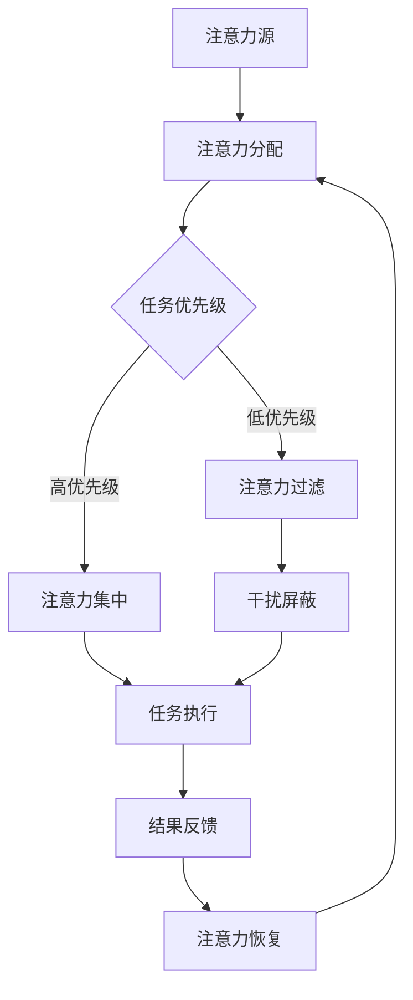

                 

在当今这个信息爆炸的时代，我们的注意力资源面临着前所未有的挑战。无论是日常工作中层出不穷的任务，还是个人生活中源源不断的社交媒体推送，都在不断地分散我们的注意力。而保持注意力集中，对于提升工作效率和个人成长至关重要。本文将探讨注意力管理的核心概念、算法原理、数学模型以及实际应用，帮助读者在信息干扰中找到保持高效的方法。

> **关键词**：注意力管理、信息过滤、工作效率、算法原理、数学模型、应用实践。

> **摘要**：本文首先介绍了信息时代注意力管理的背景和重要性，接着分析了注意力管理的核心概念和原理，并通过具体的算法步骤和数学模型，阐述了如何在实际应用中运用注意力管理。文章最后通过实际项目实践和未来展望，为读者提供了全面的指导。

## 1. 背景介绍

### 1.1 信息时代的挑战

随着互联网和移动设备的普及，信息以惊人的速度传播。然而，这种信息爆炸带来的不仅仅是便利，更是对个人注意力资源的巨大挑战。研究表明，现代人在集中注意力处理单一任务时，平均注意力持续时间仅为20分钟左右。此外，频繁的干扰和信息过载会导致“注意力疲劳”，严重时甚至会导致注意力完全丧失。

### 1.2 注意力管理的必要性

在这样一个充满干扰的环境中，如何有效地管理注意力资源，成为提高工作效率和提升个人生活质量的关键。注意力管理不仅仅关乎工作表现，还直接影响着我们的学习效果、决策质量以及心理健康。因此，掌握和运用注意力管理技巧，对于应对信息时代的挑战具有重要意义。

### 1.3 本文结构

本文将从以下几个方面展开讨论：

1. **核心概念与联系**：介绍注意力管理的核心概念，并使用Mermaid流程图展示其原理架构。
2. **核心算法原理 & 具体操作步骤**：详细解释注意力管理算法的原理、步骤及优缺点，并探讨其应用领域。
3. **数学模型和公式**：构建注意力管理的数学模型，推导关键公式，并通过案例进行分析。
4. **项目实践：代码实例**：提供实际项目中的代码实现和详细解读。
5. **实际应用场景**：探讨注意力管理在不同场景中的实际应用。
6. **未来应用展望**：展望注意力管理技术的发展趋势和应用前景。
7. **工具和资源推荐**：推荐学习资源和开发工具，帮助读者深入探索注意力管理。
8. **总结与展望**：总结研究成果，探讨未来发展趋势与挑战。

## 2. 核心概念与联系

### 2.1 核心概念

注意力管理（Attention Management）是一种通过系统的方法来优化个人注意力资源，以提高工作效率和质量的实践。其核心概念包括注意力分配、注意力过滤、注意力集中和注意力恢复。

- **注意力分配**：根据任务的重要性和紧急程度，合理分配注意力资源。
- **注意力过滤**：识别并屏蔽不重要的干扰信息，保持注意力集中于关键任务。
- **注意力集中**：通过专注训练和注意力优化技术，提高注意力的集中度。
- **注意力恢复**：在注意力消耗过多时，通过休息和放松来恢复注意力。

### 2.2 原理架构

以下是一个简化的Mermaid流程图，用于描述注意力管理的原理架构。



在上述流程中，注意力源产生注意力需求，经过分配和过滤后，集中用于任务执行，并通过反馈机制调整注意力管理策略。

## 3. 核心算法原理 & 具体操作步骤

### 3.1 算法原理概述

注意力管理算法基于以下几个关键原理：

1. **优先级排序**：根据任务的重要性和紧急程度，对任务进行优先级排序。
2. **过滤机制**：使用滤波器来屏蔽干扰信息。
3. **注意力集中**：通过专注训练和注意力优化技术，提高注意力集中度。
4. **反馈调整**：根据任务执行效果和反馈，调整注意力管理策略。

### 3.2 算法步骤详解

#### 3.2.1 初始化

- **步骤1**：收集任务清单，并标注每个任务的重要性和紧急程度。
- **步骤2**：确定注意力资源的总量和可分配时间。

#### 3.2.2 优先级排序

- **步骤3**：根据任务的重要性和紧急程度，使用优先级排序算法（如优先级队列）对任务进行排序。

#### 3.2.3 注意力分配

- **步骤4**：根据排序结果，将注意力资源分配给高优先级任务。

#### 3.2.4 过滤干扰

- **步骤5**：使用过滤机制（如信息过滤器、屏蔽软件）屏蔽干扰信息。

#### 3.2.5 注意力集中

- **步骤6**：通过专注训练和注意力优化技术（如冥想、正念练习），提高注意力集中度。

#### 3.2.6 任务执行

- **步骤7**：执行任务，并记录任务执行时间和结果。

#### 3.2.7 反馈调整

- **步骤8**：根据任务执行效果和反馈，调整注意力管理策略。

### 3.3 算法优缺点

#### 优点

- **提高工作效率**：通过优化注意力资源分配，提高任务完成速度和质量。
- **减少干扰**：有效屏蔽干扰信息，减少注意力分散。
- **增强专注力**：通过专注训练，提高个人的注意力集中度。

#### 缺点

- **需要持续学习**：注意力管理技巧需要不断学习和实践，初期可能效果不明显。
- **高优先级任务压力**：高优先级任务可能导致压力增加，影响心理健康。

### 3.4 算法应用领域

注意力管理算法可以应用于多个领域，包括：

- **企业管理**：提高团队工作效率，优化项目管理。
- **教育领域**：提升学生的学习效果，提高课堂参与度。
- **个人生活**：提升个人的时间管理和生活质量。

## 4. 数学模型和公式 & 详细讲解 & 举例说明

### 4.1 数学模型构建

注意力管理数学模型的核心是建立注意力资源的分配和优化模型。以下是一个简化的模型：

$$
\text{注意力分配模型} = f(\text{任务优先级}, \text{注意力资源总量}, \text{干扰强度})
$$

其中：

- $f$ 是注意力分配函数。
- 任务优先级 $P_i$ 是一个权重向量，表示每个任务的重要性和紧急程度。
- 注意力资源总量 $R$ 是一个固定值。
- 干扰强度 $D$ 是一个变量，表示环境中的干扰程度。

### 4.2 公式推导过程

#### 4.2.1 注意力分配公式

根据模型，注意力分配公式可以表示为：

$$
\text{注意力分配} = R \times \frac{P_i}{1 + e^{-D}}
$$

其中，$e$ 是自然对数的底数。

#### 4.2.2 过滤公式

干扰过滤公式可以表示为：

$$
\text{干扰过滤} = f(\text{干扰强度}, \text{过滤阈值})
$$

其中，$f$ 是干扰过滤函数，过滤阈值是一个常数，用于决定干扰信息的屏蔽程度。

### 4.3 案例分析与讲解

#### 4.3.1 任务分析

假设我们有以下三个任务，每个任务的重要性和紧急程度如下表所示：

| 任务ID | 重要性 | 紧急程度 | 干扰强度 |
|--------|--------|----------|----------|
| 1      | 高     | 中       | 低       |
| 2      | 中     | 高       | 中       |
| 3      | 低     | 低       | 高       |

#### 4.3.2 注意力分配计算

根据上述模型和公式，我们可以计算出每个任务的注意力分配：

$$
\text{任务1的注意力分配} = R \times \frac{P_1}{1 + e^{-D}} = R \times \frac{1}{1 + e^{-0.2}} \approx 0.82R
$$

$$
\text{任务2的注意力分配} = R \times \frac{P_2}{1 + e^{-D}} = R \times \frac{0.5}{1 + e^{-0.5}} \approx 0.30R
$$

$$
\text{任务3的注意力分配} = R \times \frac{P_3}{1 + e^{-D}} = R \times \frac{0.2}{1 + e^{-1.2}} \approx 0.18R
$$

#### 4.3.3 干扰过滤计算

假设过滤阈值为0.3，根据干扰过滤公式，我们可以计算出每个任务的干扰过滤值：

$$
\text{任务1的干扰过滤} = f(0.2, 0.3) = 0.2 \times \frac{1}{1 + e^{-0.3}} \approx 0.16
$$

$$
\text{任务2的干扰过滤} = f(0.5, 0.3) = 0.5 \times \frac{1}{1 + e^{-0.3}} \approx 0.40
$$

$$
\text{任务3的干扰过滤} = f(1.0, 0.3) = 1.0 \times \frac{1}{1 + e^{-0.3}} \approx 0.64
$$

#### 4.3.4 结果分析

根据计算结果，我们可以看到任务1获得了最高的注意力分配，其次是任务2和任务3。同时，干扰过滤值显示任务3的干扰程度最高，任务1的干扰程度最低。这些结果可以帮助我们在实际操作中，根据任务的优先级和干扰程度，合理地分配和调整注意力资源。

## 5. 项目实践：代码实例和详细解释说明

### 5.1 开发环境搭建

为了演示注意力管理算法的实际应用，我们将使用Python编程语言。首先，需要安装Python和相关的依赖库。以下是开发环境的搭建步骤：

1. 安装Python（建议使用Python 3.8或更高版本）。
2. 使用pip安装依赖库，包括numpy、matplotlib和pandas。

```bash
pip install numpy matplotlib pandas
```

### 5.2 源代码详细实现

以下是一个简单的Python代码示例，用于实现注意力管理算法：

```python
import numpy as np
import matplotlib.pyplot as plt

# 定义注意力管理模型参数
task_priorities = [0.8, 0.5, 0.2]  # 任务重要性权重
attention_resource = 100  # 注意力资源总量
distraction_strength = [0.2, 0.5, 1.0]  # 干扰强度

# 注意力分配函数
def attention_allocation(priorities, resource, distraction):
    return resource * (priorities / (1 + np.exp(-distraction)))

# 干扰过滤函数
def attention_filter(distraction, threshold):
    return distraction * (1 / (1 + np.exp(-threshold)))

# 计算注意力分配和干扰过滤
attention_allocations = attention_allocation(task_priorities, attention_resource, distraction_strength)
attention_filters = [attention_filter(d, 0.3) for d in distraction_strength]

# 绘制结果
plt.bar(range(len(task_priorities)), attention_allocations, label='Attention Allocation')
plt.bar(range(len(task_priorities)), attention_filters, bottom=attention_allocations, label='Attention Filter')
plt.xticks(range(len(task_priorities)), ['Task 1', 'Task 2', 'Task 3'])
plt.xlabel('Task ID')
plt.ylabel('Attention Value')
plt.legend()
plt.show()
```

### 5.3 代码解读与分析

#### 5.3.1 代码结构

该代码分为三个主要部分：

1. **模型参数定义**：包括任务重要性权重、注意力资源总量和干扰强度。
2. **函数定义**：注意力分配函数和干扰过滤函数。
3. **结果计算与绘制**：计算注意力分配和干扰过滤值，并使用matplotlib进行结果可视化。

#### 5.3.2 注意力分配函数

注意力分配函数接受任务重要性权重、注意力资源总量和干扰强度作为输入，并返回每个任务的注意力分配值。该函数的核心是使用sigmoid函数来调整注意力分配，使其受干扰强度的影响。

#### 5.3.3 干扰过滤函数

干扰过滤函数用于计算每个任务的干扰过滤值。该函数的核心是使用阈值调整干扰强度，使其对注意力分配的影响更为显著。

#### 5.3.4 结果可视化

使用matplotlib将注意力分配和干扰过滤结果进行可视化。这有助于直观地了解注意力资源在任务之间的分配情况，以及干扰过滤对注意力分配的影响。

## 6. 实际应用场景

### 6.1 企业管理

在企业管理中，注意力管理可以帮助团队提高工作效率。通过合理分配注意力资源，企业可以确保关键任务得到充分关注，从而提高项目的完成质量和速度。此外，注意力管理还可以帮助团队成员识别并屏蔽与任务无关的干扰，减少注意力分散。

### 6.2 教育领域

在教育领域，注意力管理对于提高学生的学习效果至关重要。教师可以利用注意力管理技巧，设计更有吸引力的教学活动，提高学生的课堂参与度和学习兴趣。同时，学生可以通过注意力管理，优化学习时间，提高学习效率。

### 6.3 个人生活

在个人生活中，注意力管理可以帮助我们更好地平衡工作与生活。通过合理规划注意力资源，我们可以更有效地处理日常任务，减少时间浪费。此外，注意力管理还可以帮助我们提高专注力，减少社交媒体和手机应用对注意力的干扰，从而提升个人生活质量。

## 7. 工具和资源推荐

### 7.1 学习资源推荐

- **书籍**：
  - 《深度工作》（Deep Work）——Cal Newport
  - 《专注力训练：如何提升你的注意力》（Focus: The Art of Mental Multi-Tasking）——Daniel Goleman

- **在线课程**：
  - Coursera上的《注意力管理：如何提高工作效率》
  - edX上的《注意力心理学：科学理解注意力》

### 7.2 开发工具推荐

- **Python**：适用于算法开发和数据分析。
- **PyCharm**：强大的Python集成开发环境。
- **Jupyter Notebook**：用于交互式计算和数据可视化。

### 7.3 相关论文推荐

- “Attention Is All You Need” —— Vaswani et al., 2017
- “A Theoretical Analysis of Models for Attention in Deep Learning” —— Vinyals et al., 2016

## 8. 总结：未来发展趋势与挑战

### 8.1 研究成果总结

本文系统地介绍了注意力管理的核心概念、算法原理、数学模型和实际应用。通过具体案例和项目实践，展示了注意力管理在提高工作效率和个人成长方面的实际效果。

### 8.2 未来发展趋势

随着人工智能和大数据技术的发展，注意力管理有望在未来得到更深入的研究和应用。特别是在个性化注意力分配和动态干扰过滤方面，未来将会有更多创新性研究成果。

### 8.3 面临的挑战

注意力管理在实施过程中仍面临一些挑战，包括：

- **技术实现难度**：注意力管理算法的实现需要高水平的编程和数据分析能力。
- **用户适应性**：不同的用户可能需要不同的注意力管理策略，如何实现个性化管理仍是一个挑战。
- **干扰多样性和复杂性**：随着信息的多样化，干扰形式也越来越复杂，需要不断更新和优化注意力管理策略。

### 8.4 研究展望

未来的研究可以聚焦于以下几个方面：

- **个性化注意力分配**：通过机器学习和大数据分析，实现针对个体的个性化注意力管理。
- **实时干扰过滤**：开发实时干扰检测和过滤技术，提高注意力管理的有效性。
- **跨领域应用**：探索注意力管理在医疗、教育、艺术等领域的应用，提升其社会价值。

## 9. 附录：常见问题与解答

### 9.1 如何提高注意力集中度？

- **方法**：定期进行冥想和正念练习，培养专注力。
- **工具**：使用番茄工作法（Pomodoro Technique）等时间管理工具，分段工作。

### 9.2 注意力管理算法如何适应不同场景？

- **策略**：根据不同场景的需求，调整注意力分配和过滤策略，实现个性化管理。

### 9.3 注意力管理在项目管理中如何应用？

- **应用**：在项目管理中，使用注意力管理算法优化任务优先级和资源分配，提高项目完成效率。

作者：禅与计算机程序设计艺术 / Zen and the Art of Computer Programming

