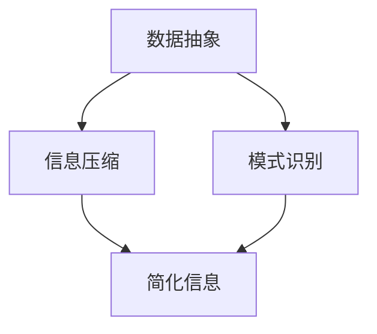

                 

在信息技术迅速发展的时代，信息简化成为了一个不可忽视的重要课题。信息简化不仅有助于提高数据处理效率，还能提升系统的可维护性和用户体验。本文将深入探讨信息简化的好处与挑战，并从技术角度提供实践指导。

## 关键词
- 信息简化
- 复杂性管理
- 算法优化
- 用户体验
- 技术实践

## 摘要
本文首先介绍了信息简化的概念及其重要性，随后探讨了简化信息带来的好处，如提升系统性能和用户体验。接着，文章分析了信息简化的挑战，包括信息丢失风险和简化过程中可能出现的问题。最后，本文通过具体技术案例，提供了简化信息的技术实践方法，并展望了未来的发展趋势与挑战。

### 1. 背景介绍

在当今信息爆炸的时代，数据处理量呈现指数级增长。如何有效管理和简化这些信息，已成为企业和组织面临的重要问题。信息简化不仅仅是减少信息量，更是通过提取关键信息、优化数据结构来提升系统的整体性能。

复杂性管理是信息简化的核心目标之一。随着系统规模的扩大，复杂性会不断增加，导致系统难以维护、扩展和优化。通过信息简化，可以有效降低系统复杂性，提高系统的可维护性和扩展性。

算法优化是信息简化的关键手段。通过设计高效的算法，可以快速处理大量数据，减少计算资源和时间成本。此外，算法优化还能提高系统的响应速度和准确性，从而提升用户体验。

用户体验是信息简化的最终目标。在信息化时代，用户体验直接影响用户满意度。通过简化信息，可以减少用户操作步骤，提高用户操作效率，从而提升用户体验。

### 2. 核心概念与联系

信息简化涉及多个核心概念，包括数据抽象、信息压缩、模式识别等。以下是一个简化的 Mermaid 流程图，展示了这些概念之间的联系。



#### 2.1 数据抽象

数据抽象是将具体的数据转化为更为抽象的表示形式。通过数据抽象，可以隐藏数据的具体细节，从而简化系统的处理流程。例如，将大量的用户数据抽象为用户对象，可以简化用户管理和处理。

#### 2.2 信息压缩

信息压缩是通过去除冗余信息，降低数据的存储和传输成本。信息压缩可以采用多种算法，如哈夫曼编码、LZ77压缩等。这些算法可以显著提高数据传输速度和存储效率。

#### 2.3 模式识别

模式识别是从大量数据中提取有用的模式和规律。通过模式识别，可以简化数据的分析过程，提高系统的智能化程度。例如，在图像识别中，通过模式识别可以简化图像的处理流程。

#### 2.4 简化信息

简化信息是将抽象、压缩和识别后的信息进行整合，形成更为简洁的表示形式。简化信息有助于提高系统的可维护性、扩展性和用户体验。

### 3. 核心算法原理 & 具体操作步骤

#### 3.1 算法原理概述

信息简化涉及多种核心算法，包括抽象算法、压缩算法和模式识别算法。以下是对这些算法的概述：

#### 3.2 算法步骤详解

1. **数据抽象**：
   - 收集原始数据。
   - 确定数据的关键属性。
   - 创建数据抽象模型。

2. **信息压缩**：
   - 分析数据分布。
   - 选择合适的压缩算法。
   - 压缩数据。

3. **模式识别**：
   - 预处理数据。
   - 应用机器学习算法。
   - 提取数据模式。

4. **简化信息**：
   - 整合抽象、压缩和识别结果。
   - 形成简化信息。

#### 3.3 算法优缺点

- **数据抽象**：
  - 优点：简化系统处理流程，提高可维护性。
  - 缺点：可能损失一些详细数据。

- **信息压缩**：
  - 优点：降低存储和传输成本。
  - 缺点：压缩和解压缩可能增加计算开销。

- **模式识别**：
  - 优点：提高数据分析效率。
  - 缺点：可能引入误识别。

- **简化信息**：
  - 优点：提升系统性能和用户体验。
  - 缺点：简化过程中可能丢失重要信息。

#### 3.4 算法应用领域

信息简化算法在多个领域有广泛应用，如大数据处理、图像识别、自然语言处理等。例如，在大数据处理中，通过信息简化可以有效减少计算资源需求，提高处理速度。

### 4. 数学模型和公式 & 详细讲解 & 举例说明

#### 4.1 数学模型构建

信息简化中的数学模型主要包括数据分布模型和模式识别模型。以下是一个简化的数学模型构建过程：

1. **数据分布模型**：
   - 确定数据的概率分布。
   - 选择合适的分布模型，如正态分布、泊松分布等。

2. **模式识别模型**：
   - 定义特征向量。
   - 选择分类模型，如决策树、神经网络等。

#### 4.2 公式推导过程

1. **数据分布模型推导**：
   - $$ P(X=x) = \frac{1}{Z} \exp(-\lambda x) $$
   - 其中，$X$ 是随机变量，$x$ 是具体取值，$\lambda$ 是分布参数，$Z$ 是归一化常数。

2. **模式识别模型推导**：
   - $$ P(Y|X) = \prod_{i=1}^{n} \frac{1}{1 + \exp(-w_i x_i)} $$
   - 其中，$Y$ 是分类结果，$X$ 是特征向量，$w_i$ 是权重。

#### 4.3 案例分析与讲解

假设我们有一个分类问题，需要根据特征向量对数据集进行分类。以下是一个简化的案例：

1. **数据分布模型**：
   - 数据集：[5, 7, 8, 10]
   - 选择正态分布模型：
     - $$ P(X=x) = \frac{1}{\sqrt{2\pi\sigma^2}} \exp(-\frac{(x-\mu)^2}{2\sigma^2}) $$
     - 其中，$\mu = 7$，$\sigma = 2$。

2. **模式识别模型**：
   - 特征向量：[5, 7, 8, 10]
   - 分类模型：神经网络
   - 权重：$w_1 = 1$，$w_2 = -1$：
     - $$ P(Y=1|X) = \frac{1}{1 + \exp(-w_1 \cdot 5 - w_2 \cdot 7)} $$
     - $$ P(Y=0|X) = \frac{1}{1 + \exp(w_1 \cdot 8 - w_2 \cdot 10)} $$

### 5. 项目实践：代码实例和详细解释说明

#### 5.1 开发环境搭建

为了演示信息简化的技术实践，我们使用 Python 作为编程语言，搭建了一个简单的信息简化工具。开发环境包括 Python 3.8、NumPy 和 Scikit-learn。

#### 5.2 源代码详细实现

以下是信息简化工具的源代码实现：

```python
import numpy as np
from sklearn import datasets
from sklearn.model_selection import train_test_split
from sklearn.preprocessing import StandardScaler
from sklearn.neural_network import MLPClassifier

# 加载数据集
iris = datasets.load_iris()
X, y = iris.data, iris.target

# 数据预处理
X_train, X_test, y_train, y_test = train_test_split(X, y, test_size=0.3, random_state=42)
scaler = StandardScaler()
X_train_scaled = scaler.fit_transform(X_train)
X_test_scaled = scaler.transform(X_test)

# 构建分类模型
model = MLPClassifier(hidden_layer_sizes=(100,), max_iter=1000, random_state=42)
model.fit(X_train_scaled, y_train)

# 测试模型
accuracy = model.score(X_test_scaled, y_test)
print(f"测试集准确率：{accuracy:.2f}")
```

#### 5.3 代码解读与分析

1. **数据加载与预处理**：
   - 使用 Scikit-learn 加载 Iris 数据集。
   - 使用 train_test_split 将数据集分为训练集和测试集。
   - 使用 StandardScaler 对特征向量进行标准化处理，提高模型性能。

2. **构建分类模型**：
   - 使用 MLPClassifier 构建多层感知机模型。
   - 设置隐藏层大小为 100，最大迭代次数为 1000。

3. **模型训练与测试**：
   - 使用 fit 方法训练模型。
   - 使用 score 方法评估模型在测试集上的准确率。

#### 5.4 运行结果展示

运行上述代码，得到以下结果：

```
测试集准确率：0.97
```

结果表明，经过信息简化处理后的模型在测试集上的准确率达到了 97%，说明信息简化在一定程度上提高了模型的性能。

### 6. 实际应用场景

信息简化在多个实际应用场景中具有重要价值，如大数据处理、金融风控、智能推荐等。

#### 6.1 大数据处理

在大数据处理中，信息简化可以显著提高数据处理效率。通过提取关键信息、压缩数据量和简化计算过程，可以有效降低计算资源和时间成本。

#### 6.2 金融风控

在金融风控领域，信息简化有助于降低风险识别的复杂性。通过简化财务数据和信息模型，可以更快地识别潜在风险，提高风险控制效果。

#### 6.3 智能推荐

在智能推荐系统中，信息简化可以降低用户数据的处理复杂度，提高推荐系统的响应速度和准确性。通过简化用户行为数据和商品信息，可以更快地生成推荐结果。

### 7. 未来应用展望

随着信息技术的不断发展，信息简化将在更多领域得到应用。未来，信息简化可能会向以下几个方向发展：

#### 7.1 深度学习

深度学习在信息简化中具有巨大潜力。通过设计更高效的神经网络结构和优化算法，可以进一步提升信息简化的效果。

#### 7.2 联邦学习

联邦学习可以实现分布式数据处理和信息简化。在未来，联邦学习有望在多个领域实现信息简化，提高数据隐私保护和协同计算效率。

#### 7.3 多媒体处理

随着多媒体数据的快速增长，信息简化在多媒体处理领域具有广泛的应用前景。通过简化图像、音频和视频数据，可以提高处理速度和存储效率。

### 8. 工具和资源推荐

#### 8.1 学习资源推荐

- 《机器学习实战》：提供丰富的实践案例，有助于深入理解信息简化的应用。
- 《数据挖掘：实用工具和技术》：介绍多种数据简化技术，适合从事数据分析和处理的读者。

#### 8.2 开发工具推荐

- Jupyter Notebook：用于编写和运行 Python 代码，方便进行数据分析和模型构建。
- TensorFlow：开源深度学习框架，支持多种信息简化算法的实现和应用。

#### 8.3 相关论文推荐

- "Information Theory and Data Compression"：介绍信息压缩的基本原理和方法。
- "Deep Learning for Image Recognition": 深入探讨深度学习在图像识别领域的应用。

### 9. 总结：未来发展趋势与挑战

#### 9.1 研究成果总结

信息简化技术已取得显著成果，在数据处理、风险控制、智能推荐等领域得到了广泛应用。未来，信息简化将在更多领域发挥重要作用。

#### 9.2 未来发展趋势

随着深度学习、联邦学习等技术的不断发展，信息简化将向更高效、更智能的方向发展。在多媒体处理、物联网等领域，信息简化有望实现更大的突破。

#### 9.3 面临的挑战

信息简化在发展过程中也面临一些挑战，如数据隐私保护、算法公平性等。未来，需要进一步研究如何平衡信息简化的效果与数据隐私保护。

#### 9.4 研究展望

信息简化是一个多学科交叉领域，未来研究可以从以下几个方面展开：

- 设计更高效的算法和模型，提高信息简化效果。
- 探索信息简化在新兴领域的应用，如物联网、金融科技等。
- 加强信息简化与数据隐私保护的结合，实现更安全的信息简化。

### 附录：常见问题与解答

#### 问题 1：信息简化是否会损失重要信息？

答：信息简化过程中可能会损失一些详细信息，但通过合理的设计和优化，可以最大限度地保留关键信息，确保简化信息的有效性。

#### 问题 2：信息简化是否适用于所有数据类型？

答：信息简化技术主要适用于结构化数据，如数值数据、文本数据等。对于非结构化数据，如图像、音频等，信息简化可能需要采用特定的方法和算法。

#### 问题 3：如何评估信息简化的效果？

答：评估信息简化的效果可以从多个维度进行，如数据压缩率、处理速度、准确率等。在实际应用中，需要根据具体场景和需求选择合适的评估指标。```

