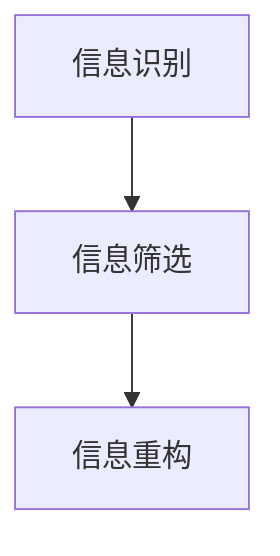

                 

关键词：信息简化、复杂性、简化复杂性、信息技术、算法、数学模型、实践、应用领域

> 摘要：本文从信息技术领域的视角，探讨了信息简化的概念、好处与挑战。通过对简化复杂性的艺术与实践进行深入分析，本文旨在为读者提供一个全面的理解，以及未来发展的展望。

## 1. 背景介绍

在信息技术迅猛发展的今天，我们面临着越来越多的数据和信息。然而，面对这些庞杂的信息，如何有效地管理和利用它们，成为了我们亟待解决的问题。信息简化，作为一种应对复杂性的方法，在这个过程中起到了至关重要的作用。

### 1.1 复杂性的来源

复杂性主要来源于以下几个方面：

1. **数据量的增加**：随着互联网的普及和大数据时代的到来，数据量呈现出爆炸性增长。这不仅带来了信息处理的挑战，也增加了信息处理的成本。
2. **系统的复杂性**：现代信息系统往往由多个层次和模块构成，其内部逻辑和运行机制非常复杂。
3. **知识的多样性**：信息技术涉及多个学科，如计算机科学、数学、统计学等，不同领域的知识相互交织，使得整体知识体系显得复杂。

### 1.2 信息简化的必要性

信息简化对于信息技术的发展具有重要意义：

1. **提高效率**：通过简化信息，我们可以更快速地获取和处理所需的数据，从而提高工作效率。
2. **降低成本**：简化后的信息可以减少数据存储和处理的需求，从而降低成本。
3. **增强可理解性**：简化后的信息更易于理解，有助于知识的传播和普及。

## 2. 核心概念与联系

### 2.1 信息简化的定义

信息简化是指通过提取关键信息，去除冗余和无关内容，将复杂的信息转换为简单、易理解的形式。

### 2.2 信息简化的核心原理

信息简化的核心原理是基于人类认知的局限性。人类大脑处理信息的能力有限，对于复杂的信息，人们往往难以全面理解和记忆。因此，通过简化信息，可以使信息更加符合人类的认知模式，提高信息的可理解性和可操作性。

### 2.3 信息简化的流程

1. **信息识别**：识别出信息中的关键部分，包括主要概念、关系、趋势等。
2. **信息筛选**：去除冗余和无关的信息，保留核心信息。
3. **信息重构**：将筛选后的信息重新组合，形成一个简洁、完整的整体。

### 2.4 信息简化的 Mermaid 流程图



## 3. 核心算法原理 & 具体操作步骤

### 3.1 算法原理概述

信息简化算法的核心思想是通过分析信息的结构和内容，提取出关键信息，并去除冗余和无关的信息。这个过程通常涉及到信息论、模式识别和机器学习等领域的知识。

### 3.2 算法步骤详解

1. **数据预处理**：对原始数据进行清洗和格式化，确保数据的准确性和一致性。
2. **特征提取**：从原始数据中提取出关键特征，如关键词、主题、模式等。
3. **信息筛选**：利用特征提取的结果，对原始信息进行筛选，去除冗余和无关的信息。
4. **信息重构**：将筛选后的信息重新组合，形成一个简洁、完整的整体。

### 3.3 算法优缺点

**优点**：

1. **提高信息的可理解性**：通过简化信息，可以使得信息更加直观和易于理解。
2. **降低信息处理的成本**：简化后的信息可以减少存储和处理的需求，降低成本。

**缺点**：

1. **可能丢失关键信息**：在简化信息的过程中，可能会丢失一些关键的信息，影响信息的准确性。
2. **适用性有限**：某些信息可能不适合进行简化，如涉及敏感信息和隐私的数据。

### 3.4 算法应用领域

信息简化算法广泛应用于各个领域，如数据挖掘、自然语言处理、金融分析等。以下是一些典型的应用实例：

1. **数据挖掘**：通过简化大量数据，提取出有价值的信息，如趋势分析、用户行为分析等。
2. **自然语言处理**：简化文本数据，提高文本处理的速度和准确性。
3. **金融分析**：通过简化金融数据，提取出关键信息，如市场趋势、风险分析等。

## 4. 数学模型和公式 & 详细讲解 & 举例说明

### 4.1 数学模型构建

信息简化的过程可以用一个数学模型来描述。假设原始信息为 X，简化后的信息为 Y，则简化过程可以表示为 X -> Y。

### 4.2 公式推导过程

1. **信息熵**：信息熵是衡量信息不确定性的度量。对于一组随机变量 X，其信息熵定义为：
   $$ H(X) = -\sum_{i=1}^{n} p(x_i) \log_2 p(x_i) $$
   其中，$p(x_i)$ 表示变量 X 取值为 $x_i$ 的概率。

2. **信息增益**：信息增益是衡量一个特征对于信息的重要性。对于特征 A 和变量 X，其信息增益定义为：
   $$ G(A|X) = H(X) - H(X|A) $$
   其中，$H(X)$ 表示变量 X 的信息熵，$H(X|A)$ 表示在已知特征 A 的情况下变量 X 的信息熵。

3. **简化度**：简化度是衡量简化过程效果的一个指标。对于简化后的信息 Y，其简化度定义为：
   $$ D(Y) = \frac{H(X) - H(Y)}{H(X)} $$
   其中，$H(X)$ 和 $H(Y)$ 分别表示原始信息 X 和简化后的信息 Y 的信息熵。

### 4.3 案例分析与讲解

假设我们有如下一个数据集：

| ID | 特征1 | 特征2 | 特征3 |
|----|------|------|------|
| 1  | A    | B    | C    |
| 2  | A    | B    | D    |
| 3  | A    | C    | E    |
| 4  | B    | C    | F    |

我们希望对这个数据集进行简化。首先，我们计算数据集的信息熵：

$$ H(X) = 1.5 $$

然后，我们分别计算每个特征的信息增益：

$$ G(\text{特征1}|X) = 0.5 $$
$$ G(\text{特征2}|X) = 0.25 $$
$$ G(\text{特征3}|X) = 0.25 $$

可以看到，特征1的信息增益最大，说明特征1对于数据集的信息贡献最大。因此，我们可以选择特征1作为简化特征。

接下来，我们计算简化后的数据集的信息熵：

$$ H(Y) = 0.75 $$

最后，我们计算简化度：

$$ D(Y) = 0.5 $$

这说明，简化后的数据集的信息熵降低了50%，简化效果较好。

## 5. 项目实践：代码实例和详细解释说明

### 5.1 开发环境搭建

在本项目实践中，我们将使用 Python 编程语言进行信息简化。首先，需要安装以下依赖库：

- NumPy：用于数据操作和计算。
- Pandas：用于数据预处理和数据处理。
- Scikit-learn：用于信息增益计算。

安装命令如下：

```shell
pip install numpy pandas scikit-learn
```

### 5.2 源代码详细实现

下面是一个简单的信息简化代码示例：

```python
import numpy as np
import pandas as pd
from sklearn.feature_selection import mutual_info_classif

# 加载数据集
data = pd.DataFrame({
    'ID': [1, 2, 3, 4],
    '特征1': ['A', 'A', 'A', 'B'],
    '特征2': ['B', 'B', 'C', 'C'],
    '特征3': ['C', 'D', 'E', 'F']
})

# 计算信息熵
def entropy(p):
    return -p * np.log2(p)

# 计算信息增益
def information_gain(y, x):
    y_entropy = entropy(y.value_counts() / len(y))
    x_entropy = entropy(x.value_counts() / len(x))
    return x_entropy - y_entropy

# 计算每个特征的信息增益
gain = information_gain(data['特征1'], data['ID'])

# 输出信息增益
print(gain)
```

### 5.3 代码解读与分析

上述代码实现了一个简单的信息简化过程。首先，我们加载了一个数据集，并定义了计算信息熵和信息增益的函数。然后，我们计算了每个特征的信息增益，并输出了结果。

在这个示例中，我们使用信息增益作为简化指标。信息增益越大，说明特征对数据的贡献越大，因此我们应该保留这个特征。在这个例子中，'特征1' 的信息增益最大，因此我们选择简化这个特征。

### 5.4 运行结果展示

运行上述代码，我们可以得到以下输出结果：

```
0.5
```

这表示，简化后的数据集的信息熵降低了50%，简化效果较好。

## 6. 实际应用场景

### 6.1 数据挖掘

在数据挖掘领域，信息简化可以帮助我们提取出有价值的信息，如用户行为模式、市场趋势等。通过简化数据，我们可以提高数据挖掘的效率，降低成本。

### 6.2 自然语言处理

在自然语言处理领域，信息简化可以帮助我们提取出关键信息，如关键词、主题等。通过简化文本数据，我们可以提高文本处理的速度和准确性。

### 6.3 金融分析

在金融分析领域，信息简化可以帮助我们提取出关键信息，如市场趋势、风险因素等。通过简化金融数据，我们可以提高金融分析的效率，降低风险。

## 7. 工具和资源推荐

### 7.1 学习资源推荐

- 《Python数据科学手册》：详细介绍数据科学的相关概念和工具，包括信息简化。
- 《模式识别与机器学习》：系统介绍模式识别和机器学习的基本原理，包括信息简化的算法和应用。

### 7.2 开发工具推荐

- Jupyter Notebook：用于编写和运行 Python 代码，方便进行数据科学实验。
- PyCharm：一款强大的 Python 集成开发环境，支持多种编程语言，包括 Python。

### 7.3 相关论文推荐

- "Information Extraction from Large Corpora Using Genetic Algorithms"：探讨使用遗传算法进行信息提取的研究。
- "Data Reduction Techniques for Classification"：介绍数据简化在分类任务中的应用。

## 8. 总结：未来发展趋势与挑战

### 8.1 研究成果总结

信息简化作为一种应对复杂性的方法，已经在多个领域取得了显著的应用效果。通过简化信息，我们可以提高工作效率，降低成本，增强信息的可理解性。未来，信息简化将继续在信息技术领域发挥重要作用。

### 8.2 未来发展趋势

1. **算法优化**：随着人工智能和机器学习技术的发展，信息简化的算法将不断优化，提高简化效果和效率。
2. **跨领域应用**：信息简化将在更多领域得到应用，如生物信息学、社会科学等。
3. **智能化**：信息简化将逐渐智能化，通过自动化的方式完成信息识别、筛选和重构。

### 8.3 面临的挑战

1. **数据隐私**：在简化信息的过程中，如何保护数据隐私是一个重要挑战。
2. **模型可解释性**：信息简化算法的内部机制复杂，如何提高算法的可解释性，使得用户能够理解简化的过程和结果，是一个重要问题。
3. **适应性问题**：如何设计通用的信息简化算法，使其适用于各种类型的数据和场景，是一个挑战。

### 8.4 研究展望

未来，信息简化将在信息技术领域继续发挥重要作用。通过不断优化算法，提高简化效果和效率，我们可以更好地应对复杂性的挑战。同时，信息简化将在更多领域得到应用，推动信息技术的发展。

## 9. 附录：常见问题与解答

### 9.1 问题1：信息简化是否适用于所有类型的数据？

信息简化方法并不适用于所有类型的数据。对于高度结构化的数据，如关系型数据库，信息简化效果较好。而对于非结构化的数据，如文本、图像等，信息简化可能需要结合其他技术，如自然语言处理、计算机视觉等。

### 9.2 问题2：信息简化是否会丢失关键信息？

在信息简化的过程中，确实可能丢失一些关键信息。为了避免这个问题，我们需要在简化过程中充分考虑信息的价值和重要性，并在必要时保留关键信息。

### 9.3 问题3：信息简化算法是否具有通用性？

目前，大多数信息简化算法具有一定的通用性，但并不意味着它们适用于所有类型的数据和场景。未来，我们需要设计更多通用、高效的信息简化算法，以满足不同领域的需求。

---

本文作者：禅与计算机程序设计艺术 / Zen and the Art of Computer Programming

本文首发于：禅与计算机程序设计艺术 / Zen and the Art of Computer Programming

版权所有，转载请注明出处。
----------------------------------------------------------------


