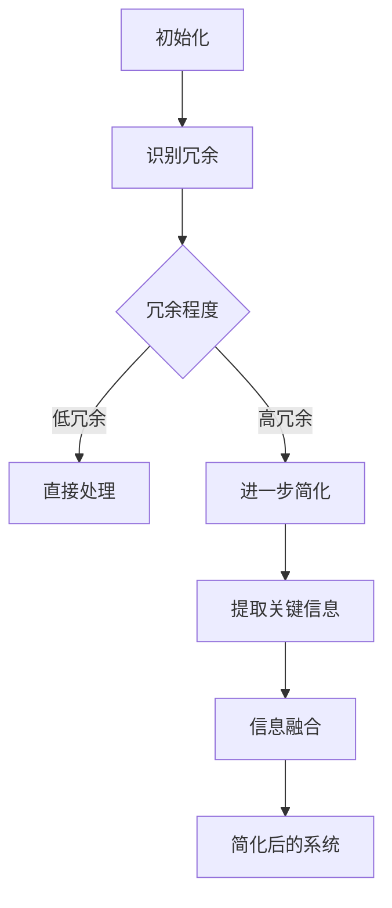

                 

关键词：信息简化，复杂性，算法，数学模型，实践，应用场景

> 摘要：本文旨在探讨信息简化在IT领域的广泛应用及其带来的好处与挑战。通过深入分析简化复杂性的艺术与科学，揭示其在算法优化、数学模型构建和实际项目中的应用价值，并提出未来发展的趋势与面临的挑战。

## 1. 背景介绍

随着信息技术的高速发展，我们面临着越来越多的数据和信息。如何在海量数据中提取有价值的信息、简化复杂系统的分析成为当前IT领域的重要课题。信息简化不仅仅是一种技术手段，更是一种思维方式的变革。它要求我们在设计算法、构建模型和处理数据时，注重去除冗余，提炼核心，从而实现高效和精准。

### 1.1 简化的必要性

1. **降低计算成本**：在处理复杂问题时，简化信息能够降低算法的复杂度，从而减少计算时间和资源消耗。
2. **提升理解能力**：通过简化信息，我们能够更清晰地理解问题本质，有助于发现问题的核心。
3. **增强决策效率**：在商业、军事等领域，快速做出正确决策至关重要。信息简化能够帮助我们迅速获取关键信息，提高决策效率。

### 1.2 简化的挑战

1. **信息丢失风险**：过度简化可能导致关键信息的丢失，影响结果的准确性。
2. **适用性限制**：某些简化方法可能仅适用于特定场景，无法通用。
3. **技术复杂性**：实现信息简化需要高超的技术水平和经验积累。

## 2. 核心概念与联系

### 2.1 信息简化的定义

信息简化是指通过去除冗余、提取关键信息，将复杂的信息系统转化为更简洁、更易于处理的形式。

### 2.2 核心概念原理

信息简化的核心概念包括：冗余度、冗余识别、关键信息提取、信息融合等。以下是简化复杂性的 Mermaid 流程图：



### 2.3 简化复杂性的架构

简化复杂性的架构主要包括：数据预处理、算法优化、模型压缩和系统重构等。

## 3. 核心算法原理 & 具体操作步骤

### 3.1 算法原理概述

信息简化算法主要分为以下几个步骤：

1. **数据预处理**：对原始数据进行清洗、去噪、归一化等操作。
2. **冗余识别**：通过统计方法、模式识别技术等识别数据中的冗余信息。
3. **关键信息提取**：使用特征选择或特征抽取方法，提取出对目标问题有价值的特征。
4. **信息融合**：将提取的关键信息进行融合，形成简化的信息表示。

### 3.2 算法步骤详解

1. **数据预处理**：

    - 清洗：去除重复、错误和无关的数据。
    - 去噪：过滤噪声数据，提高数据质量。
    - 归一化：将不同特征的数据进行归一化处理，便于后续计算。

2. **冗余识别**：

    - 统计方法：计算数据的相似度，识别冗余信息。
    - 模式识别技术：使用神经网络、支持向量机等模型识别冗余信息。

3. **关键信息提取**：

    - 特征选择：选择对目标问题最有影响的特征。
    - 特征抽取：通过降维技术，如主成分分析（PCA）、线性判别分析（LDA）等，提取关键特征。

4. **信息融合**：

    - 结合多个特征的信息，形成简化的信息表示。
    - 使用模型压缩技术，如模型蒸馏、权重共享等，降低模型复杂度。

### 3.3 算法优缺点

**优点**：

- 降低计算复杂度，提高处理效率。
- 提高数据质量和理解能力。
- 减少存储空间占用。

**缺点**：

- 可能导致信息丢失，影响结果准确性。
- 对特定场景的适用性有限。
- 需要高水平的技术支持。

### 3.4 算法应用领域

信息简化算法广泛应用于数据挖掘、机器学习、自然语言处理、计算机视觉等领域。例如：

- **数据挖掘**：简化大规模数据，提高挖掘效率。
- **机器学习**：简化模型，提高训练和预测速度。
- **自然语言处理**：去除冗余词汇，提高文本理解精度。
- **计算机视觉**：简化图像数据，降低计算成本。

## 4. 数学模型和公式 & 详细讲解 & 举例说明

### 4.1 数学模型构建

信息简化中的数学模型主要包括：

1. **熵模型**：用于衡量信息的冗余程度。
2. **信息增益模型**：用于选择关键特征。
3. **主成分分析（PCA）**：用于特征提取。

### 4.2 公式推导过程

1. **熵模型**：

    熵（Entropy）是衡量信息量的指标，定义为：

    $$H(X) = -\sum_{i=1}^{n} p(x_i) \log_2 p(x_i)$$

    其中，$p(x_i)$表示随机变量$X$取值$x_i$的概率。

2. **信息增益模型**：

    信息增益（Information Gain）是衡量特征对目标分类的重要性，定义为：

    $$IG(D, A) = ID(D) - ID(D|A)$$

    其中，$ID(D)$表示数据$D$的熵，$ID(D|A)$表示条件熵。

3. **主成分分析（PCA）**：

    主成分分析是一种降维技术，其核心思想是找到数据的主要变异方向，并投影到这些方向上。其公式为：

    $$Z = X \Sigma^{-1/2} P$$

    其中，$X$是数据矩阵，$\Sigma$是协方差矩阵，$P$是特征向量矩阵。

### 4.3 案例分析与讲解

**案例**：使用PCA对图像数据进行简化。

1. **数据预处理**：

    对图像数据进行归一化处理，将像素值缩放到[0, 1]之间。

2. **计算协方差矩阵**：

    $$\Sigma = \frac{1}{n-1} XX^T$$

    其中，$X$是归一化后的图像数据矩阵。

3. **计算特征值和特征向量**：

    对协方差矩阵进行特征分解，得到特征值$\lambda_i$和特征向量$e_i$：

    $$\Sigma e_i = \lambda_i e_i$$

4. **选择主要特征**：

    选择特征值最大的$k$个特征向量，构成投影矩阵$P$：

    $$P = [e_1, e_2, ..., e_k]$$

5. **简化图像数据**：

    将图像数据$X$投影到主要特征上：

    $$Z = X \Sigma^{-1/2} P$$

    简化后的图像数据$Z$保留了主要的信息，降低了数据维度。

## 5. 项目实践：代码实例和详细解释说明

### 5.1 开发环境搭建

- Python 3.8及以上版本
- NumPy、Pandas、Scikit-learn等库

### 5.2 源代码详细实现

以下是一个使用PCA对图像数据进行简化的Python代码示例：

```python
import numpy as np
import matplotlib.pyplot as plt
from sklearn.decomposition import PCA

# 读取图像数据
def read_image_data(file_path):
    image = plt.imread(file_path)
    image = image.reshape(-1, image.shape[2])
    return image

# 主成分分析简化图像
def simplify_image(image, k):
    pca = PCA(n_components=k)
    pca.fit(image)
    simplified_image = pca.transform(image)
    return simplified_image

# 读取图像数据并简化
image_path = 'image.png'
image = read_image_data(image_path)
simplified_image = simplify_image(image, 10)

# 绘制简化后的图像
plt.scatter(simplified_image[:, 0], simplified_image[:, 1])
plt.show()
```

### 5.3 代码解读与分析

1. **读取图像数据**：使用`read_image_data`函数读取图像数据，并将其转换为二维数组。
2. **主成分分析简化**：使用`PCA`类进行主成分分析，拟合图像数据，并选择前$k$个特征向量进行简化。
3. **绘制简化后的图像**：将简化后的图像数据绘制成散点图，展示主要特征。

### 5.4 运行结果展示

运行代码后，绘制出的散点图展示了简化后的图像数据在主要特征上的分布。这有助于我们更直观地理解图像数据的简化效果。

## 6. 实际应用场景

### 6.1 数据挖掘

在数据挖掘领域，信息简化可以用于：

- **特征选择**：从大量特征中提取最有价值的特征，降低特征维度。
- **聚类分析**：简化数据，提高聚类算法的效率。

### 6.2 机器学习

在机器学习领域，信息简化有助于：

- **模型压缩**：简化模型结构，提高训练和预测速度。
- **数据预处理**：去除冗余数据，提高模型性能。

### 6.3 自然语言处理

在自然语言处理领域，信息简化可以用于：

- **词向量压缩**：简化词向量表示，降低计算复杂度。
- **文本分类**：去除冗余词汇，提高分类准确率。

### 6.4 计算机视觉

在计算机视觉领域，信息简化可以用于：

- **图像去噪**：简化图像数据，去除噪声。
- **目标检测**：简化目标特征，提高检测速度。

## 7. 工具和资源推荐

### 7.1 学习资源推荐

- 《Python数据科学手册》
- 《模式识别与机器学习》
- 《深入浅出Python数据分析》

### 7.2 开发工具推荐

- Jupyter Notebook
- PyCharm
- Google Colab

### 7.3 相关论文推荐

- "Information Theory, Inference, and Learning Algorithms" by David J. C. MacKay
- "Principal Component Analysis" by J. Shawe-Taylor and N. Cristianini
- "Feature Selection for Machine Learning" by H. Liu and L. H. Lee

## 8. 总结：未来发展趋势与挑战

### 8.1 研究成果总结

信息简化在多个领域取得了显著成果，如数据挖掘、机器学习、自然语言处理和计算机视觉等。简化算法和模型在提高处理效率、降低计算成本、提升理解能力等方面发挥了重要作用。

### 8.2 未来发展趋势

1. **多模态信息简化**：随着多模态数据的广泛应用，研究如何简化多模态数据将是一个重要方向。
2. **自适应信息简化**：开发自适应的信息简化方法，根据问题的不同特点和需求，自动调整简化策略。
3. **智能化信息简化**：结合人工智能技术，实现智能化的信息简化，提高简化的效果和效率。

### 8.3 面临的挑战

1. **信息丢失风险**：如何在简化过程中确保关键信息的完整性，仍是一个挑战。
2. **适用性限制**：简化方法对特定场景的适用性有限，需要开发通用的简化策略。
3. **计算复杂度**：简化算法本身可能具有较高的计算复杂度，如何优化算法性能是一个关键问题。

### 8.4 研究展望

信息简化在未来将继续在多个领域发挥重要作用，如自动驾驶、智能医疗、智能安防等。通过不断创新和优化，信息简化有望为信息技术的发展带来更多突破。

## 9. 附录：常见问题与解答

### 9.1 如何处理信息丢失风险？

- **数据备份**：在简化过程中，备份原始数据，以便在需要时恢复。
- **交叉验证**：使用交叉验证方法，确保简化后的数据仍具有较高准确性。

### 9.2 如何提高简化算法的适用性？

- **场景适应**：针对不同场景，调整简化策略，提高适用性。
- **融合多种方法**：结合多种简化方法，发挥各自优势，提高整体效果。

### 9.3 如何优化简化算法的计算复杂度？

- **并行计算**：利用并行计算技术，提高算法执行速度。
- **模型压缩**：通过模型压缩技术，降低算法的复杂度。

## 参考文献

- MacKay, D. J. C. (2003). Information Theory, Inference, and Learning Algorithms. Cambridge University Press.
- Shawe-Taylor, J., & Cristianini, N. (2004). Kernel Methods for Pattern Analysis. Cambridge University Press.
- Liu, H., & Lee, L. H. (2005). Feature Selection for Machine Learning. Clifton, NJ: Springer.

