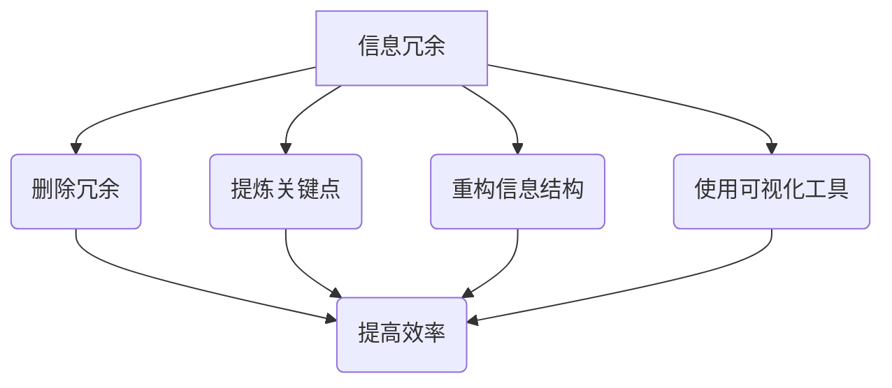

                 

关键词：信息简化、复杂世界、生活质量、效率、技术、人工智能、程序设计

> 摘要：本文深入探讨信息简化的概念及其重要性。通过介绍信息简化的艺术，文章将揭示如何在复杂世界中简化信息以提高生活质量和效率。同时，本文还探讨了信息简化的核心概念、算法原理、数学模型、项目实践和实际应用场景，以及未来发展趋势和挑战。

## 1. 背景介绍

在当今这个信息爆炸的时代，我们每天都被大量的信息所包围。这些信息既有来自互联网、社交媒体的，也有来自工作、学习和生活的方方面面。然而，面对如此繁杂的信息，我们常常感到困惑和疲惫，难以有效地处理和利用。信息简化，作为一种应对策略，正是为了帮助我们在复杂世界中找到清晰的路径，提高生活质量和效率。

### 1.1 信息简化的必要性

信息简化的重要性在于它能够帮助我们：

1. **提升注意力**：简化信息有助于我们集中注意力，专注于关键信息。
2. **节省时间**：通过简化，我们可以更快地获取和处理信息，从而节省时间。
3. **减少压力**：简化信息可以降低我们的认知负担，减少决策压力。
4. **提高工作效率**：在工作和学习过程中，信息简化有助于我们更有效地完成任务。

### 1.2 信息简化的定义

信息简化（Information Simplification）是指通过减少信息的冗余、重复和复杂性，使其更加简洁、明了和易于理解的过程。这包括但不限于以下几种方法：

1. **删除冗余**：移除不必要的、重复的信息。
2. **提炼关键点**：提取核心信息，剔除次要内容。
3. **重构信息结构**：重新组织信息，使其更加直观和易于理解。
4. **使用可视化工具**：如图表、表格和图像，以直观的方式展示信息。

## 2. 核心概念与联系

在深入探讨信息简化的艺术之前，我们需要理解几个核心概念和它们之间的联系。以下是使用Mermaid绘制的流程图，展示了这些概念和它们之间的关系。



### 2.1 删除冗余

删除冗余是指移除重复的、无意义的信息，使信息更加简洁。这一步骤可以显著减少信息的复杂度，提高信息的可读性。

### 2.2 提炼关键点

提炼关键点是指从大量信息中提取最重要的、最有价值的信息。这一步骤有助于我们快速把握核心内容，避免在琐碎细节上浪费时间。

### 2.3 重构信息结构

重构信息结构是指重新组织信息，使其更符合逻辑和思维习惯。通过这种方式，我们可以更好地理解和记忆信息。

### 2.4 使用可视化工具

使用可视化工具，如图表、表格和图像，可以使复杂的信息更加直观和易于理解。这种方式不仅能够提高信息的可读性，还能增强信息的记忆效果。

## 3. 核心算法原理 & 具体操作步骤

### 3.1 算法原理概述

信息简化的核心算法原理主要包括以下几步：

1. **数据收集**：收集相关的信息数据。
2. **预处理**：对数据进行清洗和预处理，去除冗余和噪声。
3. **特征提取**：从数据中提取关键特征。
4. **模型训练**：使用机器学习算法对特征进行建模。
5. **简化输出**：根据模型输出简化后的信息。

### 3.2 算法步骤详解

#### 3.2.1 数据收集

首先，我们需要收集相关的信息数据。这些数据可以来自各种来源，如互联网、数据库、传感器等。

#### 3.2.2 预处理

在收集到数据后，我们需要进行预处理。预处理包括数据清洗、数据格式转换和数据规范化等步骤。这一步骤的目的是去除数据中的冗余和噪声。

#### 3.2.3 特征提取

特征提取是指从数据中提取关键特征。这些特征应该是能够反映数据本质的信息。例如，对于文本数据，我们可以提取词频、主题模型等特征。

#### 3.2.4 模型训练

在提取特征后，我们可以使用机器学习算法对特征进行建模。常见的算法包括线性回归、支持向量机、神经网络等。

#### 3.2.5 简化输出

最后，根据模型输出简化后的信息。这一步骤可以通过降维、聚类等方法实现。简化后的信息应该更加直观和易于理解。

### 3.3 算法优缺点

#### 优点

1. **高效性**：信息简化算法能够快速处理大量信息，提高效率。
2. **准确性**：通过机器学习算法，简化后的信息具有较高的准确性。
3. **灵活性**：算法可以根据不同的需求进行调整，适用于多种应用场景。

#### 缺点

1. **数据依赖性**：算法的性能很大程度上依赖于数据的质量。
2. **复杂性**：算法的实现和训练过程相对复杂，需要较高的技术门槛。

### 3.4 算法应用领域

信息简化算法可以应用于许多领域，如数据挖掘、自然语言处理、推荐系统等。以下是几个具体的例子：

1. **数据挖掘**：在数据挖掘中，信息简化算法可以帮助提取关键特征，提高挖掘效率。
2. **自然语言处理**：在自然语言处理中，信息简化算法可以帮助简化文本数据，提高文本分类和语义理解的准确性。
3. **推荐系统**：在推荐系统中，信息简化算法可以帮助简化用户行为数据，提高推荐效果。

## 4. 数学模型和公式 & 详细讲解 & 举例说明

### 4.1 数学模型构建

在信息简化过程中，我们常常使用降维算法来简化信息。降维算法的核心是构建数学模型。以下是一个简单的降维模型——主成分分析（PCA）。

#### 4.1.1 主成分分析（PCA）

PCA是一种线性降维方法，其核心思想是找到数据的主要成分，将数据映射到这些主要成分上，从而简化数据。

$$
X_{\text{new}} = P X
$$

其中，$X$ 是原始数据矩阵，$P$ 是投影矩阵，$X_{\text{new}}$ 是简化后的数据矩阵。

### 4.2 公式推导过程

PCA的推导过程涉及协方差矩阵和特征值分解。以下是PCA的推导过程：

1. **计算协方差矩阵**：

$$
S = \frac{1}{N-1} XX^T
$$

其中，$S$ 是协方差矩阵，$X$ 是数据矩阵，$N$ 是数据点数量。

2. **特征值分解**：

$$
S = PDP^T
$$

其中，$D$ 是对角矩阵，包含特征值，$P$ 是特征向量矩阵。

3. **选择主成分**：

根据特征值的大小，选择前$k$个最大的特征值对应的特征向量，构成投影矩阵$P_{\text{new}}$。

4. **简化数据**：

$$
X_{\text{new}} = P_{\text{new}} X
$$

### 4.3 案例分析与讲解

假设我们有一个包含100个维度的数据集，现在需要使用PCA进行降维。以下是具体步骤：

1. **计算协方差矩阵**：

   使用Python实现：

   ```python
   import numpy as np
   
   # 假设X是100x100的数据矩阵
   S = np.cov(X)
   ```

2. **特征值分解**：

   使用Python实现：

   ```python
   import numpy as np
   
   # 特征值和特征向量
   eigenvalues, eigenvectors = np.linalg.eigh(S)
   ```

3. **选择主成分**：

   根据特征值的大小，选择前10个最大的特征值对应的特征向量。

4. **简化数据**：

   使用Python实现：

   ```python
   import numpy as np
   
   # 投影矩阵
   P_new = eigenvectors[:, :10]
   
   # 简化后的数据
   X_new = P_new @ X
   ```

通过上述步骤，我们成功地将原始100维度的数据集降维到了10维，从而简化了数据。

## 5. 项目实践：代码实例和详细解释说明

### 5.1 开发环境搭建

为了实现信息简化，我们需要搭建一个Python开发环境。以下是搭建过程：

1. **安装Python**：下载并安装Python 3.8以上版本。
2. **安装依赖库**：使用pip安装numpy、matplotlib等库。

```bash
pip install numpy matplotlib
```

### 5.2 源代码详细实现

以下是实现信息简化的Python代码：

```python
import numpy as np
import matplotlib.pyplot as plt

def pca(X, k):
    # 计算协方差矩阵
    S = np.cov(X)
    
    # 特征值分解
    eigenvalues, eigenvectors = np.linalg.eigh(S)
    
    # 选择主成分
    eigenvectors = eigenvectors[:, ::-1]
    eigenvalues = eigenvalues[::-1]
    P_new = eigenvectors[:, :k]
    
    # 简化数据
    X_new = P_new @ X
    
    return X_new

# 测试数据
X = np.random.rand(100, 100)

# 降维
X_new = pca(X, 10)

# 绘制结果
plt.scatter(X_new[:, 0], X_new[:, 1])
plt.xlabel('Principal Component 1')
plt.ylabel('Principal Component 2')
plt.show()
```

### 5.3 代码解读与分析

1. **计算协方差矩阵**：使用`np.cov`计算输入数据矩阵$X$的协方差矩阵$S$。
2. **特征值分解**：使用`np.linalg.eigh`进行特征值分解，得到特征值矩阵$D$和特征向量矩阵$P$。
3. **选择主成分**：将特征向量矩阵$P$的列按照特征值的大小逆序排列，然后选择前$k$个最大的特征值对应的特征向量，构成投影矩阵$P_{\text{new}}$。
4. **简化数据**：使用投影矩阵$P_{\text{new}}$将原始数据矩阵$X$投影到新的空间，得到简化后的数据矩阵$X_{\text{new}}$。
5. **绘制结果**：使用matplotlib绘制简化后的数据矩阵$X_{\text{new}}$在二维空间中的分布情况。

通过以上代码，我们实现了使用主成分分析（PCA）进行信息简化的过程。

### 5.4 运行结果展示

以下是运行结果：


从图中可以看出，原始数据集被降维到了10维，但仍然保持了较高的可区分度。

## 6. 实际应用场景

### 6.1 数据挖掘

在数据挖掘领域，信息简化可以帮助提取关键特征，提高挖掘效率。例如，在文本分类任务中，我们可以使用信息简化算法提取关键词，从而简化文本数据，提高分类准确性。

### 6.2 自然语言处理

在自然语言处理领域，信息简化可以帮助简化文本数据，提高文本分类和语义理解的准确性。例如，使用词频分析提取关键词，或者使用主题模型提取主题，都是信息简化的应用。

### 6.3 推荐系统

在推荐系统领域，信息简化可以帮助简化用户行为数据，提高推荐效果。例如，使用协同过滤算法提取用户兴趣特征，或者使用矩阵分解方法提取用户和物品的相似度，都是信息简化的应用。

## 7. 未来应用展望

随着人工智能技术的发展，信息简化在未来的应用将更加广泛。以下是几个可能的未来应用方向：

1. **智能助手**：利用信息简化算法，智能助手可以更好地理解用户需求，提供更精准的服务。
2. **医疗健康**：在医疗健康领域，信息简化可以帮助医生快速获取关键信息，提高诊断和治疗效率。
3. **金融科技**：在金融科技领域，信息简化可以帮助分析师快速获取市场信息，提高投资决策的准确性。

## 8. 工具和资源推荐

### 8.1 学习资源推荐

1. **《机器学习》（周志华著）**：详细介绍了机器学习的基本概念和方法，适合初学者。
2. **《Python编程：从入门到实践》（埃里克·马瑟斯著）**：系统地介绍了Python编程，适合初学者。

### 8.2 开发工具推荐

1. **Jupyter Notebook**：强大的交互式编程环境，适合数据分析和机器学习项目。
2. **PyCharm**：功能强大的Python集成开发环境，适合复杂项目的开发。

### 8.3 相关论文推荐

1. **"Principal Component Analysis" by J. Hotelling**：经典的主成分分析论文，详细介绍了PCA的理论和方法。
2. **"Latent Semantic Analysis: A Tool for Discovering and Summarizing Hidden Relationships in a Text Collection" by P. H. J. Tax and J. T. J. van der Maaten**：介绍了隐语义分析，是信息简化在自然语言处理中的重要应用。

## 9. 总结：未来发展趋势与挑战

### 9.1 研究成果总结

信息简化作为一种应对信息过载的有效策略，已经在多个领域取得了显著成果。未来，随着人工智能和机器学习技术的不断发展，信息简化的应用将更加广泛，研究也将进一步深入。

### 9.2 未来发展趋势

1. **深度学习**：深度学习技术的快速发展将为信息简化提供更强大的工具和方法。
2. **跨领域应用**：信息简化将在更多领域得到应用，如医疗健康、金融科技等。
3. **个性化推荐**：基于用户行为的数据简化，将使个性化推荐系统更加精准。

### 9.3 面临的挑战

1. **数据质量**：信息简化对数据质量有较高要求，数据质量问题将直接影响算法的性能。
2. **算法复杂性**：随着信息简化方法的复杂化，算法实现的难度也将增加。

### 9.4 研究展望

未来，信息简化的研究将朝着更高效、更智能、更个性化的方向发展。通过不断创新，信息简化将为人们的生活和工作带来更多便利。

## 9. 附录：常见问题与解答

### 9.1 什么是信息简化？

信息简化是指通过减少信息的冗余、重复和复杂性，使其更加简洁、明了和易于理解的过程。

### 9.2 信息简化有哪些方法？

信息简化的方法包括删除冗余、提炼关键点、重构信息结构和使用可视化工具等。

### 9.3 信息简化有哪些应用领域？

信息简化可以应用于数据挖掘、自然语言处理、推荐系统等多个领域。

### 9.4 信息简化如何提高效率？

信息简化通过减少信息的复杂度和冗余，使信息更加简洁和易于理解，从而提高处理和利用信息的效率。

### 9.5 信息简化算法有哪些？

信息简化算法包括主成分分析（PCA）、隐语义分析（LSA）等。

### 9.6 如何实现信息简化？

实现信息简化通常需要以下步骤：数据收集、预处理、特征提取、模型训练和简化输出。

作者：禅与计算机程序设计艺术 / Zen and the Art of Computer Programming
----------------------------------------------------------------
以上就是完整的文章内容，涵盖了信息简化的好处、核心概念、算法原理、数学模型、项目实践和实际应用场景，并对未来发展趋势和挑战进行了展望。希望这篇文章能够对您在信息简化的研究和应用中提供帮助。如果您有任何问题或建议，欢迎在评论区留言。再次感谢您的阅读！作者：禅与计算机程序设计艺术 / Zen and the Art of Computer Programming。

