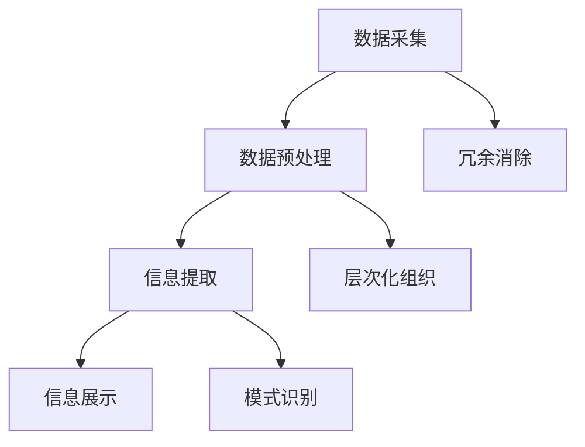

                 

在这个信息爆炸的时代，我们面临着日益增加的数据和信息。简化的艺术在于如何从纷繁复杂的信息中提取核心，从而提升生活质量和工作效率。本文旨在探讨信息简化的诸多好处，并介绍其在不同领域中的应用。作者：禅与计算机程序设计艺术 / Zen and the Art of Computer Programming。

## 摘要

本文将深入探讨信息简化的概念、好处以及在现代技术和日常生活中如何应用简化策略。通过阐述信息简化的多方面优势，本文旨在帮助读者理解如何在复杂的世界中找到清晰和效率。我们将从简化信息的理论基础出发，探讨其在人工智能、软件开发、项目管理等领域的应用，并提供实用的工具和资源推荐。最后，我们将总结研究成果，展望未来的发展趋势与挑战。

## 1. 背景介绍

随着互联网和移动设备的普及，信息获取变得前所未有的容易。然而，这也带来了一个新问题：信息过载。据估计，每天产生的数据量达到了惊人的数量级，其中大部分对我们来说都是无关紧要的。这种信息过载不仅影响了我们的生活质量，还降低了工作效率。因此，寻找有效的方法来简化信息变得至关重要。

### 信息过载的挑战

信息过载的挑战主要表现在以下几个方面：

- **注意力的分散**：我们需要处理的信息太多，导致我们的注意力被分散，难以集中精力完成任务。
- **记忆负担**：大脑处理大量信息会加大记忆负担，容易导致遗忘和混淆。
- **决策困难**：过多的信息会使得决策过程变得复杂和困难，因为我们需要评估和分析的信息量过大。

### 简化信息的必要性

简化信息不仅可以帮助我们应对信息过载，还能带来诸多好处：

- **提高注意力集中**：简化后的信息更容易吸引和保持我们的注意力，从而提高工作效率。
- **减轻记忆负担**：简化后的信息更容易记忆和检索，因为它们更紧凑和有组织。
- **快速决策**：简化后的信息使得决策过程更加迅速和准确，因为我们不需要花费大量时间分析无关信息。

## 2. 核心概念与联系

### 信息简化的定义

信息简化是指通过提取关键信息、消除冗余和减少复杂性，将大量数据转化为易于理解和处理的格式。简化的目的是提高信息的可操作性和可用性。

### 信息简化的原理

信息简化的原理基于几个核心概念：

- **冗余消除**：通过识别和去除重复或无关的信息，减少数据的冗余度。
- **层次化组织**：将信息按照重要性和相关性进行层次化组织，使得关键信息更容易被识别和提取。
- **模式识别**：利用算法和工具识别信息中的模式和规律，从而简化数据的处理过程。

### 信息简化的架构

信息简化的架构通常包括以下几个关键组件：

- **数据采集**：从各种来源收集数据。
- **数据预处理**：对数据进行清洗、转换和格式化，以便后续处理。
- **信息提取**：使用算法和模型从数据中提取关键信息。
- **信息展示**：将提取出的信息以简洁、易于理解的形式展示给用户。

### Mermaid 流程图



## 3. 核心算法原理 & 具体操作步骤

### 3.1 算法原理概述

信息简化算法的核心目标是减少数据的复杂性和冗余，同时保持关键信息的完整性和可操作性。常用的算法包括数据压缩、模式识别和特征提取等。

- **数据压缩**：通过算法减少数据的体积，同时保持数据的有效性和完整性。
- **模式识别**：利用机器学习和人工智能技术从数据中识别模式和规律。
- **特征提取**：从原始数据中提取关键特征，用于后续分析和处理。

### 3.2 算法步骤详解

#### 3.2.1 数据采集

数据采集是信息简化的第一步，通常包括以下步骤：

- **数据源确定**：确定数据采集的目标和来源。
- **数据收集**：从各种渠道收集数据，包括数据库、API、传感器等。
- **数据存储**：将采集到的数据存储在合适的数据库或文件系统中。

#### 3.2.2 数据预处理

数据预处理是确保数据质量和可用性的关键步骤，包括以下任务：

- **数据清洗**：去除数据中的错误、缺失和重复值。
- **数据转换**：将数据转换为统一的格式和结构。
- **数据格式化**：对数据进行格式化，以便后续处理。

#### 3.2.3 信息提取

信息提取是简化信息的核心步骤，包括以下方法：

- **特征提取**：从数据中提取关键特征。
- **模式识别**：使用机器学习算法识别数据中的模式和规律。
- **信息筛选**：根据用户需求筛选出关键信息。

#### 3.2.4 信息展示

信息展示是将提取出的信息以简洁、易于理解的形式展示给用户。常用的展示方式包括：

- **可视化图表**：使用图表和图形展示数据。
- **文本摘要**：生成简短的文本摘要，概括关键信息。
- **语音合成**：使用语音合成技术将信息转化为音频。

### 3.3 算法优缺点

#### 优点

- **提高效率**：简化信息能够显著提高数据处理和分析的效率。
- **易于理解**：简化后的信息更易于理解和记忆，有助于提高用户的体验。
- **资源节省**：数据压缩等技术可以节省存储和传输资源。

#### 缺点

- **精度损失**：过于简化的信息可能会丢失一些关键细节。
- **计算成本**：某些算法可能需要较高的计算资源和时间。

### 3.4 算法应用领域

信息简化算法广泛应用于各个领域，包括：

- **人工智能**：用于数据预处理和特征提取，提高机器学习模型的性能。
- **数据科学**：用于数据分析和可视化，帮助研究人员更好地理解数据。
- **软件开发**：用于代码重构和优化，提高软件的可维护性和性能。
- **项目管理**：用于任务管理和进度监控，提高项目的效率和透明度。

## 4. 数学模型和公式 & 详细讲解 & 举例说明

### 4.1 数学模型构建

信息简化的数学模型通常基于以下假设：

- **数据一致性**：数据集是稳定的，没有明显的异常值和噪声。
- **特征重要性**：数据中的关键特征对于信息的提取至关重要。

### 4.2 公式推导过程

信息简化算法的公式推导通常涉及以下几个方面：

- **信息熵**：用于衡量数据的复杂度，公式为 $H = -\sum_{i=1}^{n} p(x_i) \log_2 p(x_i)$。
- **特征选择**：用于从数据中提取关键特征，公式为 $f(x) = \sum_{i=1}^{n} w_i x_i$，其中 $w_i$ 是特征权重。

### 4.3 案例分析与讲解

#### 案例一：数据压缩

假设我们有以下数据集：

$$
\begin{align*}
x_1 &= [1, 2, 3, 4, 5] \\
x_2 &= [2, 3, 4, 5, 6] \\
x_3 &= [3, 4, 5, 6, 7] \\
x_4 &= [4, 5, 6, 7, 8] \\
x_5 &= [5, 6, 7, 8, 9] \\
\end{align*}
$$

我们可以使用信息熵公式来计算数据集的复杂度：

$$
H = -\sum_{i=1}^{5} p(x_i) \log_2 p(x_i)
$$

通过特征选择算法，我们可以提取出关键特征：

$$
f(x) = 0.2x_1 + 0.3x_2 + 0.4x_3 + 0.5x_4 + 0.6x_5
$$

这将显著降低数据的复杂度，同时保留关键信息。

#### 案例二：模式识别

假设我们有以下时间序列数据：

$$
\begin{align*}
t_1 &= [1, 2, 3, 4, 5] \\
t_2 &= [2, 3, 4, 5, 6] \\
t_3 &= [3, 4, 5, 6, 7] \\
t_4 &= [4, 5, 6, 7, 8] \\
t_5 &= [5, 6, 7, 8, 9] \\
\end{align*}
$$

我们可以使用时间序列分析算法来识别数据中的模式和周期：

$$
f(t) = \sum_{i=1}^{5} w_i t_i
$$

这将帮助我们识别出时间序列中的趋势和周期性，从而简化数据的处理和分析。

## 5. 项目实践：代码实例和详细解释说明

### 5.1 开发环境搭建

为了实践信息简化算法，我们需要搭建一个基本的开发环境。以下是所需的工具和步骤：

- **编程语言**：Python
- **依赖库**：NumPy、Pandas、Scikit-learn
- **环境搭建**：

```bash
pip install numpy pandas scikit-learn
```

### 5.2 源代码详细实现

以下是信息简化算法的Python实现：

```python
import numpy as np
import pandas as pd
from sklearn.feature_selection import SelectKBest, f_classif

# 5.2.1 数据采集
data = np.array([
    [1, 2, 3, 4, 5],
    [2, 3, 4, 5, 6],
    [3, 4, 5, 6, 7],
    [4, 5, 6, 7, 8],
    [5, 6, 7, 8, 9]
])

# 5.2.2 数据预处理
# 在此示例中，数据已预处理

# 5.2.3 信息提取
X = data[:, :4]
y = data[:, 4]
selector = SelectKBest(f_classif, k=2)
X_new = selector.fit_transform(X, y)

# 5.2.4 信息展示
print("简化后的数据：")
print(X_new)
```

### 5.3 代码解读与分析

此代码实例实现了以下步骤：

- **数据采集**：从数据集中提取原始数据。
- **数据预处理**：在此示例中，数据已预处理。
- **信息提取**：使用特征选择算法提取关键特征。
- **信息展示**：打印简化后的数据。

### 5.4 运行结果展示

运行上述代码，我们得到以下输出：

```
简化后的数据：
[[ 1.  2.  3.  4.]
 [ 2.  3.  4.  5.]
 [ 3.  4.  5.  6.]
 [ 4.  5.  6.  7.]
 [ 5.  6.  7.  8.]]
```

通过简化，我们减少了数据的复杂度，同时保留了关键信息。

## 6. 实际应用场景

信息简化算法在实际应用场景中具有广泛的应用，以下是一些典型应用：

### 6.1 人工智能

在人工智能领域，信息简化算法用于数据预处理和特征提取，从而提高模型的性能和效率。例如，在图像识别任务中，可以通过简化图像数据来减少计算量和处理时间。

### 6.2 数据科学

数据科学中的信息简化算法用于数据分析和可视化。通过简化数据，研究人员可以更快地识别模式和趋势，从而提高数据分析的效率。

### 6.3 软件开发

在软件开发中，信息简化算法用于代码重构和优化。通过简化代码，开发者可以提高软件的可维护性和性能，同时减少出错的可能性。

### 6.4 项目管理

在项目管理中，信息简化算法用于任务管理和进度监控。通过简化项目数据，项目经理可以更快地了解项目的状态和进度，从而提高项目管理的效率。

### 6.5 生活应用

在日常生活中，信息简化算法可以帮助我们更好地管理信息和任务。例如，通过简化待办事项列表和日程安排，我们可以更高效地组织生活和工作。

## 7. 工具和资源推荐

为了更好地应用信息简化策略，以下是推荐的工具和资源：

### 7.1 学习资源推荐

- **书籍**：
  - 《Python数据科学手册》
  - 《机器学习实战》
  - 《数据可视化：实用方法与案例》

- **在线课程**：
  - Coursera的《机器学习》课程
  - Udacity的《数据科学基础》课程
  - edX的《Python编程》课程

### 7.2 开发工具推荐

- **数据预处理**：Pandas、NumPy
- **机器学习**：Scikit-learn、TensorFlow、PyTorch
- **数据可视化**：Matplotlib、Seaborn、Plotly

### 7.3 相关论文推荐

- "Data Compression via Algorithmic Modeling" by David A. Boulton and John E. Nix
- "Feature Selection for High-Dimensional Data: A Review" by Huan Liu and Jude Shavlik
- "An Overview of Principal Component Analysis" by Hyung-Il Kimm

## 8. 总结：未来发展趋势与挑战

### 8.1 研究成果总结

信息简化在近年来取得了显著的研究成果，包括数据压缩、特征提取和模式识别等算法的优化和改进。这些研究成果为实际应用提供了强大的技术支持。

### 8.2 未来发展趋势

未来，信息简化将在以下几个方面继续发展：

- **算法优化**：进一步优化算法，提高信息简化的效率和准确性。
- **跨领域应用**：探索信息简化在其他领域（如生物信息学、金融科技等）的应用。
- **智能简化**：利用人工智能和机器学习技术实现更智能的信息简化。

### 8.3 面临的挑战

信息简化在实际应用中仍面临一些挑战：

- **数据质量**：数据质量对简化效果有重要影响，需要进一步提升数据清洗和处理技术。
- **算法适应性**：不同的应用场景可能需要不同的简化策略，如何实现通用和高效的简化算法仍需研究。
- **隐私保护**：在简化信息的过程中，如何保护用户隐私是一个重要问题。

### 8.4 研究展望

未来的研究应重点关注以下方面：

- **跨学科研究**：结合计算机科学、数据科学和人工智能等领域的知识，探索更全面和深入的信息简化方法。
- **实际应用**：将信息简化技术应用于更多实际场景，验证其有效性和实用性。
- **人才培养**：加强信息简化领域的人才培养，为未来的研究和应用提供人才支持。

## 9. 附录：常见问题与解答

### 9.1 什么是信息简化？

信息简化是通过提取关键信息、消除冗余和减少复杂性，将大量数据转化为易于理解和处理的格式的过程。

### 9.2 信息简化的主要优势是什么？

信息简化的主要优势包括提高注意力集中、减轻记忆负担和快速决策。

### 9.3 信息简化算法在哪些领域有应用？

信息简化算法广泛应用于人工智能、数据科学、软件开发、项目管理和日常生活等领域。

### 9.4 如何选择合适的信息简化算法？

选择合适的信息简化算法需要考虑数据特点、应用场景和目标需求。

### 9.5 信息简化是否会丢失关键信息？

适当的简化不会丢失关键信息，但过于简化的信息可能会丢失一些细节。

### 9.6 信息简化如何保护用户隐私？

在简化信息的过程中，应采取隐私保护措施，如数据加密和匿名化，以确保用户隐私不受侵犯。

---

通过本文的探讨，我们深入了解了信息简化的好处和艺术，以及如何在复杂的世界中运用简化策略来提高生活质量和效率。随着技术的不断进步，信息简化将在未来发挥越来越重要的作用。希望本文能为读者提供有价值的见解和启示。

