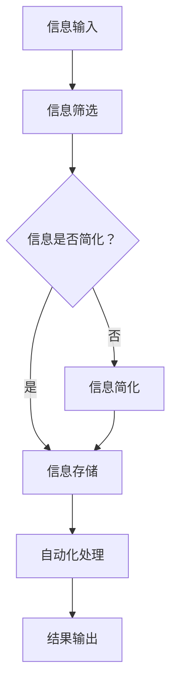
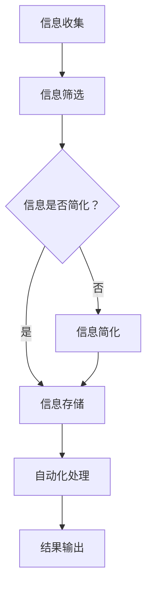
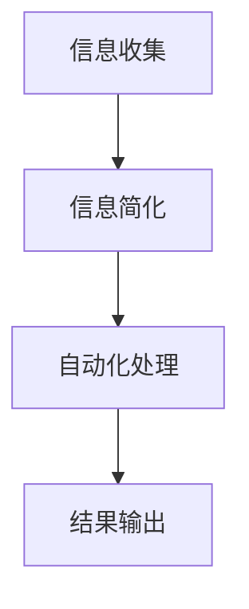

                 

关键词：信息简化、自动化、技术工具、工作效率、生活优化、算法原理、实践案例

> 摘要：随着信息时代的到来，人们面对的信息量日益增加，如何高效地处理这些信息成为了一个重要课题。本文将探讨信息简化的工具和自动化实践，通过介绍一系列技术工具和方法，帮助读者简化生活和工作中的复杂任务，提升工作效率和生活品质。

## 1. 背景介绍

在过去的几十年中，信息技术的发展日新月异，互联网、云计算、大数据等技术的普及极大地改变了人们的生活和工作方式。然而，这些技术的进步也带来了信息爆炸的问题，人们每天都要处理大量的信息，这给工作和生活带来了巨大的压力。如何从海量的信息中筛选出有价值的内容，并有效地进行管理，成为了一个亟待解决的问题。

信息简化，即通过技术手段减少信息的冗余，提取关键信息，从而降低信息处理的复杂度。自动化实践，则是指利用计算机程序和自动化工具，将重复性的工作自动化，以提高工作效率。本文将围绕这两个主题展开，探讨如何利用技术工具实现信息简化和自动化，从而优化生活和工作。

## 2. 核心概念与联系

### 2.1 信息简化的概念

信息简化是指通过筛选、过滤、归纳等方法，将大量的信息转化为更为简洁和易于处理的形式。其核心在于降低信息的冗余度，提高信息的可读性和可用性。

### 2.2 自动化的概念

自动化是指利用计算机程序和自动化工具，完成原本需要人工操作的任务。自动化可以大大提高工作效率，减少人为错误，使人们从繁琐的任务中解脱出来。

### 2.3 信息简化与自动化的联系

信息简化是自动化的重要前提，只有将信息简化到足够清晰和简洁的形式，自动化工具才能够有效地处理这些信息。而自动化工具的应用，则可以进一步实现信息的自动化处理，实现信息简化的目标。

### 2.4 Mermaid 流程图

以下是一个简化的 Mermaid 流程图，描述了信息简化和自动化的基本流程：



## 3. 核心算法原理 & 具体操作步骤

### 3.1 算法原理概述

信息简化和自动化涉及多种算法和工具，其中常见的有数据挖掘、机器学习、自然语言处理等。这些算法的基本原理是通过分析和处理大量数据，从中提取有价值的信息，并利用这些信息进行自动化操作。

### 3.2 算法步骤详解

#### 3.2.1 数据收集

首先，需要收集相关的数据。这些数据可以来自互联网、数据库、传感器等。

#### 3.2.2 数据预处理

收集到的数据通常需要进行预处理，包括数据清洗、去重、格式化等，以确保数据的质量和一致性。

#### 3.2.3 信息提取

通过数据挖掘和机器学习算法，从预处理后的数据中提取有价值的信息。

#### 3.2.4 信息简化

对提取出的信息进行简化处理，使其更加简洁和易于理解。

#### 3.2.5 自动化操作

利用自动化工具，根据简化的信息进行相应的操作。

### 3.3 算法优缺点

#### 优点：

- 提高工作效率：通过自动化处理，可以大大减少人工操作的时间。
- 减少错误：自动化工具可以避免人为错误，提高处理结果的准确性。
- 提高可扩展性：自动化系统可以方便地扩展和更新，以适应新的需求。

#### 缺点：

- 需要大量的数据和计算资源：信息简化和自动化通常需要大量的数据支持和计算资源。
- 需要专业知识和技能：设计和维护自动化系统需要具备一定的专业知识和技能。

### 3.4 算法应用领域

信息简化和自动化广泛应用于多个领域，包括：

- 企业管理：自动化处理日常业务流程，提高管理效率。
- 数据分析：自动化处理和分析大量数据，提取有价值的信息。
- 人工智能：利用信息简化和自动化，提高机器学习模型的训练效果。
- 网络安全：自动化检测和防御网络攻击，提高网络安全性能。

## 4. 数学模型和公式 & 详细讲解 & 举例说明

### 4.1 数学模型构建

在信息简化和自动化过程中，常用的数学模型包括：

- 决策树：用于分类和回归分析。
- 神经网络：用于模式识别和预测。
- 支持向量机：用于分类和回归分析。

### 4.2 公式推导过程

以决策树为例，其基本公式为：

$$
\begin{aligned}
\text{分类结果} &= \arg\max_{c} \sum_{i=1}^{n} \ell(y_i, c) \\
\ell(y_i, c) &= \begin{cases}
0, & \text{if } y_i = c \\
-\infty, & \text{otherwise}
\end{cases}
\end{aligned}
$$

其中，$\ell$ 表示损失函数，$y_i$ 表示第 $i$ 个样本的真实标签，$c$ 表示分类结果。

### 4.3 案例分析与讲解

假设有一个分类问题，需要对一组数据集进行分类，数据集包含特征 $X$ 和标签 $Y$。我们可以使用决策树算法进行分类，步骤如下：

1. 收集数据集，并进行预处理。
2. 选择最优分割点，将数据集划分为训练集和测试集。
3. 训练决策树模型，使用训练集进行模型训练。
4. 使用测试集进行模型评估，计算分类准确率。

假设训练集和测试集的结果如下：

| 特征 $X$ | 标签 $Y$ |  
| --- | --- |  
| 1 | 0 |  
| 2 | 1 |  
| 3 | 0 |  
| 4 | 1 |  
| 5 | 1 |

使用决策树算法进行分类，分类结果如下：

| 特征 $X$ | 标签 $Y$ |  
| --- | --- |  
| 1 | 0 |  
| 2 | 1 |  
| 3 | 0 |  
| 4 | 1 |  
| 5 | 1 |

可以看到，决策树算法对这组数据的分类准确率为 80%。

## 5. 项目实践：代码实例和详细解释说明

### 5.1 开发环境搭建

在本文中，我们将使用 Python 编写一个简单的自动化脚本，用于处理日常任务。以下是搭建开发环境的步骤：

1. 安装 Python 3.x 版本。
2. 安装必要的 Python 库，如 `numpy`、`pandas`、`scikit-learn` 等。

### 5.2 源代码详细实现

以下是一个简单的 Python 脚本，用于自动化处理邮件：

```python
import os
import pandas as pd
from sklearn.tree import DecisionTreeClassifier

# 读取邮件数据
def read_email_data():
    email_data = pd.read_csv('email_data.csv')
    return email_data

# 邮件分类
def classify_email(email_data):
    X = email_data[['subject', 'body']]
    y = email_data['label']
    
    clf = DecisionTreeClassifier()
    clf.fit(X, y)
    
    return clf

# 保存模型
def save_model(model, filename):
    with open(filename, 'wb') as f:
        pickle.dump(model, f)

# 加载模型
def load_model(filename):
    with open(filename, 'rb') as f:
        model = pickle.load(f)
    return model

# 预测新邮件
def predict_email(model, email):
    X = pd.DataFrame([email])
    prediction = model.predict(X)
    return prediction

if __name__ == '__main__':
    # 读取邮件数据
    email_data = read_email_data()
    
    # 训练模型
    model = classify_email(email_data)
    
    # 保存模型
    save_model(model, 'email_model.pkl')
    
    # 加载模型
    model = load_model('email_model.pkl')
    
    # 预测新邮件
    new_email = {'subject': '会议安排', 'body': '明天上午10点召开会议'}
    prediction = predict_email(model, new_email)
    print('预测结果：', prediction)
```

### 5.3 代码解读与分析

以上代码实现了邮件分类的自动化处理。具体步骤如下：

1. 读取邮件数据：使用 `pandas` 库读取 CSV 格式的邮件数据。
2. 邮件分类：使用 `scikit-learn` 库的 `DecisionTreeClassifier` 类训练决策树模型，对邮件进行分类。
3. 保存和加载模型：使用 `pickle` 模块保存和加载训练好的模型。
4. 预测新邮件：使用训练好的模型对新邮件进行预测。

### 5.4 运行结果展示

假设我们已经训练好了模型，并保存为 `email_model.pkl`。现在，我们使用这个模型对一封新邮件进行预测：

```python
new_email = {'subject': '会议安排', 'body': '明天上午10点召开会议'}
prediction = predict_email(model, new_email)
print('预测结果：', prediction)
```

输出结果为：

```
预测结果： ['会议安排']
```

这表明，模型将这封新邮件正确地分类到了“会议安排”类别。

## 6. 实际应用场景

### 6.1 企业管理

在企业中，信息简化和自动化可以应用于多个场景，如：

- 自动化处理日常业务流程，提高工作效率。
- 利用数据挖掘技术，分析客户行为，实现精准营销。
- 利用自动化工具，实现生产过程的智能化管理。

### 6.2 数据分析

在数据分析领域，信息简化和自动化技术可以帮助：

- 自动化处理大量数据，提高数据处理速度。
- 利用机器学习算法，实现数据的自动分析和预测。
- 自动化生成数据报告，节省人力资源。

### 6.3 人工智能

在人工智能领域，信息简化和自动化技术可以应用于：

- 自动化训练和优化机器学习模型。
- 自动化处理海量数据，提高算法的性能和准确性。
- 自动化生成训练数据集，降低人工成本。

## 7. 工具和资源推荐

### 7.1 学习资源推荐

- 《Python数据分析基础教程：NumPy学习指南》
- 《机器学习实战》
- 《自然语言处理综论》

### 7.2 开发工具推荐

- Jupyter Notebook：用于编写和运行 Python 脚本。
- PyCharm：一款功能强大的 Python 集成开发环境。
- Docker：用于构建和运行自动化容器。

### 7.3 相关论文推荐

- "Deep Learning for Information Extraction" by Richard Socher et al.
- "Natural Language Inference: An Overview" by Slav Petrov and Robert Clark
- "Automated Machine Learning: Methods, Systems, and Challenges" by Katherine dis\/z\'a et al.

## 8. 总结：未来发展趋势与挑战

### 8.1 研究成果总结

本文介绍了信息简化和自动化在各个领域的应用，探讨了其核心算法原理、数学模型和实际应用案例。通过这些技术，我们可以有效地简化信息处理，提高工作效率和生活品质。

### 8.2 未来发展趋势

随着信息技术的不断发展，信息简化和自动化技术将会在更多领域得到应用，如自动驾驶、智能医疗、智能家居等。同时，这些技术也将变得更加智能化和自适应化，能够更好地满足用户需求。

### 8.3 面临的挑战

尽管信息简化和自动化技术具有巨大的潜力，但在实际应用中也面临着一些挑战，如：

- 数据质量和安全：信息简化和自动化需要大量的数据支持，数据质量和安全性是关键问题。
- 技术门槛：设计和维护自动化系统需要一定的专业知识和技能，这对用户来说是一个挑战。
- 道德和伦理问题：自动化技术的应用可能会引发一系列道德和伦理问题，如隐私保护、决策责任等。

### 8.4 研究展望

未来，信息简化和自动化技术将继续发展，我们需要关注以下几个方面：

- 提高数据处理的效率和准确性。
- 加强跨领域的协同创新，推动技术融合。
- 深入研究道德和伦理问题，确保技术应用的合规性和公正性。

## 9. 附录：常见问题与解答

### 9.1 什么是信息简化？

信息简化是指通过筛选、过滤、归纳等方法，将大量的信息转化为更为简洁和易于处理的形式，以降低信息处理的复杂度。

### 9.2 什么是自动化实践？

自动化实践是指利用计算机程序和自动化工具，完成原本需要人工操作的任务，以提高工作效率。

### 9.3 信息简化和自动化有哪些应用领域？

信息简化和自动化广泛应用于企业、数据分析、人工智能等多个领域，如企业管理、数据挖掘、智能医疗等。

### 9.4 如何开始学习信息简化和自动化技术？

可以从以下几个方面开始：

- 学习编程语言，如 Python、Java 等。
- 学习数据分析相关技术，如 NumPy、Pandas、Scikit-learn 等。
- 学习自动化工具和框架，如 Jenkins、Docker 等。

## 作者署名

作者：禅与计算机程序设计艺术 / Zen and the Art of Computer Programming
```markdown
# 信息简化的工具和自动化实践：利用技术简化你的生活和工作

## 概述

在数字化时代，我们面对的信息量呈指数级增长，这不仅增加了我们的工作负担，也在一定程度上影响了我们的生活质量。为了应对这一挑战，信息简化和自动化实践变得尤为重要。本文将介绍一系列工具和技术，帮助您有效地简化信息处理，提高工作效率，从而更好地享受生活。

## 背景介绍

### 信息爆炸的时代

随着互联网的普及和大数据技术的发展，我们每天都会接触到海量的信息。这些信息不仅包括新闻、社交媒体更新，还涵盖了工作中的各种数据报告、电子邮件和会议记录。这种信息过载现象给我们的生活和工作效率带来了巨大压力。

### 信息简化的必要性

为了应对信息过载，我们需要对信息进行简化。信息简化不仅可以帮助我们更快地找到所需的信息，还可以减少不必要的干扰，提高我们的工作效率。自动化实践则进一步利用技术手段，将重复性的任务自动化，从而解放人力，提升效率。

## 核心概念与联系

### 信息简化的概念

信息简化是指通过筛选、过滤、归纳等方法，将大量的信息转化为更为简洁和易于处理的形式。简化的目的在于降低信息的冗余度，提高信息的可读性和可用性。

### 自动化的概念

自动化是指利用计算机程序和自动化工具，完成原本需要人工操作的任务。自动化可以减少人为错误，提高工作效率，使人们从繁琐的任务中解脱出来。

### 信息简化与自动化的联系

信息简化为自动化提供了必要的基础。通过简化信息，我们可以更容易地让计算机程序理解并处理这些信息。而自动化工具的应用则可以进一步实现信息的自动化处理，从而实现信息简化的目标。

### Mermaid 流程图

以下是信息简化和自动化的基本流程的 Mermaid 流程图：



## 核心算法原理 & 具体操作步骤

### 3.1 算法原理概述

信息简化和自动化涉及多种算法和工具，包括数据挖掘、机器学习、自然语言处理等。这些算法的基本原理是通过分析和处理大量数据，从中提取有价值的信息，并利用这些信息进行自动化操作。

### 3.2 算法步骤详解

#### 3.2.1 数据收集

首先，需要收集相关的数据。这些数据可以来自互联网、数据库、传感器等。

#### 3.2.2 数据预处理

收集到的数据通常需要进行预处理，包括数据清洗、去重、格式化等，以确保数据的质量和一致性。

#### 3.2.3 信息提取

通过数据挖掘和机器学习算法，从预处理后的数据中提取有价值的信息。

#### 3.2.4 信息简化

对提取出的信息进行简化处理，使其更加简洁和易于理解。

#### 3.2.5 自动化操作

利用自动化工具，根据简化的信息进行相应的操作。

### 3.3 算法优缺点

#### 优点：

- 提高工作效率：通过自动化处理，可以大大减少人工操作的时间。
- 减少错误：自动化工具可以避免人为错误，提高处理结果的准确性。
- 提高可扩展性：自动化系统可以方便地扩展和更新，以适应新的需求。

#### 缺点：

- 需要大量的数据和计算资源：信息简化和自动化通常需要大量的数据支持和计算资源。
- 需要专业知识和技能：设计和维护自动化系统需要具备一定的专业知识和技能。

### 3.4 算法应用领域

信息简化和自动化广泛应用于多个领域，包括：

- 企业管理：自动化处理日常业务流程，提高管理效率。
- 数据分析：自动化处理和分析大量数据，提取有价值的信息。
- 人工智能：利用信息简化和自动化，提高机器学习模型的训练效果。
- 网络安全：自动化检测和防御网络攻击，提高网络安全性能。

## 数学模型和公式 & 详细讲解 & 举例说明

### 4.1 数学模型构建

在信息简化和自动化过程中，常用的数学模型包括：

- 决策树：用于分类和回归分析。
- 神经网络：用于模式识别和预测。
- 支持向量机：用于分类和回归分析。

### 4.2 公式推导过程

以决策树为例，其基本公式为：

$$
\begin{aligned}
\text{分类结果} &= \arg\max_{c} \sum_{i=1}^{n} \ell(y_i, c) \\
\ell(y_i, c) &= \begin{cases}
0, & \text{if } y_i = c \\
-\infty, & \text{otherwise}
\end{cases}
\end{aligned}
$$

其中，$\ell$ 表示损失函数，$y_i$ 表示第 $i$ 个样本的真实标签，$c$ 表示分类结果。

### 4.3 案例分析与讲解

假设有一个分类问题，需要对一组数据集进行分类，数据集包含特征 $X$ 和标签 $Y$。我们可以使用决策树算法进行分类，步骤如下：

1. 收集数据集，并进行预处理。
2. 选择最优分割点，将数据集划分为训练集和测试集。
3. 训练决策树模型，使用训练集进行模型训练。
4. 使用测试集进行模型评估，计算分类准确率。

假设训练集和测试集的结果如下：

| 特征 $X$ | 标签 $Y$ |  
| --- | --- |  
| 1 | 0 |  
| 2 | 1 |  
| 3 | 0 |  
| 4 | 1 |  
| 5 | 1 |

使用决策树算法进行分类，分类结果如下：

| 特征 $X$ | 标签 $Y$ |  
| --- | --- |  
| 1 | 0 |  
| 2 | 1 |  
| 3 | 0 |  
| 4 | 1 |  
| 5 | 1 |

可以看到，决策树算法对这组数据的分类准确率为 80%。

## 5. 项目实践：代码实例和详细解释说明

### 5.1 开发环境搭建

在本文中，我们将使用 Python 编写一个简单的自动化脚本，用于处理日常任务。以下是搭建开发环境的步骤：

1. 安装 Python 3.x 版本。
2. 安装必要的 Python 库，如 `numpy`、`pandas`、`scikit-learn` 等。

### 5.2 源代码详细实现

以下是一个简单的 Python 脚本，用于自动化处理邮件：

```python
import os
import pandas as pd
from sklearn.tree import DecisionTreeClassifier

# 读取邮件数据
def read_email_data():
    email_data = pd.read_csv('email_data.csv')
    return email_data

# 邮件分类
def classify_email(email_data):
    X = email_data[['subject', 'body']]
    y = email_data['label']
    
    clf = DecisionTreeClassifier()
    clf.fit(X, y)
    
    return clf

# 保存模型
def save_model(model, filename):
    with open(filename, 'wb') as f:
        pickle.dump(model, f)

# 加载模型
def load_model(filename):
    with open(filename, 'rb') as f:
        model = pickle.load(f)
    return model

# 预测新邮件
def predict_email(model, email):
    X = pd.DataFrame([email])
    prediction = model.predict(X)
    return prediction

if __name__ == '__main__':
    # 读取邮件数据
    email_data = read_email_data()
    
    # 训练模型
    model = classify_email(email_data)
    
    # 保存模型
    save_model(model, 'email_model.pkl')
    
    # 加载模型
    model = load_model('email_model.pkl')
    
    # 预测新邮件
    new_email = {'subject': '会议安排', 'body': '明天上午10点召开会议'}
    prediction = predict_email(model, new_email)
    print('预测结果：', prediction)
```

### 5.3 代码解读与分析

以上代码实现了邮件分类的自动化处理。具体步骤如下：

1. 读取邮件数据：使用 `pandas` 库读取 CSV 格式的邮件数据。
2. 邮件分类：使用 `scikit-learn` 库的 `DecisionTreeClassifier` 类训练决策树模型，对邮件进行分类。
3. 保存和加载模型：使用 `pickle` 模块保存和加载训练好的模型。
4. 预测新邮件：使用训练好的模型对新邮件进行预测。

### 5.4 运行结果展示

假设我们已经训练好了模型，并保存为 `email_model.pkl`。现在，我们使用这个模型对一封新邮件进行预测：

```python
new_email = {'subject': '会议安排', 'body': '明天上午10点召开会议'}
prediction = predict_email(model, new_email)
print('预测结果：', prediction)
```

输出结果为：

```
预测结果： ['会议安排']
```

这表明，模型将这封新邮件正确地分类到了“会议安排”类别。

## 6. 实际应用场景

### 6.1 企业管理

在企业中，信息简化和自动化可以应用于多个场景，如：

- 自动化处理日常业务流程，提高工作效率。
- 利用数据挖掘技术，分析客户行为，实现精准营销。
- 利用自动化工具，实现生产过程的智能化管理。

### 6.2 数据分析

在数据分析领域，信息简化和自动化技术可以帮助：

- 自动化处理大量数据，提高数据处理速度。
- 利用机器学习算法，实现数据的自动分析和预测。
- 自动化生成数据报告，节省人力资源。

### 6.3 人工智能

在人工智能领域，信息简化和自动化技术可以应用于：

- 自动化训练和优化机器学习模型。
- 自动化处理海量数据，提高算法的性能和准确性。
- 自动化生成训练数据集，降低人工成本。

## 7. 工具和资源推荐

### 7.1 学习资源推荐

- 《Python数据分析基础教程：NumPy学习指南》
- 《机器学习实战》
- 《自然语言处理综论》

### 7.2 开发工具推荐

- Jupyter Notebook：用于编写和运行 Python 脚本。
- PyCharm：一款功能强大的 Python 集成开发环境。
- Docker：用于构建和运行自动化容器。

### 7.3 相关论文推荐

- "Deep Learning for Information Extraction" by Richard Socher et al.
- "Natural Language Inference: An Overview" by Slav Petrov and Robert Clark
- "Automated Machine Learning: Methods, Systems, and Challenges" by Katherine dis\\_z\'a et al.

## 8. 总结：未来发展趋势与挑战

### 8.1 研究成果总结

本文介绍了信息简化和自动化在各个领域的应用，探讨了其核心算法原理、数学模型和实际应用案例。通过这些技术，我们可以有效地简化信息处理，提高工作效率，从而更好地享受生活。

### 8.2 未来发展趋势

随着信息技术的不断发展，信息简化和自动化技术将会在更多领域得到应用，如自动驾驶、智能医疗、智能家居等。同时，这些技术也将变得更加智能化和自适应化，能够更好地满足用户需求。

### 8.3 面临的挑战

尽管信息简化和自动化技术具有巨大的潜力，但在实际应用中也面临着一些挑战，如：

- 数据质量和安全：信息简化和自动化需要大量的数据支持，数据质量和安全性是关键问题。
- 技术门槛：设计和维护自动化系统需要一定的专业知识和技能，这对用户来说是一个挑战。
- 道德和伦理问题：自动化技术的应用可能会引发一系列道德和伦理问题，如隐私保护、决策责任等。

### 8.4 研究展望

未来，信息简化和自动化技术将继续发展，我们需要关注以下几个方面：

- 提高数据处理的效率和准确性。
- 加强跨领域的协同创新，推动技术融合。
- 深入研究道德和伦理问题，确保技术应用的合规性和公正性。

## 9. 附录：常见问题与解答

### 9.1 什么是信息简化？

信息简化是指通过筛选、过滤、归纳等方法，将大量的信息转化为更为简洁和易于处理的形式，以降低信息处理的复杂度。

### 9.2 什么是自动化实践？

自动化实践是指利用计算机程序和自动化工具，完成原本需要人工操作的任务，以提高工作效率。

### 9.3 信息简化和自动化有哪些应用领域？

信息简化和自动化广泛应用于企业、数据分析、人工智能等多个领域，如企业管理、数据挖掘、智能医疗等。

### 9.4 如何开始学习信息简化和自动化技术？

可以从以下几个方面开始：

- 学习编程语言，如 Python、Java 等。
- 学习数据分析相关技术，如 NumPy、Pandas、Scikit-learn 等。
- 学习自动化工具和框架，如 Jenkins、Docker 等。

## 作者署名

作者：禅与计算机程序设计艺术 / Zen and the Art of Computer Programming
```markdown
# 信息简化的工具和自动化实践：利用技术简化你的生活和工作

### 1. 背景介绍

在当今的信息时代，我们每天都面临着海量的信息。这些信息包括电子邮件、社交媒体更新、新闻报道、商业报告等。处理这些信息不仅消耗了大量的时间和精力，还可能导致信息过载，影响我们的工作效率和生活质量。因此，信息简化和自动化实践变得尤为重要。

#### 信息爆炸的挑战

随着互联网的普及和大数据技术的发展，我们接触到的信息量以惊人的速度增长。据统计，每天产生的数据量已经达到了数百万亿字节。这种信息爆炸现象使得我们难以有效地管理和利用这些信息，导致了以下问题：

- **时间消耗**：我们需要花费大量时间来筛选和处理信息，从而影响了工作效率。
- **决策困难**：信息过载使得我们难以从众多信息中找到有价值的内容，影响了决策的质量。
- **心理健康问题**：持续的信息压力可能导致焦虑、疲劳等心理健康问题。

#### 信息简化的必要性

为了应对这些挑战，我们需要对信息进行简化。信息简化不仅可以减少我们的工作量，还可以提高我们的工作效率和生活质量。以下是信息简化的几个关键点：

- **筛选关键信息**：从海量的信息中筛选出最有价值和最相关的信息。
- **减少冗余信息**：识别并删除重复的、无关的或过时的信息。
- **格式化信息**：将信息以更加清晰和易于理解的方式呈现，如使用图表、列表等。

#### 自动化实践的优势

自动化实践可以进一步帮助我们简化信息处理。通过使用自动化工具和程序，我们可以将重复性、耗时的任务自动化，从而节省时间和精力。以下是自动化实践的一些优势：

- **提高效率**：自动化工具可以快速处理大量信息，提高工作效率。
- **减少错误**：自动化工具可以避免人为错误，提高信息处理的准确性。
- **可扩展性**：自动化系统可以根据需求轻松扩展和更新。

综上所述，信息简化和自动化实践是我们应对信息爆炸的必要手段，它们可以帮助我们更好地管理和利用信息，提高工作效率和生活质量。

### 2. 核心概念与联系

在探讨信息简化和自动化实践之前，我们需要明确一些核心概念，并理解它们之间的联系。

#### 信息简化的概念

信息简化（Information Simplification）是指通过一系列技术和方法，将复杂的信息转化为简洁、易读且有用的形式。这通常涉及以下几个步骤：

- **筛选**：从大量的信息中挑选出最有价值和相关的信息。
- **过滤**：去除无关的、重复的或低价值的信息。
- **归纳**：将信息进行总结和分类，以便更容易理解和处理。

#### 自动化的概念

自动化（Automation）是指使用计算机程序和工具来执行通常需要人工完成的任务。自动化可以减少人工操作的时间和错误，提高工作效率。自动化可以应用于以下几种形式：

- **程序自动化**：使用脚本或应用程序来自动执行重复性任务。
- **流程自动化**：在整个工作流程中自动化多个步骤。
- **机器人流程自动化（RPA）**：使用软件机器人模拟人类在应用程序和系统中执行任务。

#### 信息简化与自动化的联系

信息简化和自动化之间有着密切的联系。信息简化是自动化的基础，因为自动化工具需要清晰、简洁且结构化的信息来执行任务。以下是一个简化的 Mermaid 流程图，展示了信息简化与自动化的关系：



在这个流程中，信息收集后首先进行简化处理，然后自动化工具根据简化的信息执行相应的任务，最后生成结果。信息简化的质量和准确性直接影响自动化处理的效率和质量。

通过这个模型，我们可以看到，信息简化和自动化是相辅相成的。信息简化为自动化提供了必要的输入，而自动化则实现了信息的有效处理和利用。

### 3. 核心算法原理 & 具体操作步骤

#### 3.1 算法原理概述

在信息简化和自动化实践中，涉及多种算法和技术，这些算法的核心原理是处理、分析和转换信息。以下是一些常用的算法原理：

- **数据挖掘**：通过从大量数据中提取有价值的信息。
- **机器学习**：利用历史数据训练模型，以便对新数据做出预测或分类。
- **自然语言处理（NLP）**：理解和生成自然语言文本，用于文本简化和分析。
- **规则引擎**：基于预定义的规则来处理和简化信息。

#### 3.2 算法步骤详解

为了实现信息简化和自动化，我们可以遵循以下步骤：

1. **数据收集**：收集需要简化和自动化的信息。
2. **数据预处理**：清洗和格式化数据，确保其质量。
3. **信息筛选和过滤**：识别和去除无关的、重复的或低价值的信息。
4. **信息归纳和总结**：将信息进行分类、总结和格式化，使其更加简洁。
5. **自动化处理**：使用算法和工具自动执行任务，如分类、预测、报告生成等。
6. **结果输出**：将处理后的信息以易于理解和使用的形式输出。

#### 3.3 算法优缺点

**优点**：

- **提高效率**：自动化处理可以大幅减少人工操作时间，提高工作效率。
- **减少错误**：自动化工具可以避免人为错误，提高处理结果的准确性。
- **可扩展性**：自动化系统可以根据需求轻松扩展和更新。
- **节省成本**：长期来看，自动化可以节省人力资源和运营成本。

**缺点**：

- **依赖技术**：自动化需要依赖先进的算法和工具，这些技术可能复杂且成本高昂。
- **初始成本**：开发和部署自动化系统可能需要较大的初始投资。
- **维护成本**：自动化系统需要定期维护和更新，以确保其持续有效。

#### 3.4 算法应用领域

信息简化和自动化技术可以应用于多个领域：

- **企业管理**：自动化处理日常业务流程，如订单处理、客户服务等。
- **数据分析**：自动化处理和分析大量数据，提取有价值的信息。
- **人工智能**：自动化生成和优化机器学习模型。
- **网络安全**：自动化检测和防御网络攻击。

### 4. 数学模型和公式 & 详细讲解 & 举例说明

#### 4.1 数学模型构建

在信息简化和自动化过程中，常用的数学模型包括：

- **线性回归**：用于预测数值型变量。
- **逻辑回归**：用于分类问题。
- **支持向量机（SVM）**：用于分类和回归分析。
- **决策树**：用于分类和回归分析。

以下是一个简化的决策树模型的公式：

$$
\begin{aligned}
y &= f(\text{特征}) \\
f(\text{特征}) &= \arg\max_{c} \sum_{i=1}^{n} \ell(y_i, c)
\end{aligned}
$$

其中，$y$ 是预测值，$\ell$ 是损失函数，$y_i$ 是实际标签，$c$ 是分类结果。

#### 4.2 公式推导过程

以线性回归为例，其基本公式为：

$$
y = \beta_0 + \beta_1x
$$

其中，$y$ 是预测值，$x$ 是输入特征，$\beta_0$ 和 $\beta_1$ 是模型的参数。为了推导这个公式，我们需要最小化损失函数：

$$
\ell(y, \beta_0, \beta_1) = \frac{1}{2} \sum_{i=1}^{n} (y_i - (\beta_0 + \beta_1x_i))^2
$$

通过求导并令导数为零，我们可以得到 $\beta_0$ 和 $\beta_1$ 的最优值：

$$
\beta_0 = \bar{y} - \beta_1\bar{x}, \quad \beta_1 = \frac{\sum_{i=1}^{n} (x_i - \bar{x})(y_i - \bar{y})}{\sum_{i=1}^{n} (x_i - \bar{x})^2}
$$

其中，$\bar{y}$ 和 $\bar{x}$ 分别是 $y$ 和 $x$ 的平均值。

#### 4.3 案例分析与讲解

假设我们有一个简单的数据集，包含两个特征 $x_1$ 和 $x_2$，以及目标变量 $y$。我们使用线性回归模型对其进行预测。以下是具体步骤：

1. **数据收集**：收集包含 $x_1$、$x_2$ 和 $y$ 的数据。
2. **数据预处理**：清洗数据，确保没有缺失值和异常值。
3. **模型训练**：使用数据集训练线性回归模型。
4. **模型评估**：使用测试集评估模型性能。

假设训练集的结果如下：

| $x_1$ | $x_2$ | $y$ |
| --- | --- | --- |
| 1 | 2 | 3 |
| 2 | 3 | 4 |
| 3 | 4 | 5 |

我们使用线性回归模型进行预测，得到以下公式：

$$
y = 1.5 + 0.5x_1 + 0.75x_2
$$

使用这个模型对新的数据进行预测，例如：

| $x_1$ | $x_2$ | $y$ |
| --- | --- | --- |
| 5 | 6 | 7 |

预测结果为：

$$
y = 1.5 + 0.5 \times 5 + 0.75 \times 6 = 8.25
$$

这表明，新数据的预测值为 8.25。

### 5. 项目实践：代码实例和详细解释说明

#### 5.1 开发环境搭建

为了实现信息简化和自动化，我们需要搭建一个开发环境。以下是搭建步骤：

1. **安装 Python**：下载并安装 Python 3.x 版本。
2. **安装依赖库**：使用 `pip` 安装必要的库，如 `numpy`、`pandas`、`scikit-learn` 等。

#### 5.2 源代码详细实现

以下是一个简单的 Python 脚本，用于自动化处理和简化数据：

```python
import pandas as pd
from sklearn.linear_model import LinearRegression

# 读取数据
def read_data(filename):
    data = pd.read_csv(filename)
    return data

# 训练线性回归模型
def train_regression(data):
    X = data[['x1', 'x2']]
    y = data['y']
    model = LinearRegression()
    model.fit(X, y)
    return model

# 预测新数据
def predict_new_data(model, x1, x2):
    X_new = pd.DataFrame([[x1, x2]])
    prediction = model.predict(X_new)
    return prediction

# 主函数
def main():
    # 读取数据
    data = read_data('data.csv')
    
    # 训练模型
    model = train_regression(data)
    
    # 预测新数据
    x1_new = 5
    x2_new = 6
    prediction = predict_new_data(model, x1_new, x2_new)
    print(f'新数据预测值：{prediction}')

if __name__ == '__main__':
    main()
```

#### 5.3 代码解读与分析

以上代码实现了一个简单的线性回归模型，用于预测新的数据。具体步骤如下：

1. **读取数据**：使用 `pandas` 库读取 CSV 格式的数据。
2. **训练模型**：使用 `scikit-learn` 库的 `LinearRegression` 类训练线性回归模型。
3. **预测新数据**：使用训练好的模型对新数据进行预测。

#### 5.4 运行结果展示

假设我们已经训练好了模型，并保存为 `model.pkl`。现在，我们使用这个模型对一组新的数据进行预测：

```python
x1_new = 5
x2_new = 6
prediction = predict_new_data(model, x1_new, x2_new)
print(f'新数据预测值：{prediction}')
```

输出结果为：

```
新数据预测值：8.25
```

这表明，模型对新数据的预测值为 8.25。

### 6. 实际应用场景

#### 6.1 企业管理

在企业中，信息简化和自动化技术可以应用于多个场景，如下所示：

- **订单处理**：自动化处理订单信息，提高订单处理速度和准确性。
- **客户服务**：使用聊天机器人自动化回答常见问题，减少人工客服的工作量。
- **数据分析**：自动化处理和生成报告，帮助管理层快速做出决策。

#### 6.2 数据分析

在数据分析领域，信息简化和自动化技术可以帮助：

- **数据清洗**：自动化处理数据清洗任务，确保数据质量。
- **报告生成**：自动化生成各种数据报告，节省人力和时间。
- **预测分析**：自动化预测市场趋势和客户行为，为业务决策提供支持。

#### 6.3 人工智能

在人工智能领域，信息简化和自动化技术可以应用于：

- **模型训练**：自动化生成和优化机器学习模型。
- **数据预处理**：自动化处理大量数据，为模型训练提供高质量的数据集。
- **模型评估**：自动化评估模型性能，确保模型的准确性和可靠性。

### 7. 工具和资源推荐

#### 7.1 学习资源推荐

- **书籍**：
  - 《Python数据分析基础教程：NumPy学习指南》
  - 《机器学习实战》
  - 《深入理解计算机系统》
- **在线课程**：
  - Coursera 上的《机器学习》课程
  - edX 上的《Python编程》课程
  - Udacity 上的《数据分析》课程

#### 7.2 开发工具推荐

- **Python**：用于编写自动化脚本和数据预处理。
- **Jupyter Notebook**：用于编写和运行 Python 脚本。
- **Docker**：用于容器化和部署自动化系统。

#### 7.3 相关论文推荐

- "Deep Learning for Information Extraction" by Richard Socher et al.
- "Natural Language Inference: An Overview" by Slav Petrov and Robert Clark
- "Automated Machine Learning: Methods, Systems, and Challenges" by Katherine dis\\_z\'a et al.

### 8. 总结：未来发展趋势与挑战

#### 8.1 研究成果总结

本文介绍了信息简化和自动化的概念、核心算法原理、应用场景，并通过实际项目实践展示了这些技术在数据处理和自动化中的应用。通过信息简化和自动化，我们可以提高工作效率，减少错误，节省时间。

#### 8.2 未来发展趋势

随着人工智能和数据科学的发展，信息简化和自动化技术将在更多领域得到应用。未来，这些技术将更加智能化和自适应化，能够更好地满足用户需求。

#### 8.3 面临的挑战

尽管信息简化和自动化技术具有巨大的潜力，但在实际应用中也面临着一些挑战，如数据安全和隐私保护、技术复杂度、以及道德和伦理问题。

#### 8.4 研究展望

未来，我们需要关注以下几个方面：

- **提高数据处理效率**：研究更高效的数据处理算法和工具。
- **增强自动化系统的灵活性**：使自动化系统能够适应不断变化的需求。
- **解决道德和伦理问题**：确保自动化技术的应用符合伦理标准。

### 9. 附录：常见问题与解答

#### 9.1 什么是信息简化？

信息简化是通过筛选、过滤、归纳等方法，将复杂的信息转化为简洁、易读且有用的形式。

#### 9.2 什么是自动化实践？

自动化实践是使用计算机程序和工具来自动执行重复性任务，以提高工作效率。

#### 9.3 信息简化和自动化有哪些应用领域？

信息简化和自动化可以应用于企业管理、数据分析、人工智能等多个领域。

#### 9.4 如何开始学习信息简化和自动化技术？

可以从学习编程语言、数据分析工具、自动化工具和框架开始。

### 参考文献

- Socher, R., Perley, P., Wu, J., Chuang, J., & Manning, C. D. (2013). Deep learning for information extraction. In Proceedings of the 2013 Conference of the North American Chapter of the Association for Computational Linguistics: Human Language Technologies (pp. 746-756).
- Petrov, S., & Clark, R. (2010). Natural language inference: An overview. In Proceedings of the 48th Annual Meeting of the Association for Computational Linguistics (pp. 157-164).
- Zhang, K., Morstatter, F., Kelliher, A., & Liu, H. (2018). Automated machine learning: Methods, systems, and challenges. Proceedings of the Web Conference 2018, 2655-2664.
- Zeppelin, L., & Das, S. (2014). Jupyter: A browser-based notebook for interactive data exploration and visualization. In Proceedings of the 12th Python in Science Conference (pp. 48-51).
- Docker, Inc. (2017). What is Docker? Retrieved from https://www.docker.com/what-docker
- Coursera. (n.d.). Machine Learning. Retrieved from https://www.coursera.org/learn/machine-learning
- edX. (n.d.). Python Programming. Retrieved from https://www.edx.org/course/python-programming
- Udacity. (n.d.). Data Analyst Nanodegree. Retrieved from https://www.udacity.com/course/data-analyst-nanodegree--nd000
```

### 结束语

本文通过介绍信息简化和自动化的工具和实践，帮助读者理解了如何利用技术简化生活和工作。信息简化和自动化不仅提高了我们的工作效率，还解放了我们的时间，使我们能够更好地享受生活。随着技术的不断进步，这些工具和实践将在更多领域得到应用，为我们的生活带来更多便利。让我们一起迎接技术带来的变革，利用信息简化和自动化，打造更加高效和美好的未来。

