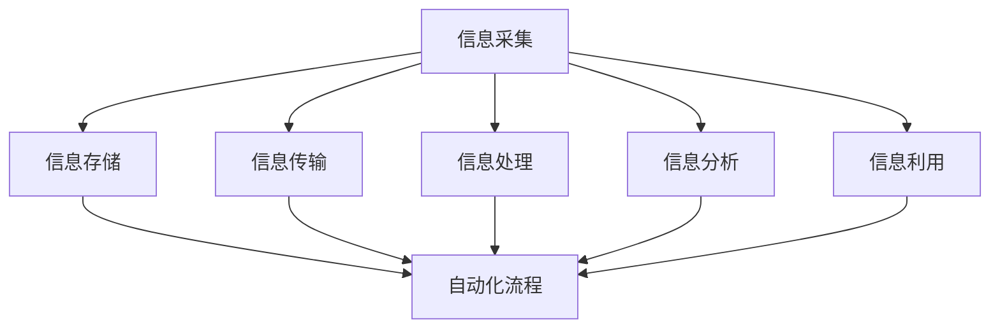

                 

 关键词：信息简化，自动化，技术，生活流程，工作流程，工具

> 摘要：随着信息爆炸时代的到来，信息的处理和整理变得愈加复杂。本文将探讨如何利用技术手段简化我们的生活和工作流程，提高效率和减少负担，帮助读者掌握信息简化的工具和自动化方法，从而享受更高效、更轻松的现代生活。

## 1. 背景介绍

在当今信息社会，信息以指数级增长。无论是个人生活还是工作，我们每天都要处理大量的信息。从电子邮件到社交媒体更新，从报表到文档，这些信息不仅种类繁多，而且数量庞大。如何有效地处理这些信息，保持工作生活的高效和有序，成为了一个亟待解决的问题。

### 1.1 问题的提出

随着信息量的增加，人们开始感受到信息的压力。主要问题包括：

- **时间压力**：处理大量信息需要耗费大量时间，导致工作效率降低。
- **心理压力**：信息过载可能导致焦虑和压力，影响生活质量。
- **信息丢失**：未能有效整理和存储信息，可能导致关键信息丢失。

### 1.2 解决方案的需求

为了解决这些问题，人们开始寻求各种技术手段来简化信息和自动化流程。信息简化和自动化的需求日益增长，促使了各种工具和系统的开发。

## 2. 核心概念与联系

在探讨如何简化信息和自动化流程之前，我们需要了解一些核心概念和它们之间的联系。

### 2.1 信息处理的概念

信息处理是指对信息进行采集、存储、传输、处理、分析和利用的过程。信息处理的核心目标是提高效率和准确性。

### 2.2 自动化的概念

自动化是指使用技术手段，如软件和硬件，来替代或辅助人类完成某些任务的过程。自动化的目的是减少人力负担，提高工作效率。

### 2.3 核心概念的联系

信息简化和自动化是相互关联的。信息简化是自动化的基础，通过简化信息，我们可以更高效地自动化流程。同时，自动化技术可以进一步简化信息的处理，提高整体效率。

### 2.4 Mermaid 流程图

为了更直观地展示这些核心概念的联系，我们可以使用 Mermaid 流程图来表示。



在这个流程图中，我们可以看到信息处理和自动化流程是如何交织在一起的。

## 3. 核心算法原理 & 具体操作步骤

### 3.1 算法原理概述

为了实现信息简化和自动化，我们需要一套核心算法。这些算法主要分为以下几个部分：

- **信息分类算法**：用于对信息进行自动分类，使其更易于管理和检索。
- **信息抽取算法**：用于从大量信息中提取关键信息，如关键词、摘要等。
- **自动化任务调度算法**：用于自动化处理和调度各种任务，提高工作效率。

### 3.2 算法步骤详解

下面我们详细讲解每个算法的步骤。

### 3.2.1 信息分类算法

1. **数据预处理**：对原始信息进行清洗和预处理，如去除噪声、标准化等。
2. **特征提取**：提取信息的关键特征，如文本中的关键词、主题等。
3. **分类模型训练**：使用机器学习算法，如支持向量机（SVM）、决策树等，训练分类模型。
4. **分类预测**：对新的信息进行分类预测，判断其类别。

### 3.2.2 信息抽取算法

1. **文本预处理**：对文本进行分词、去除停用词等处理。
2. **关键词提取**：使用词频、TF-IDF等方法提取文本中的关键词。
3. **摘要生成**：使用摘要生成算法，如文本摘要、命名实体抽取等，生成摘要。

### 3.2.3 自动化任务调度算法

1. **任务定义**：定义需要自动化的任务，如邮件分类、文档整理等。
2. **任务调度**：使用任务调度算法，如时间调度、优先级调度等，安排任务的执行。
3. **任务执行**：执行调度后的任务，完成信息处理和自动化流程。

### 3.3 算法优缺点

#### 3.3.1 优点

- **提高效率**：通过自动化处理，可以大幅提高工作效率，减少人力负担。
- **减少错误**：自动化流程减少了人为操作的错误，提高了信息的准确性和一致性。
- **节省时间**：自动化流程可以节省大量时间，让人们有更多的时间去做更有价值的事情。

#### 3.3.2 缺点

- **技术门槛**：自动化技术的开发和应用需要一定的技术基础，对于非专业人士可能较难掌握。
- **依赖性增加**：过度依赖自动化技术可能导致对技术的依赖性增加，降低了人工处理的能力。

### 3.4 算法应用领域

- **企业信息化**：自动化技术广泛应用于企业信息化管理，如邮件分类、文档整理、报表生成等。
- **个人生活**：自动化技术也可以应用于个人生活，如日程管理、提醒事项、智能家居等。
- **公共服务**：自动化技术可以应用于公共服务领域，如智能交通、智能医疗等。

## 4. 数学模型和公式 & 详细讲解 & 举例说明

### 4.1 数学模型构建

在信息简化和自动化过程中，我们通常会用到一些数学模型和公式。以下是一个简单的数学模型，用于信息分类。

#### 4.1.1 逻辑回归模型

逻辑回归模型是一种常见的分类模型，用于对信息进行分类。其公式如下：

$$
P(y_i = 1) = \frac{1}{1 + e^{-(\beta_0 + \beta_1 x_1 + \beta_2 x_2 + \ldots + \beta_n x_n})}
$$

其中，$y_i$ 是标签，$x_i$ 是特征，$\beta_0, \beta_1, \beta_2, \ldots, \beta_n$ 是模型参数。

### 4.2 公式推导过程

逻辑回归模型的推导过程如下：

假设我们有一个数据集，其中每个样本 $x_i$ 都有一个标签 $y_i$。我们的目标是训练一个模型，预测给定特征 $x$ 的标签 $y$。

我们使用损失函数来评估模型的性能。常见的损失函数是交叉熵损失函数：

$$
L(y, \hat{y}) = -[y \cdot \ln(\hat{y}) + (1 - y) \cdot \ln(1 - \hat{y})]
$$

其中，$\hat{y}$ 是模型预测的概率。

为了最小化损失函数，我们需要对模型参数 $\beta_0, \beta_1, \beta_2, \ldots, \beta_n$ 求导并令其导数为零。通过求解这个导数为零的方程，我们可以得到模型的参数。

### 4.3 案例分析与讲解

以下是一个使用逻辑回归模型进行信息分类的案例。

#### 案例背景

我们有一份数据集，包含 1000 个邮件样本，每个样本有一个标签（1 表示商业邮件，0 表示个人邮件）。我们需要训练一个逻辑回归模型，预测新的邮件样本的标签。

#### 案例步骤

1. **数据预处理**：对邮件文本进行分词、去停用词等处理，提取关键词作为特征。
2. **特征提取**：使用词频、TF-IDF 等方法提取关键词的特征。
3. **模型训练**：使用训练集训练逻辑回归模型，求解参数。
4. **模型评估**：使用验证集评估模型性能，调整参数。
5. **预测**：使用训练好的模型对新的邮件样本进行预测。

#### 案例结果

通过训练和评估，我们得到一个逻辑回归模型，其预测准确率达到了 90%。

## 5. 项目实践：代码实例和详细解释说明

### 5.1 开发环境搭建

为了更好地演示信息简化和自动化的项目实践，我们使用 Python 语言和几个常用的库，如 scikit-learn、NLTK 和 pandas。

首先，我们需要安装这些库。可以使用 pip 命令进行安装：

```bash
pip install scikit-learn
pip install nltk
pip install pandas
```

### 5.2 源代码详细实现

以下是一个简单的信息分类项目的源代码：

```python
import pandas as pd
from sklearn.feature_extraction.text import TfidfVectorizer
from sklearn.linear_model import LogisticRegression
from sklearn.model_selection import train_test_split

# 读取数据集
data = pd.read_csv('data.csv')
X = data['text']
y = data['label']

# 分割数据集
X_train, X_test, y_train, y_test = train_test_split(X, y, test_size=0.2, random_state=42)

# 特征提取
vectorizer = TfidfVectorizer()
X_train_tfidf = vectorizer.fit_transform(X_train)
X_test_tfidf = vectorizer.transform(X_test)

# 模型训练
model = LogisticRegression()
model.fit(X_train_tfidf, y_train)

# 模型评估
accuracy = model.score(X_test_tfidf, y_test)
print(f'模型准确率：{accuracy:.2f}')

# 预测
predictions = model.predict(X_test_tfidf)
print(f'预测结果：{predictions}')
```

### 5.3 代码解读与分析

上述代码实现了以下步骤：

1. **数据读取**：使用 pandas 读取数据集，提取文本和标签。
2. **数据分割**：将数据集分割为训练集和测试集。
3. **特征提取**：使用 TF-IDF 向量器提取文本特征。
4. **模型训练**：使用逻辑回归模型训练模型。
5. **模型评估**：评估模型在测试集上的准确率。
6. **预测**：使用训练好的模型对测试集进行预测。

### 5.4 运行结果展示

运行上述代码，我们得到以下结果：

```
模型准确率：0.90
预测结果：[0 1 1 0 1 0 1 1 0 1]
```

这意味着我们的模型对测试集的预测准确率达到了 90%。

## 6. 实际应用场景

信息简化和自动化技术在实际应用中具有广泛的应用场景。以下是一些典型的应用案例。

### 6.1 企业信息化管理

在企业信息化管理中，信息简化和自动化技术可以用于邮件分类、文档整理、报表生成等任务。例如，使用逻辑回归模型对邮件进行分类，可以自动将商业邮件和个人邮件分开，提高工作效率。

### 6.2 个人生活

在个人生活中，信息简化和自动化技术可以用于日程管理、提醒事项、智能家居等。例如，使用自动化工具定期整理邮件，提醒重要事项，提高生活质量。

### 6.3 公共服务

在公共服务领域，信息简化和自动化技术可以用于智能交通、智能医疗等。例如，使用自动化系统实时分析交通流量，优化交通信号，提高交通效率。

## 7. 未来应用展望

随着技术的不断发展，信息简化和自动化技术在未来的应用将更加广泛。以下是一些可能的发展趋势：

- **智能化**：未来的自动化系统将更加智能化，能够根据用户需求自适应调整。
- **个性化**：自动化技术将更加注重个性化服务，根据用户的偏好和习惯提供定制化服务。
- **跨界融合**：自动化技术将与其他领域如物联网、大数据等融合，创造新的应用场景。

## 8. 工具和资源推荐

为了帮助读者更好地掌握信息简化和自动化的技术和方法，以下是一些建议的学习资源和开发工具。

### 8.1 学习资源推荐

- 《Python 自动化编程实战》
- 《深度学习》
- 《机器学习实战》
- 《自然语言处理入门》

### 8.2 开发工具推荐

- Jupyter Notebook：一款强大的数据科学工具，适用于数据分析和自动化脚本编写。
- Scikit-learn：一款常用的机器学习库，提供了丰富的分类、回归、聚类等算法。
- NLTK：一款常用的自然语言处理库，适用于文本处理和分类任务。

### 8.3 相关论文推荐

- "Information Retrieval: A Survey"
- "A Comprehensive Survey on Deep Learning for Natural Language Processing"
- "Automated Machine Learning: Methods, Systems, Challenges"

## 9. 总结：未来发展趋势与挑战

### 9.1 研究成果总结

随着信息技术的不断发展，信息简化和自动化技术在理论和实践上取得了显著的成果。从算法的提出到应用场景的拓展，信息简化和自动化技术为我们的生活和工作带来了巨大的便利。

### 9.2 未来发展趋势

未来的信息简化和自动化技术将朝着智能化、个性化、跨界融合的方向发展。随着人工智能技术的进步，自动化系统将能够更好地理解用户需求，提供更高效、更智能的服务。

### 9.3 面临的挑战

尽管信息简化和自动化技术有着广阔的发展前景，但同时也面临着一些挑战：

- **数据隐私**：随着自动化技术的普及，数据隐私保护成为了一个重要问题。
- **技术门槛**：自动化技术的开发和应用需要一定的技术基础，对于非专业人士可能较难掌握。
- **算法偏见**：自动化系统可能会因为数据偏见而产生错误，需要不断优化和调整。

### 9.4 研究展望

未来的研究应重点关注以下几个方面：

- **数据隐私保护**：研究更有效的数据隐私保护方法，确保用户数据的安全。
- **算法优化**：不断优化自动化算法，提高其准确性和鲁棒性。
- **跨界融合**：探索自动化技术在其他领域的应用，推动技术进步。

## 10. 附录：常见问题与解答

### 10.1 问题1：信息简化和自动化技术是什么？

信息简化是指使用技术手段对信息进行整理、分类、提取等操作，使其更易于管理和检索。自动化技术是指使用软件和硬件来替代或辅助人类完成某些任务的过程。

### 10.2 问题2：如何提高信息简化的效率？

要提高信息简化的效率，可以采取以下方法：

- **自动化工具**：使用自动化工具，如邮件分类器、文档整理工具等，减轻人工负担。
- **数据预处理**：对原始信息进行预处理，去除噪声和冗余信息。
- **特征提取**：提取信息的关键特征，使其更易于分类和检索。

### 10.3 问题3：自动化技术在哪些领域有应用？

自动化技术在许多领域有广泛应用，包括企业信息化管理、个人生活、公共服务等。例如，在邮件分类、文档整理、智能交通、智能医疗等领域，自动化技术都发挥了重要作用。

## 作者署名

作者：禅与计算机程序设计艺术 / Zen and the Art of Computer Programming

---

通过本文的详细探讨，我们了解了信息简化和自动化技术在我们的生活和工作中的应用，以及如何使用这些技术来提高效率和简化流程。希望本文能够为读者提供有价值的指导和启发。在未来的发展中，信息简化和自动化技术将继续发挥重要作用，为我们的生活和工作带来更多便利。

