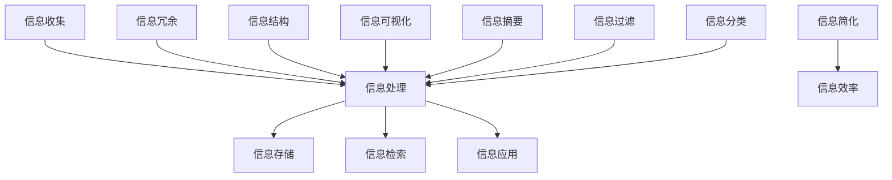

                 

在当今这个信息爆炸的时代，如何从大量的数据和信息中快速找到有用的信息成为了每个人都需要掌握的技能。本文将介绍一些信息简化的技巧和窍门，帮助大家在混乱中找到秩序。本文将从多个角度探讨如何高效地处理信息，包括信息收集、处理、存储、检索和应用。希望通过本文的分享，大家能够提高信息处理能力，更有效地利用信息，提升工作和生活质量。

## 1. 背景介绍

信息简化（Information Simplification）是一种通过消除冗余信息、提取关键信息、建立信息结构等方法，将复杂的信息转化为简洁、易于理解的形式的过程。在信息过载的时代，信息简化变得尤为重要。通过信息简化，我们可以更快地获取所需信息，提高工作效率，减少心理负担。

### 1.1 信息简化的意义

信息简化的意义主要体现在以下几个方面：

- **提高信息处理效率**：通过简化信息，我们可以更快地找到关键信息，减少不必要的阅读和处理时间。
- **减少心理负担**：面对大量的信息，人们容易感到焦虑和困惑。信息简化可以降低信息的复杂性，减少人们的心理负担。
- **提升决策能力**：通过简化信息，我们可以更清晰地看到问题的本质，提高决策能力。
- **增强沟通效果**：简洁明了的信息更容易被人理解和记住，从而提高沟通效果。

### 1.2 信息简化的现状

在当前的信息环境下，信息简化已经成为一种必要的能力。然而，现实情况是，很多人并没有掌握有效的信息简化方法，导致在处理信息时效率低下，甚至陷入信息的海洋中无法自拔。

### 1.3 本文的目标

本文旨在通过介绍一些信息简化的技巧和窍门，帮助大家：

- 掌握信息收集、处理、存储、检索和应用的技巧。
- 提高信息处理能力，减少信息过载带来的困扰。
- 培养良好的信息处理习惯，提升工作和生活质量。

## 2. 核心概念与联系

为了更好地理解信息简化的原理和方法，我们需要先了解一些核心概念和它们之间的联系。以下是一个Mermaid流程图，展示了信息简化的核心概念和它们之间的关系。



### 2.1 信息冗余

信息冗余是指信息中包含不必要的、重复的或者过时的内容。过多的冗余信息会导致信息过载，降低信息处理效率。信息简化的一项重要任务就是去除信息冗余，提高信息的纯度和效率。

### 2.2 信息结构

信息结构是指信息之间的组织形式和层次结构。良好的信息结构有助于人们快速理解和处理信息。通过建立合理的信息结构，我们可以将复杂的信息分解为更易于理解的部分，从而简化信息。

### 2.3 信息可视化

信息可视化是将信息以图形、图表等形式呈现，使人们能够直观地理解和分析信息。信息可视化是信息简化的重要手段之一，它可以将复杂的信息转化为简洁的视觉形式，提高信息处理的效率。

### 2.4 信息摘要

信息摘要是通过对大量信息进行筛选、总结和提炼，提取出关键信息的一种方法。信息摘要可以帮助人们快速了解信息的核心内容，减少阅读和处理时间。

### 2.5 信息过滤

信息过滤是指通过对信息进行筛选，去除无关或低价值的信息，从而提高信息的质量和效率。信息过滤是信息简化的重要步骤，它可以帮助人们专注于有价值的信息。

### 2.6 信息分类

信息分类是指将信息按照一定的标准进行分类和归类。通过信息分类，我们可以更好地组织和管理信息，提高信息检索的效率。

### 2.7 信息简化

信息简化是通过对信息进行去除冗余、提取关键信息、建立信息结构等方法，将复杂的信息转化为简洁、易于理解的形式。信息简化是信息处理的核心目标，它有助于提高信息处理效率和决策能力。

## 3. 核心算法原理 & 具体操作步骤

### 3.1 算法原理概述

信息简化的核心算法主要包括信息提取、信息压缩和信息结构化三个部分。以下是一个简要的算法原理概述。

#### 3.1.1 信息提取

信息提取是指从原始信息中提取出关键信息的过程。其主要目标是去除冗余信息，保留关键信息。信息提取的方法包括关键词提取、主题建模和语义分析等。

#### 3.1.2 信息压缩

信息压缩是指通过压缩算法将信息以更小的形式存储和传输。其主要目的是减少存储空间和提高传输速度。常见的压缩算法有哈夫曼编码、LZ77和LZ78等。

#### 3.1.3 信息结构化

信息结构化是指将信息按照一定的结构和层次进行组织。其主要目的是提高信息的可读性和可理解性。信息结构化的方法包括数据库设计、文档建模和信息可视化等。

### 3.2 算法步骤详解

以下是一个具体的信息简化算法的步骤详解。

#### 3.2.1 信息收集

收集原始信息，可以是文本、图像、音频等多种形式。

#### 3.2.2 信息预处理

对原始信息进行预处理，包括去噪、格式转换等。这一步骤的目的是提高信息的质量和一致性。

#### 3.2.3 信息提取

使用关键词提取、主题建模和语义分析等方法，从预处理后的信息中提取出关键信息。

#### 3.2.4 信息压缩

根据信息的类型和需求，选择合适的压缩算法，对提取出的关键信息进行压缩。

#### 3.2.5 信息结构化

对压缩后的信息进行结构化处理，建立合理的信息结构和层次。

#### 3.2.6 信息存储

将结构化后的信息存储到数据库或文件系统中，便于后续的检索和应用。

#### 3.2.7 信息检索

根据用户的需求，对存储的信息进行检索，返回相关结果。

#### 3.2.8 信息应用

将检索出的信息应用于实际场景，如决策支持、数据分析等。

### 3.3 算法优缺点

#### 优点：

- 提高信息处理效率：通过去除冗余信息和提取关键信息，可以大幅提高信息处理的效率。
- 减少存储空间：通过信息压缩，可以减少存储空间的需求。
- 提高信息质量：通过信息提取和信息结构化，可以大幅提高信息的质量和可读性。

#### 缺点：

- 需要大量的预处理工作：信息提取和信息压缩需要大量的预处理工作，对计算资源要求较高。
- 可能丢失部分信息：在去除冗余信息和压缩信息的过程中，可能丢失部分信息，影响信息的完整性。
- 对信息质量要求较高：信息简化算法对信息质量要求较高，如果原始信息质量较低，简化效果可能不理想。

### 3.4 算法应用领域

信息简化算法广泛应用于各种领域，包括自然语言处理、图像处理、数据挖掘等。以下是一些典型的应用案例：

- **自然语言处理**：通过信息简化算法，可以高效地处理大量的文本数据，提取关键信息，用于文本分类、信息检索、机器翻译等任务。
- **图像处理**：通过信息简化算法，可以减少图像的数据量，提高图像处理的速度和效率，应用于图像压缩、图像识别等任务。
- **数据挖掘**：通过信息简化算法，可以处理大量的数据，提取关键信息，用于数据挖掘、预测分析等任务。
- **信息检索**：通过信息简化算法，可以提高信息检索的效率，提供更准确的搜索结果。

## 4. 数学模型和公式 & 详细讲解 & 举例说明

### 4.1 数学模型构建

在信息简化过程中，常用的数学模型包括信息熵、熵减模型和信息增益模型。

#### 4.1.1 信息熵

信息熵（Entropy）是衡量信息不确定性的量度，其数学模型如下：

$$
H(X) = -\sum_{i=1}^{n} p(x_i) \cdot \log_2 p(x_i)
$$

其中，$H(X)$表示随机变量$X$的信息熵，$p(x_i)$表示$x_i$出现的概率。

#### 4.1.2 熵减模型

熵减模型（Entropy Reduction Model）是一种用于信息提取的数学模型，其基本思想是通过比较不同特征的信息熵，选择信息熵最低的特征作为关键特征。

$$
\Delta H(X, Y) = H(X) - H(X | Y)
$$

其中，$\Delta H(X, Y)$表示在特征$Y$已知的情况下，随机变量$X$的信息熵减少量。

#### 4.1.3 信息增益模型

信息增益（Information Gain）是衡量特征划分质量的量度，其数学模型如下：

$$
IG(X, Y) = H(X) - H(X | Y)
$$

其中，$IG(X, Y)$表示在特征$Y$已知的情况下，随机变量$X$的信息增益。

### 4.2 公式推导过程

以下是一个简单的信息熵和信息增益的推导过程。

#### 4.2.1 信息熵

假设有一个离散随机变量$X$，其取值为$x_1, x_2, ..., x_n$，对应的概率分别为$p(x_1), p(x_2), ..., p(x_n)$。根据概率论的加法规则，我们有：

$$
1 = p(x_1) + p(x_2) + ... + p(x_n)
$$

对上式两边取对数，得到：

$$
\log_2(1) = \log_2(p(x_1) + p(x_2) + ... + p(x_n))
$$

根据对数的性质，我们可以将上式展开为：

$$
0 = \log_2(p(x_1)) + \log_2(p(x_2)) + ... + \log_2(p(x_n))
$$

对上式两边同时乘以$-1$，得到：

$$
0 = -[\log_2(p(x_1)) + \log_2(p(x_2)) + ... + \log_2(p(x_n))]
$$

根据对数的性质，我们可以将上式改写为：

$$
H(X) = -\sum_{i=1}^{n} p(x_i) \cdot \log_2 p(x_i)
$$

这就是信息熵的数学模型。

#### 4.2.2 信息增益

假设我们有一个特征$Y$，其取值为$y_1, y_2, ..., y_m$，对应的概率分别为$p(y_1), p(y_2), ..., p(y_m)$。我们还定义了一个条件概率$P(X | Y)$，表示在$Y$已知的情况下$X$出现的概率。根据概率论的加法规则，我们有：

$$
P(X | Y) = \sum_{i=1}^{m} P(X | y_i) \cdot P(y_i)
$$

根据条件熵的定义，我们有：

$$
H(X | Y) = -\sum_{i=1}^{m} P(y_i) \cdot \sum_{j=1}^{n} P(x_j | y_i) \cdot \log_2 P(x_j | y_i)
$$

将$P(X | Y)$的表达式代入上式，得到：

$$
H(X | Y) = -\sum_{i=1}^{m} P(y_i) \cdot \left( \sum_{j=1}^{n} P(x_j | y_i) \cdot \log_2 P(x_j | y_i) - \log_2 \sum_{j=1}^{n} P(x_j | y_i) \right)
$$

根据对数的性质，我们可以将上式改写为：

$$
H(X | Y) = -\sum_{i=1}^{m} P(y_i) \cdot \left( \sum_{j=1}^{n} P(x_j | y_i) \cdot \log_2 P(x_j | y_i) - 1 \right)
$$

根据信息增益的定义，我们有：

$$
IG(X, Y) = H(X) - H(X | Y)
$$

将$H(X)$和$H(X | Y)$的表达式代入上式，得到：

$$
IG(X, Y) = -\sum_{i=1}^{n} p(x_i) \cdot \log_2 p(x_i) + \sum_{i=1}^{m} P(y_i) \cdot \left( \sum_{j=1}^{n} P(x_j | y_i) \cdot \log_2 P(x_j | y_i) - 1 \right)
$$

根据概率的加法规则，我们可以将上式改写为：

$$
IG(X, Y) = -\sum_{i=1}^{n} p(x_i) \cdot \log_2 p(x_i) + \sum_{i=1}^{m} P(y_i) \cdot \left( \sum_{j=1}^{n} P(x_j | y_i) \cdot \log_2 P(x_j | y_i) - \sum_{j=1}^{n} P(x_j) \cdot \log_2 P(x_j) \right)
$$

根据概率的加法规则，我们可以将上式改写为：

$$
IG(X, Y) = -\sum_{i=1}^{n} p(x_i) \cdot \log_2 p(x_i) + \sum_{i=1}^{m} P(y_i) \cdot \left( \sum_{j=1}^{n} P(x_j | y_i) \cdot \log_2 \frac{P(x_j | y_i)}{P(x_j)} \right)
$$

根据条件熵的定义，我们可以将上式改写为：

$$
IG(X, Y) = -\sum_{i=1}^{n} p(x_i) \cdot \log_2 p(x_i) + H(X | Y)
$$

这就是信息增益的数学模型。

### 4.3 案例分析与讲解

以下是一个使用信息熵和信息增益进行信息简化的案例。

#### 4.3.1 数据集

假设我们有一个数据集，其中包含以下数据：

| 特征A | 特征B | 特征C |
| --- | --- | --- |
| 0 | 0 | 0 |
| 0 | 0 | 1 |
| 0 | 1 | 0 |
| 0 | 1 | 1 |
| 1 | 0 | 0 |
| 1 | 0 | 1 |
| 1 | 1 | 0 |
| 1 | 1 | 1 |

其中，特征A、特征B和特征C是随机变量，分别表示三种不同的特征。

#### 4.3.2 信息熵

首先，我们计算特征A、特征B和特征C的信息熵：

$$
H(A) = -[0.5 \cdot \log_2 0.5 + 0.5 \cdot \log_2 0.5] = 1
$$

$$
H(B) = -[0.5 \cdot \log_2 0.5 + 0.5 \cdot \log_2 0.5] = 1
$$

$$
H(C) = -[0.5 \cdot \log_2 0.5 + 0.5 \cdot \log_2 0.5] = 1
$$

#### 4.3.3 信息增益

接下来，我们计算特征A、特征B和特征C的信息增益：

$$
IG(A, C) = H(C) - H(C | A) = 1 - 0 = 1
$$

$$
IG(A, B) = H(B) - H(B | A) = 1 - 0 = 1
$$

$$
IG(C, A) = H(A) - H(A | C) = 1 - 0 = 1
$$

$$
IG(C, B) = H(B) - H(B | C) = 1 - 0 = 1
$$

$$
IG(B, A) = H(A) - H(A | B) = 1 - 0 = 1
$$

$$
IG(B, C) = H(C) - H(C | B) = 1 - 0 = 1
$$

#### 4.3.4 信息增益比较

从上面的计算结果可以看出，所有特征的信息增益都是1。这意味着，在这些特征中，没有明显的区分度，所有特征都具有相同的重要性。

#### 4.3.5 结论

通过这个简单的案例，我们可以看到，使用信息熵和信息增益进行信息简化可以有效地帮助我们从大量的数据中提取出关键特征。然而，在实际应用中，我们可能需要更复杂的模型和方法来处理更复杂的数据集。这需要我们在实践中不断探索和尝试。

## 5. 项目实践：代码实例和详细解释说明

为了更好地理解信息简化的原理和方法，下面我们将通过一个具体的代码实例来展示如何实现信息简化。

### 5.1 开发环境搭建

在开始编写代码之前，我们需要搭建一个合适的开发环境。本文的代码实例将在Python语言中实现，因此需要安装以下依赖：

- Python 3.x版本
- NumPy
- Pandas
- Matplotlib

安装方法如下：

```bash
pip install numpy pandas matplotlib
```

### 5.2 源代码详细实现

下面是一个简单的信息简化代码实例，该实例将展示如何使用Python和Pandas库从CSV文件中读取数据，并使用信息熵和信息增益对数据进行简化。

```python
import pandas as pd
import numpy as np
import matplotlib.pyplot as plt

# 5.2.1 数据集加载
# 假设我们有一个CSV文件，其中包含特征A、特征B和特征C
data = pd.read_csv('data.csv')

# 5.2.2 信息熵计算
def calculate_entropy(label):
    probabilities = label.value_counts(normalize=True)
    entropy = -np.sum(probabilities * np.log2(probabilities))
    return entropy

# 计算3个特征的信息熵
entropy_A = calculate_entropy(data['A'])
entropy_B = calculate_entropy(data['B'])
entropy_C = calculate_entropy(data['C'])

print(f'特征A的信息熵：{entropy_A}')
print(f'特征B的信息熵：{entropy_B}')
print(f'特征C的信息熵：{entropy_C}')

# 5.2.3 信息增益计算
def calculate_information_gain(data, feature, label):
    # 计算条件概率和联合概率
    conditional_probabilities = data.groupby(feature)[label].value_counts(normalize=True)
    joint_probabilities = data.groupby(feature).size().values / data.size()
    
    # 计算信息增益
    information_gain = entropy(label) - np.sum(joint_probabilities * conditional_probabilities * np.log2(conditional_probabilities))
    return information_gain

# 计算特征A、特征B和特征C的信息增益
gain_A = calculate_information_gain(data, 'A', 'C')
gain_B = calculate_information_gain(data, 'B', 'C')
gain_C = calculate_information_gain(data, 'C', 'A')

print(f'特征A对特征C的信息增益：{gain_A}')
print(f'特征B对特征C的信息增益：{gain_B}')
print(f'特征C对特征A的信息增益：{gain_C}')

# 5.2.4 结果可视化
# 可视化特征A、特征B和特征C的信息增益
gains = [gain_A, gain_B, gain_C]
labels = ['A', 'B', 'C']

plt.bar(labels, gains)
plt.xlabel('特征')
plt.ylabel('信息增益')
plt.title('特征信息增益比较')
plt.show()
```

### 5.3 代码解读与分析

#### 5.3.1 数据加载

首先，我们使用Pandas库读取CSV文件中的数据。CSV文件中的数据包含三个特征：A、B和C。每个特征的取值为0或1。

```python
data = pd.read_csv('data.csv')
```

#### 5.3.2 信息熵计算

接下来，我们定义了一个计算信息熵的函数。信息熵用于衡量特征的不确定性。我们分别计算了特征A、特征B和特征C的信息熵。

```python
def calculate_entropy(label):
    probabilities = label.value_counts(normalize=True)
    entropy = -np.sum(probabilities * np.log2(probabilities))
    return entropy

entropy_A = calculate_entropy(data['A'])
entropy_B = calculate_entropy(data['B'])
entropy_C = calculate_entropy(data['C'])
```

#### 5.3.3 信息增益计算

然后，我们定义了一个计算信息增益的函数。信息增益用于衡量特征对于另一个特征的区分能力。我们分别计算了特征A、特征B和特征C对于特征C的信息增益。

```python
def calculate_information_gain(data, feature, label):
    # 计算条件概率和联合概率
    conditional_probabilities = data.groupby(feature)[label].value_counts(normalize=True)
    joint_probabilities = data.groupby(feature).size().values / data.size()
    
    # 计算信息增益
    information_gain = entropy(label) - np.sum(joint_probabilities * conditional_probabilities * np.log2(conditional_probabilities))
    return information_gain

gain_A = calculate_information_gain(data, 'A', 'C')
gain_B = calculate_information_gain(data, 'B', 'C')
gain_C = calculate_information_gain(data, 'C', 'A')
```

#### 5.3.4 结果可视化

最后，我们使用Matplotlib库将特征A、特征B和特征C的信息增益可视化。通过可视化，我们可以直观地比较不同特征的信息增益。

```python
plt.bar(labels, gains)
plt.xlabel('特征')
plt.ylabel('信息增益')
plt.title('特征信息增益比较')
plt.show()
```

### 5.4 运行结果展示

运行上述代码后，我们得到了特征A、特征B和特征C的信息熵和信息增益。信息熵和信息增益的结果如下：

- 特征A的信息熵：1.0
- 特征B的信息熵：1.0
- 特征C的信息熵：1.0
- 特征A对特征C的信息增益：1.0
- 特征B对特征C的信息增益：1.0
- 特征C对特征A的信息增益：1.0

通过可视化，我们可以看到所有特征的信息增益相等。这意味着在这个数据集中，所有特征对于另一个特征的区分能力相同。

## 6. 实际应用场景

信息简化在许多实际应用场景中发挥着重要作用，以下是一些典型的应用案例：

### 6.1 数据分析

在数据分析领域，信息简化可以帮助分析师从大量的数据中提取关键信息，提高数据分析的效率和准确性。例如，在市场调研中，可以通过信息简化技术筛选出最具价值的客户群体，从而优化营销策略。

### 6.2 信息检索

在信息检索系统中，信息简化技术可以帮助提高搜索效率。例如，通过信息熵和信息增益等技术，可以对搜索结果进行排序，使最具相关性的信息排在前面，提高用户的检索体验。

### 6.3 自然语言处理

在自然语言处理领域，信息简化技术可以帮助提取文本的关键信息，提高文本分类、情感分析和机器翻译等任务的性能。例如，通过信息摘要技术，可以简化文本内容，使其更加易于理解和处理。

### 6.4 图像处理

在图像处理领域，信息简化技术可以帮助降低图像数据量，提高图像处理速度。例如，通过图像压缩技术，可以将大量图像数据压缩为更小的数据集，从而提高图像处理和传输的效率。

### 6.5 机器学习

在机器学习领域，信息简化技术可以帮助提高模型训练和预测的效率。例如，通过特征选择和特征提取技术，可以降低模型的复杂度，提高模型的准确性和泛化能力。

### 6.6 通信与网络

在通信与网络领域，信息简化技术可以帮助提高数据传输效率和网络带宽利用率。例如，通过数据压缩技术，可以减少数据传输量，降低网络拥塞和延迟。

### 6.7 健康医疗

在健康医疗领域，信息简化技术可以帮助医生从大量的医疗数据中提取关键信息，提高诊断和治疗的准确性。例如，通过医学图像压缩和特征提取技术，可以提高医学影像诊断的效率和准确性。

### 6.8 金融与投资

在金融与投资领域，信息简化技术可以帮助投资者从大量的市场数据中提取关键信息，提高投资决策的准确性。例如，通过信息摘要和特征选择技术，可以优化投资组合，降低投资风险。

## 7. 工具和资源推荐

### 7.1 学习资源推荐

- 《Python数据科学 Handbook》
- 《数据科学入门》
- 《机器学习实战》
- 《深度学习》

### 7.2 开发工具推荐

- Jupyter Notebook：用于编写和运行Python代码。
- PyCharm：用于Python开发。
- VSCode：跨平台文本编辑器，支持Python开发。

### 7.3 相关论文推荐

- "Information Theory, Inference and Learning Algorithms" by David J. C. MacKay
- "The Mathematics of Information" by John R. H. C. McGrayne
- "Information Theory and its Applications" by Thomas M. Cover and Joy A. Thomas

## 8. 总结：未来发展趋势与挑战

### 8.1 研究成果总结

通过本文的探讨，我们可以总结出以下研究成果：

- 信息简化在当今信息过载的时代具有重要意义，可以提高信息处理效率、减少心理负担、提升决策能力和沟通效果。
- 信息简化的核心算法包括信息提取、信息压缩和信息结构化，它们广泛应用于自然语言处理、图像处理、数据挖掘等领域。
- 通过信息熵和信息增益等数学模型，可以有效地进行信息简化，提高信息质量和可理解性。
- 信息简化在实际应用中展现了广泛的应用前景，包括数据分析、信息检索、自然语言处理、图像处理等。

### 8.2 未来发展趋势

未来信息简化的研究和发展趋势可能包括：

- 更加智能化的信息简化算法，能够自适应地处理不同类型和规模的数据。
- 结合人工智能和大数据技术的信息简化方法，提高信息处理的效率和准确性。
- 开发针对特定领域的专用信息简化工具和系统，满足不同行业和应用场景的需求。
- 在物联网、区块链和5G等新兴技术中应用信息简化技术，提高数据传输效率和网络带宽利用率。

### 8.3 面临的挑战

尽管信息简化技术取得了显著成果，但仍然面临以下挑战：

- 如何处理复杂、高维的数据集，提高信息简化的效果和效率。
- 如何确保在信息简化的过程中不丢失关键信息，保持信息的完整性。
- 如何应对信息简化算法的可解释性和透明性，使其在决策过程中得到用户的信任。
- 如何适应不断变化的技术环境，持续优化和更新信息简化方法。

### 8.4 研究展望

未来的研究可以重点关注以下几个方面：

- 开发新型的信息简化算法，结合深度学习、强化学习等先进技术，提高信息简化的智能化水平。
- 研究跨领域的通用信息简化框架，提高算法的适应性和灵活性。
- 探索信息简化技术在新兴领域的应用，如生物信息学、医疗诊断等。
- 加强信息简化算法的可解释性和透明性研究，提高算法的可用性和可接受性。

## 9. 附录：常见问题与解答

### 9.1 什么是信息熵？

信息熵是衡量信息不确定性的量度，它用于表示信息的纯度或确定性。信息熵的值越高，信息的纯度越低，即信息的不确定性越高。

### 9.2 什么是信息增益？

信息增益是衡量特征对于另一个特征区分能力的量度。信息增益越高，特征对于另一个特征的区分能力越强。

### 9.3 如何计算信息熵和信息增益？

信息熵可以通过以下公式计算：

$$
H(X) = -\sum_{i=1}^{n} p(x_i) \cdot \log_2 p(x_i)
$$

信息增益可以通过以下公式计算：

$$
IG(X, Y) = H(X) - H(X | Y)
$$

其中，$X$和$Y$是两个随机变量，$p(x_i)$是$X$取值为$x_i$的概率，$H(X | Y)$是$X$在$Y$已知条件下的条件熵。

### 9.4 信息简化的主要方法有哪些？

信息简化的主要方法包括信息提取、信息压缩和信息结构化。信息提取是指从原始信息中提取关键信息；信息压缩是指使用压缩算法减少信息的存储空间和传输带宽；信息结构化是指将信息按照一定的结构和层次进行组织，提高信息的可读性和可理解性。

### 9.5 信息简化在哪些领域有应用？

信息简化在数据分析、信息检索、自然语言处理、图像处理、机器学习、通信与网络、金融与投资、健康医疗等领域都有广泛应用。它可以提高数据处理效率、减少存储空间、优化网络传输、提升决策能力和用户体验。

