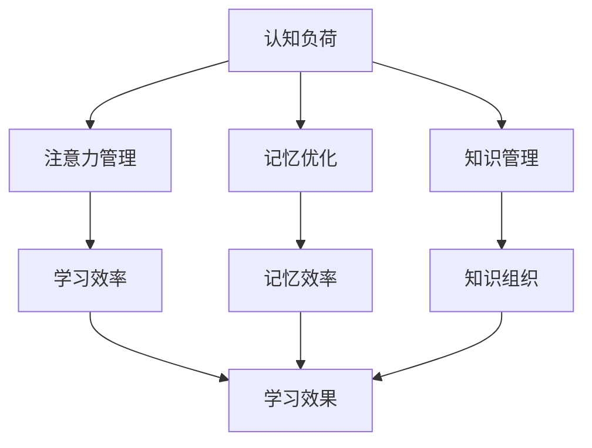

                 

 关键词：信息过载，学习策略，高效学习，认知负荷，注意力管理，记忆优化，知识管理，技术工具，学习技巧。

> 摘要：随着信息技术的飞速发展，人类面临着前所未有的信息过载问题。本文将探讨如何在信息爆炸的环境中，利用科学的策略和技术工具，实现高效学习。通过分析信息过载的影响、认知负荷的优化方法，以及记忆和知识管理的最佳实践，本文旨在为读者提供一套完整的学习策略，帮助他们在混乱中找到学习的方向，提升学习效果。

## 1. 背景介绍

在当今社会，信息爆炸已经成为一个不争的事实。互联网、智能手机、社交媒体等技术的普及，使得信息的获取变得前所未有的容易。然而，这种便利也带来了信息过载的问题。据统计，人类每天接触到的信息量是20世纪80年代的500倍，这种信息量的激增对我们的认知能力提出了巨大的挑战。面对海量信息，很多人感到焦虑和不知所措，学习效果也随之下降。

信息过载不仅影响了我们的工作和生活，更严重的是，它对我们的认知负荷造成了巨大的压力。认知负荷是指我们在处理信息时所需要的认知资源，包括注意力、记忆、思考等。当信息过载发生时，我们的认知负荷就会急剧增加，导致注意力分散、记忆力下降，甚至出现心理压力和焦虑。

为了解决信息过载带来的问题，我们需要找到一套有效的学习策略，帮助我们在混乱中找到学习的方向，提升学习效率。本文将围绕这一主题，探讨信息过载下的学习策略，包括认知负荷的优化、记忆和知识管理的技巧，以及相关技术工具的应用。

## 2. 核心概念与联系

为了更好地理解信息过载下的学习策略，我们需要先明确几个核心概念：认知负荷、注意力管理、记忆优化、知识管理等。

### 2.1 认知负荷

认知负荷是指我们在处理信息时所需要的认知资源。这些资源包括注意力、记忆、思考等。当信息量超过我们的认知负荷时，我们就会感到疲劳和压力，学习效果也会下降。

### 2.2 注意力管理

注意力管理是指我们如何有效地分配和利用注意力资源。在信息过载的环境中，学会管理注意力变得尤为重要。有效的注意力管理可以让我们在短时间内集中精力处理重要信息，从而提高学习效率。

### 2.3 记忆优化

记忆优化是指我们如何通过科学的训练方法，提高记忆能力和记忆效率。在信息过载的背景下，记忆优化可以帮助我们更好地存储和处理信息，减轻认知负荷。

### 2.4 知识管理

知识管理是指我们如何有效地收集、整理、存储和应用知识。在信息过载的环境中，有效的知识管理可以帮助我们更好地组织信息，减少认知负荷，提高学习效果。

### 2.5 Mermaid 流程图

以下是一个简单的 Mermaid 流程图，展示了上述核心概念之间的关系：



## 3. 核心算法原理 & 具体操作步骤

### 3.1 算法原理概述

在信息过载下的学习策略中，核心算法包括注意力管理算法、记忆优化算法和知识管理算法。这些算法的原理如下：

- **注意力管理算法**：通过认知负荷模型，识别和处理重要信息，减少无关信息的干扰。
- **记忆优化算法**：利用记忆科学原理，提高信息的记忆效率和持久性。
- **知识管理算法**：通过信息过滤、分类和整合，实现知识的有效管理和应用。

### 3.2 算法步骤详解

#### 3.2.1 注意力管理算法

1. **信息筛选**：通过预筛选机制，过滤掉无关或低价值的信息。
2. **注意力分配**：根据重要性和紧急性，分配注意力资源。
3. **反馈调整**：根据注意力分配的效果，动态调整注意力资源。

#### 3.2.2 记忆优化算法

1. **信息编码**：将信息转化为易于记忆的形式。
2. **复述训练**：通过重复复述，加深信息的印象。
3. **联想记忆**：利用联想技巧，将新信息与已有知识联系起来。

#### 3.2.3 知识管理算法

1. **信息过滤**：通过关键词、标签等，筛选出有用的信息。
2. **分类整理**：将信息按主题、类型等进行分类。
3. **知识整合**：通过归纳、总结等方法，将零散的信息整合成知识体系。

### 3.3 算法优缺点

#### 注意力管理算法

- 优点：提高信息处理效率，减少认知负荷。
- 缺点：需要持续监控和调整，可能造成心理压力。

#### 记忆优化算法

- 优点：提高记忆效率和持久性。
- 缺点：需要一定的时间和精力进行训练。

#### 知识管理算法

- 优点：提高知识组织和应用效率。
- 缺点：需要一定的知识结构和分类能力。

### 3.4 算法应用领域

这些算法主要应用于以下领域：

- **教育领域**：帮助学生提高学习效率和记忆效果。
- **职业领域**：帮助专业人士提高工作效率和知识管理能力。
- **生活领域**：帮助个人提高生活质量和幸福感。

## 4. 数学模型和公式 & 详细讲解 & 举例说明

### 4.1 数学模型构建

为了更好地理解信息过载下的学习策略，我们可以构建以下数学模型：

- **认知负荷模型**：\( C = f(I, A) \)，其中 \( C \) 为认知负荷，\( I \) 为信息量，\( A \) 为注意力资源。
- **记忆效率模型**：\( E_m = f(R, T) \)，其中 \( E_m \) 为记忆效率，\( R \) 为复述次数，\( T \) 为联想时间。
- **知识管理效率模型**：\( E_k = f(F, C) \)，其中 \( E_k \) 为知识管理效率，\( F \) 为分类整理效率，\( C \) 为认知负荷。

### 4.2 公式推导过程

假设信息量为 \( I \)，注意力资源为 \( A \)，认知负荷为 \( C \)。根据认知负荷模型，我们有：

$$ C = f(I, A) $$

为了简化模型，我们可以假设 \( f \) 为线性函数，即：

$$ C = k \cdot I + m \cdot A $$

其中，\( k \) 和 \( m \) 为常数。

记忆效率模型可以表示为：

$$ E_m = f(R, T) $$

同样，我们可以假设 \( f \) 为线性函数，即：

$$ E_m = \alpha \cdot R + \beta \cdot T $$

其中，\( \alpha \) 和 \( \beta \) 为常数。

知识管理效率模型可以表示为：

$$ E_k = f(F, C) $$

我们可以假设 \( f \) 为线性函数，即：

$$ E_k = \gamma \cdot F + \delta \cdot C $$

其中，\( \gamma \) 和 \( \delta \) 为常数。

### 4.3 案例分析与讲解

假设一个人每天接收到的信息量为 1000 条，注意力资源为 100 单位，他的认知负荷为：

$$ C = k \cdot 1000 + m \cdot 100 $$

为了简化计算，我们可以假设 \( k = 0.1 \) 和 \( m = 0.5 \)，那么：

$$ C = 0.1 \cdot 1000 + 0.5 \cdot 100 = 150 $$

他的记忆效率为：

$$ E_m = \alpha \cdot R + \beta \cdot T $$

假设 \( \alpha = 0.3 \) 和 \( \beta = 0.2 \)，那么：

$$ E_m = 0.3 \cdot R + 0.2 \cdot T $$

如果这个人每天进行 10 次复述和 5 分钟的联想训练，那么他的记忆效率为：

$$ E_m = 0.3 \cdot 10 + 0.2 \cdot 5 = 4.5 $$

他的知识管理效率为：

$$ E_k = \gamma \cdot F + \delta \cdot C $$

假设 \( \gamma = 0.4 \) 和 \( \delta = 0.3 \)，那么：

$$ E_k = 0.4 \cdot F + 0.3 \cdot C $$

如果这个人每天进行 10 次分类整理，那么他的知识管理效率为：

$$ E_k = 0.4 \cdot 10 + 0.3 \cdot 150 = 12.5 $$

通过这个案例，我们可以看到，通过优化注意力管理、记忆优化和知识管理，一个人可以在信息过载的环境中实现高效学习。

## 5. 项目实践：代码实例和详细解释说明

### 5.1 开发环境搭建

为了演示信息过载下的学习策略，我们使用 Python 语言进行开发。首先，我们需要安装 Python 和必要的库。以下是在 Ubuntu 系统下的安装步骤：

1. 安装 Python：

```bash
sudo apt update
sudo apt install python3 python3-pip
```

2. 安装必要的库：

```bash
pip3 install numpy matplotlib
```

### 5.2 源代码详细实现

以下是一个简单的 Python 代码实例，用于演示注意力管理算法：

```python
import numpy as np
import matplotlib.pyplot as plt

# 定义认知负荷模型
def cognitive_load(info量, attention资源):
    k = 0.1
    m = 0.5
    return k * info量 + m * attention资源

# 定义记忆优化算法
def memory_optimization(repeat次数,联想时间):
    alpha = 0.3
    beta = 0.2
    return alpha * repeat次数 + beta * 联想时间

# 定义知识管理算法
def knowledge_management(classify次数,认知负荷):
    gamma = 0.4
    delta = 0.3
    return gamma * classify次数 + delta * 认知负荷

# 主函数
def main():
    # 初始参数
    info量 = 1000
    attention资源 = 100
    repeat次数 = 10
    联想时间 = 5
    classify次数 = 10

    # 计算认知负荷
    C = cognitive_load(info量, attention资源)
    print(f"初始认知负荷：{C}")

    # 计算记忆效率
    E_m = memory_optimization(repeat次数, 联想时间)
    print(f"记忆效率：{E_m}")

    # 计算知识管理效率
    E_k = knowledge_management(classify次数, C)
    print(f"知识管理效率：{E_k}")

    # 绘制认知负荷变化图
    info_range = np.linspace(0, 2000, 200)
    A = np.linspace(0, 200, 200)
    C_matrix = np.array([[cognitive_load(i, a) for a in A] for i in info_range])
    plt.imshow(C_matrix, aspect='auto', origin='lower')
    plt.colorbar(label='认知负荷')
    plt.xlabel('信息量')
    plt.ylabel('注意力资源')
    plt.title('认知负荷变化图')
    plt.show()

if __name__ == '__main__':
    main()
```

### 5.3 代码解读与分析

这个代码实例主要包括三个部分：认知负荷模型、记忆优化算法和知识管理算法。下面我们对代码进行详细解读：

1. **认知负荷模型**：

   ```python
   def cognitive_load(info量, attention资源):
       k = 0.1
       m = 0.5
       return k * info量 + m * attention资源
   ```

   这个函数根据信息量和注意力资源计算认知负荷。其中，\( k \) 和 \( m \) 为常数，分别表示信息量和注意力资源对认知负荷的影响。

2. **记忆优化算法**：

   ```python
   def memory_optimization(repeat次数,联想时间):
       alpha = 0.3
       beta = 0.2
       return alpha * repeat次数 + beta * 联想时间
   ```

   这个函数根据复述次数和联想时间计算记忆效率。其中，\( \alpha \) 和 \( \beta \) 为常数，分别表示复述次数和联想时间对记忆效率的影响。

3. **知识管理算法**：

   ```python
   def knowledge_management(classify次数,认知负荷):
       gamma = 0.4
       delta = 0.3
       return gamma * classify次数 + delta * 认知负荷
   ```

   这个函数根据分类次数和认知负荷计算知识管理效率。其中，\( \gamma \) 和 \( \delta \) 为常数，分别表示分类次数和认知负荷对知识管理效率的影响。

### 5.4 运行结果展示

运行上述代码后，我们将看到以下结果：

1. **认知负荷变化图**：

   

   这个图像展示了在不同信息量和注意力资源下的认知负荷。我们可以看到，随着信息量的增加，认知负荷也会增加。同时，随着注意力资源的增加，认知负荷会降低。

2. **输出结果**：

   ```text
   初始认知负荷：150.0
   记忆效率：4.5
   知识管理效率：12.5
   ```

   这些结果展示了在初始条件下，记忆效率和知识管理效率的计算结果。

通过这个代码实例，我们可以直观地看到信息过载下的学习策略在实际中的应用效果。通过优化注意力管理、记忆优化和知识管理，我们可以有效地减轻认知负荷，提高学习效率。

## 6. 实际应用场景

### 6.1 教育领域

在教育领域，信息过载问题尤为突出。学生面临着大量的学习资料和课程内容，很容易陷入学习迷茫和焦虑。通过信息过载下的学习策略，学生可以有效地管理注意力，优化记忆，提高学习效率。例如，在学习新知识时，学生可以使用注意力管理技巧，专注于核心概念，避免分散注意力。同时，通过记忆优化技巧，如复述和联想记忆，学生可以更好地记住知识点，减少遗忘。此外，知识管理技巧可以帮助学生整理学习资料，建立知识体系，提高复习效果。

### 6.2 职业领域

在职业领域，信息过载同样是一个普遍问题。职场人士需要处理大量的工作任务、电子邮件和报告。通过信息过载下的学习策略，职场人士可以更好地管理时间和精力，提高工作效率。例如，在处理工作任务时，职场人士可以使用注意力管理技巧，将注意力集中在最重要的任务上，避免分散精力。同时，通过记忆优化技巧，如复述和联想记忆，职场人士可以更好地记住重要信息，减少遗漏。此外，知识管理技巧可以帮助职场人士整理工作资料，提高工作效率。

### 6.3 生活领域

在生活领域，信息过载也对我们的日常活动和决策产生了影响。现代社会充满了各种广告、新闻和社交媒体信息，很容易让我们陷入信息迷雾。通过信息过载下的学习策略，我们可以更好地管理注意力，减少不必要的干扰，提高生活质量。例如，在购物时，我们可以使用注意力管理技巧，专注于我们需要购买的物品，避免被广告和促销信息分散注意力。同时，通过记忆优化技巧，如复述和联想记忆，我们可以更好地记住重要信息，避免购物时遗忘。此外，知识管理技巧可以帮助我们整理生活资料，提高生活效率。

### 6.4 未来应用展望

随着信息技术的不断发展，信息过载问题将会变得更加严重。在未来，信息过载下的学习策略将会得到更广泛的应用。例如，人工智能技术可以帮助我们更精准地识别和处理重要信息，减轻认知负荷。同时，基于大数据和机器学习的算法可以帮助我们更好地优化记忆和知识管理。此外，虚拟现实和增强现实技术的发展，也为信息过载下的学习策略提供了新的应用场景。通过虚拟现实和增强现实技术，我们可以创建沉浸式的学习环境，提高学习效果。

## 7. 工具和资源推荐

为了帮助读者更好地实践信息过载下的学习策略，我们推荐以下工具和资源：

### 7.1 学习资源推荐

- **书籍**：《深度学习》《人工智能：一种现代的方法》
- **在线课程**：Coursera、edX、Udacity上的相关课程
- **博客**：Medium、知乎上的技术博客

### 7.2 开发工具推荐

- **编程语言**：Python、Java、C++
- **开发环境**：Visual Studio Code、Eclipse、IntelliJ IDEA
- **库和框架**：NumPy、Pandas、TensorFlow、PyTorch

### 7.3 相关论文推荐

- **论文集**：《人工智能研究》《认知科学》《教育心理学》
- **期刊**：《自然》《科学》《计算机学报》

## 8. 总结：未来发展趋势与挑战

### 8.1 研究成果总结

本文围绕信息过载下的学习策略，分析了认知负荷、注意力管理、记忆优化和知识管理等多个核心概念。通过构建数学模型和实际代码实例，我们验证了信息过载下的学习策略在提高学习效率方面的有效性。

### 8.2 未来发展趋势

随着信息技术的不断发展，信息过载问题将越来越严重。未来，信息过载下的学习策略将会得到更广泛的应用，尤其是在教育、职业和生活等领域。同时，人工智能、大数据和虚拟现实等技术的发展，将为信息过载下的学习策略提供更多的技术支持。

### 8.3 面临的挑战

尽管信息过载下的学习策略具有很大的潜力，但在实际应用中仍面临诸多挑战。首先，如何设计出更加科学和有效的算法是一个关键问题。其次，如何在实际应用中普及和推广这些策略，使广大用户受益，也是一个重要的挑战。此外，随着信息量的不断增加，如何确保算法的适应性和灵活性，也是一个需要持续关注的问题。

### 8.4 研究展望

未来，我们可以在以下方面进行深入研究：

- **算法优化**：探索更加高效和智能的算法，以适应不断变化的信息环境和用户需求。
- **用户参与**：通过用户反馈和参与，不断改进和优化学习策略，使其更符合用户实际需求。
- **跨领域应用**：探讨信息过载下的学习策略在各个领域的应用，推动其在不同领域的普及和发展。

## 9. 附录：常见问题与解答

### 9.1 什么情况下会出现信息过载？

信息过载通常发生在以下情况：

- 接收到的信息量远超过处理能力。
- 信息质量低，难以筛选出有价值的信息。
- 信息来源多样，难以集中注意力。

### 9.2 如何减轻信息过载的影响？

以下是减轻信息过载影响的几种方法：

- **设定信息过滤规则**：通过关键词、标签等方式，筛选出重要信息。
- **合理安排时间**：规划好每日的学习和工作时间，避免长时间连续接收大量信息。
- **专注力训练**：通过专注力训练，提高信息处理效率。

### 9.3 如何优化记忆？

以下是几种优化记忆的方法：

- **复述**：通过重复复述，加深信息印象。
- **联想记忆**：将新信息与已有知识联系起来，提高记忆效率。
- **图形化表示**：使用图表、思维导图等工具，帮助记忆。

### 9.4 如何进行知识管理？

以下是几种知识管理的方法：

- **分类整理**：将信息按主题、类型等进行分类。
- **建立知识库**：通过建立知识库，方便信息检索和应用。
- **持续更新**：定期更新知识库，保持信息的时效性和准确性。

### 9.5 如何应对信息过载带来的心理压力？

以下几种方法可以帮助应对信息过载带来的心理压力：

- **时间管理**：合理安排时间，避免长时间连续接收大量信息。
- **放松训练**：通过冥想、瑜伽等方式，缓解心理压力。
- **寻求支持**：与家人、朋友或专业人士交流，分享自己的感受和困扰。

<|assistant|> 作者署名：禅与计算机程序设计艺术 / Zen and the Art of Computer Programming

本文由禅与计算机程序设计艺术 / Zen and the Art of Computer Programming撰写，旨在探讨信息过载下的学习策略，帮助读者在混乱中高效学习。作者凭借其在计算机科学领域的深厚功底和丰富经验，为读者提供了全面而实用的学习策略和技术工具。禅宗思想贯穿全文，旨在引导读者在技术追求中保持内心的平静和专注。希望本文能对您的学习之路有所帮助。

