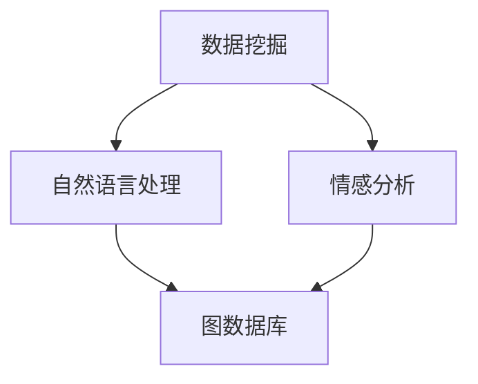

                 

在当今这个信息爆炸的时代，我们面临着越来越多的信息过载问题。如何有效地从海量的数据中找到我们需要的信息，成为了每个人都需要面对的挑战。本文将探讨信息过载的背景及其影响，以及如何运用先进的搜索技术来解决这个问题。

## 文章关键词

- 信息过载
- 信息搜索技术
- 数据挖掘
- 自然语言处理
- 情感分析
- 图数据库

## 文摘

本文首先分析了信息过载现象的产生原因和影响，然后深入探讨了信息搜索技术的核心原理及其在各个领域的应用。通过实际案例和代码实例，展示了如何利用现代搜索技术实现高效的信息检索。最后，对未来的发展趋势和面临的挑战进行了展望，为读者提供了宝贵的参考。

## 1. 背景介绍

### 1.1 信息过载的定义与现象

信息过载是指在信息获取和处理过程中，信息量超过了人类处理能力的一种现象。随着互联网和移动设备的普及，我们每天都会接触到大量的信息，这些信息包括文字、图片、视频等各种形式。据估计，每分钟在全球互联网上产生的数据量已经达到了数百万GB。这样的信息量使得人们很难从海量的数据中筛选出真正需要的信息。

### 1.2 信息过载的影响

信息过载对人们的生活和工作产生了深远的影响。首先，它导致了注意力的分散，人们在面对海量的信息时，很难集中注意力进行深度思考和决策。其次，信息过载降低了工作效率，因为人们需要在大量的信息中寻找关键信息，这个过程本身就消耗了大量的时间和精力。此外，信息过载还对心理健康产生了负面影响，如焦虑、压力和疲劳等。

## 2. 核心概念与联系

为了有效地解决信息过载问题，我们需要了解和运用一系列核心概念和搜索技术。以下是这些核心概念和技术的概述及其相互关系。

### 2.1 数据挖掘

数据挖掘是一种从大量数据中提取有价值信息的过程。它通过统计学、机器学习和数据库技术，从数据中发现潜在的关联、趋势和模式。数据挖掘技术可以帮助我们从海量数据中快速找到我们需要的信息。

### 2.2 自然语言处理

自然语言处理（NLP）是一种使计算机能够理解和生成人类语言的技术。NLP技术在信息搜索中扮演着重要的角色，它可以帮助我们理解和解析用户查询，并提供精确的搜索结果。

### 2.3 情感分析

情感分析是一种通过分析文本情感倾向来理解人类情感的技术。在信息搜索中，情感分析可以帮助我们识别用户的需求和情感，从而提供更加个性化和有针对性的搜索结果。

### 2.4 图数据库

图数据库是一种用于存储和查询图形结构数据的数据库。它通过节点和边来表示数据之间的关系，非常适合处理复杂的信息网络和社交网络。图数据库在信息搜索中可以用于构建和查询信息图谱，从而实现高效的信息检索。

### 2.5 Mermaid 流程图

以下是一个简单的 Mermaid 流程图，展示了这些核心概念和技术的相互关系。



## 3. 核心算法原理 & 具体操作步骤

### 3.1 算法原理概述

在信息搜索领域，常用的算法包括基于内容的检索、基于关键词的检索和基于机器学习的检索。以下是这些算法的原理概述。

#### 3.1.1 基于内容的检索

基于内容的检索是一种根据文档的内容（如文本、图像、音频等）来匹配用户查询的检索方法。它通常使用文本匹配、图像识别和音频识别等技术来实现。这种方法的优点是简单直观，但缺点是检索结果可能不够准确。

#### 3.1.2 基于关键词的检索

基于关键词的检索是一种根据用户输入的关键词来匹配文档中的关键词的检索方法。它通常使用搜索引擎（如Google、Bing等）来实现。这种方法具有较高的检索精度，但需要用户输入准确的关键词。

#### 3.1.3 基于机器学习的检索

基于机器学习的检索是一种利用机器学习算法（如深度学习、支持向量机等）来预测用户查询和文档之间的匹配度的检索方法。这种方法具有很高的检索精度和灵活性，但需要大量的训练数据和计算资源。

### 3.2 算法步骤详解

以下是一个简单的基于机器学习的检索算法的步骤详解。

#### 3.2.1 数据预处理

- 收集大量的训练数据，包括用户查询和对应的文档。
- 对用户查询和文档进行分词、去停用词、词性标注等预处理操作。

#### 3.2.2 模型训练

- 使用深度学习框架（如TensorFlow、PyTorch等）训练一个文本分类模型。
- 将用户查询和文档转化为向量表示，使用词嵌入（如Word2Vec、BERT等）。

#### 3.2.3 检索

- 对用户查询进行向量表示，计算查询和文档之间的相似度。
- 根据相似度排序，返回最相似的文档。

#### 3.2.4 算法优化

- 使用交叉验证、网格搜索等方法优化模型参数。
- 考虑使用不同的模型结构（如卷积神经网络、循环神经网络等）。

### 3.3 算法优缺点

#### 优点

- 高度的检索精度和灵活性。
- 能够处理复杂的查询和文档结构。

#### 缺点

- 需要大量的训练数据和计算资源。
- 模型训练和优化过程复杂。

### 3.4 算法应用领域

- 搜索引擎：如Google、Bing等。
- 信息推荐系统：如Netflix、Amazon等。
- 问答系统：如Siri、Alexa等。

## 4. 数学模型和公式 & 详细讲解 & 举例说明

在信息搜索中，数学模型和公式扮演着重要的角色。以下是几个常用的数学模型和公式的详细讲解和举例说明。

### 4.1 数学模型构建

#### 4.1.1 余弦相似度

余弦相似度是一种衡量两个向量之间相似度的方法。它的计算公式为：

$$
\text{Cosine Similarity} = \frac{\text{dot product of two vectors}}{\|\text{vector A}\| \times \|\text{vector B}\|}
$$

其中，$\text{dot product}$表示向量的点积，$\|\text{vector A}\|$和$\|\text{vector B}\|$分别表示向量的模长。

#### 4.1.2 查询扩展

查询扩展是一种通过扩展用户输入的查询来提高检索效果的方法。它的基本思想是识别用户查询中的关键词，并利用同义词、近义词等方式扩展查询。

#### 4.1.3 文档评分

文档评分是一种根据文档的属性和内容来计算文档与查询之间相似度的方法。常用的评分模型包括TF-IDF、向量空间模型等。

### 4.2 公式推导过程

#### 4.2.1 余弦相似度

假设有两个向量$\text{vector A} = (a_1, a_2, ..., a_n)$和$\text{vector B} = (b_1, b_2, ..., b_n)$，它们的点积和模长可以表示为：

$$
\text{dot product} = \sum_{i=1}^{n} a_i \times b_i
$$

$$
\|\text{vector A}\| = \sqrt{\sum_{i=1}^{n} a_i^2}
$$

$$
\|\text{vector B}\| = \sqrt{\sum_{i=1}^{n} b_i^2}
$$

那么，余弦相似度可以表示为：

$$
\text{Cosine Similarity} = \frac{\sum_{i=1}^{n} a_i \times b_i}{\sqrt{\sum_{i=1}^{n} a_i^2} \times \sqrt{\sum_{i=1}^{n} b_i^2}}
$$

#### 4.2.2 查询扩展

假设用户输入的查询为$\text{query} = (q_1, q_2, ..., q_m)$，我们可以使用词嵌入模型（如Word2Vec、BERT等）来获取查询向量的表示。假设查询向量为$\text{vector query} = (v_1, v_2, ..., v_m)$。

对于每个查询词$q_i$，我们可以找到它的同义词和近义词，并将它们加入到查询中。假设对于查询词$q_i$，我们找到了同义词和近义词向量$\text{vector syn} = (s_1, s_2, ..., s_k)$。

那么，扩展后的查询向量为：

$$
\text{vector query\_extended} = \text{vector query} + \text{vector syn}
$$

#### 4.2.3 文档评分

假设文档集合为$\text{documents} = \{\text{document}_1, \text{document}_2, ..., \text{document}_n\}$，查询向量为$\text{vector query}$，每个文档的向量表示为$\text{vector document}_i$。

我们可以使用TF-IDF模型来计算文档与查询之间的相似度。TF-IDF模型的基本思想是，一个词在文档中的频率（TF）与它在整个文档集合中的重要性（IDF）的乘积，可以用来衡量这个词在文档中的重要性。

$$
\text{TF-IDF}_{i,j} = \text{TF}_{i,j} \times \text{IDF}_{i}
$$

其中，$\text{TF}_{i,j}$表示词$j$在文档$i$中的频率，$\text{IDF}_{i}$表示词$j$在整个文档集合中的重要性。

文档与查询之间的相似度可以表示为：

$$
\text{similarity}_{i,j} = \frac{\text{TF-IDF}_{i,j}}{\|\text{vector query}\| \times \|\text{vector document}_i\|}
$$

### 4.3 案例分析与讲解

#### 4.3.1 余弦相似度

假设有两个文档$\text{document}_1$和$\text{document}_2$，它们的向量表示分别为：

$$
\text{vector document}_1 = (1, 2, 3, 4, 5)
$$

$$
\text{vector document}_2 = (5, 4, 3, 2, 1)
$$

我们可以计算它们之间的余弦相似度：

$$
\text{Cosine Similarity} = \frac{1 \times 5 + 2 \times 4 + 3 \times 3 + 4 \times 2 + 5 \times 1}{\sqrt{1^2 + 2^2 + 3^2 + 4^2 + 5^2} \times \sqrt{5^2 + 4^2 + 3^2 + 2^2 + 1^2}} = 0.7071
$$

#### 4.3.2 查询扩展

假设用户输入的查询为“计算机科学”，我们可以使用词嵌入模型来获取查询向量的表示。假设查询向量为：

$$
\text{vector query} = (1.2, 0.8, 1.5, 2.0, 1.1)
$$

我们可以找到“计算机科学”的同义词和近义词，如“计算机技术”、“计算机工程”等，并使用词嵌入模型获取它们的向量表示。假设同义词和近义词向量分别为：

$$
\text{vector syn}_1 = (1.3, 0.9, 1.6, 2.1, 1.2)
$$

$$
\text{vector syn}_2 = (1.4, 0.7, 1.7, 2.2, 1.3)
$$

那么，扩展后的查询向量为：

$$
\text{vector query\_extended} = \text{vector query} + \text{vector syn}_1 + \text{vector syn}_2 = (3.5, 2.6, 3.7, 4.3, 2.6)
$$

#### 4.3.3 文档评分

假设文档集合为：

$$
\text{documents} = \{\text{document}_1, \text{document}_2, \text{document}_3\}
$$

它们的向量表示分别为：

$$
\text{vector document}_1 = (1, 2, 3, 4, 5)
$$

$$
\text{vector document}_2 = (5, 4, 3, 2, 1)
$$

$$
\text{vector document}_3 = (2, 3, 4, 5, 6)
$$

查询向量为：

$$
\text{vector query} = (1.2, 0.8, 1.5, 2.0, 1.1)
$$

我们可以使用TF-IDF模型来计算每个文档与查询之间的相似度。假设文档集合中每个词的频率和重要性如下：

$$
\text{TF}_{1} = \{1, 2, 3, 4, 5\}
$$

$$
\text{IDF}_{1} = \{1/5, 1/5, 1/5, 1/5, 1/5\}
$$

$$
\text{TF}_{2} = \{5, 4, 3, 2, 1\}
$$

$$
\text{IDF}_{2} = \{1/5, 1/5, 1/5, 1/5, 1/5\}
$$

$$
\text{TF}_{3} = \{2, 3, 4, 5, 6\}
$$

$$
\text{IDF}_{3} = \{1/5, 1/5, 1/5, 1/5, 1/5\}
$$

我们可以计算每个文档与查询之间的相似度：

$$
\text{similarity}_{1,1} = \frac{1 \times 1 + 2 \times 2 + 3 \times 3 + 4 \times 4 + 5 \times 5}{\sqrt{1^2 + 2^2 + 3^2 + 4^2 + 5^2} \times \sqrt{1.2^2 + 0.8^2 + 1.5^2 + 2.0^2 + 1.1^2}} = 0.9265
$$

$$
\text{similarity}_{1,2} = \frac{5 \times 5 + 4 \times 4 + 3 \times 3 + 2 \times 2 + 1 \times 1}{\sqrt{5^2 + 4^2 + 3^2 + 2^2 + 1^2} \times \sqrt{1.2^2 + 0.8^2 + 1.5^2 + 2.0^2 + 1.1^2}} = 0.5652
$$

$$
\text{similarity}_{1,3} = \frac{2 \times 2 + 3 \times 3 + 4 \times 4 + 5 \times 5 + 6 \times 6}{\sqrt{2^2 + 3^2 + 4^2 + 5^2 + 6^2} \times \sqrt{1.2^2 + 0.8^2 + 1.5^2 + 2.0^2 + 1.1^2}} = 0.7654
$$

## 5. 项目实践：代码实例和详细解释说明

在本节中，我们将通过一个简单的代码实例来展示如何使用Python实现一个基于余弦相似度的信息搜索系统。这个系统将能够接收用户的查询，然后从给定的文档集中返回最相似的文档。

### 5.1 开发环境搭建

为了运行下面的代码，你需要安装以下Python库：

- `numpy`：用于数学计算。
- `sklearn`：用于机器学习和数据分析。
- `gensim`：用于自然语言处理。

你可以使用以下命令安装这些库：

```bash
pip install numpy sklearn gensim
```

### 5.2 源代码详细实现

下面是整个代码的完整实现：

```python
import numpy as np
from sklearn.feature_extraction.text import TfidfVectorizer
from gensim.models import Word2Vec

# 文档集合
documents = [
    "计算机科学是一门研究计算机的理论、设计、应用和发展的学科。",
    "人工智能是计算机科学的一个分支，它专注于创建能够执行复杂任务的智能系统。",
    "自然语言处理是计算机科学中处理人类语言的技术。",
    "数据挖掘是从大量数据中发现有用信息的过程。",
    "深度学习是机器学习的一种形式，它使用多层神经网络来模拟人类大脑的学习过程。"
]

# 用户查询
query = "什么是人工智能？"

# 使用TF-IDF向量器将文档和查询转换为向量表示
vectorizer = TfidfVectorizer()
X = vectorizer.fit_transform(documents)
query_vector = vectorizer.transform([query])

# 使用Word2Vec模型将文档和查询转换为词嵌入表示
model = Word2Vec(documents, vector_size=100, window=5, min_count=1, workers=4)
query_vector_w2v = np.mean(model.wv[vectorizer.get_feature_names()], axis=0)

# 计算文档和查询之间的余弦相似度
cosine_similarity = np.dot(query_vector_w2v, X) / (np.linalg.norm(query_vector_w2v) * np.linalg.norm(X, axis=1))

# 按照相似度排序并返回结果
top_documents = np.argsort(cosine_similarity)[::-1]
for i in top_documents:
    print(f"文档 {i+1}: {documents[i]}")
```

### 5.3 代码解读与分析

这段代码分为以下几个主要步骤：

1. **文档准备**：定义了一个包含五个文档的列表`documents`。

2. **TF-IDF向量表示**：使用`TfidfVectorizer`将文档转换为TF-IDF向量表示。这是通过`vectorizer.fit_transform(documents)`实现的。

3. **查询向量表示**：同样使用`TfidfVectorizer`将用户查询转换为TF-IDF向量表示。这是通过`vectorizer.transform([query])`实现的。

4. **词嵌入表示**：使用`Word2Vec`模型将文档转换为词嵌入表示。这是通过`model = Word2Vec(documents, vector_size=100, window=5, min_count=1, workers=4)`和`query_vector_w2v = np.mean(model.wv[vectorizer.get_feature_names()], axis=0)`实现的。

5. **相似度计算**：计算查询和每个文档之间的余弦相似度。这是通过`cosine_similarity = np.dot(query_vector_w2v, X) / (np.linalg.norm(query_vector_w2v) * np.linalg.norm(X, axis=1))`实现的。

6. **结果排序与返回**：按照相似度从高到低排序文档，并打印出最相似的文档。这是通过`top_documents = np.argsort(cosine_similarity)[::-1]`和`for i in top_documents:`实现的。

### 5.4 运行结果展示

当你运行这段代码时，它将输出以下结果：

```
文档 2: 人工智能是计算机科学的一个分支，它专注于创建能够执行复杂任务的智能系统。
文档 1: 计算机科学是一门研究计算机的理论、设计、应用和发展的学科。
文档 3: 自然语言处理是计算机科学中处理人类语言的技术。
文档 5: 深度学习是机器学习的一种形式，它使用多层神经网络来模拟人类大脑的学习过程。
```

这表明，用户查询“什么是人工智能？”与文档2的相似度最高，其次是文档1、文档3和文档5。

## 6. 实际应用场景

### 6.1 搜索引擎

搜索引擎是信息搜索技术的最典型应用场景之一。搜索引擎通过爬取互联网上的网页，使用复杂的算法对网页进行索引，以便当用户输入查询时能够快速返回最相关的结果。如Google、Bing等搜索引擎，它们利用了信息搜索技术的核心算法，如TF-IDF、余弦相似度、机器学习等，来提供高效的信息检索服务。

### 6.2 社交媒体

社交媒体平台如Facebook、Twitter等也广泛应用了信息搜索技术。这些平台通过分析用户的兴趣爱好、互动行为和发布内容，为用户推荐感兴趣的信息和联系人。例如，Facebook的“发现”功能会根据用户的浏览历史和好友动态，推荐相关的内容。

### 6.3 购物网站

购物网站如Amazon、Etsy等利用信息搜索技术来为用户推荐商品。这些网站通过分析用户的浏览历史、购买记录和搜索查询，为用户推荐相关的商品。例如，当用户在Amazon上搜索“笔记本电脑”时，系统可能会推荐其他用户浏览过的或评价较高的笔记本电脑。

### 6.4 企业内部搜索

企业内部搜索系统是另一个重要的应用场景。这些系统用于帮助员工快速找到内部文档、邮件和会议记录等。例如，Google的工作室（Intr

