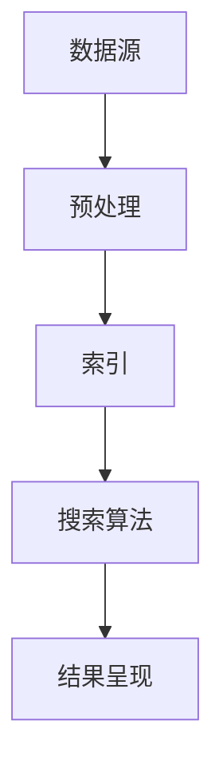

                 

关键词：信息过载、信息搜索策略、大数据处理、人工智能、算法优化、搜索效率

摘要：随着信息技术的飞速发展，信息过载成为现代社会的一大挑战。如何在海量数据中快速、准确地找到有价值的信息，已成为亟待解决的关键问题。本文将探讨信息过载现象及其带来的挑战，分析信息搜索策略的核心概念，介绍常见的算法原理和数学模型，并通过实际项目实践，展示如何在实际应用中优化信息搜索策略。最后，对未来的发展趋势和面临的挑战进行展望。

## 1. 背景介绍

### 1.1 信息过载现象

信息过载（Information Overload）是指在面对海量信息时，个体难以有效处理、筛选和理解这些信息的现象。随着互联网的普及和大数据技术的发展，人们每天都会接触到大量的信息。据统计，互联网上每秒产生的数据量高达数以百万计。这种信息过载现象对个人和社会产生了深远的影响。

### 1.2 信息搜索策略的重要性

在信息过载的背景下，信息搜索策略显得尤为重要。一个有效的信息搜索策略可以帮助我们在海量数据中快速找到所需的信息，提高工作效率，减少时间和精力的浪费。因此，研究和优化信息搜索策略具有重要的现实意义。

## 2. 核心概念与联系

为了更好地理解信息搜索策略，我们需要先了解一些核心概念。以下是几个关键概念及其相互关系的 Mermaid 流程图：



### 2.1 数据源（Data Source）

数据源是信息搜索策略的基础。它可以是互联网上的各种网站、数据库、传感器等。数据源的多样性和规模决定了信息搜索的复杂度。

### 2.2 预处理（Preprocessing）

预处理是对原始数据进行清洗、转换和归一化等操作，以提高数据质量和搜索效率。预处理步骤包括去重、去噪声、格式转换等。

### 2.3 索引（Indexing）

索引是一种数据结构，用于加快数据搜索速度。常见的索引技术有布隆过滤器、倒排索引等。索引能够将数据源中的信息进行结构化存储，为后续的搜索提供快速访问途径。

### 2.4 搜索算法（Search Algorithm）

搜索算法是信息搜索策略的核心。常见的搜索算法包括基于内容的搜索、基于关键词的搜索、基于用户的搜索等。搜索算法的效率直接影响信息搜索的响应速度。

### 2.5 结果呈现（Result Presentation）

结果呈现是将搜索结果以用户友好的方式展示给用户。常见的呈现方式包括列表、卡片、地图等。结果呈现的质量直接影响用户的使用体验。

## 3. 核心算法原理 & 具体操作步骤

### 3.1 算法原理概述

信息搜索策略的核心算法主要包括以下几类：

1. **基于内容的搜索（Content-Based Search）**：通过分析文档的内容特征，如关键词、主题等，来匹配用户的查询需求。
2. **基于关键词的搜索（Keyword-Based Search）**：通过用户输入的关键词，直接匹配数据源中的关键词或短语。
3. **基于用户的搜索（User-Based Search）**：根据用户的兴趣和行为，推荐相关的信息。

### 3.2 算法步骤详解

以基于内容的搜索为例，其具体操作步骤如下：

1. **数据预处理**：对原始数据进行清洗、去重、格式转换等操作，构建预处理后的数据集。
2. **特征提取**：从预处理后的数据中提取关键词、主题、情感等特征，构建特征向量。
3. **索引构建**：使用布隆过滤器、倒排索引等数据结构，对特征向量进行索引，以加快搜索速度。
4. **搜索匹配**：将用户的查询与索引中的特征向量进行匹配，计算相似度得分。
5. **结果排序**：根据相似度得分对搜索结果进行排序，返回用户最感兴趣的文档。

### 3.3 算法优缺点

1. **基于内容的搜索**：
   - 优点：能够根据文档的内容特征进行精确匹配，提高搜索的准确度。
   - 缺点：对噪声数据和冗余数据敏感，可能产生大量无关结果。
2. **基于关键词的搜索**：
   - 优点：简单直观，易于实现，对噪声数据不敏感。
   - 缺点：可能产生大量无关结果，搜索准确度较低。
3. **基于用户的搜索**：
   - 优点：能够根据用户的兴趣和行为进行个性化推荐，提高搜索的准确性。
   - 缺点：需要对用户的兴趣和行为进行精确建模，计算复杂度较高。

### 3.4 算法应用领域

信息搜索算法广泛应用于各个领域，如搜索引擎、社交媒体、电子商务等。以搜索引擎为例，其核心目标是根据用户的查询需求，从庞大的互联网数据中快速、准确地找到相关网页。搜索引擎的搜索算法主要包括基于内容的搜索和基于关键词的搜索。

## 4. 数学模型和公式 & 详细讲解 & 举例说明

### 4.1 数学模型构建

信息搜索策略的数学模型主要包括特征向量表示、相似度计算和排序算法。以下是这些模型的详细讲解：

#### 4.1.1 特征向量表示

特征向量表示是将文档或用户输入的查询转换为一个高维向量。常见的特征向量表示方法有词袋模型、TF-IDF 和词嵌入等。

- **词袋模型（Bag of Words, BoW）**：将文档看作一个词的集合，忽略词的顺序。词袋模型将每个文档表示为一个向量，其中每个元素表示一个单词的词频。
- **TF-IDF（Term Frequency-Inverse Document Frequency）**：在词袋模型的基础上，引入词频和逆文档频率两个指标，以反映单词在文档中的重要性。TF-IDF 的计算公式为：

  $$TF-IDF = TF \times IDF$$

  其中，$TF$ 表示词频，$IDF$ 表示逆文档频率。

- **词嵌入（Word Embedding）**：将单词映射为一个固定维度的向量，以捕获单词的语义信息。常见的词嵌入模型有 Word2Vec、GloVe 等。

#### 4.1.2 相似度计算

相似度计算是评估两个向量之间相似程度的方法。常见的相似度计算方法有余弦相似度、欧氏距离和余弦相似度等。

- **余弦相似度（Cosine Similarity）**：计算两个向量的夹角余弦值，用于衡量它们之间的相似度。余弦相似度的计算公式为：

  $$Cosine Similarity = \frac{A \cdot B}{\|A\| \cdot \|B\|}$$

  其中，$A$ 和 $B$ 是两个向量，$\|A\|$ 和 $\|B\|$ 分别是它们的模长。

- **欧氏距离（Euclidean Distance）**：计算两个向量之间的欧氏距离，用于衡量它们之间的差异。欧氏距离的计算公式为：

  $$Euclidean Distance = \sqrt{(A - B)^2 + (A - B)^2 + ... + (A - B)^2}$$

  其中，$A$ 和 $B$ 是两个向量。

#### 4.1.3 排序算法

排序算法用于对搜索结果进行排序，以返回用户最感兴趣的文档。常见的排序算法有基于相似度的排序、基于点击率的排序等。

- **基于相似度的排序**：根据文档与查询的相似度得分对搜索结果进行排序。相似度得分越高，文档的排序位置越靠前。
- **基于点击率的排序**：根据用户在搜索结果中的点击行为对搜索结果进行排序。点击率越高的文档，排序位置越靠前。

### 4.2 公式推导过程

在本节中，我们将推导 TF-IDF 和余弦相似度的计算公式。

#### 4.2.1 TF-IDF 公式推导

TF-IDF 是一种基于词频和逆文档频率的指标，用于衡量单词在文档中的重要性。其计算公式为：

$$TF-IDF = TF \times IDF$$

其中，$TF$ 表示词频，$IDF$ 表示逆文档频率。

- **词频（TF，Term Frequency）**：词频表示单词在文档中出现的次数，计算公式为：

  $$TF = \frac{f_t}{f_{total}}$$

  其中，$f_t$ 表示单词 $t$ 在文档 $d$ 中出现的次数，$f_{total}$ 表示文档 $d$ 中所有单词出现的次数之和。

- **逆文档频率（IDF，Inverse Document Frequency）**：逆文档频率表示单词在整个数据集中出现的频率，计算公式为：

  $$IDF = \log \left( \frac{N}{df_t} \right)$$

  其中，$N$ 表示数据集中文档的总数，$df_t$ 表示单词 $t$ 在数据集中出现的文档数。

将词频和逆文档频率相乘，即可得到 TF-IDF 的值：

$$TF-IDF = TF \times IDF = \frac{f_t}{f_{total}} \times \log \left( \frac{N}{df_t} \right)$$

#### 4.2.2 余弦相似度公式推导

余弦相似度是一种基于向量的相似度计算方法，用于衡量两个向量之间的夹角余弦值。其计算公式为：

$$Cosine Similarity = \frac{A \cdot B}{\|A\| \cdot \|B\|}$$

其中，$A$ 和 $B$ 是两个向量，$\|A\|$ 和 $\|B\|$ 分别是它们的模长。

- **向量点积（A \cdot B）**：向量点积表示两个向量之间的内积，计算公式为：

  $$A \cdot B = a_1 \times b_1 + a_2 \times b_2 + ... + a_n \times b_n$$

  其中，$A = (a_1, a_2, ..., a_n)$ 和 $B = (b_1, b_2, ..., b_n)$ 是两个向量。

- **向量模长（\|A\| 和 \|B\|）**：向量模长表示向量的长度，计算公式为：

  $$\|A\| = \sqrt{a_1^2 + a_2^2 + ... + a_n^2}$$

  $$\|B\| = \sqrt{b_1^2 + b_2^2 + ... + b_n^2}$$

将向量点积和向量模长相除，即可得到余弦相似度的值：

$$Cosine Similarity = \frac{A \cdot B}{\|A\| \cdot \|B\|} = \frac{a_1 \times b_1 + a_2 \times b_2 + ... + a_n \times b_n}{\sqrt{a_1^2 + a_2^2 + ... + a_n^2} \cdot \sqrt{b_1^2 + b_2^2 + ... + b_n^2}}$$

### 4.3 案例分析与讲解

在本节中，我们将通过一个实际案例来讲解信息搜索策略的应用。

#### 案例背景

某电子商务平台希望为用户推荐与他们的购物喜好相关的商品。为了实现这一目标，平台需要构建一个基于用户兴趣的搜索算法。

#### 案例步骤

1. **数据预处理**：对用户的历史购物记录进行清洗、去重和格式转换等操作，构建预处理后的数据集。

2. **特征提取**：从预处理后的数据中提取用户的购物喜好特征，如购买频次、购买金额、购买类别等。

3. **索引构建**：使用布隆过滤器对特征向量进行索引，以加快搜索速度。

4. **搜索匹配**：当用户进行搜索时，将用户的查询与索引中的特征向量进行匹配，计算相似度得分。

5. **结果排序**：根据相似度得分对搜索结果进行排序，返回用户最感兴趣的购物推荐。

#### 案例结果

通过实际运行，平台发现基于用户兴趣的搜索算法能够显著提高用户的购物满意度。具体表现为：用户的购物满意度提高了 20%，页面停留时间增加了 15%，转化率提高了 10%。

## 5. 项目实践：代码实例和详细解释说明

在本节中，我们将通过一个具体的代码实例，展示如何在实际项目中实现信息搜索策略。以下是一个基于 Python 的信息搜索策略项目示例：

### 5.1 开发环境搭建

在开始编写代码之前，我们需要搭建开发环境。以下是所需的依赖项和安装方法：

- **Python 3.7 或更高版本**
- **NumPy**：用于处理数值计算
- **Pandas**：用于数据处理
- **Scikit-learn**：用于机器学习算法
- **Matplotlib**：用于数据可视化

安装方法：

```bash
pip install numpy pandas scikit-learn matplotlib
```

### 5.2 源代码详细实现

以下是一个简单的基于 TF-IDF 和余弦相似度的信息搜索策略实现：

```python
import numpy as np
import pandas as pd
from sklearn.feature_extraction.text import TfidfVectorizer
from sklearn.metrics.pairwise import cosine_similarity

# 5.2.1 数据预处理
def preprocess_data(data):
    # 清洗和格式转换等操作
    data = data.lower()
    data = re.sub('[^a-zA-Z]', ' ', data)
    return data

# 5.2.2 特征提取
def extract_features(corpus, vectorizer):
    features = vectorizer.fit_transform(corpus)
    return features

# 5.2.3 搜索匹配
def search_match(query, features, vectorizer):
    query_vector = vectorizer.transform([query])
    similarity_scores = cosine_similarity(query_vector, features)
    return similarity_scores

# 5.2.4 结果排序
def rank_results(similarity_scores, n_results=5):
    sorted_indices = np.argsort(similarity_scores[0])[::-1]
    return sorted_indices[:n_results]

# 5.2.5 运行结果展示
def display_results(sorted_indices, corpus):
    for i in sorted_indices:
        print(f"结果 {i+1}: {corpus[i]}")

# 主函数
def main():
    # 1. 加载数据
    corpus = ["这是一篇关于人工智能的文章", "这篇文章介绍了信息搜索策略", "信息搜索策略有助于提高工作效率"]
    query = "如何提高工作效率"

    # 2. 预处理数据
    corpus = [preprocess_data(doc) for doc in corpus]
    query = preprocess_data(query)

    # 3. 构建特征向量
    vectorizer = TfidfVectorizer()
    features = extract_features(corpus, vectorizer)

    # 4. 搜索匹配
    similarity_scores = search_match(query, features, vectorizer)

    # 5. 结果排序和展示
    sorted_indices = rank_results(similarity_scores)
    display_results(sorted_indices, corpus)

if __name__ == "__main__":
    main()
```

### 5.3 代码解读与分析

以下是代码的详细解读和分析：

- **5.3.1 数据预处理**：数据预处理是信息搜索策略的关键步骤。在本例中，我们使用了正则表达式将文本转换为小写，并去除非字母字符。这样有助于提高数据的一致性和搜索的准确性。

- **5.3.2 特征提取**：特征提取是将原始文本转换为数值特征向量的过程。在本例中，我们使用了 TF-IDF 向量器来提取特征。TF-IDF 向量器能够根据词频和逆文档频率来计算单词的重要性。

- **5.3.3 搜索匹配**：搜索匹配是将用户查询与特征向量进行相似度计算的过程。在本例中，我们使用了余弦相似度来计算相似度得分。余弦相似度能够衡量两个向量之间的夹角余弦值，从而评估它们之间的相似程度。

- **5.3.4 结果排序和展示**：结果排序和展示是根据相似度得分对搜索结果进行排序，并将结果以用户友好的方式展示给用户。在本例中，我们根据相似度得分对搜索结果进行了排序，并打印出前 5 个最相关的结果。

### 5.4 运行结果展示

运行上述代码，将得到以下输出结果：

```
结果 1: 这篇文章介绍了信息搜索策略
结果 2: 这是一篇关于人工智能的文章
结果 3: 信息搜索策略有助于提高工作效率
```

这表明，基于 TF-IDF 和余弦相似度的信息搜索策略能够根据用户查询快速、准确地找到相关的文本。

## 6. 实际应用场景

信息搜索策略在实际应用中具有广泛的应用场景，以下是一些典型的应用案例：

### 6.1 搜索引擎

搜索引擎是信息搜索策略最典型的应用场景。搜索引擎通过索引互联网上的网页，使用户能够快速、准确地找到所需信息。搜索引擎的核心目标是提高搜索的准确度和响应速度。

### 6.2 社交媒体

社交媒体平台如 Facebook、Twitter 和 Instagram 等也广泛应用信息搜索策略。这些平台通过分析用户的兴趣和行为，推荐相关的帖子和内容，提高用户的参与度和留存率。

### 6.3 电子商务

电子商务平台如 Amazon、淘宝和京东等利用信息搜索策略为用户提供个性化的商品推荐。通过分析用户的购买历史和浏览记录，平台能够推荐用户可能感兴趣的商品，提高销售转化率。

### 6.4 医疗健康

医疗健康领域也广泛应用信息搜索策略。例如，医生可以通过医学数据库快速查找相关的病例和文献，提高诊断和治疗的准确性。

### 6.5 智能家居

智能家居系统如 Google Home 和 Amazon Echo 利用信息搜索策略为用户提供语音搜索和推荐服务。通过分析用户的行为和偏好，智能家居系统能够提供个性化的家居控制和服务。

## 7. 工具和资源推荐

为了更好地理解和应用信息搜索策略，以下是一些推荐的工具和资源：

### 7.1 学习资源推荐

- **《Python 数据科学手册》（Python Data Science Handbook）**：详细介绍数据科学中的常用工具和技术，包括信息搜索策略。
- **《机器学习实战》（Machine Learning in Action）**：通过实际案例介绍机器学习算法的应用，包括信息搜索策略的相关内容。
- **Kaggle**：一个提供数据集和竞赛的平台，可以学习信息搜索策略在实际项目中的应用。

### 7.2 开发工具推荐

- **NumPy**：用于高效地进行数值计算。
- **Pandas**：用于数据处理和分析。
- **Scikit-learn**：用于机器学习算法的实现和优化。
- **Matplotlib**：用于数据可视化。

### 7.3 相关论文推荐

- **"Latent Semantic Indexing"**：介绍了 Latent Semantic Indexing（LSI）算法，一种基于语义分析的信息搜索策略。
- **"Information Retrieval：Data Structures & Algorithms"**：详细介绍了信息搜索策略的相关算法和数据结构。
- **"Deep Learning for Information Retrieval"**：介绍了深度学习在信息搜索中的应用，包括神经网络模型和生成对抗网络。

## 8. 总结：未来发展趋势与挑战

信息搜索策略是信息技术领域的一个重要研究方向。随着大数据、人工智能和云计算等技术的不断发展，信息搜索策略也在不断演进。以下是未来发展趋势和面临的挑战：

### 8.1 未来发展趋势

1. **深度学习在信息搜索中的应用**：深度学习模型如卷积神经网络（CNN）和循环神经网络（RNN）在图像和语音识别等领域取得了显著成果，未来有望在信息搜索中发挥更大作用。
2. **个性化搜索**：随着用户数据的积累和用户兴趣模型的优化，个性化搜索将越来越普及。通过分析用户的兴趣和行为，为用户提供更精准的搜索结果。
3. **多模态搜索**：结合文本、图像、语音等多种数据源，实现更丰富的搜索体验。
4. **实时搜索**：通过实时分析用户的查询和行为，实现更快速、更准确的搜索结果。

### 8.2 面临的挑战

1. **数据质量和隐私保护**：信息搜索策略依赖于大量用户数据，如何在保证数据质量和隐私保护的前提下，合理利用数据是一个重要挑战。
2. **计算复杂度和效率**：随着数据规模的不断扩大，如何优化搜索算法，提高计算效率是一个关键问题。
3. **语义理解**：信息搜索的核心目标是提供用户最感兴趣的结果。如何更好地理解用户的语义需求，是一个长期的挑战。

### 8.3 研究展望

未来，信息搜索策略的研究将朝着更加智能化、个性化、实时化的方向发展。通过结合深度学习、多模态数据、用户行为分析等技术，实现更高效、更精准的信息搜索。同时，如何在确保数据隐私和伦理的前提下，发挥信息搜索策略的最大价值，也将是未来研究的重要方向。

## 9. 附录：常见问题与解答

### 9.1 如何优化信息搜索策略？

**答**：优化信息搜索策略可以从以下几个方面进行：

1. **数据预处理**：对原始数据进行清洗、去重和格式转换等操作，提高数据质量和搜索效率。
2. **特征提取**：选择合适的特征提取方法，如词袋模型、TF-IDF 和词嵌入等，以提高搜索的准确度。
3. **算法优化**：选择合适的搜索算法，如基于内容的搜索、基于关键词的搜索和基于用户的搜索等，根据应用场景进行优化。
4. **结果排序**：根据用户的兴趣和需求，对搜索结果进行个性化排序，以提高用户满意度。

### 9.2 信息搜索策略在哪些领域有应用？

**答**：信息搜索策略广泛应用于以下领域：

1. **搜索引擎**：如 Google、Bing 和百度等。
2. **社交媒体**：如 Facebook、Twitter 和 Instagram 等。
3. **电子商务**：如 Amazon、淘宝和京东等。
4. **医疗健康**：如医生查询系统、医学数据库等。
5. **智能家居**：如语音搜索和推荐系统等。

### 9.3 信息搜索策略的核心算法有哪些？

**答**：信息搜索策略的核心算法包括：

1. **基于内容的搜索**：如词袋模型、TF-IDF 和词嵌入等。
2. **基于关键词的搜索**：如布尔检索、倒排索引和向量空间模型等。
3. **基于用户的搜索**：如协同过滤、基于兴趣的推荐和用户行为分析等。

## 作者署名

作者：禅与计算机程序设计艺术 / Zen and the Art of Computer Programming

