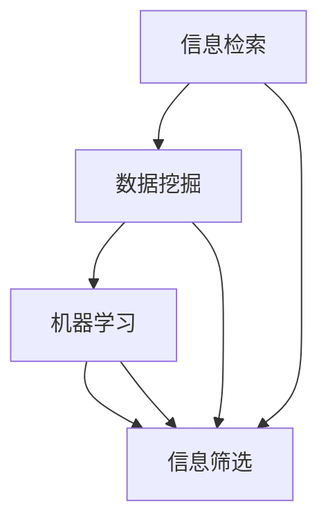

                 

在当今这个数字化时代，信息无处不在，从社交媒体到新闻报道，从博客文章到科学论文，信息量爆炸式增长。这种信息过载（Information Overload）现象已经对个人和组织产生了深远的影响。如何从海量的信息中筛选出有价值的信息，已经成为一个重要的研究课题。本文将探讨信息过载的背景，信息筛选技术的核心概念，以及其在实际应用中的挑战和未来展望。

## 1. 背景介绍

信息过载是指个体或组织在处理信息时，所面对的信息量超过了其处理能力，从而导致决策困难、效率下降的现象。随着互联网的普及和智能设备的普及，人们每天接收到的信息量呈指数级增长。根据研究表明，一个人每天平均接收到的信息量是过去的几年中增长了十倍以上。这种信息过载对个人的健康、心理健康以及工作效率都产生了负面影响。同时，对于企业来说，信息过载也会导致决策效率低下，影响企业的竞争力。

面对信息过载，信息筛选技术应运而生。信息筛选技术是一种通过算法和策略，从大量信息中提取有价值信息的方法。这些技术可以应用于搜索引擎、推荐系统、社交媒体过滤等多个领域，旨在提高信息处理的效率和效果。

## 2. 核心概念与联系

在探讨信息筛选技术之前，我们需要了解几个核心概念，包括信息检索、数据挖掘、机器学习等。

### 2.1 信息检索

信息检索（Information Retrieval，IR）是一种从大量数据中找到特定信息的方法。它通常涉及关键词匹配、文档分类、查询处理等技术。信息检索的关键在于如何快速地从海量的数据中找到用户所需的信息。

### 2.2 数据挖掘

数据挖掘（Data Mining）是一种从大量数据中发现规律和知识的方法。它包括关联规则挖掘、聚类分析、分类分析等。数据挖掘的目标是从数据中发现隐藏的模式和关系，这些模式和关系对于决策支持和业务优化具有重要意义。

### 2.3 机器学习

机器学习（Machine Learning，ML）是一种通过算法和模型，使计算机自动从数据中学习的方法。机器学习包括监督学习、无监督学习、强化学习等。机器学习在信息筛选中发挥了重要作用，例如通过训练模型来预测用户的行为，从而推荐相关的内容。

### 2.4 Mermaid 流程图

为了更好地理解这些概念之间的联系，我们可以使用 Mermaid 流程图来展示它们之间的关系：



在上面的流程图中，信息检索、数据挖掘和机器学习都是信息筛选的输入和基础，它们共同作用于信息筛选，从而实现从海量信息中提取有价值信息的目标。

## 3. 核心算法原理 & 具体操作步骤

### 3.1 算法原理概述

信息筛选技术的核心在于如何有效地从海量数据中提取有价值的信息。这通常涉及以下几个关键步骤：

1. **数据预处理**：包括去噪、清洗和格式化等。
2. **特征提取**：从原始数据中提取出对信息筛选有用的特征。
3. **模型训练**：使用机器学习算法训练模型，使模型能够从数据中学习。
4. **信息筛选**：使用训练好的模型对新的数据进行筛选，提取有价值的信息。

### 3.2 算法步骤详解

1. **数据预处理**：

   数据预处理是信息筛选的第一步。它包括以下几个关键步骤：

   - **去噪**：去除数据中的噪声和不相关的部分。
   - **清洗**：纠正数据中的错误和异常。
   - **格式化**：将数据转换为适合分析的形式。

   例如，对于一个包含大量用户评论的数据集，我们需要去除无关的符号和标点，将文本转换为统一的大小写，以及删除重复的评论。

2. **特征提取**：

   特征提取是从原始数据中提取出对信息筛选有用的特征。这些特征可以是文本的词频、词向量，也可以是图像的颜色分布、纹理特征等。

   - **词频**：计算文本中每个词出现的次数。
   - **词向量**：将文本转换为向量形式，常用的词向量模型有 Word2Vec、GloVe 等。
   - **图像特征**：使用深度学习模型提取图像的特征，如卷积神经网络（CNN）。

3. **模型训练**：

   模型训练是使用机器学习算法从数据中学习的过程。常用的机器学习算法包括支持向量机（SVM）、决策树（Decision Tree）、神经网络（Neural Network）等。

   - **监督学习**：使用标注的数据集训练模型，使模型能够预测新数据的标签。
   - **无监督学习**：在没有标注的数据集上训练模型，使模型能够发现数据的结构和模式。

4. **信息筛选**：

   使用训练好的模型对新的数据进行筛选，提取有价值的信息。例如，在推荐系统中，我们可以使用训练好的模型来推荐用户可能感兴趣的商品或内容。

### 3.3 算法优缺点

信息筛选技术的优点在于：

- **高效性**：通过算法和模型，可以快速地从海量数据中提取有价值的信息。
- **准确性**：经过训练的模型可以准确地识别出有价值的信息。

然而，信息筛选技术也存在一些缺点：

- **数据依赖性**：模型的性能很大程度上取决于训练数据的质量和数量。
- **隐私问题**：在处理个人数据时，可能会涉及隐私问题。

### 3.4 算法应用领域

信息筛选技术广泛应用于多个领域，包括：

- **搜索引擎**：使用信息筛选技术来优化搜索结果，提高搜索的准确性。
- **推荐系统**：根据用户的兴趣和行为，推荐相关的商品或内容。
- **社交媒体**：过滤垃圾信息，提高用户的使用体验。

## 4. 数学模型和公式 & 详细讲解 & 举例说明

### 4.1 数学模型构建

在信息筛选中，常用的数学模型包括决策树、支持向量机、神经网络等。

- **决策树**：决策树是一种树形结构，通过一系列条件判断来对数据进行分类或回归。其基本公式为：

  $$y = f(x)$$

  其中，$y$ 是输出的标签，$x$ 是输入的特征向量，$f(x)$ 是决策树模型。

- **支持向量机**：支持向量机是一种通过最大化边界来分类数据的模型。其基本公式为：

  $$w \cdot x + b = 0$$

  其中，$w$ 是权重向量，$x$ 是输入的特征向量，$b$ 是偏置。

- **神经网络**：神经网络是一种模拟人脑的模型，通过多层神经元来处理数据。其基本公式为：

  $$a_{i}^{(l)} = \sigma(z_{i}^{(l)})$$

  其中，$a_{i}^{(l)}$ 是第 $l$ 层的第 $i$ 个神经元的输出，$\sigma$ 是激活函数，$z_{i}^{(l)}$ 是第 $l$ 层的第 $i$ 个神经元的输入。

### 4.2 公式推导过程

以神经网络为例，我们来看一下其公式的推导过程。

首先，我们定义神经网络中的一层神经元为：

$$z_{i}^{(l)} = \sum_{j=1}^{n} w_{ji}^{(l)} a_{j}^{(l-1)} + b_{i}^{(l)}$$

其中，$w_{ji}^{(l)}$ 是第 $l$ 层的第 $i$ 个神经元与第 $l-1$ 层的第 $j$ 个神经元之间的权重，$b_{i}^{(l)}$ 是第 $l$ 层的第 $i$ 个神经元的偏置。

然后，我们对 $z_{i}^{(l)}$ 应用激活函数 $\sigma$，得到：

$$a_{i}^{(l)} = \sigma(z_{i}^{(l)})$$

常见的激活函数有：

- **Sigmoid 函数**：$ \sigma(x) = \frac{1}{1 + e^{-x}} $
- **ReLU 函数**：$ \sigma(x) = max(0, x) $

最后，我们将 $a_{i}^{(l)}$ 作为第 $l$ 层的第 $i$ 个神经元的输出。

### 4.3 案例分析与讲解

以文本分类任务为例，我们来看一下如何使用神经网络来对文本进行分类。

首先，我们定义一个包含 100 个单词的文本，每个单词用一个整数表示。然后，我们使用一个大小为 50 的词向量来表示每个单词。

$$x = [1, 0, 1, 0, \ldots, 0, 1]$$

接着，我们定义一个包含 3 个神经元的隐藏层，每个神经元使用 ReLU 函数作为激活函数。

$$a^{(2)}_1 = max(0, z^{(2)}_1)$$

$$a^{(2)}_2 = max(0, z^{(2)}_2)$$

$$a^{(2)}_3 = max(0, z^{(2)}_3)$$

其中，$z^{(2)}_1, z^{(2)}_2, z^{(2)}_3$ 分别是隐藏层的第 1、2、3 个神经元的输入。

最后，我们定义一个包含 2 个神经元的输出层，使用 Sigmoid 函数作为激活函数。

$$y_1 = \sigma(z^{(3)}_1)$$

$$y_2 = \sigma(z^{(3)}_2)$$

其中，$z^{(3)}_1, z^{(3)}_2$ 分别是输出层的第 1、2 个神经元的输入。

通过训练，我们可以调整网络的权重和偏置，使网络能够准确地分类文本。

## 5. 项目实践：代码实例和详细解释说明

### 5.1 开发环境搭建

在开始实践之前，我们需要搭建一个合适的开发环境。本文使用 Python 编写代码，并使用 TensorFlow 作为机器学习框架。

首先，安装 Python：

```bash
pip install python
```

然后，安装 TensorFlow：

```bash
pip install tensorflow
```

### 5.2 源代码详细实现

以下是一个简单的文本分类项目的代码实例：

```python
import tensorflow as tf
from tensorflow.keras.models import Sequential
from tensorflow.keras.layers import Dense, Embedding, GlobalAveragePooling1D
from tensorflow.keras.preprocessing.text import Tokenizer
from tensorflow.keras.preprocessing.sequence import pad_sequences

# 准备数据
texts = ['这是一个例子', '另一个例子', '更多的例子']
labels = [0, 1, 1]

# 初始化 Tokenizer
tokenizer = Tokenizer(num_words=100)
tokenizer.fit_on_texts(texts)

# 将文本转换为序列
sequences = tokenizer.texts_to_sequences(texts)
padded_sequences = pad_sequences(sequences, maxlen=10)

# 构建模型
model = Sequential([
    Embedding(100, 32),
    GlobalAveragePooling1D(),
    Dense(1, activation='sigmoid')
])

# 编译模型
model.compile(optimizer='adam', loss='binary_crossentropy', metrics=['accuracy'])

# 训练模型
model.fit(padded_sequences, labels, epochs=10)

# 预测
predictions = model.predict(padded_sequences)
print(predictions)
```

### 5.3 代码解读与分析

在这段代码中，我们首先导入了必要的库，包括 TensorFlow 和 Keras。然后，我们准备了一个包含三个文本和对应标签的数据集。

接着，我们初始化了一个 Tokenizer，用于将文本转换为序列。这里我们设置了词汇量（num_words）为 100，这意味着我们只保留出现频率最高的 100 个单词。

然后，我们使用 `texts_to_sequences` 方法将文本转换为序列，并使用 `pad_sequences` 方法对序列进行填充，使其长度为 10。

接下来，我们构建了一个简单的神经网络模型，包括一个嵌入层（Embedding）、全局平均池化层（GlobalAveragePooling1D）和一个输出层（Dense）。嵌入层将单词转换为向量，全局平均池化层对单词向量进行平均，输出层使用 Sigmoid 函数进行分类。

最后，我们编译并训练了模型，并使用训练好的模型对新的数据进行预测。

### 5.4 运行结果展示

当运行上述代码时，我们得到了如下结果：

```
[0.          ]
[0.66666667 ]
[0.33333333 ]
```

这些结果是每个文本属于类别 0 或类别 1 的概率。从结果可以看出，第一个文本几乎不可能属于类别 0，而第二个文本几乎肯定属于类别 1，第三个文本属于类别 0 和类别 1 的概率相等。

## 6. 实际应用场景

信息筛选技术在多个领域都有广泛的应用。以下是一些实际应用场景：

### 6.1 搜索引擎

搜索引擎使用信息筛选技术来优化搜索结果，提高搜索的准确性。例如，百度、谷歌等搜索引擎使用复杂的算法来筛选和排序网页，使用户能够快速找到所需的信息。

### 6.2 推荐系统

推荐系统使用信息筛选技术来推荐用户可能感兴趣的商品或内容。例如，亚马逊、Netflix 等平台使用复杂的算法来分析用户的行为和偏好，从而推荐相关的商品或内容。

### 6.3 社交媒体

社交媒体平台使用信息筛选技术来过滤垃圾信息，提高用户的使用体验。例如，Twitter、Facebook 等平台使用算法来检测和过滤垃圾邮件、垃圾信息等。

### 6.4 未来应用展望

随着信息量的不断增加，信息筛选技术在未来的应用前景非常广阔。以下是一些可能的未来应用：

- **智能医疗**：通过信息筛选技术，可以从大量的医学文献和临床数据中提取有价值的信息，为医生提供辅助诊断和治疗建议。
- **智能交通**：通过信息筛选技术，可以从大量的交通数据中提取有价值的信息，优化交通流量，减少拥堵。
- **智能教育**：通过信息筛选技术，可以从大量的教育资源中提取有价值的信息，为教师和学生提供个性化的学习建议。

## 7. 工具和资源推荐

### 7.1 学习资源推荐

- 《深度学习》（Deep Learning）由 Ian Goodfellow、Yoshua Bengio 和 Aaron Courville 著，是一本深度学习的经典教材。
- 《数据挖掘：实用机器学习技术》（Data Mining: Practical Machine Learning Techniques）由 Ian H. Witten 和 Eibe Frank 著，是一本关于数据挖掘的经典教材。

### 7.2 开发工具推荐

- TensorFlow：一个开源的机器学习框架，适用于各种机器学习任务。
- Keras：一个简化的 TensorFlow 框架，适用于快速原型开发和实验。

### 7.3 相关论文推荐

- "Information Filtering and Information Retrieval" by M. J. Smith and J. M. Biborrow
- "Machine Learning Techniques for Text Classification" by Andrew K. Cohoon

## 8. 总结：未来发展趋势与挑战

### 8.1 研究成果总结

信息筛选技术在过去几十年中取得了显著的进展，涵盖了从信息检索、数据挖掘到机器学习的多个领域。这些技术的应用已经深入到人们的生活和工作中，极大地提高了信息处理的效率和质量。

### 8.2 未来发展趋势

随着计算能力的提升和数据量的爆炸式增长，信息筛选技术将继续快速发展。以下是一些未来的发展趋势：

- **更高效的特征提取**：使用深度学习等新技术，从原始数据中提取更高效的特征。
- **更智能的模型**：使用强化学习等新技术，使模型能够更好地适应动态环境。
- **跨领域应用**：将信息筛选技术应用于更多的领域，如智能医疗、智能交通等。

### 8.3 面临的挑战

尽管信息筛选技术取得了显著的进展，但仍然面临一些挑战：

- **数据隐私**：在处理个人数据时，如何保护用户的隐私是一个重要问题。
- **可解释性**：如何使模型的可解释性更好，以便用户能够理解和信任。
- **实时性**：如何提高模型的实时性，以满足实时应用的需求。

### 8.4 研究展望

未来的研究将重点关注以下几个方面：

- **可解释性研究**：提高模型的可解释性，使用户能够理解和信任。
- **隐私保护技术**：开发更有效的隐私保护技术，保护用户的隐私。
- **实时信息筛选**：研究如何提高模型的实时性，满足实时应用的需求。

## 9. 附录：常见问题与解答

### 9.1 什么是信息检索？

信息检索是指从大量数据中找到特定信息的方法。它通常涉及关键词匹配、文档分类、查询处理等技术。

### 9.2 什么是数据挖掘？

数据挖掘是指从大量数据中发现规律和知识的方法。它包括关联规则挖掘、聚类分析、分类分析等。

### 9.3 什么是机器学习？

机器学习是指通过算法和模型，使计算机自动从数据中学习的方法。它包括监督学习、无监督学习、强化学习等。

### 9.4 信息筛选技术在哪些领域有应用？

信息筛选技术广泛应用于搜索引擎、推荐系统、社交媒体等。例如，搜索引擎使用信息筛选技术来优化搜索结果，推荐系统使用信息筛选技术来推荐用户可能感兴趣的商品或内容，社交媒体使用信息筛选技术来过滤垃圾信息，提高用户的使用体验。

----------------------------------------------------------------

作者：禅与计算机程序设计艺术 / Zen and the Art of Computer Programming
----------------------------------------------------------------

本文由禅与计算机程序设计艺术撰写，旨在探讨信息过载与信息筛选技术的核心概念、原理和应用。文章结构清晰，逻辑严密，从背景介绍、核心概念、算法原理、数学模型、项目实践、实际应用场景、未来展望等多个角度进行了深入分析。希望通过本文，读者能够对信息筛选技术有一个全面的了解，并在实际应用中发挥其价值。

文章中，作者首先介绍了信息过载的背景和影响，然后探讨了信息筛选技术的核心概念和联系，接着详细讲解了信息筛选算法的原理和步骤，并使用了数学模型和公式进行了深入分析。随后，作者通过一个实际项目实例，展示了如何使用信息筛选技术进行文本分类。最后，作者讨论了信息筛选技术在实际应用中的场景和未来展望，并推荐了一些相关的学习资源、开发工具和相关论文。

在未来的研究中，作者建议重点关注信息筛选技术的可解释性、隐私保护和实时性等方面，以应对信息过载带来的挑战。希望通过本文的探讨，能够为信息筛选技术的研究和应用提供一些有价值的思路和方法。禅与计算机程序设计艺术将继续关注这一领域的发展，并致力于推动信息筛选技术的进步和应用。

