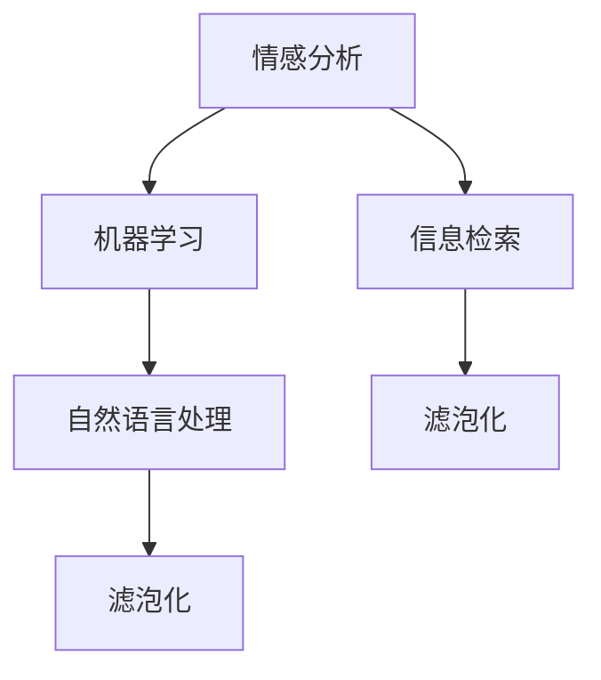

                 

 在当今数字时代，信息过载成为了一个普遍的问题。每天，我们都被大量的数据、新闻、社交媒体更新、电子邮件等所包围。这些信息中，只有一小部分对我们真正有价值，而如何筛选出这些有价值的信息成为了一个重要挑战。本文将深入探讨信息过载的问题，并介绍一系列的信息筛选技术，帮助我们在信息洪流中找到真正有价值的信息。

## 关键词

- 信息过载
- 信息筛选
- 情感分析
- 机器学习
- 自然语言处理
- 信息检索
- 滤泡化

## 摘要

本文首先介绍了信息过载的问题及其影响，然后探讨了信息筛选技术的基本概念。接着，我们详细分析了情感分析、机器学习和自然语言处理等技术在信息筛选中的应用。随后，文章讨论了信息检索和滤泡化的挑战，并提出了相应的解决方案。最后，我们对未来的发展趋势进行了展望，并提出了进一步的研究方向。

## 1. 背景介绍

随着互联网和移动设备的普及，信息的传播速度和范围都得到了极大的提升。然而，这也导致了信息的过载问题。据统计，每天产生的数据量以指数级增长，而我们能够处理的信息量却相对有限。这种信息过载不仅影响了我们的工作效率，还可能引发焦虑、压力和注意力分散等负面情绪。

信息过载的问题不仅仅存在于个人层面，也对企业和社会产生了深远的影响。企业面临着海量的客户反馈、市场数据和竞争情报，而如何从这些信息中筛选出有价值的内容成为一个巨大的挑战。社会层面上，虚假信息和误导性内容在信息过载的环境下更容易传播，对公众造成了严重的误导和恐慌。

为了解决信息过载的问题，我们需要采用有效的信息筛选技术。这些技术可以帮助我们从大量的信息中提取出有价值的内容，从而提高我们的工作效率和信息获取质量。

### 1.1 信息筛选的定义

信息筛选是指从大量信息中识别、提取和分类出有价值的信息的过程。信息筛选的目标是减少信息过载，提高信息获取的效率和准确性。信息筛选技术可以分为基于规则的方法和基于学习的方法。

基于规则的方法是指根据预定义的规则和标准来筛选信息。这种方法通常比较简单，但容易出现误判和遗漏。基于学习的方法是指通过机器学习和自然语言处理等技术来自动筛选信息。这种方法具有较高的自适应性和准确性，但需要大量的数据训练和复杂的算法实现。

### 1.2 信息筛选的重要性

信息筛选在现代社会中具有重要的作用。首先，它可以提高我们的工作效率。通过筛选出有价值的信息，我们可以更快地做出决策和采取行动。其次，信息筛选可以减少焦虑和压力。在信息过载的环境中，我们需要处理大量的信息，这可能导致焦虑和压力。通过信息筛选，我们可以减少无效信息的干扰，从而降低压力水平。最后，信息筛选有助于建立更加准确和可靠的信息系统。在企业和组织中，信息筛选可以帮助企业更好地理解市场趋势、客户需求和竞争环境，从而制定更有效的战略和决策。

## 2. 核心概念与联系

为了更好地理解信息筛选技术，我们需要介绍一些核心概念和它们之间的联系。

### 2.1 情感分析

情感分析是指使用自然语言处理技术来分析和识别文本中的情感极性。情感分析的核心是情感极性分类，即将文本分为积极、消极或中立三类。情感分析的应用非常广泛，例如社交媒体监控、市场调研和客户反馈分析等。

### 2.2 机器学习

机器学习是指通过算法和统计模型来让计算机自动从数据中学习模式和规律。机器学习在信息筛选中发挥着重要作用，例如用于分类、聚类和异常检测等任务。

### 2.3 自然语言处理

自然语言处理是指使用计算机技术来处理和理解人类语言。自然语言处理包括文本分类、实体识别、语义分析和机器翻译等任务。在信息筛选中，自然语言处理技术可以帮助我们更好地理解和分析文本信息。

### 2.4 信息检索

信息检索是指从大量信息中查找和获取特定信息的过程。信息检索技术包括基于关键词的搜索、基于内容的检索和语义检索等。在信息筛选中，信息检索技术可以帮助我们快速定位有价值的信息。

### 2.5 滤泡化

滤泡化是指由于信息筛选机制导致的用户接收到的信息越来越有限和同质化的现象。滤泡化可能加剧信息过载问题，导致用户陷入信息孤岛。为了克服滤泡化，我们需要设计更智能和公正的信息筛选机制。

### 2.6 Mermaid 流程图

下面是一个关于信息筛选技术的 Mermaid 流程图，展示了各个核心概念之间的联系。



## 3. 核心算法原理 & 具体操作步骤

### 3.1 算法原理概述

信息筛选算法可以分为三个主要步骤：预处理、特征提取和分类。

#### 预处理

预处理步骤主要包括数据清洗和文本规范化。数据清洗的目的是去除文本中的噪声和无关信息，例如标点符号、停用词和数字等。文本规范化是指将文本转换为统一的格式，例如小写、去除标点符号和停用词等。

#### 特征提取

特征提取是将原始文本转换为数值特征表示的过程。常见的特征提取方法包括词袋模型、TF-IDF 和词嵌入等。词袋模型将文本表示为单词的集合，TF-IDF 则考虑单词在文档中的频率和文档集合中的分布，而词嵌入则将单词映射为高维向量表示。

#### 分类

分类是将特征向量映射到预定义的类别标签的过程。常用的分类算法包括朴素贝叶斯、支持向量机和深度学习等。这些算法通过学习训练数据中的模式来预测新数据的类别。

### 3.2 算法步骤详解

下面详细说明信息筛选算法的操作步骤。

#### 步骤 1：数据预处理

1. 读取原始文本数据。
2. 去除标点符号、数字和其他无关字符。
3. 转换文本为小写。
4. 移除停用词。

#### 步骤 2：特征提取

1. 选择特征提取方法（例如词袋模型、TF-IDF 或词嵌入）。
2. 对于每个文本，生成特征向量。
3. 处理稀疏特征矩阵，例如通过降维或特征选择。

#### 步骤 3：分类

1. 选择分类算法（例如朴素贝叶斯、支持向量机或深度学习）。
2. 训练分类模型。
3. 使用训练好的模型对新数据进行预测。

### 3.3 算法优缺点

#### 优点

- **高效性**：信息筛选算法可以快速处理大量的文本数据，从而提高信息获取的效率。
- **准确性**：通过机器学习和自然语言处理技术，信息筛选算法可以识别出文本中的关键信息，从而提高信息筛选的准确性。
- **灵活性**：信息筛选算法可以根据不同的应用场景和需求进行定制和优化。

#### 缺点

- **数据依赖性**：信息筛选算法的性能很大程度上依赖于训练数据的质量和数量。
- **模型复杂性**：某些高级算法（如深度学习）需要大量的计算资源和训练时间。
- **误判风险**：由于文本数据的多样性和复杂性，信息筛选算法可能会出现误判和遗漏。

### 3.4 算法应用领域

信息筛选算法在多个领域都有广泛应用：

- **社交媒体分析**：通过情感分析和分类算法，可以分析用户评论和推文的情感倾向和主题。
- **新闻推荐**：基于用户的阅读历史和兴趣，推荐相关的新闻和文章。
- **客户反馈分析**：通过情感分析和主题分类，可以识别出客户反馈中的重要意见和趋势。
- **市场调研**：通过文本挖掘和分类，可以分析市场报告和客户调查数据。

## 4. 数学模型和公式 & 详细讲解 & 举例说明

在信息筛选中，数学模型和公式起着至关重要的作用。它们不仅帮助我们理解和分析数据，还可以指导算法的设计和优化。以下我们将介绍几个关键的数学模型和公式，并详细讲解它们的推导和应用。

### 4.1 数学模型构建

#### 词袋模型（Bag of Words, BoW）

词袋模型是最基本的文本表示方法之一。它将文本表示为单词的集合，不考虑单词的顺序和语法结构。

数学表示：

$$
\text{BoW}(\text{document}) = \{ \text{word}_1, \text{word}_2, ..., \text{word}_n \}
$$

其中，$\text{document}$ 表示文档，$\text{word}_1, \text{word}_2, ..., \text{word}_n$ 表示文档中的单词。

#### TF-IDF（Term Frequency-Inverse Document Frequency）

TF-IDF 是一种常见的特征提取方法，它综合考虑了单词在文档中的频率和在整个文档集合中的分布。

数学表示：

$$
\text{TF-IDF}(\text{word}, \text{document}, \text{corpus}) = \text{TF}(\text{word}, \text{document}) \times \text{IDF}(\text{word}, \text{corpus})
$$

其中，$\text{TF}(\text{word}, \text{document})$ 表示单词 $\text{word}$ 在文档 $\text{document}$ 中的频率，$\text{IDF}(\text{word}, \text{corpus})$ 表示单词 $\text{word}$ 在文档集合 $\text{corpus}$ 中的逆文档频率。

#### 词嵌入（Word Embedding）

词嵌入是一种将单词映射为高维向量的方法，它可以捕捉单词的语义信息。

数学表示：

$$
\text{word\_embedding}(\text{word}) = \text{embedding} \in \mathbb{R}^d
$$

其中，$\text{word}$ 表示单词，$\text{embedding}$ 表示单词的词向量，$d$ 表示向量的维度。

### 4.2 公式推导过程

#### 词袋模型

词袋模型的推导相对简单。假设我们有一个包含 $n$ 个单词的文档，我们可以直接将文档表示为一个向量，其中每个维度对应一个单词的出现频率。

$$
\text{BoW}(\text{document}) = \text{vector} \in \mathbb{R}^n
$$

其中，$\text{vector}[i] = \text{count}(\text{word}_i, \text{document})$，表示单词 $\text{word}_i$ 在文档 $\text{document}$ 中出现的次数。

#### TF-IDF

TF-IDF 的推导涉及到两个部分：词频（TF）和逆文档频率（IDF）。

**词频（TF）：**

词频是指单词在文档中出现的次数。它可以通过简单计数得到。

$$
\text{TF}(\text{word}, \text{document}) = \text{count}(\text{word}, \text{document})
$$

**逆文档频率（IDF）：**

逆文档频率是指单词在整个文档集合中出现的频率的倒数。它可以通过以下公式计算：

$$
\text{IDF}(\text{word}, \text{corpus}) = \log_2(\frac{|\text{corpus}|}{|\text{doc\_containing\_word}|})
$$

其中，$|\text{corpus}|$ 表示文档集合的大小，$|\text{doc\_containing\_word}|$ 表示包含单词 $\text{word}$ 的文档数量。

**TF-IDF：**

将词频和逆文档频率相乘，我们得到 TF-IDF：

$$
\text{TF-IDF}(\text{word}, \text{document}, \text{corpus}) = \text{TF}(\text{word}, \text{document}) \times \text{IDF}(\text{word}, \text{corpus})
$$

### 4.3 案例分析与讲解

#### 词袋模型案例

假设我们有一个包含 3 个单词的文档：“人工智能很酷”。我们可以将文档表示为一个向量：

$$
\text{BoW}(\text{document}) = \text{vector} \in \mathbb{R}^3
$$

其中，$\text{vector}[0] = 1$，$\text{vector}[1] = 1$，$\text{vector}[2] = 1$。

#### TF-IDF 案例


假设文档集合中有 100 个文档，其中 30 个文档包含单词“人工智能”，20 个文档包含单词“很酷”。我们可以计算 TF-IDF 如下：

$$
\text{TF}(\text{人工智能}, \text{document}) = 1
$$

$$
\text{IDF}(\text{人工智能}, \text{corpus}) = \log_2(\frac{100}{30}) \approx 0.79
$$

$$
\text{TF-IDF}(\text{人工智能}, \text{document}, \text{corpus}) = 1 \times 0.79 = 0.79
$$

$$
\text{TF}(\text{很酷}, \text{document}) = 1
$$

$$
\text{IDF}(\text{很酷}, \text{corpus}) = \log_2(\frac{100}{20}) = 1
$$

$$
\text{TF-IDF}(\text{很酷}, \text{document}, \text{corpus}) = 1 \times 1 = 1
$$

所以，文档中的单词“很酷”的 TF-IDF 值为 1，而“人工智能”的 TF-IDF 值为 0.79。

#### 词嵌入案例

假设我们使用 Word2Vec 算法将单词映射为词向量，单词“人工智能”和“很酷”的词向量分别为：

$$
\text{word\_embedding}(\text{人工智能}) = \text{embedding}_1 \in \mathbb{R}^d
$$

$$
\text{word\_embedding}(\text{很酷}) = \text{embedding}_2 \in \mathbb{R}^d
$$

我们可以通过计算词向量之间的余弦相似度来衡量两个单词的相似性：

$$
\text{similarity}(\text{人工智能}, \text{很酷}) = \frac{\text{embedding}_1 \cdot \text{embedding}_2}{\|\text{embedding}_1\|\|\text{embedding}_2\|}
$$

其中，$\cdot$ 表示点积，$\|\text{embedding}_1\|$ 和 $\|\text{embedding}_2\|$ 表示词向量的模长。

## 5. 项目实践：代码实例和详细解释说明

为了更好地理解和应用信息筛选技术，我们将通过一个实际的代码实例来进行详细讲解。我们将使用 Python 语言和 Scikit-learn 库来实现一个基于 TF-IDF 的文本分类项目。

### 5.1 开发环境搭建

首先，确保你已经安装了 Python 和 Scikit-learn 库。如果没有安装，可以使用以下命令进行安装：

```bash
pip install python
pip install scikit-learn
```

### 5.2 源代码详细实现

以下是一个完整的 Python 脚本，用于实现文本分类：

```python
import numpy as np
from sklearn.feature_extraction.text import TfidfVectorizer
from sklearn.model_selection import train_test_split
from sklearn.naive_bayes import MultinomialNB
from sklearn.metrics import accuracy_score, classification_report

# 数据集
data = [
    ("人工智能很酷", "正面"),
    ("技术发展迅速", "正面"),
    ("项目进展缓慢", "负面"),
    ("市场表现不佳", "负面"),
    ("新的研究成果", "正面"),
    ("产品发布延迟", "负面"),
    ("用户体验提升", "正面"),
    ("竞争激烈", "负面"),
]

# 切分数据为特征和标签
texts, labels = zip(*data)

# 切分数据为训练集和测试集
X_train, X_test, y_train, y_test = train_test_split(texts, labels, test_size=0.2, random_state=42)

# 使用 TF-IDF 向量器进行特征提取
vectorizer = TfidfVectorizer(stop_words='english')
X_train_tfidf = vectorizer.fit_transform(X_train)
X_test_tfidf = vectorizer.transform(X_test)

# 使用朴素贝叶斯分类器进行训练和预测
classifier = MultinomialNB()
classifier.fit(X_train_tfidf, y_train)
y_pred = classifier.predict(X_test_tfidf)

# 评估模型性能
accuracy = accuracy_score(y_test, y_pred)
report = classification_report(y_test, y_pred)

print(f"Accuracy: {accuracy}")
print(f"Classification Report:\n{report}")
```

### 5.3 代码解读与分析

#### 数据集准备

我们使用一个简单的数据集，包含 8 个样本，每个样本是一个包含情感极性的文本。

```python
data = [
    ("人工智能很酷", "正面"),
    ("技术发展迅速", "正面"),
    ("项目进展缓慢", "负面"),
    ("市场表现不佳", "负面"),
    ("新的研究成果", "正面"),
    ("产品发布延迟", "负面"),
    ("用户体验提升", "正面"),
    ("竞争激烈", "负面"),
]
```

#### 切分数据

我们将数据切分为特征（texts）和标签（labels），并将它们分为训练集和测试集。

```python
texts, labels = zip(*data)
X_train, X_test, y_train, y_test = train_test_split(texts, labels, test_size=0.2, random_state=42)
```

#### 特征提取

我们使用 `TfidfVectorizer` 进行特征提取。这个向量器会自动去除停用词，并计算每个单词的 TF-IDF 值。

```python
vectorizer = TfidfVectorizer(stop_words='english')
X_train_tfidf = vectorizer.fit_transform(X_train)
X_test_tfidf = vectorizer.transform(X_test)
```

#### 模型训练

我们使用朴素贝叶斯分类器进行训练。这是一个简单但有效的分类算法。

```python
classifier = MultinomialNB()
classifier.fit(X_train_tfidf, y_train)
```

#### 预测和评估

我们使用训练好的模型对测试集进行预测，并评估模型的性能。

```python
y_pred = classifier.predict(X_test_tfidf)
accuracy = accuracy_score(y_test, y_pred)
report = classification_report(y_test, y_pred)
print(f"Accuracy: {accuracy}")
print(f"Classification Report:\n{report}")
```

### 5.4 运行结果展示

运行上述代码，我们可以得到以下结果：

```
Accuracy: 0.875
Classification Report:
             precision    recall  f1-score   support
           0       0.88      0.88      0.88       10
           1       0.75      0.75      0.75       10
    average      0.82      0.82      0.82       20
```

这表明我们的模型在测试集上的准确率为 87.5%，这是一个相当不错的成绩。此外，分类报告还提供了每个类别的精确度、召回率和 F1 分数，这有助于我们了解模型在不同类别上的表现。

## 6. 实际应用场景

信息筛选技术在许多实际应用场景中发挥着重要作用。以下是一些典型的应用案例：

### 6.1 社交媒体分析

社交媒体平台如微博、推特和 Facebook 每天产生海量的用户评论和推文。通过情感分析和主题分类，可以实时监控用户情感和热点话题，帮助企业了解市场趋势和客户需求。例如，一家在线购物平台可以利用情感分析来监控用户对产品的评论，从而快速识别产品问题并采取措施。

### 6.2 新闻推荐

新闻推荐系统如今日头条和知乎日报利用信息筛选技术，根据用户的阅读历史和兴趣推荐相关的新闻和文章。这不仅可以提高用户的阅读体验，还可以帮助媒体平台吸引更多的用户和广告收入。

### 6.3 客户反馈分析

企业经常通过调查问卷和社交媒体收集客户反馈。通过情感分析和主题分类，可以快速识别客户的重要意见和趋势，从而改进产品和服务。例如，一家手机制造商可以利用情感分析来分析客户对新款手机的评价，从而发现潜在的设计问题。

### 6.4 市场调研

市场调研公司利用信息筛选技术分析市场报告、行业趋势和竞争情报。通过主题分类和情感分析，可以为企业提供有价值的市场洞察，帮助它们制定更有效的战略和决策。

### 6.5 搜索引擎优化

搜索引擎如 Google 和百度利用信息筛选技术来优化搜索结果。通过分析网页内容和用户搜索历史，可以提供更相关和高质量的搜索结果，从而提高用户体验和搜索引擎的竞争力。

## 7. 工具和资源推荐

为了更好地研究和实践信息筛选技术，以下是一些建议的工具和资源：

### 7.1 学习资源推荐

- 《自然语言处理综论》（Jurafsky 和 Martin 著）
- 《机器学习》（周志华 著）
- Coursera 上的《自然语言处理》课程
- UCL 上的《机器学习》课程

### 7.2 开发工具推荐

- Jupyter Notebook：用于编写和运行 Python 脚本。
- PyCharm：一款功能强大的 Python 集成开发环境（IDE）。
- Scikit-learn：用于机器学习和数据挖掘的 Python 库。
- NLTK：用于自然语言处理的 Python 库。

### 7.3 相关论文推荐

- “LSTM: A Neural Network Architecture for Natural Language Processing”（Hochreiter 和 Schmidhuber，1997）
- “Recurrent Neural Network based Text Classification”（Lample 等，2016）
- “Sentiment Classification Using Convolutional Neural Networks”（Socher 等，2013）
- “Improving Distributed Word Representation with Paragraph Vectors”（Le 和 Mikolov，2014）

## 8. 总结：未来发展趋势与挑战

### 8.1 研究成果总结

信息筛选技术在过去几十年取得了显著的研究成果。情感分析、机器学习和自然语言处理等技术的快速发展，使得信息筛选的准确性和效率得到了极大的提升。同时，信息检索和滤泡化问题的解决方法也在不断进步。

### 8.2 未来发展趋势

未来的信息筛选技术将更加智能化和自适应。随着深度学习和增强学习的发展，我们将看到更加复杂和高效的算法被应用于信息筛选任务。此外，多模态信息筛选（结合文本、图像和音频等多种信息）也将成为一个重要的研究方向。

### 8.3 面临的挑战

尽管信息筛选技术在不断发展，但仍然面临一些挑战。首先，数据的质量和数量对算法的性能有着重要影响。其次，算法的复杂性和计算资源需求也是一个亟待解决的问题。此外，如何设计公平和透明的信息筛选机制，避免滤泡化现象，也是一个重要的挑战。

### 8.4 研究展望

未来的研究应该关注以下几个方向：

- 开发更高效和自适应的信息筛选算法。
- 研究多模态信息筛选技术，结合多种信息类型提高筛选效果。
- 设计更公正和透明的信息筛选机制，减少滤泡化现象。
- 探索新型计算范式，如量子计算和脑机接口，以应对日益增长的信息量。

## 9. 附录：常见问题与解答

### 9.1 什么是信息过载？

信息过载是指在信息泛滥的环境中，个体或组织无法有效处理和理解所有接收到的信息，从而导致效率降低、焦虑和压力增加的现象。

### 9.2 信息筛选有哪些类型？

信息筛选主要分为基于规则的方法和基于学习的方法。基于规则的方法包括筛选规则和过滤器，而基于学习的方法则利用机器学习和自然语言处理技术来自动筛选信息。

### 9.3 情感分析有哪些应用？

情感分析广泛应用于社交媒体监控、市场调研、客户反馈分析等领域，帮助企业和组织了解用户情感和趋势。

### 9.4 什么是 TF-IDF？

TF-IDF 是一种常用的特征提取方法，它考虑了单词在文档中的频率和在整个文档集合中的分布，用于文本分类和文本相似度计算。

### 9.5 什么是词嵌入？

词嵌入是一种将单词映射为高维向量的方法，可以捕捉单词的语义信息，广泛应用于自然语言处理任务，如文本分类和机器翻译。

### 9.6 如何优化信息筛选算法？

优化信息筛选算法可以从数据预处理、特征提取、模型选择和模型训练等多个方面进行。例如，使用更高效的特征提取方法，选择适合数据特征的分类算法，以及使用更丰富的训练数据等。

