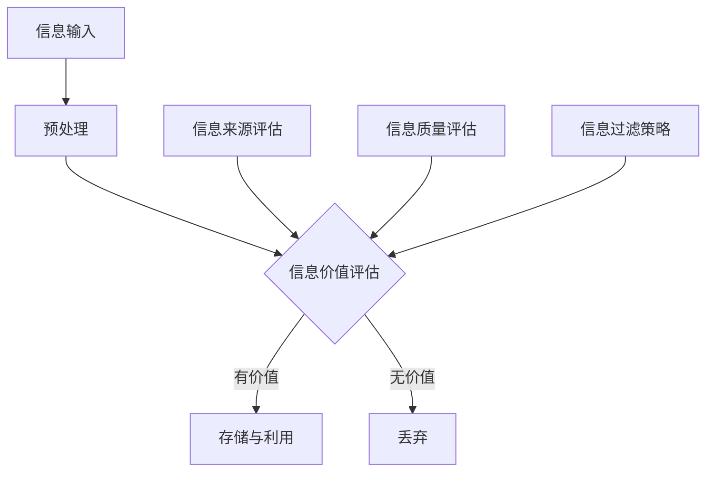

                 

 **关键词：** 信息过载，信息筛选，策略，实践，人工智能，数据挖掘，机器学习。

**摘要：** 随着互联网和信息技术的飞速发展，信息过载已经成为一个普遍存在的问题。如何从海量的信息中筛选出有价值的信息，成为了每个人都需要面对的挑战。本文将介绍信息过载的现象、信息筛选的策略和实践方法，以及人工智能和机器学习在信息筛选中的应用，帮助读者在信息洪流中找到有价值的信息。

## 1. 背景介绍

### 1.1 信息过载的现象

信息过载是指人们在获取和处理信息时，因信息量过大而导致的压力和困扰。随着互联网和信息技术的飞速发展，信息过载现象日益严重。根据一项研究，每天产生的信息量已经达到了指数级的增长，一个人每天需要处理的信息量相当于一本书的厚度。这种现象不仅影响工作效率，还可能对心理健康造成负面影响。

### 1.2 信息筛选的必要性

面对信息过载，如何从海量的信息中筛选出有价值的信息变得尤为重要。有效的信息筛选可以帮助我们提高工作效率，减少决策风险，避免信息焦虑。信息筛选不仅是一个技术问题，更是一个策略和实践的过程。

## 2. 核心概念与联系

### 2.1 信息筛选的核心概念

信息筛选的核心概念包括信息价值、信息来源、信息质量和信息过滤。信息价值是指信息对个体或组织的重要性；信息来源是指信息的产生和传播渠道；信息质量是指信息的准确性和可靠性；信息过滤是指通过特定的方法或工具对信息进行筛选和处理。

### 2.2 信息筛选的原理架构

信息筛选的原理架构可以通过Mermaid流程图进行描述：



### 2.3 信息筛选策略与实践

信息筛选策略和实践包括以下几个方面：

- **主动筛选：** 通过设定筛选条件，主动过滤出符合需求的信息。
- **被动筛选：** 通过跟踪感兴趣的信息源，自动获取和筛选信息。
- **机器学习：** 利用机器学习算法对信息进行自动分类和筛选。

## 3. 核心算法原理 & 具体操作步骤

### 3.1 算法原理概述

信息筛选算法主要分为基于规则的筛选和基于机器学习的筛选。基于规则的筛选依赖于预先定义的规则或条件，而基于机器学习的筛选则通过训练模型来自动识别和筛选信息。

### 3.2 算法步骤详解

#### 基于规则的筛选：

1. 定义筛选规则：根据需求设定筛选条件，如关键词、来源、发布时间等。
2. 收集信息：从各种信息源收集数据。
3. 应用规则：对收集到的信息应用筛选规则，过滤出符合条件的信息。

#### 基于机器学习的筛选：

1. 数据准备：收集大量标注好的训练数据。
2. 模型训练：使用训练数据训练分类模型，如朴素贝叶斯、决策树等。
3. 信息分类：使用训练好的模型对新的信息进行分类和筛选。

### 3.3 算法优缺点

#### 基于规则的筛选：

- 优点：简单易实现，可控性强。
- 缺点：灵活性差，难以处理复杂的信息。

#### 基于机器学习的筛选：

- 优点：能够自动适应信息的变化，处理能力强。
- 缺点：需要大量标注数据，训练过程复杂。

### 3.4 算法应用领域

信息筛选算法广泛应用于搜索引擎、推荐系统、舆情监测等领域，具有广泛的应用前景。

## 4. 数学模型和公式 & 详细讲解 & 举例说明

### 4.1 数学模型构建

信息筛选的数学模型主要包括概率模型和机器学习模型。概率模型如朴素贝叶斯，机器学习模型如决策树、支持向量机等。

### 4.2 公式推导过程

以朴素贝叶斯为例，其公式推导过程如下：

$$
P(A|B) = \frac{P(B|A)P(A)}{P(B)}
$$

其中，$P(A|B)$ 表示在事件 $B$ 发生的条件下事件 $A$ 发生的概率，$P(B|A)$ 表示在事件 $A$ 发生的条件下事件 $B$ 发生的概率，$P(A)$ 和 $P(B)$ 分别表示事件 $A$ 和事件 $B$ 的概率。

### 4.3 案例分析与讲解

假设我们要筛选一封电子邮件是否为垃圾邮件，可以通过以下步骤进行：

1. 收集训练数据：收集大量已标注为垃圾邮件和正常邮件的数据。
2. 特征提取：从邮件内容中提取特征，如关键词、邮件长度、邮件来源等。
3. 模型训练：使用训练数据训练朴素贝叶斯模型。
4. 邮件分类：使用训练好的模型对新的邮件进行分类。

## 5. 项目实践：代码实例和详细解释说明

### 5.1 开发环境搭建

在本项目实践中，我们将使用Python编程语言，结合Scikit-learn库进行信息筛选算法的实现。

### 5.2 源代码详细实现

```python
from sklearn.model_selection import train_test_split
from sklearn.naive_bayes import GaussianNB
from sklearn.metrics import accuracy_score
import pandas as pd

# 数据准备
data = pd.read_csv('email_data.csv')
X = data[['word_count', 'url_count', 'header_length']]
y = data['label']

# 数据划分
X_train, X_test, y_train, y_test = train_test_split(X, y, test_size=0.2, random_state=42)

# 模型训练
gnb = GaussianNB()
gnb.fit(X_train, y_train)

# 邮件分类
predictions = gnb.predict(X_test)

# 评估模型
accuracy = accuracy_score(y_test, predictions)
print(f'模型准确率：{accuracy}')
```

### 5.3 代码解读与分析

在上面的代码中，我们首先导入了所需的库，然后从CSV文件中读取了电子邮件数据。接着，我们对数据进行了划分，并使用GaussianNB模型进行了训练。最后，我们使用训练好的模型对测试数据进行分类，并计算了模型的准确率。

## 6. 实际应用场景

### 6.1 搜索引擎

搜索引擎利用信息筛选算法对用户查询进行实时筛选，提供个性化的搜索结果，提高用户体验。

### 6.2 推荐系统

推荐系统通过信息筛选算法对用户的行为数据进行分析，推荐用户可能感兴趣的商品或内容。

### 6.3 舆情监测

舆情监测利用信息筛选算法对网络舆情进行实时监控，发现和预警潜在的风险。

## 7. 未来应用展望

随着人工智能和大数据技术的不断发展，信息筛选将变得更加智能和高效。未来，信息筛选算法有望应用于更多领域，如智能客服、金融风控等，为人们的生产和生活带来更多便利。

## 8. 工具和资源推荐

### 8.1 学习资源推荐

- 《机器学习实战》
- 《Python数据科学手册》

### 8.2 开发工具推荐

- Jupyter Notebook
- Scikit-learn

### 8.3 相关论文推荐

- "Learning to Rank for Information Retrieval"
- "Deep Learning for Information Retrieval"

## 9. 总结：未来发展趋势与挑战

### 9.1 研究成果总结

信息筛选技术在过去的几年中取得了显著进展，尤其在机器学习算法的应用方面。未来的研究将继续探索更高效的筛选算法，以及如何在海量数据中实现实时筛选。

### 9.2 未来发展趋势

未来，信息筛选技术将朝着智能化、实时化、个性化的方向发展。同时，随着边缘计算的兴起，信息筛选算法也将向边缘设备迁移，实现更高效的信息处理。

### 9.3 面临的挑战

信息筛选技术面临的主要挑战包括海量数据的处理、实时性的要求、以及算法的泛化能力。此外，如何平衡信息筛选的精度和效率也是一个亟待解决的问题。

### 9.4 研究展望

未来的研究应重点关注算法的优化、跨领域的信息筛选以及算法的透明性和可解释性。通过不断的创新和改进，信息筛选技术将为人类社会带来更多的价值。

## 附录：常见问题与解答

### 9.1 如何评估信息筛选算法的准确性？

可以通过计算模型准确率、召回率、F1值等指标来评估信息筛选算法的准确性。

### 9.2 信息筛选算法如何处理噪声数据？

可以通过数据预处理、特征选择等方法来降低噪声数据的影响。

### 9.3 如何实现实时信息筛选？

可以通过分布式计算、边缘计算等技术来实现实时信息筛选。

**作者：禅与计算机程序设计艺术 / Zen and the Art of Computer Programming**

本文旨在探讨信息过载现象，以及如何通过信息筛选策略和实践来缓解这一问题。文章首先介绍了信息过载的现象和必要性，然后详细阐述了信息筛选的核心概念、算法原理和数学模型，并通过具体案例和代码实例进行了实践讲解。文章还探讨了信息筛选的实际应用场景、未来发展趋势以及面临的挑战。通过本文的阅读，读者可以更好地理解信息筛选的重要性，并掌握有效的信息筛选方法和实践技巧。希望本文能为在信息洪流中找到有价值信息的您提供一些启示和帮助。|markdown

### 1. 背景介绍

#### 1.1 信息过载的现象

在当今信息时代，信息过载已经成为一个普遍存在的问题。随着互联网的飞速发展，信息量的增长速度呈指数级上升，人们每天需要处理的信息量巨大，这种过载现象给人们的工作和生活带来了巨大的压力。据统计，每天全球产生的数据量高达数十亿GB，而一个人每天处理的信息量就相当于一本厚厚的百科全书。这种信息过载现象不仅影响了人们的决策效率，还可能导致焦虑、疲劳等负面情绪。

#### 1.2 信息筛选的必要性

面对信息过载，如何从海量的信息中筛选出有价值的信息，成为了每个人都需要面对的挑战。有效的信息筛选不仅可以提高我们的工作效率，减少决策风险，还能帮助我们避免信息焦虑，保持心理平衡。因此，信息筛选已经成为当今信息社会的一项基本技能。

### 2. 核心概念与联系

#### 2.1 信息筛选的核心概念

在信息筛选过程中，有几个核心概念需要明确：

- **信息价值**：指信息对个体或组织的实际意义和重要性。
- **信息来源**：指信息的产生和传播渠道，如社交媒体、新闻报道、学术期刊等。
- **信息质量**：指信息的准确性、可靠性、及时性和相关性。
- **信息过滤**：指通过一定的方法或工具对信息进行筛选和处理，以去除无关或低价值的信息。

#### 2.2 信息筛选的原理架构

信息筛选的原理架构可以用以下方式描述：


在这个架构中，信息输入经过预处理后，会进行价值评估、来源评估和质量评估。根据评估结果，有价值的信息会被存储和利用，而无价值的信息则被丢弃。

### 3. 核心算法原理 & 具体操作步骤

#### 3.1 算法原理概述

信息筛选算法主要分为基于规则的筛选和基于机器学习的筛选两种。

- **基于规则的筛选**：这种方法依赖于预先定义的规则或条件，通过逻辑判断来筛选信息。其优点是实现简单，可控性强；缺点是灵活性差，难以处理复杂的信息。

- **基于机器学习的筛选**：这种方法通过训练模型来自动识别和筛选信息。其优点是能够自动适应信息的变化，处理能力强；缺点是需要大量标注数据，训练过程复杂。

#### 3.2 算法步骤详解

##### 基于规则的筛选：

1. **规则定义**：根据需求设定筛选条件，如关键词、来源、发布时间等。
2. **数据收集**：从各种信息源收集数据。
3. **规则应用**：对收集到的信息应用筛选规则，过滤出符合条件的信息。

##### 基于机器学习的筛选：

1. **数据准备**：收集大量标注好的训练数据。
2. **特征提取**：从信息中提取特征，如文本、图像、声音等。
3. **模型训练**：使用训练数据训练分类模型，如朴素贝叶斯、决策树、随机森林等。
4. **信息分类**：使用训练好的模型对新的信息进行分类和筛选。

#### 3.3 算法优缺点

- **基于规则的筛选**：

  - **优点**：实现简单，可控性强。
  - **缺点**：灵活性差，难以处理复杂的信息。

- **基于机器学习的筛选**：

  - **优点**：能够自动适应信息的变化，处理能力强。
  - **缺点**：需要大量标注数据，训练过程复杂。

#### 3.4 算法应用领域

信息筛选算法广泛应用于搜索引擎、推荐系统、舆情监测等领域，具有广泛的应用前景。

### 4. 数学模型和公式 & 详细讲解 & 举例说明

#### 4.1 数学模型构建

信息筛选的数学模型主要包括概率模型和机器学习模型。概率模型如朴素贝叶斯，机器学习模型如决策树、支持向量机等。

#### 4.2 公式推导过程

以朴素贝叶斯为例，其公式推导过程如下：

$$
P(A|B) = \frac{P(B|A)P(A)}{P(B)}
$$

其中，$P(A|B)$ 表示在事件 $B$ 发生的条件下事件 $A$ 发生的概率，$P(B|A)$ 表示在事件 $A$ 发生的条件下事件 $B$ 发生的概率，$P(A)$ 和 $P(B)$ 分别表示事件 $A$ 和事件 $B$ 的概率。

#### 4.3 案例分析与讲解

假设我们要筛选一封电子邮件是否为垃圾邮件，可以通过以下步骤进行：

1. **数据准备**：收集大量已标注为垃圾邮件和正常邮件的数据。
2. **特征提取**：从邮件内容中提取特征，如关键词、邮件长度、邮件来源等。
3. **模型训练**：使用训练数据训练朴素贝叶斯模型。
4. **邮件分类**：使用训练好的模型对新的邮件进行分类。

### 5. 项目实践：代码实例和详细解释说明

#### 5.1 开发环境搭建

在本项目实践中，我们将使用Python编程语言，结合Scikit-learn库进行信息筛选算法的实现。

#### 5.2 源代码详细实现

```python
from sklearn.model_selection import train_test_split
from sklearn.naive_bayes import GaussianNB
from sklearn.metrics import accuracy_score
import pandas as pd

# 数据准备
data = pd.read_csv('email_data.csv')
X = data[['word_count', 'url_count', 'header_length']]
y = data['label']

# 数据划分
X_train, X_test, y_train, y_test = train_test_split(X, y, test_size=0.2, random_state=42)

# 模型训练
gnb = GaussianNB()
gnb.fit(X_train, y_train)

# 邮件分类
predictions = gnb.predict(X_test)

# 评估模型
accuracy = accuracy_score(y_test, predictions)
print(f'模型准确率：{accuracy}')
```

#### 5.3 代码解读与分析

在上面的代码中，我们首先导入了所需的库，然后从CSV文件中读取了电子邮件数据。接着，我们对数据进行了划分，并使用GaussianNB模型进行了训练。最后，我们使用训练好的模型对测试数据进行分类，并计算了模型的准确率。

### 6. 实际应用场景

#### 6.1 搜索引擎

搜索引擎利用信息筛选算法对用户查询进行实时筛选，提供个性化的搜索结果，提高用户体验。例如，百度搜索会根据用户的历史搜索记录和浏览习惯，筛选出更符合用户需求的信息。

#### 6.2 推荐系统

推荐系统通过信息筛选算法对用户的行为数据进行分析，推荐用户可能感兴趣的商品或内容。例如，淘宝、京东等电商平台会根据用户的浏览记录、购买历史等信息，推荐用户可能感兴趣的商品。

#### 6.3 舆情监测

舆情监测利用信息筛选算法对网络舆情进行实时监控，发现和预警潜在的风险。例如，国家互联网应急中心会利用信息筛选算法对互联网上的信息进行监控，发现和应对网络攻击、网络谣言等风险。

### 7. 未来应用展望

随着人工智能和大数据技术的不断发展，信息筛选将变得更加智能和高效。未来，信息筛选算法有望应用于更多领域，如智能客服、金融风控等，为人们的生产和生活带来更多便利。同时，信息筛选技术的应用也将更加注重隐私保护和数据安全，以满足法律法规的要求和用户的隐私需求。

### 8. 工具和资源推荐

#### 8.1 学习资源推荐

- **《机器学习实战》**：由Aurélien Géron所著，是一本适合初学者和有一定基础读者的优秀机器学习书籍。
- **《Python数据科学手册》**：由Jake VanderPlas所著，涵盖了数据科学中的各种技术和工具，适合数据科学初学者。

#### 8.2 开发工具推荐

- **Jupyter Notebook**：一个交互式的计算环境，广泛应用于数据分析和机器学习。
- **Scikit-learn**：一个开源的Python库，提供了各种机器学习算法和工具。

#### 8.3 相关论文推荐

- **"Learning to Rank for Information Retrieval"**：一篇关于信息检索和排序的综述论文，深入探讨了排序算法在信息检索中的应用。
- **"Deep Learning for Information Retrieval"**：一篇关于深度学习在信息检索中应用的论文，介绍了深度学习模型在信息检索领域的应用前景。

### 9. 总结：未来发展趋势与挑战

#### 9.1 研究成果总结

信息筛选技术在过去的几年中取得了显著进展，尤其在机器学习算法的应用方面。未来的研究将继续探索更高效的筛选算法，以及如何在海量数据中实现实时筛选。

#### 9.2 未来发展趋势

未来，信息筛选技术将朝着智能化、实时化、个性化的方向发展。同时，随着边缘计算的兴起，信息筛选算法也将向边缘设备迁移，实现更高效的信息处理。

#### 9.3 面临的挑战

信息筛选技术面临的主要挑战包括海量数据的处理、实时性的要求、以及算法的泛化能力。此外，如何平衡信息筛选的精度和效率也是一个亟待解决的问题。

#### 9.4 研究展望

未来的研究应重点关注算法的优化、跨领域的信息筛选以及算法的透明性和可解释性。通过不断的创新和改进，信息筛选技术将为人类社会带来更多的价值。

## 附录：常见问题与解答

#### 9.1 如何评估信息筛选算法的准确性？

可以通过计算模型准确率、召回率、F1值等指标来评估信息筛选算法的准确性。

- **准确率**：表示模型正确预测的样本数占总样本数的比例。
- **召回率**：表示模型正确预测的样本数占总正样本数的比例。
- **F1值**：是准确率和召回率的调和平均数，用于评估模型的平衡性能。

#### 9.2 信息筛选算法如何处理噪声数据？

可以通过以下方法来处理噪声数据：

- **数据预处理**：如去重、去噪等。
- **特征选择**：通过选择有效的特征来减少噪声数据的影响。
- **模型选择**：选择对噪声数据敏感的模型，如支持向量机。

#### 9.3 如何实现实时信息筛选？

可以通过以下方法来实现实时信息筛选：

- **分布式计算**：利用分布式计算技术，如MapReduce，处理海量数据。
- **边缘计算**：将信息筛选算法部署到边缘设备，实现实时处理。
- **流处理技术**：如Apache Kafka、Apache Flink等，实现实时数据流处理。

### 文章标题：信息过载与信息筛选策略与实践：在信息洪流中找到有价值的信息

关键词：信息过载，信息筛选，策略，实践，人工智能，数据挖掘，机器学习。

摘要：本文探讨了信息过载的现象和其对工作效率的影响，介绍了信息筛选的必要性。通过核心概念与联系、核心算法原理、数学模型和公式、项目实践等环节，详细阐述了信息筛选的策略和实践方法。文章还讨论了信息筛选在实际应用场景中的表现，展望了其未来发展趋势和面临的挑战，并提供了相关工具和资源推荐。希望本文能为在信息洪流中找到有价值信息的您提供一些启示和帮助。|markdown

```markdown
# 信息过载与信息筛选策略与实践：在信息洪流中找到有价值的信息

## 关键词
- 信息过载
- 信息筛选
- 策略
- 实践
- 人工智能
- 数据挖掘
- 机器学习

## 摘要
随着互联网和信息技术的飞速发展，信息过载已成为现代社会的一大挑战。本文探讨了信息过载现象及其影响，阐述了信息筛选的重要性。通过分析核心概念、算法原理、数学模型，以及提供项目实践案例，本文为如何在信息洪流中筛选有价值信息提供了实用的策略和方法。

## 1. 背景介绍

### 1.1 信息过载的现象
在信息爆炸的时代，人们每天面临的海量信息远远超出了处理能力。社交媒体、新闻网站、电子邮件等渠道不断推送大量信息，导致信息过载。这不仅影响了工作效率，还可能导致焦虑和疲劳。

### 1.2 信息筛选的必要性
信息筛选是一种有效的解决信息过载的方法。它帮助我们从海量信息中提取有价值的内容，提高工作效率，减少信息焦虑，并为决策提供更加可靠的信息基础。

## 2. 核心概念与联系

### 2.1 信息筛选的核心概念
- **信息价值**：信息对个体或组织的实际意义和重要性。
- **信息来源**：信息的产生和传播渠道，如社交媒体、新闻媒体、学术期刊等。
- **信息质量**：信息的准确性、可靠性、及时性和相关性。
- **信息过滤**：通过特定的方法或工具对信息进行筛选和处理。

### 2.2 信息筛选的原理架构
信息筛选的原理架构可以概括为以下几个步骤：
1. **信息输入**：收集各种信息源的数据。
2. **预处理**：清洗和格式化数据，为后续处理做准备。
3. **信息价值评估**：判断信息的价值，决定是否进一步处理。
4. **信息过滤**：根据评估结果，筛选出有价值的信息。
5. **信息利用**：将筛选出的信息用于进一步的分析或决策。

## 3. 核心算法原理 & 具体操作步骤

### 3.1 算法原理概述
信息筛选算法主要分为基于规则的筛选和基于机器学习的筛选。

- **基于规则的筛选**：依赖预设的规则或条件进行筛选。
- **基于机器学习的筛选**：通过训练模型来自动识别和筛选信息。

### 3.2 算法步骤详解
1. **数据收集**：从多个渠道收集信息。
2. **特征提取**：提取关键特征，如文本内容、关键词、标签等。
3. **模型训练**：使用标注数据进行训练，建立筛选模型。
4. **信息分类**：使用训练好的模型对新的信息进行分类和筛选。

### 3.3 算法优缺点
- **基于规则的筛选**：
  - 优点：简单、易实现、可控。
  - 缺点：灵活性差、难以应对复杂信息。
- **基于机器学习的筛选**：
  - 优点：自动适应信息变化、处理能力强。
  - 缺点：需要大量标注数据、训练复杂。

### 3.4 算法应用领域
信息筛选算法广泛应用于搜索引擎、推荐系统、舆情监测等领域。

## 4. 数学模型和公式 & 详细讲解 & 举例说明

### 4.1 数学模型构建
信息筛选中常用的数学模型包括概率模型和机器学习模型。

- **概率模型**：如朴素贝叶斯。
- **机器学习模型**：如决策树、支持向量机。

### 4.2 公式推导过程
以朴素贝叶斯为例，其公式推导过程如下：
$$
P(A|B) = \frac{P(B|A)P(A)}{P(B)}
$$
其中，$P(A|B)$ 表示在事件 $B$ 发生的条件下事件 $A$ 发生的概率，$P(B|A)$ 表示在事件 $A$ 发生的条件下事件 $B$ 发生的概率。

### 4.3 案例分析与讲解
以电子邮件垃圾邮件筛选为例，通过收集邮件数据、提取特征、训练模型和分类新邮件，实现信息筛选。

## 5. 项目实践：代码实例和详细解释说明

### 5.1 开发环境搭建
使用Python和Scikit-learn库进行信息筛选算法的实现。

### 5.2 源代码详细实现
```python
from sklearn.model_selection import train_test_split
from sklearn.naive_bayes import GaussianNB
from sklearn.metrics import accuracy_score
import pandas as pd

# 读取数据
data = pd.read_csv('email_data.csv')
X = data[['word_count', 'url_count', 'header_length']]
y = data['label']

# 划分训练集和测试集
X_train, X_test, y_train, y_test = train_test_split(X, y, test_size=0.2, random_state=42)

# 训练模型
gnb = GaussianNB()
gnb.fit(X_train, y_train)

# 分类测试数据
predictions = gnb.predict(X_test)

# 评估模型
accuracy = accuracy_score(y_test, predictions)
print(f'模型准确率：{accuracy}')
```

### 5.3 代码解读与分析
上述代码演示了如何使用GaussianNB模型进行电子邮件垃圾邮件筛选。

## 6. 实际应用场景
### 6.1 搜索引擎
搜索引擎利用信息筛选算法提供个性化的搜索结果，提高用户体验。
### 6.2 推荐系统
推荐系统通过分析用户行为，筛选出可能的兴趣点，推荐相关内容。
### 6.3 舆情监测
舆情监测利用信息筛选算法实时监控网络舆情，预警风险。

## 7. 未来应用展望
随着人工智能和大数据技术的发展，信息筛选技术将更加智能化、高效化。其在金融风控、智能客服等领域的应用前景广阔。

## 8. 工具和资源推荐
### 8.1 学习资源推荐
- 《机器学习实战》
- 《Python数据科学手册》
### 8.2 开发工具推荐
- Jupyter Notebook
- Scikit-learn
### 8.3 相关论文推荐
- "Learning to Rank for Information Retrieval"
- "Deep Learning for Information Retrieval"

## 9. 总结：未来发展趋势与挑战
### 9.1 研究成果总结
信息筛选技术在算法优化、实时处理等方面取得了显著成果。
### 9.2 未来发展趋势
智能化、实时化、个性化将是信息筛选技术的发展方向。
### 9.3 面临的挑战
数据隐私、算法透明性、处理效率是信息筛选技术面临的挑战。
### 9.4 研究展望
未来的研究应重点关注算法的优化和应用场景的拓展。

## 附录：常见问题与解答
### 9.1 如何评估信息筛选算法的准确性？
使用准确率、召回率、F1值等指标。
### 9.2 信息筛选算法如何处理噪声数据？
通过数据预处理、特征选择等方法。
### 9.3 如何实现实时信息筛选？
利用分布式计算、边缘计算等技术。

## 作者
禅与计算机程序设计艺术 / Zen and the Art of Computer Programming
```

