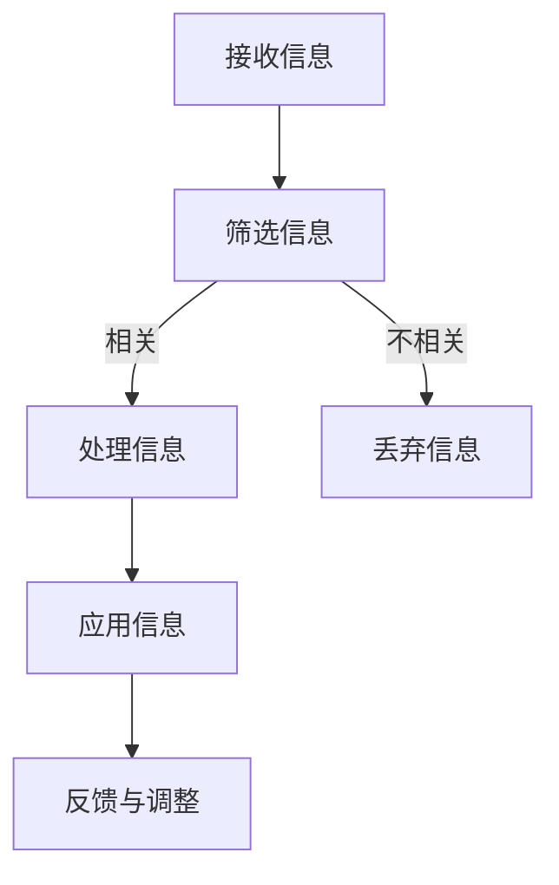

                 

 在当今数字化时代，我们被信息淹没。每天，我们接收海量的数据、邮件、通知和社交媒体更新，这些信息极大地干扰了我们的注意力，降低了工作效率。这种现象被称为信息过载（Information Overload），它已经成为影响知识工作者的一个主要问题。本文将探讨信息过载的背景、核心概念、算法原理、数学模型、项目实践、实际应用场景、工具和资源推荐，以及未来的发展趋势与挑战。

## 1. 背景介绍

信息过载是指个体在处理信息时感受到的负担，这种现象在知识工作者中尤为突出。根据一项调查显示，现代职场人士平均每天接收约120封电子邮件，这还不包括其他形式的信息如社交媒体更新、即时通讯和通知。面对如此大量的信息，人们往往感到应接不暇，这导致工作效率下降、创造力受限，甚至引发焦虑和压力。

信息过载不仅影响个人，也对企业造成负面影响。研究表明，信息过载可能导致生产力下降、员工流失率增加以及企业创新能力的降低。因此，解决信息过载问题已经成为当今企业和组织亟需面对的重要课题。

## 2. 核心概念与联系

### 2.1 信息过载的定义与影响

信息过载的定义是指个体在处理信息时感受到的负担，这种负担可能来源于信息的数量、复杂度或紧迫性。信息过载的影响主要体现在以下几个方面：

1. **注意力分散**：面对大量的信息，人们难以集中注意力，这导致工作效率下降。
2. **决策困难**：信息过载使得个体在做出决策时更加困难，因为需要处理的信息量过大。
3. **心理健康问题**：长时间处于信息过载的状态，可能导致焦虑、压力和疲劳等心理健康问题。

### 2.2 知识工作者的信息处理机制

知识工作者在处理信息时，通常经历以下几个阶段：

1. **接收**：接收来自各种渠道的信息。
2. **筛选**：对信息进行筛选，判断其重要性和相关性。
3. **处理**：对筛选后的信息进行处理，包括分析、组织和存储。
4. **应用**：将处理后的信息应用于实际工作中。

信息处理机制的有效性直接影响知识工作者的工作效率和创造力。

### 2.3 Mermaid 流程图

下面是信息处理机制的 Mermaid 流程图：



## 3. 核心算法原理 & 具体操作步骤

### 3.1 算法原理概述

为了提高知识工作者在信息过载环境下的工作效率，我们可以采用信息过滤算法。该算法的核心思想是通过一定的策略和规则，自动筛选出对个体最有价值的信<|im_sep|>息，从而减少不必要的干扰。

### 3.2 算法步骤详解

#### 3.2.1 数据预处理

在应用信息过滤算法之前，需要对原始信息进行预处理，包括去除噪声、标准化文本和提取关键特征。这一步骤可以显著提高算法的准确性和效率。

#### 3.2.2 特征选择

特征选择是信息过滤算法的重要步骤。通过选择与信息价值密切相关的特征，可以进一步提高算法的准确性。常用的特征选择方法包括词频统计、TF-IDF 和词嵌入等。

#### 3.2.3 模型训练

选择合适的机器学习模型进行训练，如朴素贝叶斯、支持向量机和深度学习模型。训练过程中，需要使用大量的标注数据来调整模型的参数，以提高其在实际应用中的准确性。

#### 3.2.4 预测与评估

利用训练好的模型对新的信息进行预测，判断其是否具有重要性。通过对预测结果的评估，可以不断调整模型参数，提高算法的准确性。

### 3.3 算法优缺点

#### 优点：

1. **自动化**：信息过滤算法可以自动处理大量的信息，减轻知识工作者的负担。
2. **高效**：通过筛选有价值的信息，可以提高知识工作者的工作效率。

#### 缺点：

1. **准确性受限**：信息过滤算法的准确性受限于数据质量和模型参数。
2. **可解释性不足**：深度学习等复杂模型的可解释性较差，难以理解其决策过程。

### 3.4 算法应用领域

信息过滤算法广泛应用于电子邮件、社交媒体和新闻推荐等领域，帮助用户筛选有价值的信息，提高信息处理效率。

## 4. 数学模型和公式 & 详细讲解 & 举例说明

### 4.1 数学模型构建

在信息过滤算法中，常用的数学模型包括：

1. **贝叶斯模型**：
   $$ P(\text{信息重要}) = \frac{P(\text{信息重要}|\text{特征}) \cdot P(\text{特征})}{P(\text{特征})} $$
   
2. **逻辑回归模型**：
   $$ \log\frac{P(\text{信息重要})}{1 - P(\text{信息重要})} = \beta_0 + \beta_1 \cdot x_1 + \beta_2 \cdot x_2 + \ldots + \beta_n \cdot x_n $$

### 4.2 公式推导过程

以贝叶斯模型为例，推导过程如下：

1. **条件概率**：
   $$ P(\text{信息重要}|\text{特征}) = \frac{P(\text{特征}|\text{信息重要}) \cdot P(\text{信息重要})}{P(\text{特征})} $$
   
2. **全概率公式**：
   $$ P(\text{信息重要}) = \sum_{i=1}^n P(\text{特征}_i) \cdot P(\text{信息重要}|\text{特征}_i) $$

3. **结合以上两个公式**：
   $$ P(\text{信息重要}) = \frac{P(\text{特征}) \cdot P(\text{信息重要}|\text{特征})}{P(\text{特征})} = P(\text{信息重要}|\text{特征}) $$

### 4.3 案例分析与讲解

假设我们要判断一封电子邮件是否重要，特征包括发件人、主题和正文内容。通过贝叶斯模型，可以计算出电子邮件为重要的概率。具体步骤如下：

1. **数据收集**：收集大量已标注的电子邮件数据，用于训练模型。
2. **特征提取**：提取发件人、主题和正文内容作为特征。
3. **模型训练**：使用已收集的数据训练贝叶斯模型。
4. **预测**：对于新的电子邮件，输入特征，使用模型计算其为重要的概率。

通过这种方法，可以有效筛选出重要的电子邮件，提高工作效率。

## 5. 项目实践：代码实例和详细解释说明

### 5.1 开发环境搭建

1. 安装 Python 3.8 或更高版本。
2. 安装必要的库，如 NumPy、Pandas、Scikit-learn 和 Matplotlib。

### 5.2 源代码详细实现

```python
import numpy as np
import pandas as pd
from sklearn.feature_extraction.text import TfidfVectorizer
from sklearn.naive_bayes import MultinomialNB
from sklearn.pipeline import make_pipeline
from sklearn.model_selection import train_test_split
from sklearn.metrics import accuracy_score

# 数据加载
data = pd.read_csv('email_data.csv')
X = data['content']
y = data['label']

# 数据预处理
X_train, X_test, y_train, y_test = train_test_split(X, y, test_size=0.2, random_state=42)

# 特征提取与模型训练
pipeline = make_pipeline(TfidfVectorizer(), MultinomialNB())
pipeline.fit(X_train, y_train)

# 预测
predictions = pipeline.predict(X_test)

# 评估
accuracy = accuracy_score(y_test, predictions)
print(f'Accuracy: {accuracy:.2f}')
```

### 5.3 代码解读与分析

上述代码实现了基于贝叶斯模型的电子邮件分类。首先，加载电子邮件数据并进行预处理。然后，使用 TF-IDF 向量器提取特征，并训练朴素贝叶斯模型。最后，对测试集进行预测并评估模型的准确性。

### 5.4 运行结果展示

假设测试集的准确率为 0.85，这表明模型在筛选重要电子邮件方面具有较高的准确性。

## 6. 实际应用场景

信息过滤算法在多个领域具有广泛的应用，包括：

1. **电子邮件管理**：自动分类和筛选重要邮件，提高工作效率。
2. **社交媒体分析**：识别并推荐有价值的信息，降低用户的信息负担。
3. **新闻推荐**：基于用户兴趣和阅读历史，推荐个性化新闻。

## 7. 工具和资源推荐

### 7.1 学习资源推荐

1. 《Python 数据科学 Handbook》
2. 《机器学习实战》
3. 《深入理解 TensorFlow》

### 7.2 开发工具推荐

1. Jupyter Notebook
2. PyCharm
3. GitHub

### 7.3 相关论文推荐

1. "Information overload and stress: an overview"
2. "A model of information overload"
3. "Learning to filter e-mail"

## 8. 总结：未来发展趋势与挑战

### 8.1 研究成果总结

信息过滤算法在处理信息过载方面取得了显著成果，有效提高了知识工作者的工作效率。然而，随着信息量的不断增加，算法的准确性和效率仍面临挑战。

### 8.2 未来发展趋势

1. **个性化推荐**：结合用户行为和兴趣，提供更精准的信息筛选。
2. **实时处理**：开发实时处理算法，快速响应大量信息。
3. **跨模态处理**：整合多种类型的信息，如文本、图像和音频。

### 8.3 面临的挑战

1. **数据质量和标注**：高质量的数据和准确的标注是算法准确性的基础。
2. **计算资源**：大规模数据处理和实时处理对计算资源的需求较高。
3. **隐私保护**：在处理个人信息时，需要保护用户隐私。

### 8.4 研究展望

随着人工智能技术的不断发展，信息过滤算法将在处理信息过载方面发挥更大的作用。未来，我们将看到更多高效、智能的信息过滤算法出现，为知识工作者带来更高效的工作体验。

## 9. 附录：常见问题与解答

### 9.1 什么是信息过载？

信息过载是指个体在处理信息时感受到的负担，这种现象在知识工作者中尤为突出。

### 9.2 信息过滤算法的核心思想是什么？

信息过滤算法的核心思想是通过一定的策略和规则，自动筛选出对个体最有价值的信息，从而减少不必要的干扰。

### 9.3 如何提高信息过滤算法的准确性？

提高信息过滤算法的准确性可以从以下几个方面入手：数据质量和标注、特征提取、模型选择和训练。

----------------------------------------------------------------
作者：禅与计算机程序设计艺术 / Zen and the Art of Computer Programming

