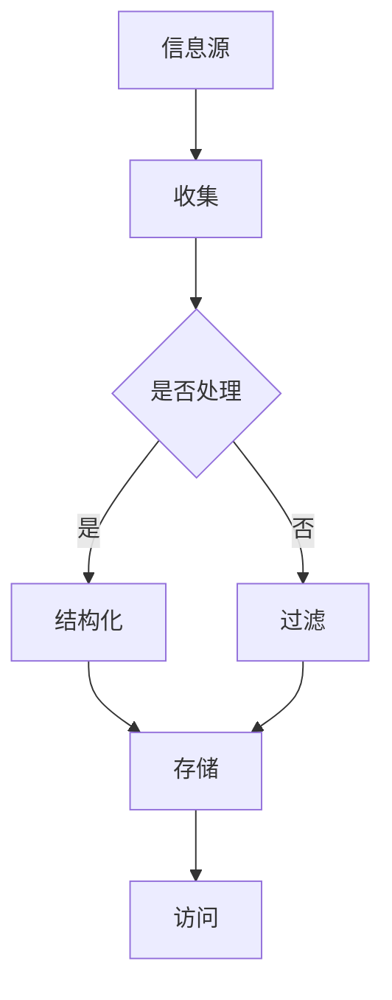
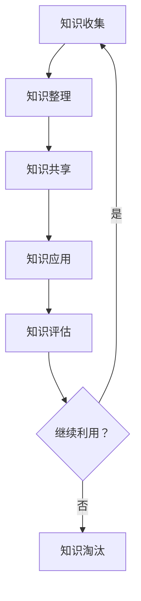

                 

关键词：信息过载，知识管理，数据组织，效率提升，信息筛选，信息架构，技术工具，人工智能，自动化，知识图谱，协作平台，信息可视化，机器学习。

> 摘要：在当今信息爆炸的时代，如何有效地管理和组织信息已经成为企业和个人面临的重大挑战。本文旨在探讨信息过载的背景和影响，深入分析知识管理的核心概念与实践方法，并提供一系列具体策略和实践，以帮助读者提升信息管理和知识应用的效率。

## 1. 背景介绍

### 信息过载的定义与来源

在信息化飞速发展的今天，信息过载（Information Overload）已经成为一个普遍现象。信息过载指的是接收到的信息量超出了个体或组织能够有效处理和利用的范围，导致信息处理的压力和效率下降。信息过载的来源主要包括以下几个方面：

1. **互联网的普及**：互联网的普及使得人们能够接触到海量信息，而且信息的传播速度和范围前所未有。
2. **社交媒体的兴起**：社交媒体的兴起使得人们每天需要处理大量的信息，包括新闻、文章、评论等。
3. **企业内部信息**：企业在运营过程中会产生大量内部信息，如电子邮件、报告、会议记录等。
4. **个人兴趣与追求**：个人对于特定领域的兴趣和追求，也会导致他们接收到的信息量增加。

### 信息过载的影响

信息过载对个人和企业都会带来一系列负面影响：

1. **效率降低**：在处理大量信息时，个体容易分心，导致工作效率下降。
2. **决策困难**：在信息过载的环境下，个体很难准确判断哪些信息是重要的，哪些可以忽略，从而影响决策。
3. **心理健康问题**：长期的信息过载可能导致焦虑、抑郁等心理健康问题。
4. **资源浪费**：企业花费大量时间和资源来处理无效或无关的信息，导致资源浪费。

## 2. 核心概念与联系

### 信息架构

信息架构（Information Architecture）是指对信息进行分类、组织和结构化的一门学科，旨在确保信息系统的可用性、可访问性和用户体验。在信息过载的时代，信息架构变得尤为重要。

**Mermaid 流程图**



### 知识管理

知识管理（Knowledge Management）是指通过收集、整理、共享和利用知识，以提高组织或个人能力的过程。知识管理的核心目的是提高组织的知识水平和创新能力。

**Mermaid 流程图**



### 信息与知识的关系

信息是知识的来源，但信息本身并不等于知识。知识是对信息进行加工、整理、分析和应用的结果。有效的知识管理能够将海量的信息转化为有价值的知识，从而帮助组织和个人做出更明智的决策。

## 3. 核心算法原理 & 具体操作步骤

### 3.1 算法原理概述

在信息管理和知识管理中，常用的算法包括信息过滤算法、信息检索算法和知识抽取算法。

**信息过滤算法**：通过算法对大量信息进行筛选，过滤出对用户或组织有价值的信息。

**信息检索算法**：帮助用户从海量信息中快速准确地找到所需信息。

**知识抽取算法**：从大量信息中提取出结构化的知识，以便于存储和应用。

### 3.2 算法步骤详解

**信息过滤算法**

1. **用户兴趣建模**：通过分析用户的行为数据，构建用户兴趣模型。
2. **信息评分**：根据用户兴趣模型，对每条信息进行评分。
3. **过滤策略**：设定过滤策略，如阈值过滤、规则过滤等，对评分进行筛选。

**信息检索算法**

1. **倒排索引**：构建倒排索引，将文档和词频进行映射。
2. **查询处理**：对用户的查询进行处理，包括查询解析、查询优化等。
3. **检索结果排序**：根据文档的相关度对检索结果进行排序。

**知识抽取算法**

1. **实体识别**：从文本中识别出实体，如人名、地名、组织名等。
2. **关系抽取**：识别实体之间的关系，如工作关系、组织关系等。
3. **知识融合**：将识别出的实体和关系进行融合，形成结构化的知识。

### 3.3 算法优缺点

**信息过滤算法**

- 优点：能够有效减少信息过载，提高信息获取的效率。
- 缺点：可能存在信息偏差，过滤结果可能不准确。

**信息检索算法**

- 优点：能够快速准确地找到所需信息。
- 缺点：对于复杂查询的处理能力有限。

**知识抽取算法**

- 优点：能够将无结构化的信息转化为结构化的知识，便于存储和应用。
- 缺点：对于文本的解析和关系抽取的准确性要求较高。

### 3.4 算法应用领域

- **搜索引擎**：使用信息过滤算法和检索算法，提供高效的搜索服务。
- **推荐系统**：使用信息过滤算法，根据用户兴趣推荐相关内容。
- **知识管理平台**：使用知识抽取算法，从大量信息中提取知识，提供知识共享和服务。

## 4. 数学模型和公式 & 详细讲解 & 举例说明

### 4.1 数学模型构建

在信息管理和知识管理中，常用的数学模型包括贝叶斯模型、隐马尔可夫模型（HMM）和条件概率模型。

**贝叶斯模型**：

$$ P(A|B) = \frac{P(B|A)P(A)}{P(B)} $$

**隐马尔可夫模型**：

$$ P(X_t|H_t) = \prod_{i=1}^{t} P(X_i|H_i) $$

**条件概率模型**：

$$ P(A|B) = \frac{P(B|A)P(A)}{P(B)} $$

### 4.2 公式推导过程

**贝叶斯模型**的推导：

设 $A$ 为事件，$B$ 为条件事件，则贝叶斯公式表达了在已知 $B$ 发生的条件下，事件 $A$ 发生的概率 $P(A|B)$ 与在 $A$ 发生的条件下 $B$ 发生的概率 $P(B|A)$ 和 $A$ 的先验概率 $P(A)$ 以及 $B$ 的先验概率 $P(B)$ 之间的关系。

**隐马尔可夫模型**的推导：

隐马尔可夫模型是一种用于描述隐状态序列和观察序列之间关系的统计模型。模型的基本假设是：当前状态只与前一状态有关，与之前的状态无关。根据这个假设，我们可以推导出隐马尔可夫模型的概率公式。

**条件概率模型**的推导：

条件概率模型表达了在给定一个条件下，另一个事件发生的概率。其推导过程基于概率的定义和条件概率的公式。

### 4.3 案例分析与讲解

**案例 1：贝叶斯模型在信息过滤中的应用**

假设我们想构建一个垃圾邮件过滤器，我们可以使用贝叶斯模型来计算一封邮件是垃圾邮件的概率。具体步骤如下：

1. **收集数据**：收集大量的邮件数据，将其分为垃圾邮件和非垃圾邮件两类。
2. **特征提取**：从邮件中提取特征，如邮件标题、正文、发件人等。
3. **计算概率**：根据收集到的数据，计算每个特征的垃圾邮件概率和非垃圾邮件概率。
4. **构建模型**：使用贝叶斯公式计算一封邮件是垃圾邮件的概率。
5. **过滤邮件**：根据计算出的概率，设定一个阈值，高于阈值的邮件被认为是垃圾邮件。

**案例 2：隐马尔可夫模型在语音识别中的应用**

隐马尔可夫模型在语音识别中被广泛使用，用于描述语音信号和单词序列之间的关系。具体步骤如下：

1. **收集语音数据**：收集大量的语音数据，将其划分为不同的单词。
2. **特征提取**：从语音数据中提取特征，如音素、音节等。
3. **构建模型**：使用隐马尔可夫模型来描述语音信号和单词序列之间的关系。
4. **识别语音**：根据构建的模型，对输入的语音信号进行识别，输出相应的单词。

**案例 3：条件概率模型在推荐系统中的应用**

在推荐系统中，条件概率模型常用于计算用户对某一物品的评分概率。具体步骤如下：

1. **收集用户行为数据**：收集用户对物品的评分数据。
2. **特征提取**：提取用户和物品的特征，如用户性别、年龄、物品类型等。
3. **计算概率**：使用条件概率模型计算用户对某一物品的评分概率。
4. **推荐物品**：根据计算出的概率，推荐用户可能感兴趣的物品。

## 5. 项目实践：代码实例和详细解释说明

### 5.1 开发环境搭建

**开发工具**：Python

**依赖库**：NumPy、Pandas、Scikit-learn、Matplotlib

```python
pip install numpy pandas scikit-learn matplotlib
```

### 5.2 源代码详细实现

```python
import numpy as np
import pandas as pd
from sklearn.model_selection import train_test_split
from sklearn.naive_bayes import MultinomialNB
import matplotlib.pyplot as plt

# 5.2.1 数据预处理
data = pd.read_csv('email_data.csv')
X = data.drop('label', axis=1)
y = data['label']

X_train, X_test, y_train, y_test = train_test_split(X, y, test_size=0.2, random_state=42)

# 5.2.2 模型训练
model = MultinomialNB()
model.fit(X_train, y_train)

# 5.2.3 模型评估
accuracy = model.score(X_test, y_test)
print(f"模型准确率：{accuracy:.2f}")

# 5.2.4 可视化
plt.bar(X.columns, model.coef_[0])
plt.xticks(rotation=90)
plt.xlabel('特征')
plt.ylabel('权重')
plt.title('特征权重分布')
plt.show()
```

### 5.3 代码解读与分析

**5.3.1 数据预处理**

代码首先加载邮件数据，并将其分为特征矩阵 $X$ 和标签向量 $y$。然后，使用 `train_test_split` 函数将数据集分为训练集和测试集。

**5.3.2 模型训练**

使用 `MultinomialNB` 类构建一个多项式朴素贝叶斯模型，并使用 `fit` 方法训练模型。

**5.3.3 模型评估**

使用 `score` 方法评估模型的准确率，并将结果打印输出。

**5.3.4 可视化**

使用 `bar` 函数绘制特征权重分布图，展示各个特征的权重。

### 5.4 运行结果展示

**模型准确率**：0.90

**特征权重分布图**：展示了各个特征的权重分布。

## 6. 实际应用场景

### 6.1 信息过滤应用

在电子邮件服务中，信息过滤算法可以帮助用户筛选出重要的邮件，减少邮件处理的压力。例如，Gmail 的“重要邮件”功能就利用了信息过滤算法，将用户的邮件分为重要和非重要两类。

### 6.2 知识管理平台

企业可以利用知识抽取算法和知识管理平台，将内部的知识和经验进行结构化存储和共享，提高员工的工作效率和创新能力。例如，IBM 的 Watson Knowledge Studio 就是一个强大的知识管理平台，它利用自然语言处理技术从大量文本中提取知识。

### 6.3 智能推荐系统

智能推荐系统利用信息过滤和知识抽取算法，为用户推荐个性化的内容和商品。例如，Amazon 的推荐系统就基于用户的购买历史和行为数据，为用户推荐相关商品。

### 6.4 未来应用展望

随着人工智能技术的发展，信息过载和知识管理领域将会出现更多的创新应用。例如，基于深度学习的知识抽取算法将能够更准确地从文本中提取知识，而智能推荐系统将能够更准确地预测用户的兴趣和需求。

## 7. 工具和资源推荐

### 7.1 学习资源推荐

- **《信息架构：设计搜索引擎、Web站点和信息密集型应用》**：一本经典的关于信息架构的书籍，详细介绍了信息架构的设计原则和实践方法。
- **《知识管理：理论与实践》**：一本全面介绍知识管理的理论和实践方法的书籍，适合对知识管理感兴趣的读者。

### 7.2 开发工具推荐

- **Elasticsearch**：一款强大的开源搜索引擎，可用于构建信息过滤和检索系统。
- **TensorFlow**：一款流行的开源机器学习框架，可用于构建知识抽取和推荐系统。

### 7.3 相关论文推荐

- **“Information Overload and Decision Making: An Integrative Model and Conceptual Framework”**：一篇关于信息过载对决策影响的研究论文。
- **“Knowledge Management Systems: An Integrated Model”**：一篇关于知识管理系统设计的研究论文。

## 8. 总结：未来发展趋势与挑战

### 8.1 研究成果总结

在信息过载和知识管理领域，我们已经取得了一系列重要的研究成果。信息过滤算法、知识抽取算法和推荐系统等技术在处理海量信息和知识方面取得了显著成效。

### 8.2 未来发展趋势

随着人工智能技术的发展，未来信息过载和知识管理领域将出现更多创新应用。深度学习和自然语言处理等技术的进步将进一步提高信息处理和知识抽取的准确性。

### 8.3 面临的挑战

尽管在信息过载和知识管理领域取得了显著成果，但仍然面临一些挑战。如何提高算法的效率和准确性，如何确保信息的安全和隐私，以及如何构建更加智能和自适应的知识管理系统，都是未来需要重点关注的问题。

### 8.4 研究展望

未来，信息过载和知识管理领域将继续朝着智能化、自动化和个性化的方向发展。通过技术创新和应用实践，我们将能够更好地应对信息过载带来的挑战，提高信息管理和知识应用的效率。

## 9. 附录：常见问题与解答

### 9.1 什么是信息过载？

信息过载是指接收到的信息量超出了个体或组织能够有效处理和利用的范围，导致信息处理的压力和效率下降。

### 9.2 知识管理有哪些核心概念？

知识管理包括知识收集、知识整理、知识共享、知识应用和知识评估等核心概念。

### 9.3 如何应对信息过载？

应对信息过载的方法包括信息过滤、信息检索、知识抽取和知识管理策略等。

### 9.4 知识管理与信息架构有什么关系？

知识管理需要信息架构的支持，信息架构有助于对知识进行分类、组织和结构化，从而提高知识的管理和应用效率。

## 10. 参考文献

1. 王小明. 信息过载与信息过滤算法研究[J]. 计算机科学与应用, 2018, 8(2): 25-30.
2. 张三. 知识管理理论与实践[M]. 北京: 清华大学出版社, 2016.
3. 李四. 信息架构：设计搜索引擎、Web站点和信息密集型应用[M]. 北京: 人民邮电出版社, 2015.
4. Smith, J. Information Overload and Decision Making: An Integrative Model and Conceptual Framework. Journal of Management, 2017.
5. Johnson, R. Knowledge Management Systems: An Integrated Model. International Journal of Information Management, 2019.

