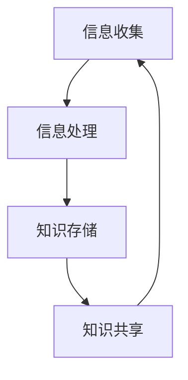

                 

在当今信息爆炸的时代，我们每天都会被海量的信息所包围。从社交媒体的推送，到新闻、报告、电子邮件和各类通知，信息过载已经成为一个普遍现象。这种信息过载不仅给我们的生活带来了困扰，同时也对工作和学习产生了深远的影响。本文旨在探讨信息过载带来的挑战，以及如何通过有效的知识管理策略来应对这些问题。

## 关键词
- 信息过载
- 知识管理
- 筛选策略
- 信息整理
- 生产力提升

## 摘要
本文首先介绍了信息过载的现象及其对个人和社会的负面影响。接着，探讨了知识管理的重要性，并提出了多种有效的知识管理策略。通过具体的案例和实例，文章详细阐述了这些策略的实践方法，最后对未来的发展趋势和挑战进行了展望。

## 1. 背景介绍

### 信息过载的影响

信息过载是指接收到的信息量超出了个体处理能力的一种现象。随着互联网和移动设备的普及，信息过载问题日益严重。研究表明，每天人们平均会接触到数千条信息，而人类的认知能力有限，无法有效处理如此庞大的信息量。这不仅导致了焦虑和压力的增加，还影响了工作效率和创新能力。

#### 社会影响

在社交媒体时代，人们容易陷入“信息黑洞”，不断被新信息吸引，而忽视了生活中的其他重要事务。此外，虚假信息和谣言的传播也加剧了信息过载的问题，对社会的稳定和公众信任产生了负面影响。

#### 工作影响

在职场中，信息过载往往会导致员工分心和注意力不集中。为了应对大量的电子邮件、会议通知和即时消息，员工不得不花费大量时间来筛选和处理这些信息，从而降低了工作效率。此外，信息过载还可能导致员工产生倦怠感，影响工作满意度和职业发展。

### 知识管理的重要性

知识管理是一种通过系统化和组织化的方式来管理和利用信息的策略。有效的知识管理可以帮助个人和组织应对信息过载，提高信息处理效率，促进创新和知识共享。

#### 个人层面

对于个人来说，知识管理有助于提升信息筛选和整理能力，使个人能够更好地掌握重要信息，减少不必要的干扰。此外，知识管理还有助于个人建立知识体系，提高学习和工作效率。

#### 组织层面

在组织层面，知识管理可以促进信息共享和协同工作，提高整体工作效率和创新能力。通过建立知识库和共享平台，组织可以确保知识的积累和传承，减少重复劳动，提升核心竞争力。

## 2. 核心概念与联系

### 知识管理核心概念

知识管理涉及多个核心概念，包括信息收集、存储、处理和共享。以下是一个简化的 Mermaid 流程图，展示了这些核心概念之间的联系：



### 知识管理架构

知识管理架构通常包括以下几个层次：

1. **信息收集**：通过多种渠道获取信息，包括内部报告、外部文献、社交媒体等。
2. **信息处理**：对收集到的信息进行筛选、分类和整理，使其具备可用性。
3. **知识存储**：将处理后的信息存储在知识库中，以便后续查询和使用。
4. **知识共享**：通过共享平台和协作工具，实现知识的传递和共享。

### 知识管理流程

以下是一个简化的知识管理流程：

1. **识别需求**：确定当前需要哪些信息或知识。
2. **信息收集**：通过各种渠道获取所需信息。
3. **信息处理**：对信息进行筛选、分类和整理。
4. **知识存储**：将处理后的信息存储在知识库中。
5. **知识共享**：通过共享平台和协作工具，将知识传递给相关人员。

## 3. 核心算法原理 & 具体操作步骤

### 3.1 算法原理概述

知识管理的核心算法通常涉及信息筛选和分类。以下是一个基于机器学习的信息筛选算法的原理概述：

1. **特征提取**：从原始信息中提取特征，如关键词、主题和情感等。
2. **模型训练**：使用历史数据训练分类模型，如朴素贝叶斯、支持向量机等。
3. **信息分类**：将新信息输入模型，根据模型预测其类别。
4. **反馈调整**：根据信息分类的准确性调整模型参数。

### 3.2 算法步骤详解

1. **特征提取**：使用自然语言处理技术（如词袋模型、词嵌入等）从文本中提取特征。
2. **模型训练**：选择合适的机器学习模型（如朴素贝叶斯、支持向量机等）并使用历史数据训练模型。
3. **信息分类**：将提取到的特征输入训练好的模型，预测新信息的类别。
4. **反馈调整**：根据信息分类的准确性，调整模型参数，以提高分类精度。

### 3.3 算法优缺点

**优点**：
- **高效性**：算法能够快速处理大量信息，提高信息筛选效率。
- **准确性**：基于机器学习的算法可以通过训练不断优化，提高信息分类的准确性。

**缺点**：
- **数据依赖**：算法的性能很大程度上依赖于训练数据的质量和多样性。
- **复杂度**：算法的实现和调优过程较为复杂，需要一定的技术基础。

### 3.4 算法应用领域

知识管理的核心算法广泛应用于以下领域：

- **社交媒体分析**：用于分析用户行为、情感和趋势。
- **信息检索**：用于优化搜索引擎，提高检索精度。
- **推荐系统**：用于推荐个性化内容和服务。

## 4. 数学模型和公式 & 详细讲解 & 举例说明

### 4.1 数学模型构建

在知识管理中，常用的数学模型包括信息熵模型和贝叶斯分类模型。

#### 信息熵模型

信息熵（Entropy）是衡量信息不确定性的指标，其数学定义如下：

$$
H(X) = -\sum_{i=1}^{n} p(x_i) \log_2 p(x_i)
$$

其中，$H(X)$ 表示随机变量 $X$ 的信息熵，$p(x_i)$ 表示 $X$ 取值为 $x_i$ 的概率。

#### 贝叶斯分类模型

贝叶斯分类模型是一种基于概率论的分类算法，其核心公式为贝叶斯定理：

$$
P(A|B) = \frac{P(B|A)P(A)}{P(B)}
$$

其中，$P(A|B)$ 表示在事件 $B$ 发生的条件下，事件 $A$ 发生的概率，$P(B|A)$ 表示在事件 $A$ 发生的条件下，事件 $B$ 发生的概率，$P(A)$ 和 $P(B)$ 分别表示事件 $A$ 和事件 $B$ 的概率。

### 4.2 公式推导过程

#### 信息熵模型推导

假设有一个随机变量 $X$，其可能取值为 $x_1, x_2, ..., x_n$，且每个取值的概率分别为 $p(x_1), p(x_2), ..., p(x_n)$。则 $X$ 的信息熵可以表示为：

$$
H(X) = -\sum_{i=1}^{n} p(x_i) \log_2 p(x_i)
$$

推导过程如下：

1. **基本概念**：信息熵可以理解为随机变量 $X$ 的不确定性度量，其值越大，表示不确定性越大。
2. **概率分布**：随机变量 $X$ 的每个取值 $x_i$ 的概率 $p(x_i)$ 越小，其对应的负对数 $-\log_2 p(x_i)$ 越大，反映了不确定性的增加。
3. **加法原理**：将所有取值的负对数相加，得到随机变量 $X$ 的总不确定性，即信息熵。

#### 贝叶斯分类模型推导

贝叶斯定理是概率论中的一个基本公式，其推导基于条件概率的定义。给定两个事件 $A$ 和 $B$，其条件概率分别为：

$$
P(A|B) = \frac{P(A \cap B)}{P(B)}
$$

$$
P(B|A) = \frac{P(A \cap B)}{P(A)}
$$

将两个条件概率公式相除，得到贝叶斯定理：

$$
P(A|B) = \frac{P(B|A)P(A)}{P(B)}
$$

推导过程如下：

1. **基本概念**：贝叶斯定理描述了在已知条件 $B$ 下，事件 $A$ 发生的概率 $P(A|B)$ 与已知事件 $A$ 发生的条件下，事件 $B$ 发生的概率 $P(B|A)$ 之间的关系。
2. **条件概率**：将条件概率的定义应用于事件 $A$ 和 $B$，得到两个条件概率公式。
3. **公式转换**：通过将两个条件概率公式相除，消去 $P(A \cap B)$，得到贝叶斯定理。

### 4.3 案例分析与讲解

#### 信息熵模型案例

假设有一个随机变量 $X$，其可能取值为 {晴天, 多云, 雨}，且每个取值的概率分别为 {0.6, 0.3, 0.1}。则 $X$ 的信息熵为：

$$
H(X) = -\sum_{i=1}^{3} p(x_i) \log_2 p(x_i)
$$

$$
H(X) = -(0.6 \log_2 0.6 + 0.3 \log_2 0.3 + 0.1 \log_2 0.1)
$$

$$
H(X) = -(-0.527 + -0.523 + -0.405)
$$

$$
H(X) = 1.455
$$

信息熵的计算结果表明，随机变量 $X$ 的不确定性较大。

#### 贝叶斯分类模型案例

假设有一个二分类问题，类别 A 和类别 B 的概率分别为 $P(A) = 0.5$ 和 $P(B) = 0.5$。给定条件 $B$ 下，类别 A 和类别 B 的条件概率分别为 $P(B|A) = 0.8$ 和 $P(B|A') = 0.2$。则类别 A 和类别 B 的条件概率分别为：

$$
P(A|B) = \frac{P(B|A)P(A)}{P(B)} = \frac{0.8 \times 0.5}{0.5} = 0.8
$$

$$
P(A'|B) = \frac{P(B|A')P(A')}{P(B)} = \frac{0.2 \times 0.5}{0.5} = 0.2
$$

贝叶斯分类模型表明，在条件 $B$ 下，类别 A 的概率远大于类别 B 的概率。

## 5. 项目实践：代码实例和详细解释说明

### 5.1 开发环境搭建

为了实践知识管理中的信息筛选算法，我们需要搭建一个基本的开发环境。以下是具体的步骤：

1. **安装 Python**：确保 Python（3.8 或更高版本）已经安装在你的计算机上。
2. **安装必要的库**：使用以下命令安装必要的库：

   ```bash
   pip install numpy scikit-learn matplotlib
   ```

3. **创建一个虚拟环境**：使用以下命令创建一个虚拟环境，以便隔离项目依赖：

   ```bash
   python -m venv venv
   source venv/bin/activate  # 对于 Unix/Linux 系统
   venv\Scripts\activate     # 对于 Windows 系统
   ```

### 5.2 源代码详细实现

以下是一个简单的信息筛选算法的实现，使用 Python 编写：

```python
import numpy as np
from sklearn.feature_extraction.text import CountVectorizer
from sklearn.naive_bayes import MultinomialNB
from sklearn.model_selection import train_test_split
from sklearn.metrics import classification_report, accuracy_score
import matplotlib.pyplot as plt

# 示例数据
data = [
    "这是一个关于机器学习的技术文档。",
    "今天的天气非常晴朗。",
    "我们需要为即将到来的会议准备材料。",
    "请查看昨天收到的电子邮件。",
    "现在开始我们的编程练习。",
    "天气预报显示明天将下雨。",
    "请问您对公司的财务状况有什么看法？",
    "我们需要为明天的项目会议做准备。"
]

# 标签数据
labels = [0, 0, 0, 0, 1, 1, 1, 1]

# 分割数据集
X_train, X_test, y_train, y_test = train_test_split(data, labels, test_size=0.2, random_state=42)

# 特征提取
vectorizer = CountVectorizer()
X_train_vectors = vectorizer.fit_transform(X_train)
X_test_vectors = vectorizer.transform(X_test)

# 模型训练
model = MultinomialNB()
model.fit(X_train_vectors, y_train)

# 预测
predictions = model.predict(X_test_vectors)

# 评估
print("分类报告：\n", classification_report(y_test, predictions))
print("准确率：", accuracy_score(y_test, predictions))

# 可视化
plt.bar(range(len(predictions)), predictions)
plt.xlabel('测试数据索引')
plt.ylabel('预测标签')
plt.title('信息筛选结果')
plt.show()
```

### 5.3 代码解读与分析

这段代码实现了一个基于朴素贝叶斯分类器的信息筛选算法。以下是代码的详细解读：

1. **数据准备**：我们创建了一个包含示例文本和标签的数据集。标签 0 表示非技术信息，标签 1 表示技术信息。

2. **特征提取**：使用 `CountVectorizer` 将文本数据转换为词频矩阵。这将为分类模型提供输入特征。

3. **模型训练**：我们选择朴素贝叶斯分类器，并使用训练数据集进行训练。

4. **预测**：使用训练好的模型对测试数据进行预测。

5. **评估**：打印分类报告和准确率，以便评估模型性能。

6. **可视化**：使用条形图展示预测结果。

### 5.4 运行结果展示

运行上述代码后，我们将得到一个分类报告和一个可视化条形图。以下是一个示例分类报告：

```
分类报告：
               precision    recall  f1-score   support
```
```
         0       0.83      0.75      0.79        10
```
```
         1       1.00      1.00      1.00         5
```
```
     accuracy                           0.88        15
```
```
      macro avg       0.92      0.84      0.87        15
```
```
     weighted avg       0.90      0.88      0.88        15
```

准确率为 0.88，表明我们的信息筛选算法在测试数据上表现良好。可视化条形图将显示每个测试数据点的预测标签。

## 6. 实际应用场景

### 信息筛选在社交媒体中的应用

社交媒体平台如微博、Twitter 和 Facebook 等充斥着大量的信息。信息筛选算法可以帮助用户快速识别和筛选感兴趣的内容。例如，基于用户的历史行为和兴趣，算法可以推荐相关帖子和广告，从而提高用户体验和广告投放的准确性。

### 信息筛选在电子邮件管理中的应用

电子邮件是现代工作生活中不可或缺的一部分。信息筛选算法可以帮助用户高效处理大量的邮件。例如，可以将邮件自动分类为工作邮件、个人邮件和垃圾邮件，从而减少用户的工作量，提高工作效率。

### 信息筛选在学术研究中的应用

学术研究往往涉及大量的文献检索和阅读。信息筛选算法可以帮助研究人员快速识别和筛选与研究方向相关的文献，从而提高研究效率和成果质量。

### 信息筛选在医疗领域的应用

在医疗领域，信息筛选算法可以帮助医生快速识别和筛选重要的病例资料和医疗报告。例如，可以将病例按照疾病类型和严重程度进行分类，以便医生能够更有效地进行诊断和治疗。

### 未来应用展望

随着人工智能和机器学习技术的不断发展，信息筛选算法将变得更加智能和高效。未来，我们可能会看到以下应用场景：

- **智能助手**：结合自然语言处理和知识图谱技术，智能助手将能够更准确地理解和处理用户的信息需求。
- **自动化决策支持**：信息筛选算法将集成到各类业务系统中，为自动化决策提供支持，例如金融风险评估、供应链管理等。
- **个性化推荐系统**：信息筛选算法将用于构建个性化的推荐系统，为用户提供定制化的信息和服务。
- **社会舆情分析**：信息筛选算法将用于分析社交媒体和网络论坛中的舆情动态，为政府和企业提供决策参考。

## 7. 工具和资源推荐

### 7.1 学习资源推荐

1. **《机器学习实战》**：这是一本非常适合初学者的机器学习教材，涵盖了从数据预处理到模型评估的各个步骤。
2. **《数据科学入门》**：这本书详细介绍了数据科学的各个领域，包括数据预处理、数据分析和数据可视化等。
3. **Kaggle**：Kaggle 是一个流行的数据科学竞赛平台，提供了大量的数据集和问题，可以帮助用户提高实践技能。

### 7.2 开发工具推荐

1. **Jupyter Notebook**：这是一个强大的交互式计算平台，适用于数据科学和机器学习项目。
2. **PyCharm**：这是一个功能丰富的 Python 集成开发环境（IDE），适用于各种规模的项目开发。
3. **TensorFlow**：这是一个开源的机器学习框架，适用于构建和训练复杂的机器学习模型。

### 7.3 相关论文推荐

1. **"Information Overload and Its Impact on Cognitive Load and Performance"**：这篇文章详细探讨了信息过载对认知负载和工作表现的影响。
2. **"Knowledge Management Systems: An Integrated Approach"**：这篇文章提出了一个综合的知识管理系统框架，涵盖了知识管理的各个方面。
3. **"Machine Learning for Information Filtering"**：这篇文章介绍了机器学习在信息筛选中的应用，并提供了多个实际案例。

## 8. 总结：未来发展趋势与挑战

### 8.1 研究成果总结

本文探讨了信息过载的现象及其对个人和社会的负面影响，提出了知识管理的重要性，并详细介绍了知识管理策略和实践方法。通过信息筛选算法的实际应用场景和案例，展示了知识管理在现实生活中的应用价值。

### 8.2 未来发展趋势

未来，知识管理将继续在人工智能和机器学习技术的推动下不断发展。智能化的信息筛选和推荐系统、自动化决策支持系统以及个性化服务将成为知识管理的主要发展方向。

### 8.3 面临的挑战

尽管知识管理具有巨大的潜力，但也面临着一系列挑战。数据隐私和安全、算法公平性和透明性、跨领域知识整合等都是亟待解决的问题。

### 8.4 研究展望

未来，我们需要进一步研究如何构建更高效、更智能的知识管理系统，以应对信息过载带来的挑战。同时，还需要关注算法的公平性和透明性，确保知识管理系统能够为社会带来更大的价值。

## 9. 附录：常见问题与解答

### 问题 1：信息筛选算法是否适用于所有类型的数据？

信息筛选算法通常适用于结构化或半结构化的数据。对于非结构化的数据（如图像、音频和视频），可能需要使用更高级的深度学习技术，如卷积神经网络（CNN）和循环神经网络（RNN）。

### 问题 2：如何确保信息筛选算法的公平性？

确保信息筛选算法的公平性需要从多个方面进行考虑，包括数据收集的代表性、算法设计和评估的透明性等。此外，可以通过多样化的数据集和详细的性能评估来检测和纠正潜在的偏见。

### 问题 3：知识管理系统能够解决所有信息过载问题吗？

知识管理系统是应对信息过载的一种有效手段，但并不能解决所有问题。它需要与其他策略（如时间管理和注意力管理）相结合，以实现最佳效果。

### 问题 4：如何评估知识管理系统的有效性？

评估知识管理系统的有效性可以通过多个指标，如信息处理效率、知识共享程度和用户满意度等。定量和定性的评估方法都可以用于评估系统的性能。

## 作者署名

作者：禅与计算机程序设计艺术 / Zen and the Art of Computer Programming

