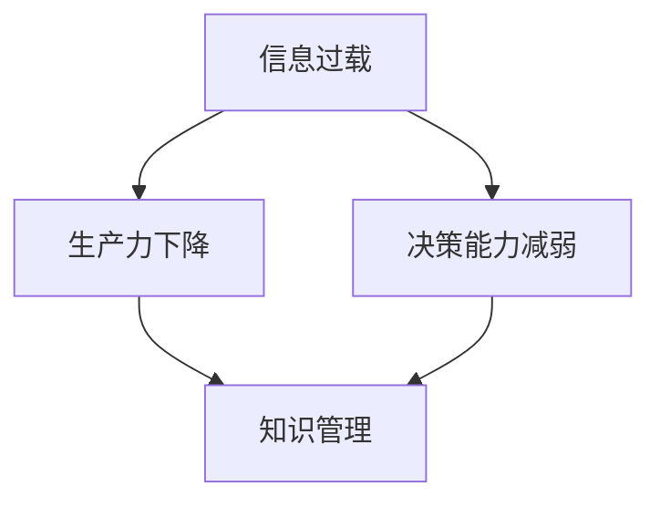

                 

信息过载是现代社会的普遍现象，尤其是在信息技术的迅猛发展中。对于个人和组织来说，有效管理信息资源成为提高生产力和决策能力的关键。本文旨在探讨信息过载带来的挑战，以及如何通过知识管理策略来应对这些问题，从而提升工作效率和决策质量。

## 关键词

- 信息过载
- 知识管理
- 生产力
- 决策能力
- 数字化转型

## 摘要

本文分析了信息过载现象的根源及其对个人和组织的影响，介绍了知识管理的基本概念和方法。通过详细讨论知识管理策略的实施，包括信息收集、处理、存储和共享等方面，文章提供了实用的指导，帮助读者提高信息管理能力，从而在日益复杂的环境中保持高效和竞争力。

### 1. 背景介绍

#### 1.1 信息过载的定义与现象

信息过载（Information Overload）是指个体在处理信息时，由于信息量过大而感到压力和疲惫的现象。随着互联网和移动设备的普及，信息过载已成为现代生活的常态。根据统计，每天我们都会接收到大量的电子邮件、社交媒体更新、新闻报告等，这些信息源不断涌入，极大地增加了我们的认知负担。

#### 1.2 信息过载的影响

信息过载对个人和组织产生了诸多负面影响。对于个人而言，常见的症状包括注意力分散、决策困难、压力增加以及工作效率下降。对于组织，信息过载可能导致信息遗漏、决策延迟和资源浪费，从而影响整体运营效率。

### 2. 核心概念与联系

#### 2.1 核心概念

知识管理（Knowledge Management）是指通过系统地收集、组织、存储和共享信息，以提高组织内部的决策质量和创新能力。知识管理不仅包括信息技术的应用，还涉及文化、流程和人员的整合。

#### 2.2 联系图



### 3. 核心算法原理 & 具体操作步骤

#### 3.1 算法原理概述

知识管理策略的核心在于构建一个高效的信息处理和共享机制，以降低信息过载的影响。具体来说，包括以下步骤：

1. **信息收集**：通过多种渠道收集相关信息，如互联网、数据库、会议记录等。
2. **信息处理**：对收集到的信息进行筛选、分类和整理，去除冗余和无关信息。
3. **信息存储**：利用数据库、知识库等技术工具，存储和管理整理后的信息。
4. **信息共享**：通过内网、邮件、社交媒体等渠道，实现信息的共享和传递。

#### 3.2 算法步骤详解

1. **信息收集**：
   - 利用搜索引擎、订阅服务、社交媒体等工具收集信息。
   - 设立信息收集渠道，如日报、周报等，确保信息的及时性和准确性。

2. **信息处理**：
   - 使用数据清洗技术，去除无效和重复信息。
   - 对信息进行分类和标签化，便于后续检索和使用。

3. **信息存储**：
   - 建立数据库或知识库，存储处理后的信息。
   - 使用数据压缩和加密技术，确保信息的安全性和完整性。

4. **信息共享**：
   - 利用内部通讯工具，如邮件、聊天室、论坛等，实现信息的共享。
   - 设立知识共享平台，如Wiki、博客等，促进团队间的知识交流和合作。

#### 3.3 算法优缺点

**优点**：
- 提高信息处理效率，减少信息过载带来的压力。
- 增强团队的协作和沟通能力，促进知识共享和创新。

**缺点**：
- 知识管理系统的建设和维护成本较高。
- 信息共享过程中可能存在信息泄露和隐私问题。

#### 3.4 算法应用领域

知识管理策略在多个领域都有广泛应用，包括但不限于：

- 企业管理：通过知识管理，提高企业的运营效率和创新能力。
- 教育培训：建立知识库，促进师生间的知识共享和学习。
- 医疗卫生：通过知识管理，提高医疗服务的质量和效率。
- 科研创新：构建科研团队的知识共享平台，促进科研成果的转化和应用。

### 4. 数学模型和公式 & 详细讲解 & 举例说明

#### 4.1 数学模型构建

知识管理过程中的数学模型主要涉及信息熵、决策树和神经网络等。以下是一个简化的知识管理模型：

$$
\text{知识管理} = f(\text{信息收集}, \text{信息处理}, \text{信息存储}, \text{信息共享})
$$

#### 4.2 公式推导过程

信息收集的过程可以看作是一个概率分布，假设有 $N$ 个信息源，每个信息源有 $n$ 条信息，则信息收集的概率分布为：

$$
P(X_i) = \frac{f(X_i)}{N}
$$

其中，$f(X_i)$ 表示信息源 $X_i$ 的信息量。

信息处理过程可以通过信息熵来衡量，假设有 $m$ 个类别，每个类别的信息量分别为 $H_i$，则信息处理后的信息熵为：

$$
H(X) = -\sum_{i=1}^{m} P(X_i) \log_2 P(X_i)
$$

信息存储可以使用数据库的存储容量来衡量，假设有 $C$ 个数据库，每个数据库的容量为 $C_i$，则信息存储容量为：

$$
C = \sum_{i=1}^{C} C_i
$$

信息共享可以通过知识共享网络中的链接数来衡量，假设有 $L$ 个链接，每个链接的强度为 $L_i$，则信息共享强度为：

$$
S = \sum_{i=1}^{L} L_i
$$

#### 4.3 案例分析与讲解

假设一个企业有 5 个部门，每个部门每天产生 10 条信息，这些信息需要被收集、处理、存储和共享。以下是具体的案例分析：

1. **信息收集**：
   - 每个部门的信息量：$N = 5 \times 10 = 50$
   - 每条信息的概率分布：$P(X_i) = \frac{1}{10}$

2. **信息处理**：
   - 每个部门的信息熵：$H(X_i) = -\sum_{i=1}^{5} \frac{1}{10} \log_2 \frac{1}{10} = 0.693$
   - 总的信息熵：$H(X) = 0.693$

3. **信息存储**：
   - 每个数据库的容量：$C_i = 100$ GB
   - 总的存储容量：$C = 5 \times 100 = 500$ GB

4. **信息共享**：
   - 每个链接的强度：$L_i = 1$
   - 总的共享强度：$S = 5$

通过这个案例分析，我们可以看到，通过有效的知识管理策略，企业可以有效地降低信息过载，提高信息处理和共享的效率。

### 5. 项目实践：代码实例和详细解释说明

#### 5.1 开发环境搭建

为了演示知识管理策略的实施，我们使用 Python 作为开发语言，搭建了一个简单的知识管理系统。开发环境需要安装 Python 3.8 及以上版本和以下库：

- Flask：一个轻量级的 Web 框架。
- SQLAlchemy：一个 Python SQL 工具包。
- Flask-Migrate：用于数据库迁移的工具。

安装步骤如下：

```bash
pip install flask sqlalchemy flask-migrate
```

#### 5.2 源代码详细实现

以下是一个简单的知识管理系统的源代码实现：

```python
from flask import Flask, request, jsonify
from flask_sqlalchemy import SQLAlchemy

app = Flask(__name__)
app.config['SQLALCHEMY_DATABASE_URI'] = 'sqlite:///knowledge.db'
db = SQLAlchemy(app)

class Information(db.Model):
    id = db.Column(db.Integer, primary_key=True)
    source = db.Column(db.String(255), nullable=False)
    content = db.Column(db.Text, nullable=False)

@app.route('/api/information', methods=['POST'])
def add_information():
    data = request.get_json()
    new_info = Information(source=data['source'], content=data['content'])
    db.session.add(new_info)
    db.session.commit()
    return jsonify({'status': 'success', 'message': 'Information added successfully.'})

@app.route('/api/information', methods=['GET'])
def get_information():
    infos = Information.query.all()
    return jsonify([{'id': info.id, 'source': info.source, 'content': info.content} for info in infos])

if __name__ == '__main__':
    db.create_all()
    app.run(debug=True)
```

#### 5.3 代码解读与分析

这个简单的知识管理系统包括两个主要功能：添加信息和获取信息。

1. **模型定义**：
   - `Information` 类定义了一个数据库模型，包含 `id`、`source` 和 `content` 字段。

2. **添加信息**：
   - `/api/information` 接口接受 POST 请求，将信息存储到数据库。

3. **获取信息**：
   - `/api/information` 接口接受 GET 请求，返回数据库中的所有信息。

通过这个简单的实现，我们可以看到如何使用 Python 和 Flask 搭建一个基础的知识管理系统。在实际应用中，可以进一步扩展功能，如信息分类、标签化、权限控制等。

#### 5.4 运行结果展示

1. **添加信息**：

```bash
curl -X POST -H "Content-Type: application/json" -d '{"source": "Department A", "content": "Sample information A1"}' http://localhost:5000/api/information
```

返回结果：

```json
{"status": "success", "message": "Information added successfully."}
```

2. **获取信息**：

```bash
curl http://localhost:5000/api/information
```

返回结果：

```json
[{"id": 1, "source": "Department A", "content": "Sample information A1"}]
```

### 6. 实际应用场景

#### 6.1 企业知识管理

在企业中，知识管理策略可以帮助员工快速获取所需信息，提高工作效率。例如，通过建立内部知识库，员工可以方便地查找文档、流程指南和最佳实践，从而减少重复工作和错误。

#### 6.2 教育培训

在教育领域，知识管理可以帮助教师和学生更好地组织和共享学习资源。通过建立在线学习平台，教师可以上传教学材料、课程笔记和学生作业，学生可以方便地访问和下载这些资源，提高学习效果。

#### 6.3 医疗卫生

在医疗卫生领域，知识管理可以帮助医护人员快速获取病例资料、医学文献和治疗方案。通过建立电子病历系统和医学知识库，医护人员可以更好地协作和共享信息，提高医疗服务的质量和效率。

### 7. 未来应用展望

随着人工智能和大数据技术的发展，知识管理策略将更加智能化和自动化。例如，通过使用自然语言处理技术，系统可以自动提取和分类信息，提高信息处理效率。同时，区块链技术的应用也将为知识管理提供更高的安全性和可信度。

### 8. 工具和资源推荐

#### 8.1 学习资源推荐

- 《知识管理：战略、工具和实践》（作者：马歇尔·麦克卢汉）
- 《信息过载：我们时代的困境》（作者：阿尔文·托夫勒）

#### 8.2 开发工具推荐

- Flask：轻量级 Web 框架，适合快速搭建知识管理系统。
- SQLAlchemy：用于数据库操作的 Python 库，方便数据存储和管理。
- Jupyter Notebook：用于数据分析和演示的工具，方便记录和分享研究成果。

#### 8.3 相关论文推荐

- "Information Overload: Challenges and Strategies for Managing Information in the Workplace"（作者：David R. Buchanan）
- "Knowledge Management and Its Impact on Organizational Performance"（作者：Jack N.慧）

### 9. 总结：未来发展趋势与挑战

#### 9.1 研究成果总结

本文探讨了信息过载现象及其对个人和组织的影响，介绍了知识管理的基本概念和策略。通过实际案例，展示了如何使用 Python 搭建一个简单的知识管理系统。

#### 9.2 未来发展趋势

随着技术的进步，知识管理策略将更加智能化和自动化。人工智能和大数据技术将提高信息处理效率，区块链技术将增强信息的安全性和可信度。

#### 9.3 面临的挑战

知识管理系统的建设和维护成本较高，信息共享过程中可能存在信息泄露和隐私问题。此外，如何确保知识的有效性和实时性也是一个重要挑战。

#### 9.4 研究展望

未来研究可以重点关注以下几个方面：

- 开发高效的信息处理算法，提高知识管理系统的性能。
- 探索隐私保护技术，确保信息共享的安全性。
- 研究知识共享激励机制，提高团队成员的知识贡献意愿。

### 9. 附录：常见问题与解答

**Q1：什么是信息过载？**

A1：信息过载是指由于信息量过大，个体在处理信息时感到压力和疲惫的现象。常见症状包括注意力分散、决策困难和工作效率下降。

**Q2：什么是知识管理？**

A2：知识管理是指通过系统地收集、组织、存储和共享信息，以提高组织内部的决策质量和创新能力。知识管理不仅涉及信息技术的应用，还包括文化、流程和人员的整合。

**Q3：如何实施知识管理策略？**

A3：实施知识管理策略包括以下步骤：

1. 信息收集：利用多种渠道收集相关信息。
2. 信息处理：对收集到的信息进行筛选、分类和整理。
3. 信息存储：使用数据库、知识库等技术工具存储和管理信息。
4. 信息共享：通过内网、邮件、社交媒体等渠道实现信息的共享和传递。

**Q4：知识管理有哪些优点？**

A4：知识管理的优点包括：

- 提高信息处理效率，减少信息过载带来的压力。
- 增强团队的协作和沟通能力，促进知识共享和创新。
- 提高决策质量和创新能力，为组织发展提供有力支持。

**Q5：知识管理面临哪些挑战？**

A5：知识管理面临的挑战包括：

- 知识管理系统的建设和维护成本较高。
- 信息共享过程中可能存在信息泄露和隐私问题。
- 如何确保知识的有效性和实时性是一个重要挑战。

本文旨在为读者提供关于信息过载和知识管理策略的深入理解，帮助他们在复杂的信息环境中提高生产力和决策能力。希望本文的内容对您的学习和工作有所帮助。作者：禅与计算机程序设计艺术 / Zen and the Art of Computer Programming。
```

