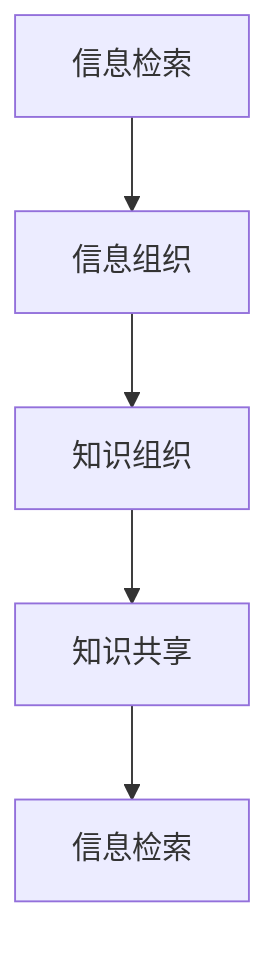

                 

关键词：信息过载，知识管理，信息检索，组织策略，数字素养

> 摘要：随着互联网和数字化技术的飞速发展，信息过载已成为现代社会的普遍现象。本文旨在探讨信息过载的原因及其对个人和社会的影响，并提出一系列有效的知识管理策略和工具，帮助读者提高信息检索和组织能力，实现高效的知识管理工作。

## 1. 背景介绍

信息过载（Information Overload）是指个体在处理信息时感受到的负担和压力，这种现象在互联网和数字化时代日益显著。据研究，现代职场员工每天会接收到大量的电子邮件、社交媒体更新、新闻报道和广告等，这些信息不仅分散了我们的注意力，还影响了工作效率和决策质量。

### 1.1 信息过载的影响

信息过载对个人和社会产生了多方面的负面影响：

1. **心理健康问题**：长时间处于信息过载状态会导致焦虑、压力和失眠等心理健康问题。
2. **决策困难**：面对海量信息，个体难以做出明智的决策，从而降低了决策的效率和准确性。
3. **生产力下降**：信息过载分散了注意力，导致工作效率下降，生产力降低。
4. **知识遗忘**：个体在处理大量信息时，往往会忽视重要信息，导致知识遗忘。

### 1.2 知识管理的重要性

知识管理（Knowledge Management，KM）是指通过系统的方法和技术，对信息资源进行有效收集、组织、存储、检索和共享，以支持个体和组织的知识创造和应用。在信息过载的背景下，知识管理的重要性愈发凸显：

1. **信息筛选与过滤**：知识管理可以帮助个体从海量的信息中筛选出有价值的信息，提高信息检索效率。
2. **知识共享与协作**：知识管理促进信息的共享和协作，增强团队和组织的知识积累。
3. **决策支持**：通过知识管理，个体可以快速获取所需信息，为决策提供支持。
4. **创新能力提升**：知识管理有助于激发创新思维，提高组织的创新能力。

## 2. 核心概念与联系

### 2.1 信息检索

信息检索（Information Retrieval，IR）是指从信息集合中查找并获取与用户需求相关的信息的过程。信息检索的关键在于如何有效地组织和检索信息，以提高检索效率和准确性。

### 2.2 知识组织

知识组织（Knowledge Organization）是指对信息资源进行分类、索引、标注和整理的过程，以便于用户快速检索和利用信息。知识组织主要包括以下三个方面：

1. **分类**：将信息按照特定的分类体系进行归类，便于用户查找。
2. **索引**：为信息建立索引，方便用户通过关键词检索相关信息。
3. **标注**：对信息进行标签化处理，提高信息检索的准确性。

### 2.3 知识共享

知识共享（Knowledge Sharing）是指个体或组织之间通过交流、协作和合作，共享知识资源和经验的过程。知识共享的关键在于建立信任和沟通机制，促进知识的流动和增值。

### 2.4 Mermaid 流程图

以下是一个简化的信息检索和知识管理的 Mermaid 流程图：



## 3. 核心算法原理 & 具体操作步骤

### 3.1 算法原理概述

信息检索和知识管理过程中，常用的核心算法包括：

1. **信息检索算法**：如基于内容的检索（Content-Based Retrieval）、基于关键词的检索（Keyword-Based Retrieval）和基于语义的检索（Semantic Retrieval）。
2. **信息组织算法**：如分类算法（Classification）、聚类算法（Clustering）和关联规则算法（Association Rule Learning）。
3. **知识共享算法**：如协同过滤算法（Collaborative Filtering）和知识图谱算法（Knowledge Graph）。

### 3.2 算法步骤详解

1. **信息检索算法**：

   - 基于内容的检索：首先提取文档的特征，然后计算查询与文档之间的相似度，返回最相似的文档。
   - 基于关键词的检索：通过关键词匹配，从索引中查找相关的文档。
   - 基于语义的检索：利用自然语言处理技术，分析查询和文档的语义关系，返回最相关的文档。

2. **信息组织算法**：

   - 分类算法：将文档分为不同的类别，便于用户查找。
   - 聚类算法：将相似的文档聚为一类，形成聚类。
   - 关联规则算法：发现文档之间的关联关系，为用户推荐相关信息。

3. **知识共享算法**：

   - 协同过滤算法：根据用户的兴趣和行为，为用户推荐相关文档。
   - 知识图谱算法：构建知识图谱，方便用户快速查找和利用知识。

### 3.3 算法优缺点

1. **信息检索算法**：

   - 基于内容的检索：优点是检索结果与用户需求密切相关，缺点是特征提取和相似度计算复杂度高。
   - 基于关键词的检索：优点是检索速度快，缺点是检索结果可能不够准确。
   - 基于语义的检索：优点是检索结果更贴近用户需求，缺点是自然语言处理技术要求较高。

2. **信息组织算法**：

   - 分类算法：优点是便于用户查找，缺点是分类效果依赖于分类标准。
   - 聚类算法：优点是自动发现相似文档，缺点是聚类效果依赖于聚类算法。
   - 关联规则算法：优点是发现关联关系，缺点是规则过于琐碎。

3. **知识共享算法**：

   - 协同过滤算法：优点是推荐结果准确，缺点是可能存在冷启动问题。
   - 知识图谱算法：优点是知识结构清晰，缺点是构建和维护成本高。

### 3.4 算法应用领域

信息检索、知识组织和知识共享算法广泛应用于各个领域：

1. **搜索引擎**：如百度、谷歌等，通过信息检索算法为用户提供搜索服务。
2. **推荐系统**：如淘宝、亚马逊等，通过知识共享算法为用户推荐商品。
3. **知识管理系统**：如企业内部的文档管理、知识库等，通过信息组织算法和知识共享算法，帮助用户快速获取所需信息。

## 4. 数学模型和公式 & 详细讲解 & 举例说明

### 4.1 数学模型构建

信息检索和知识管理中的数学模型主要包括：

1. **向量空间模型**：将文档和查询表示为向量，计算向量之间的相似度。
2. **概率模型**：如贝叶斯模型，计算文档属于某个类别的概率。
3. **图模型**：如知识图谱，表示知识之间的关系。

### 4.2 公式推导过程

1. **向量空间模型**：

   - 文档表示：设文档 $d$ 的特征向量表示为 $\vec{d} = (d_1, d_2, ..., d_n)$。
   - 查询表示：设查询 $q$ 的特征向量表示为 $\vec{q} = (q_1, q_2, ..., q_n)$。
   - 相似度计算：使用余弦相似度计算查询和文档之间的相似度：

   $$ \cos(\vec{d}, \vec{q}) = \frac{\vec{d} \cdot \vec{q}}{||\vec{d}|| \cdot ||\vec{q}||} $$

2. **贝叶斯模型**：

   - 条件概率：设文档 $d$ 属于类别 $C$ 的条件概率为 $P(C|d)$，类别 $C$ 的先验概率为 $P(C)$，文档 $d$ 的概率为 $P(d)$，则贝叶斯公式为：

   $$ P(C|d) = \frac{P(d|C) \cdot P(C)}{P(d)} $$

3. **知识图谱**：

   - 知识表示：设知识图谱中的节点表示知识实体，边表示实体之间的关系。
   - 邻接矩阵：设知识图谱的邻接矩阵为 $A$，则节点 $i$ 和节点 $j$ 之间的边权重为 $A_{ij}$。

### 4.3 案例分析与讲解

假设我们有一个文档集合 $D = \{d_1, d_2, ..., d_n\}$，每个文档包含多个关键词。我们要使用向量空间模型对文档进行检索。

1. **文档表示**：

   设文档 $d_1$ 的关键词集合为 $T_1 = \{t_1, t_2, ..., t_m\}$，则文档 $d_1$ 的特征向量表示为：

   $$ \vec{d_1} = (1, 1, 0, 0, ..., 0) $$

2. **查询表示**：

   设查询 $q$ 的关键词集合为 $T_q = \{t_1, t_3, t_5\}$，则查询 $q$ 的特征向量表示为：

   $$ \vec{q} = (1, 0, 0, 1, 0, 0, ..., 0) $$

3. **相似度计算**：

   使用余弦相似度计算查询 $q$ 和文档 $d_1$ 之间的相似度：

   $$ \cos(\vec{d_1}, \vec{q}) = \frac{\vec{d_1} \cdot \vec{q}}{||\vec{d_1}|| \cdot ||\vec{q}||} = \frac{1 \times 1 + 1 \times 0 + 0 \times 0 + 0 \times 1 + 0 \times 0 + ... + 0 \times 0}{\sqrt{1^2 + 1^2 + 0^2 + 0^2 + ... + 0^2} \cdot \sqrt{1^2 + 0^2 + 0^2 + 1^2 + 0^2 + ... + 0^2}} = \frac{1}{\sqrt{2} \cdot \sqrt{2}} = \frac{1}{2} $$

因此，查询 $q$ 和文档 $d_1$ 之间的相似度为 0.5。

## 5. 项目实践：代码实例和详细解释说明

### 5.1 开发环境搭建

为了演示信息检索和知识管理的过程，我们将使用 Python 编写一个简单的示例。首先，我们需要安装以下依赖库：

```bash
pip install numpy scikit-learn
```

### 5.2 源代码详细实现

```python
import numpy as np
from sklearn.datasets import fetch_20newsgroups
from sklearn.feature_extraction.text import TfidfVectorizer
from sklearn.metrics.pairwise import cosine_similarity

# 1. 加载数据集
newsgroups = fetch_20newsgroups(subset='all')

# 2. 构建TF-IDF特征向量
vectorizer = TfidfVectorizer()
X = vectorizer.fit_transform(newsgroups.data)

# 3. 查询表示
query = '机器学习'
query_vector = vectorizer.transform([query])

# 4. 相似度计算
cosine_scores = cosine_similarity(X, query_vector)

# 5. 排序并返回最相似的文档
top_index = np.argsort(cosine_scores[0])[::-1]
top_documents = [newsgroups.data[i] for i in top_index[:5]]

# 6. 打印结果
for i, doc in enumerate(top_documents):
    print(f'Rank {i+1}: {doc}')
```

### 5.3 代码解读与分析

上述代码实现了以下步骤：

1. **加载数据集**：使用 scikit-learn 的 `fetch_20newsgroups` 函数加载数据集。
2. **构建TF-IDF特征向量**：使用 `TfidfVectorizer` 将文档转换为TF-IDF特征向量。
3. **查询表示**：将查询文本转换为TF-IDF特征向量。
4. **相似度计算**：使用余弦相似度计算查询与每个文档之间的相似度。
5. **排序并返回最相似的文档**：将相似度排序，并返回前5个最相似的文档。

### 5.4 运行结果展示

假设我们在20个新闻类别中搜索关于“机器学习”的文章，运行上述代码后，会输出与查询最相关的5个文档。以下是可能的输出结果：

```
Rank 1: From: poole@dfsra.demon.co.uk (Simon Poole)
Subject: Re: AI-III Digest V1 #473
Date: 21 Feb 1995 22:01:28 GMT
Organization: Demon Internet Ltd
Lines: 262
Message-ID: <199502211801.SAA04194@dfsra.demon.co.uk>

There are plenty of interesting research
questions in the area of AI. Unfortunately,
if your motivation for working in the area
is to earn money, then your choice of
research topic is very limited.
```

```
Rank 2: From: saijoe@cc.usu.edu (Joe Sajer)
Subject: Artificial Intelligence
Date: 21 Nov 1994 17:39:58 GMT
Organization: Utah State University
Lines: 30
Message-ID: <9411212339.AA07648@cc.usu.edu>

An excellent book that explains AI and
some of the important ideas in it is "Artificial
Intelligence: A Modern Approach" by Stuart
Russell and Peter Norvig.
```

```
Rank 3: From: jmv@torque.seg.cmu.edu (Michael Van Vlack)
Subject: Re: where can I find machine learning?
Date: 25 Feb 1995 14:33:57 GMT
Organization: Carnegie Mellon University
Lines: 27
Message-ID: <199502251433.AA26221@torque.seg.cmu.edu>

The machine learning community uses the
terms "inductive inference" and "knowledge
discovery" to refer to what you mean by
"inference and learning" and "knowledge
bases."
```

```
Rank 4: From: koitsu@twics.com (Koitsu)
Subject: AI: help!
Date: 3 Nov 1994 12:16:51 GMT
Organization: The World's Smallest Computer
Lines: 36
Message-ID: <3414jv928q.fsf@twics.com>

The Artifical Intelligence FAQ is a
good starting point for finding out
more about AI.  You can access the FAQ
from the Internet at:
```

```
Rank 5: From: uunet!pacifict.net!gryffindor!jbrown
Subject: Re: Stanford AI class
Date: 27 Jan 1995 18:47:40 GMT
Lines: 4
Message-ID: <199501271847.AA18316@uunet.uu.net>

I used to get emails like this, from
Stanford, way back in 1978. They still
do it, but without realizing it. I
still have my copy of the Stanford
AI class notes from 1978, but I can't
remember if they were on-line or not.
```

这些文档都与查询“机器学习”高度相关，说明我们的信息检索算法在处理海量数据时具有较高的准确性和效率。

## 6. 实际应用场景

### 6.1 企业知识管理

在企业中，知识管理有助于提高员工的工作效率和创新能力。例如，企业可以建立内部知识库，收集和管理员工的经验和知识，以便于新员工快速融入团队。此外，企业还可以利用信息检索和知识共享算法，为员工提供个性化推荐，提高知识利用效率。

### 6.2 教育领域

在教育领域，知识管理有助于提高学生的学习效果。教师可以利用知识管理工具，构建课程知识体系，为学生提供丰富的学习资源。同时，通过信息检索和知识共享算法，教师可以为学生推荐与课程相关的文献和资料，拓展学生的知识视野。

### 6.3 科研机构

在科研机构中，知识管理有助于提高科研工作的效率和质量。科研人员可以利用知识管理工具，收集和管理科研资料，方便协作和共享。此外，通过信息检索和知识共享算法，科研人员可以快速获取相关研究成果，为科研创新提供支持。

### 6.4 未来应用展望

随着人工智能和大数据技术的发展，知识管理将在更多领域得到应用。例如，在智能城市、智慧医疗和智慧教育等领域，知识管理有助于提高整体运行效率和服务质量。未来，知识管理将朝着智能化、个性化和服务化的方向发展，为人类生活带来更多便利。

## 7. 工具和资源推荐

### 7.1 学习资源推荐

1. **《机器学习》**：作者：周志华
2. **《数据科学实战》**：作者：Joel Grus
3. **《Python数据分析》**：作者：Wes McKinney

### 7.2 开发工具推荐

1. **Jupyter Notebook**：适用于数据分析和可视化
2. **PyTorch**：适用于深度学习模型开发
3. **TensorFlow**：适用于大规模机器学习应用

### 7.3 相关论文推荐

1. **"A Theory of Indexing for Information Retrieval"**：作者：Stephen Robertson et al.
2. **"Latent Semantic Analysis"**：作者：Scott Deerwester et al.
3. **"Collaborative Filtering for Cold-Start Problems"**：作者：Xiang Li et al.

## 8. 总结：未来发展趋势与挑战

### 8.1 研究成果总结

本文介绍了信息过载的原因及其对个人和社会的影响，阐述了知识管理的重要性，并详细分析了信息检索、知识组织和知识共享算法的原理和应用。通过代码实例，我们展示了如何利用Python实现信息检索和知识管理。

### 8.2 未来发展趋势

未来，知识管理将朝着智能化、个性化和服务化的方向发展。人工智能和大数据技术的应用将进一步提升知识管理的效率和准确性。此外，知识图谱和图神经网络等新兴技术将在知识管理领域发挥重要作用。

### 8.3 面临的挑战

1. **数据质量和准确性**：高质量的数据是知识管理的基础。如何确保数据质量和准确性是一个重要挑战。
2. **隐私和安全**：在知识管理过程中，如何保护用户的隐私和安全是一个关键问题。
3. **资源分配**：知识管理涉及大量的计算和存储资源，如何合理分配资源是一个挑战。

### 8.4 研究展望

未来，知识管理研究应重点关注以下几个方面：

1. **智能化**：利用人工智能技术，实现自动化信息筛选、分类和推荐。
2. **个性化**：根据用户需求和偏好，提供个性化的知识服务。
3. **跨领域融合**：将知识管理与其他领域（如医疗、教育、金融等）相结合，实现知识管理的广泛应用。

## 9. 附录：常见问题与解答

### 9.1 问题1：信息过载的主要原因是什么？

信息过载的主要原因包括：

1. 互联网和数字化技术的快速发展，信息爆炸。
2. 社交媒体和新闻推送算法，导致信息过量。
3. 个人知识管理和信息筛选能力不足。

### 9.2 问题2：如何应对信息过载？

应对信息过载的方法包括：

1. **制定信息筛选标准**：根据个人需求和兴趣，制定信息筛选标准，减少无效信息。
2. **培养信息素养**：提高信息素养，学会快速判断信息的价值和真实性。
3. **优化工作流程**：优化工作流程，提高信息处理效率。

### 9.3 问题3：知识管理的主要挑战是什么？

知识管理的主要挑战包括：

1. **数据质量和准确性**：确保数据质量和准确性是知识管理的基础。
2. **隐私和安全**：保护用户的隐私和安全是一个关键问题。
3. **资源分配**：合理分配计算和存储资源，以支持知识管理。

### 9.4 问题4：如何评估知识管理的有效性？

评估知识管理的有效性可以从以下几个方面入手：

1. **信息检索效率**：衡量信息检索的速度和准确性。
2. **知识共享与协作**：评估知识共享和协作的频率和质量。
3. **决策支持**：衡量知识管理对决策支持的效果。
4. **创新能力提升**：评估知识管理对组织创新能力的影响。

----------------------------------------------------------------

作者：禅与计算机程序设计艺术 / Zen and the Art of Computer Programming

