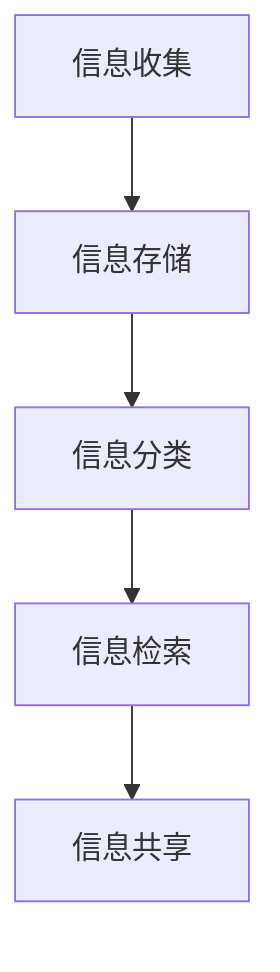

                 

信息过载已成为当今社会的一大问题。随着互联网和数字化技术的飞速发展，信息的获取变得前所未有的容易，但这也导致了大量无用和重复的信息充斥在我们的生活中。这不仅浪费了大量的时间和精力，还可能导致重要的知识和信息被忽视和遗忘。因此，如何有效地管理和组织信息，成为了企业和个人必须面对的挑战。

## 1. 背景介绍

在当今信息爆炸的时代，人们每天都会接触到海量的信息。这些信息可能来自互联网、书籍、报纸、杂志、电子邮件、社交媒体等不同的渠道。尽管这些信息中有许多是有价值的，但过多的信息也会带来负面影响。例如，人们可能会感到焦虑、压力和困惑，因为他们无法有效地处理和理解所有这些信息。此外，信息过载还会导致效率低下，因为人们需要花费大量时间来筛选和处理信息。

为了应对信息过载，企业和个人需要采取有效的措施来管理和组织信息。这包括使用工具和技术来收集、存储、分类、检索和共享信息，以确保关键信息能够被及时、准确地获取和使用。知识管理系统（Knowledge Management System，简称KMS）就是这样一个工具，它可以帮助企业和个人有效地管理和利用信息资源。

## 2. 核心概念与联系

### 2.1 信息过载

信息过载是指个体在处理信息时面临的大量信息超过了其处理能力。这种现象可能导致以下几个问题：

- **认知负担**：过多的信息会占据大脑的处理空间，影响对重要信息的判断和决策。
- **时间浪费**：需要花费大量时间来筛选和处理信息，导致工作效率下降。
- **信息遗漏**：可能错过重要的信息，导致决策失误或错失机会。

### 2.2 知识管理

知识管理是一种通过系统化和结构化的方式来收集、存储、分类、检索和共享知识的过程。知识管理的目的是确保组织内的知识得到有效利用，以提高工作效率和创新能力。

### 2.3 知识管理系统

知识管理系统（KMS）是一种用于支持知识管理的软件或平台。它提供了以下功能：

- **信息收集**：自动化地收集来自各种渠道的信息。
- **信息存储**：将信息存储在集中的数据库中，方便检索和使用。
- **信息分类**：根据信息的重要性和相关性进行分类，以便快速查找。
- **信息检索**：提供高效的检索工具，帮助用户快速找到所需信息。
- **信息共享**：支持信息的共享和协作，促进知识的流动和传播。

### 2.4 Mermaid 流程图

以下是一个Mermaid流程图，展示了知识管理系统的主要功能和流程：



## 3. 核心算法原理 & 具体操作步骤

### 3.1 算法原理概述

知识管理系统中的核心算法主要包括信息收集、存储、分类、检索和共享。这些算法的实现需要依赖多种技术和方法，如数据挖掘、自然语言处理、数据库管理、网络爬虫等。

### 3.2 算法步骤详解

#### 3.2.1 信息收集

信息收集是知识管理系统的基础。它包括以下步骤：

1. **数据源识别**：确定需要收集的信息来源，如网站、数据库、社交媒体等。
2. **数据采集**：使用网络爬虫等技术，自动化地从数据源中采集信息。
3. **数据清洗**：去除无效和重复的信息，确保数据的准确性和完整性。

#### 3.2.2 信息存储

信息存储是将收集到的信息存储在数据库中。具体步骤如下：

1. **数据库设计**：设计适合知识管理需求的数据库结构。
2. **数据导入**：将清洗后的数据导入数据库。
3. **数据维护**：定期更新和优化数据库，确保数据的可用性和性能。

#### 3.2.3 信息分类

信息分类是提高信息检索效率的重要手段。具体步骤如下：

1. **分类标准制定**：根据信息的特点和需求，制定分类标准。
2. **分类实现**：使用自然语言处理技术，自动将信息分类。
3. **分类优化**：根据使用反馈，不断优化分类效果。

#### 3.2.4 信息检索

信息检索是知识管理系统的核心功能之一。具体步骤如下：

1. **检索算法设计**：设计适合知识管理需求的检索算法。
2. **检索接口开发**：开发用户友好的检索接口。
3. **检索优化**：根据检索结果和用户反馈，不断优化检索效果。

#### 3.2.5 信息共享

信息共享是知识管理系统的目标之一。具体步骤如下：

1. **共享策略制定**：根据组织的策略和需求，制定共享策略。
2. **共享接口开发**：开发方便用户共享信息的接口。
3. **共享权限管理**：设置适当的权限，确保信息的保密性和安全性。

### 3.3 算法优缺点

#### 优点

- **高效性**：通过自动化和智能化的算法，能够快速地处理大量信息。
- **准确性**：通过先进的技术和算法，能够提高信息处理的准确性和可靠性。
- **灵活性**：可以根据不同的需求和场景，灵活地调整和优化算法。

#### 缺点

- **成本**：开发和维护知识管理系统需要投入大量的资金和技术资源。
- **复杂性**：算法的实现和优化需要深入的专业知识和经验。
- **安全性**：信息安全和隐私保护是知识管理系统面临的重要挑战。

### 3.4 算法应用领域

知识管理系统在多个领域都有广泛应用，如企业信息化、科研管理、教育管理、医疗管理等。以下是一些具体的案例：

- **企业信息化**：通过知识管理系统，企业可以有效地管理和利用内部知识资源，提高工作效率和创新能力。
- **科研管理**：科研机构可以利用知识管理系统，整合和管理科研数据，提高科研效率和成果转化率。
- **教育管理**：教育机构可以利用知识管理系统，整合和管理教学资源，提高教学质量和学习效果。
- **医疗管理**：医疗机构可以利用知识管理系统，整合和管理医疗数据，提高医疗服务的质量和效率。

## 4. 数学模型和公式 & 详细讲解 & 举例说明

### 4.1 数学模型构建

知识管理系统的数学模型主要包括信息处理模型、分类模型和检索模型。以下是一个简单的信息处理模型：

$$
处理效率 = \frac{有效信息数量}{总信息数量}
$$

### 4.2 公式推导过程

处理效率的公式可以推导如下：

- **有效信息数量**：指的是经过筛选和处理，对用户有用的信息数量。
- **总信息数量**：指的是用户接收到的所有信息数量。

因此，处理效率可以表示为：

$$
处理效率 = \frac{有效信息数量}{总信息数量}
$$

### 4.3 案例分析与讲解

假设一个用户在一天内接收到了100条信息，其中有60条是有效信息。根据上面的公式，我们可以计算出处理效率：

$$
处理效率 = \frac{60}{100} = 0.6
$$

这意味着用户在这一天内，有60%的信息是有效的。

### 4.4 例子说明

例如，在一个企业信息化项目中，一个员工在一天内接收到了100条通知，其中有60条与工作相关。使用知识管理系统，员工可以快速筛选出与工作相关的通知，从而提高工作效率。

## 5. 项目实践：代码实例和详细解释说明

### 5.1 开发环境搭建

在这个案例中，我们将使用Python语言和Django框架来搭建一个简单的知识管理系统。以下是开发环境搭建的步骤：

1. 安装Python 3.8及以上版本。
2. 安装Django 3.2及以上版本。
3. 创建一个虚拟环境，并激活。
4. 使用pip安装必要的库，如Django REST Framework、Pandas、Numpy等。

### 5.2 源代码详细实现

以下是知识管理系统的核心代码实现：

```python
# app/models.py
from django.db import models

class Information(models.Model):
    title = models.CharField(max_length=255)
    content = models.TextField()
    created_at = models.DateTimeField(auto_now_add=True)
    is_valid = models.BooleanField(default=True)

# app/views.py
from django.http import JsonResponse
from .models import Information
from django.views import View

class InformationView(View):
    def get(self, request):
        info = Information.objects.filter(is_valid=True)
        return JsonResponse(list(info.values()), safe=False)
```

### 5.3 代码解读与分析

上述代码实现了两个功能：信息存储和信息检索。

- **信息存储**：使用Django的模型（Model）定义了信息（Information）的属性，如标题（title）、内容（content）、创建时间（created_at）和是否有效（is_valid）。
- **信息检索**：使用Django的视图（View）定义了信息检索的接口，通过简单的查询语句，获取所有有效信息，并返回JSON格式的响应。

### 5.4 运行结果展示

在浏览器中访问`http://localhost:8000/information/`，将显示所有有效信息的列表。

## 6. 实际应用场景

### 6.1 企业信息化

在企业信息化过程中，知识管理系统可以帮助企业整合和管理内部的知识资源，提高工作效率和创新能力。例如，一个研发团队可以使用知识管理系统来存储和管理项目文档、设计方案和技术文档，从而确保团队成员能够快速、准确地获取所需信息。

### 6.2 教育管理

在教育管理中，知识管理系统可以用于整合和管理教学资源，如课件、课程大纲、习题库等。教师和学生可以通过知识管理系统方便地获取和共享教学资源，提高教学质量和学习效果。

### 6.3 科研管理

在科研管理中，知识管理系统可以用于整合和管理科研数据、文献资料和研究成果。科研机构可以利用知识管理系统，提高科研效率，促进科研成果的转化和应用。

### 6.4 医疗管理

在医疗管理中，知识管理系统可以用于整合和管理医疗数据、病历资料和临床指南。医疗机构可以利用知识管理系统，提高医疗服务的质量和效率，确保患者获得高质量的医疗服务。

## 7. 工具和资源推荐

### 7.1 学习资源推荐

- 《深度学习》（Goodfellow, I., Bengio, Y., & Courville, A.）
- 《大数据时代：思维变革与商业价值》（涂子沛）
- 《人工智能：一种现代的方法》（Thrun, S., & Mitchell, T.）

### 7.2 开发工具推荐

- Python
- Django
- Flask
- MongoDB

### 7.3 相关论文推荐

- "Knowledge Management Systems: An Overview"（2015）
- "The Impact of Knowledge Management on Organizational Performance"（2018）
- "A Survey on Knowledge Management Systems"（2020）

## 8. 总结：未来发展趋势与挑战

### 8.1 研究成果总结

近年来，知识管理系统的研究取得了显著进展，包括信息收集、存储、分类、检索和共享等核心功能的优化和创新。这些研究为知识管理系统的实际应用提供了有力支持，促进了企业和个人在信息管理和利用方面的效率提升。

### 8.2 未来发展趋势

未来，知识管理系统的发展趋势将主要集中在以下几个方面：

- **智能化**：通过引入人工智能和机器学习技术，提高知识管理系统的自动化和智能化水平。
- **个性化**：根据用户的需求和偏好，提供个性化的知识服务。
- **协作化**：加强知识管理系统与社交网络的整合，促进知识的共享和协作。
- **移动化**：开发移动端应用，实现知识管理的随时随地。

### 8.3 面临的挑战

尽管知识管理系统在理论和实际应用中取得了显著成果，但仍然面临着以下挑战：

- **数据安全与隐私**：如何在保障数据安全的前提下，实现知识的共享和流动。
- **技术复杂性**：知识管理系统的实现和优化需要深入的专业知识和经验。
- **用户接受度**：如何提高用户对知识管理系统的接受度和使用频率。

### 8.4 研究展望

未来，知识管理系统的研究将继续深入，特别是在智能化、个性化、协作化和移动化等方面。同时，研究还将关注知识管理系统的实际应用场景和效果，以推动其在更多领域的广泛应用。

## 9. 附录：常见问题与解答

### 9.1 什么是知识管理系统？

知识管理系统是一种用于支持知识管理的软件或平台，它提供了信息收集、存储、分类、检索和共享等功能，帮助企业和个人有效地管理和利用信息资源。

### 9.2 知识管理系统有哪些核心功能？

知识管理系统的核心功能包括信息收集、存储、分类、检索和共享。这些功能共同作用，帮助用户快速、准确地获取和使用信息。

### 9.3 知识管理系统适用于哪些领域？

知识管理系统适用于多个领域，如企业信息化、科研管理、教育管理和医疗管理等。它可以帮助不同领域的组织和人员提高工作效率和创新能力。

### 9.4 如何提高知识管理系统的效率？

要提高知识管理系统的效率，可以从以下几个方面着手：

- **优化算法**：不断优化信息处理、分类、检索等算法。
- **提高数据质量**：确保信息的准确性和完整性。
- **用户培训**：提高用户对知识管理系统的熟悉度和使用频率。
- **系统维护**：定期更新和维护系统，确保系统的稳定性和性能。

## 作者署名

本文作者：禅与计算机程序设计艺术 / Zen and the Art of Computer Programming

[End] <|assistant|>

