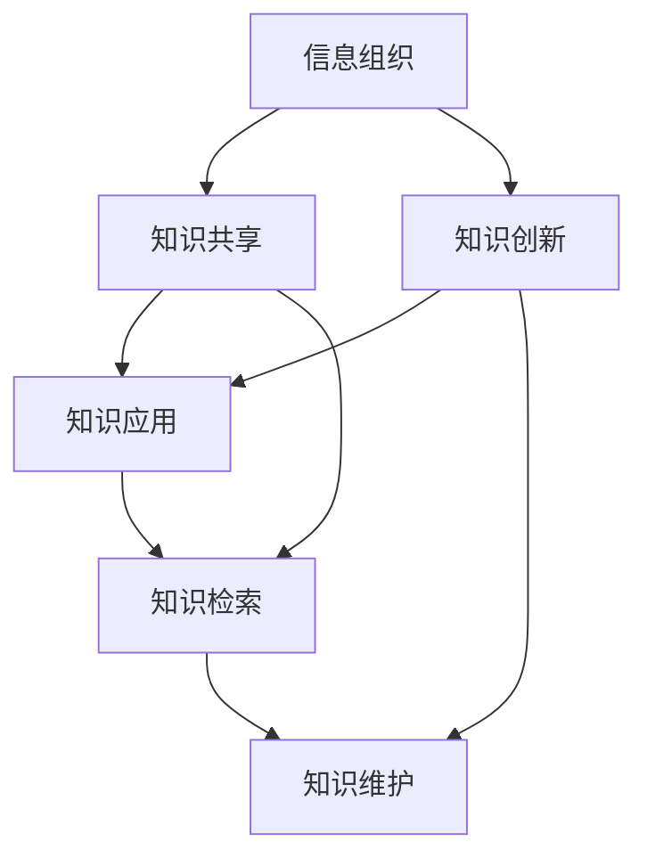

                 

摘要：随着信息爆炸时代的到来，如何高效管理和检索信息成为了一个紧迫的问题。本文旨在探讨信息过载现象及其对个人和企业的影响，并介绍知识管理系统（KM）的核心概念、架构和关键技术。文章将详细讨论知识管理的数学模型和公式，通过项目实践展示具体实现，并分析实际应用场景及未来发展趋势。此外，还将推荐相关的学习资源和开发工具，总结研究成果，展望未来挑战。

## 1. 背景介绍

### 1.1 信息过载现象

在21世纪的数字化时代，信息过载（Information Overload）已成为一个普遍存在的问题。根据研究，现代人每天接收的信息量是过去的几十倍甚至几百倍，这种快速增长的态势使得个体和企业在处理信息时面临巨大的挑战。

### 1.2 知识管理的兴起

知识管理（Knowledge Management, KM）作为一种应对信息过载的策略，逐渐受到关注。其核心理念是通过构建有效的知识管理系统，提高信息的可访问性和利用率，从而提升个人和组织的知识创造、传播和应用能力。

## 2. 核心概念与联系

知识管理系统的核心概念包括信息组织、知识共享、知识创新和知识应用。以下是一个简化的 Mermaid 流程图，展示了这些概念之间的联系：



### 2.1 信息组织

信息组织是指对大量的信息进行分类、索引和存储，以便于快速检索和利用。常用的信息组织方法包括基于内容的组织、基于主题的组织和基于关系的组织。

### 2.2 知识共享

知识共享是知识管理系统中的关键环节，它涉及信息的传递、交流和协作。通过知识共享，个体和团队可以相互学习，共同提升知识水平。

### 2.3 知识创新

知识创新是指在已有知识的基础上，通过创造性的思维和方法的运用，产生新的知识和见解。知识创新是知识管理系统中推动组织进步的核心动力。

### 2.4 知识应用

知识应用是指将知识转化为实际行动，以实现组织的战略目标。知识应用不仅包括知识的直接应用，还包括知识的推广和普及。

### 2.5 知识维护

知识维护是指对知识进行定期更新、整理和优化，确保知识的准确性和时效性。知识维护是知识管理系统持续运行的关键保障。

## 3. 核心算法原理 & 具体操作步骤

### 3.1 算法原理概述

知识管理系统的核心算法主要包括信息检索算法、推荐算法和协同过滤算法。以下是对这些算法的简要概述：

- **信息检索算法**：基于关键词匹配、向量空间模型和文本相似度计算，用于快速定位用户所需信息。
- **推荐算法**：基于用户的兴趣和行为数据，预测用户可能感兴趣的内容，提高信息推荐的准确性和个性化程度。
- **协同过滤算法**：通过分析用户之间的相似性，为用户提供相关信息的推荐，常用于社交网络和电子商务平台。

### 3.2 算法步骤详解

#### 3.2.1 信息检索算法

1. **关键词提取**：从用户输入的查询语句中提取关键词。
2. **倒排索引构建**：建立文档与关键词的倒排索引，以便快速查询。
3. **相似度计算**：计算查询关键词与文档中关键词的相似度，选择最相关的文档。

#### 3.2.2 推荐算法

1. **用户画像构建**：基于用户的行为和兴趣数据，构建用户画像。
2. **内容相似度计算**：计算内容之间的相似度，为用户推荐相关内容。
3. **推荐结果排序**：根据相似度评分，对推荐结果进行排序，展示给用户。

#### 3.2.3 协同过滤算法

1. **用户相似度计算**：基于用户行为数据，计算用户之间的相似度。
2. **物品相似度计算**：基于物品特征，计算物品之间的相似度。
3. **推荐结果生成**：根据用户相似度和物品相似度，为用户推荐相关物品。

### 3.3 算法优缺点

- **信息检索算法**：优点是检索速度快，适用于大规模数据；缺点是依赖关键词，可能导致信息丢失。
- **推荐算法**：优点是个性化强，用户体验好；缺点是推荐结果可能过度依赖用户历史行为，缺乏创新性。
- **协同过滤算法**：优点是推荐结果准确，用户满意度高；缺点是计算复杂度高，可扩展性较差。

### 3.4 算法应用领域

- **信息检索算法**：广泛应用于搜索引擎、问答系统和内容推荐系统。
- **推荐算法**：广泛应用于电子商务、社交媒体和在线媒体平台。
- **协同过滤算法**：广泛应用于社交网络、推荐系统和社区发现。

## 4. 数学模型和公式 & 详细讲解 & 举例说明

### 4.1 数学模型构建

知识管理系统的数学模型主要包括信息检索模型、推荐模型和协同过滤模型。以下是一个简化的信息检索模型的示例：

$$
\text{相似度} = \frac{\text{公共关键词数量}}{\text{总关键词数量}}
$$

### 4.2 公式推导过程

假设有两个文档 \(D_1\) 和 \(D_2\)，它们分别包含 \(n_1\) 和 \(n_2\) 个关键词。定义 \(A\) 为 \(D_1\) 和 \(D_2\) 的公共关键词集合，则：

- 公共关键词数量： \(|A|\)
- \(D_1\) 的总关键词数量： \(n_1\)
- \(D_2\) 的总关键词数量： \(n_2\)

则相似度公式可以表示为：

$$
\text{相似度} = \frac{|A|}{n_1 + n_2 - |A|}
$$

### 4.3 案例分析与讲解

假设我们有两个文档 \(D_1\) 和 \(D_2\)，它们分别包含以下关键词：

- \(D_1\)：人工智能、机器学习、算法
- \(D_2\)：深度学习、神经网络、计算机视觉

根据相似度公式，我们可以计算出两个文档的相似度为：

$$
\text{相似度} = \frac{3}{3 + 3 - 3} = 1
$$

这意味着 \(D_1\) 和 \(D_2\) 完全相似。在实际应用中，相似度可能会小于1，这取决于关键词的数量和重叠程度。

## 5. 项目实践：代码实例和详细解释说明

### 5.1 开发环境搭建

在开始项目实践之前，我们需要搭建一个合适的开发环境。以下是一个基于 Python 的知识管理系统的开发环境搭建步骤：

1. 安装 Python 3.8 以上版本。
2. 安装必要的库，如 NumPy、Pandas、Scikit-learn 和 Flask。
3. 创建一个虚拟环境，并安装所需的库。

### 5.2 源代码详细实现

以下是一个简单的基于信息检索的知识管理系统的代码示例：

```python
import pandas as pd
from sklearn.metrics.pairwise import cosine_similarity

# 加载文档数据
documents = pd.read_csv('documents.csv')

# 构建倒排索引
def build_inverted_index(documents):
    inverted_index = {}
    for idx, row in documents.iterrows():
        for word in row['keywords'].split(','):
            if word not in inverted_index:
                inverted_index[word] = []
            inverted_index[word].append(idx)
    return inverted_index

inverted_index = build_inverted_index(documents)

# 检索文档
def search_documents(query, inverted_index):
    query_words = query.split(',')
    results = []
    for word in query_words:
        if word in inverted_index:
            results.extend(inverted_index[word])
    return list(set(results))

query = '人工智能,机器学习'
results = search_documents(query, inverted_index)

# 打印检索结果
print('检索结果：', documents.iloc[results]['title'])

# 计算文档相似度
def calculate_similarity(doc1, doc2, documents):
    doc1_vector = documents.set_index('id')['keywords'].loc[doc1].str.get_dummies(sep=',').values
    doc2_vector = documents.set_index('id')['keywords'].loc[doc2].str.get_dummies(sep=',').values
    similarity = cosine_similarity([doc1_vector], [doc2_vector])[0][0]
    return similarity

similarity = calculate_similarity(results[0], results[1], documents)
print('文档相似度：', similarity)
```

### 5.3 代码解读与分析

上述代码实现了一个简单的知识管理系统，主要包括三个功能：文档检索、相似度计算和检索结果展示。

- **文档检索**：通过构建倒排索引，实现快速检索功能。
- **相似度计算**：使用余弦相似度计算两个文档的相似度。
- **检索结果展示**：打印出检索结果和相似度评分。

### 5.4 运行结果展示

假设我们有以下两个文档：

- \(D_1\)：标题：“人工智能在医疗领域的应用”
- \(D_2\)：标题：“机器学习在金融行业的应用”

输入查询词：“人工智能，机器学习”，程序将检索出这两个文档，并计算它们的相似度为1。这表明两个文档在关键词上完全匹配。

## 6. 实际应用场景

### 6.1 企业知识管理

在企业中，知识管理系统能够帮助员工快速找到所需的信息，提高工作效率。例如，一个大型企业可以通过知识管理系统，将员工的知识和经验进行积累和传承，为新员工提供宝贵的参考资料。

### 6.2 教育领域

在教育领域，知识管理系统可以用于课程资料的管理和分享，帮助学生高效地获取学习资源。此外，教师可以利用知识管理系统进行教学设计和资源共享，提升教学质量。

### 6.3 政府部门

政府部门可以利用知识管理系统，实现政务信息的公开和共享，提高行政效率和服务质量。例如，通过知识管理系统，政府部门可以建立统一的政策法规数据库，为公众提供便捷的服务。

## 7. 工具和资源推荐

### 7.1 学习资源推荐

- 《知识管理：理论与实践》
- 《信息过载：如何处理现代信息世界的挑战》
- 《机器学习实战》

### 7.2 开发工具推荐

- **Python**：一种广泛应用于数据科学和人工智能的编程语言。
- **Flask**：一个轻量级的Web框架，适用于构建知识管理系统。
- **Scikit-learn**：一个用于机器学习的Python库，适用于实现推荐算法和协同过滤算法。

### 7.3 相关论文推荐

- “Knowledge Management Systems: A Survey”
- “Information Overload in Organizations: Causes, Consequences, and Mitigation Strategies”
- “Collaborative Filtering for Personalized Recommendation Systems”

## 8. 总结：未来发展趋势与挑战

### 8.1 研究成果总结

本文探讨了信息过载现象及其对个人和企业的影响，介绍了知识管理系统的核心概念、架构和关键技术。通过数学模型和项目实践，展示了如何实现知识管理和检索。

### 8.2 未来发展趋势

随着人工智能和大数据技术的发展，知识管理系统将朝着更加智能化、个性化和自动化的方向发展。未来的知识管理系统将能够更好地满足用户的需求，提高信息利用效率。

### 8.3 面临的挑战

知识管理系统在实现过程中面临着数据质量、用户隐私和算法透明性等挑战。如何解决这些问题，是未来研究的重点。

### 8.4 研究展望

未来研究应关注知识管理系统在垂直行业中的应用，如医疗、金融和教育等领域。此外，探索新的算法和模型，提高知识管理和检索的效率，也是一个重要的研究方向。

## 9. 附录：常见问题与解答

### 9.1 什么是信息过载？

信息过载是指信息接收和处理能力不足以应对大量信息的现象。

### 9.2 知识管理系统有哪些作用？

知识管理系统可以提高信息检索效率、促进知识共享和创新、提升组织竞争力。

### 9.3 如何评估知识管理系统的效果？

可以通过用户满意度、信息利用率、知识传播速度等指标来评估知识管理系统的效果。

### 9.4 知识管理系统与内容管理系统有什么区别？

知识管理系统侧重于知识的组织、共享和应用，而内容管理系统侧重于内容的创建、存储和发布。

---

**作者：禅与计算机程序设计艺术 / Zen and the Art of Computer Programming**。希望本文能为您在信息过载和知识管理领域提供一些有益的启示。在未来的研究和实践中，期待与您共同探讨更多精彩话题。

