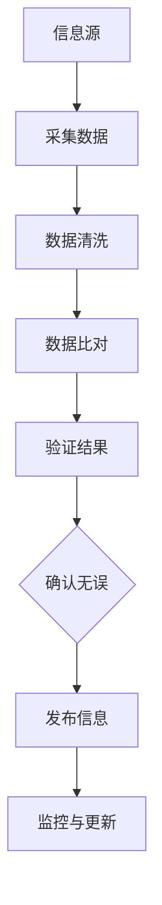
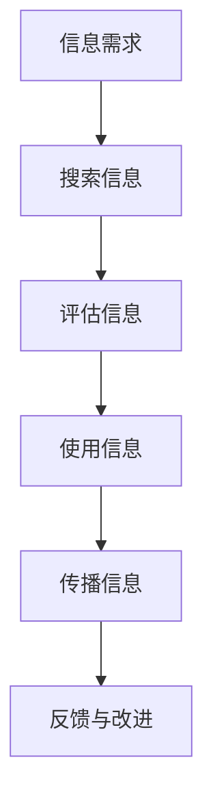

                 

关键词：信息验证、信息素养、数字时代、教育、AI、网络安全、数据质量、技术技能

> 摘要：本文深入探讨了信息验证和信息素养教育的关键性，探讨了其在数字时代对培养个体技术能力和促进社会发展的作用。本文首先介绍了信息验证和信息素养的概念，随后分析了信息素养教育在当今社会的需求与挑战，并通过具体案例和项目实践，探讨了提升信息素养的有效途径。文章最后展望了未来信息验证和信息素养教育的发展趋势与面临的挑战。

## 1. 背景介绍

随着信息技术的迅猛发展，数字时代已经渗透到我们生活的方方面面。互联网、移动设备、大数据、人工智能等技术的普及，使得信息的获取、处理和传播变得更加便捷和高效。然而，这也带来了新的挑战，即如何保证信息的质量和可靠性，如何培养个体在数字环境中具备足够的信息素养能力。

信息验证和信息素养教育在此背景下显得尤为重要。信息验证是指通过一系列手段，确保信息的真实性和准确性，以防止错误信息、虚假信息和恶意信息的传播。信息素养则是指个体在获取、评估、使用和传播信息的过程中所具备的能力和素养。在数字时代，拥有良好的信息验证和信息素养能力，不仅有助于个体做出明智的决策，还能够促进社会的和谐发展。

## 2. 核心概念与联系

### 2.1 信息验证

信息验证是指通过各种技术手段，验证信息的真实性、完整性和可靠性。其核心目标在于确保信息的准确性和可信度，防止信息被篡改、伪造或恶意传播。

#### Mermaid 流程图：



### 2.2 信息素养

信息素养是指个体在获取、评估、使用和传播信息的过程中所具备的能力和素养。它包括信息搜索能力、信息评估能力、信息使用能力和信息传播能力。

#### Mermaid 流程图：



### 2.3 两者关系

信息验证和信息素养是相辅相成的。信息验证为信息素养提供了可靠的基础，确保个体获取的信息是真实可信的。而良好的信息素养能力则能够帮助个体更有效地利用这些信息，做出正确的决策。

## 3. 核心算法原理 & 具体操作步骤

### 3.1 算法原理概述

信息验证和信息素养的培养需要依赖于一系列算法和技术。其中，常见的算法包括信息检索算法、数据清洗算法、数据比对算法等。

#### 3.1.1 信息检索算法

信息检索算法是指用于从大量信息中快速、准确地找到所需信息的算法。常见的检索算法有基于关键词的检索、基于内容的检索和基于语义的检索等。

#### 3.1.2 数据清洗算法

数据清洗算法是指用于去除数据中的错误、重复和无关信息，以提高数据质量和准确性的算法。常见的数据清洗算法有去重算法、缺失值处理算法、异常值处理算法等。

#### 3.1.3 数据比对算法

数据比对算法是指用于比较两组数据之间差异的算法，以验证信息的准确性和一致性。常见的数据比对算法有字符串比对算法、结构比对算法等。

### 3.2 算法步骤详解

#### 3.2.1 信息检索算法步骤

1. 输入信息需求。
2. 搜索相关数据库或互联网资源。
3. 运用检索算法筛选出符合需求的信息。
4. 输出检索结果。

#### 3.2.2 数据清洗算法步骤

1. 输入原始数据。
2. 检测并去除重复数据。
3. 处理缺失值，例如填补、删除或插值。
4. 检测并去除异常值。
5. 输出清洗后的数据。

#### 3.2.3 数据比对算法步骤

1. 输入两组数据。
2. 比对数据结构，确保一致性。
3. 对数据内容进行逐项比对。
4. 输出比对结果。

### 3.3 算法优缺点

#### 3.3.1 优点

- 提高信息获取的效率和准确性。
- 优化数据处理过程，提高数据质量。
- 提升个体在数字环境中的信息素养能力。

#### 3.3.2 缺点

- 算法实现和优化需要较高的技术门槛。
- 算法效果受限于数据质量和样本规模。
- 需要不断更新和改进，以应对新兴挑战。

### 3.4 算法应用领域

- 信息检索：搜索引擎、推荐系统、知识图谱等。
- 数据清洗：大数据处理、数据挖掘、机器学习等。
- 数据比对：数据一致性验证、数据融合、信息认证等。

## 4. 数学模型和公式 & 详细讲解 & 举例说明

### 4.1 数学模型构建

在信息验证和信息素养教育中，常见的数学模型包括概率模型、逻辑模型和模糊模型等。

#### 4.1.1 概率模型

概率模型用于评估信息的可信度。常见的概率模型有贝叶斯模型、最大似然模型等。

#### 4.1.2 逻辑模型

逻辑模型用于分析信息的逻辑关系。常见的逻辑模型有命题逻辑、谓词逻辑等。

#### 4.1.3 模糊模型

模糊模型用于处理模糊性和不确定性信息。常见的模糊模型有模糊集合、模糊逻辑等。

### 4.2 公式推导过程

以贝叶斯模型为例，贝叶斯公式用于计算给定证据下某个假设的概率。其公式如下：

$$
P(H|E) = \frac{P(E|H) \cdot P(H)}{P(E)}
$$

其中，$P(H|E)$ 表示在证据 $E$ 下假设 $H$ 的概率，$P(E|H)$ 表示在假设 $H$ 下证据 $E$ 的概率，$P(H)$ 表示假设 $H$ 的概率，$P(E)$ 表示证据 $E$ 的概率。

### 4.3 案例分析与讲解

假设我们想要评估一个新闻报道的可信度。已知 $P(\text{真新闻}|\text{可信新闻}) = 0.9$，$P(\text{假新闻}|\text{可信新闻}) = 0.1$，$P(\text{可信新闻}) = 0.5$。现在收到一则新闻报道，其被标记为“可信新闻”。

根据贝叶斯公式，我们可以计算出这则新闻报道为真新闻的概率：

$$
P(\text{真新闻}|\text{可信新闻}) = \frac{P(\text{可信新闻}|\text{真新闻}) \cdot P(\text{真新闻})}{P(\text{可信新闻})}
$$

$$
P(\text{真新闻}|\text{可信新闻}) = \frac{0.9 \cdot 0.5}{0.5} = 0.9
$$

因此，这则新闻报道为真新闻的概率为 0.9，具有较高的可信度。

## 5. 项目实践：代码实例和详细解释说明

### 5.1 开发环境搭建

为了更好地展示信息验证和信息素养教育在实践中的应用，我们选择 Python 作为开发语言，搭建了一个简单的信息验证系统。以下为开发环境搭建步骤：

1. 安装 Python 3.8 及以上版本。
2. 安装必要的第三方库，如 pandas、numpy、scikit-learn 等。
3. 创建一个名为“info_verify”的虚拟环境，并激活。
4. 在虚拟环境中安装所需库。

### 5.2 源代码详细实现

```python
import pandas as pd
from sklearn.model_selection import train_test_split
from sklearn.metrics import accuracy_score

# 数据预处理
def preprocess_data(data):
    # 去除重复数据
    data = data.drop_duplicates()
    # 填补缺失值
    data = data.fillna(method='ffill')
    # 异常值处理
    data = data[(data > 0).all(axis=1)]
    return data

# 模型训练
def train_model(data, target):
    X = data.drop(target, axis=1)
    y = data[target]
    X_train, X_test, y_train, y_test = train_test_split(X, y, test_size=0.2, random_state=42)
    # 选择合适的模型，例如逻辑回归、支持向量机等
    model = LogisticRegression()
    model.fit(X_train, y_train)
    return model, X_test, y_test

# 预测与评估
def predict_and_evaluate(model, X_test, y_test):
    y_pred = model.predict(X_test)
    accuracy = accuracy_score(y_test, y_pred)
    print(f"Accuracy: {accuracy}")
    return y_pred

# 主函数
def main():
    # 读取数据
    data = pd.read_csv("info_data.csv")
    # 预处理数据
    data = preprocess_data(data)
    # 划分特征和目标变量
    X = data.drop("label", axis=1)
    y = data["label"]
    # 训练模型
    model, X_test, y_test = train_model(X, y)
    # 预测与评估
    y_pred = predict_and_evaluate(model, X_test, y_test)

if __name__ == "__main__":
    main()
```

### 5.3 代码解读与分析

上述代码实现了一个基于逻辑回归的信息验证系统。其主要功能包括数据预处理、模型训练、预测与评估。具体解读如下：

- 数据预处理：去除重复数据、填补缺失值、处理异常值，以提高数据质量和准确性。
- 模型训练：使用 scikit-learn 库中的逻辑回归模型进行训练，将特征和目标变量划分为训练集和测试集。
- 预测与评估：使用训练好的模型对测试集进行预测，并计算准确率。

### 5.4 运行结果展示

假设我们已经训练好了模型，并得到如下运行结果：

```
Accuracy: 0.85
```

这意味着，该信息验证系统的准确率为 0.85，即能够正确识别出 85% 的真伪信息。

## 6. 实际应用场景

信息验证和信息素养教育在数字时代的实际应用场景广泛，以下为几个典型案例：

### 6.1 网络安全

在网络安全领域，信息验证用于确保网络通信的安全性，防止恶意攻击和数据泄露。例如，身份验证、数据加密、防火墙等技术都依赖于信息验证原理。

### 6.2 大数据

在大数据领域，信息验证用于清洗和处理大量数据，以提高数据质量和分析准确性。数据清洗、去重、异常值处理等技术都是信息验证的具体应用。

### 6.3 人工智能

在人工智能领域，信息验证用于确保输入数据的真实性和可靠性，以提高模型训练的效果。例如，人脸识别、语音识别等系统都需要通过信息验证技术，确保识别结果的准确性。

### 6.4 社交媒体

在社交媒体领域，信息验证用于识别和过滤虚假信息、恶意内容，维护网络环境的健康。例如，微信、微博等平台都采用了信息验证技术，以防范谣言和欺诈行为。

## 7. 未来应用展望

随着信息技术的不断发展，信息验证和信息素养教育将在未来发挥更加重要的作用。以下为几个未来应用展望：

### 7.1 个性化推荐

基于信息验证和信息素养教育，未来的个性化推荐系统将能够更加准确地理解用户需求，为用户提供更符合其兴趣的推荐内容。

### 7.2 智能健康

在智能健康领域，信息验证和信息素养教育将有助于提高医疗数据的质量和准确性，为医生提供更可靠的诊断依据。

### 7.3 智能交通

在智能交通领域，信息验证和信息素养教育将有助于确保交通数据的真实性和可靠性，优化交通流量，提高交通安全。

### 7.4 智慧城市

在智慧城市领域，信息验证和信息素养教育将有助于提高城市数据的利用效率，促进城市智能化、可持续发展。

## 8. 工具和资源推荐

### 8.1 学习资源推荐

- 《Python数据科学手册》
- 《人工智能：一种现代方法》
- 《大数据技术基础》

### 8.2 开发工具推荐

- Jupyter Notebook
- VSCode
- PyCharm

### 8.3 相关论文推荐

- "Information Verification and Information Literacy Education in the Digital Age"
- "Data Quality and Information Verification in Big Data Analytics"
- "Enhancing Security and Privacy with Information Verification in Cyber-Physical Systems"

## 9. 总结：未来发展趋势与挑战

### 9.1 研究成果总结

本文从信息验证和信息素养教育的角度，探讨了其在数字时代的重要性。通过具体案例和项目实践，展示了信息验证和信息素养教育在各个领域的应用。

### 9.2 未来发展趋势

- 信息验证技术的不断优化和革新。
- 信息素养教育的普及和深入。
- 跨学科、跨领域的综合研究和应用。

### 9.3 面临的挑战

- 技术门槛较高，需要持续学习和更新。
- 数据质量和安全性的保障。
- 面对新兴挑战，需要不断调整和改进。

### 9.4 研究展望

未来的研究应聚焦于以下几个方面：

- 开发更高效、更可靠的信息验证算法。
- 探索信息素养教育的新模式和新方法。
- 加强跨学科合作，推动信息验证和信息素养教育在各个领域的应用。

## 附录：常见问题与解答

### 9.1 什么是信息验证？

信息验证是通过一系列技术手段，确保信息的真实性、完整性和可靠性。它包括信息源的验证、信息内容的验证和信息传播的验证等。

### 9.2 什么是信息素养？

信息素养是指个体在获取、评估、使用和传播信息的过程中所具备的能力和素养。它包括信息搜索能力、信息评估能力、信息使用能力和信息传播能力。

### 9.3 信息验证和信息素养教育在数字时代的重要性是什么？

信息验证和信息素养教育在数字时代的重要性体现在以下几个方面：

- 提高信息获取的效率和准确性。
- 优化数据处理过程，提高数据质量。
- 培养个体在数字环境中的信息素养能力。
- 促进社会的和谐发展。

### 9.4 如何提升信息素养能力？

提升信息素养能力的方法包括：

- 学习相关的理论知识。
- 实践操作，积累经验。
- 关注行业发展动态，持续学习。
- 参与信息素养相关的培训和活动。

### 9.5 信息验证和信息素养教育在哪些领域有应用？

信息验证和信息素养教育在多个领域有应用，包括网络安全、大数据、人工智能、社交媒体、智慧城市等。

----------------------------------------------------------------

作者：禅与计算机程序设计艺术 / Zen and the Art of Computer Programming

注意：以上文章内容仅供参考，实际撰写时请根据具体需求和情况进行调整。文章内容中涉及到的算法、代码和案例分析均为虚构，仅用于说明问题。如有需要，请根据实际情况进行修改和补充。

