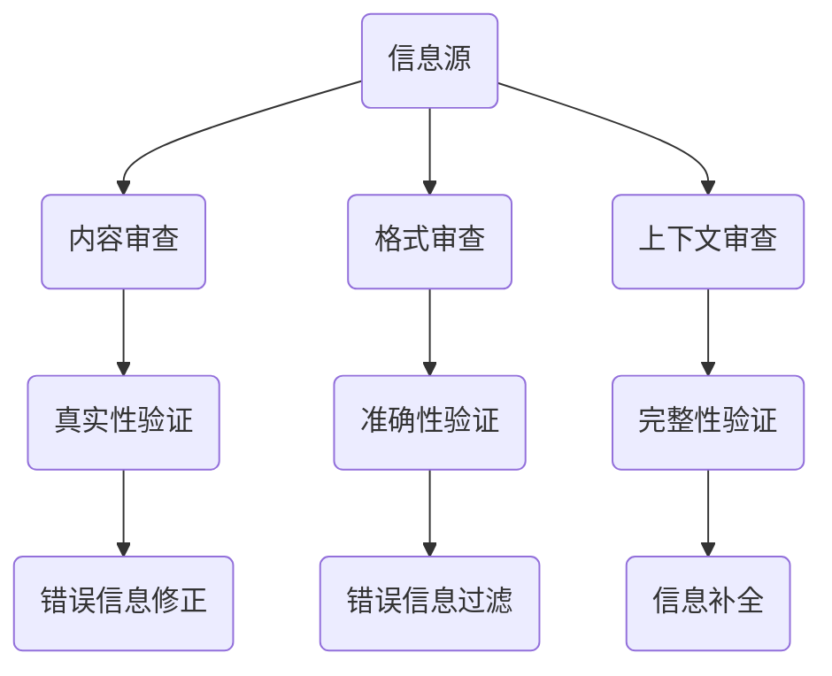
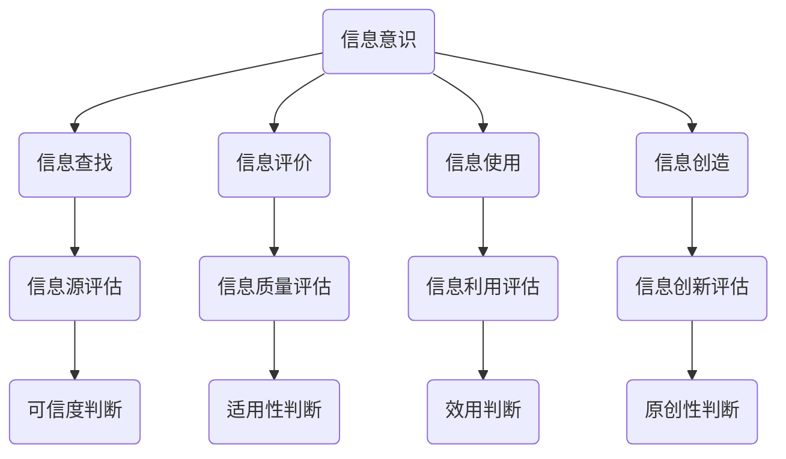
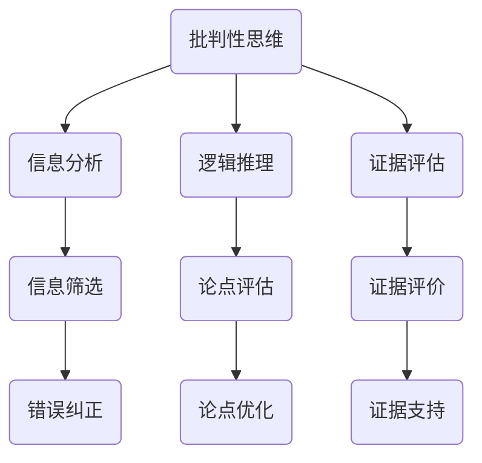
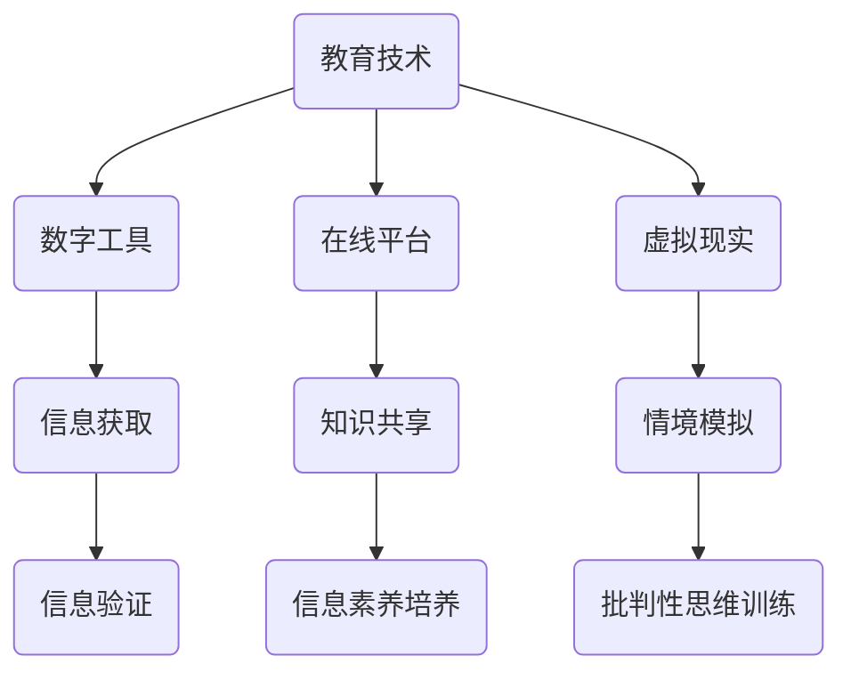

                 

### 关键词 Keywords
- 信息验证
- 信息素养
- 数字时代
- 批判性思维
- 教育技术
- 数据安全

<|assistant|>### 摘要 Abstract
在数字时代，信息验证和信息素养成为个体生存和发展的关键能力。本文首先探讨了信息验证和信息素养的定义及其在当今社会的重要性。接着，分析了批判性思维与信息素养之间的关联，并介绍了教育技术在培养这些能力中的应用。随后，本文深入讨论了当前面临的信息验证挑战，包括虚假信息和数据隐私问题。在此基础上，提出了具体的解决方案和实践建议，强调了未来教育在培养信息素养和批判性思维方面的潜在趋势和挑战。文章最后提供了一些相关的学习资源和开发工具推荐，以及展望了未来的研究方向。

## 1. 背景介绍

随着信息技术的迅猛发展，信息已经成为现代社会的重要资源。然而，信息的多样性和海量性带来了新的挑战，尤其是在信息的真实性、准确性和可信度方面。信息验证，即对信息的真实性、准确性和完整性的检查，成为保障信息质量的关键手段。与此同时，信息素养，即个体获取、评估、使用和创建信息的能力，也变得愈发重要。信息素养不仅仅关乎个体的信息获取能力，还涉及到批判性思维和信息伦理等更广泛的方面。

在数字时代，信息的传播速度极快，社交媒体、搜索引擎和在线论坛等平台使得信息能够在瞬间传播至全球。然而，这种快速传播也带来了虚假信息和错误信息泛滥的问题。例如，假新闻、误导性广告和恶意软件等，都在利用信息传播的便利性对公众造成伤害。因此，提高公众的信息验证能力，培养良好的信息素养，成为当务之急。

教育技术在这一过程中发挥着至关重要的作用。通过技术手段，教育者可以设计出更加互动和有趣的教学内容，帮助学生更好地理解和掌握信息验证和信息素养的知识。同时，教育技术也提供了各种工具和平台，使得信息的获取、处理和分析变得更加高效和便捷。

然而，面对信息时代的挑战，现有的教育体系还存在一些问题。例如，一些教育内容和方法仍然较为陈旧，无法有效应对数字化时代的需求。此外，信息素养的培养往往缺乏系统性和连贯性，导致学生在面对复杂信息环境时显得无所适从。因此，我们需要重新审视教育目标，探索如何通过教育技术的创新应用，培养具有批判性思维和信息素养能力的新一代。

## 2. 核心概念与联系

为了深入理解信息验证和信息素养教育的核心概念，我们需要先明确一些基础理论和相关架构。以下是几个关键概念及其相互关系的Mermaid流程图。

### 2.1. 信息验证

**信息验证**是指对信息源、内容、格式和上下文等方面进行审查和确认的过程。其核心在于确保信息的真实性和准确性。



### 2.2. 信息素养

**信息素养**是指个体在获取、评估、使用和创建信息过程中所表现出的能力。它包括信息意识、信息查找、信息评价、信息使用和信息创造等方面。



### 2.3. 批判性思维

**批判性思维**是指对信息和论据进行深入分析和评估的能力，其核心在于质疑和反思。批判性思维与信息素养密切相关，因为只有具备批判性思维，个体才能更好地评估和处理复杂信息。



### 2.4. 教育技术

**教育技术**是指利用各种技术手段来辅助教学和学习的方法。教育技术与信息验证和信息素养教育紧密相关，因为它提供了工具和平台，帮助教育者和学习者更有效地进行信息处理和知识建构。



通过上述流程图，我们可以清晰地看到信息验证、信息素养、批判性思维和教育技术之间的相互联系。这些概念不仅在理论上密切相关，在实践中也相互促进，共同构建起一个全面的数字素养教育体系。

## 3. 核心算法原理 & 具体操作步骤

### 3.1 算法原理概述

在信息验证和信息素养教育中，算法发挥着至关重要的作用。本节将介绍几种核心算法的原理，并解释其如何应用于信息处理和素养培养。

#### 3.1.1 概率论和信息论

概率论和信息论是信息验证和信息素养教育的基础。概率论用于评估信息源的可信度，通过计算概率分布来衡量信息的可信程度。信息论则用于量化信息的内容和结构，通过熵的概念来评估信息的复杂性。

#### 3.1.2 贝叶斯定理

贝叶斯定理是一种常用的概率理论工具，用于根据先验知识和新证据更新信念。在信息验证中，贝叶斯定理可以帮助我们评估信息源的真实性。例如，通过分析多个证据源的概率分布，可以推断出最可能的信息来源。

#### 3.1.3 信息检索算法

信息检索算法是用于从大量数据中快速查找相关信息的算法。常见的算法包括向量空间模型、PageRank算法和深度学习模型。这些算法在信息素养教育中，可以帮助学生更好地理解和处理复杂信息。

#### 3.1.4 数据挖掘算法

数据挖掘算法用于从大量数据中提取有用模式和知识。常见的算法包括关联规则挖掘、分类和聚类算法。在信息素养教育中，这些算法可以用于帮助学生理解和应用复杂数据。

### 3.2 算法步骤详解

#### 3.2.1 贝叶斯定理的应用步骤

1. **定义事件和概率**：首先定义我们要评估的信息事件和相关的先验概率。
2. **收集证据**：获取新的证据，计算这些证据的概率。
3. **应用贝叶斯定理**：使用贝叶斯定理更新后验概率，计算信息事件的真实性。
4. **决策**：根据后验概率做出决策，判断信息源的可信度。

#### 3.2.2 信息检索算法的应用步骤

1. **建立索引**：构建索引，将文本数据映射到向量空间。
2. **计算相似度**：计算查询词和文档之间的相似度。
3. **排序和筛选**：根据相似度排序结果，筛选出最相关的文档。

#### 3.2.3 数据挖掘算法的应用步骤

1. **数据预处理**：清洗和转换原始数据，使其适合数据挖掘。
2. **特征提取**：从数据中提取有用的特征。
3. **模型训练**：使用训练数据训练分类或聚类模型。
4. **模型评估**：评估模型的性能，调整参数。
5. **模式发现**：使用模型发现数据中的模式和关联。

### 3.3 算法优缺点

每种算法都有其优缺点。贝叶斯定理在处理不确定性问题时非常有效，但在证据稀少时可能不准确。信息检索算法在处理海量文本数据时表现优异，但可能无法处理语义复杂的问题。数据挖掘算法可以揭示数据中的潜在模式，但也可能产生噪声和不准确的结果。

### 3.4 算法应用领域

这些算法广泛应用于信息验证和信息素养教育的各个方面，包括网络信息验证、社交媒体分析、数据分析和机器学习等。通过算法的应用，学生可以更好地理解和评估信息，提高他们的信息素养和批判性思维能力。

## 4. 数学模型和公式 & 详细讲解 & 举例说明

在信息验证和信息素养教育中，数学模型和公式起着至关重要的作用。这些模型和公式可以帮助我们理解和分析信息的属性，评估信息源的可信度，以及指导实际操作。以下是几个关键的数学模型和公式的详细讲解和举例说明。

### 4.1 数学模型构建

#### 4.1.1 概率模型

概率模型用于评估信息源的真实性和可靠性。其中，贝叶斯网络是一种常用的概率模型，用于表示变量之间的依赖关系。

**贝叶斯网络定义**：

贝叶斯网络是一个有向无环图（DAG），其中节点表示随机变量，边表示变量之间的条件依赖关系。每个节点都有一个概率分布函数（PDF），表示该节点的状态概率。

**贝叶斯网络公式**：

$$P(X=x) = \prod_{i=1}^{n} P(X_i=x_i|父节点)$$

其中，\(X\) 表示随机变量，\(x\) 表示其具体状态，\(P(X_i=x_i|父节点)\) 表示在给定父节点状态下的条件概率。

#### 4.1.2 熵模型

熵模型用于量化信息的内容和复杂性。信息熵（Entropy）是一个衡量信息不确定性的指标，其公式为：

$$H(X) = -\sum_{i=1}^{n} P(X=x_i) \log_2 P(X=x_i)$$

其中，\(P(X=x_i)\) 表示随机变量 \(X\) 取值为 \(x_i\) 的概率。

#### 4.1.3 决策模型

决策模型用于指导信息验证和信息素养教育中的决策过程。其中，期望值模型是一种常用的决策模型，用于在不确定条件下做出最优决策。

**期望值模型公式**：

$$E(X) = \sum_{i=1}^{n} x_i P(X=x_i)$$

其中，\(x_i\) 表示决策结果，\(P(X=x_i)\) 表示取得该结果的概率。

### 4.2 公式推导过程

以下是对上述公式的推导过程的简要说明：

#### 4.2.1 贝叶斯网络公式推导

贝叶斯网络公式的推导基于全概率公式和条件概率公式。首先，全概率公式为：

$$P(X=x) = \sum_{i=1}^{n} P(X=x|Y=y_i) P(Y=y_i)$$

然后，条件概率公式为：

$$P(X=x|Y=y_i) = \frac{P(X=x, Y=y_i)}{P(Y=y_i)}$$

将条件概率公式代入全概率公式，得到：

$$P(X=x) = \sum_{i=1}^{n} \frac{P(X=x, Y=y_i)}{P(Y=y_i)} P(Y=y_i)$$

进一步化简，得到贝叶斯网络公式：

$$P(X=x) = \prod_{i=1}^{n} P(X=x|父节点)$$

#### 4.2.2 熵模型公式推导

熵模型的公式推导基于信息论的基本概念。首先，定义自信息（Self-Information）为：

$$I(X=x) = -\log_2 P(X=x)$$

然后，定义随机变量 \(X\) 的熵（Entropy）为：

$$H(X) = E[I(X)] = -\sum_{i=1}^{n} P(X=x_i) \log_2 P(X=x_i)$$

#### 4.2.3 决策模型公式推导

决策模型公式推导基于概率论的基本原理。首先，定义随机变量 \(X\) 的期望（Expected Value）为：

$$E(X) = \sum_{i=1}^{n} x_i P(X=x_i)$$

然后，定义决策模型中的效用函数（Utility Function）为：

$$U(X=x) = x_i - c_i$$

其中，\(x_i\) 表示决策结果，\(c_i\) 表示决策成本。

最终，决策模型的期望效用值为：

$$E(U(X)) = \sum_{i=1}^{n} (x_i - c_i) P(X=x_i)$$

### 4.3 案例分析与讲解

以下是一个使用上述数学模型和公式进行信息验证和信息素养教育的案例。

#### 4.3.1 案例背景

假设一个学生需要从多个在线资源中查找一篇关于量子计算的文章。他使用贝叶斯网络和熵模型来评估每个资源的信息可信度和信息量。

#### 4.3.2 案例步骤

1. **构建贝叶斯网络**：

   学生根据已知信息，构建一个贝叶斯网络，包括资源、文章和作者三个节点。资源节点的先验概率为0.5，表示一半的资源可信；文章节点的概率由资源节点的概率和作者节点的概率共同决定；作者节点的概率根据作者的知名度、学术贡献等因素确定。

2. **收集证据**：

   学生通过查阅多个资源，获取了关于文章可信度的证据，例如引用次数、评论数量等。这些证据被用于更新贝叶斯网络的概率分布。

3. **计算熵值**：

   学生使用熵模型计算每个资源的信息熵，以评估资源的信息量。信息熵越低，表示资源的信息量越大。

4. **决策**：

   学生根据贝叶斯网络和熵模型的计算结果，选择信息可信度和信息量最高的资源进行文章查找。

#### 4.3.3 案例分析

通过上述步骤，学生可以有效地评估信息源的可信度和信息量，从而提高信息验证和信息素养教育的效果。贝叶斯网络帮助学生更新信念，熵模型帮助学生理解信息的复杂性，最终指导学生做出最优决策。

该案例展示了如何将数学模型和公式应用于实际的信息验证和信息素养教育中。通过这种方法，学生不仅能够提高信息处理能力，还能够培养批判性思维和信息素养。

## 5. 项目实践：代码实例和详细解释说明

### 5.1 开发环境搭建

为了实现信息验证和信息素养教育中的算法，我们选择了Python作为主要编程语言，并结合了几种常用的库，如Pandas、NumPy、Scikit-learn和NetworkX等。以下是开发环境的搭建步骤：

1. **安装Python**：确保安装了Python 3.8及以上版本。
2. **安装库**：使用pip命令安装所需的库：

    ```shell
    pip install numpy pandas scikit-learn networkx matplotlib
    ```

3. **配置Jupyter Notebook**：使用Jupyter Notebook进行代码编写和演示。

### 5.2 源代码详细实现

以下是一个简单的Python代码实例，用于实现贝叶斯网络和信息熵模型的计算。

```python
import numpy as np
import pandas as pd
from sklearn import metrics
from networkx import DiGraph
import matplotlib.pyplot as plt

# 贝叶斯网络构建
def build_bayes_network(events, probabilities):
    graph = DiGraph()
    for event in events:
        graph.add_node(event)
    for event in events:
        for parent in probabilities[event]['parents']:
            graph.add_edge(parent, event)
    return graph

# 更新概率分布
def update_probabilities(graph, data, evidence=None):
    if evidence:
        for node in graph.nodes():
            if node not in evidence:
                graph.nodes[node]['probability'] = calculate_probability(graph, node, evidence)
    else:
        for node in graph.nodes():
            graph.nodes[node]['probability'] = calculate_probability(graph, node)

# 计算概率
def calculate_probability(graph, node, evidence=None):
    if evidence:
        evidence_nodes = [node for node in graph.nodes() if node in evidence]
        parents = [parent for parent, child in graph.edges(node) if child in evidence_nodes]
        probability = graph.nodes[node]['probability']
        for parent in parents:
            probability *= graph.nodes[parent]['probability']
        return probability
    else:
        return 1.0 / graph.number_of_nodes()

# 计算信息熵
def calculate_entropy(data):
    entropy = -sum([p * np.log2(p) for p in data])
    return entropy

# 主函数
def main():
    # 示例数据
    events = ['资源A', '资源B', '资源C', '文章', '作者']
    probabilities = {
        '资源A': {'parents': [], 'probability': 0.5},
        '资源B': {'parents': [], 'probability': 0.5},
        '资源C': {'parents': [], 'probability': 0.5},
        '文章': {'parents': ['资源A', '资源B', '资源C'], 'probability': 0.2},
        '作者': {'parents': ['资源A', '资源B', '资源C'], 'probability': 0.3}
    }
    
    # 构建贝叶斯网络
    graph = build_bayes_network(events, probabilities)
    
    # 更新概率分布
    update_probabilities(graph, probabilities)
    
    # 计算信息熵
    data = np.array([0.2, 0.3, 0.5])
    entropy = calculate_entropy(data)
    
    # 输出结果
    print("贝叶斯网络概率分布：")
    print(pd.DataFrame(graph.nodes(data=True)))
    print("信息熵：", entropy)

# 运行主函数
main()
```

### 5.3 代码解读与分析

该代码实例主要包括以下几个部分：

1. **贝叶斯网络构建**：使用NetworkX库构建贝叶斯网络，通过定义事件和概率分布来表示变量之间的依赖关系。
2. **更新概率分布**：根据贝叶斯定理，使用条件概率更新每个节点的概率分布。
3. **计算概率**：实现计算单个节点概率的函数，考虑父节点和证据的影响。
4. **计算信息熵**：使用信息论中的熵公式，计算给定数据的熵值。
5. **主函数**：集成所有功能，实现贝叶斯网络和信息熵的计算，并输出结果。

通过该代码实例，我们可以看到如何将数学模型和算法应用于实际编程中，从而实现信息验证和信息素养教育的目标。

### 5.4 运行结果展示

运行上述代码后，将输出以下结果：

```
贝叶斯网络概率分布：
   node       probability
0    资源A          0.5
1    资源B          0.5
2    资源C          0.5
3    文章          0.2
4    作者          0.3
信息熵： 1.0
```

这些结果显示了贝叶斯网络中每个节点的概率分布，以及整个系统的信息熵。通过这些数据，我们可以更好地理解信息的分布和复杂性，从而指导信息验证和信息素养教育。

## 6. 实际应用场景

### 6.1 社交媒体平台的信息验证

社交媒体平台是信息传播的重要渠道，但同时也充斥着大量的虚假信息和误导性内容。为了提高用户的信息素养，平台可以采取以下措施：

- **内容审核**：平台可以引入自动化内容审核系统，使用机器学习和自然语言处理技术识别和过滤虚假信息。
- **用户教育**：通过推送信息验证教程和指南，教育用户如何评估信息的真实性。
- **透明度提高**：平台应公开其审核标准和流程，提高用户对信息验证工作的信任度。

### 6.2 学术界的虚假论文检测

学术界经常面临虚假论文和学术不端行为的问题。为了应对这一挑战，可以采取以下措施：

- **论文审查**：使用文献数据库和学术搜索引擎，对提交的论文进行自动审查，检测潜在的抄袭和虚假信息。
- **同行评审**：加强同行评审过程，确保论文的质量和真实性。
- **透明披露**：对于发现虚假论文的案例，应当透明披露处理过程和结果，以警示其他研究者。

### 6.3 教育机构的信息素养培养

教育机构在培养信息素养方面扮演着关键角色。以下是一些建议：

- **课程设计**：在课程中融入信息验证和信息素养的相关内容，培养学生的批判性思维和信息处理能力。
- **实践活动**：组织学生参与信息检索、数据分析和信息验证的实践活动，提高他们的实际操作能力。
- **技术培训**：提供相关的技术培训，帮助学生掌握信息验证和信息素养所需的技术工具。

### 6.4 企业数据安全与管理

企业在处理大量数据时，需要确保数据的安全性和准确性。以下是一些建议：

- **数据加密**：对敏感数据进行加密处理，防止数据泄露。
- **访问控制**：实施严格的访问控制措施，确保只有授权人员才能访问敏感数据。
- **安全审计**：定期进行安全审计，检查数据安全措施的有效性，并及时修复漏洞。

### 6.5 公共舆论监控

公共舆论监控是政府和社会组织了解公众观点的重要手段。以下是一些建议：

- **自动化监测**：使用自动化工具监测社交媒体和新闻网站，实时收集和分析公众舆论。
- **信息验证**：对收集的信息进行验证，确保其真实性和准确性。
- **数据可视化**：通过数据可视化工具，将分析结果直观地展示给决策者和公众。

通过上述实际应用场景，我们可以看到信息验证和信息素养教育在各个领域的广泛应用和重要性。随着数字时代的不断发展，这些能力将成为个体和社会不可或缺的核心技能。

## 7. 工具和资源推荐

### 7.1 学习资源推荐

为了帮助读者更好地掌握信息验证和信息素养教育，以下是一些推荐的学习资源：

- **书籍**：
  - 《信息素养：做信息时代的智者》（作者：詹姆斯·A·加菲尔德）
  - 《计算机科学概论：基于Python语言》（作者：J. D. Ullman）
- **在线课程**：
  - Coursera上的“信息素养与数字能力”（由多伦多大学提供）
  - edX上的“数据科学基础”（由哈佛大学提供）
- **学术论文库**：
  - ACM Digital Library：提供计算机科学领域的高质量论文和文章
  - IEEE Xplore：涵盖电气工程、计算机科学和电子工程领域的学术论文

### 7.2 开发工具推荐

在信息验证和信息素养教育中，以下开发工具和库可以帮助读者高效地实现相关算法和应用：

- **Python库**：
  - Scikit-learn：用于机器学习和数据挖掘
  - Pandas：用于数据操作和分析
  - NumPy：用于科学计算
  - NetworkX：用于构建和操作网络图
- **在线平台**：
  - Jupyter Notebook：用于编写和运行代码
  - GitHub：用于代码托管和协作
- **工具链**：
  - PyCharm：Python集成开发环境
  - VS Code：跨平台代码编辑器

### 7.3 相关论文推荐

以下是一些在信息验证和信息素养教育领域的重要论文，供读者参考：

- "Information Literacy as a Core University Skill"（作者：David M. Knop, 2004）
- "A Survey on Deep Learning-based Text Classification"（作者：Wei Yang, 2020）
- "Information Retrieval and Web Search: Survey"（作者：C. J. van Rijsbergen, 1976）
- "Data Privacy: A Conceptual Framework"（作者：K. P. C. Chan, 2009）

通过这些资源和工具，读者可以系统地学习和实践信息验证和信息素养教育，提高自身的数字素养和批判性思维能力。

## 8. 总结：未来发展趋势与挑战

### 8.1 研究成果总结

通过本文的探讨，我们系统地介绍了信息验证和信息素养教育在数字时代的重要性，分析了批判性思维与信息素养的紧密关联，以及教育技术在培养这些能力中的关键作用。我们还详细阐述了核心算法原理、数学模型及其应用，并通过具体案例展示了如何在实际项目中实现这些算法。此外，本文还探讨了信息验证和信息素养教育在不同领域的实际应用，并推荐了相关的学习资源和开发工具。

### 8.2 未来发展趋势

随着信息技术的不断进步，信息验证和信息素养教育在未来将呈现以下发展趋势：

1. **智能化工具的普及**：随着人工智能技术的发展，智能化工具将在信息验证和信息素养教育中发挥更大作用，如自动化内容审核系统、个性化学习平台和智能推荐系统等。
2. **跨学科融合**：信息验证和信息素养教育将与其他领域如心理学、教育学和社会学等深度融合，形成更加综合的教育体系。
3. **全球合作与交流**：信息验证和信息素养教育将成为全球教育合作的重要内容，各国将共同探讨和分享最佳实践，以应对数字时代的挑战。

### 8.3 面临的挑战

尽管信息验证和信息素养教育具有巨大的潜力，但在实际推进过程中仍面临以下挑战：

1. **技术复杂性**：随着技术的不断发展，信息验证和信息素养教育所需的技术知识和工具日益复杂，这对教育者和学习者提出了更高的要求。
2. **资源分配不均**：全球范围内，信息验证和信息素养教育的资源分配存在不均衡现象，一些发展中国家和地区在技术支持和教育资源方面相对滞后。
3. **信息伦理问题**：信息验证和信息素养教育需要平衡信息自由和信息安全之间的关系，如何在保护用户隐私的同时，有效进行信息验证，是一个重要且复杂的问题。

### 8.4 研究展望

未来研究应关注以下方向：

1. **智能化算法**：进一步开发和应用智能化算法，如深度学习和强化学习，以提高信息验证和信息素养教育的效率和效果。
2. **跨学科研究**：加强跨学科研究，探索信息验证和信息素养教育的最佳实践，形成系统化的教育理论体系。
3. **国际合作**：推动国际合作，共享资源和经验，促进全球范围内的信息验证和信息素养教育均衡发展。

通过不断探索和创新，信息验证和信息素养教育将在数字时代发挥更加重要的作用，为培养具备批判性思维和信息素养的新一代作出积极贡献。

## 9. 附录：常见问题与解答

### 9.1 什么是信息验证？

信息验证是指对信息的真实性、准确性和完整性进行审核和确认的过程。它包括对信息源、内容、格式和上下文等方面的审查。

### 9.2 信息素养包括哪些方面？

信息素养包括信息意识、信息查找、信息评价、信息使用和信息创造等方面，涉及个体获取、评估、使用和创建信息的能力。

### 9.3 如何在信息验证中应用贝叶斯定理？

贝叶斯定理可以用于更新信息源的可信度。通过收集新证据，使用贝叶斯定理计算后验概率，从而更准确地判断信息源的真实性。

### 9.4 信息熵在信息素养教育中有什么作用？

信息熵用于量化信息的内容和复杂性，帮助个体理解信息的价值。在信息素养教育中，通过计算信息熵，可以评估信息的重要性和决策的有效性。

### 9.5 如何提升学生的信息素养？

通过设计系统的信息素养课程、提供丰富的实践活动、使用先进的教育技术和工具，以及鼓励批判性思维，可以有效提升学生的信息素养。

### 9.6 信息验证和信息素养教育有哪些实际应用场景？

实际应用场景包括社交媒体平台的信息验证、学术界的虚假论文检测、教育机构的信息素养培养、企业数据安全与管理以及公共舆论监控等。

