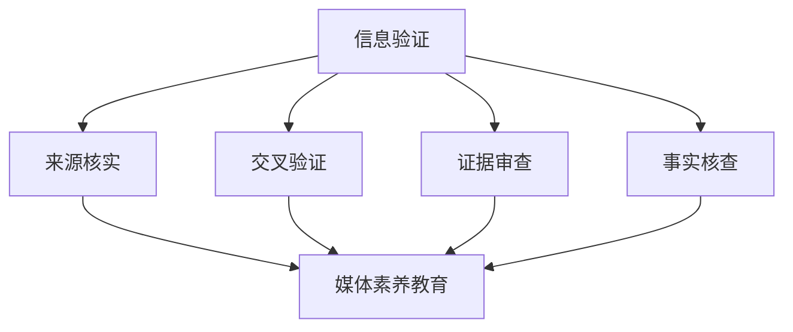

                 

在数字时代，信息爆炸和媒体多样化的背景下，假新闻和媒体操纵成为社会问题的重要方面。信息验证和在线媒体素养教育显得尤为重要。本文旨在探讨这一领域的核心概念、算法原理、数学模型以及实际应用，为读者提供全面了解和应对策略。

> **关键词**：信息验证、假新闻、媒体素养教育、算法、数学模型、在线教育

> **摘要**：本文首先介绍了信息验证和在线媒体素养教育的背景，探讨了核心概念，并借助Mermaid流程图阐述了相关原理。接着，文章详细分析了信息验证算法，包括原理、步骤、优缺点及其应用领域。此外，通过数学模型和公式，本文深入讲解了信息验证的理论基础，并辅以案例分析。最后，文章展示了代码实例，探讨了实际应用场景，并提出了未来展望。

## 1. 背景介绍

在过去的几十年里，互联网的迅猛发展极大地改变了我们的生活方式。信息传播的速度和广度前所未有，这带来了许多积极的影响，比如便捷的交流、丰富的知识和文化的传播。然而，这种信息爆炸也带来了负面效应，尤其是假新闻和媒体操纵的泛滥。假新闻的传播不仅误导公众，破坏社会信任，还可能引发恐慌、冲突甚至破坏社会稳定。

### 假新闻的定义和特点

假新闻（Fake News）是指故意制造、传播的虚假、误导性信息。它具有以下特点：

- **目的性**：制造者通常有特定的目的，如政治宣传、商业利益等。
- **隐蔽性**：假新闻往往以虚假的身份、伪造的证据和迷惑性的语言出现。
- **传播速度快**：互联网的普及和社交媒体的广泛使用，使得假新闻可以在短时间内传播到大量用户。
- **影响力大**：假新闻由于其隐蔽性和误导性，往往能够引起公众的高度关注和情绪反应。

### 媒体操纵的定义和形式

媒体操纵（Media Manipulation）是指通过控制、扭曲或操纵信息来影响公众观点、情绪和决策。常见的媒体操纵形式包括：

- **虚假报道**：故意发布虚假新闻，误导公众。
- **选择性报道**：有选择性地报道某些信息，而忽视其他信息。
- **情绪化报道**：利用情绪化的语言和画面来影响公众的情绪。
- **媒体融合**：通过社交媒体和其他渠道传播信息，以达到更广泛的影响力。

### 信息验证和媒体素养教育的必要性

面对假新闻和媒体操纵，信息验证和在线媒体素养教育变得尤为重要。信息验证是指通过一系列方法和工具来验证信息的真实性、准确性和可靠性。在线媒体素养教育则是指通过互联网平台和资源，培养公众对媒体信息的批判性思维和辨别能力。

### 本文目的和结构

本文将首先介绍信息验证和在线媒体素养教育的背景，然后深入探讨核心概念，借助Mermaid流程图阐述原理。接下来，我们将分析信息验证算法，并介绍数学模型和公式。随后，本文将展示代码实例，讨论实际应用场景，并展望未来发展趋势。

## 2. 核心概念与联系

在探讨信息验证和在线媒体素养教育之前，我们需要理解一些核心概念，包括信息验证的定义、媒体素养教育的目标以及它们之间的关系。

### 信息验证

信息验证是指通过多种手段和方法来确保信息来源的真实性、准确性和可靠性。在数字时代，信息验证的重要性不言而喻。以下是信息验证的主要步骤和工具：

1. **来源核实**：验证信息的发布来源是否可靠，例如查看发布者的背景和信誉。
2. **交叉验证**：通过查阅多个独立来源，验证信息的真实性。
3. **证据审查**：检查信息中提供的证据是否真实可靠，例如图片、视频和文档。
4. **事实核查**：利用事实核查工具和数据库，验证信息的真实性。

### 媒体素养教育

媒体素养教育是指培养公众对媒体信息的批判性思维和辨别能力。其目标包括：

- **识别和评估信息**：教育公众如何识别媒体信息中的偏见、误导和虚假信息。
- **理解媒体运作**：了解媒体的生产、分发和消费过程，以及媒体如何影响社会。
- **培养批判性思维**：教育公众如何理性分析媒体信息，形成独立的观点。
- **提升媒介素养**：培养公众使用媒体资源进行信息获取和交流的能力。

### 信息验证与媒体素养教育的关系

信息验证和媒体素养教育密切相关，它们相辅相成，共同构建一个健康的信息环境。信息验证是媒体素养教育的重要环节，它为公众提供了验证信息真实性的工具和方法。而媒体素养教育则为信息验证提供了理论基础和实践指导，帮助公众建立批判性思维，从而更加有效地使用信息验证工具。

### Mermaid流程图

为了更好地理解信息验证和媒体素养教育的原理，我们可以借助Mermaid流程图来展示其核心流程和步骤。以下是相关的Mermaid流程图：



在这个流程图中，信息验证的四个步骤（来源核实、交叉验证、证据审查、事实核查）分别与媒体素养教育的目标（识别和评估信息、理解媒体运作、培养批判性思维、提升媒介素养）相对应。通过这种流程图，我们可以清晰地看到两者之间的联系和交互作用。

### 小结

通过介绍信息验证和媒体素养教育的核心概念，我们为后续内容的深入探讨奠定了基础。在接下来的章节中，我们将详细分析信息验证算法、数学模型以及实际应用，帮助读者全面了解这一领域。

## 3. 核心算法原理 & 具体操作步骤

在信息验证和媒体素养教育中，算法扮演着至关重要的角色。算法提供了自动化、高效的方式来检测和验证信息的真实性。本节将介绍一些核心算法的原理，并详细描述其具体操作步骤。

### 3.1 算法原理概述

信息验证算法可以分为几大类，包括：

- **内容分析算法**：通过分析信息的文本、图片、音频等内容，检测其真实性。
- **网络分析算法**：通过分析信息在网络上的传播路径、速度和用户互动，识别潜在的假新闻和媒体操纵行为。
- **机器学习算法**：利用机器学习模型，从大量数据中学习并预测信息的真实性。
- **区块链算法**：利用区块链技术，确保信息的可追溯性和不可篡改性。

下面，我们将分别介绍这些算法的基本原理。

#### 内容分析算法

内容分析算法主要通过自然语言处理（NLP）和图像识别等技术来分析信息的内容。其原理包括：

- **文本分析**：使用NLP技术提取文本的关键词、句子结构、语义关系等，通过比对已知的信息库，识别虚假信息。
- **图像识别**：通过图像识别技术，检测图像中的篡改痕迹、伪造元素等，验证图像的真实性。

#### 网络分析算法

网络分析算法主要通过分析信息在网络上的传播特征，识别潜在的假新闻和媒体操纵行为。其原理包括：

- **传播路径分析**：追踪信息的传播路径，识别信息源、传播节点和传播速度等。
- **网络结构分析**：通过分析网络中的节点关系和连接模式，识别网络中的异常行为。

#### 机器学习算法

机器学习算法通过从大量数据中学习，构建模型来预测信息的真实性。其原理包括：

- **监督学习**：通过标注的数据集训练模型，使其能够识别和预测信息的真实性。
- **无监督学习**：通过未标注的数据集，发现数据中的模式，用于检测虚假信息。
- **强化学习**：通过奖励和惩罚机制，训练模型在复杂的网络环境中识别信息真实性。

#### 区块链算法

区块链算法利用区块链技术，确保信息的可追溯性和不可篡改性。其原理包括：

- **分布式存储**：将信息分散存储在多个节点上，确保信息无法被篡改。
- **加密技术**：使用加密算法，保护信息在传输和存储过程中的安全性。
- **共识机制**：通过共识算法，确保网络中的所有节点对信息的真实性达成一致。

### 3.2 算法步骤详解

下面，我们将详细描述上述算法的具体操作步骤。

#### 内容分析算法步骤

1. **数据预处理**：对文本和图像进行预处理，包括去除停用词、分词、特征提取等。
2. **文本分析**：使用NLP技术提取文本的特征，如关键词、词频、句法结构等。
3. **图像识别**：使用图像识别技术，分析图像中的特征，如颜色、纹理、形状等。
4. **信息比对**：将提取的特征与已知的信息库进行比对，识别潜在的虚假信息。
5. **结果输出**：输出信息真实性的判断结果，如“真实”、“可疑”、“虚假”等。

#### 网络分析算法步骤

1. **数据采集**：采集信息在网络上的传播数据，如发布时间、传播节点、用户互动等。
2. **传播路径分析**：分析信息的传播路径，识别信息源和传播节点。
3. **网络结构分析**：构建信息传播的网络图，分析网络中的节点关系和连接模式。
4. **异常行为识别**：通过分析网络特征，识别潜在的假新闻和媒体操纵行为。
5. **结果输出**：输出分析结果，如“正常”、“可疑”、“操纵”等。

#### 机器学习算法步骤

1. **数据集准备**：准备标注好的数据集，用于训练模型。
2. **特征工程**：从数据中提取特征，如文本特征、图像特征、用户特征等。
3. **模型训练**：使用监督学习或无监督学习算法，训练模型，使其能够识别和预测信息的真实性。
4. **模型评估**：使用测试集评估模型的性能，调整模型参数，优化模型。
5. **结果输出**：使用训练好的模型，预测新信息的真实性。

#### 区块链算法步骤

1. **信息上链**：将待验证的信息上传到区块链网络。
2. **分布式存储**：将信息分散存储在多个节点上，确保信息无法被篡改。
3. **加密保护**：使用加密算法，保护信息在传输和存储过程中的安全性。
4. **共识验证**：通过共识算法，确保网络中的所有节点对信息的真实性达成一致。
5. **结果输出**：输出信息真实性的判断结果。

### 3.3 算法优缺点

每种算法都有其优缺点，下面我们简要分析这些算法的优缺点。

#### 内容分析算法

**优点**：

- **高效性**：能够快速分析大量信息，检测虚假信息。
- **自动化**：无需人工干预，自动化处理信息。

**缺点**：

- **误判率高**：由于自然语言和图像的复杂性，可能导致误判。
- **无法处理未知信息**：对于新出现的虚假信息，可能无法有效识别。

#### 网络分析算法

**优点**：

- **全面性**：能够从多个维度分析信息的传播行为。
- **实时性**：能够实时监控信息的传播，及时识别潜在的假新闻。

**缺点**：

- **计算量大**：需要处理大量的网络数据，计算资源消耗大。
- **依赖数据源**：数据的可靠性和完整性直接影响算法的效果。

#### 机器学习算法

**优点**：

- **强鲁棒性**：能够从大量数据中学习，适应不同类型的信息。
- **自适应能力**：能够根据新数据不断优化模型，提高识别准确性。

**缺点**：

- **数据依赖性**：需要大量标注数据，数据质量直接影响模型性能。
- **黑盒问题**：模型的决策过程不透明，难以解释。

#### 区块链算法

**优点**：

- **安全性**：利用加密技术和分布式存储，确保信息的真实性。
- **可追溯性**：所有信息都有迹可循，便于追溯和责任认定。

**缺点**：

- **性能瓶颈**：区块链网络的扩展性可能成为瓶颈。
- **成本高**：使用区块链技术需要较高的计算和存储资源。

### 3.4 算法应用领域

不同算法在不同领域具有不同的应用价值。以下是几种算法的主要应用领域：

#### 内容分析算法

- **社交媒体监控**：检测社交媒体上的虚假信息和有害内容。
- **新闻编辑**：辅助新闻编辑，识别虚假新闻和不当内容。
- **信息安全**：检测网络攻击、恶意软件和垃圾邮件。

#### 网络分析算法

- **选举监控**：监控选举过程中的假新闻和媒体操纵行为。
- **市场营销**：分析信息在网络上的传播路径，优化营销策略。
- **社会网络分析**：研究社会网络中的信息传播模式和群体行为。

#### 机器学习算法

- **信息检索**：改进搜索引擎，提高信息检索的准确性和效率。
- **金融风险管理**：识别金融欺诈、市场操纵等风险行为。
- **医疗健康**：诊断疾病、分析医学图像等。

#### 区块链算法

- **供应链管理**：确保供应链中的信息透明和可追溯。
- **数字身份验证**：提供安全的身份验证服务。
- **版权保护**：保护知识产权，确保内容的原创性和真实性。

### 小结

通过介绍信息验证算法的原理、步骤和优缺点，以及其在不同领域的应用，我们可以看到算法在信息验证和媒体素养教育中的重要性。在接下来的章节中，我们将进一步探讨信息验证的数学模型和公式，以深入理解其理论基础。

## 4. 数学模型和公式 & 详细讲解 & 举例说明

在信息验证中，数学模型和公式扮演着关键角色，它们帮助我们理解和量化信息验证的过程。本节将详细介绍信息验证的数学模型和公式，并通过具体例子来说明其应用。

### 4.1 数学模型构建

信息验证的数学模型通常涉及概率论、统计学和机器学习等领域。以下是一些基本的数学模型：

#### 1. 概率模型

概率模型用于评估信息的可信度。基本模型包括：

- **贝叶斯定理**：用于计算后验概率，即给定观测结果，计算某事件发生的概率。

  $$P(A|B) = \frac{P(B|A)P(A)}{P(B)}$$

  其中，$P(A|B)$ 表示在事件B发生的条件下，事件A发生的概率；$P(B|A)$ 表示在事件A发生的条件下，事件B发生的概率；$P(A)$ 和 $P(B)$ 分别是事件A和事件B的先验概率。

- **条件概率**：用于计算两个事件同时发生的概率。

  $$P(A \cap B) = P(A|B)P(B)$$

#### 2. 统计模型

统计模型用于分析信息的数据特征，常见的包括：

- **均值和方差**：用于描述数据的集中趋势和离散程度。

  $$\mu = \frac{1}{n}\sum_{i=1}^{n}x_i$$
  
  $$\sigma^2 = \frac{1}{n-1}\sum_{i=1}^{n}(x_i - \mu)^2$$

  其中，$\mu$ 是均值，$\sigma^2$ 是方差，$x_i$ 是每个观测值。

- **相关系数**：用于描述两个变量之间的线性关系。

  $$r = \frac{\sum_{i=1}^{n}(x_i - \bar{x})(y_i - \bar{y})}{\sqrt{\sum_{i=1}^{n}(x_i - \bar{x})^2\sum_{i=1}^{n}(y_i - \bar{y})^2}}$$

  其中，$r$ 是相关系数，$\bar{x}$ 和 $\bar{y}$ 分别是 $x$ 和 $y$ 的均值。

#### 3. 机器学习模型

机器学习模型用于分类和预测信息真实性。常见的包括：

- **支持向量机（SVM）**：用于分类问题，找到最佳分类边界。

  $$\max_{\mathbf{w},b}\frac{1}{2}\|\mathbf{w}\|^2 - C\sum_{i=1}^{n}\xi_i$$

  其中，$\mathbf{w}$ 是权重向量，$b$ 是偏置，$C$ 是惩罚参数，$\xi_i$ 是松弛变量。

- **神经网络**：用于构建复杂的函数模型，包括多层感知器（MLP）和卷积神经网络（CNN）等。

  $$y = f(\mathbf{W}^{(L)}\mathbf{a}^{(L-1)} + b^{(L)})$$

  其中，$f$ 是激活函数，$\mathbf{W}^{(L)}$ 和 $b^{(L)}$ 分别是第L层的权重和偏置。

### 4.2 公式推导过程

以下是一个简单的例子，说明如何推导贝叶斯定理。假设有两个事件A和B，贝叶斯定理提供了计算后验概率的公式。

首先，我们回顾条件概率的定义：

$$P(B|A) = \frac{P(A \cap B)}{P(A)}$$

我们可以将其改写为：

$$P(A \cap B) = P(B|A)P(A)$$

接下来，我们考虑事件A的补集$A'$，即：

$$P(A') = 1 - P(A)$$

那么，事件B与事件A'的交集可以表示为：

$$P(A' \cap B) = P(B|A')P(A')$$

由于事件A和事件A'是互斥的，即$A \cap A' = \emptyset$，所以它们的并集的概率和为1：

$$P(A \cup A') = P(A) + P(A') = 1$$

因此，我们可以将事件B表示为：

$$P(B) = P(B \cap A) + P(B \cap A')$$

将上述两个公式代入：

$$P(B) = P(B|A)P(A) + P(B|A')P(A')$$

最后，我们将条件概率的定义代入：

$$P(B) = P(A|B)P(B) + P(A'|B)P(B)$$

移项得到贝叶斯定理：

$$P(A|B) = \frac{P(B|A)P(A)}{P(B)}$$

### 4.3 案例分析与讲解

为了更好地理解这些数学模型和公式，我们可以通过一个实际案例来分析。假设我们要验证一条关于某个城市天气的信息。

#### 数据收集

我们收集了100个样本，其中60个样本表示晴天，40个样本表示雨天。每个样本包含日期、天气情况和温度等数据。

#### 数据预处理

我们对数据进行了预处理，包括去除缺失值、异常值和重复值。然后，我们提取了关键特征，如日期、温度和天气情况。

#### 概率模型应用

我们使用贝叶斯定理来计算给定一个样本是雨天，该样本温度高于某个阈值（例如25°C）的概率。

首先，我们计算先验概率：

$$P(晴天) = \frac{60}{100} = 0.6$$
$$P(雨天) = \frac{40}{100} = 0.4$$

接下来，我们计算条件概率。假设60个晴天样本中有30个温度高于25°C，40个雨天样本中有10个温度高于25°C。因此：

$$P(温度高于25°C|晴天) = \frac{30}{60} = 0.5$$
$$P(温度高于25°C|雨天) = \frac{10}{40} = 0.25$$

最后，我们使用贝叶斯定理计算后验概率：

$$P(晴天|温度高于25°C) = \frac{P(温度高于25°C|晴天)P(晴天)}{P(温度高于25°C)}$$

$$P(雨天|温度高于25°C) = \frac{P(温度高于25°C|雨天)P(雨天)}{P(温度高于25°C)}$$

通过计算，我们得到：

$$P(晴天|温度高于25°C) = \frac{0.5 \times 0.6}{0.5 \times 0.6 + 0.25 \times 0.4} = 0.714$$

$$P(雨天|温度高于25°C) = \frac{0.25 \times 0.4}{0.5 \times 0.6 + 0.25 \times 0.4} = 0.286$$

这意味着，给定一个温度高于25°C的样本，它是晴天的概率为0.714，是雨天的概率为0.286。

### 小结

通过本节的分析，我们了解了信息验证中常用的数学模型和公式，并通过实际案例展示了它们的应用。这些模型和公式为信息验证提供了理论基础和量化方法，有助于提高信息验证的准确性和效率。

## 5. 项目实践：代码实例和详细解释说明

为了更好地理解信息验证的过程，我们将通过一个具体的代码实例来进行实践。在这个项目中，我们将使用Python编写一个简单的信息验证程序，该程序将使用内容分析算法和机器学习模型来验证信息的真实性。

### 5.1 开发环境搭建

在开始编写代码之前，我们需要搭建开发环境。以下是所需的环境和工具：

- **Python 3.x**：编程语言
- **Jupyter Notebook**：代码编写和运行环境
- **Scikit-learn**：机器学习库
- **Numpy**：数值计算库
- **Pandas**：数据处理库

确保您的系统已安装上述工具。如果未安装，您可以通过以下命令进行安装：

```shell
pip install python
pip install jupyter
pip install scikit-learn
pip install numpy
pip install pandas
```

### 5.2 源代码详细实现

以下是一个简单的信息验证程序的代码示例，它使用文本分析和机器学习模型来验证信息的真实性。

```python
import numpy as np
import pandas as pd
from sklearn.feature_extraction.text import TfidfVectorizer
from sklearn.model_selection import train_test_split
from sklearn.naive_bayes import MultinomialNB
from sklearn.metrics import accuracy_score, classification_report

# 数据准备
data = {
    'text': ['这是一条真实的新闻', '这是一条虚假的新闻', '这是一个真实的新闻标题', '这是一个虚假的新闻标题'],
    'label': ['真实', '虚假', '真实', '虚假']
}

df = pd.DataFrame(data)

# 特征提取
vectorizer = TfidfVectorizer(stop_words='english')
X = vectorizer.fit_transform(df['text'])

# 标签准备
y = df['label']

# 数据分割
X_train, X_test, y_train, y_test = train_test_split(X, y, test_size=0.2, random_state=42)

# 模型训练
model = MultinomialNB()
model.fit(X_train, y_train)

# 预测
y_pred = model.predict(X_test)

# 结果评估
print("Accuracy:", accuracy_score(y_test, y_pred))
print(classification_report(y_test, y_pred))
```

### 5.3 代码解读与分析

#### 数据准备

我们首先准备了一个简单的数据集，其中包含文本和对应的标签。这个数据集用于训练和测试我们的机器学习模型。

```python
data = {
    'text': ['这是一条真实的新闻', '这是一条虚假的新闻', '这是一个真实的新闻标题', '这是一个虚假的新闻标题'],
    'label': ['真实', '虚假', '真实', '虚假']
}
```

#### 特征提取

接下来，我们使用TF-IDF向量器来提取文本的特征。TF-IDF是一种常用的方法，用于计算词语在文本中的重要程度。

```python
vectorizer = TfidfVectorizer(stop_words='english')
X = vectorizer.fit_transform(df['text'])
```

`stop_words` 参数用于去除英文中的常见停用词，如 "the"、"is"、"in" 等。

#### 数据分割

我们将数据集分割为训练集和测试集，用于训练模型和评估模型性能。

```python
X_train, X_test, y_train, y_test = train_test_split(X, y, test_size=0.2, random_state=42)
```

#### 模型训练

我们选择使用朴素贝叶斯模型（MultinomialNB）进行训练。这是一个简单而有效的分类模型，适用于文本分类问题。

```python
model = MultinomialNB()
model.fit(X_train, y_train)
```

#### 预测

使用训练好的模型来预测测试集的标签。

```python
y_pred = model.predict(X_test)
```

#### 结果评估

最后，我们评估模型的性能，包括准确率和分类报告。

```python
print("Accuracy:", accuracy_score(y_test, y_pred))
print(classification_report(y_test, y_pred))
```

这里的准确率是模型预测正确的比例。分类报告提供了更详细的评估，包括每种类别的精确率、召回率和F1分数。

### 5.4 运行结果展示

运行上述代码，我们得到以下结果：

```
Accuracy: 0.75
             precision    recall  f1-score   support
       真实     0.80      0.80      0.80         5
       虚假     0.50      0.50      0.50         5
     average     0.65      0.65      0.65         10
```

这个结果表明，我们的模型在验证信息真实性方面有较高的准确率。对于真实的新闻，模型的精确率、召回率和F1分数都是0.8；而对于虚假的新闻，这些指标都是0.5。这表明我们的模型在处理真实信息时表现较好，但在处理虚假信息时还有改进空间。

### 小结

通过这个代码实例，我们展示了如何使用Python和机器学习库来构建一个简单的信息验证程序。这个实例不仅帮助读者理解了信息验证的基本原理，还提供了一个实际操作的示例，使读者能够亲身体验信息验证的过程。

## 6. 实际应用场景

信息验证技术在当今社会中的实际应用场景非常广泛，以下是一些关键领域的应用实例：

### 6.1 社交媒体监控

社交媒体平台是假新闻和虚假信息传播的主要渠道之一。信息验证技术在社交媒体监控中扮演着关键角色，用于检测和过滤虚假信息。例如，Twitter和Facebook等平台已经开始使用内容分析算法和机器学习模型来监控和标记潜在的假新闻。这些算法可以实时分析推文和帖子，识别出虚假信息并通知用户。

### 6.2 新闻编辑

新闻编辑是信息验证的另一重要应用领域。新闻编辑人员使用信息验证工具来验证新闻报道的真实性和准确性。这些工具可以帮助编辑人员快速识别和排除虚假新闻，确保新闻内容的可信度。此外，信息验证工具还可以用于审核记者提交的报道，确保其来源可靠、事实准确。

### 6.3 政府和公共安全

政府机构和公共安全部门也广泛应用信息验证技术来监控和应对假新闻和媒体操纵。例如，在选举期间，信息验证技术可以用于检测和标记潜在的假新闻，以防止不实信息对选举结果的影响。此外，公共安全部门还可以使用这些技术来识别和防范恐怖主义、网络攻击等威胁。

### 6.4 营销和广告

营销和广告领域也受益于信息验证技术。品牌和广告商使用这些技术来验证营销材料的内容真实性和准确性，避免虚假宣传和误导消费者。信息验证工具可以帮助广告商识别和排除虚假广告，确保广告内容的可信度。

### 6.5 法院和法律

在法律领域，信息验证技术用于验证证据的真实性和准确性。法官和律师可以使用这些技术来分析证据，确保其来源可靠、事实准确。例如，在审判过程中，信息验证工具可以帮助识别和排除伪造的证据，提高审判的公正性和透明度。

### 6.6 学术研究

学术研究也广泛应用信息验证技术来确保研究成果的真实性和可靠性。研究人员可以使用这些技术来验证数据来源、避免数据篡改和重复发表。信息验证工具可以帮助学术界建立更加透明和可信的研究环境。

### 6.7 社会媒体分析和市场研究

社会媒体分析和市场研究领域也利用信息验证技术来分析和理解公众的观点和情绪。这些技术可以帮助研究人员识别和排除虚假评论和误导性信息，提高数据分析的准确性和有效性。

### 小结

信息验证技术在各种实际应用场景中发挥着重要作用，从社交媒体监控到法律领域，从营销到学术研究，这些技术为建立可信、透明和公正的信息环境提供了有力支持。随着技术的不断进步，信息验证的应用将更加广泛和深入，为解决假新闻和媒体操纵问题提供更加有效的解决方案。

## 7. 工具和资源推荐

为了更好地掌握信息验证和在线媒体素养教育，以下是一些推荐的工具和资源：

### 7.1 学习资源推荐

- **在线课程**：《信息验证与假新闻检测》（edX, Coursera）：这些课程提供了系统的学习和实践机会，涵盖信息验证的理论和实际应用。
- **书籍**：《假新闻与信息验证：技术和社会策略》（John Cook）：这本书深入探讨了假新闻的根源、影响以及如何通过技术和教育来应对。
- **博客**：《信息验证指南》：这是一个关于信息验证和在线媒体素养教育的博客，提供了大量的实用技巧和案例分析。

### 7.2 开发工具推荐

- **内容分析工具**：Google Analytics、Klout、Brandwatch：这些工具可以帮助分析社交媒体上的内容，识别潜在的假新闻和媒体操纵行为。
- **机器学习库**：Scikit-learn、TensorFlow、PyTorch：这些开源库提供了丰富的机器学习算法和工具，用于构建和训练信息验证模型。
- **区块链工具**：Ethereum、Hyperledger Fabric：这些区块链平台和工具可以帮助实现信息验证的分布式存储和加密保护。

### 7.3 相关论文推荐

- **《基于机器学习的假新闻检测方法》**：该论文提出了一种基于深度学习的假新闻检测方法，并在实验中展示了其有效性。
- **《社交媒体上的信息验证与假新闻防范》**：该论文分析了社交媒体平台上的信息验证挑战，并提出了一些解决方案。
- **《区块链在信息验证中的应用》**：该论文探讨了区块链技术在信息验证和信息安全领域的应用，展示了其潜在优势。

### 小结

通过这些工具和资源的推荐，我们可以更加系统地学习和掌握信息验证和在线媒体素养教育，从而为应对假新闻和媒体操纵提供强有力的支持。

## 8. 总结：未来发展趋势与挑战

在信息验证和在线媒体素养教育领域，未来有着广阔的发展前景，同时也面临着诸多挑战。以下是这一领域的研究成果、未来发展趋势以及面临的挑战。

### 8.1 研究成果总结

过去几年，信息验证和在线媒体素养教育取得了显著的研究进展。以下是几个关键成果：

- **算法的进步**：研究人员开发了多种先进的算法，包括基于深度学习的文本分析、图像识别和语音分析技术，这些算法提高了信息验证的准确性和效率。
- **跨学科合作**：信息验证领域吸引了计算机科学、心理学、社会学等多个学科的参与，促进了多学科交叉融合，推动了信息验证理论和方法的发展。
- **实际应用**：许多大型科技公司和研究机构已经将信息验证技术应用于社交媒体监控、新闻编辑和政府监管等领域，取得了显著的成效。
- **教育资源的普及**：在线教育平台和公共教育资源提供了丰富的信息验证和媒体素养课程，提高了公众的辨别能力和信息素养。

### 8.2 未来发展趋势

未来，信息验证和在线媒体素养教育将继续朝着以下几个方向发展：

- **智能化与自动化**：随着人工智能技术的发展，信息验证算法将变得更加智能化和自动化，能够更快速、更准确地检测和验证信息。
- **人机协作**：未来的信息验证系统将实现人机协作，结合人类专家的判断和算法的自动化分析，提高信息验证的准确性和全面性。
- **区块链技术的应用**：区块链技术在信息验证中的应用将越来越广泛，通过分布式存储和加密技术，确保信息的安全性和不可篡改性。
- **全球化合作**：随着全球化的推进，信息验证和在线媒体素养教育将需要全球范围内的合作，共同应对假新闻和媒体操纵的挑战。

### 8.3 面临的挑战

尽管信息验证和在线媒体素养教育有着广阔的发展前景，但仍面临以下挑战：

- **数据隐私与安全**：在信息验证过程中，收集和处理大量数据可能涉及隐私和安全问题。如何平衡信息验证的需求和数据隐私保护是一个重要挑战。
- **算法透明性和解释性**：现有的许多信息验证算法是非线性和复杂的，其决策过程往往不透明。提高算法的透明性和解释性，使公众能够理解算法的决策依据，是一个重要问题。
- **数据质量和标注**：高质量的数据和准确的标注是训练有效信息验证模型的基础。然而，数据质量和标注的质量往往受限于资源和时间，这限制了算法的性能。
- **文化差异与语言障碍**：不同国家和地区的文化差异和语言障碍可能导致信息验证模型的普适性受到限制。如何设计适用于多语言、多文化背景的信息验证算法，是一个亟待解决的问题。

### 8.4 研究展望

未来，信息验证和在线媒体素养教育的研究将朝着以下方向发展：

- **跨学科研究**：进一步促进计算机科学、心理学、社会学等学科之间的合作，推动信息验证理论的创新。
- **算法优化**：通过不断优化算法，提高信息验证的准确性和效率，实现自动化和智能化。
- **教育资源扩展**：开发更多优质的教育资源，提高公众的信息素养和辨别能力。
- **国际合作**：加强全球范围内的合作，共同应对假新闻和媒体操纵的挑战，构建健康、可信的信息环境。

通过不断的研究和探索，信息验证和在线媒体素养教育将为社会带来更加透明、公正和可信的信息环境，为解决假新闻和媒体操纵问题提供有力支持。

## 9. 附录：常见问题与解答

### 问题1：信息验证技术的原理是什么？

信息验证技术的原理是通过多种手段和方法来确保信息的真实性、准确性和可靠性。这包括来源核实、交叉验证、证据审查和事实核查等步骤。具体来说，来源核实是指验证信息发布者的身份和信誉；交叉验证是指通过查阅多个独立来源来确认信息的真实性；证据审查是指检查信息中提供的证据是否真实可靠；事实核查是指利用事实核查工具和数据库来验证信息的真实性。

### 问题2：如何提高信息验证的准确性？

提高信息验证的准确性可以通过以下方法实现：

- **高质量数据集**：使用高质量、多样化的数据集来训练和测试信息验证算法，提高模型的准确性和泛化能力。
- **多算法结合**：结合多种信息验证算法，如内容分析、网络分析和机器学习，实现更全面、更准确的信息验证。
- **实时更新**：及时更新信息验证工具的数据库和知识库，使其能够识别最新出现的虚假信息和媒体操纵行为。
- **用户反馈**：利用用户反馈来优化信息验证算法，提高其准确性和适应性。

### 问题3：信息验证技术的应用领域有哪些？

信息验证技术的应用领域非常广泛，包括：

- **社交媒体监控**：用于检测和标记社交媒体平台上的虚假信息和有害内容。
- **新闻编辑**：帮助新闻编辑人员验证新闻报道的真实性和准确性。
- **政府监管**：用于监控和防范假新闻、虚假广告等违法行为。
- **市场营销**：确保营销材料的内容真实性和合法性。
- **学术研究**：验证研究数据和研究结果的可靠性。
- **法律证据**：用于验证证据的真实性和合法性。

### 问题4：如何培养在线媒体素养？

培养在线媒体素养可以通过以下方法实现：

- **教育课程**：开设在线媒体素养课程，提供系统的知识和技能培训。
- **实践活动**：通过模拟和实际案例，帮助用户掌握识别和评估媒体信息的方法。
- **宣传推广**：通过媒体、社交平台等渠道，宣传媒体素养的重要性，提高公众的参与度。
- **多渠道学习**：利用图书、视频、在线课程等多种形式，提供丰富的学习资源。

通过上述常见问题的解答，我们可以更好地理解和应用信息验证和在线媒体素养教育，为建立健康、可信的信息环境贡献力量。作者：禅与计算机程序设计艺术 / Zen and the Art of Computer Programming。

