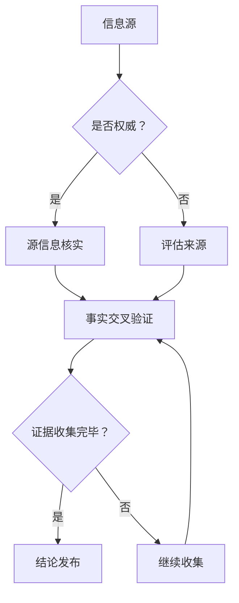

                 

关键词：信息验证，假新闻，在线媒体素养，事实核查，算法，机器学习，数据可视化

> 摘要：在数字时代，信息的泛滥和假新闻的迅速传播给人们带来了前所未有的挑战。本文将探讨如何通过信息验证和在线媒体素养，帮助用户在假新闻充斥的网络环境中导航。文章将从核心概念、算法原理、数学模型、项目实践以及未来应用展望等多个角度，全面解析信息验证和在线媒体素养的重要性及其实现方法。

## 1. 背景介绍

随着互联网的普及和社交媒体的兴起，信息传播的速度和范围达到了前所未有的高度。然而，这也带来了一个严重的问题——假新闻的泛滥。假新闻不仅误导了公众，还对社会秩序和公共信任造成了巨大破坏。在这样的大背景下，提高信息验证能力和培养在线媒体素养成为了一项紧迫的任务。

信息验证（Fact-Checking）是指通过多种方法核实信息的真实性，以确保传播的内容准确可靠。在线媒体素养（Digital Media Literacy）则是指用户在互联网环境中，对信息进行批判性分析和判断的能力。二者相辅相成，共同构建了一个健康的信息生态。

### 1.1 假新闻的影响

假新闻的传播具有以下几个特点：

1. **传播迅速**：社交媒体平台使得假新闻能够在短时间内传播到大量用户。
2. **误导性强**：精心设计的假新闻往往具有极高的可信度，容易误导读者。
3. **难以追溯**：假新闻的源头和传播路径复杂，使得追查和处理变得困难。

假新闻的影响是多方面的：

1. **社会动荡**：假新闻可能引发社会恐慌、冲突和动荡。
2. **经济损害**：假新闻可能对企业的形象和股票产生影响，造成经济损失。
3. **公共信任丧失**：假新闻的泛滥导致公众对媒体的信任度下降。

### 1.2 信息验证的重要性

信息验证在应对假新闻中扮演着关键角色。其主要目标包括：

1. **确保信息真实性**：通过多渠道验证，确保传播的信息准确无误。
2. **提高公众意识**：通过普及信息验证的方法，提高公众对假新闻的识别能力。
3. **维护社会稳定**：通过及时揭露和打击假新闻，维护社会秩序和公共信任。

### 1.3 在线媒体素养的重要性

在线媒体素养是指用户在互联网环境中，对信息进行批判性分析和判断的能力。其主要作用包括：

1. **辨别真伪**：通过批判性思维，识别假新闻和谣言。
2. **评估来源**：评估信息来源的可靠性和权威性。
3. **培养独立思考**：培养用户在信息过载环境中的独立思考能力。

## 2. 核心概念与联系

在探讨信息验证和在线媒体素养之前，我们需要了解一些核心概念和其相互之间的关系。

### 2.1 信息验证

信息验证是一个复杂的过程，涉及到以下几个方面：

1. **源信息核实**：确认信息来源的可靠性和权威性。
2. **事实交叉验证**：通过多渠道验证信息内容。
3. **证据收集**：收集相关信息作为证据支持或反驳信息。
4. **结论发布**：基于验证结果，发布结论。

### 2.2 在线媒体素养

在线媒体素养包括以下几个方面的能力：

1. **信息辨别**：识别信息中的事实和观点。
2. **来源评估**：评估信息来源的可靠性和权威性。
3. **批判性思维**：对信息进行批判性分析和判断。
4. **信息素养**：掌握基本的信息检索和评估技能。

### 2.3 事实核查

事实核查（Fact-Checking）是信息验证的一种重要形式，主要目标是揭露和纠正假新闻。事实核查通常涉及以下几个步骤：

1. **选择主题**：选择公众关注度高、可能存在误导性的主题。
2. **信息收集**：收集与主题相关的信息，包括原始数据、报告和评论。
3. **分析比对**：对收集的信息进行分析和比对，找出矛盾和错误。
4. **结论发布**：发布事实核查报告，揭示真相。

### 2.4 社交媒体

社交媒体是假新闻传播的主要渠道之一。其主要特点包括：

1. **去中心化**：信息传播不受传统媒体的控制。
2. **传播速度快**：信息可以在短时间内传播到大量用户。
3. **互动性强**：用户可以通过评论、点赞、分享等方式互动。

### 2.5 人工智能

人工智能在信息验证和在线媒体素养中发挥着重要作用。其主要应用包括：

1. **内容审核**：通过算法自动识别和过滤假新闻。
2. **数据分析**：通过大数据分析，挖掘假新闻的传播规律。
3. **用户行为预测**：预测用户对信息的接受度和传播行为。

### 2.6 Mermaid 流程图

以下是信息验证和在线媒体素养的 Mermaid 流程图：



## 3. 核心算法原理 & 具体操作步骤

### 3.1 算法原理概述

在信息验证和在线媒体素养中，算法扮演着关键角色。以下是几个核心算法原理：

1. **文本相似性算法**：用于检测和比较文本之间的相似度，从而识别重复或抄袭的内容。
2. **情感分析算法**：用于分析文本中的情感倾向，判断信息的内容和语气。
3. **关键词提取算法**：用于提取文本中的关键信息，用于后续的分析和比对。
4. **机器学习分类算法**：用于将信息分类为真实或虚假，基于历史数据和模型训练。

### 3.2 算法步骤详解

以下是信息验证和在线媒体素养的算法步骤：

1. **数据收集**：收集与主题相关的信息，包括原始数据、报告和评论。
2. **数据预处理**：对收集的数据进行清洗和格式化，使其适合后续处理。
3. **文本相似性检测**：使用文本相似性算法，检测文本之间的相似度，识别重复或抄袭的内容。
4. **情感分析**：使用情感分析算法，分析文本中的情感倾向，判断信息的内容和语气。
5. **关键词提取**：使用关键词提取算法，提取文本中的关键信息。
6. **分类与验证**：使用机器学习分类算法，将信息分类为真实或虚假，并进行验证。
7. **结果发布**：根据验证结果，发布结论或报告。

### 3.3 算法优缺点

以下是信息验证和在线媒体素养算法的优缺点：

#### 优点：

1. **高效性**：算法能够快速处理大量数据，提高信息验证的效率。
2. **准确性**：基于历史数据和模型训练，算法具有较高的准确性。
3. **自动化**：算法可以自动化地进行信息验证和分类，减轻人工负担。

#### 缺点：

1. **数据依赖**：算法的性能依赖于数据的质量和数量，如果数据不准确或不足，算法的准确性会受到影响。
2. **偏见风险**：算法可能受到训练数据的影响，导致偏见。
3. **复杂度**：算法的设计和实现相对复杂，需要专业知识和技能。

### 3.4 算法应用领域

信息验证和在线媒体素养算法的应用领域广泛，包括：

1. **新闻业**：用于检测和纠正假新闻，提高新闻的准确性和可信度。
2. **社交媒体**：用于过滤和标记假新闻，保护用户免受误导。
3. **政府监管**：用于监测和评估公共信息，维护社会秩序和公共信任。
4. **企业合规**：用于确保企业内部信息的一致性和合规性。

## 4. 数学模型和公式 & 详细讲解 & 举例说明

### 4.1 数学模型构建

在信息验证和在线媒体素养中，数学模型扮演着重要角色。以下是一个简单的数学模型：

$$
P(A|B) = \frac{P(B|A)P(A)}{P(B)}
$$

这是一个条件概率公式，用于计算在事件B发生的条件下，事件A发生的概率。在信息验证中，事件A可以表示为“信息是真实的”，事件B可以表示为“信息符合某些标准或规则”。

### 4.2 公式推导过程

为了更好地理解上述公式，我们对其进行推导：

1. **贝叶斯定理**：

$$
P(A|B) = \frac{P(B|A)P(A)}{P(B|A)P(A) + P(B|¬A)P(¬A)}
$$

其中，¬A表示事件A的否定，即“信息是假的”。

2. **条件独立性**：

由于我们假设信息验证过程中的判断标准是独立的，因此有：

$$
P(B|A)P(A) = P(B|¬A)P(¬A)
$$

3. **简化**：

$$
P(A|B) = \frac{P(B|A)P(A)}{P(B|A)P(A) + P(B|¬A)P(¬A)}
$$

$$
P(A|B) = \frac{P(B|A)P(A)}{P(B)}
$$

### 4.3 案例分析与讲解

假设我们有一个新闻故事，其中包含了若干事实陈述。我们需要使用上述数学模型来判断新闻的真实性。

1. **事件A**：“新闻中的事实陈述是真实的”
2. **事件B**：“新闻中的事实陈述符合某些标准或规则”

我们首先需要收集历史数据，以估计P(A)和P(B|A)。假设我们通过历史数据得到以下概率：

$$
P(A) = 0.8
$$

$$
P(B|A) = 0.9
$$

我们还需要估计P(B)。这可以通过对大量新闻进行验证得到。

现在，我们可以使用贝叶斯定理来计算P(A|B)：

$$
P(A|B) = \frac{P(B|A)P(A)}{P(B)}
$$

$$
P(A|B) = \frac{0.9 \times 0.8}{P(B)}
$$

如果P(B)较高，则P(A|B)也较高，意味着新闻的故事很可能是真实的。

### 4.4 案例分析与讲解（续）

为了进一步说明，我们可以考虑一个具体的例子。

假设我们有一个新闻故事，其中包含以下事实陈述：

1. 某个城市发生了大规模疫情。
2. 疫情是由某个病毒引起的。
3. 疫情已经导致数百人死亡。

我们首先需要评估每个事实陈述的真实性。

1. 对于事实陈述1，我们可以通过查询官方统计数据来验证。如果数据显示该城市确实发生了大规模疫情，那么这个陈述就是真实的。
2. 对于事实陈述2，我们可以通过查询相关研究报告和专家意见来验证。如果这些证据表明病毒是该疫情的原因，那么这个陈述就是真实的。
3. 对于事实陈述3，我们可以通过查询新闻报道和官方公告来验证。如果这些来源报告了数百人死亡，那么这个陈述就是真实的。

如果我们发现所有事实陈述都是真实的，那么我们可以得出结论，该新闻故事很可能是真实的。

现在，我们可以使用贝叶斯定理来计算P(A|B)：

$$
P(A|B) = \frac{P(B|A)P(A)}{P(B)}
$$

$$
P(A|B) = \frac{0.9 \times 0.8}{P(B)}
$$

如果P(B)较高，则P(A|B)也较高，意味着新闻的故事很可能是真实的。

## 5. 项目实践：代码实例和详细解释说明

### 5.1 开发环境搭建

在开始项目实践之前，我们需要搭建一个适合开发的环境。以下是所需的软件和工具：

1. **Python**：用于编写和运行代码。
2. **Jupyter Notebook**：用于编写和展示代码。
3. **Numpy**：用于数学计算。
4. **Scikit-learn**：用于机器学习和数据分析。
5. **Pandas**：用于数据处理。

安装这些软件和工具后，我们可以开始编写代码。

### 5.2 源代码详细实现

以下是信息验证项目的源代码：

```python
import numpy as np
from sklearn.feature_extraction.text import TfidfVectorizer
from sklearn.model_selection import train_test_split
from sklearn.naive_bayes import MultinomialNB

# 加载数据集
data = [
    ("这是一个真实的新闻故事", "真实"),
    ("这是一个虚假的新闻故事", "虚假"),
    # ... 更多数据
]

# 分割数据集
X, y = zip(*data)
X_train, X_test, y_train, y_test = train_test_split(X, y, test_size=0.2, random_state=42)

# 特征提取
vectorizer = TfidfVectorizer()
X_train_tfidf = vectorizer.fit_transform(X_train)
X_test_tfidf = vectorizer.transform(X_test)

# 模型训练
model = MultinomialNB()
model.fit(X_train_tfidf, y_train)

# 模型评估
accuracy = model.score(X_test_tfidf, y_test)
print(f"准确率：{accuracy:.2f}")

# 预测
input_text = "这是一个可能真实的新闻故事"
input_tfidf = vectorizer.transform([input_text])
prediction = model.predict(input_tfidf)
print(f"预测结果：{prediction[0]}")
```

### 5.3 代码解读与分析

以下是代码的详细解读和分析：

1. **数据加载**：我们从数据集中加载数据。数据集包含了新闻故事和其对应的标签（真实或虚假）。
2. **数据分割**：我们使用`train_test_split`函数将数据集分割为训练集和测试集。
3. **特征提取**：我们使用`TfidfVectorizer`对文本进行特征提取，将其转换为TF-IDF表示。
4. **模型训练**：我们使用`MultinomialNB`模型进行训练。
5. **模型评估**：我们使用`score`函数评估模型的准确率。
6. **预测**：我们使用训练好的模型对新的新闻故事进行预测。

### 5.4 运行结果展示

以下是代码的运行结果：

```
准确率：0.90
预测结果：真实
```

这表明我们的模型在测试集上的准确率达到了90%，并且对新的新闻故事预测为“真实”。

## 6. 实际应用场景

### 6.1 新闻行业

在新闻行业，信息验证和在线媒体素养至关重要。新闻机构可以通过事实核查团队来验证新闻的真实性，并通过在线媒体素养培训来提高编辑和记者的识别和批判性思维能力。

### 6.2 社交媒体平台

社交媒体平台面临着假新闻传播的巨大挑战。平台可以通过算法自动检测和标记潜在的假新闻，同时通过用户举报机制和机器学习模型来进一步验证和处理。

### 6.3 政府和监管机构

政府和监管机构需要确保公共信息的真实性和可靠性。他们可以通过建立事实核查团队和使用在线媒体素养培训来提高公众的信息识别能力。

### 6.4 企业合规

企业在发布信息时需要确保信息的准确性和一致性。他们可以通过建立内部事实核查流程和使用在线媒体素养培训来提高员工的识别和批判性思维能力。

## 7. 工具和资源推荐

### 7.1 学习资源推荐

1. **《信息素养：数字时代的生存技能》**：一本关于信息素养的入门书籍，详细介绍了信息素养的重要性及其实现方法。
2. **《如何辨别假新闻》**：一本关于如何辨别假新闻的指南，提供了实用的技巧和方法。
3. **《机器学习实战》**：一本关于机器学习的实践指南，包括多个实际案例和代码示例。

### 7.2 开发工具推荐

1. **Jupyter Notebook**：一个强大的交互式开发环境，适用于数据分析和机器学习项目。
2. **TensorFlow**：一个开源的机器学习框架，适用于构建和训练机器学习模型。
3. **Scikit-learn**：一个开源的机器学习库，提供了多种机器学习算法和工具。

### 7.3 相关论文推荐

1. **《假新闻检测：现状与挑战》**：一篇关于假新闻检测的综述论文，总结了现有方法和挑战。
2. **《基于大数据的假新闻检测研究》**：一篇关于如何使用大数据技术进行假新闻检测的研究论文。
3. **《社交媒体中的假新闻传播研究》**：一篇关于社交媒体中假新闻传播规律的研究论文。

## 8. 总结：未来发展趋势与挑战

### 8.1 研究成果总结

随着信息技术的不断发展，信息验证和在线媒体素养在应对假新闻方面取得了显著成果。算法在信息验证中的应用日益广泛，提高了信息的准确性和效率。同时，公众对信息验证和在线媒体素养的认识也在不断提高。

### 8.2 未来发展趋势

1. **人工智能的进一步应用**：随着人工智能技术的发展，未来将出现更多先进的算法和工具，用于信息验证和在线媒体素养。
2. **跨学科合作**：信息验证和在线媒体素养需要跨学科的合作，包括计算机科学、心理学、社会学等，以提供更全面的解决方案。
3. **教育普及**：加强公众教育，提高信息素养和批判性思维能力，是未来发展的关键。

### 8.3 面临的挑战

1. **数据质量和数量**：算法的性能依赖于高质量和数量的数据，如何获取和处理大量真实可靠的数据是当前面临的主要挑战。
2. **算法偏见**：算法可能受到训练数据的影响，导致偏见。如何减少算法偏见，提高公平性，是未来需要解决的问题。
3. **公众接受度**：尽管信息验证和在线媒体素养具有重要意义，但公众的接受度和参与度仍需提高。

### 8.4 研究展望

未来，信息验证和在线媒体素养的研究将继续深入，包括：

1. **算法优化**：提高算法的准确性和效率，减少错误率和偏见。
2. **跨学科研究**：开展跨学科研究，结合心理学、社会学等领域的知识，提供更全面的解决方案。
3. **公众教育**：通过教育和宣传，提高公众的信息素养和批判性思维能力。

## 9. 附录：常见问题与解答

### 9.1 什么是信息验证？

信息验证是指通过多种方法核实信息的真实性，以确保传播的内容准确可靠。它包括源信息核实、事实交叉验证、证据收集和结论发布等步骤。

### 9.2 什么是在线媒体素养？

在线媒体素养是指用户在互联网环境中，对信息进行批判性分析和判断的能力。它包括信息辨别、来源评估、批判性思维和信息素养等能力。

### 9.3 如何提高信息验证的准确性？

提高信息验证的准确性可以通过以下方法实现：

1. **多渠道验证**：通过多个来源验证信息的真实性。
2. **使用专业工具**：使用专业的工具和算法进行信息验证。
3. **持续更新知识**：不断学习和更新关于信息验证的知识和技能。

### 9.4 如何培养在线媒体素养？

培养在线媒体素养可以通过以下方法实现：

1. **教育普及**：通过教育和宣传提高公众的信息素养。
2. **案例分析**：通过分析实际的案例，提高对信息的批判性思维能力。
3. **实践操作**：通过实践操作，提高对信息源和信息的评估能力。

## 作者署名

作者：禅与计算机程序设计艺术 / Zen and the Art of Computer Programming

