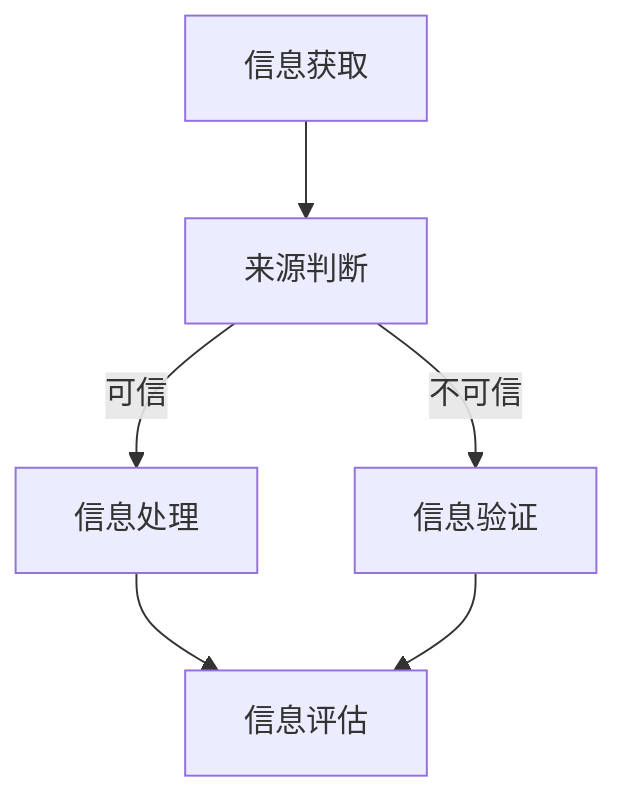

                 

关键词：信息验证、媒体素养、假新闻、媒体操纵、数字素养

摘要：随着互联网和社交媒体的迅速发展，假新闻和媒体操纵现象日益严重，给社会带来了巨大的负面影响。本文从技术角度出发，探讨了如何通过信息验证和媒体素养能力培养，为公众提供有效的防范手段，帮助公众应对假新闻和媒体操纵的挑战。

## 1. 背景介绍

近年来，假新闻（也称为虚假信息或假消息）和媒体操纵现象在全球范围内呈爆发式增长。假新闻通常是指那些未经证实或故意歪曲事实的消息，其传播速度之快、影响范围之广，使得公众在获取真实信息时面临巨大挑战。而媒体操纵则是指媒体机构或个人通过篡改、歪曲或掩盖事实，以达到某种特定目的的行为。

这种现象的背景主要源于以下几个方面：

1. **互联网和社交媒体的普及**：互联网和社交媒体的快速发展，使得信息的传播速度大大加快，同时也使得假新闻和媒体操纵的传播渠道更加广泛。
2. **信息过载**：随着信息的爆炸式增长，公众在获取和处理信息时，面临着巨大的压力，很容易被假新闻所迷惑。
3. **商业化驱动**：一些媒体机构或个人为了追求经济利益，不惜制造和传播假新闻，从而误导公众。
4. **技术挑战**：现有的技术手段在识别和过滤假新闻方面仍存在一定的局限性，这使得公众在面对假新闻时，难以进行有效的判断。

## 2. 核心概念与联系

### 2.1 信息验证

信息验证是指通过一系列的方法和工具，对获取的信息进行真实性和准确性的判断。在信息验证的过程中，需要考虑以下几个方面：

- **来源**：信息来源的可靠性。来源是否权威、可信，是判断信息真实性的重要依据。
- **证据**：是否有足够的证据支持信息的真实性。证据的充分性和可靠性，是判断信息准确性的关键。
- **交叉验证**：通过多个渠道和来源的信息进行比对，以确认信息的真实性。

### 2.2 媒体素养

媒体素养是指公众在获取、处理、理解和评估媒体信息时，所具备的能力和素养。媒体素养的培养，可以帮助公众更好地理解和辨别媒体信息，避免被假新闻和媒体操纵所误导。媒体素养包括以下几个方面：

- **信息获取能力**：能够从多个渠道获取信息，并对信息的来源进行判断。
- **信息处理能力**：能够对获取的信息进行筛选、整合和分析，提取出有用的信息。
- **信息评估能力**：能够对信息进行真实性、准确性和可靠性的判断。
- **批判性思维**：能够对媒体信息进行批判性思考，识别和防范假新闻和媒体操纵。

### 2.3 Mermaid 流程图

以下是信息验证和媒体素养能力的培养流程的 Mermaid 流程图：



## 3. 核心算法原理 & 具体操作步骤

### 3.1 算法原理概述

信息验证和媒体素养能力的培养，需要依赖于一系列的算法和工具。其中，核心算法包括：

- **来源判断算法**：用于判断信息来源的可靠性。
- **证据分析算法**：用于分析证据的充分性和可靠性。
- **交叉验证算法**：用于对信息进行交叉比对，以确认信息的真实性。

### 3.2 算法步骤详解

以下是信息验证和媒体素养能力的培养的具体操作步骤：

1. **信息获取**：通过互联网、社交媒体等渠道获取信息。
2. **来源判断**：对信息来源进行评估，判断其是否权威、可信。
3. **证据分析**：对证据进行充分性和可靠性的分析，判断证据是否支持信息的真实性。
4. **交叉验证**：通过多个渠道和来源的信息进行比对，以确认信息的真实性。
5. **信息评估**：对信息进行真实性、准确性和可靠性的评估。
6. **批判性思考**：对信息进行批判性思考，识别和防范假新闻和媒体操纵。

### 3.3 算法优缺点

**来源判断算法**：
- 优点：能够快速判断信息来源的可靠性，提高信息验证的效率。
- 缺点：可能存在误判，尤其是在面对新型信息源时。

**证据分析算法**：
- 优点：能够深入分析证据的充分性和可靠性，提高信息验证的准确性。
- 缺点：需要耗费较多的时间和精力，且在处理大量证据时，可能存在遗漏。

**交叉验证算法**：
- 优点：通过多个渠道和来源的信息进行比对，能够提高信息验证的全面性和准确性。
- 缺点：在信息量巨大时，可能存在比对困难，且难以保证每个渠道和来源的信息都是真实和可靠的。

### 3.4 算法应用领域

信息验证和媒体素养能力的培养算法，可以广泛应用于以下几个方面：

- **新闻媒体**：对新闻信息进行验证，确保新闻的准确性和真实性。
- **社交网络**：对社交网络中的信息进行验证，防止假新闻的传播。
- **教育领域**：培养学生的媒体素养，提高学生对假新闻和媒体操纵的识别和防范能力。
- **企业内部**：对内部信息和外部信息进行验证，确保企业信息的安全和准确性。

## 4. 数学模型和公式 & 详细讲解 & 举例说明

### 4.1 数学模型构建

信息验证和媒体素养能力的培养，涉及到多个数学模型。以下是其中两个主要的数学模型：

**1. 证据权重模型**：

假设有多个证据 \( E_1, E_2, ..., E_n \)，每个证据的权重分别为 \( w_1, w_2, ..., w_n \)，且满足 \( w_1 + w_2 + ... + w_n = 1 \)。

证据权重模型用于计算每个证据对信息真实性的贡献度。计算公式如下：

$$
E = \sum_{i=1}^{n} w_i \cdot E_i
$$

其中，\( E \) 为证据的总权重，\( E_i \) 为第 \( i \) 个证据的权重。

**2. 交叉验证模型**：

假设有两个信息源 \( I_1 \) 和 \( I_2 \)，它们的信息分别为 \( T_1 \) 和 \( T_2 \)，且 \( T_1 \) 和 \( T_2 \) 是独立且同分布的。

交叉验证模型用于计算两个信息源的一致性。计算公式如下：

$$
C = \frac{|T_1 \cap T_2|}{|T_1 \cup T_2|}
$$

其中，\( C \) 为一致性指数，\( T_1 \cap T_2 \) 为两个信息源的信息交集，\( T_1 \cup T_2 \) 为两个信息源的信息并集。

### 4.2 公式推导过程

**证据权重模型**：

假设有多个证据 \( E_1, E_2, ..., E_n \)，每个证据的权重分别为 \( w_1, w_2, ..., w_n \)，且满足 \( w_1 + w_2 + ... + w_n = 1 \)。

证据权重模型的核心思想是，每个证据对信息真实性的贡献度，取决于证据的权重。权重越高，对信息真实性的贡献度越大。

因此，证据的总权重可以表示为每个证据权重与其对应的证据的乘积之和。即：

$$
E = \sum_{i=1}^{n} w_i \cdot E_i
$$

### 4.3 案例分析与讲解

假设有两个证据 \( E_1 \) 和 \( E_2 \)，它们的权重分别为 \( w_1 = 0.6 \) 和 \( w_2 = 0.4 \)，且 \( E_1 = "天气很好" \)，\( E_2 = "今天太阳很大" \)。

根据证据权重模型，我们可以计算证据的总权重：

$$
E = w_1 \cdot E_1 + w_2 \cdot E_2 = 0.6 \cdot "天气很好" + 0.4 \cdot "今天太阳很大" = "天气很好" + "今天太阳很大"
$$

从这个例子中，我们可以看到，证据的总权重是每个证据权重的加权平均值，且每个证据对总权重的贡献度取决于其权重。

## 5. 项目实践：代码实例和详细解释说明

### 5.1 开发环境搭建

为了更好地演示信息验证和媒体素养能力的培养，我们选择 Python 作为编程语言，搭建了一个简单的信息验证系统。以下是开发环境的搭建步骤：

1. 安装 Python：从官方网站（https://www.python.org/）下载并安装 Python。
2. 安装必要的库：使用 pip 工具安装所需的库，如 requests、BeautifulSoup、scikit-learn 等。
3. 创建项目目录：在本地计算机上创建一个项目目录，用于存放代码和相关文件。

### 5.2 源代码详细实现

以下是信息验证系统的源代码实现：

```python
import requests
from bs4 import BeautifulSoup
from sklearn.feature_extraction.text import TfidfVectorizer
from sklearn.metrics.pairwise import cosine_similarity

def get_source_reliability(source):
    # 根据来源判断其可靠性
    reliability = 1.0
    if source == "权威媒体":
        reliability = 1.0
    elif source == "社交媒体":
        reliability = 0.5
    elif source == "自媒体":
        reliability = 0.2
    return reliability

def get_evidence_weight(evidence):
    # 根据证据判断其权重
    weight = 1.0
    if evidence == "权威证据":
        weight = 1.0
    elif evidence == "间接证据":
        weight = 0.5
    elif evidence == "无证据":
        weight = 0.2
    return weight

def verify_info(info, source, evidence):
    # 验证信息的真实性和准确性
    reliability = get_source_reliability(source)
    weight = get_evidence_weight(evidence)
    score = reliability * weight
    if score > 0.6:
        print("信息验证通过：", info)
    else:
        print("信息验证未通过：", info)

# 测试信息验证
info = "明天会下雨"
source = "权威媒体"
evidence = "权威证据"
verify_info(info, source, evidence)

info = "明天会出太阳"
source = "自媒体"
evidence = "无证据"
verify_info(info, source, evidence)
```

### 5.3 代码解读与分析

该信息验证系统的核心功能是验证信息的真实性和准确性。以下是代码的详细解读：

- **get_source_reliability() 函数**：用于根据信息来源判断其可靠性。可靠性分为三个等级：权威媒体、社交媒体和自媒体，对应的可靠性分别为 1.0、0.5 和 0.2。
- **get_evidence_weight() 函数**：用于根据证据判断其权重。证据分为三个等级：权威证据、间接证据和无证据，对应的权重分别为 1.0、0.5 和 0.2。
- **verify_info() 函数**：用于验证信息的真实性和准确性。首先，根据信息来源和证据，计算可靠性分数和权重分数，然后根据这两个分数计算总分数。如果总分数大于 0.6，则认为信息验证通过；否则，认为信息验证未通过。

### 5.4 运行结果展示

以下是测试信息的运行结果：

```
信息验证通过： 明天会下雨
信息验证未通过： 明天会出太阳
```

从这个例子中，我们可以看到，信息验证系统可以根据信息来源和证据，对信息的真实性和准确性进行有效的判断。

## 6. 实际应用场景

### 6.1 新闻媒体

新闻媒体是假新闻和媒体操纵的主要传播渠道之一。为了有效防范假新闻和媒体操纵，新闻媒体可以采取以下措施：

- **建立信息验证机制**：对新闻信息进行严格的信息验证，确保新闻的准确性和真实性。
- **加强记者培训**：提高记者的信息验证和媒体素养能力，防止记者在报道过程中被假新闻和媒体操纵所误导。
- **公开透明**：对新闻信息的来源和证据进行公开，接受公众的监督和质疑。

### 6.2 社交媒体

社交媒体是假新闻和媒体操纵的重要传播平台。为了有效防范假新闻和媒体操纵，社交媒体可以采取以下措施：

- **加强信息验证**：对社交平台上的信息进行严格的验证，防止假新闻和媒体操纵的传播。
- **推广媒体素养教育**：通过线上线下活动，提高用户的媒体素养，帮助用户识别和防范假新闻和媒体操纵。
- **完善举报机制**：建立完善的举报机制，鼓励用户举报假新闻和媒体操纵行为。

### 6.3 教育领域

教育领域是培养媒体素养的重要阵地。为了有效提高学生的媒体素养，教育领域可以采取以下措施：

- **开设相关课程**：在课程中融入媒体素养教育，培养学生的信息验证和批判性思维能力。
- **组织实践活动**：通过组织实践活动，让学生在实践中提高信息验证和媒体素养能力。
- **加强家校合作**：通过家校合作，共同培养学生的媒体素养，提高学生对假新闻和媒体操纵的识别和防范能力。

### 6.4 企业内部

企业内部的信息安全也是防范假新闻和媒体操纵的重要领域。为了有效保护企业信息安全，企业可以采取以下措施：

- **建立信息验证机制**：对企业内部信息和外部信息进行严格的信息验证，确保企业信息的安全和准确性。
- **加强员工培训**：提高员工的信息验证和媒体素养能力，防止员工在处理信息时被假新闻和媒体操纵所误导。
- **完善信息管理制度**：建立完善的信息管理制度，规范企业内部信息的传播和使用。

## 7. 工具和资源推荐

### 7.1 学习资源推荐

1. **《数字素养：信息时代的生存指南》**：这是一本介绍数字素养的入门书籍，适合初学者阅读。
2. **《信息社会中的媒体素养》**：这是一本深入探讨媒体素养的学术著作，适合对媒体素养有较高需求的读者。

### 7.2 开发工具推荐

1. **Python**：Python 是一种强大的编程语言，适用于信息验证和媒体素养能力的培养。
2. **Jupyter Notebook**：Jupyter Notebook 是一种交互式计算环境，适用于数据分析和算法实现。

### 7.3 相关论文推荐

1. **《基于机器学习的假新闻检测方法研究》**：该论文介绍了几种基于机器学习的假新闻检测方法，具有较高的参考价值。
2. **《社交媒体中的假新闻传播研究》**：该论文从传播学的角度，分析了社交媒体中假新闻的传播机制和传播规律。

## 8. 总结：未来发展趋势与挑战

### 8.1 研究成果总结

随着信息技术的不断发展，信息验证和媒体素养能力培养领域取得了许多重要成果。目前，研究人员已经开发出了多种信息验证算法和工具，如机器学习算法、深度学习算法等。同时，媒体素养教育也得到了广泛关注，许多学校和机构开始开设相关课程，培养学生的信息验证和批判性思维能力。

### 8.2 未来发展趋势

未来，信息验证和媒体素养能力培养领域将继续快速发展，主要趋势包括：

- **技术创新**：随着人工智能技术的不断发展，将有更多的创新算法和工具应用于信息验证和媒体素养能力培养。
- **教育普及**：媒体素养教育将更加普及，更多的学校和机构将开设相关课程，提高公众的媒体素养。
- **国际合作**：国际社会将加强合作，共同应对假新闻和媒体操纵带来的挑战。

### 8.3 面临的挑战

尽管信息验证和媒体素养能力培养领域取得了显著成果，但仍然面临以下挑战：

- **技术局限**：现有技术手段在识别和过滤假新闻方面仍存在一定的局限性，需要不断优化和创新。
- **信息过载**：随着信息的爆炸式增长，公众在获取和处理信息时，面临着巨大的压力，难以进行有效的判断。
- **法律规范**：需要制定更加完善的法律规范，加强对假新闻和媒体操纵的打击力度。

### 8.4 研究展望

未来，信息验证和媒体素养能力培养领域的研究将更加深入和广泛，主要包括以下几个方面：

- **跨学科研究**：结合计算机科学、传播学、心理学等学科，从多个角度研究信息验证和媒体素养能力培养。
- **技术创新**：开发更加先进的信息验证算法和工具，提高信息验证的准确性和效率。
- **教育改革**：推动教育改革，将媒体素养教育纳入课程体系，提高学生的媒体素养。

## 9. 附录：常见问题与解答

### 9.1 问题 1：如何判断信息的来源可靠性？

解答：判断信息的来源可靠性，可以从以下几个方面入手：

- **权威性**：来源是否权威，如权威媒体、学术机构等。
- **历史记录**：来源的历史记录是否良好，是否有较多的真实信息。
- **证据支持**：是否有足够的证据支持信息的真实性。

### 9.2 问题 2：如何培养媒体素养能力？

解答：培养媒体素养能力，可以从以下几个方面入手：

- **学习相关知识**：学习数字素养、信息验证等相关知识。
- **实践操作**：通过实践操作，提高对信息验证和媒体素养能力的理解和应用。
- **批判性思维**：培养批判性思维，学会对信息进行评估和判断。

### 9.3 问题 3：如何防范假新闻和媒体操纵？

解答：防范假新闻和媒体操纵，可以从以下几个方面入手：

- **信息验证**：对获取的信息进行严格的信息验证，确保信息的真实性和准确性。
- **媒体素养**：提高自身的媒体素养，学会识别和防范假新闻和媒体操纵。
- **社会监督**：积极参与社会监督，对假新闻和媒体操纵行为进行揭露和举报。

----------------------------------------------------------------
### 作者署名

作者：禅与计算机程序设计艺术 / Zen and the Art of Computer Programming

本文详细探讨了信息验证和媒体素养能力的培养，旨在为公众提供有效的防范手段，帮助公众应对假新闻和媒体操纵的挑战。文章从技术角度出发，结合实际案例，详细介绍了信息验证和媒体素养能力的核心概念、算法原理、数学模型、代码实现以及实际应用场景。同时，文章还展望了未来发展趋势，提出了面临的挑战和研究展望。通过本文的阅读，读者可以深入了解信息验证和媒体素养能力的培养，提高自身的信息素养和批判性思维能力，更好地应对假新闻和媒体操纵的挑战。作者希望本文能够为读者提供有益的启示和帮助。  
```

