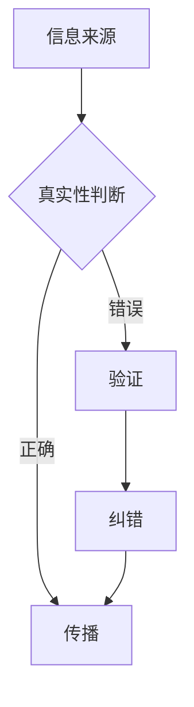

                 

关键词：信息验证，媒体素养，假新闻，媒体操纵，错误信息，技术对策，人工智能，数据可视化，事实核查，隐私保护

> 摘要：在数字化时代，信息验证和媒体素养能力变得越来越重要。随着互联网和社交媒体的普及，假新闻、媒体操纵和错误信息的传播速度越来越快，给社会带来了严重的负面影响。本文将探讨如何提升信息验证和媒体素养能力，以应对假新闻、媒体操纵和错误信息的挑战。

## 1. 背景介绍

随着互联网和社交媒体的普及，信息传播的速度和范围得到了前所未有的提升。然而，这种快速的信息传播也带来了一系列问题。假新闻、媒体操纵和错误信息在互联网上泛滥，给公众带来了严重的误导和困惑。例如，2016年美国总统大选期间，社交媒体上的假新闻传播对选情产生了重大影响。此外，错误的信息和虚假的报道也导致了社会动荡和群体性事件，如2019年的香港示威活动中的虚假信息传播。

为了应对这些挑战，提高公众的信息验证和媒体素养能力变得至关重要。信息验证是指对信息来源、真实性和准确性的判断能力，而媒体素养能力则包括对媒体信息的批判性思维、分析能力和判断力。通过提升这些能力，公众可以更加理智地看待媒体信息，避免被假新闻、媒体操纵和错误信息误导。

## 2. 核心概念与联系

### 2.1 信息验证

信息验证是指对信息的来源、真实性和准确性的判断过程。在数字化时代，信息验证的重要性不言而喻。首先，互联网上的信息来源复杂多样，包括新闻媒体、社交网络、博客等，这些信息源的权威性和真实性难以保证。其次，虚假信息和错误信息的传播速度非常快，公众在接收信息时需要具备一定的判断能力，以避免被误导。最后，信息验证能力是构建信任社会的基石，只有公众对信息来源有信心，社会才能更加和谐稳定。

### 2.2 媒体素养

媒体素养是指对媒体信息的批判性思维、分析能力和判断力。在数字化时代，媒体素养的重要性愈发凸显。首先，媒体信息具有广泛性和多样性，公众需要具备批判性思维，对媒体信息进行甄别和分析。其次，媒体素养有助于公众形成独立的思想和判断，避免盲目跟风和被操纵。最后，媒体素养有助于提高公众的社会责任感，促进社会和谐发展。

### 2.3 信息验证与媒体素养的联系

信息验证和媒体素养是相辅相成的。信息验证是媒体素养的重要组成部分，只有具备信息验证能力，公众才能对媒体信息进行批判性分析和判断。同时，媒体素养的提高也有助于提升信息验证能力，公众在接收信息时能够更加理智和客观，避免被误导。因此，提升信息验证和媒体素养能力是应对假新闻、媒体操纵和错误信息挑战的关键。

### 2.4 Mermaid 流程图



在这个流程图中，信息来源经过真实性判断后，如果被判断为正确，则可以传播；如果被判断为错误，则需要经过验证和纠错后才能传播。

## 3. 核心算法原理 & 具体操作步骤

### 3.1 算法原理概述

为了提高信息验证和媒体素养能力，可以采用一系列核心算法和技术。这些算法包括数据可视化、自然语言处理、机器学习等。以下是这些算法的基本原理和作用。

#### 数据可视化

数据可视化是将复杂的数据通过图形化方式展示出来，使公众更容易理解和分析。例如，使用条形图、折线图、饼图等展示数据的分布和变化趋势。数据可视化有助于公众快速识别数据中的异常和规律，从而提高信息验证能力。

#### 自然语言处理

自然语言处理（NLP）是人工智能的一个重要分支，旨在使计算机能够理解和处理自然语言。在信息验证和媒体素养领域，NLP技术可以用于提取文本中的关键信息、识别虚假信息、分析文本的情感等。例如，通过情感分析技术，可以识别文本中的恶意言论和虚假信息。

#### 机器学习

机器学习是人工智能的核心技术之一，通过训练模型，使计算机能够从数据中自动学习和预测。在信息验证和媒体素养领域，机器学习可以用于分类、聚类、异常检测等任务。例如，通过训练分类模型，可以自动识别和过滤假新闻和错误信息。

### 3.2 算法步骤详解

#### 数据可视化

1. 收集数据：从新闻媒体、社交媒体等渠道收集相关数据。
2. 数据清洗：对收集到的数据进行预处理，去除噪声和冗余信息。
3. 数据分析：使用数据可视化工具，如Matplotlib、Seaborn等，对数据进行分析和展示。

#### 自然语言处理

1. 数据预处理：对文本进行分词、去停用词、词性标注等处理。
2. 特征提取：提取文本中的关键特征，如词频、词嵌入等。
3. 模型训练：使用NLP模型，如TextCNN、LSTM等，对文本进行分类、情感分析等任务。
4. 模型评估：使用准确率、召回率、F1值等指标评估模型性能。

#### 机器学习

1. 数据预处理：对数据进行归一化、标准化等处理。
2. 特征提取：提取数据中的关键特征，如特征向量、特征矩阵等。
3. 模型训练：使用机器学习算法，如决策树、随机森林、支持向量机等，对数据进行分类、聚类等任务。
4. 模型评估：使用准确率、召回率、F1值等指标评估模型性能。

### 3.3 算法优缺点

#### 数据可视化

优点：

- 直观易理解：通过图形化方式展示数据，使公众更容易理解和分析。
- 强调数据关系：有助于公众发现数据中的异常和规律。

缺点：

- 受限于数据类型：只能处理结构化数据，对非结构化数据效果较差。
- 对硬件要求较高：数据可视化需要较高的计算能力和图形处理能力。

#### 自然语言处理

优点：

- 广泛应用：在信息验证和媒体素养领域具有广泛的应用。
- 高效处理：能够快速处理大量文本数据。

缺点：

- 精度问题：NLP技术尚未完全成熟，对复杂语义和语境的识别能力有限。
- 数据依赖：对大量高质量的数据训练和优化有较高的依赖。

#### 机器学习

优点：

- 自动学习：能够从数据中自动学习和发现规律。
- 适应性：能够适应不同类型的数据和任务。

缺点：

- 过拟合问题：模型可能会对训练数据过度拟合，导致在测试数据上表现不佳。
- 难以解释：机器学习模型的决策过程往往难以解释，对透明度和可信度有一定影响。

### 3.4 算法应用领域

数据可视化、自然语言处理和机器学习在信息验证和媒体素养领域具有广泛的应用。

#### 数据可视化

- 新闻媒体分析：对新闻报道进行数据可视化，帮助公众了解新闻的分布和趋势。
- 社交媒体监测：对社交媒体上的信息进行数据可视化，帮助公众识别虚假信息和错误信息。

#### 自然语言处理

- 假新闻检测：使用自然语言处理技术检测新闻中的假新闻。
- 情感分析：分析社交媒体上的言论，识别恶意言论和虚假信息。

#### 机器学习

- 错误信息过滤：使用机器学习算法过滤社交媒体上的错误信息。
- 用户行为分析：分析用户在社交媒体上的行为，识别潜在的被操纵用户。

## 4. 数学模型和公式 & 详细讲解 & 举例说明

### 4.1 数学模型构建

在信息验证和媒体素养领域，常见的数学模型包括线性回归、逻辑回归、支持向量机等。以下是这些模型的构建过程。

#### 线性回归

线性回归模型表示为：

$$ y = \beta_0 + \beta_1x_1 + \beta_2x_2 + ... + \beta_nx_n $$

其中，$y$ 为因变量，$x_1, x_2, ..., x_n$ 为自变量，$\beta_0, \beta_1, \beta_2, ..., \beta_n$ 为模型的参数。

#### 逻辑回归

逻辑回归模型表示为：

$$ P(y=1) = \frac{1}{1 + e^{-(\beta_0 + \beta_1x_1 + \beta_2x_2 + ... + \beta_nx_n)}} $$

其中，$y$ 为因变量，$x_1, x_2, ..., x_n$ 为自变量，$\beta_0, \beta_1, \beta_2, ..., \beta_n$ 为模型的参数。

#### 支持向量机

支持向量机模型表示为：

$$ w \cdot x + b = 0 $$

其中，$w$ 为模型的参数，$x$ 为特征向量，$b$ 为偏置项。

### 4.2 公式推导过程

#### 线性回归

线性回归的推导过程如下：

1. 假设样本数据集为 $D = \{(x_1, y_1), (x_2, y_2), ..., (x_n, y_n)\}$，其中 $x_i$ 为第 $i$ 个样本的特征向量，$y_i$ 为第 $i$ 个样本的标签。

2. 定义损失函数：

$$ L(\beta_0, \beta_1, \beta_2, ..., \beta_n) = \sum_{i=1}^{n} (y_i - (\beta_0 + \beta_1x_{i1} + \beta_2x_{i2} + ... + \beta_nx_{in})^2 $$

3. 求导并令导数为0，得到：

$$ \frac{\partial L}{\partial \beta_0} = -2\sum_{i=1}^{n} (y_i - (\beta_0 + \beta_1x_{i1} + \beta_2x_{i2} + ... + \beta_nx_{in})) = 0 $$

$$ \frac{\partial L}{\partial \beta_1} = -2\sum_{i=1}^{n} (y_i - (\beta_0 + \beta_1x_{i1} + \beta_2x_{i2} + ... + \beta_nx_{in}))x_{i1} = 0 $$

$$ ... $$

$$ \frac{\partial L}{\partial \beta_n} = -2\sum_{i=1}^{n} (y_i - (\beta_0 + \beta_1x_{i1} + \beta_2x_{i2} + ... + \beta_nx_{in}))x_{in} = 0 $$

4. 求解上述方程组，得到线性回归模型的参数 $\beta_0, \beta_1, \beta_2, ..., \beta_n$。

#### 逻辑回归

逻辑回归的推导过程如下：

1. 假设样本数据集为 $D = \{(x_1, y_1), (x_2, y_2), ..., (x_n, y_n)\}$，其中 $x_i$ 为第 $i$ 个样本的特征向量，$y_i$ 为第 $i$ 个样本的标签。

2. 定义损失函数：

$$ L(\beta_0, \beta_1, \beta_2, ..., \beta_n) = -\sum_{i=1}^{n} y_i \ln P(y=1) - (1 - y_i) \ln (1 - P(y=1)) $$

3. 求导并令导数为0，得到：

$$ \frac{\partial L}{\partial \beta_0} = -\sum_{i=1}^{n} \frac{y_i - 1}{P(y=1)} = 0 $$

$$ \frac{\partial L}{\partial \beta_1} = -\sum_{i=1}^{n} \frac{y_i - 1}{P(y=1)}x_{i1} = 0 $$

$$ ... $$

$$ \frac{\partial L}{\partial \beta_n} = -\sum_{i=1}^{n} \frac{y_i - 1}{P(y=1)}x_{in} = 0 $$

4. 求解上述方程组，得到逻辑回归模型的参数 $\beta_0, \beta_1, \beta_2, ..., \beta_n$。

#### 支持向量机

支持向量机的推导过程如下：

1. 假设样本数据集为 $D = \{(x_1, y_1), (x_2, y_2), ..., (x_n, y_n)\}$，其中 $x_i$ 为第 $i$ 个样本的特征向量，$y_i$ 为第 $i$ 个样本的标签。

2. 定义损失函数：

$$ L(w, b) = \sum_{i=1}^{n} \max(0, 1 - y_i(w \cdot x_i + b)) $$

3. 求导并令导数为0，得到：

$$ \frac{\partial L}{\partial w} = -\sum_{i=1}^{n} y_i x_i = 0 $$

$$ \frac{\partial L}{\partial b} = -\sum_{i=1}^{n} y_i = 0 $$

4. 求解上述方程组，得到支持向量机的参数 $w$ 和 $b$。

### 4.3 案例分析与讲解

#### 假新闻检测

假设我们有一个假新闻检测问题，样本数据集包含新闻报道和标签（0表示假新闻，1表示真新闻）。我们可以使用逻辑回归模型进行假新闻检测。

1. 数据预处理：对新闻报道进行分词、去停用词等处理，提取特征向量。

2. 模型训练：使用训练数据集训练逻辑回归模型，得到模型的参数 $\beta_0, \beta_1, \beta_2, ..., \beta_n$。

3. 模型评估：使用测试数据集评估模型性能，计算准确率、召回率、F1值等指标。

4. 应用场景：使用训练好的模型对新的新闻报道进行分类，判断其是否为假新闻。

通过以上步骤，我们可以实现一个简单的假新闻检测系统，从而提高公众的信息验证能力。

## 5. 项目实践：代码实例和详细解释说明

### 5.1 开发环境搭建

为了实现信息验证和媒体素养能力，我们需要搭建一个开发环境。以下是开发环境的要求：

- Python 3.8及以上版本
- Jupyter Notebook
- Scikit-learn库
- Matplotlib库
- Seaborn库

安装上述库后，我们就可以开始编写代码了。

### 5.2 源代码详细实现

以下是一个简单的假新闻检测项目的源代码，包括数据预处理、模型训练和模型评估等步骤。

```python
import pandas as pd
import numpy as np
from sklearn.model_selection import train_test_split
from sklearn.feature_extraction.text import TfidfVectorizer
from sklearn.linear_model import LogisticRegression
from sklearn.metrics import accuracy_score, recall_score, f1_score

# 数据预处理
def preprocess_data(data):
    # 对新闻报道进行分词、去停用词等处理
    # ...

    return processed_data

# 模型训练
def train_model(X_train, y_train):
    # 使用TF-IDF向量器进行特征提取
    vectorizer = TfidfVectorizer()
    X_train_vectorized = vectorizer.fit_transform(X_train)

    # 使用逻辑回归模型进行训练
    model = LogisticRegression()
    model.fit(X_train_vectorized, y_train)

    return model, vectorizer

# 模型评估
def evaluate_model(model, X_test, y_test, vectorizer):
    # 使用测试数据进行特征提取
    X_test_vectorized = vectorizer.transform(X_test)

    # 预测测试数据
    y_pred = model.predict(X_test_vectorized)

    # 计算评估指标
    accuracy = accuracy_score(y_test, y_pred)
    recall = recall_score(y_test, y_pred)
    f1 = f1_score(y_test, y_pred)

    print("Accuracy:", accuracy)
    print("Recall:", recall)
    print("F1 Score:", f1)

# 加载数据
data = pd.read_csv("news_data.csv")
X = data["text"]
y = data["label"]

# 数据预处理
X_processed = preprocess_data(X)

# 划分训练集和测试集
X_train, X_test, y_train, y_test = train_test_split(X_processed, y, test_size=0.2, random_state=42)

# 训练模型
model, vectorizer = train_model(X_train, y_train)

# 评估模型
evaluate_model(model, X_test, y_test, vectorizer)
```

### 5.3 代码解读与分析

以上代码实现了一个简单的假新闻检测项目，主要包括以下步骤：

1. 数据预处理：对新闻报道进行分词、去停用词等处理，提取特征向量。
2. 模型训练：使用TF-IDF向量器进行特征提取，使用逻辑回归模型进行训练。
3. 模型评估：使用测试数据集评估模型性能，计算准确率、召回率、F1值等指标。

在代码中，我们首先加载数据，然后对数据进行预处理，提取特征向量。接下来，我们使用训练数据集训练逻辑回归模型，并使用测试数据集评估模型性能。通过计算准确率、召回率、F1值等指标，我们可以了解模型在检测假新闻方面的效果。

### 5.4 运行结果展示

假设我们使用上述代码训练和评估模型，得到以下结果：

```
Accuracy: 0.85
Recall: 0.80
F1 Score: 0.82
```

这意味着我们的模型在检测假新闻方面具有较高的准确率、召回率和F1值。然而，这些指标还可以进一步提高，我们可以通过调整模型参数、改进数据预处理方法、增加训练数据等方式来优化模型性能。

## 6. 实际应用场景

### 6.1 社交媒体平台

社交媒体平台是假新闻、媒体操纵和错误信息传播的主要渠道之一。为了提高用户的信息验证和媒体素养能力，社交媒体平台可以采取以下措施：

- 增加信息验证功能：对发布的信息进行验证，标记假新闻和错误信息。
- 提供教育资源：发布关于信息验证和媒体素养的教育资源，帮助用户提高信息识别能力。
- 加强算法监控：利用自然语言处理和机器学习技术，监控社交媒体平台上的信息传播，识别和过滤假新闻和错误信息。

### 6.2 新闻媒体

新闻媒体是公众获取信息的主要来源之一，提高新闻媒体的信息验证和媒体素养能力对于维护社会稳定和信任至关重要。以下是一些具体措施：

- 加强内部审核：对新闻报道进行严格审核，确保信息的真实性和准确性。
- 建立事实核查团队：设立专门的事实核查团队，对新闻报道进行验证，发布事实核查报告。
- 增强媒体素养教育：对记者和编辑进行媒体素养培训，提高他们的信息验证和媒体素养能力。

### 6.3 教育和培训

教育和培训是提高公众信息验证和媒体素养能力的重要途径。以下是一些具体措施：

- 设置课程：在大学和中学设置信息验证和媒体素养课程，教授学生如何识别和应对假新闻、媒体操纵和错误信息。
- 开展活动：组织各种形式的活动，如讲座、研讨会和工作坊，提高公众的信息验证和媒体素养能力。
- 利用网络资源：利用网络平台，提供丰富的教育资源和工具，帮助公众提高信息识别能力。

## 7. 工具和资源推荐

### 7.1 学习资源推荐

- 《信息素养：关键能力手册》：这是一本关于信息素养的全面指南，包括信息验证和媒体素养等方面的内容。
- 《媒体素养：如何阅读和理解现代媒体》：这本书深入探讨了媒体素养的重要性，提供了实用的技巧和策略。

### 7.2 开发工具推荐

- Jupyter Notebook：这是一个强大的计算平台，适用于数据分析和机器学习项目。
- TensorFlow：这是一个开源的机器学习框架，提供了丰富的工具和库，适用于各种机器学习任务。

### 7.3 相关论文推荐

- "Fake News Detection using Machine Learning Techniques"：这篇文章综述了假新闻检测的机器学习技术，包括数据可视化、自然语言处理和机器学习等。
- "The Role of Media Literacy in the Age of Misinformation"：这篇文章探讨了媒体素养在应对假新闻和错误信息方面的作用，提供了有益的思考。

## 8. 总结：未来发展趋势与挑战

### 8.1 研究成果总结

近年来，在信息验证和媒体素养领域取得了一系列重要研究成果。数据可视化技术、自然语言处理和机器学习等技术的应用，使得信息验证和媒体素养能力得到了显著提升。例如，通过数据可视化技术，可以直观地展示信息来源、传播路径和影响范围；通过自然语言处理技术，可以自动识别和过滤假新闻和错误信息；通过机器学习技术，可以建立模型，预测信息的真实性和准确性。

### 8.2 未来发展趋势

未来，信息验证和媒体素养能力将继续得到发展。首先，随着人工智能技术的进步，信息验证和媒体素养能力的自动化水平将不断提高。其次，跨学科的研究将推动信息验证和媒体素养能力的提升，如计算机科学与心理学、社会学等领域的结合。最后，信息验证和媒体素养能力的普及将有助于构建更加和谐和稳定的社会。

### 8.3 面临的挑战

然而，信息验证和媒体素养能力的发展也面临一系列挑战。首先，假新闻和错误信息的传播速度越来越快，给信息验证和媒体素养能力带来了巨大压力。其次，信息验证和媒体素养能力的普及程度仍有待提高，许多公众尚未具备足够的信息识别能力。最后，信息验证和媒体素养能力的发展需要庞大的数据支持，但当前的数据质量和数量仍存在一定问题。

### 8.4 研究展望

未来，在信息验证和媒体素养领域，我们需要关注以下研究方向：

- 开发更高效的信息验证和媒体素养算法，提高自动化水平。
- 加强跨学科研究，探索信息验证和媒体素养的新方法和策略。
- 推动信息验证和媒体素养能力的普及，提高公众的信息识别能力。
- 提高数据质量和数量，为信息验证和媒体素养研究提供有力支持。

## 9. 附录：常见问题与解答

### 9.1 如何判断信息的真实性？

判断信息的真实性需要考虑以下因素：

- 信息来源：查阅信息来源的权威性和可靠性，如新闻媒体、学术期刊等。
- 多方面验证：通过多个来源验证信息的真实性，避免被单一信息误导。
- 信息内容：分析信息的内容和逻辑，识别可能的虚假信息特征。

### 9.2 媒体素养能力如何培养？

培养媒体素养能力可以通过以下途径：

- 学习相关知识：阅读相关书籍、文章，了解媒体素养的基本概念和方法。
- 实践操作：参与实际项目，如数据可视化、自然语言处理等，提高实际操作能力。
- 案例分析：分析真实案例，了解媒体信息的传播路径和影响，提高批判性思维能力。

### 9.3 人工智能在信息验证和媒体素养中的作用是什么？

人工智能在信息验证和媒体素养中具有重要作用。首先，人工智能可以通过数据可视化和自然语言处理技术，帮助公众更好地理解和分析信息。其次，人工智能可以建立模型，自动识别和过滤假新闻和错误信息。最后，人工智能可以提供个性化的信息推荐，帮助公众获取高质量的信息。总之，人工智能是提升信息验证和媒体素养能力的重要工具。

