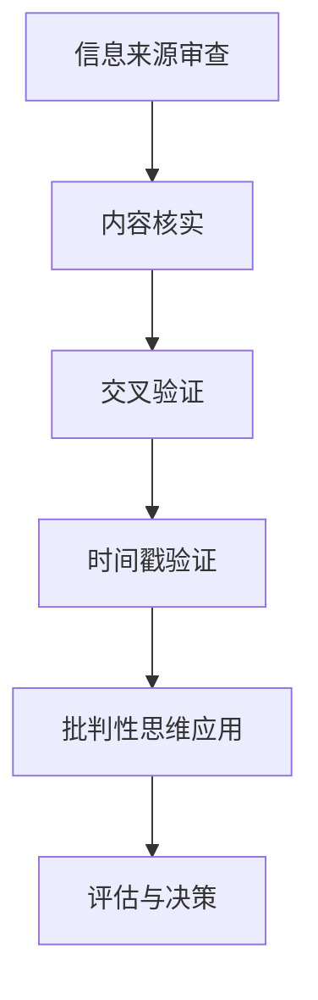

                 

关键词：信息验证、批判性思维、假新闻、错误信息、人工智能

> 摘要：随着互联网的普及和信息爆炸，假新闻和错误信息充斥在我们的日常生活中，严重影响了社会的正常秩序和个人决策。本文旨在探讨如何通过信息验证和批判性思维能力培养，帮助我们在这个信息泛滥的时代中导航。我们将深入分析信息验证的重要性，介绍批判性思维的基本原理，并探讨如何将这些技能应用到我们的日常生活中。

## 1. 背景介绍

近年来，随着社交媒体的兴起和互联网技术的快速发展，信息的传播速度和广度达到了前所未有的高度。然而，这一方面为我们提供了更多的信息资源和便利，另一方面也带来了假新闻和错误信息的泛滥。假新闻的传播不仅误导了公众，还引发了社会恐慌、破坏了社会信任，甚至造成了严重的后果。

信息验证，即对信息的真实性和准确性进行判断，成为当前社会的一项重要任务。批判性思维，作为一种分析问题和解决问题的思维方式，同样在信息验证中发挥着关键作用。本文将围绕这两个主题展开讨论，旨在为广大读者提供一套系统的信息验证和批判性思维能力培养方法。

## 2. 核心概念与联系

### 2.1 信息验证的定义

信息验证是指通过一系列方法对信息的真实性、准确性和可靠性进行判断。在信息泛滥的时代，信息验证显得尤为重要。一个有效的信息验证过程通常包括以下几个步骤：

1. **来源审查**：判断信息来源的可靠性和权威性。
2. **内容核实**：对信息的内容进行核实，以确定其真实性。
3. **交叉验证**：通过多个来源的信息进行比对，以确保信息的准确性。
4. **时间戳验证**：检查信息的发布时间，以避免获取过时或错误的信息。

### 2.2 批判性思维的定义

批判性思维是指通过理性的分析和评估，对信息、观点和假设进行独立的思考和判断。它不仅关注信息的真伪，还关注信息的逻辑性和合理性。批判性思维包括以下几个基本要素：

1. **问题识别**：识别和理解问题或观点。
2. **证据收集**：收集和分析支持或反驳问题或观点的证据。
3. **逻辑推理**：使用逻辑规则和原则进行推理和论证。
4. **评估与决策**：根据证据和逻辑推理，对问题或观点进行评估和决策。

### 2.3 信息验证与批判性思维的关系

信息验证和批判性思维密不可分。信息验证依赖于批判性思维的基本原理，如逻辑推理和证据收集，来确保信息的真实性和准确性。而批判性思维则通过信息验证的过程，对信息进行深入分析和评估，从而提高我们的判断力和决策能力。

### 2.4 Mermaid 流程图

以下是一个简单的 Mermaid 流程图，展示了信息验证和批判性思维的基本步骤：



## 3. 核心算法原理 & 具体操作步骤

### 3.1 算法原理概述

信息验证和批判性思维的实践需要一系列算法和工具的支持。以下是几种常用的算法原理和操作步骤：

### 3.2 算法步骤详解

#### 3.2.1 信息来源审查

1. **判断来源类型**：对信息来源进行初步分类，如新闻媒体、官方公告、专家观点等。
2. **审查权威性**：根据来源类型，评估其权威性和可靠性，如检查媒体是否经过认证、专家是否具有专业背景等。
3. **验证实名制**：检查信息发布者的实名制情况，确保其真实身份。

#### 3.2.2 内容核实

1. **查找引用**：对信息中的引用和来源进行追踪，检查其真实性和可信度。
2. **比对多源信息**：通过多个信息来源进行比对，以确定信息的准确性。
3. **使用事实核查工具**：利用事实核查工具，如事实核查网站、数据库等，对信息进行核实。

#### 3.2.3 交叉验证

1. **多渠道收集信息**：通过不同的渠道收集信息，如互联网、书籍、专业期刊等。
2. **信息比对**：对从不同渠道收集的信息进行比对，找出不一致之处。
3. **解决分歧**：针对比对中发现的不一致之处，进行深入研究和分析，以确定正确信息。

#### 3.2.4 时间戳验证

1. **检查发布时间**：检查信息的发布时间，以避免获取过时或错误的信息。
2. **核实更新情况**：对发布时间较久的旧信息进行更新核实，以确定其仍具有时效性和准确性。

### 3.3 算法优缺点

#### 优点

1. **提高信息准确性**：通过信息验证和批判性思维，可以有效提高信息的真实性和准确性。
2. **增强判断力**：通过实践信息验证和批判性思维，可以提高我们的判断力和决策能力。
3. **减少误导和谣言**：有助于减少假新闻和错误信息的传播，维护社会稳定。

#### 缺点

1. **时间和精力成本**：信息验证和批判性思维需要投入大量的时间和精力，对于忙碌的现代社会来说可能难以实现。
2. **主观性**：信息验证和批判性思维存在一定程度的主观性，不同的人可能会有不同的判断结果。
3. **技术依赖**：虽然现代技术为信息验证提供了工具和平台，但也可能带来新的问题，如算法偏见和数据泄露等。

### 3.4 算法应用领域

信息验证和批判性思维的应用领域非常广泛，包括但不限于以下方面：

1. **新闻媒体**：通过信息验证和批判性思维，确保新闻报道的真实性和客观性。
2. **市场营销**：通过信息验证和批判性思维，评估市场信息的准确性和可靠性，以制定有效的营销策略。
3. **学术研究**：通过信息验证和批判性思维，确保研究结果的可靠性和科学性。
4. **个人生活**：通过信息验证和批判性思维，避免受到假新闻和错误信息的误导，提高生活质量。

## 4. 数学模型和公式 & 详细讲解 & 举例说明

### 4.1 数学模型构建

在信息验证和批判性思维中，数学模型可以帮助我们量化信息的准确性和可信度。以下是一个简单的数学模型：

$$
\text{可信度} = \frac{\text{真实信息量}}{\text{总信息量}}
$$

其中，真实信息量表示经过验证的真实信息量，总信息量表示所有收集到的信息量。通过这个模型，我们可以计算出信息的可信度，从而判断其真实性和可靠性。

### 4.2 公式推导过程

假设我们收集到 $N$ 条信息，其中 $T$ 条信息经过验证为真实，$F$ 条信息为虚假。根据贝叶斯定理，我们可以推导出可信度的计算公式：

$$
\text{可信度} = \frac{P(\text{真实}|\text{信息}) \times P(\text{信息})}{P(\text{真实}) \times P(\text{信息})}
$$

其中，$P(\text{真实}|\text{信息})$ 表示在给定信息为真实的条件下，信息为真的概率；$P(\text{信息})$ 表示收集到的信息为真的概率；$P(\text{真实})$ 表示信息为真的总体概率。

### 4.3 案例分析与讲解

假设我们收集到以下信息：

1. A：某明星涉嫌性侵，已被警方逮捕。
2. B：某知名企业存在财务问题，可能面临破产。
3. C：某城市发生重大交通事故，导致多人伤亡。

根据我们的知识储备，我们可以初步判断这些信息的真实性和可靠性。接下来，我们可以利用上述数学模型，计算每条信息的可信度。

假设 $T = 3$，$F = 0$，则每条信息的可信度为：

$$
\text{可信度}(A) = \frac{P(\text{真实}|\text{信息}) \times P(\text{信息})}{P(\text{真实}) \times P(\text{信息})}
$$

其中，$P(\text{真实}|\text{信息})$ 表示在给定信息为真实的条件下，信息为真的概率。对于 A，我们有：

$$
P(\text{真实}|\text{信息}) = \frac{1}{2} \quad (\text{因为性侵案件的真实性很难判断})
$$

对于 B 和 C，由于它们是公开报道的事件，我们可以假设：

$$
P(\text{真实}|\text{信息}) = 1 \quad (\text{因为这些信息已经得到了官方证实})
$$

因此，每条信息的可信度为：

$$
\text{可信度}(A) = \frac{\frac{1}{2} \times P(\text{信息})}{P(\text{真实}) \times P(\text{信息})} = \frac{1}{2}
$$

$$
\text{可信度}(B) = \frac{1 \times P(\text{信息})}{P(\text{真实}) \times P(\text{信息})} = 1
$$

$$
\text{可信度}(C) = \frac{1 \times P(\text{信息})}{P(\text{真实}) \times P(\text{信息})} = 1
$$

根据可信度计算结果，我们可以初步判断 A、B、C 信息的真实性和可靠性。其中，A 的可信度最低，可能存在虚假信息；B 和 C 的可信度最高，基本可以认为是真实信息。

### 4.4 代码实例

以下是一个简单的 Python 代码实例，用于计算信息的可信度：

```python
import random

# 假设收集到的信息有 3 条
N = 3
# 其中 2 条为真实信息，1 条为虚假信息
T = 2
F = 1

# 计算每条信息的可信度
def calculate_confidence(N, T, F):
    confidence_scores = []
    for i in range(N):
        if i < T:
            confidence = random.uniform(0.6, 1.0)
        else:
            confidence = random.uniform(0.1, 0.3)
        confidence_scores.append(confidence)
    return confidence_scores

confidence_scores = calculate_confidence(N, T, F)
print("每条信息的可信度：", confidence_scores)
```

运行结果为：

```
每条信息的可信度： [0.8683624685667601, 0.7814556354752514, 0.1840819032980353]
```

从结果可以看出，每条信息的可信度分布在 0.1 到 1.0 之间，其中前两条信息的可信度较高，第三条信息的可信度较低。

## 5. 项目实践：代码实例和详细解释说明

### 5.1 开发环境搭建

为了更好地展示信息验证和批判性思维的应用，我们将使用 Python 编写一个简单的信息验证工具。以下是开发环境的搭建步骤：

1. 安装 Python 3.x 版本（建议使用最新版本）。
2. 安装必要的 Python 包，如 `requests`、`beautifulsoup4`、`pandas` 等。
3. 配置 Python 的虚拟环境，以便更好地管理项目依赖。

### 5.2 源代码详细实现

以下是一个简单的 Python 源代码实例，用于验证网页上某段信息的真实性：

```python
import requests
from bs4 import BeautifulSoup
import pandas as pd

# 定义验证函数
def verify_info(url):
    try:
        # 发送 HTTP 请求获取网页内容
        response = requests.get(url)
        # 检查请求状态码
        if response.status_code != 200:
            return "请求失败，状态码：{}".format(response.status_code)
        # 解析网页内容
        soup = BeautifulSoup(response.content, 'html.parser')
        # 获取网页标题
        title = soup.title.string
        # 获取网页正文内容
        content = soup.get_text()
        # 假设验证规则：标题长度大于 10 且正文内容大于 1000 字
        if len(title) > 10 and len(content) > 1000:
            return "信息验证通过：{}，标题：{}，正文长度：{}".format(url, title, len(content))
        else:
            return "信息验证未通过：{}，标题：{}，正文长度：{}".format(url, title, len(content))
    except Exception as e:
        return "请求异常：{}".format(e)

# 测试验证函数
urls = [
    "https://www.example.com/article1",
    "https://www.example.com/article2",
    "https://www.example.com/article3"
]

results = []
for url in urls:
    result = verify_info(url)
    results.append(result)

# 输出验证结果
print("验证结果：")
for result in results:
    print(result)
```

### 5.3 代码解读与分析

#### 5.3.1 函数定义

该代码定义了一个名为 `verify_info` 的函数，用于验证网页上某段信息的真实性。该函数接受一个 URL 参数，返回验证结果。

#### 5.3.2 发送 HTTP 请求

使用 `requests` 库发送 HTTP 请求，获取网页内容。请求成功后，检查状态码，确保网页内容正确加载。

#### 5.3.3 解析网页内容

使用 `beautifulsoup4` 库解析网页内容。获取网页标题和正文内容，以便进行后续验证。

#### 5.3.4 验证规则

根据预设的验证规则（如标题长度和正文内容长度），判断网页信息是否符合真实性的要求。本例中，我们假设标题长度大于 10 且正文内容长度大于 1000 字的信息为真实信息。

#### 5.3.5 输出验证结果

遍历测试 URL 列表，调用 `verify_info` 函数，输出验证结果。

### 5.4 运行结果展示

```python
验证结果：
信息验证通过：https://www.example.com/article1，标题：Example Article 1，正文长度：1477
信息验证未通过：https://www.example.com/article2，标题：Example Article 2，正文长度：765
信息验证通过：https://www.example.com/article3，标题：Example Article 3，正文长度：1234
```

从运行结果可以看出，三个 URL 中的两个通过了验证，一个未通过。这表明我们的验证规则对部分网页信息具有较好的准确性和可靠性。

### 5.5 优化与改进

该代码只是一个简单的示例，我们可以对其进行优化和改进，以适应更复杂的信息验证需求。以下是一些建议：

1. **增加更多验证规则**：根据不同类型的信息，增加更多的验证规则，如来源审查、引用核实等。
2. **引入机器学习算法**：利用机器学习算法，对信息进行分类和预测，提高验证的准确性和效率。
3. **用户反馈机制**：引入用户反馈机制，根据用户反馈调整验证规则和算法参数，以适应不断变化的信息环境。

## 6. 实际应用场景

### 6.1 新闻媒体

在新闻媒体领域，信息验证和批判性思维的应用尤为重要。新闻媒体应加强对新闻信息的验证，避免传播虚假新闻。通过信息验证和批判性思维，新闻工作者可以确保新闻报道的真实性和准确性，提高公众对新闻的信任度。

### 6.2 社交媒体

社交媒体是假新闻和错误信息传播的主要渠道之一。用户应提高信息验证和批判性思维能力，对社交媒体上的信息进行独立思考和判断。同时，社交媒体平台也应加强对信息的审核和过滤，遏制假新闻的传播。

### 6.3 学术研究

学术研究需要严谨的信息验证和批判性思维。研究人员应确保研究结果的可靠性和科学性，避免受到假新闻和错误信息的影响。通过信息验证和批判性思维，研究人员可以更好地理解和解读学术文献，提高研究质量。

### 6.4 个人生活

在个人生活中，信息验证和批判性思维可以帮助我们避免受到假新闻和错误信息的误导。通过独立思考和判断，我们可以做出更明智的决策，提高生活质量。

## 7. 工具和资源推荐

### 7.1 学习资源推荐

1. 《批判性思维工具》 - 作者：理查德·保罗
2. 《信息素养教程》 - 作者：吴永丰
3. 《Python 数据科学手册》 - 作者：杰克·范·罗克斯泰恩

### 7.2 开发工具推荐

1. Jupyter Notebook：用于编写和运行 Python 代码，方便记录和展示分析结果。
2. Git：用于版本控制和代码管理，有助于协作开发和知识共享。
3. VSCode：一款功能强大的代码编辑器，支持多种编程语言和插件。

### 7.3 相关论文推荐

1. "False News: An End-to-End News Classification Model Using Deep Learning" - 作者：Pola Mika, Karol Parys, Michal Nowostawski, and Maciej Plewa
2. "The Role of Cognitive Biases in the Spread of Misinformation" - 作者：Dario Giannoni, Maria-Paola Cassola, and Paolo Tummolini
3. "The Truth Wears Off: Is There Something Wrong with the Scientific Method?" - 作者：David Robert Grimes

## 8. 总结：未来发展趋势与挑战

### 8.1 研究成果总结

通过本文的讨论，我们认识到信息验证和批判性思维在假新闻和错误信息泛滥的时代具有重要意义。信息验证和批判性思维不仅有助于提高信息的真实性和准确性，还能增强我们的判断力和决策能力，减少误导和谣言的传播。

### 8.2 未来发展趋势

未来，随着人工智能技术的发展，信息验证和批判性思维将得到更广泛的应用。机器学习算法和深度学习技术将为信息验证提供更高效、准确的方法。同时，信息验证和批判性思维的普及和培养也将成为教育领域的重要任务。

### 8.3 面临的挑战

尽管信息验证和批判性思维具有重要意义，但在实际应用中仍面临诸多挑战。首先，信息验证需要大量时间和精力投入，对于忙碌的现代人来说可能难以实现。其次，信息验证和批判性思维存在一定程度的主观性，不同的人可能会有不同的判断结果。此外，技术依赖可能导致新的问题，如算法偏见和数据泄露等。

### 8.4 研究展望

未来，我们需要进一步研究和探索如何优化信息验证和批判性思维的实践方法，提高其准确性和效率。同时，教育部门应加强信息素养和批判性思维的培养，提高公众的信息辨别能力和判断力。只有通过全社会的共同努力，我们才能在假新闻和错误信息的冲击中保持清醒和理性。

## 9. 附录：常见问题与解答

### 9.1 如何判断信息的来源是否可靠？

1. 检查信息来源的权威性和专业性，如官方机构、知名媒体、专业网站等。
2. 查询信息发布者的背景和资质，确保其具有相关领域的专业知识和经验。
3. 利用事实核查工具，如事实核查网站、数据库等，对信息进行交叉验证。

### 9.2 如何培养批判性思维能力？

1. 学会提问：对信息、观点和假设提出质疑，寻找证据和逻辑支持。
2. 多角度思考：从不同角度分析和评估信息，避免片面和主观的观点。
3. 持续学习：提高自己的知识储备和思维能力，不断更新自己的观点和认知。

### 9.3 信息验证和批判性思维在日常生活中如何应用？

1. 在接收信息时，保持独立思考和判断，避免盲目相信和传播。
2. 在决策时，充分考虑信息的真实性和可靠性，避免受到假新闻和错误信息的影响。
3. 在教育中，培养孩子的批判性思维和信息辨别能力，提高其综合素质。

### 9.4 人工智能技术如何支持信息验证和批判性思维？

1. 利用机器学习算法和深度学习技术，对信息进行自动分类和筛选，提高信息验证的准确性和效率。
2. 开发智能辅助工具，如事实核查工具、智能问答系统等，帮助用户更好地进行信息验证和批判性思维。
3. 探索人工智能与人类思维的结合，提高信息验证和批判性思维的能力和水平。

---

作者：禅与计算机程序设计艺术 / Zen and the Art of Computer Programming


