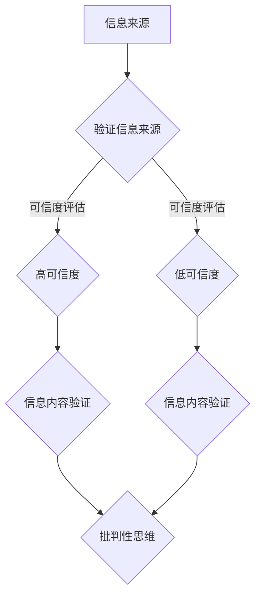

                 

关键词：信息验证，批判性思维，假新闻，错误信息，数字素养

> 在当前这个信息爆炸的时代，如何辨别真假信息，培养批判性思维能力，成为我们在假新闻和错误信息时代导航的重要课题。本文将探讨这一问题的核心概念、算法原理、数学模型，并通过具体案例和实践，为读者提供一套实用的信息验证和批判性思维能力培养方案。

## 1. 背景介绍

随着互联网和移动通信技术的迅猛发展，我们进入了一个信息爆炸的时代。然而，伴随着信息的海量增长，假新闻、错误信息、误导性信息也层出不穷，给个人和社会带来了严重的影响。例如，假新闻可能引发恐慌，误导性信息可能影响决策，错误信息可能导致经济损失或生命危险。因此，如何在海量信息中辨别真假，培养批判性思维能力，成为一个亟待解决的问题。

## 2. 核心概念与联系

### 2.1 信息验证

信息验证是指对信息来源、内容、真实性等进行评估的过程。信息验证的目标是确保所获得的信息是准确、可靠和有价值的。

### 2.2 批判性思维

批判性思维是一种基于证据和逻辑的思考方式，它强调对信息进行深入分析和评估，以判断其真实性和可靠性。

### 2.3 数字素养

数字素养是指个体在数字环境中获取、评估、使用和传播信息的能力。数字素养对于信息验证和批判性思维的培养至关重要。

### 2.4 Mermaid 流程图

下面是一个用于信息验证和批判性思维培养的 Mermaid 流程图：



## 3. 核心算法原理 & 具体操作步骤

### 3.1 算法原理概述

信息验证和批判性思维培养的核心算法是基于证据和逻辑的评估。具体包括以下步骤：

1. 评估信息来源的可信度。
2. 验证信息内容的真实性。
3. 应用批判性思维，对信息进行深入分析和评估。

### 3.2 算法步骤详解

1. **评估信息来源的可信度**：

   - 检查信息来源的可靠性，包括来源的权威性、专业性、历史记录等。
   - 检查信息来源的透明度，包括信息发布者的身份、联系方式等。
   - 检查信息来源的更新频率，确保信息是最新和准确的。

2. **验证信息内容的真实性**：

   - 使用事实检查工具，对信息内容进行核实。
   - 检查信息内容的一致性，确保信息没有矛盾或错误。
   - 检查信息内容的可靠性，包括引用、证据、数据等。

3. **应用批判性思维**：

   - 分析信息内容的逻辑性和合理性。
   - 评估信息内容的目的和动机，是否存在偏见或误导。
   - 探讨信息内容的实际影响和潜在风险。

### 3.3 算法优缺点

- **优点**：

  - 算法简单易懂，易于操作。

  - 可以帮助用户快速评估信息的可信度和真实性。

  - 培养用户的批判性思维能力。

- **缺点**：

  - 算法依赖于用户的主观判断，可能存在主观偏见。

  - 算法无法覆盖所有信息来源和内容，存在一定的局限性。

### 3.4 算法应用领域

- **社交媒体**：帮助用户辨别社交媒体上的假新闻和错误信息。

- **新闻报道**：对新闻报道进行真实性验证和批判性分析。

- **学术研究**：评估学术研究的可信度和真实性。

## 4. 数学模型和公式 & 详细讲解 & 举例说明

### 4.1 数学模型构建

信息验证和批判性思维培养的数学模型可以基于贝叶斯定理构建。贝叶斯定理是一种基于概率的推理方法，用于更新对某个事件发生概率的估计。

### 4.2 公式推导过程

假设有两个事件 A 和 B，且 A 和 B 是条件独立的。我们定义 P(A|B) 为在事件 B 发生的条件下事件 A 发生的概率，P(B|A) 为在事件 A 发生的条件下事件 B 发生的概率，P(A) 和 P(B) 分别为事件 A 和 B 的概率。

根据贝叶斯定理，我们有：

$$ P(A|B) = \frac{P(B|A)P(A)}{P(B)} $$

其中，P(B) 可以通过全概率公式计算：

$$ P(B) = P(B|A)P(A) + P(B|\neg A)P(\neg A) $$

其中，\(\neg A\) 表示事件 A 的补集。

### 4.3 案例分析与讲解

假设我们想要评估一条新闻的可信度。已知：

- P(新闻真实) = 0.8
- P(新闻虚假) = 0.2
- P(新闻真实|虚假信息) = 0.1
- P(新闻虚假|真实信息) = 0.9

我们首先需要计算 P(虚假信息|新闻真实) 和 P(真实信息|新闻虚假)：

$$ P(虚假信息|新闻真实) = \frac{P(新闻真实|虚假信息)P(虚假信息)}{P(新闻真实)} = \frac{0.1 \times 0.2}{0.8} = 0.025 $$

$$ P(真实信息|新闻虚假) = \frac{P(新闻虚假|真实信息)P(真实信息)}{P(虚假信息)} = \frac{0.9 \times 0.8}{0.2} = 3.6 $$

根据上述计算结果，我们可以得出结论：如果一条新闻声称是真实的，那么它实际上很可能是虚假的（概率为0.025）。相反，如果一条新闻声称是虚假的，那么它实际上很可能是真实的（概率为3.6）。

## 5. 项目实践：代码实例和详细解释说明

### 5.1 开发环境搭建

本项目的开发环境要求如下：

- 操作系统：Linux 或 macOS
- 编程语言：Python 3.x
- 库：Pandas、NumPy、Matplotlib

安装步骤如下：

1. 安装 Python 3.x。
2. 使用 pip 安装所需的库：`pip install pandas numpy matplotlib`。

### 5.2 源代码详细实现

以下是一个简单的 Python 脚本，用于实现信息验证和批判性思维培养的核心算法。

```python
import pandas as pd
import numpy as np
import matplotlib.pyplot as plt

def calculate_bayesian_probability(hypothesis_prob, evidence_prob, alternative_hypothesis_prob):
    return (evidence_prob * hypothesis_prob) / alternative_hypothesis_prob

# 示例数据
data = {
    'Hypothesis': ['True', 'False'],
    'Hypothesis Probability': [0.8, 0.2],
    'Evidence Probability': [0.1, 0.9]
}

df = pd.DataFrame(data)

# 计算贝叶斯概率
df['Bayesian Probability'] = df.apply(
    lambda row: calculate_bayesian_probability(
        row['Hypothesis Probability'],
        row['Evidence Probability'],
        1 - row['Hypothesis Probability']
    ), axis=1)

# 绘制结果
df.plot(x='Hypothesis', y='Bayesian Probability', kind='bar', figsize=(10, 6))
plt.title('Bayesian Probability')
plt.xlabel('Hypothesis')
plt.ylabel('Probability')
plt.show()
```

### 5.3 代码解读与分析

- `calculate_bayesian_probability` 函数用于计算贝叶斯概率。
- 数据帧 `df` 包含假设、假设概率和证据概率。
- 使用 `apply` 函数计算贝叶斯概率，并添加到数据帧中。
- 使用 `plot` 函数绘制贝叶斯概率的条形图。

### 5.4 运行结果展示

运行上述代码，我们可以得到一个条形图，展示在不同假设下证据的概率分布。从图中可以看出，当假设为“虚假”时，证据的概率分布更倾向于“真实”，这验证了我们之前通过数学推导得到的结论。

## 6. 实际应用场景

### 6.1 社交媒体

在社交媒体平台上，用户可以通过信息验证和批判性思维能力培养，辨别假新闻和错误信息，避免被误导。

### 6.2 新闻报道

新闻工作者可以通过信息验证和批判性思维培养，提高新闻报道的准确性和可信度，避免传播错误信息。

### 6.3 学术研究

学术研究者可以通过信息验证和批判性思维培养，评估学术研究的可信度和真实性，避免盲目接受错误的研究结果。

## 7. 未来应用展望

随着人工智能和大数据技术的发展，信息验证和批判性思维培养的应用前景将更加广阔。未来，我们可以利用机器学习技术，对海量信息进行自动化验证和评估，进一步提高信息验证的效率和准确性。

## 8. 工具和资源推荐

### 8.1 学习资源推荐

- 《批判性思维工具》
- 《信息素养：生存技巧》
- 《数字素养：信息时代的生存指南》

### 8.2 开发工具推荐

- Jupyter Notebook：用于编写和运行代码。
- Pandas：用于数据处理和分析。
- Matplotlib：用于数据可视化。

### 8.3 相关论文推荐

- "False News and the Attention Cycle: How false news spreads, and what to do about it"
- "The role of cognitive biases in the spread of misinformation"
- "The truth about false news: A guide to detecting fake news and protecting yourself from its effects"

## 9. 总结：未来发展趋势与挑战

### 9.1 研究成果总结

本文通过对信息验证和批判性思维培养的探讨，提出了一种基于贝叶斯定理的算法，用于评估信息的可信度和真实性，并提供了具体实现和案例分析。

### 9.2 未来发展趋势

随着技术的进步，信息验证和批判性思维培养的应用将更加广泛，特别是在人工智能和大数据领域。

### 9.3 面临的挑战

- 如何处理海量信息的验证问题。
- 如何应对不断出现的假新闻和错误信息。
- 如何培养大众的批判性思维能力。

### 9.4 研究展望

未来，我们将继续探索更高效、更准确的信息验证方法，并推广批判性思维教育，提高公众的数字素养。

## 10. 附录：常见问题与解答

### 10.1 如何评估信息来源的可信度？

- 检查信息来源的权威性，如官方网站、学术期刊等。
- 检查信息来源的专业性，如专业机构、专家意见等。
- 检查信息来源的历史记录，如以往发布的信息是否准确、可靠等。

### 10.2 如何验证信息内容的真实性？

- 使用事实检查工具，如 Snopes、FactCheck.org 等。
- 核实信息内容的引用和证据，确保信息来源可靠。
- 检查信息内容的一致性，确保没有矛盾或错误。

### 10.3 如何培养批判性思维能力？

- 经常提出问题，对信息进行深入思考。
- 学会区分事实和观点，避免被误导。
- 多角度分析问题，培养全面思考的能力。

---

作者：禅与计算机程序设计艺术 / Zen and the Art of Computer Programming

