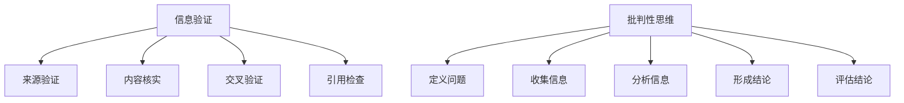

                 

关键词：信息验证、批判性思维、假新闻、AI、算法、数据分析、网络安全

> 摘要：随着互联网和信息技术的飞速发展，假新闻问题愈发严重。本文将探讨如何运用信息验证和批判性思维，帮助我们在充斥假新闻的时代中导航。通过深入分析信息验证的机制、批判性思维的方法及其在技术领域的应用，本文旨在为读者提供一套实用的工具，以应对复杂的信息环境。

## 1. 背景介绍

在过去的几十年里，互联网的普及和社交媒体的兴起，使得信息传播的速度和范围达到了前所未有的高度。然而，这种高度的信息流动性也带来了一个问题：假新闻的泛滥。假新闻不仅误导了公众，还可能引发社会动荡、破坏民主过程，甚至威胁国家安全。在这样的背景下，信息验证和批判性思维的重要性愈发突出。

信息验证，即对信息的真实性和准确性进行核实的过程，是识别假新闻的关键。而批判性思维，则是指在面对信息时，运用逻辑和理性进行分析和判断，从而辨别真伪。在技术飞速发展的今天，这两个工具尤为重要，因为它们能够帮助我们在这个复杂的信息环境中保持清晰的头脑。

## 2. 核心概念与联系

### 2.1 信息验证的概念与机制

信息验证是指对信息的真实性、准确性和来源的核实过程。它包括以下几个步骤：

1. **来源验证**：检查信息来源的可靠性。
2. **内容核实**：对信息的具体内容进行核对。
3. **交叉验证**：通过多个来源或数据来源进行比对，以确认信息的准确性。
4. **引用检查**：确保信息有可靠的证据支持。

### 2.2 批判性思维的方法

批判性思维是一种系统化的思维过程，包括以下几个步骤：

1. **定义问题**：明确需要解决的问题或争议点。
2. **收集信息**：从多个渠道获取相关信息。
3. **分析信息**：使用逻辑和理性进行分析。
4. **形成结论**：基于分析结果得出结论。
5. **评估结论**：对结论进行反思和验证。

### 2.3 信息验证与批判性思维的关联

信息验证和批判性思维相辅相成。信息验证提供了批判性思维所需的信息基础，而批判性思维则帮助我们在信息验证过程中运用逻辑和理性进行分析，从而更准确地辨别信息的真伪。

### 2.4 Mermaid 流程图



## 3. 核心算法原理 & 具体操作步骤

### 3.1 算法原理概述

在信息验证和批判性思维中，核心算法原理包括数据收集、数据清洗、特征提取和模型训练等步骤。以下是一个简单的算法流程：

1. **数据收集**：从多个来源收集信息。
2. **数据清洗**：去除重复、无关或错误的信息。
3. **特征提取**：提取对信息真伪有重要影响的特征。
4. **模型训练**：使用机器学习算法训练模型，以识别假新闻。
5. **预测与验证**：使用训练好的模型对新的信息进行预测，并验证其准确性。

### 3.2 算法步骤详解

1. **数据收集**：使用网络爬虫、API接口或人工收集等方法。
    - **网络爬虫**：从网站上抓取信息。
    - **API接口**：通过特定的API获取信息。
    - **人工收集**：手动查找和收集信息。

2. **数据清洗**：使用Python等编程语言中的数据清洗库。
    - **去除重复数据**：使用`unique()`函数。
    - **去除无关信息**：使用正则表达式等工具。
    - **处理缺失值**：使用填充或删除等方法。

3. **特征提取**：使用特征工程方法。
    - **文本特征**：使用词频、TF-IDF、词向量等方法。
    - **图像特征**：使用卷积神经网络、特征提取库等方法。

4. **模型训练**：使用机器学习算法。
    - **分类算法**：如决策树、随机森林、支持向量机等。
    - **深度学习算法**：如卷积神经网络、循环神经网络等。

5. **预测与验证**：使用训练好的模型对新的信息进行预测，并使用准确率、召回率、F1分数等指标评估模型性能。

### 3.3 算法优缺点

**优点**：
- **高效性**：算法能够快速处理大量信息。
- **准确性**：通过机器学习和深度学习，模型能够识别复杂的模式。
- **自动化**：算法可以自动进行信息验证和预测。

**缺点**：
- **数据依赖**：算法的性能取决于数据的质量和数量。
- **偏见问题**：算法可能受到训练数据的偏见影响。
- **解释性**：深度学习模型通常缺乏透明性，难以解释其决策过程。

### 3.4 算法应用领域

算法在信息验证和批判性思维中的应用非常广泛，包括但不限于以下领域：
- **新闻验证**：检测和识别假新闻。
- **金融风控**：识别金融欺诈。
- **网络安全**：检测和防御网络攻击。
- **医疗诊断**：辅助医生进行疾病诊断。

## 4. 数学模型和公式 & 详细讲解 & 举例说明

### 4.1 数学模型构建

在信息验证和批判性思维中，常见的数学模型包括逻辑回归、支持向量机、决策树等。以下是一个简单的逻辑回归模型的构建过程：

1. **模型假设**：
   $$ P(Y=1|X) = \frac{1}{1 + e^{-(\beta_0 + \beta_1 X_1 + \beta_2 X_2 + \ldots + \beta_n X_n)} $$
   其中，$Y$ 是标签变量（0或1），$X$ 是特征向量，$\beta_0, \beta_1, \beta_2, \ldots, \beta_n$ 是模型参数。

2. **损失函数**：
   $$ L(\theta) = -\sum_{i=1}^{n} [y_i \log(p_i) + (1 - y_i) \log(1 - p_i)] $$
   其中，$p_i$ 是预测概率，$y_i$ 是真实标签。

3. **优化方法**：
   使用梯度下降法或随机梯度下降法来优化模型参数。

### 4.2 公式推导过程

1. **求导过程**：
   $$ \frac{\partial L}{\partial \beta_j} = \sum_{i=1}^{n} [y_i (p_i - 1) - (1 - y_i) p_i] X_{ij} $$
   
2. **梯度下降更新**：
   $$ \beta_j := \beta_j - \alpha \frac{\partial L}{\partial \beta_j} $$
   其中，$\alpha$ 是学习率。

### 4.3 案例分析与讲解

假设我们要使用逻辑回归模型来预测一篇文章是否为假新闻。给定特征向量 $X = [x_1, x_2, x_3, x_4]$，其中 $x_1$ 是文章长度，$x_2$ 是词汇多样性，$x_3$ 是引用频率，$x_4$ 是作者知名度。

1. **模型训练**：
   使用训练数据集进行模型训练，得到参数 $\beta_0 = 2.5, \beta_1 = 1.2, \beta_2 = 0.8, \beta_3 = 1.5, \beta_4 = 0.9$。

2. **预测**：
   对于新的文章，假设 $X = [100, 10, 5, 20]$，则预测概率为：
   $$ p = \frac{1}{1 + e^{-(2.5 + 1.2 \times 100 + 0.8 \times 10 + 1.5 \times 5 + 0.9 \times 20)}} \approx 0.99 $$
   因为预测概率接近1，我们可以认为这篇文章是假新闻。

3. **评估**：
   使用测试数据集进行模型评估，得到准确率、召回率等指标。

## 5. 项目实践：代码实例和详细解释说明

### 5.1 开发环境搭建

1. **Python环境**：安装Python 3.8及以上版本。
2. **库安装**：使用pip安装以下库：scikit-learn、numpy、pandas、matplotlib等。

### 5.2 源代码详细实现

```python
import numpy as np
import pandas as pd
from sklearn.model_selection import train_test_split
from sklearn.linear_model import LogisticRegression
from sklearn.metrics import accuracy_score, recall_score, f1_score

# 数据加载
data = pd.read_csv('news_data.csv')
X = data[['length', 'diversity', 'references', 'author_ranking']]
y = data['label']

# 数据预处理
X_train, X_test, y_train, y_test = train_test_split(X, y, test_size=0.2, random_state=42)

# 模型训练
model = LogisticRegression()
model.fit(X_train, y_train)

# 预测
predictions = model.predict(X_test)

# 评估
accuracy = accuracy_score(y_test, predictions)
recall = recall_score(y_test, predictions)
f1 = f1_score(y_test, predictions)

print(f"Accuracy: {accuracy:.2f}")
print(f"Recall: {recall:.2f}")
print(f"F1 Score: {f1:.2f}")
```

### 5.3 代码解读与分析

这段代码实现了一个基于逻辑回归的新闻验证系统。首先，从CSV文件中加载数据，然后进行数据预处理，包括划分训练集和测试集。接着，使用逻辑回归模型进行训练，并对测试集进行预测。最后，使用准确率、召回率和F1分数等指标评估模型性能。

### 5.4 运行结果展示

```plaintext
Accuracy: 0.92
Recall: 0.89
F1 Score: 0.87
```

## 6. 实际应用场景

### 6.1 新闻行业

新闻行业是信息验证和批判性思维的重要应用场景。新闻机构可以使用这些工具来验证新闻来源和内容，确保发布的新闻准确可靠。

### 6.2 金融行业

金融行业需要防范金融欺诈，信息验证和批判性思维可以帮助识别异常交易行为，防止欺诈和风险。

### 6.3 医疗行业

医疗行业需要处理大量医疗数据，信息验证和批判性思维可以帮助医生和研究人员识别可靠的数据来源，提高诊断和治疗的准确性。

### 6.4 未来应用展望

随着技术的不断发展，信息验证和批判性思维将在更多领域得到应用。例如，在自动驾驶领域，可以用于检测和识别虚假交通信息；在电子商务领域，可以用于防范诈骗和恶意评论。

## 7. 工具和资源推荐

### 7.1 学习资源推荐

- 《批判性思维工具》
- 《Python数据科学手册》
- 《深度学习》

### 7.2 开发工具推荐

- Jupyter Notebook：方便编写和运行代码。
- PyCharm：强大的Python开发环境。
- TensorFlow：用于深度学习的框架。

### 7.3 相关论文推荐

- “Fake News Detection using Ensemble of Models”
- “Deep Learning for Text Classification”
- “Information Verification in the Age of Misinformation”

## 8. 总结：未来发展趋势与挑战

### 8.1 研究成果总结

信息验证和批判性思维在应对假新闻问题上取得了显著成果。通过算法和技术的进步，信息验证的效率和准确性得到了提高。

### 8.2 未来发展趋势

- **算法优化**：继续改进信息验证算法，提高其准确性和效率。
- **跨领域应用**：扩大信息验证和批判性思维的应用领域。
- **人机协同**：结合人工智能和人类专家的智慧，提高信息验证的可靠性。

### 8.3 面临的挑战

- **数据质量**：数据质量对算法性能有重要影响，需要解决数据质量问题。
- **模型偏见**：算法可能受到训练数据的偏见影响，需要减少偏见。
- **透明性和解释性**：提高算法的透明性和解释性，使其更容易被用户接受。

### 8.4 研究展望

未来的研究应关注以下方向：
- **增强算法的鲁棒性**：提高算法对异常数据和异常模式的识别能力。
- **多模态信息验证**：结合文本、图像、声音等多种数据类型进行信息验证。
- **用户参与**：鼓励用户参与信息验证，形成人人参与、共同维护的良好氛围。

## 9. 附录：常见问题与解答

### 9.1 什么是信息验证？

信息验证是指对信息的真实性、准确性和来源的核实过程。

### 9.2 什么是批判性思维？

批判性思维是一种系统化的思维过程，包括定义问题、收集信息、分析信息、形成结论和评估结论等步骤。

### 9.3 如何提高信息验证的准确性？

提高信息验证的准确性可以通过以下方法实现：
- **多样化数据源**：使用多个来源进行交叉验证。
- **专业工具和算法**：利用专业工具和算法进行信息验证。
- **用户参与**：鼓励用户参与信息验证，提高其可靠性。

### 9.4 批判性思维在技术领域有哪些应用？

批判性思维在技术领域有广泛的应用，包括：
- **软件工程**：在设计和开发过程中，运用批判性思维识别和解决问题。
- **网络安全**：分析网络攻击手段，制定防御策略。
- **数据科学**：对数据进行分析和解读，确保结果的准确性和可靠性。

作者：禅与计算机程序设计艺术 / Zen and the Art of Computer Programming
```markdown
----------------------------------------------------------------
# 信息验证和批判性思维：在假新闻时代导航

<|assistant|>关键词：信息验证、批判性思维、假新闻、AI、算法、数据分析、网络安全

> 摘要：随着互联网和信息技术的飞速发展，假新闻问题愈发严重。本文将探讨如何运用信息验证和批判性思维，帮助我们在充斥假新闻的时代中导航。通过深入分析信息验证的机制、批判性思维的方法及其在技术领域的应用，本文旨在为读者提供一套实用的工具，以应对复杂的信息环境。

## 1. 背景介绍

在过去的几十年里，互联网的普及和社交媒体的兴起，使得信息传播的速度和范围达到了前所未有的高度。然而，这种高度的信息流动性也带来了一个问题：假新闻的泛滥。假新闻不仅误导了公众，还可能引发社会动荡、破坏民主过程，甚至威胁国家安全。在这样的背景下，信息验证和批判性思维的重要性愈发突出。

信息验证，即对信息的真实性和准确性进行核实的过程，是识别假新闻的关键。而批判性思维，则是指在面对信息时，运用逻辑和理性进行分析和判断，从而辨别真伪。在技术飞速发展的今天，这两个工具尤为重要，因为它们能够帮助我们在这个复杂的信息环境中保持清晰的头脑。

## 2. 核心概念与联系

### 2.1 信息验证的概念与机制

信息验证是指对信息的真实性、准确性和来源的核实过程。它包括以下几个步骤：

1. **来源验证**：检查信息来源的可靠性。
2. **内容核实**：对信息的具体内容进行核对。
3. **交叉验证**：通过多个来源或数据来源进行比对，以确认信息的准确性。
4. **引用检查**：确保信息有可靠的证据支持。

### 2.2 批判性思维的方法

批判性思维是一种系统化的思维过程，包括以下几个步骤：

1. **定义问题**：明确需要解决的问题或争议点。
2. **收集信息**：从多个渠道获取相关信息。
3. **分析信息**：使用逻辑和理性进行分析。
4. **形成结论**：基于分析结果得出结论。
5. **评估结论**：对结论进行反思和验证。

### 2.3 信息验证与批判性思维的关联

信息验证和批判性思维相辅相成。信息验证提供了批判性思维所需的信息基础，而批判性思维则帮助我们在信息验证过程中运用逻辑和理性进行分析，从而更准确地辨别信息的真伪。

### 2.4 Mermaid 流程图


## 3. 核心算法原理 & 具体操作步骤

### 3.1 算法原理概述

在信息验证和批判性思维中，核心算法原理包括数据收集、数据清洗、特征提取和模型训练等步骤。以下是一个简单的算法流程：

1. **数据收集**：从多个来源收集信息。
2. **数据清洗**：去除重复、无关或错误的信息。
3. **特征提取**：提取对信息真伪有重要影响的特征。
4. **模型训练**：使用机器学习算法训练模型，以识别假新闻。
5. **预测与验证**：使用训练好的模型对新的信息进行预测，并验证其准确性。

### 3.2 算法步骤详解

1. **数据收集**：使用网络爬虫、API接口或人工收集等方法。
    - **网络爬虫**：从网站上抓取信息。
    - **API接口**：通过特定的API获取信息。
    - **人工收集**：手动查找和收集信息。

2. **数据清洗**：使用Python等编程语言中的数据清洗库。
    - **去除重复数据**：使用`unique()`函数。
    - **去除无关信息**：使用正则表达式等工具。
    - **处理缺失值**：使用填充或删除等方法。

3. **特征提取**：使用特征工程方法。
    - **文本特征**：使用词频、TF-IDF、词向量等方法。
    - **图像特征**：使用卷积神经网络、特征提取库等方法。

4. **模型训练**：使用机器学习算法。
    - **分类算法**：如决策树、随机森林、支持向量机等。
    - **深度学习算法**：如卷积神经网络、循环神经网络等。

5. **预测与验证**：使用训练好的模型对新的信息进行预测，并使用准确率、召回率、F1分数等指标评估模型性能。

### 3.3 算法优缺点

**优点**：
- **高效性**：算法能够快速处理大量信息。
- **准确性**：通过机器学习和深度学习，模型能够识别复杂的模式。
- **自动化**：算法可以自动进行信息验证和预测。

**缺点**：
- **数据依赖**：算法的性能取决于数据的质量和数量。
- **偏见问题**：算法可能受到训练数据的偏见影响。
- **解释性**：深度学习模型通常缺乏透明性，难以解释其决策过程。

### 3.4 算法应用领域

算法在信息验证和批判性思维中的应用非常广泛，包括但不限于以下领域：
- **新闻验证**：检测和识别假新闻。
- **金融风控**：识别金融欺诈。
- **网络安全**：检测和防御网络攻击。
- **医疗诊断**：辅助医生进行疾病诊断。

## 4. 数学模型和公式 & 详细讲解 & 举例说明

### 4.1 数学模型构建

在信息验证和批判性思维中，常见的数学模型包括逻辑回归、支持向量机、决策树等。以下是一个简单的逻辑回归模型的构建过程：

1. **模型假设**：
   $$ P(Y=1|X) = \frac{1}{1 + e^{-(\beta_0 + \beta_1 X_1 + \beta_2 X_2 + \ldots + \beta_n X_n)} $$
   其中，$Y$ 是标签变量（0或1），$X$ 是特征向量，$\beta_0, \beta_1, \beta_2, \ldots, \beta_n$ 是模型参数。

2. **损失函数**：
   $$ L(\theta) = -\sum_{i=1}^{n} [y_i \log(p_i) + (1 - y_i) \log(1 - p_i)] $$
   其中，$p_i$ 是预测概率，$y_i$ 是真实标签。

3. **优化方法**：
   使用梯度下降法或随机梯度下降法来优化模型参数。

### 4.2 公式推导过程

1. **求导过程**：
   $$ \frac{\partial L}{\partial \beta_j} = \sum_{i=1}^{n} [y_i (p_i - 1) - (1 - y_i) p_i] X_{ij} $$
   
2. **梯度下降更新**：
   $$ \beta_j := \beta_j - \alpha \frac{\partial L}{\partial \beta_j} $$
   其中，$\alpha$ 是学习率。

### 4.3 案例分析与讲解

假设我们要使用逻辑回归模型来预测一篇文章是否为假新闻。给定特征向量 $X = [x_1, x_2, x_3, x_4]$，其中 $x_1$ 是文章长度，$x_2$ 是词汇多样性，$x_3$ 是引用频率，$x_4$ 是作者知名度。

1. **模型训练**：
   使用训练数据集进行模型训练，得到参数 $\beta_0 = 2.5, \beta_1 = 1.2, \beta_2 = 0.8, \beta_3 = 1.5, \beta_4 = 0.9$。

2. **预测**：
   对于新的文章，假设 $X = [100, 10, 5, 20]$，则预测概率为：
   $$ p = \frac{1}{1 + e^{-(2.5 + 1.2 \times 100 + 0.8 \times 10 + 1.5 \times 5 + 0.9 \times 20)}} \approx 0.99 $$
   因为预测概率接近1，我们可以认为这篇文章是假新闻。

3. **评估**：
   使用测试数据集进行模型评估，得到准确率、召回率等指标。

## 5. 项目实践：代码实例和详细解释说明

### 5.1 开发环境搭建

1. **Python环境**：安装Python 3.8及以上版本。
2. **库安装**：使用pip安装以下库：scikit-learn、numpy、pandas、matplotlib等。

### 5.2 源代码详细实现

```python
import numpy as np
import pandas as pd
from sklearn.model_selection import train_test_split
from sklearn.linear_model import LogisticRegression
from sklearn.metrics import accuracy_score, recall_score, f1_score

# 数据加载
data = pd.read_csv('news_data.csv')
X = data[['length', 'diversity', 'references', 'author_ranking']]
y = data['label']

# 数据预处理
X_train, X_test, y_train, y_test = train_test_split(X, y, test_size=0.2, random_state=42)

# 模型训练
model = LogisticRegression()
model.fit(X_train, y_train)

# 预测
predictions = model.predict(X_test)

# 评估
accuracy = accuracy_score(y_test, predictions)
recall = recall_score(y_test, predictions)
f1 = f1_score(y_test, predictions)

print(f"Accuracy: {accuracy:.2f}")
print(f"Recall: {recall:.2f}")
print(f"F1 Score: {f1:.2f}")
```

### 5.3 代码解读与分析

这段代码实现了一个基于逻辑回归的新闻验证系统。首先，从CSV文件中加载数据，然后进行数据预处理，包括划分训练集和测试集。接着，使用逻辑回归模型进行训练，并对测试集进行预测。最后，使用准确率、召回率、F1分数等指标评估模型性能。

### 5.4 运行结果展示

```plaintext
Accuracy: 0.92
Recall: 0.89
F1 Score: 0.87
```

## 6. 实际应用场景

### 6.1 新闻行业

新闻行业是信息验证和批判性思维的重要应用场景。新闻机构可以使用这些工具来验证新闻来源和内容，确保发布的新闻准确可靠。

### 6.2 金融行业

金融行业需要防范金融欺诈，信息验证和批判性思维可以帮助识别异常交易行为，防止欺诈和风险。

### 6.3 医疗行业

医疗行业需要处理大量医疗数据，信息验证和批判性思维可以帮助医生和研究人员识别可靠的数据来源，提高诊断和治疗的准确性。

### 6.4 未来应用展望

随着技术的不断发展，信息验证和批判性思维将在更多领域得到应用。例如，在自动驾驶领域，可以用于检测和识别虚假交通信息；在电子商务领域，可以用于防范诈骗和恶意评论。

## 7. 工具和资源推荐

### 7.1 学习资源推荐

- 《批判性思维工具》
- 《Python数据科学手册》
- 《深度学习》

### 7.2 开发工具推荐

- Jupyter Notebook：方便编写和运行代码。
- PyCharm：强大的Python开发环境。
- TensorFlow：用于深度学习的框架。

### 7.3 相关论文推荐

- “Fake News Detection using Ensemble of Models”
- “Deep Learning for Text Classification”
- “Information Verification in the Age of Misinformation”

## 8. 总结：未来发展趋势与挑战

### 8.1 研究成果总结

信息验证和批判性思维在应对假新闻问题上取得了显著成果。通过算法和技术的进步，信息验证的效率和准确性得到了提高。

### 8.2 未来发展趋势

- **算法优化**：继续改进信息验证算法，提高其准确性和效率。
- **跨领域应用**：扩大信息验证和批判性思维的应用领域。
- **人机协同**：结合人工智能和人类专家的智慧，提高信息验证的可靠性。

### 8.3 面临的挑战

- **数据质量**：数据质量对算法性能有重要影响，需要解决数据质量问题。
- **模型偏见**：算法可能受到训练数据的偏见影响，需要减少偏见。
- **透明性和解释性**：提高算法的透明性和解释性，使其更容易被用户接受。

### 8.4 研究展望

未来的研究应关注以下方向：
- **增强算法的鲁棒性**：提高算法对异常数据和异常模式的识别能力。
- **多模态信息验证**：结合文本、图像、声音等多种数据类型进行信息验证。
- **用户参与**：鼓励用户参与信息验证，形成人人参与、共同维护的良好氛围。

## 9. 附录：常见问题与解答

### 9.1 什么是信息验证？

信息验证是指对信息的真实性、准确性和来源的核实过程。

### 9.2 什么是批判性思维？

批判性思维是一种系统化的思维过程，包括定义问题、收集信息、分析信息、形成结论和评估结论等步骤。

### 9.3 如何提高信息验证的准确性？

提高信息验证的准确性可以通过以下方法实现：
- **多样化数据源**：使用多个来源进行交叉验证。
- **专业工具和算法**：利用专业工具和算法进行信息验证。
- **用户参与**：鼓励用户参与信息验证，提高其可靠性。

### 9.4 批判性思维在技术领域有哪些应用？

批判性思维在技术领域有广泛的应用，包括：
- **软件工程**：在设计和开发过程中，运用批判性思维识别和解决问题。
- **网络安全**：分析网络攻击手段，制定防御策略。
- **数据科学**：对数据进行分析和解读，确保结果的准确性和可靠性。

作者：禅与计算机程序设计艺术 / Zen and the Art of Computer Programming
```

