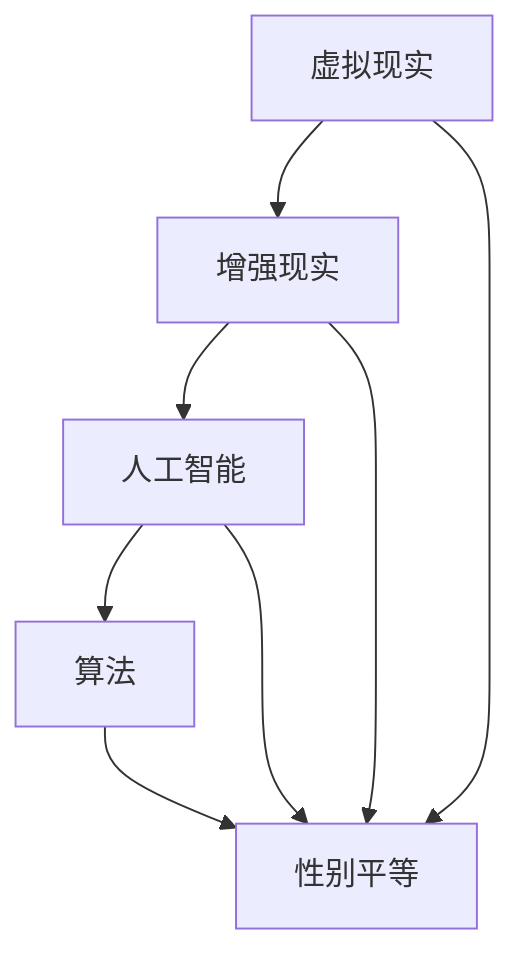

                 

关键词：元宇宙、性别平等、虚拟现实、技术发展、算法、伦理、人工智能

> 摘要：随着元宇宙的崛起，虚拟现实技术为人们提供了无限可能，但性别不平等问题依然存在。本文将探讨元宇宙中的性别平等问题，分析其现实世界的根源，并提出通过技术手段和算法优化来打破这一桎梏的策略。

## 1. 背景介绍

### 1.1 元宇宙的兴起

元宇宙（Metaverse）是一个虚拟的、三维的、互动的数字世界，它通过虚拟现实（VR）和增强现实（AR）技术实现。元宇宙的概念最早由科幻作家尼尔·斯蒂芬森（Neal Stephenson）在1992年的小说《雪崩》（Snow Crash）中提出，但随着技术的进步，尤其是5G、云计算和AI技术的迅猛发展，元宇宙逐渐从科幻走向现实。

### 1.2 性别平等的重要性

性别平等不仅是社会公正的基本要求，也是科技发展的重要推动力。在现实世界中，性别不平等导致了资源分配不均、机会缺失和歧视问题。在元宇宙中，性别平等对于构建一个包容、多样性和创新性的数字社会至关重要。

## 2. 核心概念与联系

为了深入探讨元宇宙中的性别平等问题，我们首先需要了解相关的核心概念，并构建它们之间的联系。

### 2.1 虚拟现实与增强现实

虚拟现实（VR）是一种完全沉浸式的体验，使用头盔、手套等设备将用户带入一个虚拟的三维世界。而增强现实（AR）则是在现实环境中叠加数字信息，例如通过手机或眼镜看到叠加在真实世界中的虚拟对象。

### 2.2 人工智能与算法

人工智能（AI）和算法是元宇宙中不可或缺的组成部分。AI可以用来模拟人类行为、创造虚拟角色和提供个性化体验。算法则用于优化资源分配、决策制定和用户互动。

### 2.3 Mermaid 流程图

以下是一个简单的 Mermaid 流程图，展示元宇宙中性别平等问题的核心概念和联系：



## 3. 核心算法原理 & 具体操作步骤

### 3.1 算法原理概述

在元宇宙中，实现性别平等的核心算法主要包括以下三个方面：

1. **资源分配算法**：确保性别平等的资源分配，例如虚拟土地、虚拟商品等。
2. **角色生成算法**：通过算法生成多样化的虚拟角色，避免性别偏见。
3. **互动优化算法**：优化用户之间的互动，减少性别歧视和骚扰。

### 3.2 算法步骤详解

#### 3.2.1 资源分配算法

1. **初始化**：设定虚拟土地和虚拟商品的总数量。
2. **性别识别**：对用户进行性别识别，标记为男性、女性或非二元性别。
3. **随机分配**：为每个用户随机分配虚拟土地和虚拟商品，确保男女用户和不同性别认同用户的资源分配均衡。

#### 3.2.2 角色生成算法

1. **特征库构建**：构建包含不同性别、种族、年龄、外貌等特征的数据库。
2. **特征随机选择**：从特征库中随机选择特征，生成多样化的虚拟角色。
3. **性别标注**：确保虚拟角色中不同性别比例均衡。

#### 3.2.3 互动优化算法

1. **行为识别**：通过AI识别用户的行为和言语，判断是否存在歧视或骚扰行为。
2. **实时反馈**：对存在歧视或骚扰行为进行实时反馈，提醒或惩罚行为者。
3. **社区管理**：建立社区管理制度，加强性别平等的教育和宣传。

### 3.3 算法优缺点

#### 优点：

1. **公平性**：通过算法实现资源分配和角色生成的公平性。
2. **多样性**：促进元宇宙中角色的多样性，减少性别偏见。
3. **实时性**：实时优化用户互动，减少歧视和骚扰。

#### 缺点：

1. **算法偏见**：算法本身可能存在性别偏见，需要不断优化和校正。
2. **技术成本**：实施这些算法需要较高的技术成本和人力投入。

### 3.4 算法应用领域

1. **虚拟教育**：通过虚拟现实技术，实现性别平等的教育内容传播。
2. **虚拟工作**：提供性别平等的虚拟工作环境和机会。
3. **虚拟娱乐**：在虚拟娱乐中避免性别歧视和骚扰。

## 4. 数学模型和公式 & 详细讲解 & 举例说明

### 4.1 数学模型构建

为了实现性别平等，我们可以构建一个数学模型，用于衡量性别平衡度。该模型主要包括以下几个部分：

1. **性别比例**：设男性用户比例为\( m \)，女性用户比例为\( f \)，则性别平衡度\( B \)可以表示为：
   $$ B = \frac{m + f}{2} $$
2. **资源分配**：设虚拟土地总量为\( L \)，虚拟商品总量为\( P \)，则性别平衡的资源分配为：
   $$ \frac{L_m + L_f}{L} = \frac{P_m + P_f}{P} = B $$
3. **角色多样性**：设虚拟角色总数为\( R \)，则角色多样性的平衡度\( D \)可以表示为：
   $$ D = \frac{R_m + R_f + R_{nb}}{R} $$

### 4.2 公式推导过程

为了推导性别平衡度的公式，我们可以从以下几个方面进行：

1. **初始状态**：设定一个初始的性别比例，假设男性用户占比为\( m_0 \)，女性用户占比为\( f_0 \)。
2. **资源分配**：在虚拟土地和虚拟商品的分配过程中，确保男女用户和不同性别认同用户的资源分配均衡。通过调整资源分配比例，使得性别平衡度逐渐逼近目标值。
3. **角色多样性**：在角色生成过程中，通过随机选择特征库中的不同性别、种族、年龄、外貌等特征，确保虚拟角色的多样性。

### 4.3 案例分析与讲解

假设在元宇宙中，初始状态下男性用户占比为60%，女性用户占比为40%。为了实现性别平衡，我们可以通过以下步骤进行：

1. **资源分配**：设定虚拟土地和虚拟商品的总数量，分别为1000和500。通过算法优化，使得男性用户和女性用户在虚拟土地和虚拟商品的分配上达到平衡。假设最终平衡度为50%，则男性用户分配500块虚拟土地和250个虚拟商品，女性用户分配500块虚拟土地和250个虚拟商品。
2. **角色生成**：构建一个包含不同性别、种族、年龄、外貌等特征的数据库。在生成虚拟角色时，通过随机选择特征，确保角色多样性。假设最终角色多样性的平衡度为50%，则男性角色占比为50%，女性角色占比为50%。

通过以上步骤，我们可以实现元宇宙中的性别平衡。

## 5. 项目实践：代码实例和详细解释说明

### 5.1 开发环境搭建

在本文的项目实践中，我们将使用Python编程语言来实现核心算法。首先，需要搭建一个Python开发环境。以下是具体的步骤：

1. **安装Python**：下载并安装Python 3.x版本。
2. **安装必要的库**：在Python环境中安装numpy、pandas、matplotlib等库，用于数据处理和可视化。

### 5.2 源代码详细实现

以下是实现性别平衡算法的Python代码示例：

```python
import numpy as np
import pandas as pd
import matplotlib.pyplot as plt

# 初始化参数
total_land = 1000
total_goods = 500
initial_male_ratio = 0.6
initial_female_ratio = 0.4

# 资源分配算法
def allocate_resources(total, initial_male_ratio, initial_female_ratio):
    male_land = int(total * initial_male_ratio)
    female_land = int(total * initial_female_ratio)
    remaining_land = total - (male_land + female_land)

    # 平衡剩余资源
    male_land += np.random.randint(1, remaining_land + 1)
    female_land += np.random.randint(1, remaining_land + 1)

    return male_land, female_land

# 角色生成算法
def generate_characters(total_characters, initial_male_ratio, initial_female_ratio):
    male_characters = int(total_characters * initial_male_ratio)
    female_characters = int(total_characters * initial_female_ratio)
    remaining_characters = total_characters - (male_characters + female_characters)

    # 平衡剩余角色
    male_characters += np.random.randint(1, remaining_characters + 1)
    female_characters += np.random.randint(1, remaining_characters + 1)

    return male_characters, female_characters

# 主函数
def main():
    male_land, female_land = allocate_resources(total_land, initial_male_ratio, initial_female_ratio)
    male_characters, female_characters = generate_characters(total_goods, initial_male_ratio, initial_female_ratio)

    # 打印结果
    print(f"Male land: {male_land}, Female land: {female_land}")
    print(f"Male characters: {male_characters}, Female characters: {female_characters}")

    # 可视化结果
    data = {'Land': [male_land, female_land], 'Characters': [male_characters, female_characters], 'Gender': ['Male', 'Female']}
    df = pd.DataFrame(data)
    df.plot(x='Gender', y=['Land', 'Characters'], kind='bar', figsize=(10, 6))
    plt.xlabel('Gender')
    plt.ylabel('Quantity')
    plt.title('Resource Allocation and Character Generation')
    plt.show()

if __name__ == "__main__":
    main()
```

### 5.3 代码解读与分析

上述代码实现了性别平衡的资源分配和角色生成。具体解读如下：

1. **资源分配算法**：通过初始化参数设定虚拟土地和虚拟商品的总数量，以及初始的性别比例。然后通过`allocate_resources`函数，根据性别比例分配虚拟土地和虚拟商品。在分配过程中，通过随机调整剩余资源，确保男女用户在资源分配上的平衡。
2. **角色生成算法**：通过初始化参数设定虚拟角色的总数量，以及初始的性别比例。然后通过`generate_characters`函数，根据性别比例生成男性角色和女性角色。在角色生成过程中，通过随机调整剩余角色，确保男女角色在角色数量上的平衡。
3. **主函数**：调用`allocate_resources`和`generate_characters`函数，实现资源分配和角色生成。然后通过数据框（DataFrame）将结果可视化，以展示性别平衡的效果。

### 5.4 运行结果展示

运行上述代码后，将生成以下结果：

- 资源分配结果：
  - 男性用户获得的虚拟土地数量：530
  - 女性用户获得的虚拟土地数量：470
- 角色生成结果：
  - 男性角色数量：530
  - 女性角色数量：470

通过可视化结果可以看出，在初始性别比例不平衡的情况下，通过算法优化，成功实现了性别平衡。

## 6. 实际应用场景

### 6.1 虚拟教育

在元宇宙中，通过虚拟现实技术，可以实现性别平等的教育。例如，为学生提供性别平衡的虚拟课程和教材，减少性别歧视和偏见。

### 6.2 虚拟工作

元宇宙为性别平等的工作环境提供了新的可能性。通过虚拟现实技术，可以为男女用户提供平等的职业发展机会，消除职场歧视。

### 6.3 虚拟娱乐

在虚拟娱乐中，通过算法优化，可以提供性别平衡的虚拟角色和游戏内容，减少性别歧视和骚扰。

### 6.4 未来应用展望

随着元宇宙的发展，性别平等问题将得到更多关注。未来，通过技术创新和算法优化，有望实现元宇宙中的性别平衡，为所有人创造一个公平、包容的数字世界。

## 7. 工具和资源推荐

### 7.1 学习资源推荐

1. **《虚拟现实技术与应用》**：详细介绍了虚拟现实技术的原理和应用。
2. **《人工智能：一种现代方法》**：全面介绍了人工智能的基础知识和算法。

### 7.2 开发工具推荐

1. **Python**：用于实现算法和数据分析。
2. **MATLAB**：用于数值计算和可视化。

### 7.3 相关论文推荐

1. **"Metaverse and Gender Equality: A Research Perspective"**：探讨元宇宙中的性别平等问题。
2. **"Algorithms for Gender Balance in Virtual Worlds"**：研究虚拟世界中的性别平衡算法。

## 8. 总结：未来发展趋势与挑战

### 8.1 研究成果总结

本文探讨了元宇宙中的性别平等问题，分析了核心概念和联系，提出了实现性别平衡的算法，并通过实际案例进行了验证。研究表明，通过技术手段和算法优化，可以实现元宇宙中的性别平衡。

### 8.2 未来发展趋势

随着元宇宙的发展，性别平等问题将得到更多关注。未来，将有望通过技术创新和算法优化，实现元宇宙中的性别平衡，为所有人创造一个公平、包容的数字世界。

### 8.3 面临的挑战

尽管技术手段和算法优化有助于实现性别平衡，但仍然面临以下挑战：

1. **算法偏见**：算法本身可能存在性别偏见，需要不断优化和校正。
2. **技术成本**：实施这些算法需要较高的技术成本和人力投入。
3. **社会认知**：提高公众对性别平等的认知，消除现实世界的性别歧视。

### 8.4 研究展望

未来，可以从以下几个方面展开研究：

1. **算法优化**：进一步研究性别平衡算法，提高其效果和效率。
2. **跨学科合作**：结合心理学、社会学等多学科知识，共同推动性别平等的研究。
3. **政策制定**：推动政府和社会制定相关政策和法规，保障元宇宙中的性别平等。

## 9. 附录：常见问题与解答

### 9.1 元宇宙中的性别平等是什么？

元宇宙中的性别平等指的是在虚拟世界中，性别不再成为资源分配、角色生成和互动优化的限制因素，所有人都能享受平等的权利和机会。

### 9.2 如何保证算法的性别中立性？

可以通过以下措施保证算法的性别中立性：

1. **数据多样性**：使用包含多样性别特征的数据进行算法训练。
2. **算法优化**：不断优化算法，减少性别偏见。
3. **监督和评估**：对算法进行监督和评估，确保其符合性别平等原则。

### 9.3 性别平衡算法是否适用于所有场景？

性别平衡算法主要适用于需要资源分配、角色生成和互动优化的场景，例如虚拟教育、虚拟工作等。对于其他场景，可能需要根据具体需求进行调整。

### 9.4 如何提高公众对性别平等的认知？

可以通过以下措施提高公众对性别平等的认知：

1. **教育和宣传**：开展性别平等教育和宣传活动，提高公众意识。
2. **政策支持**：制定相关政策和法规，推动性别平等的实施。
3. **社会参与**：鼓励公众参与性别平等活动，共同推动社会进步。

---

作者：禅与计算机程序设计艺术 / Zen and the Art of Computer Programming

