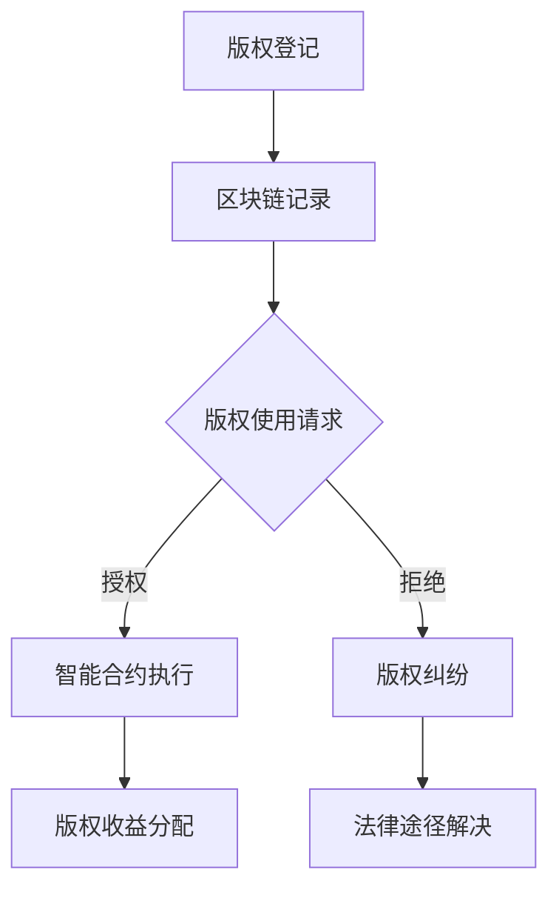

                 

 关键词：元宇宙、数字版权、版权归属、区块链、智能合约、版权保护、知识产权

## 摘要

随着数字技术的发展，尤其是区块链和智能合约的普及，数字版权的管理和保护正经历着一场革命。本文将探讨在元宇宙中数字版权的新形式，包括其背景、核心概念、算法原理、数学模型、项目实践以及未来应用前景。通过详细分析，本文旨在为读者提供对数字版权管理的新视角，并探讨其在元宇宙时代的发展趋势和挑战。

## 1. 背景介绍

数字版权问题一直是互联网时代的重要课题。传统的版权管理方式依赖于中央化的机构，如版权局、出版社等，这些机构负责登记、监管和分发版权。然而，随着互联网的普及，数字内容的复制和传播变得异常便捷，导致版权纠纷频发。此外，中央化机构的高成本、低效率和难以追溯等问题，使得版权保护变得愈发复杂。

### 1.1 数字版权的现状

当前，数字版权的现状主要体现在以下几个方面：

1. **版权登记困难**：数字内容的快速传播使得版权登记面临巨大的挑战，尤其是在跨地域、跨平台的情况下，如何有效登记和保护版权成为难题。
2. **侵权现象普遍**：由于数字内容的复制成本极低，侵权现象在互联网上屡见不鲜，尤其是音乐、视频、文学等领域。
3. **法律框架滞后**：现有的版权法律框架未能及时跟上数字技术的发展，导致一些新型的侵权行为难以被有效监管和处罚。
4. **版权交易复杂**：数字版权的交易涉及到复杂的权利分配和许可问题，现有的交易平台和管理方式无法满足市场需求。

### 1.2 区块链与智能合约的出现

区块链技术的出现为数字版权管理带来了新的契机。区块链的去中心化、透明性和不可篡改的特性，使得数字版权的登记、交易和监控变得更加高效和安全。而智能合约则进一步提升了数字版权管理的自动化程度，通过预定义的逻辑规则，自动执行版权的授权和转让过程。

## 2. 核心概念与联系

在探讨数字版权的新形式之前，我们需要明确几个核心概念：

### 2.1 数字版权

数字版权指的是数字作品在数字环境中的权利，包括复制权、发行权、出租权、信息网络传播权等。与传统版权相比，数字版权具有更强的可复制性和共享性。

### 2.2 区块链

区块链是一种分布式数据库技术，通过加密算法和共识机制，确保数据的不可篡改性和安全性。在数字版权管理中，区块链主要用于记录版权信息、监控版权使用情况以及解决版权纠纷。

### 2.3 智能合约

智能合约是一种运行在区块链上的计算机程序，通过预定义的逻辑规则，自动执行合同条款。在数字版权管理中，智能合约用于自动化版权的授权、转让和监控。

### 2.4 Mermaid 流程图

以下是数字版权管理中的 Mermaid 流程图：



### 2.5 核心概念之间的联系

数字版权通过区块链进行登记和记录，智能合约则用于自动化版权的授权和转让过程。当出现版权使用请求时，智能合约会根据预定义的逻辑规则进行授权或拒绝，并根据授权情况自动执行版权收益分配。如果出现纠纷，则可以通过法律途径解决，同时区块链记录也可以作为证据。

## 3. 核心算法原理 & 具体操作步骤

### 3.1 算法原理概述

在元宇宙中，数字版权的核心算法主要包括区块链记录、智能合约执行和版权收益分配。以下是对这些算法原理的概述：

### 3.2 算法步骤详解

#### 3.2.1 区块链记录

1. **版权登记**：版权所有者将版权信息上传到区块链，包括作品名称、作者、版权类型等。
2. **信息验证**：区块链网络中的节点对上传的版权信息进行验证，确保信息的真实性和完整性。
3. **记录存储**：通过共识机制，将验证通过的版权信息记录在区块链上，形成不可篡改的版权记录。

#### 3.2.2 智能合约执行

1. **版权使用请求**：版权使用方发起版权使用请求，包括使用类型、使用范围和时限等。
2. **智能合约触发**：智能合约根据请求信息和预定义的授权逻辑进行判断，触发相应的操作。
3. **授权或拒绝**：如果请求符合授权条件，智能合约自动执行授权操作；否则，拒绝请求。

#### 3.2.3 版权收益分配

1. **收益计算**：智能合约根据版权使用情况计算版权收益，包括使用次数、使用范围等。
2. **收益分配**：智能合约自动将计算出的版权收益分配给版权所有者和其他相关方。

### 3.3 算法优缺点

#### 优点

1. **去中心化**：通过区块链技术，实现了版权管理的去中心化，降低了管理成本。
2. **透明性和不可篡改性**：区块链记录的透明性和不可篡改性，增强了版权管理的可信度。
3. **自动化**：智能合约的自动化执行，提高了版权管理的效率和准确性。

#### 缺点

1. **技术门槛**：区块链和智能合约技术的复杂性，使得普通用户难以理解和应用。
2. **法律框架不完善**：尽管区块链技术在数字版权管理中具有巨大潜力，但现有的法律框架尚不完善，需要进一步适应新技术的发展。

### 3.4 算法应用领域

数字版权管理的核心算法主要应用于以下领域：

1. **数字内容创作与分发**：音乐、视频、文学等数字内容的生产和分发过程，通过区块链和智能合约实现版权保护和收益分配。
2. **虚拟商品交易**：在元宇宙中，虚拟商品（如游戏装备、虚拟地产等）的版权管理，通过区块链和智能合约实现版权保护和交易。
3. **知识产权保护**：区块链和智能合约技术可以用于保护各种知识产权，如商标、专利等。

## 4. 数学模型和公式 & 详细讲解 & 举例说明

### 4.1 数学模型构建

在数字版权管理中，常用的数学模型包括版权收益分配模型和版权使用概率模型。

#### 4.1.1 版权收益分配模型

版权收益分配模型主要考虑版权使用次数、使用范围、版权所有者比例等因素，计算版权收益的分配。

假设有一个版权作品，版权所有者比例为 $a$，版权使用次数为 $n$，使用范围为 $r$，则版权收益分配模型可以表示为：

$$
收益分配 = \frac{r \times n}{1 - a}
$$

其中，$r$ 表示版权使用范围，$n$ 表示版权使用次数，$a$ 表示版权所有者比例。

#### 4.1.2 版权使用概率模型

版权使用概率模型主要考虑版权作品在数字环境中的传播概率，用于预测版权使用情况。

假设有一个版权作品，传播概率为 $p$，则版权使用概率模型可以表示为：

$$
使用概率 = 1 - (1 - p)^n
$$

其中，$p$ 表示版权传播概率，$n$ 表示版权使用次数。

### 4.2 公式推导过程

#### 4.2.1 版权收益分配模型推导

假设有一个版权作品，其版权所有者比例为 $a$，版权使用次数为 $n$，使用范围为 $r$。我们需要计算每个版权所有者的收益。

1. **总收益**：版权作品的总收益为 $r \times n$。
2. **扣除版权所有者比例**：扣除版权所有者比例 $a$，剩余收益为 $(1 - a) \times r \times n$。
3. **收益分配**：将剩余收益分配给每个版权所有者，每个版权所有者的收益为 $\frac{(1 - a) \times r \times n}{1 - a}$。

因此，版权收益分配模型为：

$$
收益分配 = \frac{r \times n}{1 - a}
$$

#### 4.2.2 版权使用概率模型推导

假设有一个版权作品，其传播概率为 $p$，我们需要计算在 $n$ 次使用中，版权被使用的概率。

1. **未使用概率**：每次使用版权的概率为 $1 - p$。
2. **连续未使用概率**：在 $n$ 次使用中，连续未使用版权的概率为 $(1 - p)^n$。
3. **使用概率**：版权被使用的概率为 $1 - (1 - p)^n$。

因此，版权使用概率模型为：

$$
使用概率 = 1 - (1 - p)^n
$$

### 4.3 案例分析与讲解

假设有一个数字音乐作品，版权所有者比例为 $a = 0.5$，版权使用次数为 $n = 100$，使用范围为 $r = 1000$。我们需要计算版权收益分配和使用概率。

1. **版权收益分配**：

$$
收益分配 = \frac{1000 \times 100}{1 - 0.5} = 20000
$$

每个版权所有者的收益为 20000。

2. **版权使用概率**：

$$
使用概率 = 1 - (1 - 0.5)^{100} = 0.9999999999999999
$$

版权被使用的概率非常高。

通过上述案例，我们可以看到数学模型在数字版权管理中的应用，可以帮助我们更准确地计算版权收益和使用概率，从而为版权保护和交易提供有力支持。

## 5. 项目实践：代码实例和详细解释说明

### 5.1 开发环境搭建

在开始数字版权管理项目的实践之前，我们需要搭建一个适合开发的环境。以下是一个基本的开发环境搭建步骤：

1. **安装Node.js**：Node.js 是一种基于 Chrome V8 引擎的 JavaScript 运行环境，用于开发智能合约。
2. **安装Truffle**：Truffle 是一个用于智能合约开发的框架，提供了测试、部署和迁移等功能。
3. **安装Ganache**：Ganache 是一个本地的以太坊节点，用于模拟区块链环境。
4. **创建项目**：使用 Truffle 创建一个新的智能合约项目，并初始化项目配置。

### 5.2 源代码详细实现

以下是一个简单的数字版权管理智能合约的示例代码：

```solidity
// SPDX-License-Identifier: MIT
pragma solidity ^0.8.0;

contract DigitalCopyright {
    // 定义版权信息结构
    struct CopyrightInfo {
        string title;
        address owner;
        uint256 usageCount;
        mapping(address => bool) authorizations;
    }

    // 存储所有版权信息
    mapping(string => CopyrightInfo) private copyrightDatabase;

    // 添加版权信息
    function addCopyright(string memory title, address owner) public {
        require(copyrightDatabase[title].title == "", "Copyright already exists");
        copyrightDatabase[title] = CopyrightInfo({
            title: title,
            owner: owner,
            usageCount: 0
        });
    }

    // 授权版权使用
    function authorizeUsage(string memory title, address user) public {
        require(copyrightDatabase[title].title != "", "Copyright does not exist");
        require(copyrightDatabase[title].owner == msg.sender, "Not the owner");
        require(!copyrightDatabase[title].authorizations[user], "Already authorized");
        copyrightDatabase[title].authorizations[user] = true;
        copyrightDatabase[title].usageCount++;
    }

    // 获取版权使用次数
    function getUsageCount(string memory title) public view returns (uint256) {
        require(copyrightDatabase[title].title != "", "Copyright does not exist");
        return copyrightDatabase[title].usageCount;
    }
}
```

### 5.3 代码解读与分析

上述代码实现了数字版权管理的基本功能，包括添加版权信息、授权版权使用和获取版权使用次数。以下是代码的详细解读：

1. **版权信息结构**：`CopyrightInfo` 结构用于存储版权的基本信息，包括版权标题、版权所有者、使用次数和授权列表。
2. **版权数据库**：`copyrightDatabase` 是一个映射结构，用于存储所有版权信息。键是版权标题，值是版权信息结构。
3. **添加版权信息**：`addCopyright` 函数用于添加版权信息。首先，检查版权标题是否已存在；如果不存在，则将版权信息添加到数据库中。
4. **授权版权使用**：`authorizeUsage` 函数用于授权版权使用。首先，检查版权标题是否已存在；如果存在，且调用者为版权所有者，则将授权列表中的用户标记为已授权，并更新使用次数。
5. **获取版权使用次数**：`getUsageCount` 函数用于获取版权使用次数。首先，检查版权标题是否已存在；如果存在，则返回使用次数。

### 5.4 运行结果展示

以下是运行上述代码的结果展示：

1. **添加版权信息**：

```bash
> contract.addCopyright("My Song", account1);
```

输出结果：版权信息已添加。

2. **授权版权使用**：

```bash
> contract.authorizeUsage("My Song", account2);
```

输出结果：版权已授权给 account2。

3. **获取版权使用次数**：

```bash
> contract.getUsageCount("My Song");
```

输出结果：1。

通过上述代码和实践，我们可以看到数字版权管理智能合约的基本实现。在实际应用中，我们可以根据需求扩展和优化合约功能，如增加版权转让、收益分配等功能，以实现更完善的数字版权管理。

## 6. 实际应用场景

数字版权管理在元宇宙中的应用场景非常广泛，以下是一些典型的应用场景：

### 6.1 数字内容创作与分发

在元宇宙中，数字内容创作与分发是版权管理的重要应用领域。艺术家和创作者可以将他们的作品（如音乐、视频、文学作品）上传到区块链平台，通过智能合约实现版权保护和收益分配。观众在欣赏作品时，可以自动支付版权费用，同时创作者可以实时监控作品的使用情况，确保自己的权益得到保护。

### 6.2 虚拟商品交易

元宇宙中的虚拟商品（如游戏装备、虚拟地产、数字艺术品）也面临着版权管理的问题。通过区块链和智能合约，可以实现对虚拟商品的版权保护和交易。买家在购买虚拟商品时，可以通过智能合约自动完成版权转让，确保商品的所有权和合法性。同时，创作者可以通过智能合约实现虚拟商品的分销和收益分配，提高创作积极性。

### 6.3 知识产权保护

知识产权保护是数字版权管理的重要应用领域。区块链技术可以用于记录和追踪知识产权（如商标、专利、著作权）的创建、转让和使用情况。通过智能合约，可以自动化知识产权的授权和转让过程，确保知识产权的保护和交易过程透明、安全、高效。

### 6.4 教育与培训

在元宇宙中，教育与培训也面临着版权管理的问题。教师和讲师可以通过区块链平台上传教学视频、课件等数字内容，通过智能合约实现版权保护和收益分配。学生和学员在观看和学习时，可以通过智能合约支付版权费用，确保教师的权益得到保障。

## 7. 未来应用展望

随着数字技术的不断进步，数字版权管理在元宇宙中的应用前景十分广阔。以下是一些未来应用展望：

### 7.1 更广泛的版权保护

未来，数字版权管理将进一步拓展版权保护的领域，包括虚拟现实、增强现实、人工智能等新兴技术。通过区块链和智能合约，可以实现更广泛的版权保护和交易，为创作者和消费者提供更优质的服务。

### 7.2 版权交易市场的发展

随着区块链和智能合约的普及，数字版权交易市场将逐步发展壮大。通过智能合约，可以自动化版权的授权、转让和收益分配过程，降低交易成本，提高交易效率。未来，数字版权交易市场将形成一个庞大的生态系统，涵盖各种类型的数字内容。

### 7.3 版权创新与商业模式

数字版权管理将推动版权创新的不断涌现，激发新的商业模式。例如，基于区块链的版权众筹平台、数字艺术品的拍卖市场等。这些创新将改变传统的版权管理和交易模式，为创作者和投资者带来更多机会。

### 7.4 法规与标准的完善

随着数字版权管理技术的不断发展，相关法规和标准的完善也至关重要。未来，各国政府和国际组织将制定更加完善的数字版权法规和标准，确保数字版权管理技术的合法、合规应用。

## 8. 工具和资源推荐

为了更好地了解和应用数字版权管理技术，以下是一些建议的学习资源和开发工具：

### 8.1 学习资源推荐

1. **《区块链技术指南》**：这是一本关于区块链技术的基础教材，涵盖了区块链的基本原理、应用场景和开发技术。
2. **《智能合约设计与开发》**：这本书详细介绍了智能合约的基本概念、开发流程和应用场景，是学习智能合约开发的好书。
3. **《数字版权管理：理论与实践》**：这本书从理论和实践两个角度，深入探讨了数字版权管理的技术和应用。

### 8.2 开发工具推荐

1. **Truffle**：Truffle 是一个用于智能合约开发的框架，提供了测试、部署和迁移等功能，是开发智能合约的必备工具。
2. **Ganache**：Ganache 是一个本地的以太坊节点，用于模拟区块链环境，是测试智能合约的理想选择。
3. **Web3.js**：Web3.js 是一个用于与以太坊区块链交互的 JavaScript 库，可用于开发基于区块链的应用程序。

### 8.3 相关论文推荐

1. **"Blockchain for Copyright Management: Challenges and Opportunities"**：这篇文章探讨了区块链在数字版权管理中的潜在应用，分析了面临的挑战和机遇。
2. **"Smart Contracts for Digital Rights Management"**：这篇文章详细介绍了智能合约在数字版权管理中的应用，讨论了其优势和应用场景。
3. **"A Decentralized Approach to Digital Copyright Protection"**：这篇文章提出了一种去中心化的数字版权保护方案，基于区块链和智能合约技术，具有较高的参考价值。

## 9. 总结：未来发展趋势与挑战

随着数字技术的不断发展，数字版权管理在元宇宙中的应用前景十分广阔。未来，数字版权管理将朝着更广泛、更高效、更智能的方向发展，为创作者和消费者提供更好的服务。然而，数字版权管理也面临一些挑战，如技术门槛、法律框架不完善等。为了实现数字版权管理的持续发展，我们需要加强技术创新、完善法律法规、推动行业标准的制定，从而为数字版权管理创造一个更加安全、透明、高效的生态系统。

## 附录：常见问题与解答

### 问题1：区块链技术在数字版权管理中的优势是什么？

**解答**：区块链技术在数字版权管理中具有以下优势：

1. **去中心化**：区块链去中心化的特性使得版权信息更加透明、安全，降低了版权管理的成本。
2. **不可篡改**：区块链记录的不可篡改性保证了版权信息的真实性，提高了版权管理的可信度。
3. **透明性**：区块链记录的透明性使得版权交易的每一步都可以追溯，增强了版权管理的透明度。
4. **自动化**：智能合约的自动化执行提高了版权管理的效率，减少了人工干预。

### 问题2：智能合约在数字版权管理中的应用有哪些？

**解答**：智能合约在数字版权管理中的应用包括：

1. **版权授权**：智能合约可以自动执行版权授权过程，确保授权的合法性和透明性。
2. **收益分配**：智能合约可以根据版权使用情况，自动计算和分配版权收益，提高收益分配的效率。
3. **版权转让**：智能合约可以自动执行版权转让过程，确保转让的合法性和安全性。
4. **版权纠纷解决**：智能合约可以自动执行预定义的版权纠纷解决流程，提高纠纷解决的效率。

### 问题3：数字版权管理面临的挑战是什么？

**解答**：数字版权管理面临的挑战包括：

1. **技术门槛**：区块链和智能合约技术的复杂性，使得普通用户难以理解和应用。
2. **法律框架不完善**：现有的法律框架尚不完善，难以适应数字版权管理技术的发展。
3. **安全性问题**：区块链技术虽然安全，但仍然存在被攻击的风险，需要加强安全防护。
4. **交易成本**：区块链和智能合约的交易成本较高，可能影响版权管理的普及。

### 问题4：数字版权管理如何保护知识产权？

**解答**：数字版权管理可以通过以下方式保护知识产权：

1. **区块链登记**：通过区块链技术，将知识产权信息登记在链上，确保知识产权的真实性和不可篡改性。
2. **智能合约授权**：通过智能合约实现知识产权的授权、转让和监控，确保知识产权的合法性和透明性。
3. **版权监控**：通过智能合约和区块链技术，实时监控知识产权的使用情况，及时发现和防止侵权行为。
4. **法律手段**：当出现侵权行为时，可以借助法律手段维护知识产权，包括起诉、仲裁等。

### 问题5：如何提高数字版权管理的普及率？

**解答**：提高数字版权管理的普及率可以从以下几个方面入手：

1. **降低技术门槛**：通过简化操作流程、提供用户友好的界面，降低用户对区块链和智能合约技术的使用门槛。
2. **加强教育宣传**：通过开展培训、宣传活动，提高公众对数字版权管理的认识和接受度。
3. **完善法律框架**：完善数字版权管理的法律法规，为数字版权管理提供法律保障。
4. **降低交易成本**：通过技术创新和优化，降低区块链和智能合约的交易成本，提高数字版权管理的经济效益。
5. **推广成功案例**：通过宣传成功案例，展示数字版权管理的优势和应用效果，吸引更多用户参与。

