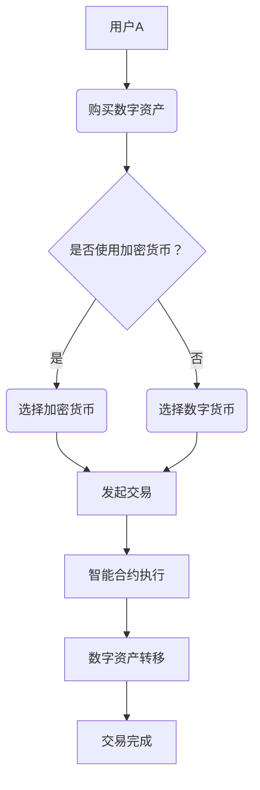

                 

关键词：元宇宙、数字资产、价值交换、区块链、去中心化、加密货币、智能合约

摘要：随着元宇宙概念的兴起，数字资产作为其核心组成部分，正逐渐成为一种全新的价值交换模式。本文将深入探讨元宇宙中的数字资产，包括其定义、分类、区块链技术基础、智能合约应用以及价值交换机制，并对其未来发展进行展望。

## 1. 背景介绍

随着互联网技术的发展，人类社会正逐步迈向数字化的未来。元宇宙（Metaverse）作为虚拟现实、增强现实和区块链技术的融合产物，被视为下一代互联网的形态。元宇宙不仅是一个虚拟空间，更是一个与现实世界相交互、共享和交易的平台。在这个平台中，数字资产扮演着至关重要的角色。

数字资产，也称为虚拟资产或数字货币，是指通过区块链技术生成、传输和存储的数字化权益。它们可以是加密货币、数字藏品、游戏资产、虚拟地产等。数字资产的特点包括去中心化、安全性和透明性，使其成为一种新型的价值交换媒介。

价值交换是经济活动的基础。在传统经济中，价值交换主要通过货币来完成。然而，随着数字经济的发展，数字资产作为一种新的价值载体，正在逐渐改变传统的价值交换模式。本文将探讨元宇宙中的数字资产如何实现价值交换，以及这种新模式对经济和社会的影响。

## 2. 核心概念与联系

### 2.1. 数字资产分类

数字资产可以按照不同的属性进行分类。以下是几种常见的数字资产类型：

1. **加密货币**：例如比特币（BTC）、以太坊（ETH）等，作为去中心化的数字货币，具有全球流通性。
2. **数字藏品**：例如非同质化代币（NFT），代表了数字世界的独特权益，可以用于艺术品、收藏品等。
3. **游戏资产**：例如虚拟游戏币、装备、地产等，在游戏世界中具有实际价值。
4. **虚拟地产**：元宇宙中的虚拟空间或区域，可以购买、租赁或交易。

### 2.2. 区块链技术基础

区块链技术是数字资产的基础。它通过分布式账本技术，实现数据的不可篡改性和透明性。区块链的关键组成部分包括：

1. **区块**：数据存储单元，包含一定数量的交易记录。
2. **链**：多个区块按照时间顺序链接而成，形成一个连续的数据结构。
3. **节点**：参与区块链网络的计算设备，共同维护区块链的安全性和一致性。

### 2.3. 智能合约应用

智能合约是区块链上的自动化协议，通过代码实现合约条款的执行。在元宇宙中，智能合约被广泛应用于数字资产的价值交换，例如：

1. **交易执行**：智能合约自动执行买卖双方之间的交易，确保交易的安全和高效。
2. **权益认证**：智能合约验证数字资产的所有权和权益，确保交易的真实性和合法性。
3. **权益转移**：智能合约实现数字资产的转移，确保权益的所有权变更透明可追溯。

### 2.4. Mermaid 流程图



## 3. 核心算法原理 & 具体操作步骤

### 3.1. 算法原理概述

数字资产的价值交换依赖于区块链技术，特别是智能合约。智能合约通过预定义的条件和逻辑，自动执行交易并更新账本。算法原理主要包括以下几个步骤：

1. **交易发起**：用户发起交易请求，包含交易金额和接收方信息。
2. **交易验证**：区块链网络中的节点验证交易的有效性。
3. **智能合约执行**：智能合约根据交易信息自动执行合约条款，例如转移资产所有权。
4. **交易确认**：交易被多个节点确认后，记录在区块链上，完成交易过程。

### 3.2. 算法步骤详解

1. **交易发起**：
   用户A想要购买数字资产，例如NFT。用户A通过钱包发起交易请求，包含NFT的ID和交易金额。

2. **交易验证**：
   区块链网络中的节点接收交易请求，验证交易的有效性。验证内容包括交易金额是否足够、接收方信息是否正确等。

3. **智能合约执行**：
   验证通过后，智能合约开始执行。智能合约根据预定义的逻辑，自动执行交易。例如，智能合约可能包含以下步骤：
   - 检查交易金额是否满足购买要求。
   - 验证用户A的账户余额。
   - 将NFT的所有权转移给用户A。
   - 更新NFT的持有者信息。

4. **交易确认**：
   智能合约执行完成后，交易被多个节点确认。节点将交易记录在区块链上，完成交易过程。

### 3.3. 算法优缺点

**优点**：
- **安全性**：区块链技术确保交易的安全性和不可篡改性。
- **透明性**：区块链上的所有交易都是公开透明的，可以追溯。
- **高效性**：智能合约自动执行交易，减少人工干预，提高交易效率。

**缺点**：
- **去中心化**：去中心化可能导致交易速度较慢，特别是在网络拥堵时。
- **技术门槛**：区块链技术对用户有一定技术门槛，需要学习相关知识。

### 3.4. 算法应用领域

数字资产的价值交换算法广泛应用于元宇宙的各个领域，包括：

1. **数字藏品**：用户购买和交易数字藏品，例如艺术品、收藏品等。
2. **游戏资产**：用户购买和交易游戏资产，例如游戏币、装备等。
3. **虚拟地产**：用户购买和交易虚拟地产，例如虚拟空间、虚拟房屋等。

## 4. 数学模型和公式

### 4.1. 数学模型构建

在元宇宙中，数字资产的价值交换可以通过以下数学模型进行描述：

$$
V_t = V_0 \times e^{rt}
$$

其中，$V_t$ 表示当前价值，$V_0$ 表示初始价值，$r$ 表示年化收益率，$t$ 表示时间。

### 4.2. 公式推导过程

公式的推导基于复利原理。设初始投资金额为$V_0$，年化收益率为$r$，投资时间为$t$年。则每年的投资收益为$V_0 \times r$。经过$t$年后的投资总金额为：

$$
V_t = V_0 + V_0 \times r + V_0 \times r^2 + \ldots + V_0 \times r^t
$$

这是一个等比数列的求和，其通项公式为：

$$
V_t = V_0 \times (1 + r) + V_0 \times r \times (1 + r) + \ldots + V_0 \times r^{t-1} \times (1 + r)
$$

将等比数列的求和公式代入，得到：

$$
V_t = V_0 \times \frac{(1 + r)^t - 1}{r}
$$

化简得：

$$
V_t = V_0 \times e^{rt}
$$

### 4.3. 案例分析与讲解

假设比特币（BTC）的初始价值为$10,000美元，年化收益率为$20\%$。则经过5年后，比特币的价值为：

$$
V_5 = 10,000 \times e^{0.20 \times 5} = 10,000 \times e^{1} \approx 10,000 \times 2.72 = 27,200美元
$$

这意味着，比特币在5年后将增值72\%。

## 5. 项目实践：代码实例和详细解释说明

### 5.1. 开发环境搭建

为了实践数字资产的价值交换，我们选择使用以太坊（Ethereum）区块链平台。以下是开发环境的搭建步骤：

1. **安装Node.js**：以太坊开发依赖Node.js，从官方网站下载并安装Node.js。
2. **安装Truffle框架**：Truffle是一个用于以太坊开发的框架，可以通过npm安装：
   ```
   npm install -g truffle
   ```
3. **创建项目**：在合适的位置创建一个新的Truffle项目：
   ```
   truffle init
   ```
4. **配置网络**：配置Truffle项目，使其连接到以太坊主网或测试网络。编辑`truffle-config.js`文件，配置网络信息。

### 5.2. 源代码详细实现

以下是实现数字资产价值交换的智能合约代码：

```solidity
pragma solidity ^0.8.0;

contract DigitalAsset {
    mapping(address => uint256) public balanceOf;
    address public owner;

    constructor() {
        owner = msg.sender;
        balanceOf[owner] = 1000000; // 初始发行1百万数字资产
    }

    function transfer(address to, uint256 amount) public {
        require(balanceOf[msg.sender] >= amount, "余额不足");
        require(to != address(0), "非法接收地址");

        balanceOf[msg.sender] -= amount;
        balanceOf[to] += amount;
    }

    function deposit() public payable {
        balanceOf[msg.sender] += msg.value;
    }

    function withdraw(uint256 amount) public {
        require(balanceOf[msg.sender] >= amount, "余额不足");
        payable(msg.sender).transfer(amount);
    }
}
```

### 5.3. 代码解读与分析

1. **余额管理**：通过`balanceOf`映射管理每个地址的数字资产余额。
2. **转移功能**：`transfer`函数实现数字资产的转移，需要验证发送方余额和接收方地址的有效性。
3. **存款功能**：`deposit`函数实现向地址存入以太币，增加数字资产余额。
4. **提现功能**：`withdraw`函数实现从地址提取以太币，减少数字资产余额。

### 5.4. 运行结果展示

通过Truffle框架，我们可以部署和运行智能合约。以下是运行结果：

1. **部署合约**：
   ```
   truffle migrate --network mainnet
   ```
2. **查看合约地址**：部署后，合约将有一个以太坊地址，可以通过以太坊浏览器查看合约代码和状态。
3. **交互测试**：
   - 转移数字资产：
     ```
     truffle exec --network mainnet scripts/transfer.js
     ```
   - 存款和提现：
     ```
     truffle exec --network mainnet scripts/deposit.js
     truffle exec --network mainnet scripts/withdraw.js
     ```

## 6. 实际应用场景

### 6.1. 数字藏品交易

数字藏品作为元宇宙中的重要组成部分，其交易场景非常丰富。用户可以通过智能合约购买和出售数字藏品，例如艺术品、收藏品等。智能合约确保交易的合法性和透明性。

### 6.2. 游戏资产交易

在元宇宙中，游戏资产交易同样具有重要意义。用户可以通过智能合约购买和出售游戏币、装备等。智能合约自动执行交易，确保交易的安全和高效。

### 6.3. 虚拟地产交易

虚拟地产是元宇宙中的稀缺资源，其交易场景广泛。用户可以通过智能合约购买和出售虚拟地产，例如虚拟空间、虚拟房屋等。智能合约实现交易的自动化和透明化。

## 7. 工具和资源推荐

### 7.1. 学习资源推荐

- **《区块链技术指南》**：详细介绍了区块链的基本原理和应用场景。
- **《智能合约编程》**：涵盖了智能合约的编程技术和实际应用。

### 7.2. 开发工具推荐

- **Truffle**：用于以太坊开发的框架，提供合约部署、测试和交互等功能。
- **Web3.js**：用于与以太坊区块链交互的JavaScript库。

### 7.3. 相关论文推荐

- **《区块链：一种分布式数据存储和点对点传输协议》**：详细介绍了区块链的基本原理。
- **《智能合约：设计、实现和应用》**：探讨了智能合约的原理和应用。

## 8. 总结：未来发展趋势与挑战

### 8.1. 研究成果总结

本文总结了元宇宙中数字资产的定义、分类、区块链技术基础、智能合约应用以及价值交换机制。数字资产作为一种新型的价值载体，具有巨大的潜力和应用前景。

### 8.2. 未来发展趋势

随着元宇宙的兴起，数字资产的价值交换将成为数字经济的重要驱动力。未来，数字资产将更加普及，应用场景将不断扩展。区块链技术和智能合约将在数字经济中发挥更加重要的作用。

### 8.3. 面临的挑战

尽管数字资产价值交换具有巨大的潜力，但也面临一系列挑战：

- **安全性**：确保数字资产的安全存储和传输。
- **隐私保护**：保护用户的隐私和数据安全。
- **监管合规**：确保数字资产交易符合相关法律法规。

### 8.4. 研究展望

未来，数字资产的价值交换将朝着更加高效、安全、合规的方向发展。研究人员和技术企业将继续探索和创新，推动元宇宙中的数字资产生态系统的繁荣。

## 9. 附录：常见问题与解答

### 9.1. 什么是元宇宙？

元宇宙是一个虚拟现实和增强现实的融合产物，是一个包含虚拟空间、虚拟人物、虚拟物品的共享和交互平台。

### 9.2. 什么是数字资产？

数字资产是通过区块链技术生成、传输和存储的数字化权益，可以是加密货币、数字藏品、游戏资产、虚拟地产等。

### 9.3. 数字资产的价值交换机制是什么？

数字资产的价值交换依赖于区块链技术和智能合约。智能合约根据预定义的条件和逻辑，自动执行交易并更新账本。

### 9.4. 数字资产的价值交换有哪些优势？

数字资产的价值交换具有去中心化、安全性、透明性和高效性的优势。

### 9.5. 数字资产的价值交换有哪些挑战？

数字资产的价值交换面临安全性、隐私保护、监管合规等挑战。

## 作者署名

作者：禅与计算机程序设计艺术 / Zen and the Art of Computer Programming

----------------------------------------------------------------
本文详细探讨了元宇宙中的数字资产，包括其定义、分类、区块链技术基础、智能合约应用以及价值交换机制。通过深入分析和实例说明，本文揭示了数字资产作为新型价值载体的重要性和潜力。未来，随着元宇宙的不断发展，数字资产的价值交换将在数字经济中发挥更加重要的作用。作者期望本文能为读者提供有价值的参考和启示。

