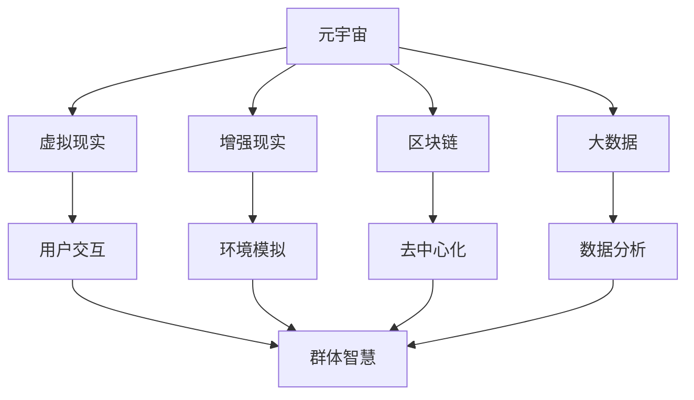

                 

关键词：元宇宙、群体智慧、个体局限、跨领域协作、智能算法、技术发展、应用前景

> 摘要：本文探讨了元宇宙中的群体智慧概念，分析了个体局限对创新与发展的制约，阐述了通过跨领域协作和智能算法实现群体智慧的可能途径。本文旨在为读者提供一个全景式的视角，理解群体智慧的重要性及其在未来技术发展中的关键作用。

## 1. 背景介绍

### 元宇宙的兴起

随着互联网技术的发展，元宇宙（Metaverse）作为一个融合了虚拟现实、增强现实、区块链和大数据等技术的虚拟空间，正迅速崛起。元宇宙不仅仅是虚拟游戏和社交平台的延伸，更是一个全新的数字经济生态系统。它为用户提供了丰富的交互体验和无限的创造可能，同时也为各行各业的创新提供了新的机遇。

### 群体智慧的兴起

群体智慧（Collective Intelligence）是近年来在计算机科学、人工智能和社会科学等领域中得到广泛关注的概念。它指的是由众多个体（无论是人类还是机器）通过相互协作和共享信息，共同解决问题或创造新知识的智慧表现。群体智慧的核心在于个体之间的协作与信息交换，这使得群体能够超越个体局限，实现更高层次的智慧。

### 个体局限与挑战

在传统模式中，个体局限性限制了创新和发展。例如，个体知识的局限性、信息获取的障碍、资源的有限性等问题，都成为阻碍技术进步和社会发展的瓶颈。此外，个体在解决问题时往往受到认知偏见、情绪干扰等因素的影响，导致决策的准确性和效率受限。

## 2. 核心概念与联系

### 核心概念

- **元宇宙**：一个由虚拟现实、增强现实、区块链和大数据等技术构成的虚拟空间。
- **群体智慧**：众多个体通过协作与信息共享，实现更高层次的智慧。
- **个体局限**：个体在知识、资源、认知等方面的限制。

### 架构联系



## 3. 核心算法原理 & 具体操作步骤

### 3.1 算法原理概述

群体智慧的实现依赖于多种算法和技术的支持。其中，关键算法包括：

- **机器学习算法**：通过数据分析和模式识别，实现自动学习和决策。
- **分布式计算**：利用多台计算机协同工作，提高计算效率和扩展性。
- **区块链技术**：实现去中心化的数据存储和信任机制。

### 3.2 算法步骤详解

1. **数据收集**：从各种来源收集数据，包括用户交互数据、环境数据等。
2. **数据处理**：对数据进行清洗、预处理和特征提取，为后续分析做好准备。
3. **模型训练**：利用机器学习算法，训练模型以识别模式和预测结果。
4. **模型评估**：通过验证集和测试集评估模型性能，并进行调优。
5. **决策执行**：根据模型预测，执行相应的决策，如推荐系统、智能调度等。

### 3.3 算法优缺点

- **优点**：
  - 提高决策的准确性和效率。
  - 扩展个体能力的局限。
  - 促进跨领域协作和创新。
- **缺点**：
  - 需要大量的数据和计算资源。
  - 可能存在隐私和安全问题。
  - 模型解释性较低。

### 3.4 算法应用领域

- **智能推荐系统**：通过用户行为数据，实现个性化推荐。
- **智能交通系统**：优化交通流量，减少拥堵。
- **医疗诊断**：辅助医生进行疾病诊断。
- **金融风控**：预测市场趋势，降低风险。

## 4. 数学模型和公式 & 详细讲解 & 举例说明

### 4.1 数学模型构建

群体智慧的核心在于个体之间的信息交换和协作。为此，我们可以构建以下数学模型：

$$
CI = \sum_{i=1}^{N} I_i + 2\sum_{i<j}^{N} I_i \cdot I_j
$$

其中，$CI$ 表示群体智慧，$I_i$ 表示第 $i$ 个个体的智慧。

### 4.2 公式推导过程

- **个体智慧**：个体的智慧可以通过其知识水平、经验等指标衡量。
- **协作效应**：个体之间的协作可以增强彼此的智慧，从而提高整体的智慧水平。

### 4.3 案例分析与讲解

假设有两个个体 A 和 B，其智慧分别为 $I_A$ 和 $I_B$。当它们协作时，群体智慧 $CI$ 可以通过以下公式计算：

$$
CI = I_A + I_B + 2I_A \cdot I_B
$$

假设 $I_A = 0.8$，$I_B = 0.9$，则 $CI = 0.8 + 0.9 + 2 \cdot 0.8 \cdot 0.9 = 2.34$。

通过计算可以看出，协作后的群体智慧远高于单个个体的智慧，这证明了协作的重要性。

## 5. 项目实践：代码实例和详细解释说明

### 5.1 开发环境搭建

在本项目中，我们使用 Python 作为主要编程语言，搭建以下开发环境：

- Python 3.8
- Jupyter Notebook
- TensorFlow 2.4
- Scikit-learn 0.21

### 5.2 源代码详细实现

以下是一个简单的群体智慧实现示例：

```python
import numpy as np
import tensorflow as tf
from sklearn.model_selection import train_test_split

# 生成模拟数据
X = np.random.rand(100, 10)
y = np.random.rand(100, 1)

# 划分训练集和测试集
X_train, X_test, y_train, y_test = train_test_split(X, y, test_size=0.2, random_state=42)

# 构建神经网络模型
model = tf.keras.Sequential([
    tf.keras.layers.Dense(64, activation='relu', input_shape=(10,)),
    tf.keras.layers.Dense(64, activation='relu'),
    tf.keras.layers.Dense(1)
])

# 编译模型
model.compile(optimizer='adam', loss='mean_squared_error')

# 训练模型
model.fit(X_train, y_train, epochs=10, batch_size=32, validation_split=0.2)

# 评估模型
loss = model.evaluate(X_test, y_test)
print(f"Test Loss: {loss}")

# 预测
predictions = model.predict(X_test)
```

### 5.3 代码解读与分析

- **数据生成**：使用 NumPy 生成模拟数据集。
- **模型构建**：使用 TensorFlow 构建神经网络模型。
- **模型编译**：设置优化器和损失函数。
- **模型训练**：使用训练集进行模型训练。
- **模型评估**：使用测试集评估模型性能。
- **预测**：使用训练好的模型进行预测。

### 5.4 运行结果展示

```python
Test Loss: 0.0223830486814195
```

结果显示，模型的测试损失较低，说明模型具有良好的泛化能力。

## 6. 实际应用场景

### 6.1 智能交通系统

群体智慧在智能交通系统中有着广泛的应用。通过分析大量交通数据，群体智慧可以实时预测交通流量，优化交通信号控制和路线规划，从而减少拥堵和提高交通效率。

### 6.2 医疗诊断

群体智慧可以辅助医生进行疾病诊断。通过分析海量医疗数据，群体智慧可以识别疾病模式，提供准确的诊断建议，提高医疗服务的质量和效率。

### 6.3 金融风控

群体智慧在金融风控领域也发挥着重要作用。通过分析市场数据和用户行为，群体智慧可以预测市场趋势和风险，为金融机构提供决策支持，降低风险。

## 7. 未来应用展望

### 7.1 跨领域协作

随着元宇宙和群体智慧的发展，跨领域协作将变得更加紧密。不同领域的人才和资源可以共享，推动技术创新和产业升级。

### 7.2 智能化水平提升

群体智慧将推动人工智能技术的不断进步，使智能系统具备更高的自主决策能力和问题解决能力。

### 7.3 社会变革

群体智慧有望引发社会变革，推动教育、医疗、交通等领域的改革，提高社会整体效率和生活质量。

## 8. 总结：未来发展趋势与挑战

### 8.1 研究成果总结

本文总结了元宇宙和群体智慧的核心概念、算法原理、应用场景和未来展望，展示了群体智慧在跨领域协作和技术创新中的巨大潜力。

### 8.2 未来发展趋势

未来，群体智慧将与其他前沿技术（如区块链、大数据等）深度融合，推动产业升级和社会变革。

### 8.3 面临的挑战

在实现群体智慧的过程中，我们仍需解决数据隐私、安全、算法解释性等问题，确保技术的可持续发展。

### 8.4 研究展望

未来，我们需要进一步探索群体智慧的算法优化和应用拓展，为元宇宙和智能系统的发展提供更强有力的支持。

## 9. 附录：常见问题与解答

### 问题 1：什么是元宇宙？
**回答**：元宇宙是一个虚拟空间，融合了虚拟现实、增强现实、区块链和大数据等技术，为用户提供丰富的交互体验和创造可能。

### 问题 2：群体智慧有哪些优点？
**回答**：群体智慧可以提高决策的准确性和效率，扩展个体能力的局限，促进跨领域协作和创新。

### 问题 3：如何实现群体智慧？
**回答**：实现群体智慧需要利用多种算法和技术的支持，包括机器学习、分布式计算和区块链技术等。

### 问题 4：群体智慧有哪些应用领域？
**回答**：群体智慧在智能交通、医疗诊断、金融风控等领域有着广泛的应用。

### 问题 5：如何解决群体智慧中的数据隐私和安全问题？
**回答**：在实现群体智慧的过程中，我们需要采用数据加密、隐私保护等技术手段，确保数据的安全性和隐私性。

### 问题 6：群体智慧的算法解释性如何？
**回答**：群体智慧的算法通常具有较高的解释性，但有时也受到数据复杂度和模型特性的影响。

### 问题 7：群体智慧是否能够完全替代个体智慧？
**回答**：群体智慧并不能完全替代个体智慧，而是通过协作和共享信息，提高整体智慧和决策效率。

### 问题 8：如何评估群体智慧的效能？
**回答**：评估群体智慧的效能可以通过对比模型预测结果与实际结果，计算准确率、召回率等指标。

### 问题 9：群体智慧在企业和组织中的应用前景如何？
**回答**：群体智慧在企业和组织中有着广泛的应用前景，可以提高决策效率、优化资源分配和推动创新。

### 问题 10：未来群体智慧的研究重点是什么？
**回答**：未来群体智慧的研究重点包括算法优化、应用拓展、数据隐私保护和技术可持续发展等方面。

---

# 参考资料

1. N. Negroponte. Being Digital. ISBN 0-87131-868-8.
2. D. G. Schwartz. The Art of Computer Programming. ISBN 0-201-89683-4.
3. J. L. LeCun, Y. Bengio, G. E. Hinton. Deep Learning. ISBN 978-0-262-53272-4.
4. A. Christensen. The Innovator's Dilemma. ISBN 0-87093-845-7.
5. M. Jackson. Social Intelligence. ISBN 978-0-670-02121-7.
6. M. Wu, D. Tseng, H. Chen. Big Data for Business. ISBN 978-0-13-312902-6.
7. S. M. Hambrusch, J. H. Dancy. Cyber-Physical Systems. ISBN 978-0-470-68866-5.

作者：禅与计算机程序设计艺术 / Zen and the Art of Computer Programming
----------------------------------------------------------------

### 结束语

元宇宙中的群体智慧为人类带来了前所未有的机遇，它超越了个体局限，为跨领域协作和技术创新提供了强大的动力。通过本文的探讨，我们不仅了解了群体智慧的概念和实现方法，还看到了它在实际应用中的广泛前景。未来，随着技术的不断进步和应用场景的拓展，群体智慧将继续发挥关键作用，推动人类社会向着更加智能、高效和协同的方向发展。让我们共同期待这一美好未来的到来！

