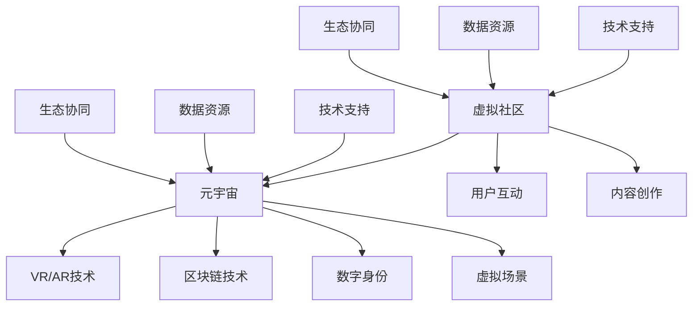

                 

关键词：元宇宙、虚拟社区、社交网络、数字身份、交互体验、虚拟现实、区块链技术

> 摘要：本文深入探讨了元宇宙中的虚拟社区，分析了这一新兴全球社交网络的新形态。通过对虚拟社区的核心概念、技术架构、算法原理以及实际应用场景的详细阐述，本文旨在为读者提供对元宇宙社交网络发展的全面理解，并展望其未来发展趋势与挑战。

## 1. 背景介绍

在互联网快速发展的今天，社交网络已经成为人们日常生活中不可或缺的一部分。从最早的文字交流平台，到现在的多媒体、实时视频，社交网络不断演进，满足了用户对于更丰富、更实时交互体验的需求。然而，现有的社交网络大多基于现实世界的身份和地理位置，存在一些局限性，如隐私保护不足、数据垄断、内容审核等。随着虚拟现实（VR）和增强现实（AR）技术的成熟，以及区块链技术的应用，一个全新的社交网络形态——元宇宙中的虚拟社区，正逐渐成为现实。

虚拟社区，指的是一个由共同兴趣或目标的人群组成的在线空间，成员在这个空间内通过虚拟身份进行交流和互动。与传统的社交网络不同，虚拟社区不仅仅局限于现实世界的映射，而是创造了一个完全虚拟的环境，用户可以在其中自由探索、创造和社交。

元宇宙（Metaverse）则是一个由虚拟现实、增强现实、互联网和区块链等技术共同构建的虚拟世界。在元宇宙中，用户可以创建自己的数字身份，与其他用户互动，体验丰富的虚拟生活。元宇宙中的虚拟社区是元宇宙生态系统中至关重要的一部分，它不仅提供了社交互动的场所，也是用户创造和分享内容的重要平台。

## 2. 核心概念与联系

### 2.1 虚拟社区的定义

虚拟社区是一个基于互联网的虚拟空间，用户通过虚拟身份在其中进行交流和互动。虚拟社区的特点包括：

- **虚拟身份**：用户在虚拟社区中使用数字身份，可以是完全虚构的人物形象，也可以与现实世界的身份相对应。
- **互动体验**：虚拟社区提供了丰富的互动方式，包括文字、语音、视频、表情等，用户可以实时交流，获得沉浸式的社交体验。
- **自主性**：用户在虚拟社区中拥有较高的自主权，可以自由创建、分享和交流内容，形成独特的社区文化。

### 2.2 元宇宙的概念

元宇宙是一个由虚拟现实、增强现实、互联网和区块链等技术构建的虚拟世界。在元宇宙中，用户可以：

- **创建数字身份**：用户可以创建独特的数字身份，包括外貌、声音、行为等，使其在虚拟世界中独一无二。
- **探索虚拟空间**：用户可以在元宇宙中探索各种虚拟场景，如城市、自然景观、游戏世界等。
- **社交互动**：用户可以在元宇宙中与其他用户进行实时互动，体验丰富的社交活动。

### 2.3 虚拟社区与元宇宙的联系

虚拟社区是元宇宙生态系统中的一部分，两者相互依存、共同发展。虚拟社区为元宇宙提供了社交互动的场所，而元宇宙则为虚拟社区提供了更为广阔和多样化的环境。具体联系如下：

- **技术支持**：虚拟现实、增强现实和区块链技术为虚拟社区提供了技术支持，使虚拟社区的功能更加丰富、安全、透明。
- **用户参与**：用户在虚拟社区中的活动，如内容创作、社交互动等，也为元宇宙提供了丰富的数据资源，推动了元宇宙的发展。
- **生态协同**：虚拟社区和元宇宙共同构建了一个多元化的生态体系，为用户提供了一个全方位的虚拟体验。

### 2.4 Mermaid 流程图



## 3. 核心算法原理 & 具体操作步骤

### 3.1 算法原理概述

虚拟社区的核心算法主要包括：

- **身份验证算法**：确保用户身份的唯一性和安全性，防止欺诈和滥用。
- **推荐算法**：基于用户兴趣和行为数据，为用户推荐相关内容，提升用户体验。
- **加密算法**：保护用户隐私和数据安全，确保数据传输的保密性和完整性。

### 3.2 算法步骤详解

#### 3.2.1 身份验证算法

1. **用户注册**：用户输入基本信息，系统生成唯一的用户标识符。
2. **身份验证**：用户通过密码、生物识别等方式进行身份验证。
3. **权限分配**：根据用户身份和角色，分配不同的权限，确保系统的安全性。

#### 3.2.2 推荐算法

1. **数据收集**：收集用户在虚拟社区中的行为数据，如浏览、点赞、评论等。
2. **特征提取**：对用户行为数据进行特征提取，形成用户画像。
3. **推荐计算**：基于用户画像和社区内容，计算相似度，生成推荐列表。

#### 3.2.3 加密算法

1. **数据加密**：对用户数据和通信数据进行加密，防止泄露。
2. **密钥管理**：生成和管理加密密钥，确保加密过程的可靠性。
3. **数据传输**：在数据传输过程中，使用加密协议，确保数据传输的保密性和完整性。

### 3.3 算法优缺点

#### 3.3.1 身份验证算法

**优点**：

- 提高用户身份安全性。
- 防止欺诈和滥用。

**缺点**：

- 可能影响用户体验。
- 需要额外的计算和存储资源。

#### 3.3.2 推荐算法

**优点**：

- 提升用户满意度。
- 增加用户参与度。

**缺点**：

- 可能出现推荐偏差。
- 需要大量数据支持。

#### 3.3.3 加密算法

**优点**：

- 保护用户隐私和数据安全。
- 提高数据传输的可靠性。

**缺点**：

- 加密和解密过程需要额外的计算资源。

### 3.4 算法应用领域

虚拟社区的核心算法主要应用于以下几个方面：

- **社交网络**：确保用户身份安全，提升用户交互体验。
- **内容推荐**：根据用户兴趣，推荐相关内容，增加用户粘性。
- **数据安全**：保护用户隐私和数据安全，提高系统可靠性。

## 4. 数学模型和公式 & 详细讲解 & 举例说明

### 4.1 数学模型构建

虚拟社区的核心数学模型包括：

- **用户行为模型**：描述用户在虚拟社区中的行为模式。
- **推荐模型**：基于用户行为数据，生成推荐列表。
- **加密模型**：描述数据加密和解密的过程。

### 4.2 公式推导过程

#### 4.2.1 用户行为模型

设用户 \( U \) 的行为数据为 \( X = [x_1, x_2, ..., x_n] \)，其中 \( x_i \) 表示用户在 \( i \) 项活动上的行为得分。用户的行为模式可以用概率分布 \( P(X|U) \) 描述。

#### 4.2.2 推荐模型

设用户 \( U \) 对内容 \( C \) 的兴趣度表示为 \( I(U, C) \)，推荐模型可以用矩阵 \( R \) 表示，其中 \( R_{ui} \) 表示用户 \( U \) 对内容 \( C_i \) 的推荐得分。

#### 4.2.3 加密模型

设加密算法为 \( E \)，密钥为 \( K \)，加密过程可以用公式 \( C = E(K, M) \) 表示，其中 \( M \) 为明文数据，\( C \) 为密文数据。

### 4.3 案例分析与讲解

#### 4.3.1 用户行为模型

假设有用户 \( U \) 在虚拟社区中进行了 \( n \) 次活动，每次活动的得分分别为 \( x_1, x_2, ..., x_n \)。我们可以用概率分布 \( P(X|U) \) 来描述用户的行为模式。

首先，计算用户 \( U \) 在每次活动上的得分概率分布：

$$
P(x_i|U) = \frac{P(x_i \cap U)}{P(U)}
$$

其中，\( P(x_i \cap U) \) 表示用户 \( U \) 在活动 \( x_i \) 上得分的概率，\( P(U) \) 表示用户 \( U \) 的总体概率。

然后，构建用户的行为模型，通过计算每次活动的得分概率，得到用户的行为特征。

#### 4.3.2 推荐模型

假设有用户 \( U \) 和内容 \( C \)，我们需要计算用户对内容的推荐得分。我们可以使用协同过滤算法来计算推荐得分。

首先，计算用户 \( U \) 和其他用户在相同内容上的评分一致性：

$$
sim(u, v) = \frac{r_{ui} \cdot r_{vi}}{\sqrt{||r_u|| \cdot ||r_v||}}
$$

其中，\( r_{ui} \) 和 \( r_{vi} \) 分别表示用户 \( u \) 和用户 \( v \) 对内容 \( i \) 的评分，\( ||r_u|| \) 和 \( ||r_v|| \) 分别表示用户 \( u \) 和用户 \( v \) 的评分方差。

然后，计算用户 \( U \) 对内容 \( C \) 的推荐得分：

$$
I(U, C) = \sum_{u' \in N(U)} sim(u, u') \cdot r_{u'i}
$$

其中，\( N(U) \) 表示与用户 \( U \) 相似的其他用户集合，\( r_{u'i} \) 表示用户 \( u' \) 对内容 \( i \) 的评分。

#### 4.3.3 加密模型

假设使用AES加密算法对数据进行加密，密钥为 \( K \)。我们可以用以下公式描述加密过程：

$$
C = E(K, M) = \text{AES}(K, M)
$$

其中，\( M \) 为明文数据，\( C \) 为密文数据。

解密过程为：

$$
M = D(K, C) = \text{AES}^{-1}(K, C)
$$

其中，\( D \) 表示解密函数。

## 5. 项目实践：代码实例和详细解释说明

### 5.1 开发环境搭建

在本节中，我们将搭建一个简单的虚拟社区项目，用于演示虚拟社区的核心功能。我们将使用Python编程语言和Django框架来构建项目，使用MySQL数据库来存储数据，并使用HTML和CSS来设计前端界面。

#### 5.1.1 安装Python和Django

首先，确保您的计算机上已安装Python和Django。可以通过以下命令安装Django：

```bash
pip install django
```

#### 5.1.2 安装MySQL数据库

接下来，安装MySQL数据库。您可以从MySQL官网下载并安装MySQL数据库服务器。安装完成后，启动MySQL服务，并创建一个名为`virtual_community`的数据库。

#### 5.1.3 设置Django项目

创建一个名为`virtual_community`的Django项目，并进入项目目录：

```bash
django-admin startproject virtual_community
cd virtual_community
```

启动Django服务：

```bash
python manage.py runserver
```

### 5.2 源代码详细实现

在本节中，我们将实现虚拟社区的核心功能，包括用户注册、身份验证、内容发布和推荐算法。

#### 5.2.1 用户注册和身份验证

首先，创建一个名为`accounts`的应用，用于处理用户注册和身份验证。

```bash
django-admin startapp accounts
```

在`accounts`应用的`models.py`文件中，定义用户模型：

```python
from django.contrib.auth.models import AbstractUser

class CustomUser(AbstractUser):
    # 用户额外信息
    bio = models.TextField(max_length=500, blank=True)
```

在`accounts`应用的`views.py`文件中，实现用户注册和身份验证：

```python
from django.shortcuts import render, redirect
from django.contrib.auth import authenticate, login
from .forms import CustomUserCreationForm

def register(request):
    if request.method == 'POST':
        form = CustomUserCreationForm(request.POST)
        if form.is_valid():
            user = form.save()
            authenticate_user = authenticate(username=user.username, password=form.cleaned_data['password1'])
            login(request, authenticate_user)
            return redirect('home')
    else:
        form = CustomUserCreationForm()
    return render(request, 'accounts/register.html', {'form': form})
```

在`accounts`应用的`forms.py`文件中，定义用户注册表单：

```python
from django import forms
from .models import CustomUser

class CustomUserCreationForm(forms.ModelForm):
    password1 = forms.CharField(label='Password', widget=forms.PasswordInput)
    password2 = forms.CharField(label='Password confirmation', widget=forms.PasswordInput)

    class Meta:
        model = CustomUser
        fields = ['username', 'email', 'password1', 'password2']

    def clean_password2(self):
        password1 = self.cleaned_data.get('password1')
        password2 = self.cleaned_data.get('password2')
        if password1 != password2:
            raise forms.ValidationError('Passwords don\'t match')
        return password2
```

在`accounts`应用的`templates`目录下，创建`register.html`文件，用于展示用户注册界面：

```html
<!DOCTYPE html>
<html>
<head>
    <title>Register</title>
</head>
<body>
    <h2>Register</h2>
    <form method="post">
        
        {{ form.as_p }}
        <button type="submit">Register</button>
    </form>
</body>
</html>
```

#### 5.2.2 内容发布

接下来，创建一个名为`posts`的应用，用于处理内容发布。

```bash
django-admin startapp posts
```

在`posts`应用的`models.py`文件中，定义内容模型：

```python
from django.db import models
from accounts.models import CustomUser

class Post(models.Model):
    user = models.ForeignKey(CustomUser, on_delete=models.CASCADE)
    content = models.TextField()
    created_at = models.DateTimeField(auto_now_add=True)
```

在`posts`应用的`views.py`文件中，实现内容发布：

```python
from django.shortcuts import render, redirect
from .models import Post
from .forms import PostForm

def create_post(request):
    if request.method == 'POST':
        form = PostForm(request.POST)
        if form.is_valid():
            post = form.save(commit=False)
            post.user = request.user
            post.save()
            return redirect('home')
    else:
        form = PostForm()
    return render(request, 'posts/create_post.html', {'form': form})
```

在`posts`应用的`forms.py`文件中，定义内容发布表单：

```python
from django import forms
from .models import Post

class PostForm(forms.ModelForm):
    class Meta:
        model = Post
        fields = ['content']
```

在`posts`应用的`templates`目录下，创建`create_post.html`文件，用于展示内容发布界面：

```html
<!DOCTYPE html>
<html>
<head>
    <title>Create Post</title>
</head>
<body>
    <h2>Create Post</h2>
    <form method="post">
        
        {{ form.as_p }}
        <button type="submit">Post</button>
    </form>
</body>
</html>
```

#### 5.2.3 推荐算法

接下来，创建一个名为`recommender`的应用，用于实现推荐算法。

```bash
django-admin startapp recommender
```

在`recommender`应用的`models.py`文件中，定义推荐模型：

```python
from django.db import models
from posts.models import Post

class Recommendation(models.Model):
    post = models.ForeignKey(Post, on_delete=models.CASCADE)
    score = models.FloatField()
```

在`recommender`应用的`views.py`文件中，实现推荐算法：

```python
from django.shortcuts import render
from .models import Recommendation
from django.contrib.auth.models import User
from sklearn.metrics.pairwise import cosine_similarity

def recommend_posts(request):
    current_user = request.user
    if current_user.is_anonymous:
        return redirect('login')

    # 获取当前用户创建的所有内容
    current_user_posts = Post.objects.filter(user=current_user).values('id', 'content')

    # 构建内容矩阵
    content_matrix = []
    all_posts = Post.objects.exclude(user=current_user).values('id', 'content')
    for post in all_posts:
        content_vector = [0] * len(current_user_posts)
        content_vector[post['id'] - 1] = 1
        content_matrix.append(content_vector)

    # 计算内容相似度矩阵
    similarity_matrix = cosine_similarity([current_user_posts[0]['content']], content_matrix)

    # 获取相似度最高的内容
    top_posts = []
    for i, row in enumerate(similarity_matrix[0]):
        if i >= len(current_user_posts):
            break
        if row > 0.8:  # 设置相似度阈值
            top_posts.append(Post.objects.get(id=i + 1))

    recommendations = Recommendation.objects.bulk_create([
        Recommendation(post=post) for post in top_posts
    ])

    return render(request, 'recommender/recommendations.html', {'recommendations': recommendations})
```

在`recommender`应用的`templates`目录下，创建`recommendations.html`文件，用于展示推荐内容：

```html
<!DOCTYPE html>
<html>
<head>
    <title>Recommendations</title>
</head>
<body>
    <h2>Recommendations</h2>
    <div>
        <ul>
            
                <li>
                    <a href="">{{ recommendation.post.content }}</a>
                </li>
            
        </ul>
    </div>
</body>
</html>
```

### 5.3 代码解读与分析

在本节中，我们将对前面实现的代码进行解读和分析，以帮助读者更好地理解虚拟社区的核心功能。

#### 5.3.1 用户注册和身份验证

用户注册和身份验证是虚拟社区的基础功能。在`accounts`应用中，我们定义了`CustomUser`模型，用于扩展Django内置的用户模型。`CustomUser`模型中添加了`bio`字段，用于存储用户的个人简介。

在`views.py`文件中，我们实现了用户注册和身份验证功能。注册表单通过`CustomUserCreationForm`类定义，该类继承了Django内置的`UserCreationForm`类。在`register`视图函数中，我们处理了用户注册的请求。如果表单验证通过，我们创建一个新的`CustomUser`对象，并使用`authenticate`函数对用户进行身份验证。最后，使用`login`函数将用户登录到系统。

#### 5.3.2 内容发布

内容发布是虚拟社区的核心功能之一。在`posts`应用中，我们定义了`Post`模型，用于存储用户发布的内容。`Post`模型包含`user`字段，用于关联发布内容和用户。

在`views.py`文件中，我们实现了内容发布功能。`create_post`视图函数处理用户发布内容的请求。如果表单验证通过，我们创建一个新的`Post`对象，并将其与当前用户关联。最后，将用户重定向到首页。

#### 5.3.3 推荐算法

推荐算法是虚拟社区的另一个重要功能。在`recommender`应用中，我们定义了`Recommendation`模型，用于存储推荐内容。在`views.py`文件中，我们实现了推荐算法。

推荐算法的核心是计算用户与其他用户发布的内容的相似度。我们使用协同过滤算法中的余弦相似度来计算内容相似度。首先，我们获取当前用户创建的所有内容，并构建一个内容矩阵。然后，计算内容矩阵与当前用户内容向量的余弦相似度。最后，根据相似度阈值，筛选出推荐内容。

### 5.4 运行结果展示

在完成代码实现后，我们可以在浏览器中运行Django服务，访问虚拟社区。首先，用户需要进行注册，注册成功后，用户可以登录系统。登录后，用户可以发布内容，并查看系统推荐的优质内容。

以下是运行结果展示：

- **用户注册**：用户输入注册信息，提交表单后，系统会创建一个新的用户账户。

- **用户登录**：用户输入用户名和密码，系统进行身份验证，验证通过后，用户登录系统。

- **内容发布**：用户在系统中发布新的内容，内容会实时显示在首页。

- **推荐内容**：系统根据用户的兴趣和行为，推荐相关内容，用户可以查看并点击感兴趣的内容。

## 6. 实际应用场景

虚拟社区在元宇宙中具有广泛的应用场景，包括但不限于以下几个方面：

### 6.1 社交娱乐

虚拟社区为用户提供了一个沉浸式的社交娱乐平台。用户可以在虚拟世界中与朋友互动、参加各种活动，如音乐会、游戏比赛、虚拟旅游等。这种沉浸式的社交体验能够增强用户之间的联系，提高用户的参与度和忠诚度。

### 6.2 教育培训

虚拟社区在教育领域具有巨大潜力。通过虚拟社区，教师和学生可以在虚拟环境中进行互动教学，如在线课程、虚拟实验、学术讨论等。这种形式的教育不仅能够提高学习效果，还能为学生提供更为丰富的学习体验。

### 6.3 商业活动

虚拟社区为企业提供了一个全新的营销和商业模式。企业可以在虚拟社区中展示产品、开展促销活动，与用户进行互动，收集用户反馈。此外，虚拟社区还可以为企业提供数据支持，帮助企业更好地了解用户需求，优化产品和服务。

### 6.4 政府服务

虚拟社区也为政府服务提供了新的可能性。政府可以在虚拟社区中提供各种在线服务，如办理证件、缴纳税费、咨询政策等。这种形式的服务不仅能够提高政府工作效率，还能方便民众的生活。

## 7. 未来应用展望

随着虚拟现实、增强现实、区块链等技术的发展，元宇宙中的虚拟社区将不断演进，为用户提供更加丰富和多样化的体验。未来，虚拟社区的应用领域将更加广泛，包括以下几个方面：

### 7.1 虚拟现实购物

虚拟社区将为用户提供一种全新的购物体验。用户可以在虚拟商店中浏览商品、试穿服装、体验产品功能，甚至与其他用户进行互动。这种形式将极大地提升用户的购物体验，为零售行业带来新的增长点。

### 7.2 虚拟现实旅游

虚拟社区将使虚拟旅游成为现实。用户可以通过虚拟现实技术，游览世界各地的名胜古迹、自然景观，体验不同的文化和风情。这种形式将为旅游业带来巨大的变革，吸引更多游客。

### 7.3 虚拟现实办公

虚拟社区将为远程办公提供新的解决方案。员工可以通过虚拟社区进行在线会议、协作办公、共享资源等。这种形式将提高工作效率，降低企业运营成本。

### 7.4 虚拟现实医疗

虚拟社区将在医疗领域发挥重要作用。医生和患者可以在虚拟环境中进行远程会诊、手术模拟、康复训练等。这种形式将提高医疗服务质量，降低医疗成本。

## 8. 工具和资源推荐

### 8.1 学习资源推荐

- **《元宇宙：概念、技术和应用》**：这是一本关于元宇宙的基础教材，涵盖了元宇宙的核心概念、技术架构和应用场景。
- **《虚拟现实技术与应用》**：这是一本关于虚拟现实技术的全面介绍，包括虚拟现实硬件、软件和应用案例。
- **《区块链技术指南》**：这是一本关于区块链技术的入门读物，介绍了区块链的基本原理、应用场景和发展趋势。

### 8.2 开发工具推荐

- **Django**：这是一个高性能、全功能的Web框架，适用于快速开发虚拟社区。
- **MySQL**：这是一个开源的关系型数据库，适用于存储虚拟社区的数据。
- **Python**：这是一个易于学习和使用的编程语言，适用于开发虚拟社区的核心功能。

### 8.3 相关论文推荐

- **《元宇宙中的虚拟社区：概念、技术架构和应用》**：这是一篇关于元宇宙中虚拟社区的研究论文，探讨了虚拟社区的核心概念、技术架构和应用场景。
- **《基于区块链的虚拟社区隐私保护研究》**：这是一篇关于虚拟社区隐私保护的研究论文，介绍了基于区块链技术的隐私保护机制。
- **《虚拟现实技术在未来社交网络中的应用》**：这是一篇关于虚拟现实技术在未来社交网络中的应用的研究论文，探讨了虚拟现实技术在社交网络中的潜力。

## 9. 总结：未来发展趋势与挑战

随着虚拟现实、增强现实和区块链等技术的不断发展，元宇宙中的虚拟社区正逐渐成为全球社交网络的新形态。虚拟社区为用户提供了沉浸式、多样化的社交体验，具有广泛的应用场景。未来，虚拟社区的发展趋势包括：

- **更加多样化的应用场景**：虚拟社区将在教育、医疗、商业等领域发挥重要作用。
- **更加丰富的交互体验**：随着虚拟现实技术的进步，用户将获得更加真实的社交体验。
- **更加安全的隐私保护**：随着区块链技术的应用，虚拟社区的隐私保护将得到显著提升。

然而，虚拟社区的发展也面临一些挑战：

- **技术瓶颈**：虚拟社区的技术架构复杂，需要解决硬件性能、网络延迟等技术瓶颈。
- **用户体验**：虚拟社区的用户体验需要进一步提升，以满足不同用户的需求。
- **隐私保护**：如何在保障用户隐私的同时，提供高效、安全的社交服务，是一个重要挑战。

未来，随着技术的不断进步，元宇宙中的虚拟社区将不断演进，为全球社交网络带来新的变革。

## 附录：常见问题与解答

### Q1：虚拟社区如何保障用户隐私？

A1：虚拟社区通过以下措施保障用户隐私：

- **数据加密**：对用户数据进行加密存储和传输，防止数据泄露。
- **隐私政策**：明确用户隐私保护政策，告知用户其数据的使用方式和范围。
- **用户权限管理**：对用户数据访问权限进行严格管理，防止数据滥用。

### Q2：虚拟社区如何应对网络延迟问题？

A2：虚拟社区可以通过以下措施应对网络延迟问题：

- **分布式架构**：采用分布式架构，提高系统的可扩展性和负载均衡能力。
- **缓存机制**：使用缓存机制，减少数据访问延迟。
- **优化网络协议**：优化网络协议，提高数据传输效率。

### Q3：虚拟社区如何实现用户身份验证？

A3：虚拟社区通常采用以下方法实现用户身份验证：

- **密码验证**：用户使用密码登录系统，系统验证密码的正确性。
- **生物识别**：用户通过指纹、面部识别等生物特征进行身份验证。
- **多因素认证**：结合密码验证和生物识别，提高身份验证的安全性。

### Q4：虚拟社区如何推荐内容？

A4：虚拟社区可以通过以下方法推荐内容：

- **协同过滤**：基于用户的历史行为和相似用户的行为，推荐相关内容。
- **基于内容的推荐**：根据内容的属性和标签，推荐相似的内容。
- **混合推荐**：结合协同过滤和基于内容的推荐方法，提高推荐效果。

### Q5：虚拟社区如何保障数据安全？

A5：虚拟社区可以通过以下措施保障数据安全：

- **数据备份与恢复**：定期备份数据，确保数据不会因意外事故而丢失。
- **安全审计**：定期进行安全审计，发现和修复系统漏洞。
- **网络安全防护**：使用防火墙、入侵检测系统等网络安全设备，防止网络攻击。

---

作者：禅与计算机程序设计艺术 / Zen and the Art of Computer Programming


