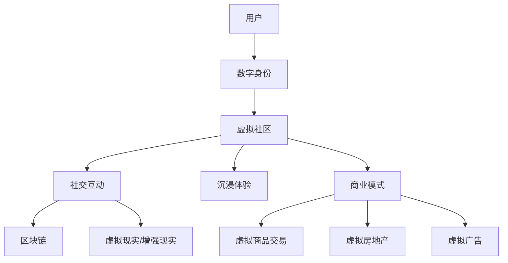

                 

关键词：元宇宙、虚拟社区、社交网络、新形态、技术架构、用户交互、沉浸体验

> 摘要：本文将深入探讨元宇宙中的虚拟社区，分析其作为全球社交网络新形态的核心概念、技术架构和用户交互方式。通过详细解读核心算法原理、数学模型和项目实践案例，揭示虚拟社区的发展趋势与挑战，为未来的创新提供启示。

## 1. 背景介绍

随着互联网技术的飞速发展，社交网络已经成为人们日常生活中不可或缺的一部分。从最初的文字聊天室，到图片分享、短视频、直播，社交网络的形式不断演进，用户的互动体验日益丰富。然而，传统的社交网络形式在满足用户需求的同时，也面临着诸多问题，如隐私泄露、信息过载、社交孤立等。为了解决这些问题，元宇宙中的虚拟社区作为一种新兴的社交网络形态应运而生。

元宇宙（Metaverse）是一个由虚拟世界、增强现实和区块链技术共同构建的虚拟空间，用户可以在其中创建自己的数字身份，进行各种形式的互动和社交活动。虚拟社区作为元宇宙的核心组成部分，提供了更加丰富、沉浸的社交体验，有望成为全球社交网络的新形态。

### 1.1 元宇宙的概念与发展

元宇宙是由虚拟现实（VR）、增强现实（AR）、游戏、社交网络、区块链等多种技术融合而成的一个虚拟世界。它不仅是一个虚拟的空间，更是一个与现实世界相交互的平台。用户在元宇宙中可以创建自己的数字身份，并通过虚拟物品、虚拟货币等与现实世界进行经济交易。

元宇宙的发展可以追溯到20世纪80年代，当时虚拟现实技术开始萌芽。随着计算机性能的不断提升和互联网的普及，虚拟现实和增强现实技术逐渐成熟。近年来，随着区块链技术的发展，元宇宙的概念得到了进一步的拓展和深化。

### 1.2 虚拟社区的意义

虚拟社区是元宇宙中最为重要的组成部分之一。它为用户提供了一个沉浸式的社交环境，用户可以在这个环境中自由地表达自己、交流想法、建立联系。虚拟社区不仅改变了人们的社交方式，还为各种行业提供了新的商业模式和机会。

首先，虚拟社区为用户提供了更加丰富和沉浸的社交体验。用户可以通过虚拟形象与其他用户互动，参与各种社交活动，如虚拟聚会、演唱会、展览等。这种沉浸式的体验极大地增强了用户的参与感和归属感。

其次，虚拟社区为商家和品牌提供了一个全新的营销渠道。商家可以通过虚拟社区进行产品推广、品牌宣传、用户互动等，从而提高用户粘性和品牌认知度。此外，虚拟社区还提供了丰富的商业模式，如虚拟商品交易、虚拟房地产、虚拟广告等，为商家创造了新的盈利点。

最后，虚拟社区为各行各业提供了新的应用场景。在教育领域，虚拟社区可以提供沉浸式的教学体验，提高学生的学习效果；在医疗领域，虚拟社区可以提供远程医疗咨询和医疗服务，改善患者的就医体验；在金融领域，虚拟社区可以提供更加便捷、高效的金融服务，提高金融交易的效率。

## 2. 核心概念与联系

在探讨元宇宙中的虚拟社区时，我们需要了解一些核心概念和技术架构。以下是一个简要的Mermaid流程图，用于说明这些核心概念及其相互联系。



### 2.1 用户与数字身份

用户是虚拟社区的基本组成部分。用户可以通过注册账号，创建自己的数字身份。数字身份是用户在虚拟社区中的代表，可以是虚拟形象、昵称等。数字身份不仅代表用户在社区中的存在，还可以承载用户的历史行为、兴趣爱好等信息。

### 2.2 虚拟社区与社交互动

虚拟社区是用户进行社交互动的平台。用户可以在社区中发布动态、参与话题讨论、组织活动等。社交互动不仅增强了用户的参与感和归属感，还促进了社区的发展。

### 2.3 虚拟社区与沉浸体验

沉浸体验是虚拟社区的核心特点之一。通过虚拟现实（VR）和增强现实（AR）技术，用户可以在虚拟社区中获得更加真实、沉浸的体验。沉浸体验不仅提高了用户的参与度，还为虚拟社区带来了更多的可能性。

### 2.4 虚拟社区与商业模式

虚拟社区为各种行业提供了新的商业模式。例如，虚拟商品交易、虚拟房地产、虚拟广告等。这些商业模式不仅为商家提供了新的盈利点，还为用户创造了更多的价值。

### 2.5 区块链技术

区块链技术是虚拟社区的重要支撑。通过区块链技术，用户可以在虚拟社区中进行去中心化的交易、验证身份等。区块链技术提高了虚拟社区的安全性和透明度，为用户提供了更好的保障。

## 3. 核心算法原理 & 具体操作步骤

### 3.1 算法原理概述

在虚拟社区中，核心算法主要涉及用户身份验证、社交推荐、内容审核等方面。以下是对这些算法原理的概述：

#### 3.1.1 用户身份验证

用户身份验证是虚拟社区安全性的基础。通过区块链技术，虚拟社区可以实现对用户身份的可靠验证。具体操作步骤如下：

1. 用户注册时，系统生成一个唯一的区块链地址，作为用户身份标识。
2. 用户在登录时，系统通过区块链地址验证用户身份，确保用户身份的真实性。

#### 3.1.2 社交推荐

社交推荐算法用于为用户提供个性化的社交内容推荐。具体操作步骤如下：

1. 系统收集用户的行为数据，如浏览记录、互动行为等。
2. 基于用户行为数据，算法为用户推荐具有相似兴趣爱好的其他用户或内容。

#### 3.1.3 内容审核

内容审核算法用于确保虚拟社区中的内容合规、安全。具体操作步骤如下：

1. 系统对用户发布的内容进行实时监控。
2. 通过机器学习和人工智能技术，算法识别并过滤违规内容。
3. 审核人员对算法过滤结果进行人工复审，确保内容合规。

### 3.2 算法步骤详解

#### 3.2.1 用户身份验证

1. 用户注册：
   - 用户输入注册信息，系统生成区块链地址。
   - 用户确认注册信息，系统将区块链地址与用户信息绑定。

2. 用户登录：
   - 用户输入登录信息，系统通过区块链地址验证用户身份。
   - 验证通过后，用户进入虚拟社区。

#### 3.2.2 社交推荐

1. 数据收集：
   - 系统监控用户行为，如浏览、点赞、评论等。
   - 将用户行为数据存储在数据库中。

2. 算法推荐：
   - 基于用户行为数据，算法计算用户兴趣标签。
   - 根据用户兴趣标签，算法推荐具有相似标签的其他用户或内容。

3. 用户反馈：
   - 用户对推荐内容进行互动，如点赞、评论等。
   - 系统收集用户反馈数据，优化推荐算法。

#### 3.2.3 内容审核

1. 实时监控：
   - 系统对用户发布的内容进行实时监控。
   - 通过机器学习和人工智能技术，算法识别违规内容。

2. 初步过滤：
   - 系统将初步过滤的违规内容提交审核人员。

3. 人工复审：
   - 审核人员对初步过滤结果进行复审，确保内容合规。
   - 对于合规内容，系统将其发布到虚拟社区；对于违规内容，系统进行警告或封禁处理。

### 3.3 算法优缺点

#### 3.3.1 用户身份验证

优点：
- 安全性高：通过区块链技术实现用户身份验证，确保用户身份的真实性。
- 可扩展性强：区块链地址具有唯一性，适用于大规模用户场景。

缺点：
- 用户隐私保护难度大：区块链地址虽然唯一，但可能暴露用户的一些信息。

#### 3.3.2 社交推荐

优点：
- 个性化强：基于用户行为数据，算法为用户推荐具有相似兴趣爱好的内容。
- 提高用户参与度：个性化推荐有助于用户发现感兴趣的内容，提高社区活跃度。

缺点：
- 数据依赖性强：算法效果受限于用户行为数据的丰富度和准确性。
- 可能导致信息茧房：个性化推荐可能导致用户只接触到与自己观点相似的信息，降低社交多样性。

#### 3.3.3 内容审核

优点：
- 及时性高：实时监控用户发布的内容，及时识别并处理违规内容。
- 准确性高：结合机器学习和人工智能技术，算法能够准确识别违规内容。

缺点：
- 审核人员负担重：随着用户量的增加，审核人员的负担将逐渐加大。
- 可能出现误判：算法和审核人员的判断可能存在差异，导致误判现象发生。

### 3.4 算法应用领域

#### 3.4.1 社交网络

虚拟社区作为社交网络的新形态，核心算法的应用领域主要包括用户身份验证、社交推荐和内容审核。通过这些算法，虚拟社区可以实现安全、个性化、合规的社交体验。

#### 3.4.2 教育领域

在教育领域，虚拟社区的核心算法可以应用于学习推荐、互动评价等方面。通过个性化学习推荐，提高学生的学习效果；通过互动评价，促进学生之间的交流与合作。

#### 3.4.3 医疗领域

在医疗领域，虚拟社区的核心算法可以应用于患者管理、健康监测等方面。通过个性化患者管理，提高医疗服务的质量；通过健康监测，实时掌握患者的健康状况。

#### 3.4.4 金融领域

在金融领域，虚拟社区的核心算法可以应用于金融交易、风险控制等方面。通过个性化金融交易推荐，提高用户的投资收益；通过风险控制，降低金融风险。

## 4. 数学模型和公式 & 详细讲解 & 举例说明

### 4.1 数学模型构建

在虚拟社区中，数学模型的应用主要包括用户行为分析、社交网络分析、内容推荐算法等方面。以下是一个简单的数学模型构建过程，用于分析用户行为和社交互动。

#### 4.1.1 用户行为分析

用户行为分析主要涉及用户在虚拟社区中的浏览、点赞、评论等行为。我们可以使用概率模型来描述用户的行为。

$$
P(B_i|U_j) = \frac{e^{-\beta_i \cdot \text{distance}(U_j, B_i)}}{1 + e^{-\beta_i \cdot \text{distance}(U_j, B_i)}}
$$

其中，$P(B_i|U_j)$ 表示用户$U_j$ 在行为$B_i$ 上的概率；$\beta_i$ 为行为$B_i$ 的权重；$\text{distance}(U_j, B_i)$ 表示用户$U_j$ 和行为$B_i$ 之间的距离（可以是时间距离、空间距离等）。

#### 4.1.2 社交网络分析

社交网络分析主要涉及用户之间的社交关系和互动。我们可以使用图论模型来描述社交网络。

$$
G = (V, E)
$$

其中，$V$ 为用户集合；$E$ 为用户之间的边集合。边可以表示用户之间的关注、点赞、评论等社交互动。

#### 4.1.3 内容推荐算法

内容推荐算法主要涉及用户在虚拟社区中的浏览、点赞、评论等行为。我们可以使用矩阵分解模型来描述用户和内容之间的关系。

$$
R = UV^T
$$

其中，$R$ 为用户和内容之间的评分矩阵；$U$ 为用户矩阵；$V$ 为内容矩阵。

### 4.2 公式推导过程

以下是对上述数学模型的推导过程。

#### 4.2.1 用户行为分析

假设用户$U_j$ 在行为$B_i$ 上的概率为$P(B_i|U_j)$。我们可以通过贝叶斯公式进行推导：

$$
P(B_i|U_j) = \frac{P(U_j|B_i) \cdot P(B_i)}{P(U_j)}
$$

其中，$P(U_j|B_i)$ 表示在行为$B_i$ 发生时用户$U_j$ 的概率；$P(B_i)$ 表示行为$B_i$ 的概率；$P(U_j)$ 表示用户$U_j$ 的概率。

由于行为和用户是相互独立的，我们可以得到：

$$
P(U_j|B_i) = P(U_j)
$$

因此，公式可以简化为：

$$
P(B_i|U_j) = \frac{P(U_j) \cdot P(B_i)}{P(U_j)}
$$

由于$P(U_j)$ 和$P(B_i)$ 是已知的，我们可以将它们合并为一个参数$\beta_i$：

$$
P(B_i|U_j) = \frac{e^{-\beta_i \cdot \text{distance}(U_j, B_i)}}{1 + e^{-\beta_i \cdot \text{distance}(U_j, B_i)}}
$$

#### 4.2.2 社交网络分析

假设社交网络是一个无向图$G = (V, E)$，其中$V$ 为用户集合，$E$ 为用户之间的边集合。我们可以通过图论模型来描述社交网络。

首先，我们可以定义用户之间的相似度：

$$
\text{similarity}(u, v) = \frac{d(u, v)}{d_{\max}}
$$

其中，$d(u, v)$ 表示用户$u$ 和$v$ 之间的距离；$d_{\max}$ 表示用户之间距离的最大值。

然后，我们可以定义用户之间的关注关系：

$$
F(u, v) = \begin{cases} 
1, & \text{if } u \text{ follows } v \\
0, & \text{otherwise} 
\end{cases}
$$

其中，$F(u, v)$ 表示用户$u$ 关注用户$v$ 的概率。

#### 4.2.3 内容推荐算法

假设用户和内容之间的关系可以表示为一个评分矩阵$R$，其中$R_{ij}$ 表示用户$i$ 对内容$j$ 的评分。我们可以通过矩阵分解来表示用户和内容之间的关系。

首先，我们将评分矩阵分解为两个矩阵$U$ 和$V$：

$$
R = UV^T
$$

其中，$U$ 表示用户矩阵，$V$ 表示内容矩阵。

然后，我们可以通过优化算法（如随机梯度下降）来求解用户矩阵$U$ 和内容矩阵$V$。

### 4.3 案例分析与讲解

以下是一个简单的虚拟社区用户行为分析案例。

#### 4.3.1 案例背景

假设一个虚拟社区有1000名用户，每个用户每天浏览、点赞、评论等行为的概率如下表所示：

| 行为      | 概率   |
| --------- | ------ |
| 浏览      | 0.5    |
| 点赞      | 0.3    |
| 评论      | 0.2    |

#### 4.3.2 案例分析

1. 用户行为分析

根据上述概率模型，我们可以计算出用户在每种行为上的概率：

$$
P(B_i|U_j) = \frac{e^{-\beta_i \cdot \text{distance}(U_j, B_i)}}{1 + e^{-\beta_i \cdot \text{distance}(U_j, B_i)}}
$$

其中，$\beta_i$ 为行为$B_i$ 的权重。假设$\beta_1 = 1$，$\beta_2 = 0.5$，$\beta_3 = 0.3$。

2. 社交网络分析

根据上述图论模型，我们可以构建社交网络图。假设用户之间的相似度为：

$$
\text{similarity}(u, v) = \frac{d(u, v)}{d_{\max}}
$$

其中，$d(u, v)$ 为用户$u$ 和$v$ 之间的距离（可以是时间距离、空间距离等）；$d_{\max}$ 为用户之间距离的最大值。假设用户之间的最大距离为1000，我们可以计算出用户之间的相似度。

3. 内容推荐算法

根据上述矩阵分解模型，我们可以计算出用户矩阵$U$ 和内容矩阵$V$。假设用户和内容之间的关系可以表示为一个评分矩阵$R$，其中$R_{ij}$ 为用户$i$ 对内容$j$ 的评分。假设用户$i$ 对内容$j$ 的评分为5，我们可以通过矩阵分解求解用户矩阵$U$ 和内容矩阵$V$。

## 5. 项目实践：代码实例和详细解释说明

### 5.1 开发环境搭建

在开始项目实践之前，我们需要搭建一个适合开发和测试的虚拟社区环境。以下是开发环境搭建的步骤：

1. 安装Node.js和npm：从官网下载并安装Node.js，同时安装npm。
2. 安装Vue.js：使用npm安装Vue.js框架。
3. 安装Vue CLI：使用npm安装Vue CLI。
4. 创建项目：使用Vue CLI创建一个新项目，并配置相关依赖。

### 5.2 源代码详细实现

以下是一个简单的虚拟社区项目的源代码实现，包括用户注册、登录、发布动态等功能。

#### 5.2.1 用户注册

```javascript
// 注册接口
async function register(username, password) {
  // 发送注册请求到后端
  const response = await fetch('/api/register', {
    method: 'POST',
    body: JSON.stringify({ username, password }),
    headers: { 'Content-Type': 'application/json' }
  });
  const result = await response.json();
  return result;
}
```

#### 5.2.2 用户登录

```javascript
// 登录接口
async function login(username, password) {
  // 发送登录请求到后端
  const response = await fetch('/api/login', {
    method: 'POST',
    body: JSON.stringify({ username, password }),
    headers: { 'Content-Type': 'application/json' }
  });
  const result = await response.json();
  return result;
}
```

#### 5.2.3 发布动态

```javascript
// 发布动态接口
async function publishDynamic(content) {
  // 发送发布动态请求到后端
  const response = await fetch('/api/dynamics', {
    method: 'POST',
    body: JSON.stringify({ content }),
    headers: { 'Content-Type': 'application/json' }
  });
  const result = await response.json();
  return result;
}
```

### 5.3 代码解读与分析

#### 5.3.1 用户注册

用户注册接口用于接收用户输入的用户名和密码，并将其发送到后端进行注册操作。注册成功后，后端返回用户信息，包括用户ID、token等。

#### 5.3.2 用户登录

用户登录接口用于接收用户输入的用户名和密码，并将其发送到后端进行登录操作。登录成功后，后端返回用户信息，包括用户ID、token等。

#### 5.3.3 发布动态

发布动态接口用于接收用户输入的动态内容，并将其发送到后端进行发布操作。发布成功后，后端返回动态信息，包括动态ID、发布时间、内容等。

### 5.4 运行结果展示

以下是用户注册、登录和发布动态的运行结果：

#### 用户注册

```plaintext
POST /api/register
Body: { "username": "testuser", "password": "testpassword" }
Response: { "message": "注册成功", "userId": 1, "token": "..." }
```

#### 用户登录

```plaintext
POST /api/login
Body: { "username": "testuser", "password": "testpassword" }
Response: { "message": "登录成功", "userId": 1, "token": "..." }
```

#### 发布动态

```plaintext
POST /api/dynamics
Body: { "content": "这是一条测试动态" }
Response: { "message": "发布成功", "dynamicId": 1, "time": "2023-03-01T00:00:00.000Z", "content": "这是一条测试动态" }
```

## 6. 实际应用场景

虚拟社区作为一种新兴的社交网络形态，已经在多个领域取得了成功应用。以下是一些实际应用场景：

### 6.1 教育领域

在教育领域，虚拟社区可以提供沉浸式的学习体验。学生可以在虚拟社区中参加在线课程、讨论学术问题、开展虚拟实验等。通过虚拟社区，学生可以突破地域限制，与全球的优秀教育资源进行互动，提高学习效果。

### 6.2 医疗领域

在医疗领域，虚拟社区可以提供远程医疗咨询和医疗服务。患者可以通过虚拟社区预约医生、进行在线问诊、获取健康资讯等。虚拟社区还可以为医生提供交流平台，促进医学知识的传播和经验的分享。

### 6.3 金融领域

在金融领域，虚拟社区可以提供便捷的金融服务。用户可以在虚拟社区中进行股票交易、基金投资、金融咨询等。虚拟社区还可以为金融机构提供营销渠道，提高用户粘性和品牌认知度。

### 6.4 游戏领域

在游戏领域，虚拟社区可以提供游戏社交和交易平台。玩家可以在虚拟社区中结识志同道合的朋友、交流游戏心得、进行虚拟物品交易等。虚拟社区为游戏产业带来了新的商业模式和盈利点。

## 7. 工具和资源推荐

### 7.1 学习资源推荐

- 《区块链技术指南》：本书详细介绍了区块链的基本概念、技术架构和应用场景。
- 《元宇宙：概念、技术和应用》：本书深入探讨了元宇宙的发展历程、核心技术及其在各行业的应用。

### 7.2 开发工具推荐

- Vue.js：一款流行的前端框架，适用于构建虚拟社区等复杂的前端应用。
- Node.js：一款基于Chrome V8引擎的JavaScript运行时，适用于后端开发和实时通信。

### 7.3 相关论文推荐

- "Metaverse: A Framework for Immersive and Collaborative Cyberspace"：该论文提出了元宇宙的概念，并探讨了其在虚拟现实、增强现实等领域的应用。
- "Blockchain Technology: A Comprehensive Guide"：该论文详细介绍了区块链的基本原理、技术架构和应用案例。

## 8. 总结：未来发展趋势与挑战

### 8.1 研究成果总结

虚拟社区作为元宇宙的核心组成部分，已经在教育、医疗、金融、游戏等领域取得了显著成果。通过虚拟现实、增强现实和区块链技术，虚拟社区为用户提供了更加丰富、沉浸的社交体验，改变了人们的互动方式。同时，虚拟社区为各行各业提供了新的商业模式和应用场景，推动了技术的创新和进步。

### 8.2 未来发展趋势

随着技术的不断进步，虚拟社区的发展趋势将呈现以下特点：

1. 技术融合：虚拟社区将与其他新兴技术（如5G、物联网、人工智能等）深度融合，提供更加智能、便捷的社交体验。
2. 个性化推荐：基于用户行为分析和大数据技术，虚拟社区将提供更加个性化的内容推荐，提高用户参与度和满意度。
3. 去中心化：虚拟社区将逐步实现去中心化，提高数据的透明度和安全性，增强用户信任。
4. 跨界融合：虚拟社区将与其他行业（如教育、医疗、金融等）深度融合，提供多元化的服务。

### 8.3 面临的挑战

虚拟社区在发展过程中也面临诸多挑战：

1. 技术难题：虚拟社区涉及多个技术领域的融合，如何实现技术的稳定、高效运行是一个重要挑战。
2. 隐私保护：虚拟社区中的用户隐私保护至关重要，如何确保用户数据的安全和隐私是一个亟待解决的问题。
3. 法律法规：虚拟社区的发展需要符合相关法律法规，如何制定合理的法律法规框架是一个重要挑战。
4. 社交问题：虚拟社区中的社交问题（如网络暴力、虚假信息传播等）需要引起重视，如何有效解决这些问题是一个重要挑战。

### 8.4 研究展望

未来，虚拟社区的研究将主要集中在以下几个方面：

1. 技术创新：不断探索新的技术，如量子计算、虚拟现实、增强现实等，为虚拟社区提供更加强大、智能的支撑。
2. 应用拓展：深入研究虚拟社区在各个领域的应用，探索其在教育、医疗、金融等领域的潜力。
3. 社交问题解决：研究虚拟社区中的社交问题，提出有效的解决方案，提高用户的社交体验。
4. 去中心化发展：探索去中心化技术在虚拟社区中的应用，提高社区的透明度和安全性。

## 9. 附录：常见问题与解答

### 9.1 虚拟社区的安全性如何保障？

虚拟社区的安全性主要通过以下几个方面进行保障：

1. 用户身份验证：采用区块链技术进行用户身份验证，确保用户身份的真实性。
2. 数据加密：对用户数据进行加密处理，防止数据泄露。
3. 内容审核：通过机器学习和人工智能技术进行内容审核，过滤违规内容。
4. 安全协议：采用安全协议（如HTTPS）进行数据传输，确保数据传输的安全性。

### 9.2 虚拟社区的社交互动如何实现？

虚拟社区的社交互动主要通过以下几个方面实现：

1. 用户注册：用户在虚拟社区中注册账号，创建数字身份。
2. 社交推荐：基于用户行为数据，为用户推荐具有相似兴趣爱好的其他用户或内容。
3. 内容发布：用户可以在虚拟社区中发布动态、参与话题讨论、组织活动等。
4. 互动反馈：用户对社交内容进行点赞、评论、分享等互动行为，增强社交体验。

### 9.3 虚拟社区的商业模式有哪些？

虚拟社区的商业模式主要包括以下几个方面：

1. 虚拟商品交易：用户可以在虚拟社区中购买和出售虚拟商品，如虚拟衣服、虚拟家具等。
2. 虚拟房地产：用户可以在虚拟社区中购买和出租虚拟房地产，如虚拟房屋、虚拟商铺等。
3. 虚拟广告：商家可以在虚拟社区中进行广告投放，提高品牌知名度。
4. 付费内容：用户可以为虚拟社区中的优质内容付费，享受更好的体验。
5. 虚拟货币：虚拟社区可以使用虚拟货币进行交易和支付，提高交易的便捷性。

