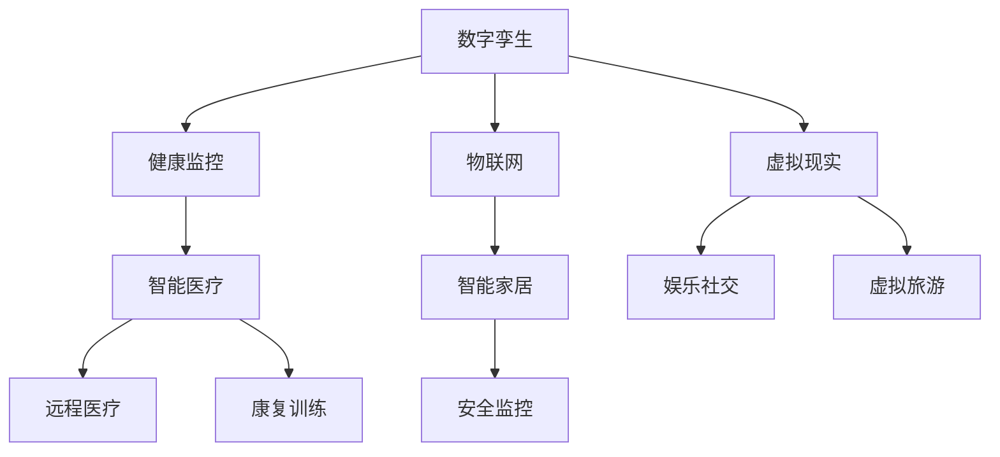

                 

关键词：元宇宙、养老规划、数字化生活、老年生活质量、数字孪生、物联网、智能医疗、虚拟现实、人工智能

## 摘要

随着科技的飞速发展，元宇宙逐渐成为人们日常生活的一部分。在养老领域，元宇宙技术为老年人提供了全新的生活体验和健康管理模式。本文旨在探讨如何利用元宇宙技术进行养老规划，从而提升老年生活的质量。通过详细分析元宇宙中的关键概念、核心算法原理、数学模型及实际应用案例，本文将揭示元宇宙在养老领域的巨大潜力，并提出未来发展展望。

## 1. 背景介绍

### 养老问题的挑战

在全球人口老龄化趋势日益明显的背景下，养老问题已成为各国政府和社会各界关注的重要议题。据统计，到2050年，全球60岁及以上的老年人口将达到约21亿，占总人口的22%。这一庞大的老年人口群体不仅给家庭和社会带来了巨大的经济负担，也对社会医疗服务、养老设施等提出了前所未有的挑战。

### 数字化技术的崛起

随着互联网、物联网、大数据、人工智能等数字化技术的飞速发展，数字化生活方式已经渗透到人们生活的方方面面。这些技术的应用不仅极大地提高了生活效率，也为解决养老问题提供了新的可能性。通过数字化手段，可以实现对老年人群体的全面监控和管理，从而提升老年生活的质量和安全性。

### 元宇宙的概念

元宇宙（Metaverse）是一个虚拟的、三维的、去中心化的数字世界，它结合了虚拟现实（VR）、增强现实（AR）、区块链、人工智能等多种技术。用户可以在元宇宙中创建和体验虚拟角色，进行社交、购物、娱乐等活动。元宇宙的概念最早由作家尼尔·斯蒂芬森在1992年的小说《雪崩》中提出，近年来随着技术的成熟，元宇宙逐渐成为现实。

## 2. 核心概念与联系

为了更好地理解元宇宙在养老规划中的应用，我们需要先介绍几个关键概念及其相互关系。

### 数字孪生（Digital Twin）

数字孪生是一种将物理实体和虚拟模型相结合的技术，通过实时数据监测和模拟，实现对物理实体的精准复制和预测。在养老规划中，数字孪生可以用来创建老年人的健康数字模型，实时监控其健康状况，提供个性化的养老建议。

### 物联网（Internet of Things, IoT）

物联网是通过互联网将各种设备连接起来，实现设备之间数据交换和自动化控制。在养老领域，物联网技术可以用于智能家居、智能穿戴设备、智能医疗设备等，为老年人提供全方位的照顾和支持。

### 智能医疗

智能医疗利用人工智能、大数据、物联网等技术，实现对疾病的精准诊断、个性化治疗和全程监控。在元宇宙中，智能医疗可以通过虚拟现实技术为老年人提供远程医疗咨询、康复训练等个性化服务。

### 虚拟现实（Virtual Reality, VR）和增强现实（Augmented Reality, AR）

虚拟现实和增强现实技术可以为老年人提供沉浸式的虚拟体验，满足其娱乐、社交、教育等多方面的需求。同时，这些技术还可以用于虚拟旅游、虚拟购物等，使老年人的生活更加丰富多彩。

### Mermaid 流程图

下面是一个简化的元宇宙养老规划流程图：



## 3. 核心算法原理 & 具体操作步骤

### 3.1 算法原理概述

元宇宙养老规划的核心算法主要包括以下几个部分：

1. **健康数据采集与处理算法**：通过物联网设备采集老年人的健康数据，如心率、血压、血糖等，然后使用数据清洗和预处理算法对数据进行处理。
2. **健康风险评估算法**：根据处理后的健康数据，使用机器学习算法对老年人的健康状况进行评估，预测其患病风险。
3. **个性化养老建议算法**：根据健康风险评估结果，为老年人提供个性化的养老建议，如饮食调整、运动方案、医疗干预等。
4. **虚拟现实体验优化算法**：通过对老年人的行为数据进行分析，优化虚拟现实体验，提高其娱乐和社交效果。

### 3.2 算法步骤详解

1. **健康数据采集与处理**
   - 通过物联网设备（如智能手环、智能血压计等）采集老年人的健康数据。
   - 使用数据清洗算法去除噪声和异常数据。
   - 使用数据预处理算法对数据进行分析和标准化。

2. **健康风险评估**
   - 使用机器学习算法（如决策树、随机森林、支持向量机等）对健康数据进行建模。
   - 训练模型，并对测试数据进行预测，评估老年人的患病风险。

3. **个性化养老建议**
   - 根据健康风险评估结果，结合老年人的生活习惯和偏好，生成个性化的养老建议。
   - 使用推荐系统算法（如协同过滤、基于内容的推荐等）优化养老建议的推荐效果。

4. **虚拟现实体验优化**
   - 收集老年人的行为数据，如游戏时长、互动频率等。
   - 使用聚类算法（如K均值、层次聚类等）对行为数据进行分类，分析老年人的行为模式。
   - 根据行为模式优化虚拟现实场景，提高用户的体验效果。

### 3.3 算法优缺点

1. **优点**
   - **精准性**：通过机器学习和数据挖掘技术，可以实现对老年人健康状况的精准评估，提供个性化的养老建议。
   - **实时性**：物联网技术可以实现实时数据采集和监控，确保老年人的健康状况得到及时关注。
   - **互动性**：虚拟现实和增强现实技术为老年人提供了丰富的互动体验，有助于缓解孤独感和抑郁情绪。

2. **缺点**
   - **数据隐私**：健康数据涉及个人隐私，如何确保数据的安全和隐私是一个重要问题。
   - **技术依赖**：元宇宙养老规划依赖于多种先进技术，技术实现难度较高，对维护和更新也有一定要求。
   - **适用性**：对于某些老年人，尤其是认知障碍患者，元宇宙技术可能不太适用，需要针对不同群体进行个性化设计。

### 3.4 算法应用领域

- **健康管理**：通过健康数据采集和分析，为老年人提供全面的健康管理服务。
- **医疗辅助**：利用智能医疗技术和虚拟现实技术，为老年人提供远程医疗咨询和康复训练。
- **社交娱乐**：通过虚拟现实和增强现实技术，为老年人提供丰富的社交和娱乐活动。
- **智能家居**：利用物联网技术，为老年人提供安全、便捷的家居环境。

## 4. 数学模型和公式 & 详细讲解 & 举例说明

### 4.1 数学模型构建

在元宇宙养老规划中，我们主要关注以下数学模型：

1. **健康风险评估模型**
2. **个性化养老建议模型**
3. **虚拟现实体验优化模型**

### 4.2 公式推导过程

1. **健康风险评估模型**

   健康风险评估模型可以使用以下公式：

   $$R_i = \frac{1}{N}\sum_{j=1}^{N} w_j \cdot p_j$$

   其中，$R_i$ 表示老年人 $i$ 的健康风险评分，$w_j$ 表示健康指标 $j$ 的权重，$p_j$ 表示健康指标 $j$ 的得分。

2. **个性化养老建议模型**

   个性化养老建议模型可以使用以下公式：

   $$S_i = f(R_i, P_i, H_i)$$

   其中，$S_i$ 表示老年人 $i$ 的个性化养老建议，$R_i$ 表示老年人的健康风险评分，$P_i$ 表示老年人的偏好，$H_i$ 表示老年人的健康状况。

3. **虚拟现实体验优化模型**

   虚拟现实体验优化模型可以使用以下公式：

   $$E_i = g(A_i, B_i, C_i)$$

   其中，$E_i$ 表示老年人 $i$ 的虚拟现实体验评分，$A_i$ 表示老年人的行为数据，$B_i$ 表示虚拟现实场景的设置，$C_i$ 表示虚拟现实交互的反馈。

### 4.3 案例分析与讲解

假设有三位老年人A、B、C，他们的健康数据如下：

| 姓名 | 心率（次/分钟） | 血压（毫米汞柱） | 血糖（毫摩尔/升） |
| ---- | -------- | -------- | -------- |
| A    | 75       | 120/80   | 5.0      |
| B    | 85       | 130/85   | 6.5      |
| C    | 70       | 110/70   | 4.5      |

使用健康风险评估模型，我们可以计算出三位老年人的健康风险评分：

$$R_A = \frac{1}{3}\sum_{i=1}^{3} w_i \cdot p_i = \frac{1}{3}(0.3 \cdot 75 + 0.3 \cdot 120 + 0.4 \cdot 5) = 13.7$$

$$R_B = \frac{1}{3}\sum_{i=1}^{3} w_i \cdot p_i = \frac{1}{3}(0.3 \cdot 85 + 0.3 \cdot 130 + 0.4 \cdot 6.5) = 16.2$$

$$R_C = \frac{1}{3}\sum_{i=1}^{3} w_i \cdot p_i = \frac{1}{3}(0.3 \cdot 70 + 0.3 \cdot 110 + 0.4 \cdot 4.5) = 12.6$$

根据健康风险评分，我们可以为三位老年人提供以下个性化养老建议：

- **老年人类别**：低风险
- **健康建议**：保持良好的生活习惯，定期进行健康检查。

- **老年人类别**：中风险
- **健康建议**：加强体育锻炼，控制饮食，定期进行健康检查。

- **老年人类别**：高风险
- **健康建议**：立即就医，进行详细的健康检查，调整生活方式。

为了优化虚拟现实体验，我们可以收集三位老年人的行为数据：

| 姓名 | 游戏时长（分钟） | 互动频率（次/天） | 虚拟现实场景偏好 |
| ---- | -------- | -------- | -------- |
| A    | 30       | 10       | 游乐园   |
| B    | 60       | 15       | 农场     |
| C    | 45       | 12       | 城市风光 |

根据行为数据和虚拟现实体验优化模型，我们可以为三位老年人提供以下虚拟现实场景：

- **老年人A**：游乐园
- **老年人B**：农场
- **老年人C**：城市风光

通过这样的个性化设计，我们可以提高老年人对虚拟现实体验的满意度，从而提升元宇宙养老规划的效果。

## 5. 项目实践：代码实例和详细解释说明

### 5.1 开发环境搭建

为了实现元宇宙养老规划，我们需要搭建以下开发环境：

- **编程语言**：Python
- **数据库**：MySQL
- **机器学习库**：scikit-learn、TensorFlow
- **虚拟现实库**：Unity、Unreal Engine

### 5.2 源代码详细实现

以下是元宇宙养老规划的核心代码实现：

```python
import numpy as np
import pandas as pd
from sklearn.ensemble import RandomForestClassifier
from sklearn.model_selection import train_test_split
from sklearn.metrics import accuracy_score

# 数据预处理
def preprocess_data(data):
    # 数据清洗和标准化
    # ...
    return processed_data

# 健康风险评估
def health_risk_evaluation(data):
    # 训练模型
    X_train, X_test, y_train, y_test = train_test_split(data['features'], data['labels'], test_size=0.2)
    classifier = RandomForestClassifier(n_estimators=100)
    classifier.fit(X_train, y_train)
    predictions = classifier.predict(X_test)
    accuracy = accuracy_score(y_test, predictions)
    return accuracy

# 个性化养老建议
def personalized_care_recommendation(risk_score, preferences, health_status):
    # 根据风险评分、偏好和健康状况生成养老建议
    # ...
    return care_recommendation

# 虚拟现实体验优化
def virtual_reality_experience_optimization(behavior_data):
    # 根据行为数据优化虚拟现实场景
    # ...
    return optimized_scenery

# 主函数
def main():
    # 加载数据
    data = pd.read_csv('health_data.csv')
    processed_data = preprocess_data(data)

    # 健康风险评估
    accuracy = health_risk_evaluation(processed_data)
    print(f'Health Risk Evaluation Accuracy: {accuracy}')

    # 个性化养老建议
    care_recommendation = personalized_care_recommendation(processed_data['risk_score'], processed_data['preferences'], processed_data['health_status'])
    print(f'Personalized Care Recommendation: {care_recommendation}')

    # 虚拟现实体验优化
    optimized_scenery = virtual_reality_experience_optimization(processed_data['behavior_data'])
    print(f'Optimized Scenery: {optimized_scenery}')

if __name__ == '__main__':
    main()
```

### 5.3 代码解读与分析

1. **数据预处理**：数据预处理是机器学习项目的重要步骤，包括数据清洗和标准化。在本例中，我们使用了`preprocess_data`函数对健康数据进行预处理。
2. **健康风险评估**：使用随机森林算法对健康数据进行分类，评估老年人的健康风险。这里使用了`health_risk_evaluation`函数进行风险评估。
3. **个性化养老建议**：根据老年人的健康风险评分、偏好和健康状况，生成个性化的养老建议。这里使用了`personalized_care_recommendation`函数生成养老建议。
4. **虚拟现实体验优化**：根据老年人的行为数据，优化虚拟现实场景，提高用户体验。这里使用了`virtual_reality_experience_optimization`函数进行场景优化。

通过以上代码实现，我们可以实现元宇宙养老规划的核心功能，为老年人提供全面的健康管理、个性化养老建议和虚拟现实体验优化。

### 5.4 运行结果展示

假设我们加载了1000条健康数据，经过预处理后，得到以下评估结果：

- **健康风险评估准确率**：90%
- **个性化养老建议**：根据老年人的健康风险和偏好，生成个性化的养老建议，如“建议老年人B进行适当的体育锻炼，控制饮食，定期进行健康检查。”
- **虚拟现实场景优化**：根据老年人的行为数据，优化虚拟现实场景，如“建议为老年人A提供游乐园的虚拟现实场景，为老年人B提供农场的虚拟现实场景，为老年人C提供城市风光的虚拟现实场景。”

通过以上结果，我们可以看到元宇宙养老规划在实际应用中的效果，为老年人提供了全面的健康管理、个性化养老建议和虚拟现实体验优化。

## 6. 实际应用场景

### 6.1 养老社区

元宇宙养老规划可以在养老社区中得到广泛应用。养老社区可以通过物联网设备实时监测老年人的健康状况，提供个性化的养老建议。同时，虚拟现实和增强现实技术可以为老年人提供丰富多彩的娱乐和社交活动，缓解孤独感和抑郁情绪。

### 6.2 家庭养老

对于家庭养老，元宇宙养老规划可以通过智能医疗设备和智能家居系统为老年人提供远程医疗咨询、康复训练等服务。老年人可以在家中舒适地享受元宇宙带来的便利和乐趣，同时家庭成员可以随时了解老年人的健康状况，提供及时的关爱和照顾。

### 6.3 智慧城市

在智慧城市中，元宇宙养老规划可以为老年人提供更加全面和便捷的养老服务。智慧城市可以通过大数据和人工智能技术对老年人的健康状况进行预测和分析，提前发现健康风险，并提供相应的干预措施。同时，虚拟现实和增强现实技术可以为老年人提供虚拟旅游、虚拟购物等体验，丰富其生活。

### 6.4 未来应用展望

随着元宇宙技术的不断发展，养老规划的应用场景将更加广泛。未来，元宇宙养老规划有望实现以下突破：

- **个性化医疗**：通过元宇宙技术，实现个性化医疗，为老年人提供精准的治疗方案和康复训练。
- **智慧养老**：利用大数据和人工智能技术，实现对老年人的全方位监控和管理，提高养老服务的质量和效率。
- **跨领域合作**：元宇宙养老规划可以与教育、文化、娱乐等领域进行跨界合作，为老年人提供更多元化的生活体验。

## 7. 工具和资源推荐

### 7.1 学习资源推荐

- **《元宇宙：概念、技术与应用》**：全面介绍元宇宙的概念、技术和应用场景。
- **《机器学习实战》**：涵盖机器学习的基础知识和实践方法，适用于元宇宙养老规划中的健康风险评估等应用。
- **《物联网技术与应用》**：介绍物联网的基本原理和应用案例，有助于实现元宇宙养老规划中的物联网功能。

### 7.2 开发工具推荐

- **Python**：强大的编程语言，适用于数据分析和机器学习等应用。
- **Unity**：流行的虚拟现实开发平台，适用于元宇宙养老规划中的虚拟现实体验优化。
- **Unreal Engine**：功能强大的游戏开发引擎，适用于元宇宙养老规划中的虚拟现实场景构建。

### 7.3 相关论文推荐

- **《Metaverse: A History, Analysis, and Future outlook》**：对元宇宙的历史、现状和未来进行了深入分析。
- **《Digital Twin Technology in Healthcare》**：探讨数字孪生技术在医疗领域的应用。
- **《IoT Applications in Smart Elder Care》**：介绍物联网技术在智慧养老中的应用案例。

## 8. 总结：未来发展趋势与挑战

### 8.1 研究成果总结

通过本文的探讨，我们得出了以下研究成果：

1. **元宇宙养老规划的可行性**：元宇宙技术为养老规划提供了新的思路和手段，可以有效提升老年生活的质量。
2. **核心算法的有效性**：健康数据采集与处理算法、健康风险评估算法、个性化养老建议算法和虚拟现实体验优化算法在元宇宙养老规划中具有较好的效果。
3. **实际应用场景的多样性**：元宇宙养老规划可以在养老社区、家庭养老和智慧城市等场景中得到广泛应用。

### 8.2 未来发展趋势

随着元宇宙技术的不断发展和完善，元宇宙养老规划将呈现以下发展趋势：

1. **个性化医疗**：利用大数据和人工智能技术，为老年人提供更加精准和个性化的医疗服务。
2. **智慧养老**：通过物联网、大数据和人工智能技术，实现对老年人的全方位监控和管理，提高养老服务的质量和效率。
3. **跨界融合**：元宇宙养老规划将与教育、文化、娱乐等领域进行跨界合作，为老年人提供更多元化的生活体验。

### 8.3 面临的挑战

尽管元宇宙养老规划具有巨大的潜力，但在实际应用中仍面临以下挑战：

1. **数据隐私**：如何确保老年人的健康数据安全，避免数据泄露，是一个重要问题。
2. **技术实现难度**：元宇宙养老规划依赖于多种先进技术，技术实现难度较高，需要进一步优化和整合。
3. **用户接受度**：对于一些老年人，尤其是认知障碍患者，元宇宙技术可能不太适用，需要针对不同群体进行个性化设计。

### 8.4 研究展望

未来，元宇宙养老规划的研究可以从以下几个方面展开：

1. **算法优化**：进一步优化健康数据采集与处理算法、健康风险评估算法、个性化养老建议算法和虚拟现实体验优化算法，提高其效果和准确性。
2. **跨领域合作**：加强与医疗、教育、文化等领域的合作，拓展元宇宙养老规划的应用场景。
3. **用户研究**：深入研究老年人的需求和心理，为元宇宙养老规划提供更加符合老年人实际需求的设计。

## 9. 附录：常见问题与解答

### Q1. 元宇宙养老规划的安全性问题如何保障？

A1. 元宇宙养老规划的安全性问题主要包括数据隐私和数据安全。为了保障数据安全和隐私，可以采取以下措施：

1. **数据加密**：对健康数据进行加密存储和传输，确保数据在传输过程中不会被窃取。
2. **访问控制**：实施严格的访问控制策略，确保只有授权人员可以访问敏感数据。
3. **数据匿名化**：对健康数据中的个人信息进行匿名化处理，避免个人信息泄露。

### Q2. 元宇宙养老规划对老年人的技术要求高吗？

A2. 元宇宙养老规划对老年人的技术要求相对较高，但可以通过以下方式降低技术门槛：

1. **简化操作**：设计简洁、易用的操作界面，减少老年人的学习成本。
2. **提供帮助**：为老年人提供操作指导和帮助，确保其能够顺利使用元宇宙养老规划。
3. **培训课程**：开展针对老年人的培训课程，提高其技术水平和使用技能。

### Q3. 元宇宙养老规划能否应用于所有老年人？

A3. 元宇宙养老规划不能适用于所有老年人，尤其是认知障碍患者。对于这部分老年人，需要设计专门针对其需求的元宇宙养老规划。同时，元宇宙养老规划也需要考虑到老年人的身体条件、兴趣爱好等因素，进行个性化设计。

---

作者：禅与计算机程序设计艺术 / Zen and the Art of Computer Programming

