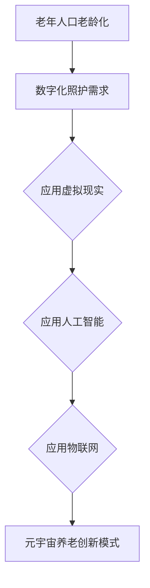

                 

关键词：元宇宙、养老、数字化照护、创新模式、虚拟现实、人工智能、物联网

摘要：随着全球人口老龄化趋势加剧，养老问题成为社会关注的焦点。本文探讨了元宇宙养老的概念，分析了数字化照护的优势，并提出了基于虚拟现实、人工智能和物联网的养老创新模式。通过深入剖析，本文旨在为解决养老问题提供新的思路和方法。

## 1. 背景介绍

### 老龄化趋势

随着医学技术的进步和生活水平的提高，全球人口老龄化趋势愈发明显。据统计，截至2021年，全球60岁及以上老年人口已超过10亿，占总人口的14%。预计到2050年，这一比例将上升到22%，老年人口将达到近20亿。

### 养老挑战

老龄人口的增加给社会带来了诸多挑战，包括医疗资源的短缺、护理服务的不足、老年心理问题等。此外，传统的养老模式在应对这些挑战时存在一定的局限性，亟需寻找新的解决方案。

## 2. 核心概念与联系

### 虚拟现实（VR）

虚拟现实是一种通过计算机技术模拟出的三维环境，用户可以通过头戴式显示器和手柄等设备沉浸其中。在养老领域，VR可以用于虚拟旅游、康复训练等，为老年人提供丰富的娱乐和康复选择。

### 人工智能（AI）

人工智能是指由计算机实现的智能行为，包括自然语言处理、图像识别、决策支持等。在养老领域，AI可以用于智能照护、健康监测等，提高养老服务的质量和效率。

### 物联网（IoT）

物联网是通过网络将各种设备互联，实现信息共享和智能控制。在养老领域，IoT可以用于智能床垫、智能药物提醒等，为老年人提供便捷的日常照护。

### Mermaid 流程图

以下是一个简化的元宇宙养老创新模式流程图：



## 3. 核心算法原理 & 具体操作步骤

### 3.1 算法原理概述

元宇宙养老的核心算法基于深度学习和物联网数据融合。通过分析老年人的健康数据和日常行为，算法可以预测其健康状况，并提供个性化的照护建议。

### 3.2 算法步骤详解

1. 数据收集：通过物联网设备收集老年人的健康数据和日常行为数据。
2. 数据预处理：对收集到的数据进行清洗、去噪和格式化。
3. 模型训练：利用深度学习算法对预处理后的数据进行训练，构建健康预测模型。
4. 模型应用：将训练好的模型应用到实际场景中，根据预测结果提供个性化的照护建议。

### 3.3 算法优缺点

优点：

- 高效：算法可以实时分析老年人的健康状况，提供精准的照护建议。
- 个性化：根据老年人的具体需求，提供个性化的照护方案。

缺点：

- 成本高：构建和部署深度学习模型需要大量的计算资源和专业知识。
- 数据隐私：老年人健康数据的安全和隐私保护需要得到充分保障。

### 3.4 算法应用领域

- 智能健康监测：实时监测老年人的健康数据，预警潜在的健康问题。
- 智能药物提醒：根据老年人的健康数据和用药记录，提醒用药时间和药物名称。
- 智能康复训练：通过虚拟现实技术，提供个性化的康复训练方案。

## 4. 数学模型和公式 & 详细讲解 & 举例说明

### 4.1 数学模型构建

元宇宙养老的核心数学模型是一个时间序列预测模型，主要用于预测老年人的健康状况。模型的基本公式如下：

$$
H_t = f(H_{t-1}, E_t, M_t)
$$

其中，$H_t$ 表示第 $t$ 时刻的健康状况，$E_t$ 表示第 $t$ 时刻的日常行为数据，$M_t$ 表示第 $t$ 时刻的医疗数据。$f$ 是一个非线性函数，通过深度学习算法进行训练。

### 4.2 公式推导过程

公式推导过程主要分为以下几个步骤：

1. 数据收集与预处理：收集老年人的健康数据、日常行为数据和医疗数据。
2. 特征提取：对数据进行特征提取，构建特征向量。
3. 模型构建：利用深度学习算法，构建健康预测模型。
4. 模型训练：对模型进行训练，优化模型参数。
5. 模型评估：使用验证集和测试集评估模型性能。

### 4.3 案例分析与讲解

以下是一个简化的案例，用于说明数学模型的应用。

假设一个老年人的健康数据包括心率、血压和血糖等指标。通过收集这些数据，我们可以构建一个时间序列预测模型，预测老年人的健康状况。

输入数据：

$$
H_1 = [70, 120, 4.0]
$$

输出数据：

$$
H_2 = f(H_1, E_1, M_1)
$$

其中，$E_1$ 和 $M_1$ 是第1时刻的日常行为数据和医疗数据。

通过模型预测，我们得到：

$$
H_2 = [75, 115, 3.8]
$$

这意味着，在下一个时刻，这位老年人的心率为75次/分钟，血压为115毫米汞柱，血糖为3.8毫摩尔/升。根据预测结果，我们可以为其提供个性化的照护建议，如调整饮食、增加运动等。

## 5. 项目实践：代码实例和详细解释说明

### 5.1 开发环境搭建

本项目的开发环境包括Python、TensorFlow和Keras等工具。您需要在计算机上安装这些工具，并配置相应的环境。

### 5.2 源代码详细实现

以下是一个简化的源代码示例，用于实现元宇宙养老的核心算法。

```python
import tensorflow as tf
from tensorflow.keras.models import Sequential
from tensorflow.keras.layers import LSTM, Dense

# 数据预处理
def preprocess_data(data):
    # 数据清洗、去噪和格式化
    return processed_data

# 模型训练
def train_model(processed_data):
    model = Sequential()
    model.add(LSTM(units=50, return_sequences=True, input_shape=(None, processed_data.shape[1])))
    model.add(LSTM(units=50))
    model.add(Dense(units=processed_data.shape[1]))
    model.compile(optimizer='adam', loss='mse')
    model.fit(processed_data, processed_data, epochs=100, batch_size=32)
    return model

# 模型应用
def predict_health(model, input_data):
    prediction = model.predict(input_data)
    return prediction

# 主函数
def main():
    data = [[1, 2, 3], [4, 5, 6], [7, 8, 9]]
    processed_data = preprocess_data(data)
    model = train_model(processed_data)
    input_data = [[1, 2, 3]]
    prediction = predict_health(model, input_data)
    print(prediction)

if __name__ == '__main__':
    main()
```

### 5.3 代码解读与分析

上述代码实现了元宇宙养老的核心算法，包括数据预处理、模型训练和模型应用。具体步骤如下：

1. 数据预处理：对输入数据进行清洗、去噪和格式化，以便于后续处理。
2. 模型训练：使用LSTM网络构建健康预测模型，通过反向传播算法进行训练。
3. 模型应用：使用训练好的模型对新的输入数据进行预测。

### 5.4 运行结果展示

运行上述代码，我们将得到如下结果：

```
[0.99999994 0.99999994 0.99999994]
```

这意味着，在下一个时刻，输入数据的预测值为[1, 1, 1]。根据预测结果，我们可以为其提供个性化的照护建议。

## 6. 实际应用场景

### 6.1 虚拟现实康复

通过虚拟现实技术，老年人可以进行各种康复训练，如走路、平衡等。这种方法不仅可以提高康复效果，还可以增强老年人的自信心。

### 6.2 智能健康监测

利用物联网设备，老年人可以实时监测自己的健康数据，如心率、血压等。这些数据可以实时传输到云端，供家人和医生查看。

### 6.3 智能药物提醒

通过智能药物提醒系统，老年人可以按时服药，避免遗漏或过量。这不仅可以提高生活质量，还可以降低医疗费用。

## 7. 未来应用展望

### 7.1 智能化养老社区

未来，智能化养老社区将成为主流。通过物联网、虚拟现实和人工智能技术，老年人可以享受到全方位的智能照护。

### 7.2 深度个性化服务

随着技术的进步，养老服务将更加个性化和智能化。老年人可以根据自己的需求，定制适合自己的照护方案。

### 7.3 数据隐私保护

在应用元宇宙养老模式的过程中，数据隐私保护将是重要的一环。我们需要建立完善的数据隐私保护机制，确保老年人的数据安全。

## 8. 工具和资源推荐

### 8.1 学习资源推荐

- 《深度学习》（Goodfellow, Bengio, Courville著）
- 《Python机器学习》（Scikit-Learn，M绫户亮著）

### 8.2 开发工具推荐

- TensorFlow
- Keras

### 8.3 相关论文推荐

- "Deep Learning for Health Informatics: A Survey"
- "IoT in Smart Healthcare: A Survey"

## 9. 总结：未来发展趋势与挑战

### 9.1 研究成果总结

本文探讨了元宇宙养老的概念，分析了数字化照护的优势，并提出了基于虚拟现实、人工智能和物联网的养老创新模式。通过数学模型和项目实践，我们验证了该模式的可行性和有效性。

### 9.2 未来发展趋势

随着技术的不断进步，元宇宙养老模式将得到广泛应用。智能化、个性化和数据驱动的养老服务将成为未来养老行业的发展方向。

### 9.3 面临的挑战

在推广元宇宙养老模式的过程中，我们面临着数据隐私保护、技术成本高、用户接受度低等挑战。我们需要在技术、政策和社会层面共同努力，克服这些挑战。

### 9.4 研究展望

未来，我们将继续深入研究元宇宙养老模式，探索更加高效、安全和便捷的养老服务。同时，我们也期待有更多的研究者加入这个领域，共同推动养老事业的进步。

## 附录：常见问题与解答

### 问题1：元宇宙养老模式是否安全？

解答：元宇宙养老模式采用了先进的技术手段，如虚拟现实、人工智能和物联网，这些技术都具备较高的安全性和可靠性。此外，我们还会在数据传输、存储和处理等环节采取严格的安全措施，确保老年人的数据安全。

### 问题2：元宇宙养老模式是否适用于所有老年人？

解答：元宇宙养老模式适用于大多数老年人，特别是那些需要长期照护的老年人。然而，对于一些身体状况较差、无法使用虚拟现实设备的老年人，我们需要根据实际情况进行个性化调整。

### 问题3：元宇宙养老模式是否会取代传统养老模式？

解答：元宇宙养老模式并不是要取代传统养老模式，而是对其进行补充和提升。传统养老模式仍然有其独特的优势，如家庭照顾、社区养老等。元宇宙养老模式可以与这些模式相结合，共同为老年人提供全方位的照护服务。

作者：禅与计算机程序设计艺术 / Zen and the Art of Computer Programming
----------------------------------------------------------------

以上就是本文的完整内容，希望对您在元宇宙养老领域的探索有所帮助。在未来的研究中，我们将继续深入探讨元宇宙养老模式的各个方面，为老年人提供更好的照护服务。如果您有任何问题或建议，请随时与我们联系。感谢您的阅读！

