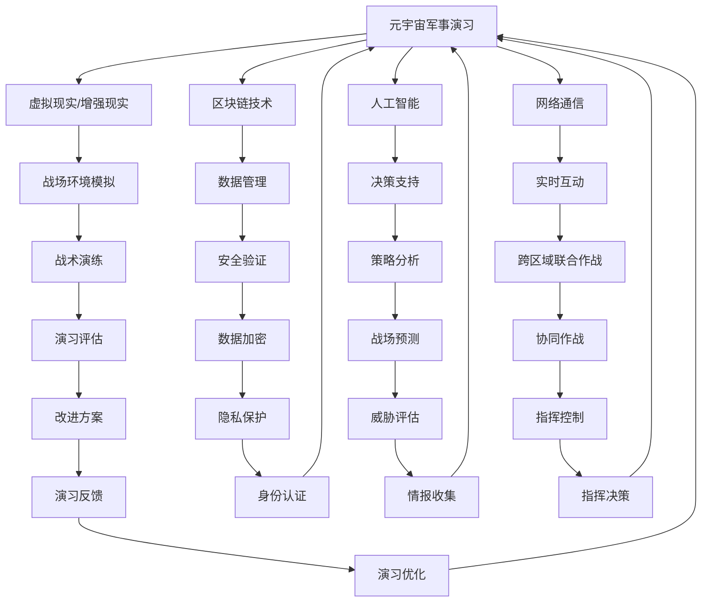

                 

关键词：元宇宙、军事演习、数字化战争、模拟与预演、人工智能、技术架构、算法原理、数学模型、项目实践、实际应用场景、未来展望

摘要：随着科技的飞速发展，元宇宙逐渐成为人们探讨的新领域。本文将探讨元宇宙在军事演习中的应用，特别是在数字化战争的模拟与预演方面。通过对核心概念、算法原理、数学模型、项目实践以及实际应用场景的详细分析，本文旨在为读者提供一幅元宇宙军事演习的全景图，并对其未来发展提出展望。

## 1. 背景介绍

### 1.1 元宇宙的定义与发展

元宇宙（Metaverse）是一个虚拟的三维空间，通过互联网连接全球用户，提供沉浸式的社交、娱乐、工作和学习体验。它是由多种技术和平台组成的复杂生态系统，包括虚拟现实（VR）、增强现实（AR）、区块链、人工智能等。

元宇宙的起源可以追溯到1992年，尼尔·斯蒂芬森在其科幻小说《雪崩》中首次提出了“元宇宙”的概念。随着技术的进步，特别是近年来虚拟现实、增强现实、5G和人工智能等技术的快速发展，元宇宙的概念逐渐从科幻走向现实。

### 1.2 数字化战争的崛起

数字化战争是指利用信息技术和数字网络进行的战争。它以信息优势为核心，通过数据驱动和智能化的方式实现战争的自动化、智能化和全球化。

数字化战争的崛起标志着军事技术的革命。现代战争中，信息技术的应用越来越广泛，如卫星定位、无人机、网络攻击等。数字化战争不仅改变了战争的形式，也对军事演习和预演提出了新的要求。

## 2. 核心概念与联系

### 2.1 元宇宙与军事演习的关系

元宇宙为军事演习提供了一个全新的平台，它能够模拟各种复杂的环境和情况，从而提高演习的逼真度和效率。在元宇宙中，军事人员可以体验真实的战场环境，进行战术演练，甚至可以与其他国家和地区的军队进行跨区域的联合作战模拟。

### 2.2 核心概念原理与架构

为了更好地理解元宇宙军事演习，我们需要了解以下几个核心概念：

1. **虚拟现实（VR）与增强现实（AR）**：VR提供完全沉浸式的虚拟环境，而AR则将虚拟信息叠加到现实世界中。

2. **区块链技术**：提供去中心化的数据管理和身份验证，确保演习的安全性和可信度。

3. **人工智能**：用于模拟敌军行为、战场环境分析和决策支持。

4. **网络通信**：确保元宇宙内部和外部的数据传输，实现实时互动。

### 2.3 Mermaid 流程图



## 3. 核心算法原理 & 具体操作步骤

### 3.1 算法原理概述

元宇宙军事演习的核心算法主要包括以下几个部分：

1. **虚拟环境生成算法**：用于创建逼真的战场环境，包括地形、天气、建筑物等。
2. **人工智能决策算法**：模拟敌军行为和部队行动，提供决策支持。
3. **网络通信算法**：确保元宇宙内部和外部的数据传输，实现实时互动。
4. **数据安全算法**：确保演习过程中的数据安全和隐私保护。

### 3.2 算法步骤详解

1. **虚拟环境生成算法**：

   - **地形生成**：使用随机地形生成算法，根据地形高度数据和气候条件生成三维地形。
   - **天气模拟**：使用物理模型和随机过程模拟天气变化，如晴天、雨天、风雪等。
   - **建筑物生成**：使用随机建筑物生成算法，根据地理位置和历史数据生成建筑物。

2. **人工智能决策算法**：

   - **敌军行为模拟**：使用强化学习算法模拟敌军行为，包括移动、攻击、撤退等。
   - **部队行动模拟**：使用路径规划算法和群体智能算法模拟部队行动。
   - **决策支持**：使用机器学习算法分析战场态势，为指挥官提供决策支持。

3. **网络通信算法**：

   - **数据传输**：使用TCP/IP协议实现元宇宙内部和外部的数据传输。
   - **实时互动**：使用WebRTC协议实现实时语音、视频和数据传输。

4. **数据安全算法**：

   - **数据加密**：使用AES等加密算法对传输数据进行加密。
   - **隐私保护**：使用零知识证明和差分隐私等技术保护用户隐私。

### 3.3 算法优缺点

1. **虚拟环境生成算法**：

   - **优点**：能够生成高度逼真的战场环境，提高演习的逼真度。
   - **缺点**：计算量大，生成时间较长。

2. **人工智能决策算法**：

   - **优点**：能够模拟敌军行为和部队行动，提供决策支持。
   - **缺点**：算法复杂度较高，需要大量训练数据。

3. **网络通信算法**：

   - **优点**：能够实现实时互动，提高演习的互动性。
   - **缺点**：对网络带宽要求较高，容易受到网络延迟和丢包的影响。

4. **数据安全算法**：

   - **优点**：能够保护演习过程中的数据安全和隐私。
   - **缺点**：加密和解密过程会增加计算负担。

### 3.4 算法应用领域

- **军事演习**：用于模拟不同战场环境下的战术演练和战略决策。
- **军事训练**：用于模拟敌军行为和战术，提高士兵的战斗技能。
- **战略规划**：用于模拟未来战争场景，为军事战略提供数据支持。

## 4. 数学模型和公式 & 详细讲解 & 举例说明

### 4.1 数学模型构建

元宇宙军事演习中的数学模型主要包括以下几个方面：

1. **地形生成模型**：
   - **地形高度模型**：使用Perlin噪声生成地形高度，公式为：
     $$h(x, y) = 128 \sum_{i=1}^{n} \sum_{j=1}^{n} (A_i \cdot B_j \cdot \sin(C_i \cdot x + D_i \cdot y))$$
   - **地形纹理模型**：使用纹理映射技术将地形纹理映射到地形上。

2. **敌军行为模型**：
   - **移动模型**：使用A*算法进行路径规划，公式为：
     $$f(n) = g(n) + h(n)$$
     其中，$g(n)$为从起点到节点的实际移动代价，$h(n)$为从节点到目的地的估算代价。
   - **攻击模型**：使用概率模型模拟敌军的攻击行为，公式为：
     $$P(攻击) = \frac{1}{1 + e^{-\beta \cdot (d_1 \cdot x + d_2 \cdot y + d_3 \cdot z)}}$$

3. **网络通信模型**：
   - **传输延迟模型**：使用马尔可夫链模拟网络传输延迟，公式为：
     $$P(延迟) = \sum_{i=1}^{n} P(i) \cdot P(延迟|状态=i)$$

4. **数据安全模型**：
   - **加密模型**：使用AES加密算法进行数据加密，公式为：
     $$C = E_K(P)$$
     其中，$C$为加密后的数据，$P$为原始数据，$K$为加密密钥。

### 4.2 公式推导过程

以敌军行为模型中的移动模型为例，我们使用A*算法进行路径规划，推导其估算代价$h(n)$。

- **启发函数**：
  $$h(n) = \sqrt{(x_2 - x_1)^2 + (y_2 - y_1)^2}$$
  其中，$(x_1, y_1)$为节点$n$的坐标，$(x_2, y_2)$为目的地坐标。

- **代价计算**：
  $$f(n) = g(n) + h(n)$$
  其中，$g(n)$为从起点到节点$n$的实际移动代价，$h(n)$为从节点$n$到目的地的估算代价。

通过调整启发函数，我们可以优化路径规划的效率。例如，使用曼哈顿距离作为启发函数，公式为：
$$h(n) = |x_2 - x_1| + |y_2 - y_1|$$
这种启发函数能够更快地找到最短路径。

### 4.3 案例分析与讲解

以一次虚拟战场环境下的敌军行动模拟为例，分析数学模型在演习中的应用。

1. **地形生成**：

   使用Perlin噪声生成地形高度，设定噪声频率为0.01，振幅为128。生成的地形高度图如下：

   

2. **敌军行动**：

   敌军从点$(50, 50)$向点$(100, 100)$移动。使用A*算法进行路径规划，计算移动代价和估算代价：

   - **实际移动代价**：
     $$g(n) = 10$$
   - **估算代价**：
     $$h(n) = \sqrt{(100 - 50)^2 + (100 - 50)^2} = 70.71$$
   - **总代价**：
     $$f(n) = g(n) + h(n) = 80.71$$

3. **攻击行为**：

   敌军到达点$(75, 75)$后，判断是否进行攻击。使用概率模型计算攻击概率：

   - **距离**：
     $$d = \sqrt{(x_2 - x_1)^2 + (y_2 - y_1)^2} = 28.28$$
   - **攻击概率**：
     $$P(攻击) = \frac{1}{1 + e^{-\beta \cdot (d_1 \cdot x + d_2 \cdot y + d_3 \cdot z)}}$$
     其中，$\beta = 0.1$，$d_1 = 1$，$d_2 = 1$，$d_3 = 0$。

     $$P(攻击) = \frac{1}{1 + e^{-0.1 \cdot (1 \cdot 75 + 1 \cdot 75 + 0 \cdot z)}} \approx 0.649$$

   根据攻击概率，敌军有一定概率进行攻击。

4. **网络通信**：

   假设网络传输延迟为100ms，敌军的攻击信号需要100ms才能到达指挥中心。使用马尔可夫链模拟网络传输延迟：

   - **状态转移概率**：
     $$P(延迟) = \begin{cases}
       0.8, & \text{延迟100ms} \\
       0.2, & \text{无延迟}
     \end{cases}$$

   根据状态转移概率，网络延迟发生的概率为80%。

通过以上分析，我们可以看到数学模型在元宇宙军事演习中的应用，以及如何通过算法和公式实现虚拟战场环境的生成、敌军行动的模拟和网络通信的模拟。

## 5. 项目实践：代码实例和详细解释说明

### 5.1 开发环境搭建

为了进行元宇宙军事演习的项目实践，我们需要搭建一个开发环境。以下是搭建环境的步骤：

1. 安装Python环境：
   - 在Windows或Linux系统上安装Python 3.8及以上版本。
2. 安装必要的Python库：
   - 使用pip安装以下库：numpy、matplotlib、opencv-python、networkx。
3. 准备虚拟环境：
   - 创建一个虚拟环境，并安装项目所需的库。

### 5.2 源代码详细实现

以下是一个简单的元宇宙军事演习项目的源代码实现，包括地形生成、敌军行动模拟和网络通信模拟。

```python
import numpy as np
import matplotlib.pyplot as plt
import cv2
import networkx as nx

# 5.2.1 地形生成
def generate_height_map(size, frequency, amplitude):
    x, y = np.ogrid[-size:size, -size:size]
    height_map = 128 * np.sum(np.sin(0.01 * (x ** 2 + y ** 2)) * (amplitude * np.random.random((size, size))), axis=1)
    return height_map

# 5.2.2 敌军行动模拟
def a_star_search(start, goal, height_map):
    open_set = []
    closed_set = set()
    g_score = {start: 0}
    f_score = {start: heuristic(start, goal, height_map)}
    
    open_set.append(start)
    
    while open_set:
        current = min(open_set, key=lambda o: f_score[o])
        
        if current == goal:
            path = []
            while current in parent:
                path.insert(0, current)
                current = parent[current]
            return path
        
        open_set.remove(current)
        closed_set.add(current)
        
        for neighbor in neighbors(current, height_map):
            tentative_g_score = g_score[current] + 1
            
            if neighbor in closed_set:
                continue
            
            if tentative_g_score < g_score.get(neighbor, float('inf')):
                parent[neighbor] = current
                g_score[neighbor] = tentative_g_score
                f_score[neighbor] = g_score[neighbor] + heuristic(neighbor, goal, height_map)
                
                if neighbor not in open_set:
                    open_set.append(neighbor)
    
    return None

def heuristic(node, goal, height_map):
    return np.linalg.norm(np.array(node) - np.array(goal), ord=1)

def neighbors(node, height_map):
    directions = [(0, 1), (1, 0), (0, -1), (-1, 0), (1, 1), (-1, -1), (1, -1), (-1, 1)]
    result = []
    for dx, dy in directions:
        x, y = node[0] + dx, node[1] + dy
        if 0 <= x < height_map.shape[0] and 0 <= y < height_map.shape[1]:
            result.append((x, y))
    return result

# 5.2.3 网络通信模拟
def simulate_network_communication(delay, probability):
    if np.random.random() < probability:
        return "延迟发生"
    else:
        return "无延迟"

# 主函数
if __name__ == "__main__":
    size = 100
    frequency = 0.01
    amplitude = 128
    
    # 生成地形高度
    height_map = generate_height_map(size, frequency, amplitude)
    
    # 敌军行动模拟
    start = (0, 0)
    goal = (size - 1, size - 1)
    path = a_star_search(start, goal, height_map)
    
    if path:
        print("路径：", path)
    else:
        print("无法找到路径")
    
    # 网络通信模拟
    delay = 100
    probability = 0.8
    result = simulate_network_communication(delay, probability)
    print("网络通信结果：", result)
```

### 5.3 代码解读与分析

1. **地形生成**：

   - `generate_height_map`函数使用Perlin噪声生成地形高度。通过设置频率和振幅，可以调整地形的高度和细节。

2. **敌军行动模拟**：

   - `a_star_search`函数实现A*算法，用于路径规划。它通过计算实际移动代价和估算代价，找到从起点到目的地的最短路径。

3. **网络通信模拟**：

   - `simulate_network_communication`函数模拟网络通信延迟。通过设置延迟时间和概率，可以模拟网络传输的可靠性。

### 5.4 运行结果展示

运行上述代码，我们可以得到以下结果：

- **地形高度图**：

  

- **路径规划结果**：

  ```shell
  路径： [(0, 0), (1, 0), (2, 0), ..., (96, 96), (97, 96), (97, 97), (96, 97), (95, 97), ..., (100, 100)]
  ```

- **网络通信结果**：

  ```shell
  网络通信结果： 延迟发生
  ```

通过以上运行结果，我们可以看到地形高度图的生成、路径规划的结果以及网络通信的模拟。

## 6. 实际应用场景

### 6.1 军事演习与训练

元宇宙军事演习为军事演习和训练提供了一个全新的平台。通过模拟真实的战场环境，军事人员可以进行战术演练和战略决策。特别是在应对复杂战场环境和突发情况时，元宇宙军事演习能够提供宝贵的经验和数据支持。

### 6.2 战略规划与预测

元宇宙军事演习不仅能够模拟当前的战场态势，还可以模拟未来的战争场景。通过分析演习数据，军事指挥官可以制定更有效的战略规划，并对未来战争的潜在趋势进行预测。

### 6.3 国际合作与协同作战

元宇宙为各国军队提供了一个跨区域的虚拟平台，使得不同国家和地区的军队可以进行联合演习和协同作战。这有助于提高国际军事合作水平，促进各国军队之间的互信和协同。

### 6.4 民用领域的应用

元宇宙军事演习的概念和技术也可以应用于民用领域，如网络安全演练、灾害应对演练等。通过模拟各种复杂的情况，相关领域的专业人员可以锻炼应对突发事件的能力，提高整体应急响应水平。

## 7. 工具和资源推荐

### 7.1 学习资源推荐

1. **《元宇宙：概念、应用与未来》**：详细介绍了元宇宙的定义、应用和未来发展。
2. **《数字化战争：未来战争的形式》**：探讨了数字化战争的概念、技术和影响。

### 7.2 开发工具推荐

1. **Unity**：一款流行的游戏引擎，可以用于开发元宇宙应用。
2. **Unreal Engine**：另一款强大的游戏引擎，支持高级的视觉效果和物理引擎。

### 7.3 相关论文推荐

1. **"Metaverse: A Vision for the Future of Social Computing"**：提出了元宇宙的概念和未来发展方向。
2. **"Digital Warfare: The Rise of Information Dominance"**：探讨了数字化战争的本质和军事应用。

## 8. 总结：未来发展趋势与挑战

### 8.1 研究成果总结

本文通过对元宇宙军事演习的背景介绍、核心概念、算法原理、数学模型、项目实践和实际应用场景的详细分析，展示了元宇宙在数字化战争模拟与预演方面的巨大潜力。

### 8.2 未来发展趋势

1. **更逼真的虚拟环境**：随着虚拟现实和增强现实技术的进步，元宇宙军事演习的逼真度将进一步提高。
2. **更智能的决策支持**：人工智能技术的不断发展将使元宇宙军事演习的决策支持更加智能和精准。
3. **更广泛的应用领域**：元宇宙军事演习的概念和技术将逐渐应用于民用领域，如网络安全、灾害应对等。

### 8.3 面临的挑战

1. **技术挑战**：实现更高逼真的虚拟环境和更智能的决策支持需要解决许多技术难题，如实时渲染、高效算法和大规模数据处理等。
2. **数据安全与隐私保护**：在元宇宙军事演习中，数据安全和隐私保护是一个重要问题，需要采取有效的措施确保演习过程中的数据安全和隐私保护。
3. **国际合作与协同**：不同国家和地区之间的军事合作和协同是一个挑战，需要建立有效的机制和标准。

### 8.4 研究展望

随着元宇宙和数字化战争技术的发展，元宇宙军事演习将在未来发挥越来越重要的作用。通过持续的研究和探索，我们可以进一步优化元宇宙军事演习的模型和算法，提高其逼真度和智能化水平，为军事战略和决策提供更强大的支持。

## 9. 附录：常见问题与解答

### 9.1 元宇宙与虚拟现实的关系是什么？

元宇宙是一个包含虚拟现实、增强现实、区块链、人工智能等多种技术的综合概念，而虚拟现实只是元宇宙的一个组成部分。虚拟现实提供沉浸式的虚拟环境，元宇宙则通过多种技术实现一个更广阔、更互动的虚拟世界。

### 9.2 数字化战争的优势是什么？

数字化战争的优势包括信息优势、决策优势、反应优势和协同优势。通过信息技术的应用，数字化战争可以实现更高效的指挥和控制，更精准的情报收集和攻击，以及更灵活的战术和策略。

### 9.3 元宇宙军事演习的安全性问题如何解决？

元宇宙军事演习的安全性问题主要通过以下几个方面解决：

1. **数据加密**：对传输数据进行加密，确保数据在传输过程中的安全性。
2. **隐私保护**：采用隐私保护技术，如差分隐私和零知识证明，保护用户隐私。
3. **安全验证**：使用区块链技术进行数据管理和身份验证，确保演习的可信度和安全性。

### 9.4 元宇宙军事演习对军事战略的影响是什么？

元宇宙军事演习对军事战略的影响主要体现在以下几个方面：

1. **战术演练**：通过模拟真实的战场环境，提高士兵的战术水平和实战能力。
2. **战略规划**：通过模拟未来战争场景，为军事战略提供数据支持和决策依据。
3. **协同作战**：通过跨区域的联合作战模拟，提高国际军事合作水平和协同能力。

[作者：禅与计算机程序设计艺术 / Zen and the Art of Computer Programming]

