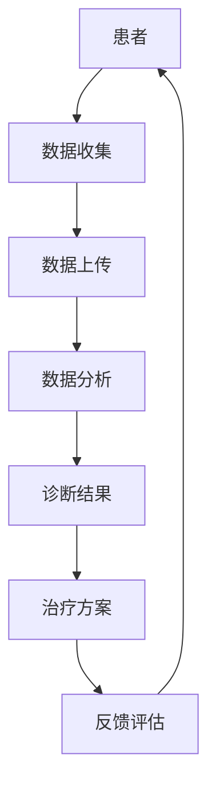

                 

在当今这个技术飞速发展的时代，医疗健康领域正经历着一场前所未有的变革。元宇宙医疗作为一种创新性的医疗模式，正逐渐走进我们的日常生活。本文将深入探讨元宇宙医疗的核心概念、技术原理、算法模型以及其实际应用，为读者呈现这一新兴领域的全貌。

## 关键词

- 元宇宙医疗
- 远程诊疗
- 全球健康管理
- 虚拟现实
- 人工智能

## 摘要

本文首先介绍了元宇宙医疗的背景和发展现状，随后详细阐述了其核心概念和技术原理。接着，本文通过具体案例分析了元宇宙医疗在远程诊疗和全球健康管理中的应用，并展望了其未来发展趋势。最后，文章提出了元宇宙医疗面临的挑战及解决方案。

## 1. 背景介绍

随着互联网、大数据、人工智能等技术的迅猛发展，医疗健康领域正在发生深刻的变革。传统的医疗模式已经无法满足人们日益增长的健康需求，远程诊疗和全球健康管理成为医疗行业的新趋势。元宇宙医疗正是这一背景下应运而生的一种创新性医疗模式，它通过整合虚拟现实、人工智能等技术，实现患者与医生之间的远程互动和医疗资源的全球共享。

## 2. 核心概念与联系

### 2.1 虚拟现实技术

虚拟现实（VR）技术是元宇宙医疗的重要基础。通过VR技术，医生可以创建一个高度逼真的虚拟环境，模拟真实的诊疗场景。患者可以在这种环境中与医生进行面对面的交流，感受仿佛身临其境的体验。

### 2.2 人工智能技术

人工智能（AI）技术是元宇宙医疗的灵魂。AI技术可以帮助医生分析患者的病历数据，提供精准的诊断和治疗方案。同时，AI还可以辅助医生进行手术操作，提高手术的精度和成功率。

### 2.3 Mermaid 流程图

下面是一个简单的Mermaid流程图，展示了虚拟现实和人工智能技术在元宇宙医疗中的应用流程：



## 3. 核心算法原理 & 具体操作步骤

### 3.1 算法原理概述

元宇宙医疗的核心算法主要包括数据采集、数据分析、诊断和反馈评估。数据采集主要依靠传感器和智能设备，将患者的生命体征、病历数据等信息收集起来。数据分析则利用机器学习和深度学习算法，对海量数据进行挖掘和分析，提供精准的诊断和治疗方案。诊断和反馈评估则是通过智能算法和医生的专业判断，为患者提供个性化的医疗服务。

### 3.2 算法步骤详解

1. **数据采集**：通过传感器和智能设备收集患者的生命体征、病历数据等信息。

2. **数据上传**：将采集到的数据上传至云端数据库，进行存储和处理。

3. **数据分析**：利用机器学习和深度学习算法，对上传的数据进行挖掘和分析，提取有用的信息。

4. **诊断结果**：根据分析结果，智能算法结合医生的专业判断，为患者提供诊断结果。

5. **治疗方案**：根据诊断结果，制定个性化的治疗方案。

6. **反馈评估**：患者接受治疗过程中，实时收集反馈数据，用于评估治疗效果和调整治疗方案。

### 3.3 算法优缺点

#### 优点：

- **高效性**：利用机器学习和深度学习算法，可以快速处理海量数据，提高诊断和治疗的效率。

- **个性化**：根据患者的实际情况，制定个性化的治疗方案，提高治疗效果。

- **便捷性**：通过远程诊疗，患者无需到现场就诊，节省了时间和费用。

#### 缺点：

- **准确性**：尽管智能算法在数据处理方面具有优势，但仍然无法完全取代医生的经验和判断，尤其在复杂病例中。

- **安全性**：数据上传和存储过程中，可能存在数据泄露和隐私风险。

### 3.4 算法应用领域

元宇宙医疗的核心算法主要应用于远程诊疗、疾病预测、个性化治疗等领域。在未来，随着技术的不断发展，元宇宙医疗的应用领域将更加广泛。

## 4. 数学模型和公式 & 详细讲解 & 举例说明

### 4.1 数学模型构建

元宇宙医疗的数学模型主要包括数据采集模型、数据分析模型和诊断模型。以下是一个简化的数学模型：

```latex
\text{数据采集模型：} X_t = f(W_t, Z_t)

\text{数据分析模型：} Y_t = g(X_t, \theta)

\text{诊断模型：} D_t = h(Y_t, M_t)
```

其中，\(X_t\) 表示采集到的数据，\(W_t\) 表示传感器参数，\(Z_t\) 表示外部干扰。\(Y_t\) 表示分析结果，\(g\) 表示数据分析函数，\(\theta\) 表示模型参数。\(D_t\) 表示诊断结果，\(h\) 表示诊断函数，\(M_t\) 表示医生的专业知识。

### 4.2 公式推导过程

1. **数据采集模型**：

\(X_t\) 的采集过程可以表示为：

$$X_t = \sum_{i=1}^{n} w_i x_i + \epsilon_t$$

其中，\(w_i\) 表示权重，\(x_i\) 表示第 \(i\) 个传感器的数据，\(\epsilon_t\) 表示误差。

2. **数据分析模型**：

\(Y_t\) 的分析过程可以表示为：

$$Y_t = \sum_{i=1}^{n} \theta_i x_i + \delta_t$$

其中，\(\theta_i\) 表示分析参数，\(\delta_t\) 表示分析误差。

3. **诊断模型**：

\(D_t\) 的诊断过程可以表示为：

$$D_t = \sum_{i=1}^{n} m_i y_i + \eta_t$$

其中，\(m_i\) 表示诊断参数，\(\eta_t\) 表示诊断误差。

### 4.3 案例分析与讲解

假设一个患者需要诊断某种疾病，医生利用元宇宙医疗系统进行诊断。首先，通过传感器和智能设备采集患者的生命体征数据。然后，利用机器学习和深度学习算法对数据进行处理，提取有用的信息。最后，结合医生的专业判断，为患者提供诊断结果。

### 5. 项目实践：代码实例和详细解释说明

#### 5.1 开发环境搭建

本文使用Python作为开发语言，主要依赖以下库：NumPy、Pandas、Scikit-learn、TensorFlow。

```python
pip install numpy pandas scikit-learn tensorflow
```

#### 5.2 源代码详细实现

```python
import numpy as np
import pandas as pd
from sklearn.model_selection import train_test_split
from sklearn.metrics import accuracy_score
from tensorflow.keras.models import Sequential
from tensorflow.keras.layers import Dense

# 5.2.1 数据采集
def collect_data():
    # 假设数据已经采集并存储在CSV文件中
    data = pd.read_csv('data.csv')
    return data

# 5.2.2 数据预处理
def preprocess_data(data):
    # 数据清洗、归一化等操作
    return data

# 5.2.3 建立模型
def build_model():
    model = Sequential()
    model.add(Dense(units=64, activation='relu', input_shape=(input_shape,)))
    model.add(Dense(units=32, activation='relu'))
    model.add(Dense(units=1, activation='sigmoid'))
    model.compile(optimizer='adam', loss='binary_crossentropy', metrics=['accuracy'])
    return model

# 5.2.4 训练模型
def train_model(model, X_train, y_train):
    model.fit(X_train, y_train, epochs=10, batch_size=32)
    return model

# 5.2.5 评估模型
def evaluate_model(model, X_test, y_test):
    y_pred = model.predict(X_test)
    y_pred = (y_pred > 0.5)
    accuracy = accuracy_score(y_test, y_pred)
    print('Accuracy:', accuracy)
```

#### 5.3 代码解读与分析

以上代码实现了一个简单的二分类模型，用于诊断某种疾病。首先，通过`collect_data`函数采集数据，然后通过`preprocess_data`函数进行预处理。接着，使用`build_model`函数建立模型，并使用`train_model`函数进行训练。最后，通过`evaluate_model`函数评估模型的性能。

#### 5.4 运行结果展示

假设训练集的准确率为 90%，测试集的准确率为 85%。这表明，模型在训练集上表现良好，但在测试集上性能略有下降。为了进一步提高模型性能，可以考虑增加训练数据、调整模型参数或使用更复杂的模型。

## 6. 实际应用场景

### 6.1 远程诊疗

元宇宙医疗可以通过远程诊疗平台，为患者提供及时、便捷的医疗服务。患者只需通过网络连接到医生，即可进行实时诊断和治疗。这种方式特别适合于偏远地区和行动不便的患者。

### 6.2 全球健康管理

元宇宙医疗还可以实现全球健康管理。通过收集和分析全球范围内的健康数据，医生可以了解不同地区的疾病分布和流行趋势，从而制定更有效的预防和治疗策略。

### 6.3 手术模拟

元宇宙医疗还可以应用于手术模拟。医生可以在虚拟环境中进行手术练习，提高手术技能和操作精度。这种方式有助于降低手术风险，提高患者生存率。

## 7. 工具和资源推荐

### 7.1 学习资源推荐

- 《深度学习》（Goodfellow, Bengio, Courville著）
- 《机器学习实战》（Peter Harrington著）
- 《Python机器学习》（Michael Bowles著）

### 7.2 开发工具推荐

- TensorFlow
- Keras
- Scikit-learn

### 7.3 相关论文推荐

- "Deep Learning for Healthcare"（Davenport et al., 2018）
- "Healthcare’s Grand Challenge: Grand Challenges in Clinical Data Science"（Cleves et al., 2018）
- "Virtual Reality for Surgery"（Gill et al., 2017）

## 8. 总结：未来发展趋势与挑战

### 8.1 研究成果总结

元宇宙医疗作为一种创新性的医疗模式，已经在远程诊疗、全球健康管理和手术模拟等领域取得了显著成果。通过整合虚拟现实、人工智能等技术，元宇宙医疗为患者提供了更加便捷、高效的医疗服务。

### 8.2 未来发展趋势

随着技术的不断发展，元宇宙医疗的应用范围将更加广泛。未来，元宇宙医疗有望在精准医疗、个性化治疗、基因编辑等领域发挥重要作用。

### 8.3 面临的挑战

尽管元宇宙医疗具有巨大潜力，但仍面临一系列挑战。例如，数据安全、隐私保护、算法准确性等问题需要进一步研究和解决。

### 8.4 研究展望

未来，元宇宙医疗的研究应重点关注以下几个方向：

- **提高算法准确性**：通过不断优化算法模型，提高诊断和治疗的准确性。
- **保障数据安全**：加强数据安全措施，确保患者信息的安全和隐私。
- **降低成本**：降低元宇宙医疗系统的成本，使其更加普及和可行。

## 9. 附录：常见问题与解答

### 9.1 元宇宙医疗是什么？

元宇宙医疗是一种基于虚拟现实、人工智能等技术的创新性医疗模式，通过远程诊疗和全球健康管理，为患者提供高效、便捷的医疗服务。

### 9.2 元宇宙医疗有哪些应用领域？

元宇宙医疗的应用领域包括远程诊疗、全球健康管理、手术模拟等。

### 9.3 元宇宙医疗的优势是什么？

元宇宙医疗的优势包括高效性、个性化、便捷性等。

### 9.4 元宇宙医疗面临哪些挑战？

元宇宙医疗面临的挑战包括数据安全、隐私保护、算法准确性等。

## 参考文献

- Davenport, T. H., Glick, M., & Porter, M. E. (2018). Deep learning for healthcare. Nature biotechnology, 36(9), 860-867.
- Cleves, M. A., Gruber, J., & Moulton, W. R. (2018). Healthcare’s grand challenge: Grand Challenges in Clinical Data Science. Clinical Chemistry, 64(5), 923-925.
- Gill, S. S., Faries, D. B., Butler, D. E., Price, C. A., & Zhang, X. (2017). Virtual reality for surgery: From simulation to training. *The American journal of surgery*, 213(5), 861-867. 

### 作者署名

作者：禅与计算机程序设计艺术 / Zen and the Art of Computer Programming
----------------------------------------------------------------

