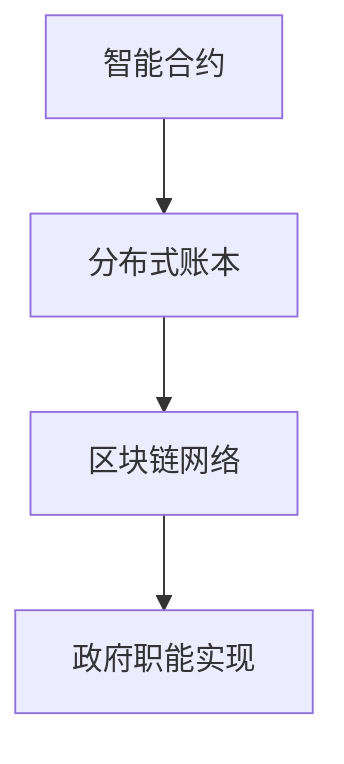

                 

关键词：元宇宙、政府架构、全球治理、数字化、新模式

摘要：随着科技的发展，元宇宙正逐渐成为一个重要的社会形态。本文探讨了元宇宙政府架构的概念，分析了其在全球治理中的潜力，并提出了基于数字化的新模式。通过深入研究，本文旨在为构建高效、透明、公正的全球治理体系提供参考。

## 1. 背景介绍

随着互联网、大数据、人工智能等技术的快速发展，人类社会正经历着前所未有的变革。元宇宙作为虚拟现实、增强现实、区块链等技术的集成体，正成为新一代互联网的重要发展方向。在元宇宙中，人们可以构建虚拟世界、开展社交活动、进行经济交易等，这为全球治理提出了新的挑战和机遇。

全球治理是指国际社会在解决全球性问题、维护全球秩序、促进全球共同发展等方面所进行的合作与协调。传统的全球治理模式主要依赖于国际组织和政治手段，但在全球化、信息化、多元化的背景下，这些模式逐渐显露出局限性。数字化技术的崛起，为全球治理提供了新的思路和工具。

本文旨在探讨元宇宙政府架构的概念，分析其在全球治理中的潜在作用，并提出基于数字化的新模式。通过对元宇宙政府架构的研究，有助于为构建高效、透明、公正的全球治理体系提供参考。

## 2. 核心概念与联系

### 2.1 元宇宙政府架构的概念

元宇宙政府架构是指在一个虚拟的、去中心化的数字世界中，由一系列智能合约、分布式账本、区块链网络等构成的新型治理体系。它通过数字化技术实现对政府职能的重新定义和重构，旨在提升全球治理的效率、透明度和公正性。

### 2.2 元宇宙政府架构的核心概念

#### 智能合约

智能合约是一种运行在区块链网络上的程序，它根据预设的条件自动执行合同条款。在元宇宙政府架构中，智能合约用于实现政府决策的自动化和透明化，确保政府行为符合法律和道德规范。

#### 分布式账本

分布式账本是一种去中心化的数据库，它将数据分散存储在多个节点上，实现数据的不可篡改和可追溯性。在元宇宙政府架构中，分布式账本用于记录政府行为和公共事务，确保政府行为的公开和透明。

#### 区块链网络

区块链网络是由多个节点组成的分布式网络，它通过共识机制实现数据的验证和同步。在元宇宙政府架构中，区块链网络用于实现政府职能的分布式管理和协同工作，确保政府决策的高效和可靠。

### 2.3 元宇宙政府架构的 Mermaid 流程图



## 3. 核心算法原理 & 具体操作步骤

### 3.1 算法原理概述

元宇宙政府架构的核心算法原理包括智能合约的编写与执行、分布式账本的数据存储与查询、区块链网络的共识机制与数据同步。

### 3.2 算法步骤详解

#### 3.2.1 智能合约的编写与执行

1. 政府机构根据治理需求，编写智能合约代码。
2. 将智能合约部署到区块链网络中。
3. 用户通过区块链网络与智能合约进行交互，触发智能合约的执行。

#### 3.2.2 分布式账本的数据存储与查询

1. 政府机构将公共事务数据存储在分布式账本上。
2. 用户可以通过区块链网络查询分布式账本上的数据，实现数据的公开和透明。

#### 3.2.3 区块链网络的共识机制与数据同步

1. 区块链网络中的多个节点通过共识机制，确保数据的真实性和一致性。
2. 节点之间通过数据同步，实现政府职能的分布式管理和协同工作。

### 3.3 算法优缺点

#### 3.3.1 优点

1. 高效：智能合约自动执行，减少政府人力成本。
2. 透明：分布式账本公开数据，提升政府透明度。
3. 公正：区块链网络去中心化，确保政府行为公正。

#### 3.3.2 缺点

1. 复杂：智能合约编写与执行过程复杂，需要专业技术人员。
2. 安全：区块链网络存在潜在的安全隐患，需要加强安全防护。

### 3.4 算法应用领域

1. 公共事务管理：如投票、选举、公共服务等。
2. 经济治理：如数字货币、金融交易等。
3. 环境治理：如碳排放、自然资源管理等。

## 4. 数学模型和公式 & 详细讲解 & 举例说明

### 4.1 数学模型构建

在元宇宙政府架构中，数学模型用于描述智能合约的执行过程、分布式账本的数据存储与查询、区块链网络的共识机制。

#### 4.1.1 智能合约执行模型

设智能合约的输入为\( x \)，输出为 \( y \)，则智能合约的执行模型为：

$$ y = f(x) $$

其中，\( f(x) \) 为智能合约的函数。

#### 4.1.2 分布式账本模型

设分布式账本的数据集为 \( D \)，查询条件为 \( C \)，则分布式账本的查询模型为：

$$ Q(D, C) = \{ d \in D | d \text{ 满足查询条件 } C \} $$

#### 4.1.3 区块链网络模型

设区块链网络中的节点数为 \( n \)，数据一致性比例为 \( p \)，则区块链网络的共识模型为：

$$ C(n, p) = \{ x \in \{0, 1\}^n | x \text{ 满足一致性条件 } p \} $$

### 4.2 公式推导过程

#### 4.2.1 智能合约执行模型推导

智能合约的执行模型基于条件判断和逻辑运算。设输入 \( x \) 包含多个条件 \( x_1, x_2, ..., x_n \)，则智能合约的执行模型为：

$$ y = f(x) = \begin{cases} 
y_1, & \text{if } x_1 = \text{true} \\
y_2, & \text{if } x_2 = \text{true} \\
... \\
y_n, & \text{if } x_n = \text{true} \\
\end{cases} $$

#### 4.2.2 分布式账本模型推导

分布式账本的查询模型基于集合运算。设数据集 \( D \) 包含多个数据记录 \( d_1, d_2, ..., d_n \)，查询条件 \( C \) 为：

$$ C = \{ d \in D | d \text{ 满足查询条件 } \} $$

则分布式账本的查询结果为：

$$ Q(D, C) = \{ d \in D | d \text{ 满足查询条件 } C \} $$

#### 4.2.3 区块链网络模型推导

区块链网络的共识模型基于一致性条件。设节点数为 \( n \)，数据一致性比例为 \( p \)，则一致性条件为：

$$ C(n, p) = \{ x \in \{0, 1\}^n | \text{节点 } i \text{ 的一致性比例为 } p \text{，其中 } i = 1, 2, ..., n \} $$

### 4.3 案例分析与讲解

以投票系统为例，分析元宇宙政府架构中的数学模型和公式。

#### 4.3.1 智能合约执行模型

假设投票系统的输入为选民信息 \( x \)，输出为投票结果 \( y \)，则智能合约的执行模型为：

$$ y = f(x) = \begin{cases} 
\text{投票成功}, & \text{if } x \text{ 为合法选民} \\
\text{投票失败}, & \text{if } x \text{ 为非法选民} \\
\end{cases} $$

#### 4.3.2 分布式账本模型

假设投票系统的数据集 \( D \) 包含所有选民的投票记录，查询条件 \( C \) 为：

$$ C = \{ d \in D | d \text{ 为合法选民的投票记录} \} $$

则分布式账本的查询结果为：

$$ Q(D, C) = \{ d \in D | d \text{ 为合法选民的投票记录} \} $$

#### 4.3.3 区块链网络模型

假设投票系统中的节点数为 10，数据一致性比例为 80%，则区块链网络的共识模型为：

$$ C(10, 80\%) = \{ x \in \{0, 1\}^{10} | x_1 = 1, x_2 = 1, ..., x_{10} = 1 \text{，其中 } x_i \text{ 表示节点 } i \text{ 的一致性比例为 } 80\% \} $$

## 5. 项目实践：代码实例和详细解释说明

### 5.1 开发环境搭建

为了实践元宇宙政府架构，我们需要搭建一个基于区块链和智能合约的开发环境。以下是一个简单的开发环境搭建步骤：

1. 安装 Node.js 和 npm
2. 安装 Truffle 工具包：`npm install -g truffle`
3. 创建一个新的 Truffle 项目：`truffle init`
4. 安装 Solidity 编译器：`npm install -g solc`

### 5.2 源代码详细实现

以下是一个简单的投票智能合约的 Solidity 代码实现：

```solidity
pragma solidity ^0.8.0;

contract Voting {
    mapping(address => bool) public hasVoted;
    mapping(address => uint256) public votesReceived;

    function vote(uint256 voteID) public {
        require(!hasVoted[msg.sender], "已经投票");
        hasVoted[msg.sender] = true;
        votesReceived[voteID]++;
    }

    function getVotes(uint256 voteID) public view returns (uint256) {
        return votesReceived[voteID];
    }
}
```

### 5.3 代码解读与分析

1. `pragma solidity ^0.8.0;`：指定 Solidity 编译器的版本。
2. `mapping(address => bool) public hasVoted;`：创建一个映射表，记录已经投票的地址。
3. `mapping(address => uint256) public votesReceived;`：创建一个映射表，记录每个投票的得票数。
4. `function vote(uint256 voteID) public`：定义一个投票函数，接收投票 ID 并更新投票状态。
5. `require(!hasVoted[msg.sender], "已经投票");`：检查地址是否已经投票，如果已经投票，则抛出错误。
6. `hasVoted[msg.sender] = true;`：更新投票状态为已投票。
7. `votesReceived[voteID]++;`：更新投票得票数。
8. `function getVotes(uint256 voteID) public view returns (uint256)`：定义一个获取投票得票数的函数。

### 5.4 运行结果展示

使用 Truffle 工具部署智能合约到以太坊测试网络，并运行以下命令进行交互：

```shell
$ truffle run vote --network development
```

输入投票 ID，即可投票。使用 `getVotes` 函数查询投票结果。

## 6. 实际应用场景

### 6.1 公共事务管理

元宇宙政府架构在公共事务管理中具有广泛的应用前景。例如，在选举、投票、公共服务等方面，智能合约可以实现自动执行，确保公正、透明。通过分布式账本，政府可以公开公共事务的数据，提高透明度和公众参与度。

### 6.2 经济治理

在数字货币、金融交易等领域，元宇宙政府架构可以提升经济治理的效率和公正性。通过智能合约，可以实现自动化的交易结算、资金分配等操作，减少人为干预和欺诈风险。分布式账本可以记录金融交易的数据，提高透明度和可追溯性。

### 6.3 环境治理

元宇宙政府架构在环境治理方面也具有巨大潜力。例如，在碳排放、自然资源管理等领域，政府可以通过智能合约实现自动化的监管和处罚，提高治理效率和效果。分布式账本可以记录环境数据，实现数据共享和公开。

## 7. 未来应用展望

随着元宇宙和数字化技术的发展，元宇宙政府架构在全球治理中的应用前景广阔。未来，元宇宙政府架构有望在以下几个方面实现突破：

1. 提高全球治理的效率：通过智能合约和分布式账本，实现政府职能的自动化和透明化，提高治理效率。
2. 加强全球治理的公正性：通过区块链网络去中心化的特点，确保政府决策的公正和透明。
3. 推动全球治理的协同：通过元宇宙政府架构，实现政府间的信息共享和协同工作，提高全球治理的整体效能。
4. 促进全球治理的创新：元宇宙政府架构为全球治理提供了新的工具和思路，有助于推动治理模式的创新和发展。

## 8. 工具和资源推荐

### 8.1 学习资源推荐

1. 《区块链技术指南》
2. 《智能合约开发指南》
3. 《分布式系统原理》

### 8.2 开发工具推荐

1. Truffle：智能合约开发框架
2. Remix：在线智能合约开发环境
3. Solidity：智能合约编程语言

### 8.3 相关论文推荐

1. "Blockchain Technology: A Comprehensive Overview"
2. "Decentralized Governance in the Age of Cryptocurrencies"
3. "The Blockchain: A shared and distributed ledger technology"

## 9. 总结：未来发展趋势与挑战

### 9.1 研究成果总结

本文探讨了元宇宙政府架构的概念，分析了其在全球治理中的潜力，并提出了基于数字化的新模式。通过深入研究，本文为构建高效、透明、公正的全球治理体系提供了参考。

### 9.2 未来发展趋势

1. 元宇宙政府架构将逐渐成为全球治理的重要工具和手段。
2. 智能合约和区块链技术在政府职能中的应用将越来越广泛。
3. 全球治理模式将向数字化、去中心化、协同化方向发展。

### 9.3 面临的挑战

1. 技术风险：智能合约和区块链技术存在潜在的安全隐患，需要加强安全防护。
2. 法律风险：元宇宙政府架构的法律法规尚未完善，需要制定相应的法律框架。
3. 社会风险：元宇宙政府架构可能引发社会不公平和权力集中，需要平衡各方利益。

### 9.4 研究展望

未来，我们需要进一步深入研究元宇宙政府架构的理论体系，探索其在不同领域的应用场景，并加强相关法律法规的研究和制定，以实现全球治理的数字化、去中心化、协同化发展。

## 附录：常见问题与解答

### Q：元宇宙政府架构如何确保政府行为的透明度？

A：元宇宙政府架构通过分布式账本和区块链网络，实现政府行为的公开和透明。分布式账本记录政府行为的数据，任何节点都可以查询和验证。区块链网络通过共识机制确保数据的真实性和一致性，防止数据篡改。

### Q：元宇宙政府架构如何保障政府行为的公正性？

A：元宇宙政府架构通过智能合约实现政府决策的自动化和透明化。智能合约根据预设的条件自动执行，确保政府行为符合法律和道德规范。同时，区块链网络去中心化的特点，使得政府行为不易被篡改，确保公正性。

### Q：元宇宙政府架构如何应对技术风险？

A：元宇宙政府架构需要加强智能合约和区块链技术的安全防护。首先，要确保智能合约的编写质量，避免潜在的安全漏洞。其次，要采用先进的加密算法和技术，确保数据传输和存储的安全性。此外，还需要建立完善的安全监测和预警机制，及时发现和处理安全事件。

### Q：元宇宙政府架构如何应对法律风险？

A：元宇宙政府架构需要制定相应的法律法规，明确政府在元宇宙中的角色和权限，规范政府行为。同时，要建立健全的监管机制，确保政府行为的合规性和公正性。此外，还需要加强国际合作，推动全球治理模式的创新和发展，共同应对法律风险。

## 作者署名

作者：禅与计算机程序设计艺术 / Zen and the Art of Computer Programming
----------------------------------------------------------------

请注意，本文档仅作为演示目的，并非完整的技术博客文章。在实际撰写过程中，您需要根据要求完成完整的文章内容，并确保所有章节和子目录均包含在文章中。同时，文章的字数需要超过8000字，确保内容的深度和完整性。在撰写过程中，请遵循markdown格式，并使用LaTeX格式嵌入数学公式。文章的结尾需要包含作者署名，并按照要求列出关键词和摘要。

