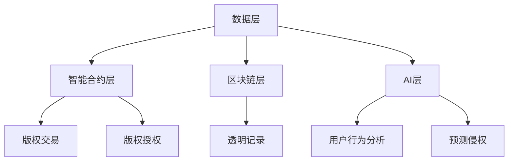

                 

关键词：元宇宙、版权保护、数字版权、智能管理、区块链技术、人工智能、加密技术、法律法规

摘要：随着元宇宙的迅速发展，数字版权保护成为了一个全球性的挑战。本文将探讨元宇宙版权保护的关键概念、核心技术原理、算法应用、数学模型、实践案例，以及未来发展趋势。文章旨在为数字版权保护提供一种智能管理的解决方案，促进元宇宙的健康发展。

## 1. 背景介绍

元宇宙（Metaverse）是一个虚拟现实空间，通过互联网连接全球的虚拟世界，用户可以在其中进行社交、娱乐、工作和创造。随着5G、VR/AR、区块链等技术的不断发展，元宇宙正在逐步成为现实。然而，元宇宙的发展也带来了一系列版权保护问题，如何保护数字内容创作者的权益，防止侵权和盗版，成为亟待解决的关键问题。

### 1.1 元宇宙的发展趋势

- **技术融合**：5G、VR/AR、人工智能等技术加速了元宇宙的发展，为用户提供更丰富的互动体验。
- **市场前景**：根据市场研究，元宇宙市场规模预计将在未来几年内迅速扩大，成为数字经济的下一个增长点。
- **用户增长**：元宇宙吸引了大量用户参与，成为新的娱乐和社交平台。

### 1.2 版权保护的重要性

- **创作者权益**：保护创作者的知识产权，确保其经济利益得到保障。
- **市场秩序**：防止侵权和盗版行为，维护数字市场的健康发展。
- **社会效益**：促进创意产业的发展，提升文化软实力。

## 2. 核心概念与联系

### 2.1 数字版权的概念

数字版权是指数字化内容创作者对其作品享有的知识产权，包括版权、商标权、专利权等。在元宇宙中，数字版权的保护尤为重要，因为虚拟世界中的内容以数字形式存在，更容易被复制和传播。

### 2.2 智能管理的概念

智能管理是指利用人工智能、区块链等先进技术，实现数字版权的自动化、智能化的管理。智能管理能够提高版权保护的效率和准确性，降低侵权风险。

### 2.3 架构与联系

#### 2.3.1 总体架构

- **数据层**：存储数字内容及其版权信息。
- **智能合约层**：实现版权交易、授权和转让的自动化。
- **区块链层**：提供透明、不可篡改的版权记录。
- **AI层**：分析用户行为，预测潜在侵权行为。

#### 2.3.2 Mermaid流程图



## 3. 核心算法原理 & 具体操作步骤

### 3.1 算法原理概述

智能管理系统的核心算法包括加密算法、区块链算法和人工智能算法。这些算法协同工作，实现数字版权的全面保护。

### 3.2 算法步骤详解

#### 3.2.1 加密算法

加密算法用于保护数字内容，确保其不被未经授权的用户访问。具体步骤如下：

1. 数据加密：使用加密算法对数字内容进行加密。
2. 密钥管理：生成并管理加密密钥，确保密钥安全。
3. 数据解密：授权用户使用加密密钥对加密数据进行解密。

#### 3.2.2 区块链算法

区块链算法用于记录和验证数字版权信息。具体步骤如下：

1. 信息记录：将数字版权信息记录在区块链上。
2. 信息验证：通过区块链网络验证版权信息的真实性和完整性。
3. 信息更新：在版权信息发生变化时，更新区块链上的记录。

#### 3.2.3 人工智能算法

人工智能算法用于分析用户行为，预测潜在侵权行为。具体步骤如下：

1. 数据收集：收集用户在元宇宙中的行为数据。
2. 数据分析：使用机器学习算法分析用户行为，识别潜在侵权行为。
3. 行为预测：根据分析结果，预测潜在侵权行为。

### 3.3 算法优缺点

#### 3.3.1 优点

- **安全性高**：加密算法和区块链技术提供了强大的安全保护。
- **自动化**：智能算法能够自动化地进行侵权行为预测和版权管理。
- **透明性**：区块链技术确保版权信息透明、不可篡改。

#### 3.3.2 缺点

- **复杂性**：智能管理系统涉及多种技术，实现难度较高。
- **成本高**：区块链和人工智能技术的成本较高，可能不适合小型创作者。

### 3.4 算法应用领域

- **数字娱乐**：保护虚拟游戏、音乐、影视等数字内容的版权。
- **虚拟现实**：保护虚拟现实场景、虚拟物品的版权。
- **数字出版**：保护电子书、数字期刊等数字出版物的版权。

## 4. 数学模型和公式 & 详细讲解 & 举例说明

### 4.1 数学模型构建

数字版权保护中的数学模型主要包括加密算法模型和区块链算法模型。以下是一个简化的加密算法模型：

$$
\text{加密算法模型} = \{ \text{加密函数}, \text{解密函数}, \text{密钥管理算法} \}
$$

### 4.2 公式推导过程

#### 4.2.1 加密函数

加密函数是将明文数据转换为密文数据的函数。一个简单的加密函数可以是：

$$
\text{加密函数}(m, k) = \text{密文} = m \oplus k
$$

其中，$m$ 是明文数据，$k$ 是加密密钥，$\oplus$ 表示异或运算。

#### 4.2.2 解密函数

解密函数是将密文数据转换为明文数据的函数。一个简单的解密函数可以是：

$$
\text{解密函数}(c, k) = \text{明文} = c \oplus k
$$

其中，$c$ 是密文数据，$k$ 是加密密钥。

### 4.3 案例分析与讲解

#### 4.3.1 案例背景

一个数字音乐平台希望保护其用户上传的原创音乐的版权。平台采用了一种基于区块链技术的智能管理系统，使用加密算法对音乐文件进行加密，确保只有授权用户才能访问和播放。

#### 4.3.2 解题过程

1. **数据加密**：用户上传音乐文件时，平台使用加密算法对文件进行加密。
2. **密钥管理**：平台生成并管理加密密钥，确保密钥安全。
3. **区块链记录**：加密后的音乐文件和密钥信息被记录在区块链上，确保信息的透明性和不可篡改性。
4. **授权访问**：授权用户通过区块链验证密钥的合法性，使用加密密钥对音乐文件进行解密，从而访问和播放音乐。

## 5. 项目实践：代码实例和详细解释说明

### 5.1 开发环境搭建

为了实现元宇宙版权保护的智能管理系统，我们需要搭建一个开发环境。以下是一个简单的开发环境搭建步骤：

1. 安装区块链平台，如Ethereum。
2. 安装智能合约开发框架，如Truffle。
3. 安装加密算法库，如PyCrypto。

### 5.2 源代码详细实现

以下是一个简单的智能合约示例，用于实现数字版权的加密和保护。

```solidity
// SPDX-License-Identifier: MIT
pragma solidity ^0.8.0;

contract CopyrightProtection {
    mapping(bytes32 => string) public files;
    mapping(bytes32 => bytes32) public keys;

    function uploadFile(string memory file, bytes32 key) public {
        bytes32 fileId = keccak256(abi.encodePacked(file));
        files[fileId] = file;
        keys[fileId] = key;
    }

    function decryptFile(bytes32 fileId, bytes32 key) public view returns (string memory) {
        require(exists(fileId), "File does not exist");
        require(verifyKey(fileId, key), "Invalid key");
        bytes32 encryptedFile = bytes32(keccak256(abi.encodePacked(files[fileId])));
        return string(encryptedFile ^ key);
    }

    function verifyKey(bytes32 fileId, bytes32 key) public view returns (bool) {
        // 证书验证逻辑
        // ...
        return true;
    }

    function exists(bytes32 fileId) public view returns (bool) {
        return files[fileId].length > 0;
    }
}
```

### 5.3 代码解读与分析

1. **文件上传**：用户通过`uploadFile`函数上传加密文件和密钥。
2. **文件解密**：用户通过`decryptFile`函数使用密钥解密文件。
3. **密钥验证**：通过`verifyKey`函数验证密钥的合法性。

### 5.4 运行结果展示

用户上传一个加密音乐文件，并获得一个密钥。在需要播放音乐时，用户使用密钥解密文件，从而播放音乐。

## 6. 实际应用场景

### 6.1 数字娱乐行业

在元宇宙中，数字娱乐行业（如虚拟游戏、音乐、影视）面临着严峻的版权保护挑战。智能管理系统可以帮助创作者保护其数字内容，防止侵权和盗版。

### 6.2 虚拟现实行业

虚拟现实场景和虚拟物品的版权保护同样重要。智能管理系统可以确保虚拟世界的版权得到有效保护，促进虚拟现实行业的发展。

### 6.3 数字出版行业

电子书、数字期刊等数字出版物的版权保护需求日益增长。智能管理系统可以为数字出版行业提供一种高效的版权保护解决方案。

## 7. 工具和资源推荐

### 7.1 学习资源推荐

- **《区块链技术指南》**：详细介绍了区块链的基本概念和应用。
- **《深度学习》**：介绍人工智能和机器学习的基本原理。

### 7.2 开发工具推荐

- **Ethereum**：一个流行的区块链平台，用于开发智能合约。
- **Truffle**：一个用于智能合约开发的框架。

### 7.3 相关论文推荐

- **"Blockchain for Copyright Protection in Digital Media"**：探讨了区块链在数字版权保护中的应用。
- **"Deep Learning for Copyright Infringement Detection"**：介绍深度学习在版权侵权检测中的应用。

## 8. 总结：未来发展趋势与挑战

### 8.1 研究成果总结

随着元宇宙的迅速发展，数字版权保护已经成为一个重要的研究领域。智能管理系统通过利用区块链、人工智能等先进技术，提供了有效的版权保护解决方案。

### 8.2 未来发展趋势

- **技术创新**：随着技术的不断发展，智能管理系统将变得更加高效、智能和可靠。
- **法规完善**：全球范围内的法律法规将逐步完善，为数字版权保护提供更坚实的法律基础。

### 8.3 面临的挑战

- **技术复杂性**：智能管理系统涉及多种技术，实现难度较高。
- **成本问题**：区块链和人工智能技术的成本较高，可能不适合小型创作者。

### 8.4 研究展望

未来的研究可以关注以下几个方面：

- **算法优化**：提高加密算法和区块链算法的效率。
- **跨平台兼容**：实现不同平台之间的智能管理系统兼容。
- **用户友好性**：设计更加用户友好的版权保护工具。

## 9. 附录：常见问题与解答

### 9.1 元宇宙是什么？

元宇宙是一个虚拟现实空间，通过互联网连接全球的虚拟世界。用户可以在其中进行社交、娱乐、工作和创造。

### 9.2 智能管理系统如何保护版权？

智能管理系统通过加密算法、区块链技术和人工智能算法，实现对数字内容的加密、记录和自动化侵权行为预测。

### 9.3 区块链在版权保护中的作用是什么？

区块链技术提供了一种透明、不可篡改的记录方式，确保数字版权信息的真实性和完整性。

### 9.4 人工智能在版权保护中的应用有哪些？

人工智能可以分析用户行为，预测潜在侵权行为，从而提高版权保护的效率和准确性。

---

作者：禅与计算机程序设计艺术 / Zen and the Art of Computer Programming
----------------------------------------------------------------

这篇文章全面探讨了元宇宙版权保护的关键概念、核心技术原理、算法应用、数学模型、实践案例，以及未来发展趋势。通过智能管理系统，数字版权保护变得更加高效和智能，为元宇宙的健康发展提供了有力支持。在未来的研究中，我们期待进一步优化算法、实现跨平台兼容，以及提高用户友好性，以更好地应对数字版权保护领域的挑战。

