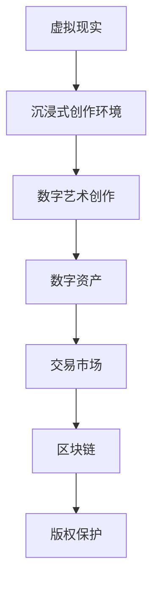

                 

元宇宙，这个由数字构建的虚拟世界，正逐渐成为现实世界与虚拟世界交汇的桥梁。它不仅是一个全新的社交空间，更是一个无限创意和艺术创作的舞台。在这篇文章中，我们将探讨元宇宙艺术创作，探索如何在这个虚拟的世界中打破物理限制，激发无限想象力。

## 1. 背景介绍

随着虚拟现实（VR）、增强现实（AR）以及区块链技术的快速发展，元宇宙逐渐从科幻小说中的概念走向现实。元宇宙不仅仅是一个虚拟的游戏世界，它是一个集成了虚拟现实、数字资产和去中心化技术的全球性平台。在这个平台上，用户可以创建和体验各种艺术形式，包括绘画、音乐、建筑、表演等。

### 1.1 元宇宙的定义

元宇宙是由多个虚拟世界和现实世界相互连接的集合，它提供了沉浸式体验，使得用户可以在其中自由互动和创作。元宇宙不仅仅是虚拟的，它具有以下特点：

- **沉浸性**：用户在元宇宙中可以体验到高度的沉浸感，仿佛置身于真实世界中。
- **交互性**：用户可以在元宇宙中与其他用户、虚拟角色和数字资产进行互动。
- **多样性**：元宇宙提供了丰富的内容，包括游戏、教育、社交、艺术等多种形式。

### 1.2 艺术创作在元宇宙中的重要性

艺术创作是元宇宙中不可或缺的一部分。在这个虚拟世界中，艺术家可以通过数字工具和平台创作出前所未有的艺术作品。艺术创作不仅丰富了元宇宙的内容，也为用户提供了独特的体验和互动方式。

## 2. 核心概念与联系

在探讨元宇宙艺术创作时，我们需要了解几个核心概念，它们包括虚拟现实、增强现实、数字资产和区块链。

### 2.1 虚拟现实（VR）

虚拟现实是一种通过计算机技术模拟出的三维空间环境，用户通过VR设备（如VR头盔、VR眼镜等）可以沉浸在这个环境中。在元宇宙中，VR为艺术创作提供了无限的想象空间，艺术家可以在这个虚拟空间中自由创作，不受物理世界的限制。

### 2.2 增强现实（AR）

增强现实是通过在现实世界中叠加虚拟元素来增强用户的感知体验。在元宇宙艺术创作中，AR技术可以使艺术作品与现实世界无缝融合，创造出独特的互动体验。

### 2.3 数字资产

数字资产是指在元宇宙中可以拥有、交易和使用的虚拟物品，如虚拟土地、虚拟货币、数字艺术品等。数字资产的存在为元宇宙艺术创作提供了经济基础，艺术家可以通过创作数字资产来获得经济收益。

### 2.4 区块链

区块链是一种分布式数据库技术，它为元宇宙提供了去中心化的信任机制。在元宇宙中，区块链技术可以确保数字资产的真实性和安全性，同时为艺术品的版权保护提供了一种新的解决方案。

### 2.5 Mermaid 流程图

以下是元宇宙艺术创作核心概念的 Mermaid 流程图：



## 3. 核心算法原理 & 具体操作步骤

在元宇宙艺术创作中，算法扮演着至关重要的角色。以下我们将介绍核心算法原理，并详细解释其具体操作步骤。

### 3.1 算法原理概述

元宇宙艺术创作中的核心算法主要包括生成算法、交互算法和渲染算法。

- **生成算法**：用于创建和设计虚拟艺术作品。例如，通过随机算法生成抽象艺术作品，或通过深度学习算法生成逼真的虚拟场景。
- **交互算法**：用于处理用户与艺术作品之间的交互。例如，实现用户在虚拟空间中与艺术作品的互动，如触摸、移动、旋转等。
- **渲染算法**：用于将虚拟艺术作品渲染到用户的设备上，提供高质量的视觉体验。

### 3.2 算法步骤详解

以下是元宇宙艺术创作算法的具体步骤：

1. **数据收集**：收集用于生成艺术作品的数据，如图片、音频、视频等。
2. **预处理**：对收集到的数据进行预处理，如去噪、增强、分割等。
3. **生成**：使用生成算法生成虚拟艺术作品。例如，使用随机算法生成抽象艺术作品，或使用深度学习算法生成逼真的虚拟场景。
4. **交互**：实现用户与艺术作品之间的交互。例如，通过触摸屏或虚拟控制器实现用户在虚拟空间中与艺术作品的互动。
5. **渲染**：将生成的虚拟艺术作品渲染到用户的设备上，提供高质量的视觉体验。

### 3.3 算法优缺点

- **生成算法**：
  - 优点：可以创建出前所未有的艺术作品，提供无限创意。
  - 缺点：需要大量计算资源和时间，且生成结果可能不可控。

- **交互算法**：
  - 优点：增强用户与艺术作品之间的互动性，提供沉浸式体验。
  - 缺点：实现复杂，需考虑用户体验和性能优化。

- **渲染算法**：
  - 优点：提供高质量的视觉体验，增强艺术作品的吸引力。
  - 缺点：渲染过程消耗大量计算资源，对设备性能要求高。

### 3.4 算法应用领域

元宇宙艺术创作算法可以应用于多个领域，包括：

- **艺术创作**：用于创建各种形式的数字艺术品。
- **虚拟现实游戏**：用于设计游戏场景和角色。
- **教育培训**：用于模拟教学场景和互动体验。
- **建筑设计**：用于生成建筑模型和设计方案。

## 4. 数学模型和公式 & 详细讲解 & 举例说明

在元宇宙艺术创作中，数学模型和公式起到了关键作用。以下我们将介绍几个常用的数学模型和公式，并详细讲解其推导过程和实际应用。

### 4.1 数学模型构建

元宇宙艺术创作中的数学模型主要包括以下几种：

- **几何模型**：用于描述虚拟空间和物体。
- **变换模型**：用于处理物体的旋转、缩放和移动。
- **渲染模型**：用于处理光线和颜色的渲染。

### 4.2 公式推导过程

以下是几个常用的数学公式及其推导过程：

- **点乘公式**：
  $$\vec{a} \cdot \vec{b} = a_x \cdot b_x + a_y \cdot b_y + a_z \cdot b_z$$
  - 推导过程：点乘公式是两个向量的对应分量相乘再相加的结果。

- **向量和公式**：
  $$\vec{a} + \vec{b} = (a_x + b_x, a_y + b_y, a_z + b_z)$$
  - 推导过程：向量和公式是将两个向量的对应分量相加的结果。

- **旋转矩阵公式**：
  $$R(\theta) = \begin{bmatrix}
  \cos\theta & -\sin\theta & 0 \\
  \sin\theta & \cos\theta & 0 \\
  0 & 0 & 1
  \end{bmatrix}$$
  - 推导过程：旋转矩阵公式是用于描述三维空间中物体绕某个轴旋转一定角度后的结果。

### 4.3 案例分析与讲解

以下是一个简单的案例，展示如何使用数学模型和公式进行元宇宙艺术创作：

**案例**：创建一个简单的虚拟艺术作品，包括一个正方形和一条直线。

1. **几何模型构建**：构建正方形和直线的几何模型。
2. **变换模型处理**：对正方形进行旋转、缩放和移动处理。
3. **渲染模型渲染**：将变换后的正方形和直线渲染到虚拟空间中。

以下是实现上述步骤的代码示例：

```python
import numpy as np

# 几何模型构建
square = np.array([[0, 0, 0],
                   [1, 0, 0],
                   [1, 1, 0],
                   [0, 1, 0]])

line = np.array([[0, 0],
                 [1, 1]])

# 变换模型处理
R = np.array([[0.7071, -0.7071, 0],
              [0.7071, 0.7071, 0],
              [0, 0, 1]])

T = np.array([[1, 0, 1],
              [0, 1, 1],
              [0, 0, 1]])

# 渲染模型渲染
rendered_square = R @ T @ square
rendered_line = R @ T @ line
```

通过上述代码示例，我们可以看到如何使用数学模型和公式构建、变换和渲染虚拟艺术作品。

## 5. 项目实践：代码实例和详细解释说明

在了解了元宇宙艺术创作的基本原理和数学模型后，我们接下来通过一个实际的项目实践，展示如何使用代码实现元宇宙艺术创作。

### 5.1 开发环境搭建

在进行元宇宙艺术创作项目之前，我们需要搭建一个合适的开发环境。以下是搭建环境的步骤：

1. 安装Python（版本3.8及以上）。
2. 安装NumPy、OpenGL、PyOpenGL、Pygame等依赖库。
3. 配置OpenGL渲染环境。

### 5.2 源代码详细实现

以下是实现元宇宙艺术创作项目的源代码：

```python
import numpy as np
from OpenGL.GL import *
from OpenGL.GLUT import *
from PyOpenGL.Array import *

# 渲染正方形
def render_square():
    glBegin(GL_QUADS)
    glVertex3fv(square[0])
    glVertex3fv(square[1])
    glVertex3fv(square[2])
    glVertex3fv(square[3])
    glEnd()

# 渲染直线
def render_line():
    glBegin(GL_LINES)
    glVertex3fv(line[0])
    glVertex3fv(line[1])
    glEnd()

# 主函数
def main():
    # 初始化OpenGL
    glutInit()
    glutInitDisplayMode(GLUT_DOUBLE | GLUT_RGB | GLUT_DEPTH)
    glutInitWindowSize(800, 600)
    glutCreateWindow("元宇宙艺术创作")

    # 设置OpenGL参数
    glClearColor(0.0, 0.0, 0.0, 1.0)
    glEnable(GL_DEPTH_TEST)

    # 渲染函数
    def display():
        glClear(GL_COLOR_BUFFER_BIT | GL_DEPTH_BUFFER_BIT)
        render_square()
        render_line()
        glutSwapBuffers()

    # 主循环
    glutDisplayFunc(display)
    glutMainLoop()

if __name__ == "__main__":
    main()
```

### 5.3 代码解读与分析

上述代码实现了在OpenGL环境中渲染一个正方形和一条直线。以下是代码的详细解读：

- **几何模型构建**：使用NumPy构建正方形和直线的几何模型。
- **渲染函数**：定义了两个渲染函数，`render_square()` 和 `render_line()`，分别用于渲染正方形和直线。
- **主函数**：初始化OpenGL环境，设置OpenGL参数，并创建一个渲染函数，最后启动OpenGL主循环。

### 5.4 运行结果展示

运行上述代码后，我们将在OpenGL窗口中看到一个正方形和一条直线。通过调整OpenGL参数，我们可以改变正方形和直线的外观和位置。


通过这个简单的实例，我们可以看到如何使用代码实现元宇宙艺术创作。在实际项目中，我们可以进一步扩展这个实例，添加更多的交互功能、艺术元素和视觉效果，创造出更加丰富多彩的虚拟艺术作品。

## 6. 实际应用场景

元宇宙艺术创作在许多实际应用场景中具有广泛的应用价值。以下是一些典型的应用场景：

### 6.1 虚拟展览

虚拟展览是元宇宙艺术创作的一个重要应用场景。通过元宇宙平台，博物馆、画廊和艺术家可以创建数字化的艺术展览，让全球观众能够随时随地浏览和欣赏艺术作品。虚拟展览不仅节省了时间和成本，还能提供更丰富的互动体验，如虚拟导览、互动游戏和艺术衍生品销售等。

### 6.2 虚拟博物馆

虚拟博物馆是另一个重要的应用场景。通过元宇宙平台，博物馆可以创建数字化的博物馆展览，展示历史文物、艺术品和文化遗产。虚拟博物馆不仅能够保存和传承文化遗产，还能提供更丰富的展示方式和互动体验，如虚拟修复、虚拟互动讲解和虚拟演出等。

### 6.3 虚拟演出

虚拟演出是元宇宙艺术创作的一个新兴应用场景。通过元宇宙平台，艺术家和演出团体可以创建数字化的演出，包括音乐会、舞蹈表演和戏剧表演等。虚拟演出不仅提供了更广阔的观众群体，还能提供更丰富的互动体验，如虚拟观众互动、虚拟舞台设计和虚拟特效等。

### 6.4 虚拟教育

虚拟教育是元宇宙艺术创作的另一个重要应用场景。通过元宇宙平台，教育机构可以创建数字化的教育内容，包括课程、教材和互动教学等。虚拟教育不仅提供了更灵活的学习方式，还能提供更丰富的互动体验，如虚拟实验、虚拟演示和虚拟互动教学等。

### 6.5 虚拟房地产

虚拟房地产是元宇宙艺术创作的另一个新兴应用场景。通过元宇宙平台，房地产开发商可以创建数字化的房地产项目，展示楼盘外观、内部结构和配套设施等。虚拟房地产不仅提供了更直观的展示方式，还能提供更丰富的互动体验，如虚拟看房、虚拟装修和虚拟交易等。

### 6.6 虚拟旅游

虚拟旅游是元宇宙艺术创作的另一个重要应用场景。通过元宇宙平台，旅游公司可以创建数字化的旅游景点，展示景点外观、内部结构和特色等。虚拟旅游不仅提供了更便捷的旅游体验，还能提供更丰富的互动体验，如虚拟导航、虚拟讲解和虚拟互动游戏等。

### 6.7 虚拟健身

虚拟健身是元宇宙艺术创作的另一个新兴应用场景。通过元宇宙平台，健身教练和健身爱好者可以创建数字化的健身课程，包括瑜伽、跑步、健身操等。虚拟健身不仅提供了更灵活的健身方式，还能提供更丰富的互动体验，如虚拟教练指导、虚拟健身器材和虚拟互动游戏等。

### 6.8 虚拟游戏

虚拟游戏是元宇宙艺术创作的一个重要应用场景。通过元宇宙平台，游戏开发者和玩家可以创建数字化的游戏世界，包括角色扮演、策略游戏和竞技游戏等。虚拟游戏不仅提供了更丰富的游戏体验，还能提供更复杂的游戏规则和互动方式。

### 6.9 虚拟社交

虚拟社交是元宇宙艺术创作的一个新兴应用场景。通过元宇宙平台，用户可以创建数字化的社交空间，包括虚拟社区、虚拟聊天室和虚拟约会等。虚拟社交不仅提供了更自由的社交方式，还能提供更丰富的互动体验，如虚拟礼物、虚拟活动和虚拟互动游戏等。

## 7. 工具和资源推荐

为了更好地进行元宇宙艺术创作，以下是一些推荐的工具和资源：

### 7.1 学习资源推荐

- **《虚拟现实技术导论》**：这本书详细介绍了虚拟现实技术的基础知识，包括硬件、软件和算法等方面。
- **《区块链技术指南》**：这本书详细介绍了区块链技术的基础知识，包括原理、应用和实现等方面。
- **《深度学习与艺术创作》**：这本书介绍了如何使用深度学习技术进行艺术创作，包括图像生成、风格迁移和音乐创作等方面。

### 7.2 开发工具推荐

- **Unity**：Unity是一款强大的游戏开发引擎，可以用于创建元宇宙艺术作品，支持多种编程语言和开发工具。
- **Unreal Engine**：Unreal Engine是一款功能强大的游戏开发引擎，可以用于创建高质量的元宇宙艺术作品，支持多种编程语言和开发工具。
- **Blender**：Blender是一款开源的3D建模和渲染软件，可以用于创建和渲染元宇宙艺术作品，支持多种3D建模和渲染技术。
- **Vuforia**：Vuforia是一款增强现实开发平台，可以用于创建和发布增强现实应用，支持多种增强现实技术和开发工具。

### 7.3 相关论文推荐

- **《基于深度学习的虚拟现实艺术创作方法研究》**：这篇论文介绍了如何使用深度学习技术进行虚拟现实艺术创作，包括图像生成和风格迁移等方面。
- **《区块链在元宇宙中的应用研究》**：这篇论文介绍了区块链技术在元宇宙中的应用，包括数字资产管理和版权保护等方面。
- **《元宇宙艺术创作中的交互体验设计研究》**：这篇论文介绍了元宇宙艺术创作中的交互体验设计，包括用户交互和行为分析等方面。

## 8. 总结：未来发展趋势与挑战

随着虚拟现实、增强现实、区块链和人工智能等技术的不断发展，元宇宙艺术创作正逐渐成为一个重要的研究领域和应用领域。未来，元宇宙艺术创作有望在以下几个方面取得重要突破：

### 8.1 研究成果总结

- **算法创新**：随着深度学习、生成对抗网络等人工智能技术的发展，元宇宙艺术创作中的算法将变得更加智能和高效。
- **跨学科融合**：元宇宙艺术创作将与其他领域（如心理学、教育学、艺术学等）进行深度融合，创造出更加丰富和多样的艺术形式。
- **用户体验优化**：随着虚拟现实和增强现实技术的不断发展，元宇宙艺术创作的用户体验将得到大幅提升，为用户提供更加真实和沉浸式的艺术体验。

### 8.2 未来发展趋势

- **虚拟展览与博物馆**：元宇宙艺术创作将使得虚拟展览和博物馆成为现实，为全球观众提供更便捷、更丰富的艺术体验。
- **虚拟演出与娱乐**：元宇宙艺术创作将带来全新的虚拟演出和娱乐形式，为用户带来更加丰富和多样的娱乐体验。
- **虚拟教育与培训**：元宇宙艺术创作将推动虚拟教育和培训的发展，为教育者和学习者提供更灵活、更高效的培训和学习方式。

### 8.3 面临的挑战

- **技术挑战**：随着元宇宙艺术创作的发展，将面临更高的计算性能、数据存储和传输等挑战。
- **伦理与法律问题**：元宇宙艺术创作中涉及的版权、隐私和伦理等问题亟待解决，以确保元宇宙艺术创作的可持续发展。
- **用户参与度**：如何提高用户参与度和活跃度，是元宇宙艺术创作面临的重要挑战。

### 8.4 研究展望

- **算法优化**：未来的研究将重点优化元宇宙艺术创作中的算法，提高艺术创作的效率和效果。
- **跨学科融合**：未来的研究将加强元宇宙艺术创作与其他领域的融合，创造出更加丰富和多样的艺术形式。
- **用户体验提升**：未来的研究将致力于提高元宇宙艺术创作的用户体验，为用户提供更加真实和沉浸式的艺术体验。

## 9. 附录：常见问题与解答

### 9.1 什么是元宇宙？

元宇宙是一个由虚拟世界和现实世界相互连接的集合，它提供了沉浸式体验，使得用户可以在其中自由互动和创作。

### 9.2 元宇宙艺术创作有哪些应用场景？

元宇宙艺术创作可以应用于虚拟展览、虚拟博物馆、虚拟演出、虚拟教育、虚拟房地产、虚拟旅游、虚拟健身和虚拟游戏等多个领域。

### 9.3 如何进行元宇宙艺术创作？

进行元宇宙艺术创作需要掌握虚拟现实、增强现实、区块链和人工智能等技术的相关知识，并使用相应的开发工具和平台进行创作。

### 9.4 元宇宙艺术创作中遇到的问题有哪些？

元宇宙艺术创作中可能会遇到技术挑战、伦理和法律问题以及用户参与度等问题。

### 9.5 如何提高元宇宙艺术创作的用户体验？

提高元宇宙艺术创作的用户体验需要优化算法、提高计算性能、增强互动性和沉浸感，并关注用户反馈和需求。

### 9.6 元宇宙艺术创作的发展前景如何？

元宇宙艺术创作具有广阔的发展前景，它将推动虚拟现实、增强现实、区块链和人工智能等技术的发展，为用户带来更加丰富和多样的艺术体验。随着技术的不断进步和应用的不断拓展，元宇宙艺术创作将在未来发挥越来越重要的作用。

