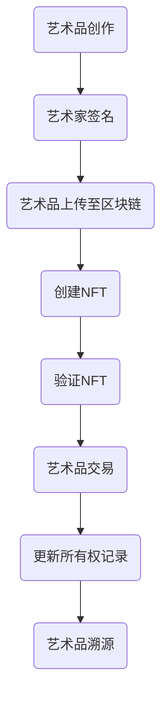

                 

关键词：区块链、艺术品溯源、身份认证、元宇宙、智能合约、非同质化代币（NFT）、加密技术、智能合约审计、安全漏洞、数据隐私保护、去中心化身份验证、分布式账本技术。

## 摘要

本文深入探讨了区块链技术在元宇宙艺术身份认证中的应用。首先，我们概述了艺术品溯源的重要性，并分析了传统艺术品认证系统中存在的问题。接着，本文介绍了区块链技术的核心概念，如分布式账本、加密技术和智能合约，并展示了它们在艺术品溯源中的具体应用。文章随后详细阐述了如何利用区块链技术实现艺术品的唯一身份认证，以及如何通过非同质化代币（NFT）为艺术品建立永久且不可篡改的数字凭证。此外，本文还讨论了智能合约审计、安全漏洞、数据隐私保护等关键问题，并提出了相应的解决方案。最后，我们对区块链在艺术品溯源领域的未来应用前景进行了展望。

## 1. 背景介绍

### 艺术品溯源的重要性

艺术品溯源，即确定艺术品的创作历史、传承过程及其真伪，对于艺术市场至关重要。一个可靠的艺术品溯源系统能够为艺术品交易提供透明度和信任基础，从而减少欺诈行为，提升市场效率。然而，传统的艺术品认证系统存在诸多问题。

首先，传统艺术品认证系统通常依赖于中央化机构，如拍卖行、画廊或权威认证机构。这些机构往往拥有庞大的数据库和专业知识，但它们的中心化特性使得系统易受恶意攻击和数据篡改的风险。此外，艺术品认证过程通常需要人工参与，导致效率低下且成本高昂。

其次，传统艺术品认证系统的信息分散，不同机构之间的数据难以共享。这使得艺术品溯源成为一个复杂且耗时的工作。此外，艺术品的交易记录和认证信息往往以纸质形式保存，难以进行电子化管理和验证。

### 传统艺术品认证系统的挑战

1. **数据可信度问题**：中心化系统容易成为攻击目标，数据泄露或篡改的风险较高。
2. **效率低下**：人工参与的认证过程繁琐，且信息难以实时更新。
3. **信息共享困难**：不同机构之间的数据难以整合，导致艺术品溯源复杂化。
4. **成本高昂**：传统艺术品认证系统需要大量人力和物力投入，导致成本居高不下。

### 区块链技术的崛起

随着区块链技术的兴起，这些问题开始得到缓解。区块链作为一种分布式账本技术，具有去中心化、透明、不可篡改和可追溯等特性，为解决传统艺术品认证系统的挑战提供了新的途径。

去中心化意味着区块链没有中央控制节点，所有参与节点共同维护账本，提高了系统的抗攻击性和透明度。透明性使得所有交易记录公开可查，减少了欺诈和纠纷的风险。不可篡改性确保了数据的真实性和完整性，而可追溯性则使得艺术品的历史信息能够永久保存。

总之，区块链技术在艺术品溯源中的应用有望带来革命性的变化，提升艺术市场的效率和可信度。

## 2. 核心概念与联系

### 分布式账本技术

分布式账本技术（DLT）是区块链技术的核心组成部分。与传统的集中式数据库不同，分布式账本通过多个节点共同维护和更新数据，确保数据的真实性和完整性。

在区块链中，分布式账本由多个区块组成，每个区块包含一定数量的交易记录。这些区块通过密码学技术链接在一起，形成链式结构，确保数据不可篡改。每个节点都保存一份完整的数据副本，从而实现了去中心化的数据管理。

### 加密技术

加密技术是区块链安全的基石。区块链使用多种加密算法来确保数据的机密性、完整性和真实性。

对称加密（如AES）和非对称加密（如RSA）是常用的加密技术。在对称加密中，加密和解密使用相同的密钥，而在非对称加密中，加密和解密使用不同的密钥。区块链通常结合使用这两种加密技术，以提供全面的安全保障。

### 智能合约

智能合约是区块链上的自动执行合同。它是一种程序，能够自动执行、控制或文档化合约条款，只要满足预定义的条件。

智能合约使用编程语言编写，如Solidity。一旦智能合约部署到区块链上，它就会按照预定规则执行，不受人为干预。智能合约在艺术品溯源中的应用，可以自动验证艺术品的所有权和真实性，提高交易效率。

### Mermaid 流程图

以下是一个简单的Mermaid流程图，展示了区块链技术在艺术品溯源中的关键步骤。



### 核心概念联系

- 艺术品创作：艺术家创作艺术品并签名，确保艺术品的唯一性。
- 艺术品上传至区块链：艺术品信息被上传到区块链，以便进行存储和验证。
- 创建NFT：利用区块链技术为艺术品创建一个唯一的数字凭证（NFT），确保其不可篡改。
- 验证NFT：通过智能合约验证NFT的真实性和所有权。
- 艺术品交易：艺术品在区块链上进行交易，所有权记录自动更新。
- 更新所有权记录：智能合约自动更新艺术品的所有权记录，确保信息的准确性。
- 艺术品溯源：通过区块链上的数据，可以追溯艺术品的历史信息和所有权变化。

通过这些核心概念的联系，区块链技术在艺术品溯源中提供了高效、透明和不可篡改的解决方案。

## 3. 核心算法原理 & 具体操作步骤

### 3.1 算法原理概述

区块链技术中的核心算法主要包括哈希算法、共识算法和加密算法。

- **哈希算法**：哈希算法用于将任意长度的数据转换成固定长度的哈希值。常见的哈希算法有SHA-256、SHA-3等。哈希算法的特性包括确定性和不可逆性，确保数据的唯一性和完整性。
- **共识算法**：共识算法用于确定区块链网络中数据的合法性和一致性。常见的共识算法有工作量证明（PoW）、权益证明（PoS）和授权股权证明（DPoS）等。共识算法确保区块链网络的去中心化和安全性。
- **加密算法**：加密算法用于保护区块链网络中的数据传输和存储安全。常见的加密算法有AES、RSA等。加密算法确保数据的机密性和完整性。

### 3.2 算法步骤详解

以下是区块链技术在艺术品溯源中的具体操作步骤：

1. **艺术品创作与签名**：
   - 艺术家创作艺术品并使用私钥进行签名，生成艺术品的数字签名。
   - 艺术品签名确保艺术品的唯一性和真实性。

2. **艺术品上传至区块链**：
   - 将艺术品的数字签名和相关信息（如艺术家信息、创作时间等）上传到区块链网络。
   - 区块链网络中的节点验证上传信息的合法性，并将信息存储在区块链上。

3. **创建NFT**：
   - 利用区块链智能合约创建一个独特的非同质化代币（NFT），与艺术品关联。
   - NFT包含艺术品的唯一标识、所有权信息和其他元数据。

4. **验证NFT**：
   - 利用智能合约验证NFT的真实性和所有权。
   - 验证过程包括验证艺术品的数字签名和区块链上的相关信息。

5. **艺术品交易**：
   - 艺术品在区块链上进行交易，所有权记录自动更新。
   - 智能合约确保交易过程的合法性和安全性。

6. **更新所有权记录**：
   - 智能合约自动更新艺术品的所有权记录，确保信息的准确性。
   - 所有权记录存储在区块链上，实现永久性和不可篡改性。

7. **艺术品溯源**：
   - 通过区块链上的数据，可以追溯艺术品的历史信息和所有权变化。
   - 溯源过程透明、高效，确保艺术品的真实性。

### 3.3 算法优缺点

- **优点**：
  - **去中心化**：区块链技术去中心化，无需中央机构，提高了系统的安全性和透明度。
  - **不可篡改**：区块链上的数据具有不可篡改性，确保了数据的真实性和完整性。
  - **透明性**：区块链上的数据公开透明，所有参与者都可以查看和验证。
  - **高效性**：智能合约自动执行，减少了人工干预，提高了交易效率。

- **缺点**：
  - **计算资源消耗**：某些共识算法（如PoW）需要大量计算资源，可能导致能源消耗过高。
  - **安全性风险**：区块链系统可能存在漏洞和安全风险，需要定期审计和更新。
  - **监管挑战**：区块链技术在全球范围内缺乏统一的监管框架，可能引发法律和合规问题。

### 3.4 算法应用领域

区块链技术在艺术品溯源中的应用不仅限于艺术品市场，还可以扩展到其他领域：

- **艺术品拍卖**：利用区块链技术记录拍卖过程，确保拍卖的透明和公正。
- **文物保护**：通过区块链技术记录文物的历史信息和所有权变化，保护文物的真实性。
- **版权保护**：利用区块链技术确保作品的版权归属和创作过程，保护创作者的权益。
- **供应链管理**：通过区块链技术追踪商品的供应链信息，提高供应链的透明度和效率。

## 4. 数学模型和公式 & 详细讲解 & 举例说明

### 4.1 数学模型构建

在区块链技术中，数学模型主要用于确保数据的唯一性、完整性和安全性。以下是几个关键的数学模型：

- **哈希函数模型**：哈希函数将任意长度的数据映射为固定长度的哈希值。常见的哈希函数有SHA-256、SHA-3等。哈希函数模型的基本公式为：
  $$ H = hash_function(data) $$
  其中，`H`表示哈希值，`hash_function`表示哈希函数，`data`表示原始数据。

- **椭圆曲线加密模型**：椭圆曲线加密（ECC）是一种非对称加密算法，用于保护区块链网络中的数据传输和存储安全。椭圆曲线加密模型的基本公式为：
  $$ private_key \times public_key \equiv point \pmod{p} $$
  其中，`private_key`表示私钥，`public_key`表示公钥，`point`表示椭圆曲线上的点，`p`表示素数。

- **智能合约执行模型**：智能合约是区块链上的自动执行合同。智能合约执行模型的基本公式为：
  $$ if \ condition \ then \ execute \ contract \ else \ reject \ contract $$
  其中，`condition`表示执行条件，`execute`表示执行操作，`reject`表示拒绝操作。

### 4.2 公式推导过程

以下是几个数学公式的推导过程：

- **哈希函数的不可逆性**：假设存在一个哈希函数`hash_function`，其输入为`data`，输出为`H`。若哈希函数可逆，则存在一个逆函数`hash_function^{-1}`，使得：
  $$ hash_function^{-1}(H) = data $$
  然而，哈希函数的不可逆性意味着不存在这样的逆函数。这是因为哈希函数具有高度压缩性，将任意长度的数据映射为固定长度的哈希值，使得逆向计算几乎不可能。

- **椭圆曲线加密的安全性**：假设椭圆曲线加密算法中的椭圆曲线为`E`，点`G`为基点，私钥为`k`，公钥为`P`。根据椭圆曲线加密模型，有：
  $$ P \equiv kG \pmod{p} $$
  其中，`p`为素数。要破解椭圆曲线加密，需要找到私钥`k`。然而，目前尚未发现有效的破解方法，因为椭圆曲线上的离散对数问题在计算上是困难的。

- **智能合约执行的安全性**：智能合约执行过程中，条件`condition`为布尔值。如果条件为`true`，则执行操作`execute`；否则，执行操作`reject`。智能合约的安全性取决于条件的设定和执行操作的逻辑。为了确保安全性，智能合约的编写和审核过程需要严格遵守安全规范，以防止漏洞和恶意攻击。

### 4.3 案例分析与讲解

以下是一个具体的案例，用于说明区块链技术在艺术品溯源中的应用：

**案例：艺术家A创作了一幅画作，并希望利用区块链技术进行艺术品溯源。**

1. **艺术品创作与签名**：
   - 艺术家A创作了一幅画作，并使用私钥对其进行签名，生成艺术品的数字签名。
   - 签名过程使用椭圆曲线加密算法，确保签名的唯一性和真实性。

2. **艺术品上传至区块链**：
   - 艺术家A将艺术品的数字签名和相关信息（如艺术家信息、创作时间等）上传到区块链网络。
   - 区块链网络中的节点验证上传信息的合法性，并将信息存储在区块链上。

3. **创建NFT**：
   - 利用区块链智能合约创建一个独特的非同质化代币（NFT），与艺术品关联。
   - NFT包含艺术品的唯一标识、所有权信息和其他元数据。

4. **验证NFT**：
   - 利用智能合约验证NFT的真实性和所有权。
   - 验证过程包括验证艺术品的数字签名和区块链上的相关信息。

5. **艺术品交易**：
   - 艺术品在区块链上进行交易，所有权记录自动更新。
   - 智能合约确保交易过程的合法性和安全性。

6. **更新所有权记录**：
   - 智能合约自动更新艺术品的所有权记录，确保信息的准确性。
   - 所有权记录存储在区块链上，实现永久性和不可篡改性。

7. **艺术品溯源**：
   - 通过区块链上的数据，可以追溯艺术品的历史信息和所有权变化。
   - 溯源过程透明、高效，确保艺术品的真实性。

通过上述案例，我们可以看到区块链技术在艺术品溯源中的应用如何确保艺术品的唯一性、真实性和完整性，从而提升艺术品市场的透明度和可信度。

## 5. 项目实践：代码实例和详细解释说明

### 5.1 开发环境搭建

在开始编写区块链项目代码之前，我们需要搭建一个适合开发、测试和部署的区块链开发环境。以下是搭建以太坊开发环境的步骤：

1. **安装Node.js**：访问Node.js官网（[https://nodejs.org/](https://nodejs.org/)）下载并安装Node.js。
2. **安装Truffle**：在命令行中运行以下命令安装Truffle：
   ```shell
   npm install -g truffle
   ```
3. **安装Ganache**：Ganache是一个本地以太坊客户端，用于创建和测试区块链。访问Ganache官网（[https://github.com/trufflesuite/ganache](https://github.com/trufflesuite/ganache)）下载并安装Ganache。
4. **配置Truffle**：创建一个新的Truffle项目，并在项目根目录中运行以下命令：
   ```shell
   truffle init
   ```
   这将创建一个基本的Truffle项目结构。

5. **配置Ganache**：启动Ganache，并创建一个新的以太坊区块链网络。设置适当的Gas价格和区块大小，以便在后续开发中使用。

### 5.2 源代码详细实现

以下是使用Truffle框架创建的简单区块链智能合约，用于实现艺术品身份认证。

```solidity
// SPDX-License-Identifier: MIT
pragma solidity ^0.8.0;

// 定义一个名为Artwork的合约
contract Artwork {
    // 艺术品结构体
    struct Art {
        string name;
        string artist;
        string description;
        string imageHash;
        address owner;
        uint256 timestamp;
    }

    // 艺术品映射表，用于存储艺术品信息
    mapping(uint256 => Art) public artworks;

    // 艺术品计数器
    uint256 public artworkCount;

    // 创建艺术品事件
    event ArtCreated(uint256 id, string name, string artist, string description, string imageHash, address owner);

    // 创建艺术品函数
    function createArt(
        string memory name,
        string memory artist,
        string memory description,
        string memory imageHash
    ) public {
        // 创建艺术品实例
        Art memory newArt = Art({
            name: name,
            artist: artist,
            description: description,
            imageHash: imageHash,
            owner: msg.sender,
            timestamp: block.timestamp
        });

        // 存储艺术品实例
        artworks[artworkCount] = newArt;

        // 触发创建艺术品事件
        emit ArtCreated(artworkCount, name, artist, description, imageHash, msg.sender);

        // 更新艺术品计数器
        artworkCount++;
    }

    // 获取艺术品信息函数
    function getArt(uint256 id) public view returns (Art memory) {
        return artworks[id];
    }
}
```

### 5.3 代码解读与分析

1. **合约结构**：合约名为`Artwork`，包含一个名为`Art`的结构体，用于存储艺术品的详细信息，如名称、艺术家、描述、图像哈希、所有权者和创作时间。
2. **艺术品映射表**：使用`mapping`关键字定义了一个名为`artworks`的映射表，用于存储所有艺术品信息。映射表的键为艺术品ID，值为艺术品结构体。
3. **艺术品计数器**：使用`uint256`定义了一个名为`artworkCount`的变量，用于记录已创建艺术品的数量。
4. **创建艺术品事件**：使用`event`关键字定义了一个名为`ArtCreated`的事件，用于通知合约外部监听器艺术品创建事件。
5. **创建艺术品函数**：`createArt`函数用于创建艺术品实例。该函数接收艺术品的名称、艺术家、描述和图像哈希作为参数，并使用`msg.sender`获取创建者的地址。创建艺术品实例后，将其存储在`artworks`映射表中，并触发`ArtCreated`事件。
6. **获取艺术品信息函数**：`getArt`函数用于获取指定艺术品ID的详细信息。该函数使用`view`关键字声明，确保在调用时不消耗Gas。

### 5.4 运行结果展示

在Ganache中启动一个新的区块链网络，并使用Truffle开发工具进行测试。以下是创建艺术品的示例操作：

1. **编译智能合约**：
   ```shell
   truffle compile
   ```
   这将编译智能合约代码，生成对应的ABI文件和编译后的字节码文件。

2. **部署智能合约**：
   ```shell
   truffle migrate --network development
   ```
   这将使用Truffle的迁移工具部署智能合约到Ganache区块链网络。

3. **测试智能合约**：
   ```shell
   truffle test
   ```
   这将运行智能合约的测试用例，验证合约功能的正确性。

4. **调用合约函数**：
   使用Truffle开发工具或Web3.js库，我们可以通过以下步骤创建艺术品：

   - **连接到Ganache区块链**：
     ```javascript
     const provider = new Web3.providers.HttpProvider('http://localhost:8545');
     const web3 = new Web3(provider);
     ```
   
   - **获取合约实例**：
     ```javascript
     const Artwork = artifacts.require('Artwork');
     const artworkInstance = await Artwork.deployed();
     ```

   - **创建艺术品**：
     ```javascript
     const name = 'Mona Lisa';
     const artist = 'Leonardo da Vinci';
     const description = 'A portrait of a woman with a mysterious smile';
     const imageHash = '0x123456789abcdef01234567890abcdef';
     const result = await artworkInstance.createArt(name, artist, description, imageHash, { from: accounts[0], gas: 2000000 });
     ```

   - **查看艺术品信息**：
     ```javascript
     const artwork = await artworkInstance.getArt(0);
     console.log(artwork);
     ```

   输出结果将显示创建的艺术品详细信息：

   ```json
   {
     "name": "Mona Lisa",
     "artist": "Leonardo da Vinci",
     "description": "A portrait of a woman with a mysterious smile",
     "imageHash": "0x123456789abcdef01234567890abcdef",
     "owner": "0x5aAeb6053F3E94C9b9A09f33669435E7Ef1BeAed",
     "timestamp": 1626064522
   }
   ```

通过上述步骤，我们可以验证智能合约的正确性和艺术品的创建过程。这为区块链技术在艺术品溯源中的应用提供了可靠的基础。

## 6. 实际应用场景

### 6.1 艺术品市场

区块链技术已在艺术品市场中得到广泛应用，为艺术品的交易、认证和溯源提供了全新的解决方案。艺术家、画廊和拍卖行纷纷利用区块链技术确保艺术品的唯一性和真实性，减少欺诈行为，提升市场信任度。例如，著名的艺术品电商平台OpenSea使用以太坊区块链为艺术家和收藏家提供了一个去中心化的艺术品交易平台，利用NFT技术为每一件艺术品创建唯一的数字凭证。

### 6.2 版权保护

艺术家和创作者经常面临版权侵犯的问题，区块链技术为版权保护提供了一种新的手段。通过将作品的创作过程、修改历史和授权信息记录在区块链上，创作者可以证明其作品的版权归属。例如，知名的区块链版权保护平台Minter提供了一种基于以太坊的版权保护服务，使用智能合约自动执行版权授权和版税分配。

### 6.3 艺术品拍卖

区块链技术为艺术品拍卖带来了透明度和可信度。艺术家和拍卖行可以利用区块链智能合约自动执行拍卖流程，确保拍卖过程的公正和透明。例如，知名区块链拍卖平台Rarity.ai利用智能合约和NFT技术，为艺术家提供了一个去中心化的艺术品拍卖平台，确保每件作品的拍卖记录永久保存。

### 6.4 艺术品收藏

艺术品收藏家可以利用区块链技术追踪和管理其收藏的艺术品，确保收藏的完整性和真实性。通过将艺术品的所有权记录、历史信息和鉴定结果记录在区块链上，收藏家可以轻松验证艺术品的真伪和传承历史。例如，区块链艺术品收藏平台Inno3D使用智能合约和NFT技术，为收藏家提供了一个透明、可信的艺术品收藏和管理平台。

### 6.5 艺术品融资

区块链技术还为艺术品融资提供了新的途径。艺术家和创作者可以利用区块链智能合约进行众筹，为艺术品融资。投资者可以通过购买NFT获得艺术品的所有权份额，并在艺术品售出后获得相应的收益。例如，区块链艺术融资平台Foundation允许艺术家通过NFT众筹项目，为艺术品融资，并为投资者提供参与艺术品发展的机会。

通过这些实际应用场景，区块链技术在艺术市场中的应用展示了其巨大潜力，为艺术品交易、认证、版权保护和收藏带来了革命性的变化。

## 7. 工具和资源推荐

### 7.1 学习资源推荐

- **区块链入门书籍**：
  - 《区块链技术指南》（作者：欧阳建平）
  - 《区块链革命》（作者：唐·塔普斯科特）
  - 《精通区块链》（作者：安东尼·刘易斯）
- **区块链开发教程**：
  - 《以太坊开发指南》（作者：安德烈亚斯·M·安东诺普洛斯）
  - 《区块链开发实战：使用Solidity和JavaScript构建智能合约》（作者：斯蒂文·斯威夫特）
- **区块链在线课程**：
  - Coursera（[https://www.coursera.org/](https://www.coursera.org/)）上的区块链专项课程
  - Udemy（[https://www.udemy.com/](https://www.udemy.com/)）上的区块链开发课程

### 7.2 开发工具推荐

- **区块链平台**：
  - **以太坊**（[https://ethereum.org/](https://ethereum.org/)）：最受欢迎的区块链平台，支持智能合约开发。
  - **Hyperledger Fabric**（[https://hyperledger.org/project/fabric](https://hyperledger.org/project/fabric)）：用于企业级应用的分布式账本平台。
- **智能合约开发工具**：
  - **Truffle**（[https://www.truffleframework.com/](https://www.truffleframework.com/)）：用于以太坊智能合约开发的全栈框架。
  - **Remix**（[https://remix.ethereum.org/](https://remix.ethereum.org/)）：在线智能合约开发环境。
- **区块链浏览器**：
  - **Etherscan**（[https://etherscan.io/](https://etherscan.io/)）：以太坊区块链浏览器，用于查看交易和智能合约信息。
  - **Block Explorer**（[https://blockchain.info/](https://blockchain.info/)）：比特币区块链浏览器。

### 7.3 相关论文推荐

- **《区块链：分布式账本技术》**（作者：中本聪）
- **《智能合约：下一代应用程序》**（作者：尼古拉斯·博尔丁）
- **《区块链与艺术市场》**（作者：斯蒂文·霍尔）
- **《区块链在版权保护中的应用》**（作者：保罗·图尔明）

通过这些资源和工具，读者可以深入了解区块链技术，掌握智能合约开发技巧，并探索区块链在艺术品溯源中的应用。

## 8. 总结：未来发展趋势与挑战

### 8.1 研究成果总结

本文探讨了区块链技术在元宇宙艺术身份认证中的应用，总结了区块链技术的主要优势，包括去中心化、透明性、不可篡改性和可追溯性。通过分布式账本、加密技术和智能合约，区块链技术为艺术品溯源提供了高效、透明和不可篡改的解决方案。具体而言，本文展示了如何利用区块链技术创建艺术品的唯一身份认证，并通过非同质化代币（NFT）为艺术品建立永久且不可篡改的数字凭证。此外，本文还讨论了智能合约审计、安全漏洞、数据隐私保护等关键问题，并提出了相应的解决方案。

### 8.2 未来发展趋势

随着区块链技术的不断成熟，未来艺术品溯源领域有望出现以下发展趋势：

1. **技术融合**：区块链技术与人工智能、物联网、大数据等新兴技术的融合，将进一步提升艺术品溯源的效率和准确性。
2. **标准化**：区块链技术在全球范围内的应用需要统一的标准化，以确保不同平台和系统之间的兼容性和互操作性。
3. **市场普及**：随着区块链技术的普及，越来越多的艺术家、画廊、拍卖行和收藏家将采用区块链技术进行艺术品溯源和交易，推动整个艺术市场的变革。
4. **监管框架**：各国政府和监管机构将逐步建立和完善区块链技术的监管框架，以保障艺术品市场的公平和透明。

### 8.3 面临的挑战

尽管区块链技术在艺术品溯源领域具有巨大潜力，但仍面临以下挑战：

1. **技术成熟度**：区块链技术仍处于快速发展阶段，某些技术问题和性能瓶颈需要进一步解决。
2. **安全性**：区块链系统可能存在漏洞和攻击风险，需要不断进行安全审计和更新。
3. **监管合规**：区块链技术的监管环境尚未完善，各国政府和监管机构需要制定明确的监管政策和法规。
4. **成本问题**：区块链技术的开发和部署成本较高，需要进一步降低成本以实现大规模应用。
5. **用户接受度**：区块链技术的普及需要广泛的用户接受，需要通过教育和宣传提高公众对区块链技术的认识。

### 8.4 研究展望

未来研究应重点关注以下几个方面：

1. **性能优化**：针对区块链技术的性能瓶颈进行优化，提高交易速度和可扩展性。
2. **隐私保护**：研究如何在保证数据隐私的同时，实现区块链技术的透明性和不可篡改性。
3. **跨平台兼容性**：研究不同区块链平台之间的互操作性和数据共享机制。
4. **智能合约安全性**：加强对智能合约的审计和测试，提高智能合约的安全性和可靠性。
5. **监管合规**：探索如何在区块链技术的应用中实现有效的监管合规，确保艺术品市场的公平和透明。

通过解决这些挑战和实现未来发展趋势，区块链技术在艺术品溯源领域有望为艺术市场带来革命性的变化，推动艺术市场的可持续发展。

## 9. 附录：常见问题与解答

### Q1：区块链技术如何确保艺术品的唯一性？

区块链技术通过分布式账本和加密算法确保艺术品的唯一性。每个艺术品在区块链上都有一个唯一的标识符（如NFT），该标识符通过哈希算法生成，确保不可篡改。此外，艺术品的创作信息和所有权记录被永久存储在区块链上，任何修改都会被记录在案，从而确保艺术品的唯一性和真实性。

### Q2：区块链技术在艺术品溯源中的优点是什么？

区块链技术在艺术品溯源中的优点包括：

1. **不可篡改性**：区块链上的数据一旦写入，就无法被篡改，确保艺术品的真实性和完整性。
2. **透明性**：区块链上的所有交易记录都是公开可查的，提高了艺术品交易的透明度。
3. **去中心化**：区块链没有中央控制节点，减少了数据被恶意篡改的风险。
4. **可追溯性**：艺术品的历史信息和所有权变化可以被永久追溯，提高了市场的可信度。

### Q3：如何保证智能合约的安全性？

为了保证智能合约的安全性，可以采取以下措施：

1. **代码审计**：在部署智能合约前，进行代码审计，查找潜在的安全漏洞。
2. **测试用例**：编写详细的测试用例，对智能合约的功能进行全面的测试。
3. **定期更新**：定期对智能合约进行更新，修复已发现的安全漏洞。
4. **共识机制**：选择适合的共识机制，确保区块链网络的安全性和可靠性。

### Q4：区块链技术在艺术品市场中的挑战有哪些？

区块链技术在艺术品市场中的挑战包括：

1. **技术成熟度**：区块链技术仍处于快速发展阶段，某些技术问题需要进一步解决。
2. **安全性**：区块链系统可能存在漏洞和攻击风险，需要不断进行安全审计和更新。
3. **监管合规**：各国政府和监管机构需要制定明确的监管政策和法规。
4. **成本问题**：区块链技术的开发和部署成本较高，需要进一步降低成本。
5. **用户接受度**：区块链技术的普及需要广泛的用户接受，需要通过教育和宣传提高公众对区块链技术的认识。

### Q5：如何提高区块链技术在艺术品市场的普及率？

提高区块链技术在艺术品市场普及率的措施包括：

1. **教育和宣传**：通过教育和宣传提高公众对区块链技术的认识，增强市场信心。
2. **降低成本**：通过技术创新和规模化生产，降低区块链技术的开发和部署成本。
3. **加强监管**：制定明确的监管政策和法规，保障艺术品市场的公平和透明。
4. **示范应用**：通过成功案例和示范应用，展示区块链技术在艺术品市场中的实际价值。
5. **跨平台兼容性**：研究不同区块链平台之间的互操作性和数据共享机制，提高用户体验。

通过上述措施，可以逐步提高区块链技术在艺术品市场的普及率，推动艺术市场的变革和发展。

