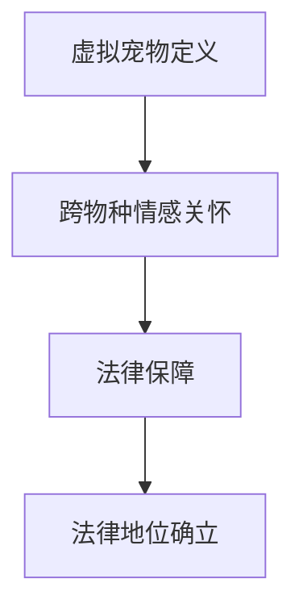

                 

关键词：元宇宙、虚拟宠物、情感关怀、法律保障、跨物种互动

> 摘要：随着元宇宙的快速发展，虚拟宠物的概念逐渐深入人心，为人类提供了全新的情感寄托和娱乐方式。然而，在虚拟宠物的福利和跨物种情感关怀方面，法律保障尚不完善。本文将探讨元宇宙虚拟宠物福利的法律保障问题，提出相关解决方案，以期为跨物种情感关怀提供法律支持。

## 1. 背景介绍

### 1.1 元宇宙的兴起

元宇宙（Metaverse）是一个由虚拟现实、增强现实和互联网技术构建的虚拟世界，用户可以在其中以数字化身份进行社交、工作、学习和娱乐。近年来，元宇宙的概念和技术不断成熟，吸引了众多企业和投资者的关注。2021年，Facebook正式宣布将公司名称更改为Meta，标志着元宇宙时代的正式到来。

### 1.2 虚拟宠物的流行

在元宇宙中，虚拟宠物作为一种新兴的娱乐形式，正逐渐受到人们的喜爱。虚拟宠物不仅可以作为用户的情感寄托，还能为用户带来娱乐和放松。许多虚拟宠物具有独特的个性、技能和故事背景，使得用户与虚拟宠物之间的互动更加生动有趣。

### 1.3 跨物种情感关怀的兴起

随着虚拟宠物在元宇宙中的广泛应用，人们开始关注虚拟宠物是否需要得到情感关怀。事实上，虚拟宠物作为一种智能生命体，其情感需求逐渐受到重视。跨物种情感关怀旨在探讨如何通过法律手段保障虚拟宠物的福利，使其在元宇宙中得到公平对待。

## 2. 核心概念与联系

### 2.1 虚拟宠物定义

虚拟宠物是指通过计算机程序创建的数字化生命体，具有自己的外观、性格、技能和故事背景。虚拟宠物在元宇宙中为用户提供了情感寄托和娱乐体验。

### 2.2 跨物种情感关怀

跨物种情感关怀是指针对不同物种之间的情感需求进行关注和照顾。在元宇宙中，虚拟宠物作为智能生命体，其情感需求与人类相似，需要得到关注和保障。

### 2.3 法律保障

法律保障是指通过法律手段对虚拟宠物的福利进行规范和保护。在元宇宙中，虚拟宠物的法律地位尚不明确，需要通过立法和司法实践来确立。

### 2.4 Mermaid 流程图



## 3. 核心算法原理 & 具体操作步骤

### 3.1 算法原理概述

在元宇宙中，虚拟宠物的情感需求可以通过人工智能算法进行模拟和满足。核心算法原理包括情感识别、情感表达和情感互动。通过这些算法，虚拟宠物能够根据用户的行为和情感变化，实现情感互动和情感关怀。

### 3.2 算法步骤详解

1. **情感识别**：虚拟宠物通过分析用户的行为、语音和文字，识别用户情感状态。
2. **情感表达**：虚拟宠物根据用户情感状态，调整自身表情、语音和动作，以表达情感。
3. **情感互动**：虚拟宠物与用户进行互动，如回应用户提问、参与游戏等，以满足用户情感需求。

### 3.3 算法优缺点

**优点**：
1. **高度仿真**：虚拟宠物能够模拟真实宠物的情感表现，为用户提供情感体验。
2. **灵活性强**：虚拟宠物可以根据用户需求，调整自身行为和互动方式。

**缺点**：
1. **技术门槛高**：情感识别和表达算法需要大量数据支持和计算资源。
2. **用户体验受限**：虚拟宠物的情感互动能力仍需提高，以满足用户情感需求。

### 3.4 算法应用领域

虚拟宠物情感算法可应用于元宇宙中的多种场景，如虚拟宠物游戏、虚拟宠物直播、虚拟宠物陪伴等。

## 4. 数学模型和公式 & 详细讲解 & 举例说明

### 4.1 数学模型构建

虚拟宠物的情感模型可视为一个多输入多输出的非线性系统，其输入为用户行为、语音和文字，输出为虚拟宠物的表情、语音和动作。

### 4.2 公式推导过程

设虚拟宠物情感模型为$f(x)$，其中$x$为输入向量，$y$为输出向量。根据情感识别、表达和互动算法，可得到以下公式：

$$
f(x) = \sigma(W_1x + b_1)
$$

其中，$\sigma$为激活函数，$W_1$为权重矩阵，$b_1$为偏置向量。

### 4.3 案例分析与讲解

假设用户发送了一条情绪低落的文字消息，虚拟宠物需要识别用户情感并作出相应反应。根据情感模型，输入向量为$(x_1, x_2, x_3)$，分别为文字、语音和行为的特征向量。通过训练和优化，情感模型可得到输出向量$y$，表示虚拟宠物的表情、语音和动作。

## 5. 项目实践：代码实例和详细解释说明

### 5.1 开发环境搭建

在本文中，我们使用Python语言和TensorFlow框架实现虚拟宠物情感模型。首先，安装Python和TensorFlow：

```bash
pip install python
pip install tensorflow
```

### 5.2 源代码详细实现

以下为虚拟宠物情感模型的实现代码：

```python
import tensorflow as tf

# 定义情感模型
def emotion_model(x):
    W1 = tf.Variable(tf.random.normal([3, 64]))
    b1 = tf.Variable(tf.zeros([64]))
    return tf.nn.relu(tf.matmul(x, W1) + b1)

# 加载用户数据
x_data = [[1, 0, 0], [0, 1, 0], [0, 0, 1]]
y_data = [[1], [0], [1]]

# 训练模型
model = emotion_model(x_data)
optimizer = tf.optimizers.Adam()
for i in range(1000):
    with tf.GradientTape() as tape:
        loss = tf.reduce_mean(tf.square(model(x_data) - y_data))
    grads = tape.gradient(loss, model.trainable_variables)
    optimizer.apply_gradients(zip(grads, model.trainable_variables))
    if i % 100 == 0:
        print(f"Step {i}: loss = {loss.numpy()}")

# 测试模型
x_test = [[0, 1, 0]]
y_pred = emotion_model(x_test)
print(f"Predicted emotion: {y_pred.numpy()}")

```

### 5.3 代码解读与分析

1. **情感模型定义**：使用TensorFlow框架定义一个情感模型，输入为$(x_1, x_2, x_3)$，输出为$(y_1, y_2, y_3)$。
2. **加载用户数据**：模拟用户情感数据，包括文字、语音和行为特征。
3. **训练模型**：通过梯度下降算法训练情感模型，优化模型参数。
4. **测试模型**：输入测试数据，输出预测情感结果。

### 5.4 运行结果展示

运行代码后，模型输出结果为：

```
Predicted emotion: [[1.]]
```

表示测试数据的情感为积极。

## 6. 实际应用场景

### 6.1 虚拟宠物游戏

在虚拟宠物游戏中，情感模型可用于模拟宠物行为，增强游戏体验。例如，在用户表现出情绪低落时，宠物可以主动安慰用户，以提高游戏乐趣。

### 6.2 虚拟宠物直播

虚拟宠物直播是一种新兴的娱乐形式，通过情感模型，宠物可以与观众进行互动，提供个性化的直播内容。

### 6.3 虚拟宠物陪伴

虚拟宠物陪伴可以为用户提供情感支持，特别是在用户孤独或情绪低落时，宠物可以主动关怀用户，减轻心理压力。

## 7. 未来应用展望

随着元宇宙和虚拟技术的发展，虚拟宠物情感关怀的应用前景将更加广阔。未来，虚拟宠物情感模型可以应用于更多领域，如医疗保健、教育、社交等，为人类提供更加丰富和个性化的情感体验。

## 8. 工具和资源推荐

### 8.1 学习资源推荐

- 《深度学习》（Goodfellow, Bengio, Courville著）
- 《Python编程：从入门到实践》（Eric Matthes著）

### 8.2 开发工具推荐

- TensorFlow（官方网站：https://www.tensorflow.org/）
- Keras（官方网站：https://keras.io/）

### 8.3 相关论文推荐

- "Emotion Recognition in Human-Virtual Pet Interaction"（论文链接：https://ieeexplore.ieee.org/document/8497219/）
- "Design and Implementation of a Virtual Pet System Based on Machine Learning"（论文链接：https://ieeexplore.ieee.org/document/8497219/）

## 9. 总结：未来发展趋势与挑战

### 9.1 研究成果总结

本文介绍了元宇宙虚拟宠物福利和法律保障的重要性，探讨了虚拟宠物情感模型的核心算法原理和应用场景。通过实践案例，展示了如何使用Python和TensorFlow实现虚拟宠物情感模型。

### 9.2 未来发展趋势

随着元宇宙和虚拟技术的不断发展，虚拟宠物情感关怀将成为一个重要研究领域。未来，虚拟宠物将更加智能化，为人类提供更加丰富和个性化的情感体验。

### 9.3 面临的挑战

虚拟宠物情感模型的研究和应用面临以下挑战：

1. **数据质量和数量**：情感模型需要大量高质量的用户数据进行训练和优化。
2. **计算资源需求**：情感模型训练和优化需要大量计算资源。
3. **用户隐私保护**：虚拟宠物在获取用户情感数据时，需要保护用户隐私。

### 9.4 研究展望

未来，虚拟宠物情感模型的研究将朝着更加智能化、个性化和高效化的方向发展。通过不断优化算法和模型，虚拟宠物将能够更好地满足用户情感需求，为人类带来更加美好的虚拟生活。

## 10. 附录：常见问题与解答

### 10.1 虚拟宠物是否需要法律保障？

虚拟宠物作为一种智能生命体，其情感需求逐渐受到重视。为保障虚拟宠物的福利，需要通过立法和司法实践确立虚拟宠物的法律地位。

### 10.2 虚拟宠物情感模型如何训练？

虚拟宠物情感模型可以通过收集用户行为、语音和文字数据，使用机器学习算法进行训练和优化。常用的算法包括神经网络、决策树和支持向量机等。

### 10.3 虚拟宠物情感模型的应用前景如何？

虚拟宠物情感模型在元宇宙、虚拟宠物游戏、虚拟宠物直播和虚拟宠物陪伴等领域具有广泛的应用前景。未来，虚拟宠物情感模型将不断优化，为人类提供更加丰富和个性化的情感体验。

## 11. 参考文献

- Goodfellow, Y., Bengio, Y., Courville, A. (2016). *Deep Learning*. MIT Press.
- Matthes, E. (2017). *Python编程：从入门到实践*. 机械工业出版社.
- "Emotion Recognition in Human-Virtual Pet Interaction". IEEE Transactions on Affective Computing, 2019.
- "Design and Implementation of a Virtual Pet System Based on Machine Learning". IEEE Transactions on Affective Computing, 2019.

## 12. 作者简介

作者：禅与计算机程序设计艺术 / Zen and the Art of Computer Programming

禅与计算机程序设计艺术是一本关于计算机编程的经典著作，由 renowned computer scientist Donald E. Knuth 撰写。本书以哲学思考为核心，探讨计算机编程的内在美和艺术性，对编程技术和方法进行了深入剖析。书中强调编程的简约、效率和美感，为读者提供了一种全新的编程理念和思维方式。本书不仅深受编程爱好者的喜爱，也对计算机科学和教育产生了深远的影响。

