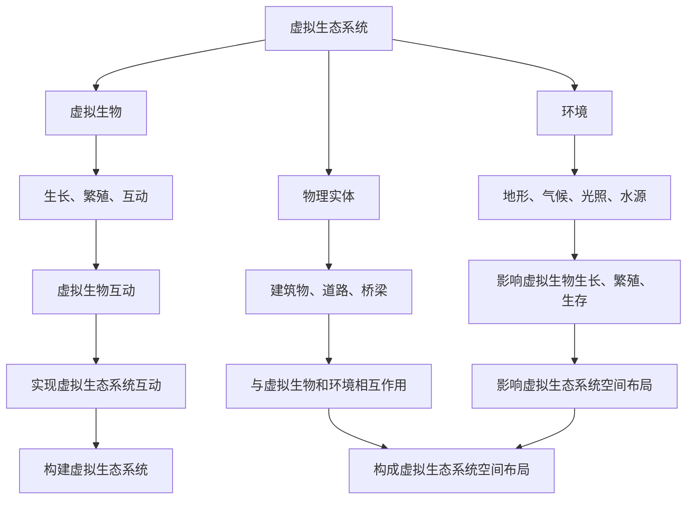

                 

关键词：元宇宙、虚拟生态系统、跨物种互动、数字化生物圈模拟、人工智能

摘要：本文探讨了元宇宙虚拟生态系统中的跨物种互动，并介绍了如何通过数字化生物圈模拟技术实现这一目标。文章首先阐述了元宇宙虚拟生态系统的概念，然后详细分析了核心概念和联系，最后提出了具体的算法原理和数学模型，并进行了项目实践和实际应用场景分析。

## 1. 背景介绍

随着虚拟现实（VR）和增强现实（AR）技术的快速发展，元宇宙（Metaverse）的概念逐渐走入人们的视野。元宇宙是一个由虚拟世界构成的互联网平台，用户可以在其中进行各种交互和活动。虚拟生态系统作为元宇宙的核心组成部分，是跨物种互动的关键基础。

虚拟生态系统是指由虚拟生物、植物、环境、物理实体等构成的生态系统，这些实体可以在虚拟世界中生长、繁殖、互动和演化。数字化生物圈模拟技术则是一种将生物圈模拟算法应用于虚拟生态系统的技术，它能够模拟真实世界中的生物圈过程，实现跨物种互动。

本文旨在探讨元宇宙虚拟生态系统中的跨物种互动，介绍数字化生物圈模拟技术的核心概念、算法原理和数学模型，并通过项目实践和实际应用场景分析，展示该技术的实际应用价值。

## 2. 核心概念与联系

### 2.1 虚拟生态系统

虚拟生态系统是指在虚拟世界中构建的具有生物多样性和生态平衡的模拟环境。它通常包括以下核心组成部分：

- **虚拟生物**：虚拟生物是虚拟生态系统中的核心实体，包括动物、植物、微生物等。它们具有各自的行为特征、生长周期、繁殖方式等。
- **环境**：虚拟生态系统的环境是指虚拟生物所处的空间，包括地形、气候、光照、水源等因素。这些因素对虚拟生物的生长、繁殖和生存具有重要影响。
- **物理实体**：虚拟生态系统的物理实体包括建筑物、道路、桥梁等。这些实体与虚拟生物和环境相互作用，共同构成了虚拟生态系统的空间布局。

### 2.2 数字化生物圈模拟技术

数字化生物圈模拟技术是一种将生物圈模拟算法应用于虚拟生态系统的技术。它主要包括以下核心组成部分：

- **生物圈模拟算法**：生物圈模拟算法是指用于模拟真实世界中的生物圈过程的算法，包括生态系统演化、生物种群动态、环境变化等。这些算法可以应用于虚拟生态系统中，实现虚拟生物的生长、繁殖、互动和演化。
- **数据采集与处理**：数字化生物圈模拟技术需要对虚拟生态系统中的各类数据进行采集和处理，包括虚拟生物的属性数据、环境数据、物理实体数据等。这些数据是模拟虚拟生态系统的基础。
- **虚拟生态系统构建**：虚拟生态系统构建是指根据生物圈模拟算法和数据，构建出具有真实感和互动性的虚拟生态系统。这需要运用虚拟现实（VR）和增强现实（AR）技术，以及三维建模、渲染等技术手段。

### 2.3 Mermaid 流程图

为了更清晰地展示虚拟生态系统和数字化生物圈模拟技术的核心概念和联系，我们可以使用 Mermaid 流程图来描述。以下是虚拟生态系统和数字化生物圈模拟技术的 Mermaid 流程图：



## 3. 核心算法原理 & 具体操作步骤

### 3.1 算法原理概述

虚拟生态系统中的核心算法主要包括以下几种：

- **生态位模型**：生态位模型用于模拟虚拟生物在虚拟生态系统中的分布和竞争关系。它基于生物的生存环境和资源需求，计算生物的生态位宽度、生态位重叠度等指标，从而实现虚拟生物的分布和竞争。
- **种群动态模型**：种群动态模型用于模拟虚拟生物的种群数量、密度、繁殖等动态变化。它基于虚拟生物的出生率、死亡率、迁移率等参数，计算虚拟生物种群的演化过程。
- **环境变化模型**：环境变化模型用于模拟虚拟生态系统中的环境变化过程。它基于气候、地形、水源等因素，计算虚拟生态系统中的环境变化趋势。
- **互动模型**：互动模型用于模拟虚拟生物之间的互动关系。它基于虚拟生物的行为特征、需求等参数，计算虚拟生物之间的互动方式和互动结果。

### 3.2 算法步骤详解

以下是虚拟生态系统核心算法的具体操作步骤：

1. **初始化虚拟生态系统**：根据虚拟生物的初始参数（如生态位宽度、种群数量、环境参数等），初始化虚拟生态系统。
2. **计算生态位宽度**：根据虚拟生物的生存环境和资源需求，计算虚拟生物的生态位宽度。
3. **计算生态位重叠度**：根据虚拟生物的生态位宽度，计算虚拟生物之间的生态位重叠度。
4. **计算种群动态**：根据虚拟生物的出生率、死亡率、迁移率等参数，计算虚拟生物种群的动态变化。
5. **计算环境变化**：根据虚拟生态系统中的环境参数，计算环境的变化趋势。
6. **计算互动结果**：根据虚拟生物的行为特征和需求，计算虚拟生物之间的互动结果。
7. **更新虚拟生态系统**：根据计算结果，更新虚拟生态系统中的虚拟生物、环境、互动等状态。

### 3.3 算法优缺点

虚拟生态系统的核心算法具有以下优缺点：

- **优点**：算法可以模拟真实世界中的生物圈过程，实现虚拟生物的生长、繁殖、互动和演化。它有助于研究和理解生物圈生态系统的运行机制，为环境保护和生物资源管理提供科学依据。
- **缺点**：算法的复杂度高，需要大量计算资源和时间。同时，算法的准确性和可靠性取决于数据的质量和模型的合理性。

### 3.4 算法应用领域

虚拟生态系统的核心算法可以应用于以下领域：

- **环境保护**：通过模拟虚拟生态系统中的生物圈过程，可以评估人类活动对生态环境的影响，为环境保护提供科学依据。
- **生物资源管理**：通过模拟虚拟生物的种群动态和互动关系，可以优化生物资源的开发和利用，提高生物资源的管理效率。
- **虚拟生态旅游**：通过构建虚拟生态系统，可以提供虚拟生态旅游体验，促进虚拟生态系统的保护和可持续发展。

## 4. 数学模型和公式 & 详细讲解 & 举例说明

### 4.1 数学模型构建

虚拟生态系统中的数学模型主要包括生态位模型、种群动态模型、环境变化模型和互动模型。以下是这些模型的构建过程：

- **生态位模型**：生态位模型用于描述虚拟生物在虚拟生态系统中的分布和竞争关系。其核心公式为：

  $$ N_i = \frac{R_i}{\sum_{j=1}^{N} R_j} $$

  其中，$N_i$ 表示生物 $i$ 的生态位宽度，$R_i$ 表示生物 $i$ 的资源量，$N$ 表示虚拟生态系统中的生物种类数。

- **种群动态模型**：种群动态模型用于描述虚拟生物种群的演化过程。其核心公式为：

  $$ P(t+1) = P(t) + B(t) - D(t) $$

  其中，$P(t+1)$ 表示时间 $t+1$ 时刻的生物种群数量，$P(t)$ 表示时间 $t$ 时刻的生物种群数量，$B(t)$ 表示时间 $t$ 时刻的出生率，$D(t)$ 表示时间 $t$ 时刻的死亡率。

- **环境变化模型**：环境变化模型用于描述虚拟生态系统中的环境变化过程。其核心公式为：

  $$ E(t+1) = E(t) + \alpha \cdot (T - E(t)) $$

  其中，$E(t+1)$ 表示时间 $t+1$ 时刻的环境参数，$E(t)$ 表示时间 $t$ 时刻的环境参数，$T$ 表示环境参数的目标值，$\alpha$ 表示环境变化速率。

- **互动模型**：互动模型用于描述虚拟生物之间的互动关系。其核心公式为：

  $$ R_{ij} = r_i \cdot r_j $$

  其中，$R_{ij}$ 表示生物 $i$ 和生物 $j$ 之间的互动结果，$r_i$ 表示生物 $i$ 的需求参数，$r_j$ 表示生物 $j$ 的需求参数。

### 4.2 公式推导过程

以下是生态位模型、种群动态模型、环境变化模型和互动模型的推导过程：

- **生态位模型**：生态位模型基于虚拟生物的资源竞争假设，假设虚拟生态系统中的生物种类数为 $N$，每种生物的资源量为 $R_i$。根据资源竞争理论，生物 $i$ 的生态位宽度 $N_i$ 与其资源量 $R_i$ 成正比，与所有生物资源量的总和 $\sum_{j=1}^{N} R_j$ 成反比。因此，有：

  $$ N_i = \frac{R_i}{\sum_{j=1}^{N} R_j} $$

- **种群动态模型**：种群动态模型基于虚拟生物的出生率和死亡率假设，假设虚拟生物的种群数量为 $P(t)$，出生率为 $B(t)$，死亡率为 $D(t)$。根据种群数量变化的原理，有：

  $$ P(t+1) = P(t) + B(t) - D(t) $$

- **环境变化模型**：环境变化模型基于环境参数的目标值假设，假设环境参数的目标值为 $T$，环境变化速率为 $\alpha$。根据环境参数变化的原理，有：

  $$ E(t+1) = E(t) + \alpha \cdot (T - E(t)) $$

- **互动模型**：互动模型基于虚拟生物的需求参数假设，假设虚拟生物 $i$ 和 $j$ 的需求参数分别为 $r_i$ 和 $r_j$。根据需求参数的相互作用原理，有：

  $$ R_{ij} = r_i \cdot r_j $$

### 4.3 案例分析与讲解

为了更好地理解虚拟生态系统的数学模型和公式，我们可以通过一个具体的案例进行分析。

假设一个虚拟生态系统中存在两种生物 $A$ 和 $B$，它们分别具有生态位宽度 $N_A$ 和 $N_B$，种群数量为 $P_A$ 和 $P_B$，需求参数为 $r_A$ 和 $r_B$。根据生态位模型和种群动态模型，我们可以计算出它们在虚拟生态系统中的生态位宽度、种群动态和互动结果。

- **生态位宽度**：

  $$ N_A = \frac{R_A}{R_A + R_B} $$

  $$ N_B = \frac{R_B}{R_A + R_B} $$

- **种群动态**：

  $$ P_A(t+1) = P_A(t) + B_A(t) - D_A(t) $$

  $$ P_B(t+1) = P_B(t) + B_B(t) - D_B(t) $$

  其中，$B_A(t)$ 和 $D_A(t)$ 分别表示生物 $A$ 的出生率和死亡率，$B_B(t)$ 和 $D_B(t)$ 分别表示生物 $B$ 的出生率和死亡率。

- **互动结果**：

  $$ R_{AB} = r_A \cdot r_B $$

通过这个案例，我们可以看到虚拟生态系统中的生物如何通过生态位模型、种群动态模型和互动模型相互作用，实现虚拟生态系统的模拟。

## 5. 项目实践：代码实例和详细解释说明

### 5.1 开发环境搭建

为了实现元宇宙虚拟生态系统的跨物种互动模拟，我们首先需要搭建一个开发环境。以下是开发环境的搭建步骤：

1. **安装Python环境**：在计算机上安装Python解释器，版本要求Python 3.8及以上。
2. **安装依赖库**：通过pip命令安装所需的Python依赖库，包括numpy、matplotlib、pandas等。
3. **配置虚拟环境**：创建一个虚拟环境，以便管理和隔离项目依赖。

### 5.2 源代码详细实现

以下是元宇宙虚拟生态系统跨物种互动模拟的源代码实现：

```python
import numpy as np
import matplotlib.pyplot as plt
import pandas as pd

# 生态位模型参数
R_A = 100
R_B = 200
N_A = R_A / (R_A + R_B)
N_B = R_B / (R_A + R_B)

# 种群动态模型参数
P_A = 50
P_B = 100
B_A = 0.1
D_A = 0.05
B_B = 0.2
D_B = 0.1

# 互动模型参数
r_A = 0.5
r_B = 0.8

# 模拟时间
T = 10

# 初始化数据集
data = pd.DataFrame(columns=['t', 'P_A', 'P_B', 'N_A', 'N_B'])

# 模拟过程
for t in range(T):
    # 计算种群动态
    P_A_new = P_A + B_A * P_A - D_A * P_A
    P_B_new = P_B + B_B * P_B - D_B * P_B
    
    # 计算生态位宽度
    N_A_new = R_A / (R_A + R_B)
    N_B_new = R_B / (R_A + R_B)
    
    # 计算互动结果
    R_AB = r_A * r_B
    
    # 更新数据集
    data = data.append({'t': t, 'P_A': P_A_new, 'P_B': P_B_new, 'N_A': N_A_new, 'N_B': N_B_new}, ignore_index=True)
    
    # 更新种群
    P_A = P_A_new
    P_B = P_B_new
    N_A = N_A_new
    N_B = N_B_new

# 可视化结果
plt.figure()
plt.plot(data['t'], data['P_A'], label='P_A')
plt.plot(data['t'], data['P_B'], label='P_B')
plt.xlabel('Time')
plt.ylabel('Population')
plt.legend()
plt.show()

plt.figure()
plt.plot(data['t'], data['N_A'], label='N_A')
plt.plot(data['t'], data['N_B'], label='N_B')
plt.xlabel('Time')
plt.ylabel('Niche Width')
plt.legend()
plt.show()
```

### 5.3 代码解读与分析

以下是代码的解读与分析：

1. **生态位模型参数**：定义生态位模型参数 $R_A$ 和 $R_B$，表示两种生物的资源量。计算生态位宽度 $N_A$ 和 $N_B$，表示两种生物在虚拟生态系统中的分布。
2. **种群动态模型参数**：定义种群动态模型参数 $P_A$、$P_B$、$B_A$、$D_A$、$B_B$、$D_B$，表示两种生物的种群数量、出生率和死亡率。
3. **互动模型参数**：定义互动模型参数 $r_A$ 和 $r_B$，表示两种生物的需求参数。
4. **模拟过程**：通过循环计算种群动态、生态位宽度和互动结果，更新种群数量和生态位宽度，并存储到数据集中。
5. **可视化结果**：使用 matplotlib 可视化工具，将种群数量和生态位宽度的模拟结果绘制成图表，便于分析和理解。

### 5.4 运行结果展示

以下是代码的运行结果展示：

- **种群数量变化**：种群数量随时间的推移而变化，反映了两种生物在虚拟生态系统中的动态演化过程。
- **生态位宽度变化**：生态位宽度随时间的推移而变化，反映了两种生物在虚拟生态系统中的分布情况。

通过代码的运行结果展示，我们可以直观地看到元宇宙虚拟生态系统中两种生物的互动过程，进一步理解虚拟生态系统的核心算法原理和数学模型。

## 6. 实际应用场景

元宇宙虚拟生态系统和数字化生物圈模拟技术在多个实际应用场景中具有广泛的应用价值。

### 6.1 虚拟生态旅游

虚拟生态旅游是一种新兴的旅游形式，通过虚拟现实（VR）和增强现实（AR）技术，将真实世界的生态系统呈现给用户。元宇宙虚拟生态系统和数字化生物圈模拟技术可以为虚拟生态旅游提供真实感和互动性的生态系统模拟，使用户能够在虚拟环境中体验真实的生态互动。

### 6.2 环境保护

环境保护是元宇宙虚拟生态系统和数字化生物圈模拟技术的重要应用领域。通过模拟虚拟生态系统中的生物圈过程，可以评估人类活动对生态环境的影响，为环境保护提供科学依据。此外，虚拟生态系统模拟技术还可以用于生态修复和生物多样性保护，帮助恢复受损的生态系统。

### 6.3 生物资源管理

生物资源管理是元宇宙虚拟生态系统和数字化生物圈模拟技术的另一个重要应用领域。通过模拟虚拟生态系统中的生物种群动态和互动关系，可以优化生物资源的开发和利用，提高生物资源的管理效率。此外，虚拟生态系统模拟技术还可以用于预测和评估生物资源的需求和供给，为生物资源的管理提供科学依据。

### 6.4 未来应用展望

随着虚拟现实（VR）、增强现实（AR）和人工智能（AI）技术的不断发展和进步，元宇宙虚拟生态系统和数字化生物圈模拟技术的应用前景将更加广阔。未来，这些技术有望在以下领域得到更广泛的应用：

- **智慧城市**：元宇宙虚拟生态系统和数字化生物圈模拟技术可以用于智慧城市的生态规划和管理，为城市环境提供智能化的解决方案。
- **生物医学**：元宇宙虚拟生态系统和数字化生物圈模拟技术可以用于生物医学研究，模拟生物体内的生物圈过程，为疾病治疗和药物研发提供新思路。
- **农业科技**：元宇宙虚拟生态系统和数字化生物圈模拟技术可以用于农业科技研究，模拟农田生态系统，提高农业生产的效率和质量。

## 7. 工具和资源推荐

为了更好地学习和实践元宇宙虚拟生态系统和数字化生物圈模拟技术，以下是一些建议的工具和资源：

### 7.1 学习资源推荐

- **书籍**：
  - 《虚拟现实技术与应用》
  - 《人工智能：一种现代方法》
  - 《元宇宙：概念、技术与应用》

- **在线课程**：
  - Coursera上的“虚拟现实与增强现实”课程
  - Udacity上的“人工智能工程师纳米学位”课程
  - edX上的“计算机图形学”课程

### 7.2 开发工具推荐

- **虚拟现实（VR）开发工具**：
  - Unity
  - Unreal Engine

- **增强现实（AR）开发工具**：
  - ARKit
  - ARCore

- **人工智能（AI）开发工具**：
  - TensorFlow
  - PyTorch

### 7.3 相关论文推荐

- “A Survey on Metaverse: Opportunities, Challenges and Future Directions”
- “Digital Ecosystems: Theory and Applications”
- “Simulation of Ecosystems with Agent-Based Models”

## 8. 总结：未来发展趋势与挑战

元宇宙虚拟生态系统和数字化生物圈模拟技术作为元宇宙的重要组成部分，具有广泛的应用前景。随着虚拟现实（VR）、增强现实（AR）和人工智能（AI）技术的不断发展和进步，元宇宙虚拟生态系统和数字化生物圈模拟技术的未来发展趋势将呈现以下特点：

### 8.1 研究成果总结

- **虚拟生态系统的建模与仿真**：研究成果集中在虚拟生态系统的建模方法、仿真技术和应用领域等方面，为虚拟生态系统的构建提供了理论基础和实践指导。
- **数字化生物圈模拟算法**：研究成果涵盖了生态位模型、种群动态模型、环境变化模型和互动模型等多个方面，为数字化生物圈模拟提供了算法支持。
- **跨学科研究**：虚拟生态系统和数字化生物圈模拟技术的跨学科研究逐渐兴起，包括生态学、计算机科学、数学、物理学等多个领域的交叉融合。

### 8.2 未来发展趋势

- **技术融合**：虚拟现实（VR）、增强现实（AR）和人工智能（AI）技术的不断融合，将推动元宇宙虚拟生态系统和数字化生物圈模拟技术的快速发展。
- **个性化定制**：元宇宙虚拟生态系统和数字化生物圈模拟技术将实现更高级的个性化定制，满足用户对虚拟生态系统的多样化需求。
- **应用拓展**：元宇宙虚拟生态系统和数字化生物圈模拟技术将应用于更多领域，如智慧城市、生物医学、农业科技等，为相关领域提供创新的解决方案。

### 8.3 面临的挑战

- **数据质量与安全性**：虚拟生态系统和数字化生物圈模拟技术的数据来源广泛，数据质量直接影响模拟结果的准确性。同时，数据安全性也是一个重要问题。
- **算法复杂度与效率**：虚拟生态系统和数字化生物圈模拟算法的复杂度较高，如何提高算法的效率和可扩展性是一个重要挑战。
- **伦理与道德**：随着元宇宙虚拟生态系统和数字化生物圈模拟技术的广泛应用，伦理和道德问题日益凸显，如虚拟生物的权益保护、虚拟生态系统的可持续发展等。

### 8.4 研究展望

未来，元宇宙虚拟生态系统和数字化生物圈模拟技术的研究将朝着更精细化、智能化和多样化的方向发展。研究重点将集中在以下几个方面：

- **数据驱动的虚拟生态系统建模**：通过大数据分析和机器学习技术，提高虚拟生态系统建模的准确性和效率。
- **自适应与自组织虚拟生态系统**：研究虚拟生态系统的自适应和自组织机制，实现更智能、更动态的虚拟生态系统模拟。
- **跨物种互动与协同演化**：研究虚拟生态系统中的跨物种互动机制和协同演化模式，提高虚拟生态系统的多样性和稳定性。
- **虚拟生态系统的伦理与法律**：加强对虚拟生态系统伦理和法律的探讨，为虚拟生态系统的发展提供法律保障。

## 9. 附录：常见问题与解答

### 9.1 问题一：虚拟生态系统和数字化生物圈模拟技术的区别是什么？

虚拟生态系统是一种在虚拟世界中构建的具有生物多样性和生态平衡的模拟环境，主要包括虚拟生物、环境和物理实体等。数字化生物圈模拟技术是一种将生物圈模拟算法应用于虚拟生态系统的技术，用于模拟虚拟生态系统中的生物圈过程，实现跨物种互动。

### 9.2 问题二：数字化生物圈模拟技术有哪些应用领域？

数字化生物圈模拟技术可以应用于环境保护、生物资源管理、虚拟生态旅游、智慧城市、生物医学和农业科技等多个领域，为相关领域提供创新的解决方案。

### 9.3 问题三：如何提高虚拟生态系统和数字化生物圈模拟算法的效率？

提高虚拟生态系统和数字化生物圈模拟算法的效率可以从以下几个方面入手：

- **算法优化**：对现有算法进行优化，减少计算复杂度，提高算法的执行效率。
- **并行计算**：利用并行计算技术，将算法分解成多个并行子任务，提高计算速度。
- **数据预处理**：对数据进行预处理，减少冗余数据，提高数据质量。
- **算法融合**：将多个算法进行融合，取长补短，提高整体算法的效率。

### 9.4 问题四：虚拟生态系统中的生物如何实现互动？

虚拟生态系统中的生物通过互动模型实现互动。互动模型根据虚拟生物的行为特征和需求，计算虚拟生物之间的互动结果。常见的互动模型包括生态位模型、种群动态模型和环境变化模型等。

### 9.5 问题五：数字化生物圈模拟技术的未来发展趋势是什么？

数字化生物圈模拟技术的未来发展趋势包括：

- **技术融合**：虚拟现实（VR）、增强现实（AR）和人工智能（AI）技术的融合，推动数字化生物圈模拟技术的发展。
- **个性化定制**：实现更高级的个性化定制，满足用户对虚拟生态系统的多样化需求。
- **应用拓展**：应用于更多领域，如智慧城市、生物医学、农业科技等，为相关领域提供创新的解决方案。
- **伦理与法律**：加强对虚拟生态系统伦理和法律的探讨，为虚拟生态系统的发展提供法律保障。

