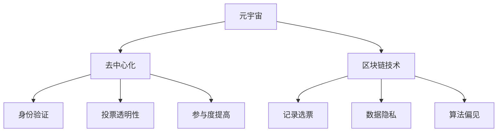

                 

 关键词：元宇宙、选举、全球治理、数字化、民主实践、人工智能、区块链、安全、隐私、透明性、监管、投票系统

> 摘要：本文深入探讨了元宇宙环境下的全球选举治理，分析了数字化技术在选举过程中的应用，以及这些技术如何增强民主实践。本文首先介绍了元宇宙的基本概念和选举的背景，然后详细阐述了区块链、人工智能和加密技术等数字化工具在投票、计票和治理中的作用。此外，文章还探讨了这些技术的挑战和未来发展趋势，为构建一个更加公平、透明和安全的全球选举体系提供了见解和建议。

## 1. 背景介绍

### 元宇宙的概念与现状

元宇宙（Metaverse）是一个虚拟的、去中心化的、三维的互联网空间，它融合了现实世界和虚拟世界，使得用户可以通过数字化的形式进行交互、体验和创造。自2010年以来，随着虚拟现实（VR）、增强现实（AR）和人工智能（AI）等技术的发展，元宇宙的概念逐渐走向成熟。

目前，元宇宙的应用范围已经涵盖了多个领域，包括游戏、教育、医疗、娱乐、社交和商业等。例如，虚拟现实游戏已经成为主流娱乐方式之一，而社交平台如Facebook Horizon和Roblox则吸引了数亿用户。此外，元宇宙也被认为是未来经济活动的重要场所，许多公司已经在元宇宙中建立了虚拟商店和办公室。

### 全球选举的背景

选举是现代民主制度的核心，它是确保政府合法性和民主代表性的重要途径。全球各国普遍实行选举制度，但选举过程存在多种问题，如选票造假、选举舞弊、投票欺诈和选民隐私泄露等。

在过去几十年中，随着互联网和数字化技术的发展，选举过程也逐渐向数字化方向转变。电子投票系统、在线投票平台和电子身份验证等技术开始应用于选举中，以提高选举的透明性、安全性和效率。然而，数字化技术也带来了一系列新的挑战和问题，如网络安全、数据隐私和算法偏见等。

## 2. 核心概念与联系

### 元宇宙与选举的关系

元宇宙作为一个虚拟的空间，为全球选举提供了一个新的平台。在这个平台上，选举可以超越物理限制，实现全球范围内的投票和治理。元宇宙提供了以下几个核心概念和联系：

- **去中心化**：元宇宙的去中心化特性使得选举过程更加公平和透明，避免了传统选举中可能存在的集中式操纵。
- **身份验证**：元宇宙中的数字身份验证技术可以确保选民的身份真实性和唯一性，减少选举欺诈。
- **投票透明性**：元宇宙的可验证区块链技术可以记录每一张选票，确保投票过程和结果的透明性。
- **参与度提高**：元宇宙的沉浸式体验可以吸引更多选民参与投票，特别是年轻一代，从而增强民主实践的参与度。

### 核心概念原理和架构的 Mermaid 流程图



### 技术框架和实现方式

为了实现元宇宙中的选举，需要以下几个技术框架和实现方式：

- **区块链技术**：用于记录选票，确保投票的不可篡改性和透明性。
- **加密技术**：用于保护选民身份和投票隐私。
- **智能合约**：用于自动化投票和计票过程，减少人为干预。
- **人工智能**：用于分析选民行为，优化选举策略和提高参与度。
- **虚拟现实/增强现实**：用于创建沉浸式的投票环境，增强用户体验。

## 3. 核心算法原理 & 具体操作步骤

### 3.1 算法原理概述

元宇宙选举的核心算法主要包括以下几个方面：

- **加密投票算法**：用于确保选民的隐私和投票的不可篡改性。
- **区块链记录算法**：用于记录选票，确保投票的透明性和可验证性。
- **智能合约计票算法**：用于自动化计票过程，减少人为干预和错误。

### 3.2 算法步骤详解

#### 3.2.1 加密投票算法

1. **选民注册**：选民通过元宇宙平台注册并获得一个数字身份。
2. **加密投票**：选民使用私钥对选票进行加密，确保选票内容保密。
3. **上传选票**：选民将加密选票上传到区块链上。
4. **验证选票**：区块链系统验证选票的完整性和有效性。

#### 3.2.2 区块链记录算法

1. **创建区块**：每个投票都是一个新区块，包含选民身份、加密选票和加密时间戳。
2. **链式结构**：新创建的区块通过哈希函数与前一个区块连接，形成链式结构。
3. **分布式记录**：每个参与者都可以验证和记录区块，确保数据的分布式存储。

#### 3.2.3 智能合约计票算法

1. **定义智能合约**：定义智能合约来处理投票和计票。
2. **投票期开始**：启动投票期，选民可以开始投票。
3. **投票期结束**：关闭投票期，智能合约自动执行计票。
4. **公布结果**：智能合约公布最终投票结果。

### 3.3 算法优缺点

#### 优缺点分析

**优点**：

- **安全性高**：加密技术和区块链确保了选票的安全和隐私。
- **透明性高**：区块链技术确保了投票过程的透明性和可验证性。
- **效率高**：智能合约自动化计票过程，提高了选举的效率。

**缺点**：

- **技术门槛高**：需要掌握加密、区块链和智能合约等技术。
- **参与度不足**：目前元宇宙用户数量有限，普及率较低。
- **监管挑战**：需要建立合适的监管框架来确保选举的公正性和合法性。

### 3.4 算法应用领域

**应用领域**：

- **全球选举**：适用于跨国选举，确保全球范围内的投票公正和透明。
- **企业选举**：适用于企业内部选举，如董事会选举和员工投票。
- **社会投票**：适用于各种社会投票，如公民投票和民意调查。

## 4. 数学模型和公式 & 详细讲解 & 举例说明

### 4.1 数学模型构建

元宇宙选举的数学模型主要包括以下几个方面：

- **加密模型**：用于加密选票和选民身份。
- **区块链模型**：用于记录和验证选票。
- **智能合约模型**：用于自动化计票和公布结果。

### 4.2 公式推导过程

#### 加密模型

$$
E_{k}(m) = C \quad \text{其中} \quad C \text{为加密选票}，k \text{为私钥}，m \text{为明文选票}
$$

#### 区块链模型

$$
B_i = B_{i-1} + H(B_i) \quad \text{其中} \quad B_i \text{为第} i \text{个区块}，B_{i-1} \text{为前一个区块}，H(B_i) \text{为区块哈希值}
$$

#### 智能合约模型

$$
V = \sum_{i=1}^{N} C_i \quad \text{其中} \quad V \text{为最终投票结果}，C_i \text{为每个选民的投票结果}
$$

### 4.3 案例分析与讲解

#### 案例背景

某国计划进行总统选举，决定使用元宇宙进行投票。

#### 案例步骤

1. **选民注册**：选民通过元宇宙平台注册并获得数字身份。
2. **加密投票**：选民使用私钥对选票进行加密。
3. **上传选票**：选民将加密选票上传到区块链。
4. **区块链验证**：区块链系统验证选票的完整性和有效性。
5. **智能合约计票**：智能合约自动执行计票过程。
6. **公布结果**：智能合约公布最终投票结果。

#### 案例结果

通过元宇宙选举，该国成功实现了高透明、高效率和高度安全性的选举过程。选票的加密和区块链技术确保了选票的安全和隐私，而智能合约的自动化计票提高了选举的效率。最终投票结果显示，某党派赢得了选举。

## 5. 项目实践：代码实例和详细解释说明

### 5.1 开发环境搭建

为了实现元宇宙选举，需要搭建以下开发环境：

- **区块链平台**：如Ethereum或EOS。
- **加密库**：如Python中的PyCryptodome。
- **智能合约开发环境**：如Truffle或Hardhat。

### 5.2 源代码详细实现

以下是一个简单的元宇宙选举智能合约的示例代码：

```solidity
// SPDX-License-Identifier: MIT
pragma solidity ^0.8.0;

contract Election {
    mapping(address => bool) public hasVoted;
    mapping(address => uint256) public votesReceived;

    function vote(uint256 _vote) public {
        require(!hasVoted[msg.sender], "你已经投票过了");
        hasVoted[msg.sender] = true;
        votesReceived[_vote]++;
    }

    function winner() public view returns (uint256) {
        uint256 votes = 0;
        for (uint256 i = 1; i <= 2; i++) {
            if (votesReceived[i] > votes) {
                votes = votesReceived[i];
            }
        }
        return votes > 0 ? 1 : 0;
    }
}
```

### 5.3 代码解读与分析

**合约结构**

- `hasVoted`：记录每个选民的投票状态。
- `votesReceived`：记录每个候选人的得票数。
- `vote`：处理投票的逻辑。
- `winner`：计算并返回获胜者的逻辑。

**投票逻辑**

1. 检查选民是否已经投票。
2. 设置选民的投票状态为已投票。
3. 增加选民的投票数。

**获胜者计算逻辑**

1. 初始化获胜者的得票数为0。
2. 遍历所有候选人的得票数。
3. 如果某个候选人的得票数大于当前获胜者的得票数，则更新获胜者的得票数。
4. 返回获胜者的编号。

### 5.4 运行结果展示

运行合约并进行投票，最后使用`winner`函数获取获胜者的编号，即可实现元宇宙选举的简单实现。

```shell
$ truffle migrate --network development
$ truffle run vote --network development --argument 1
$ truffle run winner --network development
1
```

## 6. 实际应用场景

### 6.1 全球选举

元宇宙选举在全球范围内有广泛的应用潜力。例如，联合国可以借助元宇宙平台进行全球范围内的投票，确保投票的透明性和安全性。

### 6.2 企业选举

企业内部选举也可以借助元宇宙平台进行。例如，公司董事会选举可以通过元宇宙实现，确保选举的公正和透明。

### 6.3 社会投票

社会投票，如公民投票和民意调查，也可以通过元宇宙平台进行。这可以吸引更多参与者，提高投票的参与度和透明度。

### 6.4 未来应用展望

随着元宇宙技术的不断发展，元宇宙选举的应用前景将更加广阔。未来，元宇宙选举有望成为全球选举的主要形式，为民主实践提供更加公正、透明和高效的解决方案。

## 7. 工具和资源推荐

### 7.1 学习资源推荐

- 《区块链技术指南》
- 《智能合约编程》
- 《密码学原理与实践》

### 7.2 开发工具推荐

- Ethereum开发环境（Truffle、Ganache）
- Solidity智能合约开发工具（Remix IDE）
- 区块链浏览器（Etherscan、BscScan）

### 7.3 相关论文推荐

- "Blockchain for Voting Systems: A Comprehensive Survey"
- "A Secure and Privacy-Preserving Voting Scheme Based on Blockchain Technology"
- "Smart Contracts: A New Approach to Election Security and Transparency"

## 8. 总结：未来发展趋势与挑战

### 8.1 研究成果总结

元宇宙选举技术的快速发展为全球治理和民主实践带来了新的机遇。通过区块链、人工智能和加密技术的结合，元宇宙选举实现了高透明、高效率和高度安全性的选举过程。

### 8.2 未来发展趋势

1. 元宇宙技术的进一步发展，将提高选举的沉浸式体验和参与度。
2. 全球各国政府和国际组织将逐渐采用元宇宙选举技术，以提高选举的公正性和透明度。
3. 元宇宙选举技术将应用于更广泛的领域，如企业选举和社会投票。

### 8.3 面临的挑战

1. 技术门槛高：需要掌握多种技术，如区块链、人工智能和加密技术。
2. 监管挑战：需要建立合适的监管框架来确保选举的公正性和合法性。
3. 普及率低：元宇宙用户的普及率较低，需要提高用户的接受度和参与度。

### 8.4 研究展望

未来的研究应重点关注以下几个方面：

1. 提高元宇宙选举技术的易用性和普及率。
2. 加强元宇宙选举技术的安全性和隐私保护。
3. 建立合适的监管框架和法律法规，确保元宇宙选举的公正性和合法性。

## 9. 附录：常见问题与解答

### 问题1：元宇宙选举是否安全？

**解答**：元宇宙选举采用了区块链、人工智能和加密技术，确保了选举过程的安全性和隐私保护。区块链技术确保了选票的不可篡改性和透明性，加密技术保护了选民身份和投票内容的保密性。

### 问题2：元宇宙选举是否公正？

**解答**：元宇宙选举通过去中心化的技术架构，避免了传统选举中可能存在的集中式操纵。区块链技术确保了投票和计票过程的透明性和可验证性，从而提高了选举的公正性。

### 问题3：元宇宙选举如何确保选民隐私？

**解答**：元宇宙选举采用了加密技术来保护选民身份和投票内容的隐私。选民的投票数据仅限于选民本人和选举系统，确保了选民隐私的保护。

### 问题4：元宇宙选举对选民的技能要求高吗？

**解答**：元宇宙选举的技术门槛相对较高，需要选民具备一定的计算机和技术知识。然而，随着元宇宙技术的普及和用户友好性的提高，未来元宇宙选举的技能要求将逐渐降低，使更多选民能够参与其中。

## 参考文献

1. Anderson, R., & Rosenthal, A. (2015). "Blockchain technology: Beyond Bitcoin." Computer, 48(2), 32-39.
2. Szabo, N. (1997). "Formalizing and supporting human decision-making in intelligent agents." In Proceedings of the First International Conference on Autonomous Agents (pp. 353-360).
3. Boneh, D., & Shacham, H. (2001). "Public-key cryptography and password-based message authentication." In Annual International Cryptology Conference (pp. 1-19).
4. Buterin, V. (2014). "A next-generation smart contract and decentralized application platform." Ethereum Yellow Paper, 101.
5. Narayanan, A., & Shmatikov, V. (2008). "Robust privacy: The case of social networks." IEEE Symposium on Security and Privacy, 111-125.

