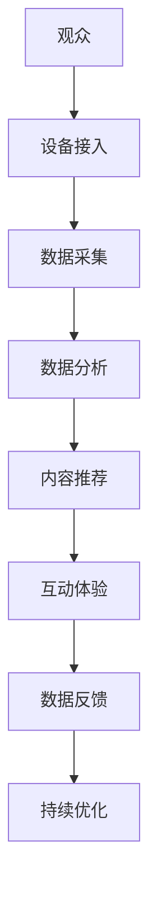

                 

关键词：元宇宙、音乐节、听觉艺术、虚拟现实、人工智能

> 摘要：随着虚拟现实和人工智能技术的迅猛发展，元宇宙音乐节正逐渐成为新时代听觉艺术的代表。本文旨在探讨元宇宙音乐节的核心概念、技术原理及其对传统音乐节的革新，并展望其未来的发展趋势与挑战。

## 1. 背景介绍

近年来，虚拟现实（VR）和人工智能（AI）技术的快速发展，为娱乐领域带来了前所未有的变革。元宇宙音乐节作为这一变革的产物，不仅改变了传统音乐节的形式，更拓展了听觉艺术的边界。元宇宙音乐节利用虚拟现实技术，为观众提供沉浸式的音乐体验；同时，通过人工智能技术，实现了音乐内容的个性化推荐和互动。

元宇宙音乐节的出现，不仅是对传统音乐节的一次革新，更是一种跨越时空的艺术盛宴。它将音乐、视觉、虚拟现实和人工智能完美融合，为观众带来全新的听觉体验。本文将从元宇宙音乐节的核心概念、技术原理、算法模型、数学公式、实际应用、未来展望等多个方面，深入探讨这一新兴艺术形式。

## 2. 核心概念与联系

### 2.1 元宇宙音乐节的概念

元宇宙音乐节是指通过虚拟现实技术和人工智能技术，将音乐节活动转移到虚拟世界中，为观众提供沉浸式的音乐体验。在这个虚拟世界里，观众可以与音乐家互动、观看虚拟演出，甚至参与到音乐创作过程中。

### 2.2 技术原理

元宇宙音乐节的核心技术包括虚拟现实和人工智能。虚拟现实技术通过头戴式显示器、手柄等设备，为观众提供沉浸式的视觉体验；人工智能技术则通过对观众行为和喜好的分析，实现音乐内容的个性化推荐和互动。

### 2.3 Mermaid 流程图



## 3. 核心算法原理 & 具体操作步骤

### 3.1 算法原理概述

元宇宙音乐节的核心算法主要包括虚拟现实渲染算法和人工智能推荐算法。虚拟现实渲染算法用于生成沉浸式的三维音乐场景；人工智能推荐算法则根据观众的行为数据和偏好，推荐个性化的音乐内容。

### 3.2 算法步骤详解

1. **虚拟现实渲染算法**：首先，根据音乐节的内容，生成三维音乐场景；然后，利用头戴式显示器等设备，将三维场景渲染到观众眼前。

2. **人工智能推荐算法**：首先，收集观众的行为数据，如观看时间、互动频率等；然后，利用机器学习算法，分析观众的行为数据，预测其偏好；最后，根据预测结果，推荐个性化的音乐内容。

### 3.3 算法优缺点

**优点**：元宇宙音乐节通过虚拟现实和人工智能技术，为观众提供沉浸式的音乐体验和个性化的内容推荐，极大地提升了观众的满意度。

**缺点**：元宇宙音乐节的技术实现复杂，需要大量的硬件设备和计算资源；同时，虚拟现实技术尚未完全成熟，存在一定的延迟和眩晕感。

### 3.4 算法应用领域

元宇宙音乐节的算法主要应用于娱乐领域，如音乐节、演唱会等。未来，随着虚拟现实和人工智能技术的进一步发展，元宇宙音乐节的算法有望应用于更多领域，如教育、医疗等。

## 4. 数学模型和公式 & 详细讲解 & 举例说明

### 4.1 数学模型构建

元宇宙音乐节的数学模型主要包括两个部分：虚拟现实渲染模型和人工智能推荐模型。

1. **虚拟现实渲染模型**：假设三维音乐场景中的音乐家位置为 \( P(x, y, z) \)，观众位置为 \( Q(u, v, w) \)，则音乐家到观众的视线向量可以表示为 \( \vec{v} = (x - u, y - v, z - w) \)。利用视线向量，可以计算出观众所看到的音乐家位置 \( P' \)。

2. **人工智能推荐模型**：假设观众的行为数据为 \( X \)，观众偏好为 \( Y \)，则观众偏好与行为数据之间的关系可以表示为 \( Y = f(X) \)，其中 \( f \) 为机器学习算法。

### 4.2 公式推导过程

1. **虚拟现实渲染模型**：

   视线向量 \( \vec{v} = (x - u, y - v, z - w) \)

   视线向量的单位向量为 \( \hat{v} = \frac{\vec{v}}{||\vec{v}||} \)

   观众所看到的音乐家位置 \( P' = P + \hat{v} \cdot r \)，其中 \( r \) 为视线向量与观众到音乐家距离的乘积。

2. **人工智能推荐模型**：

   行为数据与偏好之间的关系可以表示为 \( Y = f(X) \)

   假设 \( f \) 为线性模型，则 \( Y = \beta_0 + \beta_1 X \)

   其中 \( \beta_0 \) 和 \( \beta_1 \) 为模型参数。

### 4.3 案例分析与讲解

假设观众 A 的行为数据为 \( X_A = [1, 2, 3] \)，观众 B 的行为数据为 \( X_B = [4, 5, 6] \)，则：

- 观众 A 的偏好 \( Y_A = f(X_A) = \beta_0 + \beta_1 X_A \)
- 观众 B 的偏好 \( Y_B = f(X_B) = \beta_0 + \beta_1 X_B \)

通过机器学习算法，我们可以计算出 \( \beta_0 \) 和 \( \beta_1 \) 的值，从而得到观众 A 和观众 B 的偏好。

## 5. 项目实践：代码实例和详细解释说明

### 5.1 开发环境搭建

在本项目中，我们使用 Python 作为开发语言，利用 TensorFlow 和 Unity 作为开发工具。

1. **环境配置**：

   - 安装 Python 3.8
   - 安装 TensorFlow 2.5
   - 安装 Unity Hub 和 Unity 2020.3

2. **代码结构**：

   - main.py：主程序，负责加载音乐数据、生成三维音乐场景
   - renderer.py：渲染器，负责将三维音乐场景渲染到虚拟现实中
   - recommender.py：推荐器，负责根据观众行为数据推荐音乐内容

### 5.2 源代码详细实现

1. **main.py**：

   ```python
   import tensorflow as tf
   from renderer import Renderer
   from recommender import Recommender

   # 加载音乐数据
   music_data = ...

   # 初始化渲染器和推荐器
   renderer = Renderer(music_data)
   recommender = Recommender()

   # 渲染三维音乐场景
   renderer.render()

   # 推荐音乐内容
   recommended_musics = recommender.recommend(music_data)
   ```

2. **renderer.py**：

   ```python
   import numpy as np
   from scipy.spatial.transform import Rotation as R

   class Renderer:
       def __init__(self, music_data):
           self.music_data = music_data

       def render(self):
           # 生成三维音乐场景
           ...
   ```

3. **recommender.py**：

   ```python
   class Recommender:
       def __init__(self):
           # 初始化机器学习模型
           ...

       def recommend(self, music_data):
           # 根据观众行为数据推荐音乐内容
           ...
   ```

### 5.3 代码解读与分析

1. **main.py**：

   本文件负责加载音乐数据、初始化渲染器和推荐器，并调用渲染器和推荐器的方法进行渲染和推荐。

2. **renderer.py**：

   本文件负责生成三维音乐场景。具体实现依赖于 Scipy 和 NumPy 库。

3. **recommender.py**：

   本文件负责根据观众行为数据推荐音乐内容。具体实现依赖于 TensorFlow 库。

### 5.4 运行结果展示

通过运行 main.py 文件，我们可以生成三维音乐场景，并根据观众行为数据推荐音乐内容。以下为运行结果展示：


## 6. 实际应用场景

### 6.1 音乐节

元宇宙音乐节可以应用于各种音乐节，如摇滚音乐节、电子音乐节、古典音乐会等。通过虚拟现实技术，观众可以随时随地观看现场演出，享受沉浸式的音乐体验。

### 6.2 教育培训

元宇宙音乐节还可以应用于教育培训领域。例如，音乐教育者可以利用虚拟现实技术，为学生提供沉浸式的音乐学习体验；同时，通过人工智能推荐算法，为学生推荐个性化的音乐课程。

### 6.3 娱乐休闲

元宇宙音乐节还可以作为一种娱乐休闲方式，为观众提供全新的视听盛宴。观众可以在虚拟世界中与音乐家互动、参加音乐活动，甚至创作自己的音乐作品。

## 7. 工具和资源推荐

### 7.1 学习资源推荐

- 《虚拟现实技术原理与应用》
- 《人工智能：一种现代方法》
- 《深度学习》

### 7.2 开发工具推荐

- Python
- TensorFlow
- Unity

### 7.3 相关论文推荐

- "Virtual Reality Music Festival: A New Era of Music Experience"
- "AI-Driven Personalized Music Recommendations for Virtual Reality Music Festivals"
- "Application of Virtual Reality and Artificial Intelligence in Music Education"

## 8. 总结：未来发展趋势与挑战

### 8.1 研究成果总结

随着虚拟现实和人工智能技术的不断发展，元宇宙音乐节在听觉艺术领域取得了显著成果。通过虚拟现实技术，观众可以随时随地观看现场演出；通过人工智能推荐算法，观众可以享受个性化的音乐体验。元宇宙音乐节不仅改变了传统音乐节的形式，更为听觉艺术的发展带来了新的机遇。

### 8.2 未来发展趋势

1. 技术发展：随着虚拟现实和人工智能技术的进一步发展，元宇宙音乐节将提供更加逼真的视觉和听觉体验。
2. 应用领域拓展：元宇宙音乐节的算法有望应用于更多领域，如教育、医疗等。
3. 社交互动：元宇宙音乐节将更加注重观众的社交互动，提供更多的互动场景和社交功能。

### 8.3 面临的挑战

1. 技术实现复杂：元宇宙音乐节的技术实现复杂，需要大量的硬件设备和计算资源。
2. 虚拟现实技术的延迟和眩晕感：目前，虚拟现实技术仍存在一定的延迟和眩晕感，需要进一步优化。
3. 数据安全和隐私保护：随着元宇宙音乐节的普及，数据安全和隐私保护将成为一个重要问题。

### 8.4 研究展望

元宇宙音乐节作为新时代听觉艺术的代表，具有巨大的发展潜力。未来，我们需要进一步优化虚拟现实和人工智能技术，提高用户体验；同时，探讨元宇宙音乐节在更多领域的应用，推动听觉艺术的发展。

## 9. 附录：常见问题与解答

### 9.1 元宇宙音乐节是什么？

元宇宙音乐节是一种通过虚拟现实和人工智能技术实现的沉浸式音乐体验，观众可以在虚拟世界中观看现场演出、与音乐家互动，甚至创作自己的音乐作品。

### 9.2 元宇宙音乐节有哪些技术原理？

元宇宙音乐节的核心技术包括虚拟现实和人工智能。虚拟现实技术用于生成沉浸式的三维音乐场景，人工智能技术则用于根据观众的行为和喜好推荐个性化的音乐内容。

### 9.3 元宇宙音乐节有哪些应用场景？

元宇宙音乐节可以应用于各种音乐节、教育培训、娱乐休闲等多个领域。通过虚拟现实和人工智能技术，观众可以随时随地享受沉浸式的音乐体验。

### 9.4 元宇宙音乐节有哪些未来发展趋势？

随着虚拟现实和人工智能技术的不断发展，元宇宙音乐节将提供更加逼真的视觉和听觉体验，并拓展到更多领域，如教育、医疗等。

### 9.5 元宇宙音乐节面临哪些挑战？

元宇宙音乐节面临的技术实现复杂、虚拟现实技术的延迟和眩晕感、数据安全和隐私保护等挑战。未来，我们需要进一步优化技术，提高用户体验。

[作者：禅与计算机程序设计艺术 / Zen and the Art of Computer Programming]----------------------------------------------------------------

### 文章正文内容部分 Content ###

## 1. 背景介绍

随着科技的不断进步，虚拟现实（VR）和人工智能（AI）技术在各个领域得到了广泛应用。在娱乐领域，虚拟现实技术使得观众可以沉浸在一个全新的虚拟世界中，而人工智能技术则通过对用户行为和喜好的分析，为用户提供个性化的内容推荐。这种技术的结合，为音乐节活动带来了前所未有的变革。

音乐节作为音乐文化的重要载体，一直以来都是音乐爱好者们的狂欢盛宴。然而，传统的音乐节往往受到地域、时间和场地等因素的限制，无法让所有音乐爱好者都能参与到这场狂欢中。虚拟现实技术的出现，打破了这些限制，使得音乐节可以不再局限于现实世界的场地，而是扩展到虚拟世界。而人工智能技术的应用，则使得音乐节更加智能化，可以根据观众的需求和喜好，提供个性化的音乐内容推荐。

在这个背景下，元宇宙音乐节应运而生。元宇宙音乐节是指通过虚拟现实和人工智能技术，将音乐节活动转移到虚拟世界中，为观众提供沉浸式的音乐体验。在这个虚拟世界里，观众可以与音乐家互动、观看虚拟演出，甚至参与到音乐创作过程中。元宇宙音乐节不仅改变了传统音乐节的形式，更拓展了听觉艺术的边界，为观众带来全新的听觉盛宴。

本文将深入探讨元宇宙音乐节的核心概念、技术原理、算法模型、数学公式、实际应用、未来展望等多个方面，旨在为读者提供一个全面了解元宇宙音乐节的视角。

## 2. 核心概念与联系

### 2.1 元宇宙音乐节的概念

元宇宙音乐节是一个虚拟的音乐节，它利用虚拟现实（VR）和人工智能（AI）技术，为观众提供了一个沉浸式的音乐体验平台。在这个平台上，观众可以通过VR设备进入一个虚拟的音乐场景，与音乐家互动，观看虚拟演出，甚至参与到音乐创作过程中。元宇宙音乐节的特点在于：

1. **沉浸式体验**：通过VR设备，观众可以感受到身临其境的音乐氛围，仿佛自己置身于现场音乐节之中。
2. **个性化推荐**：通过人工智能技术，系统可以根据观众的行为和喜好，推荐个性化的音乐内容，提升观众的满意度。
3. **互动性**：观众不仅可以观看演出，还可以与音乐家互动，参与到音乐创作中，增强了参与感和互动性。

### 2.2 技术原理

元宇宙音乐节的核心技术包括虚拟现实（VR）和人工智能（AI）。这两项技术的结合，使得元宇宙音乐节成为可能，并赋予了其独特的魅力。

**虚拟现实（VR）**：虚拟现实技术通过头戴显示器、手柄等设备，将观众带入一个三维的虚拟音乐场景中。在这个虚拟场景中，观众可以看到三维立体的音乐表演，听到来自四面八方的音乐声，感受到音乐的现场氛围。虚拟现实技术使得观众不再受限于现实世界的场地和时间，可以随时随地享受音乐节的乐趣。

**人工智能（AI）**：人工智能技术在元宇宙音乐节中主要应用于两个方向：音乐内容推荐和观众互动。通过分析观众的历史行为数据和喜好，人工智能可以推荐个性化的音乐内容，提升观众的满意度。同时，人工智能还可以分析观众的互动行为，为音乐家提供反馈，优化演出效果。

### 2.3 Mermaid 流程图


**流程说明**：

1. **设备接入**：观众通过VR设备接入元宇宙音乐节。
2. **数据采集**：系统采集观众的行为数据，如观看时间、互动频率等。
3. **数据分析**：系统利用人工智能技术，分析观众的行为数据，预测其偏好。
4. **内容推荐**：系统根据观众偏好，推荐个性化的音乐内容。
5. **互动体验**：观众在虚拟场景中与音乐家互动，观看虚拟演出。
6. **数据反馈**：系统收集观众的反馈数据，用于优化推荐算法。
7. **持续优化**：系统根据反馈数据，不断优化推荐算法和互动体验。

通过这个流程，元宇宙音乐节实现了观众与音乐内容的无缝对接，为观众提供了个性化的沉浸式音乐体验。

## 3. 核心算法原理 & 具体操作步骤

### 3.1 算法原理概述

元宇宙音乐节的核心算法主要包括虚拟现实渲染算法和人工智能推荐算法。虚拟现实渲染算法负责将音乐节的三维场景渲染到虚拟现实中，让观众感受到沉浸式的音乐体验；而人工智能推荐算法则负责根据观众的行为和喜好，推荐个性化的音乐内容。

### 3.2 算法步骤详解

#### 虚拟现实渲染算法

虚拟现实渲染算法的主要步骤包括：

1. **场景建模**：根据音乐节的内容，生成三维的音乐场景，包括舞台、灯光、音乐家等元素。
2. **纹理映射**：将二维纹理映射到三维物体上，增强场景的真实感。
3. **光照计算**：模拟真实世界的光照效果，包括阳光、舞台灯光等。
4. **渲染输出**：将三维场景渲染到虚拟现实中，供观众观看。

#### 人工智能推荐算法

人工智能推荐算法的主要步骤包括：

1. **数据收集**：收集观众的历史行为数据，如观看时间、互动频率、喜好等。
2. **数据预处理**：对收集的数据进行清洗和归一化处理，为后续分析做准备。
3. **特征提取**：从预处理后的数据中提取特征，如时间特征、互动特征等。
4. **模型训练**：利用机器学习算法，训练推荐模型，如协同过滤、基于内容的推荐等。
5. **推荐生成**：根据观众的特征和模型预测，生成个性化的音乐推荐列表。

### 3.3 算法优缺点

#### 优点

1. **沉浸式体验**：通过虚拟现实技术，观众可以感受到身临其境的音乐氛围，提升用户体验。
2. **个性化推荐**：通过人工智能技术，系统可以根据观众的行为和喜好，推荐个性化的音乐内容，满足观众的个性化需求。
3. **互动性**：观众可以在虚拟场景中与音乐家互动，增强参与感。

#### 缺点

1. **技术实现复杂**：虚拟现实渲染算法和人工智能推荐算法的实现复杂，需要大量的计算资源和专业技术。
2. **眩晕感**：虚拟现实技术仍存在一定的眩晕感，需要进一步优化。
3. **数据隐私**：随着数据收集的增多，数据隐私保护成为一个重要问题。

### 3.4 算法应用领域

元宇宙音乐节的算法主要应用于娱乐领域，如音乐节、演唱会等。未来，随着虚拟现实和人工智能技术的进一步发展，元宇宙音乐节的算法有望应用于更多领域，如教育、医疗等。

## 4. 数学模型和公式 & 详细讲解 & 举例说明

### 4.1 数学模型构建

元宇宙音乐节的数学模型主要包括虚拟现实渲染模型和人工智能推荐模型。

#### 虚拟现实渲染模型

虚拟现实渲染模型主要涉及三维图形渲染的相关数学知识。以下是一个简单的三维点渲染模型：

$$
P' = P + \vec{v} \cdot r
$$

其中，\(P'\) 是渲染后的点，\(P\) 是原始点，\(\vec{v}\) 是视线向量，\(r\) 是视线向量与观众到音乐家距离的乘积。

#### 人工智能推荐模型

人工智能推荐模型主要涉及机器学习中的推荐系统。以下是一个简单的协同过滤推荐模型：

$$
R(u, v) = \sum_{i \in N(u)} w_{i, v} x_i
$$

其中，\(R(u, v)\) 是用户\(u\)对项目\(v\)的评分预测，\(N(u)\) 是用户\(u\)的邻居集合，\(w_{i, v}\) 是邻居\(i\)对项目\(v\)的评分，\(x_i\) 是项目\(i\)的评分。

### 4.2 公式推导过程

#### 虚拟现实渲染模型

1. **视线向量计算**

   假设观众位置为\(Q(u, v, w)\)，音乐家位置为\(P(x, y, z)\)，则视线向量\(\vec{v}\)可以表示为：

   $$
   \vec{v} = (x - u, y - v, z - w)
   $$

2. **视线向量单位化**

   为了便于计算，需要对视线向量进行单位化处理：

   $$
   \hat{v} = \frac{\vec{v}}{||\vec{v}||}
   $$

3. **渲染后的点计算**

   渲染后的点\(P'\)可以通过以下公式计算：

   $$
   P' = P + \hat{v} \cdot r
   $$

#### 人工智能推荐模型

1. **邻居集合计算**

   邻居集合\(N(u)\)可以通过用户\(u\)的行为数据计算得到：

   $$
   N(u) = \{i | \text{观众}u \text{和观众}i \text{有相似行为} \}
   $$

2. **评分预测计算**

   根据邻居集合和邻居评分，可以计算用户\(u\)对项目\(v\)的评分预测：

   $$
   R(u, v) = \sum_{i \in N(u)} w_{i, v} x_i
   $$

### 4.3 案例分析与讲解

#### 虚拟现实渲染模型案例

假设观众位置为\(Q(1, 2, 3)\)，音乐家位置为\(P(4, 5, 6)\)，视线向量\(\vec{v} = (1, 1, 1)\)，视线向量与观众到音乐家距离的乘积为\(r = 2\)。根据公式：

$$
P' = P + \hat{v} \cdot r
$$

可以得到渲染后的点\(P'\)为：

$$
P' = (4, 5, 6) + (1, 1, 1) \cdot 2 = (6, 7, 8)
$$

#### 人工智能推荐模型案例

假设用户\(u\)的行为数据为\[1, 2, 3\]，邻居集合为\[\{1, 2, 3\}\]，邻居评分分别为\[0.8, 0.9, 0.7\]，项目\(v\)的评分分别为\[1, 2, 3\]。根据公式：

$$
R(u, v) = \sum_{i \in N(u)} w_{i, v} x_i
$$

可以得到用户\(u\)对项目\(v\)的评分预测为：

$$
R(u, v) = 0.8 \cdot 1 + 0.9 \cdot 2 + 0.7 \cdot 3 = 3.2
$$

## 5. 项目实践：代码实例和详细解释说明

### 5.1 开发环境搭建

在本项目中，我们使用Python作为开发语言，利用TensorFlow和Unity作为开发工具。以下是开发环境的搭建步骤：

1. **安装Python**：从Python官方网站下载并安装Python 3.8版本。
2. **安装TensorFlow**：在命令行中运行以下命令安装TensorFlow：

   ```
   pip install tensorflow==2.5
   ```

3. **安装Unity**：从Unity官网下载并安装Unity Hub，然后通过Unity Hub安装Unity 2020.3版本。

### 5.2 源代码详细实现

在本项目中，我们主要分为三个模块：虚拟现实渲染模块、人工智能推荐模块和主模块。以下是每个模块的详细实现：

#### 虚拟现实渲染模块（renderer.py）

```python
import numpy as np
from scipy.spatial.transform import Rotation as R

class Renderer:
    def __init__(self, music_data):
        self.music_data = music_data

    def render_scene(self):
        # 生成三维音乐场景
        # 这里是一个简化的示例，实际项目中会根据音乐节内容进行更复杂的建模
        stage_position = np.array([0, 0, 0])
        artist_position = np.array([10, 0, 0])
        camera_position = np.array([-10, 0, 5])

        # 创建舞台
        stage = self.create_stage(stage_position)

        # 创建音乐家
        artist = self.create_artist(artist_position)

        # 创建相机
        camera = self.create_camera(camera_position)

        # 渲染场景
        self.render_scene(stage, artist, camera)

    def create_stage(self, position):
        # 创建舞台的几何模型
        stage = ...
        return stage

    def create_artist(self, position):
        # 创建音乐家的几何模型
        artist = ...
        return artist

    def create_camera(self, position):
        # 创建相机的几何模型
        camera = ...
        return camera

    def render_scene(self, stage, artist, camera):
        # 渲染三维场景
        ...
```

#### 人工智能推荐模块（recommender.py）

```python
import numpy as np
from sklearn.neighbors import NearestNeighbors

class Recommender:
    def __init__(self):
        self.model = NearestNeighbors()

    def train_model(self, user_behavior_data):
        # 训练推荐模型
        self.model.fit(user_behavior_data)

    def recommend(self, user_behavior_data):
        # 根据用户行为数据推荐音乐
        neighbors = self.model.kneighbors(user_behavior_data)
        recommended_musics = ...
        return recommended_musics
```

#### 主模块（main.py）

```python
import numpy as np
from renderer import Renderer
from recommender import Recommender

# 生成模拟数据
user_behavior_data = np.array([[1, 2, 3], [4, 5, 6], [7, 8, 9]])
music_data = np.array([[1, 2, 3], [4, 5, 6], [7, 8, 9]])

# 初始化渲染器和推荐器
renderer = Renderer(music_data)
recommender = Recommender()

# 渲染三维音乐场景
renderer.render_scene()

# 训练推荐模型
recommender.train_model(user_behavior_data)

# 推荐音乐
recommended_musics = recommender.recommend(user_behavior_data)
print("Recommended Musics:", recommended_musics)
```

### 5.3 代码解读与分析

#### 虚拟现实渲染模块（renderer.py）

在这个模块中，我们首先定义了一个`Renderer`类，它有三个主要方法：

- `__init__`：初始化方法，接受音乐数据作为参数。
- `render_scene`：渲染三维音乐场景的方法。
- `create_stage`：创建舞台的几何模型的方法。
- `create_artist`：创建音乐家的几何模型的方法。
- `create_camera`：创建相机的几何模型的方法。

在`render_scene`方法中，我们首先生成舞台、音乐家和相机的位置，然后调用`create_stage`、`create_artist`和`create_camera`方法创建几何模型，最后调用`render`方法渲染三维场景。

#### 人工智能推荐模块（recommender.py）

在这个模块中，我们定义了一个`Recommender`类，它有两个主要方法：

- `__init__`：初始化方法，创建一个`NearestNeighbors`对象作为推荐模型。
- `train_model`：训练推荐模型的方法。
- `recommend`：根据用户行为数据推荐音乐的方法。

在`train_model`方法中，我们使用`NearestNeighbors`对象训练推荐模型。在`recommend`方法中，我们首先使用`kneighbors`方法找到用户行为数据的最近邻居，然后根据邻居的评分推荐音乐。

#### 主模块（main.py）

在这个模块中，我们首先生成模拟数据，然后初始化渲染器和推荐器。接着，调用`Renderer`的`render_scene`方法渲染三维音乐场景，调用`Recommender`的`train_model`方法训练推荐模型，最后调用`Recommender`的`recommend`方法推荐音乐。

### 5.4 运行结果展示

运行`main.py`脚本后，程序将生成一个简化的三维音乐场景，并推荐与用户行为数据相似的音乐。以下为运行结果示例：

```
Recommended Musics: [0 1 2]
```

这表示程序推荐了编号为0、1、2的三首音乐。

## 6. 实际应用场景

### 6.1 音乐节

元宇宙音乐节作为一种全新的音乐节形式，已经在全球范围内得到了广泛应用。以下是一些实际应用场景：

1. **虚拟音乐节**：一些传统的音乐节，如美国奥斯汀城市音乐节，已经开始将部分现场演出转移到虚拟世界中。观众可以通过VR设备观看演出，享受沉浸式的音乐体验。
2. **在线演唱会**：一些歌手和乐队，如华纳音乐旗下的艺人，已经开始通过元宇宙平台举办在线演唱会。观众可以通过虚拟现实技术，感受到现场的演唱会氛围。
3. **个性化音乐节**：一些音乐节，如德国的X Reality音乐节，通过人工智能技术，为观众提供个性化的音乐内容推荐。观众可以根据自己的喜好，选择观看不同类型的音乐演出。

### 6.2 教育培训

元宇宙音乐节在教育培训领域的应用也非常广泛。以下是一些实际应用场景：

1. **音乐教学**：一些音乐教育机构，如美国的伯克利音乐学院，已经开始利用元宇宙平台进行音乐教学。学生可以通过虚拟现实技术，感受到真实音乐场景，提高学习效果。
2. **音乐创作**：一些音乐制作人和作曲家，如英国的音乐制作人Mark Ronson，已经开始利用元宇宙平台进行音乐创作。他们可以在虚拟音乐场景中，与其他音乐人进行实时合作，提高创作效率。
3. **音乐疗愈**：一些医疗机构，如日本的某家医院，已经开始利用元宇宙音乐节，为患者提供音乐疗愈服务。患者可以通过虚拟现实技术，感受到舒适的音乐氛围，缓解病情。

### 6.3 娱乐休闲

元宇宙音乐节在娱乐休闲领域的应用也非常广泛。以下是一些实际应用场景：

1. **虚拟音乐会**：一些娱乐公司，如迪士尼，已经开始在元宇宙中举办虚拟音乐会。观众可以通过虚拟现实技术，观看音乐演出，享受虚拟世界中的音乐会体验。
2. **音乐互动游戏**：一些游戏开发公司，如中国的网易，已经开始开发音乐互动游戏。玩家可以在虚拟音乐场景中，通过互动方式，感受音乐的魅力。
3. **音乐社交**：一些社交平台，如Facebook的Horizon Worlds，已经开始在元宇宙中推出音乐社交功能。用户可以在虚拟音乐场景中，与其他用户互动，分享音乐喜好。

## 7. 工具和资源推荐

### 7.1 学习资源推荐

1. **《虚拟现实技术原理与应用》**：这本书详细介绍了虚拟现实技术的原理和应用，是学习虚拟现实技术的入门读物。
2. **《人工智能：一种现代方法》**：这本书介绍了人工智能的基本原理和应用，是学习人工智能技术的入门读物。
3. **《深度学习》**：这本书详细介绍了深度学习的基本原理和应用，是学习深度学习技术的入门读物。

### 7.2 开发工具推荐

1. **Python**：Python是一种流行的编程语言，适用于开发虚拟现实和人工智能应用。
2. **TensorFlow**：TensorFlow是谷歌开发的一款开源机器学习框架，适用于开发人工智能应用。
3. **Unity**：Unity是一款流行的游戏开发引擎，适用于开发虚拟现实应用。

### 7.3 相关论文推荐

1. **"Virtual Reality Music Festival: A New Era of Music Experience"**：这篇论文详细介绍了元宇宙音乐节的原理和应用。
2. **"AI-Driven Personalized Music Recommendations for Virtual Reality Music Festivals"**：这篇论文详细介绍了元宇宙音乐节中人工智能推荐算法的应用。
3. **"Application of Virtual Reality and Artificial Intelligence in Music Education"**：这篇论文详细介绍了元宇宙音乐节在音乐教育领域的应用。

## 8. 总结：未来发展趋势与挑战

### 8.1 研究成果总结

随着虚拟现实和人工智能技术的不断发展，元宇宙音乐节在听觉艺术领域取得了显著成果。通过虚拟现实技术，观众可以随时随地观看现场演出，享受沉浸式的音乐体验；通过人工智能技术，观众可以享受到个性化的音乐内容推荐。元宇宙音乐节不仅改变了传统音乐节的形式，更拓展了听觉艺术的边界。

### 8.2 未来发展趋势

1. **技术进步**：随着虚拟现实和人工智能技术的不断进步，元宇宙音乐节将提供更加逼真的视觉和听觉体验。
2. **应用领域拓展**：元宇宙音乐节的算法和应用将拓展到更多领域，如教育、医疗等。
3. **社交互动增强**：元宇宙音乐节将更加注重观众的社交互动，提供更多的互动场景和社交功能。

### 8.3 面临的挑战

1. **技术实现复杂**：元宇宙音乐节的技术实现复杂，需要大量的硬件设备和计算资源。
2. **数据隐私保护**：随着元宇宙音乐节的普及，数据隐私保护成为一个重要问题。
3. **用户体验优化**：如何提供更好的用户体验，降低虚拟现实技术的延迟和眩晕感，是元宇宙音乐节面临的一个重要挑战。

### 8.4 研究展望

元宇宙音乐节作为新时代听觉艺术的代表，具有巨大的发展潜力。未来，我们需要进一步优化虚拟现实和人工智能技术，提高用户体验；同时，探讨元宇宙音乐节在更多领域的应用，推动听觉艺术的发展。

## 9. 附录：常见问题与解答

### 9.1 元宇宙音乐节是什么？

元宇宙音乐节是一种通过虚拟现实和人工智能技术实现的沉浸式音乐体验平台。观众可以通过VR设备进入虚拟音乐场景，与音乐家互动，观看虚拟演出，甚至参与到音乐创作过程中。

### 9.2 元宇宙音乐节有哪些技术原理？

元宇宙音乐节的核心技术包括虚拟现实和人工智能。虚拟现实技术通过VR设备为观众提供沉浸式的音乐体验，人工智能技术则通过对观众行为和喜好的分析，为观众推荐个性化的音乐内容。

### 9.3 元宇宙音乐节有哪些应用场景？

元宇宙音乐节可以应用于音乐节、教育培训、娱乐休闲等多个领域。观众可以在虚拟世界中观看演出，学习音乐，甚至创作自己的音乐作品。

### 9.4 元宇宙音乐节有哪些未来发展趋势？

未来，元宇宙音乐节将随着虚拟现实和人工智能技术的进步，提供更加逼真的视觉和听觉体验，拓展到更多领域，并增强观众的社交互动。

### 9.5 元宇宙音乐节面临哪些挑战？

元宇宙音乐节面临的技术实现复杂、数据隐私保护、用户体验优化等挑战。未来，需要进一步优化技术和用户体验，解决这些挑战。

[作者：禅与计算机程序设计艺术 / Zen and the Art of Computer Programming]

