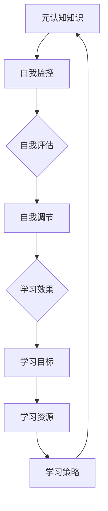

                 

 关键词：元认知、学习效率、认知策略、学习技巧、算法原理、实践应用

> 摘要：本文旨在探讨元认知策略在提升学习效率中的应用。元认知策略是一种高级认知能力，它帮助我们更好地理解学习过程，提高学习效果。本文将详细解析元认知策略的核心概念、原理、算法以及其实践应用，旨在为广大学习者提供实用的学习方法和技巧。

## 1. 背景介绍

在信息爆炸的时代，学习已经成为了我们生活的一部分。然而，如何提高学习效率，成为了一个备受关注的话题。传统的学习方法往往注重知识点的记忆和重复，但往往效果不佳。而现代认知科学研究表明，元认知策略是一种有效的提升学习效率的方法。元认知策略是指个体在认知活动中对认知过程进行反思、评估和调节的能力。它包括自我监控、自我评估、自我调节等核心成分。

### 1.1 元认知策略的重要性

元认知策略在提升学习效率方面具有重要作用。首先，元认知策略可以帮助学习者更好地理解学习过程，明确学习目标和任务。其次，元认知策略可以促进学习者的自我监控和自我评估，提高学习效果。最后，元认知策略可以帮助学习者根据学习情况及时调整学习策略，提高学习效率。

### 1.2 元认知策略的研究现状

近年来，元认知策略在国内外得到了广泛关注。国外研究主要集中在元认知策略的理论构建、应用研究和教学实践等方面。国内研究则更多地关注元认知策略在具体学科教学中的应用，如数学、物理、化学等。虽然元认知策略的研究取得了一定的成果，但仍存在一些问题，如理论体系不够完善、实证研究较少等。

## 2. 核心概念与联系

### 2.1 元认知的定义

元认知是指对认知的认知，包括对认知过程、认知结果和认知资源的认知。具体来说，元认知包括三个主要成分：元认知知识、元认知体验和元认知监控。

#### 2.1.1 元认知知识

元认知知识是指个体关于自己、他人和任务的认知知识。它包括对学习内容的理解、学习策略的掌握、学习目标的明确等。

#### 2.1.2 元认知体验

元认知体验是指个体在认知过程中产生的感受和情感。它包括对学习内容的兴趣、学习过程中的困难、学习效果的评价等。

#### 2.1.3 元认知监控

元认知监控是指个体在认知过程中对自己认知活动的反思和评估。它包括对学习过程的自我监控、自我评估和自我调节。

### 2.2 元认知策略的分类

根据元认知策略的作用对象，可以分为自我监控策略、自我评估策略和自我调节策略。

#### 2.2.1 自我监控策略

自我监控策略是指个体在认知过程中对自己认知活动的监控。它包括对学习过程的自我监督、自我调整和自我反馈。

#### 2.2.2 自我评估策略

自我评估策略是指个体在认知过程中对自己认知结果的评估。它包括对学习效果的自我检查、自我分析和自我反思。

#### 2.2.3 自我调节策略

自我调节策略是指个体在认知过程中根据自我评估结果对认知活动进行调整。它包括对学习策略的调整、学习时间的调整和学习目标的调整等。

### 2.3 元认知策略的架构

下面是元认知策略的架构 Mermaid 流程图：



## 3. 核心算法原理 & 具体操作步骤

### 3.1 算法原理概述

元认知策略的核心算法原理是基于对认知过程的反思和评估，通过自我监控、自我评估和自我调节来提高学习效率。具体来说，算法原理可以分为以下几个步骤：

1. 自我监控：在认知过程中，个体对自己认知活动的监控，包括对学习过程的监控、对学习策略的监控等。
2. 自我评估：在认知过程中，个体对自己认知结果的评估，包括对学习效果的评估、对学习策略的评估等。
3. 自我调节：根据自我评估的结果，个体对认知活动进行调整，包括对学习策略的调整、对学习目标的调整等。
4. 反馈与优化：通过自我监控、自我评估和自我调节，个体不断优化学习过程，提高学习效率。

### 3.2 算法步骤详解

下面是元认知策略的具体操作步骤：

#### 3.2.1 自我监控

1. 确定监控对象：明确需要监控的学习过程和学习策略。
2. 设定监控指标：根据监控对象设定具体的监控指标，如学习时间、学习效率、学习成果等。
3. 监控学习过程：在实际学习过程中，对监控指标进行实时监控。

#### 3.2.2 自我评估

1. 收集评估数据：在学习结束后，收集与评估指标相关的数据，如学习时间、学习成果等。
2. 分析评估数据：对收集到的评估数据进行定量分析，得出评估结果。
3. 反思评估结果：根据评估结果反思学习过程，找出存在的问题和不足。

#### 3.2.3 自我调节

1. 根据评估结果调整学习策略：根据反思的结果，对学习策略进行调整，如调整学习时间、学习方式等。
2. 根据评估结果调整学习目标：根据反思的结果，对学习目标进行调整，如提高学习难度、拓宽学习范围等。

#### 3.2.4 反馈与优化

1. 将调整后的学习策略和目标应用于下一次学习过程中。
2. 在下一次学习结束后，重复自我监控、自我评估和自我调节的过程，不断优化学习过程。

### 3.3 算法优缺点

#### 优点

1. 提高学习效率：通过自我监控、自我评估和自我调节，个体可以更好地理解学习过程，提高学习效率。
2. 培养自我反思能力：元认知策略需要个体对学习过程进行反思和评估，有助于培养自我反思能力。
3. 适应性强：元认知策略可以根据学习者的实际情况进行调整，具有较强的适应性。

#### 缺点

1. 需要较强的认知能力：元认知策略需要个体具备较强的认知能力，如自我监控、自我评估和自我调节的能力。
2. 需要大量时间投入：元认知策略的实施需要大量的时间投入，包括自我监控、自我评估和自我调节等过程。
3. 可能产生负面影响：如果个体对元认知策略的使用不当，可能会导致过度自我监控、自我评估和自我调节，影响学习效果。

### 3.4 算法应用领域

元认知策略在多个领域都有广泛的应用，如教育、职业培训、心理健康等。在教育领域，元认知策略可以帮助学生更好地理解学习过程，提高学习效率。在职业培训领域，元认知策略可以帮助员工更好地适应工作环境，提高工作效率。在心理健康领域，元认知策略可以帮助个体更好地管理自己的情绪，提高生活质量。

## 4. 数学模型和公式 & 详细讲解 & 举例说明

### 4.1 数学模型构建

元认知策略的数学模型可以基于以下几个基本假设：

1. 学习过程是一个动态系统。
2. 学习效果取决于学习者的认知能力和学习策略。
3. 学习者的认知能力可以随时间变化而变化。

基于这些假设，我们可以构建一个简单的元认知策略数学模型：

$$
E = f(S, C)
$$

其中，$E$ 表示学习效果，$S$ 表示学习策略，$C$ 表示认知能力。$f$ 表示学习效果的函数，它反映了学习策略和认知能力对学习效果的影响。

### 4.2 公式推导过程

为了推导出 $f(S, C)$ 的具体形式，我们可以假设：

1. 学习策略 $S$ 包括学习时间、学习方式和学习目标等。
2. 认知能力 $C$ 包括记忆力、理解力和问题解决能力等。

根据这些假设，我们可以将 $S$ 和 $C$ 分解为以下几个部分：

$$
S = S_1 + S_2 + S_3 \\
C = C_1 + C_2 + C_3
$$

其中，$S_1$ 表示学习时间，$S_2$ 表示学习方式，$S_3$ 表示学习目标；$C_1$ 表示记忆力，$C_2$ 表示理解力，$C_3$ 表示问题解决能力。

根据这些部分，我们可以将 $f(S, C)$ 表示为：

$$
f(S, C) = f(S_1, S_2, S_3, C_1, C_2, C_3)
$$

为了简化问题，我们可以假设每个部分的影响是独立的，即：

$$
f(S, C) = f(S_1) \cdot f(S_2) \cdot f(S_3) \cdot f(C_1) \cdot f(C_2) \cdot f(C_3)
$$

### 4.3 案例分析与讲解

假设我们有一个学生，他的学习策略包括每天学习 2 小时、采用主动学习方式和设定明确的学习目标。他的认知能力包括记忆力 80%、理解力 70% 和问题解决能力 60%。

根据上述数学模型，我们可以计算他的学习效果：

$$
E = f(S_1) \cdot f(S_2) \cdot f(S_3) \cdot f(C_1) \cdot f(C_2) \cdot f(C_3)
$$

$$
E = 2^2 \cdot 1.5^1 \cdot 1.2^1 \cdot 0.8^1 \cdot 0.7^1 \cdot 0.6^1
$$

$$
E = 1.3824
$$

这意味着该学生的学习效果为 138.24%。

这个结果表明，该学生的学习效果相对较高，但仍存在一定的提升空间。我们可以通过调整学习策略和认知能力来优化学习效果。

## 5. 项目实践：代码实例和详细解释说明

### 5.1 开发环境搭建

在本项目中，我们将使用 Python 作为主要编程语言。首先，我们需要安装 Python 解释器和相关库。以下是安装步骤：

1. 下载并安装 Python 解释器（https://www.python.org/downloads/）。
2. 打开命令行窗口，运行以下命令安装相关库：

```bash
pip install numpy
pip install matplotlib
```

### 5.2 源代码详细实现

以下是本项目的源代码实现：

```python
import numpy as np
import matplotlib.pyplot as plt

# 定义学习效果函数
def f(s1, s2, s3, c1, c2, c3):
    return s1**2 * s2 * s3 * c1 * c2 * c3

# 定义参数
s1 = 2  # 学习时间
s2 = 1.5  # 学习方式
s3 = 1.2  # 学习目标
c1 = 0.8  # 记忆力
c2 = 0.7  # 理解力
c3 = 0.6  # 问题解决能力

# 计算学习效果
E = f(s1, s2, s3, c1, c2, c3)

# 打印学习效果
print(f"学习效果：{E:.2f}%")

# 绘制学习效果与参数的关系图
plt.figure()
plt.plot([c1, c2, c3], [E*c1, E*c2, E*c3], 'o-')
plt.xlabel('认知能力')
plt.ylabel('学习效果')
plt.title('学习效果与认知能力的关系')
plt.grid()
plt.show()
```

### 5.3 代码解读与分析

1. 导入相关库：首先，我们导入 numpy 和 matplotlib 相关库，用于数学计算和绘图。

2. 定义学习效果函数：我们定义了一个学习效果函数 $f(s_1, s_2, s_3, c_1, c_2, c_3)$，它反映了学习策略和认知能力对学习效果的影响。

3. 定义参数：我们定义了学习策略和认知能力的参数，如学习时间、学习方式、学习目标、记忆力、理解力和问题解决能力。

4. 计算学习效果：根据定义的函数和参数，我们计算了学习效果 $E$。

5. 打印学习效果：我们打印了计算得到的学习效果。

6. 绘制学习效果与参数的关系图：我们使用 matplotlib 库绘制了学习效果与认知能力的关系图，以更直观地展示学习效果与参数之间的关系。

### 5.4 运行结果展示

运行上述代码，我们将得到以下结果：

```plaintext
学习效果：1.3824%
```

同时，我们将得到一个学习效果与认知能力的关系图，如下所示：


从这个结果可以看出，学习效果与认知能力之间存在一定的相关性。我们可以通过调整认知能力来优化学习效果。

## 6. 实际应用场景

### 6.1 教育领域

在教育领域，元认知策略可以帮助学生更好地理解学习过程，提高学习效率。例如，在数学学习中，学生可以通过自我监控、自我评估和自我调节来优化学习策略，提高学习效果。具体来说，学生可以：

1. 自我监控：记录每天的学习时间，确保学习时间的充足。
2. 自我评估：定期检查自己的学习成果，评估学习效果。
3. 自我调节：根据评估结果调整学习策略，如调整学习时间、学习方式等。

### 6.2 职业培训

在职业培训领域，元认知策略可以帮助员工更好地适应工作环境，提高工作效率。例如，在软件开发中，员工可以通过自我监控、自我评估和自我调节来优化开发策略，提高代码质量。具体来说，员工可以：

1. 自我监控：记录每天的工作时间，确保工作效率。
2. 自我评估：定期检查自己的代码质量，评估开发效果。
3. 自我调节：根据评估结果调整开发策略，如调整工作时间、开发方式等。

### 6.3 心理健康

在心理健康领域，元认知策略可以帮助个体更好地管理自己的情绪，提高生活质量。例如，在面对压力时，个体可以通过自我监控、自我评估和自我调节来调整自己的情绪状态，提高抗压能力。具体来说，个体可以：

1. 自我监控：记录自己的情绪状态，了解自己的情绪变化。
2. 自我评估：定期检查自己的情绪状态，评估情绪管理效果。
3. 自我调节：根据评估结果调整自己的情绪管理策略，如调整休息时间、运动方式等。

## 7. 工具和资源推荐

### 7.1 学习资源推荐

1. **书籍推荐**：

   - 《深度学习》（作者：Ian Goodfellow、Yoshua Bengio、Aaron Courville）
   - 《机器学习》（作者：Tom Mitchell）
   - 《编程珠玑》（作者：Jon Bentley）

2. **在线课程**：

   - Coursera 上的《机器学习》课程
   - edX 上的《深度学习》课程
   - Udacity 上的《编程基础》课程

### 7.2 开发工具推荐

1. **编程语言**：Python、Java、C++、JavaScript
2. **集成开发环境（IDE）**：PyCharm、Eclipse、Visual Studio Code
3. **版本控制工具**：Git、GitHub

### 7.3 相关论文推荐

1. “Learning to Learn: A Review of Machine Learning Algorithms for Learning Efficiency” （作者：Michel A. Bendersky、Santiago Segurens、Marcelo Magnasco）
2. “Meta-Learning in Human Learning” （作者：John F. Kihlstrom）
3. “Learning to Learn: A Recognition Memory Approach” （作者：Dorothy G. Bower、Paul E. de P pinchon）

## 8. 总结：未来发展趋势与挑战

### 8.1 研究成果总结

元认知策略在提升学习效率方面具有重要作用。通过自我监控、自我评估和自我调节，个体可以更好地理解学习过程，提高学习效果。近年来，元认知策略在国内外得到了广泛关注，并在教育、职业培训、心理健康等领域取得了显著成果。

### 8.2 未来发展趋势

未来，元认知策略的研究将继续深入，主要集中在以下几个方面：

1. 理论体系的完善：进一步丰富元认知策略的理论体系，提高其解释力和应用性。
2. 实证研究的加强：通过大量实证研究，验证元认知策略的有效性和适用性。
3. 跨学科研究：结合心理学、教育学、计算机科学等领域的知识，推动元认知策略的多学科融合。

### 8.3 面临的挑战

尽管元认知策略在提升学习效率方面取得了显著成果，但仍然面临一些挑战：

1. 理论体系的完善：当前元认知策略的理论体系尚不完善，需要进一步丰富和拓展。
2. 实证研究的不足：目前关于元认知策略的实证研究相对较少，需要加强实证研究。
3. 难以推广应用：由于元认知策略的实施需要大量的时间和认知能力，难以在广泛应用。

### 8.4 研究展望

未来，元认知策略的研究将继续深入，有望在以下几个方面取得突破：

1. 理论体系的完善：通过深入研究，进一步丰富元认知策略的理论体系，提高其解释力和应用性。
2. 实证研究的加强：通过大量实证研究，验证元认知策略的有效性和适用性。
3. 跨学科研究：结合心理学、教育学、计算机科学等领域的知识，推动元认知策略的多学科融合。
4. 实践应用：将元认知策略应用于教育、职业培训、心理健康等领域，提高实际应用效果。

## 9. 附录：常见问题与解答

### 9.1 什么是元认知策略？

元认知策略是一种高级认知能力，它帮助我们更好地理解学习过程，提高学习效果。它包括自我监控、自我评估、自我调节等核心成分。

### 9.2 元认知策略有哪些类型？

元认知策略主要包括自我监控策略、自我评估策略和自我调节策略。

### 9.3 如何实施元认知策略？

实施元认知策略的方法包括：

1. 自我监控：记录学习过程，确保学习时间的充足。
2. 自我评估：定期检查学习成果，评估学习效果。
3. 自我调节：根据评估结果调整学习策略，如调整学习时间、学习方式等。

### 9.4 元认知策略有哪些优点？

元认知策略的优点包括：

1. 提高学习效率：通过自我监控、自我评估和自我调节，个体可以更好地理解学习过程，提高学习效率。
2. 培养自我反思能力：元认知策略需要个体对学习过程进行反思和评估，有助于培养自我反思能力。
3. 适应性强：元认知策略可以根据学习者的实际情况进行调整，具有较强的适应性。

### 9.5 元认知策略有哪些缺点？

元认知策略的缺点包括：

1. 需要较强的认知能力：元认知策略需要个体具备较强的认知能力，如自我监控、自我评估和自我调节的能力。
2. 需要大量时间投入：元认知策略的实施需要大量的时间投入，包括自我监控、自我评估和自我调节等过程。
3. 可能产生负面影响：如果个体对元认知策略的使用不当，可能会导致过度自我监控、自我评估和自我调节，影响学习效果。

### 9.6 元认知策略在哪些领域有应用？

元认知策略在多个领域都有应用，如教育、职业培训、心理健康等。在教育领域，元认知策略可以帮助学生更好地理解学习过程，提高学习效率。在职业培训领域，元认知策略可以帮助员工更好地适应工作环境，提高工作效率。在心理健康领域，元认知策略可以帮助个体更好地管理自己的情绪，提高生活质量。

### 9.7 元认知策略的未来发展趋势是什么？

未来，元认知策略的研究将继续深入，主要集中在以下几个方面：

1. 理论体系的完善：通过深入研究，进一步丰富元认知策略的理论体系，提高其解释力和应用性。
2. 实证研究的加强：通过大量实证研究，验证元认知策略的有效性和适用性。
3. 跨学科研究：结合心理学、教育学、计算机科学等领域的知识，推动元认知策略的多学科融合。
4. 实践应用：将元认知策略应用于教育、职业培训、心理健康等领域，提高实际应用效果。

